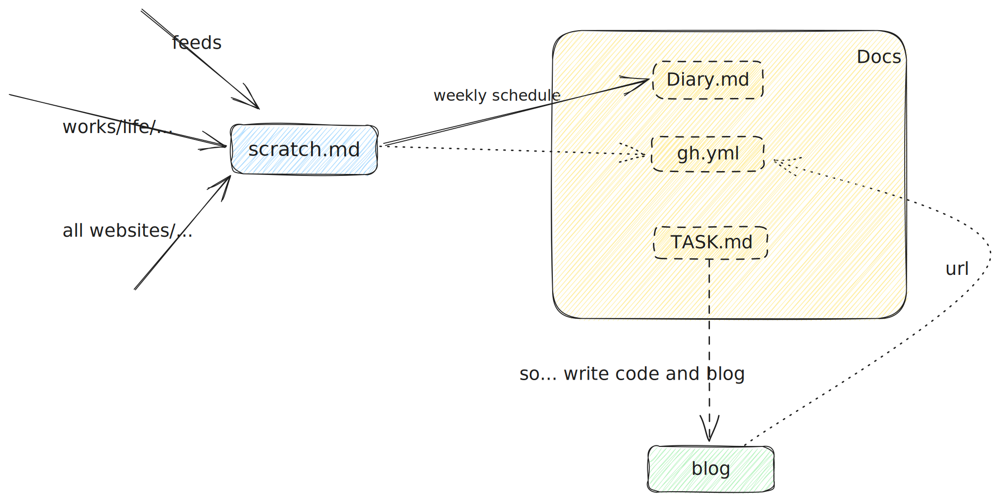

## How-To-Manage-Docs


:::tip
怎么管理笔记这个东西，老生常谈了，很简单的事情，但是二十年前就有人写，十年前有人写，再过三十年还是会有人写。

人类需要笔记来辅助思考。这篇博客就记录（主要是整理）一下目前对于笔记管理的一些认知和经验教训。
:::

## 笔记软件的选择


## 使用过哪些笔记软件？大概经过？

先说说这些年用过的笔记软件，最早用的是印象笔记，用了很长时间，但是印象笔记当时还不支持 md（当然现在印象笔记对 md 的支持还是一坨屎，毕竟要兼容的用户太多了，商业软件要做妥协嘛），接触到 md 之后使用 win 上的 OneNote，但是没用太长时间，没啥印象了，感觉不太好用。

工作之后使用 mac 后，试用了 mac 上的几个主流 md 软件，比如 Typora、Ulysses、Bear 什么的一大堆，反正都不太好用，都太轻量了，正常用来读写 md 问题不大，但是不适合用来做笔记管理，所以最终选择用 mweb。

用 mweb 好几年，从 v2 一直用到 v4，实话说还是很好用的。我算是重度用户吧，使用过程中也在 tg 上给 mweb 的开发者反馈过不少 bug（大概 20+ 是有的），真要说的话，缺点不少，但是还是一直在用，最终导致我弃用 mweb 的核心原因是，**我认为实际上没必要单独用一个软件来进行笔记管理（甚至这个软件还不好用）**。所以最终选择了直接用 IDE 作为笔记软件。


### 为什么不用双链笔记软件？

:::tip
比如 Roam Research、Logseq、Obsidian、Tana、MarginNote、Workflowy、Dynalist
:::

这些东西的心智负担都太重了，也很不灵活，并且实际上这些东西其实压根就不算是 md 笔记软件。

如果想更换笔记软件，迁移数据会很麻烦，不免有数据丢失和格式错乱。

这也很多“MD 原教旨主义者”讨厌这些双链笔记软件的原因。

**不要用形式上的清晰，掩盖知识的匮乏和头脑里的混乱。**


### 为什么一定要用 Markdown？

:::tip
而不是其他标记语言比如 AsciiDoc 或者 org-mode 呢？
:::

不然呢？

md 的缺点确实很多，其他标记语言相比于 md 也或多或少会解决一些 md 的痛点（比如表格格式化），然后呢？

生态差太多了，没有可比性。没得选。

:::tip
md 是最自由的，相比于 text 也有基本的样式支持。
:::


## 核心需求


- [x] 跨平台：支持所有平台，打开任何一台机器，都可以能接着之前的工作进行读写操作
- [x] 支持 Markdown：容易迁移
- [x] 支持侧栏 TOC
- [x] 性能好，渲染快：比如说 30w 字的文档也能快速渲染
- [x] 支持 git（以及自动备份）：本身支持 git 仓库，不需要手动推送
- [x] 操作直给，没有心智负担：可以很直观地管理笔记
- [x] 支持 TODO

---

除此之外还有

- 轻量化：软件小，占用资源少
- 栅栏布局（文件树/三栏布局）：文档库功能中文件夹和文件是栅栏布局，而不是直接展开
- 支持思维导图（PlantUML 之类的）
- 定制化强（支持各种插件）
- 图片管理（粘贴图片直接上传到 OSS）
- 支持分享（直接跳转到对应 block）
- 支持协作（评论功能）


[notable/notable: The Markdown-based note-taking app that doesn't suck.](https://github.com/notable/notable) 提供的各种笔记软件的comparison可以看看


## IDEA


### 为什么使用 IDEA 作为笔记软件？

- 经验复用：使用 IDEA 的很多经验可以复用，且 IDE 本身远比笔记软件更灵活、更强大。比如说 IDEA 内置的很多操作和快捷键都很好用（不可能有哪个笔记软件能支持这么多快捷键，比如打开文件/查找文件/格式化文件/文本替换/CMD+E 切换文件）
- TODO 标记：最需要的功能，可以快速追踪和定位，非常好用
- 可以像管理项目一样管理笔记
- ~~思维导图：用 PlantUML 画思维导图及各种 UML 图，实现 md 文档和思维导图结合；非常直观；~~


### 用 IDEA 做笔记存在哪些问题？怎么解决？

- [x] 最大的问题，theme 有问题，有点丑，~~没有合适的 theme，IDE 通常的黑色，写文档不是很舒服，怎么解决？ *直接用 solarized 作为 IDE 的 theme，然后把部分内容自定义到跟 mweb 样式相同。可以试试看是否可行？*~~  使用 `Monokai Pro主题` 后，简直打开新世界，很多功能都变得很舒服
- [x] 无序列表和有序列表缩进（正常应该都是 4 格缩进，但是在 goland 里无序列表 2 格，有序列表 3 格）？ ~~这个问题已经用`.eitorconfig`解决 *但是开启"markdown 自动辅助"之后，editorconfig 定义的缩进 4 格就变成 2 格了，离谱* 反正就是个决策，如果想继续用 goland 作为 md 编辑器，就改成 2 个呗~~ 默认使用 MD030 规则 fix 即可（2 或 3 个空格（分别用于有序列表和无序列表））
- [x] 怎么关闭"灯泡"（非常影响编辑（写代码还好，但是写文档就很干扰））？
- [x] 一些小问题，比如说输入""和``时，会出现两个？勾掉“智能键”中的“插入成对引号”就可以了
- [x] 无法输入中文双引号？ ~~目前用 alfred 的 snips 解决~~ Goland2023.1 已经修复该 bug，可以正常输入中文双引号了
- [x] 还有缺少部分高频快捷键（比如"无序列表"），怎么解决？没有快捷键，可以直接用“md 浮动工具栏”解决
- [ ] *goland 没有行边距？限制每行字数？* ~~这个是最难受的，每行都太长了（找到一个办法就是，*就是直接使用 Zen 模式，这个是有"行边距"的，想用这个需要对 idea 快捷键有一定的水平，巧了，在下正好对 idea 各种功能比较熟练*）~~ ~~编辑时开启“预览”即可，通过预览栏来减少编辑栏的宽度~~ 这个解决不了，goland 就是没有行边距，只能自己习惯了。
- [ ] 能否设置 structure 默认展开的层级？目前是默认展开两级。


### mweb

mweb 的优点就不提了，主要说说缺点：

- **开发者没有搞 issue 列表，也没有明确的排期，完全靠 tg 反馈 bug，效率太低了。没有 issue 列表就直接导致了 bug 略多，且修复速度很慢，用了 n 年但是很多 bug 还是没修。作者也明确说了不会搞 issue 清单。这点是最大的槽点。** 不说是搞个 Discourse 或者 Discord 社区了，一个笔记软件还不需要搞社区，最起码在 gh 上开个 repo，直接用内置的 issue 或者 discussion，这也是很多其他闭源软件采用的方式，最起码把很多使用经验和 bug 沉淀下来，也可以很大程度方便用户搜索和使用。
- 操作麻烦，快捷操作少，比如不支持直接快捷键打开文件，无法全局替换字符串等等操作（普通的 md 笔记软件，不可能比 IDE 方便）
- 默认使用的“文档库模式”会重命名 md 文件名，这个太傻了，因为我有用“文件锚点”的需求（这点可以用其内置的“文件 url”解决，但是无疑是加重了心智负担，非常傻。当然也可以通过 `外部模式` 解决，但是 `外部模式` 无法使用 mweb 的很多功能）
- 分 APP STORE 版本和官网版本，一个是在线验证，一个是密钥，不通用。我在 APP STORE 买的，用 homebrew 安装的官网版本，无法“恢复购买”，难搞。

---

- mweb 图片能否直接点击放大？如果不能的话，能否右键直接在 chrome 打开？或者右键添加“复制 url”的功能？


### obsidian

- 稳定性差，比如 toc 经常无法展示
- 渲染慢，软件还比较重
- 插件多，但是普遍质量一般，不好用
- 快捷键操作太少，也不方便


### vscode

用 vscode 作为 markdown 编辑器

- vscode 大部分插件都有一个特点：通过插件几乎支持所有需要的功能，但是都只能打 60 分，没有一个非常好用，非常影响体验（并且真要说轻量，装上一堆插件，也重的要命，还不如直接用 Goland）。
- 使用 vscode 作为 md 编辑器，有哪些不太适应的地方？需要调整字体大小（vscode 的字体不太正常，需要自己调整）、调整行距（之前行距太大，一页展示不了多少内容）、大纲默认展开、plantUML 渲染速度、最近编辑文件切换（类似 CMD+E，有类似快捷键 CTRL+TAB，需要改键）、阿里云 OSS 图片上传插件不好用
- vscode 的 markdown 实时预览（有几个插件，但是都不好用，并且跟其他 MD 插件（比如上传图片）不兼容）


### logseq

评价：logseq 不够灵活，心智负担也有点重。功能颇多，但是都不太好用，~~markmap 的灵活性和响应速度都不如 puml，优点是方便整合~~。至于 todo 管理、闪卡和双链之类的功能就算了。

~~原来这样 md 文件和 puml 文件一一对应，确实有些问题，有点太散了。用 logseq 能把这些思维导图整合起来。~~

~~尝试用 logseq 代替便签本~~ 失败

---

*logseq 作为 TODO 管理和 markmap 都是完全不合格的。*


## ***规范化 md 笔记***

:::tip
像管理项目一样管理“md 笔记”
:::

---

release

最重要的就是，打 tag，以及 release 说明

带来一个问题，**根据什么划分大版本和小版本？docs 文档分版本的逻辑？**

项目区分版本很简单，直接根据功能和 API 兼容性划分即可。那么笔记呢？

**我目前根据工作和生活的不同阶段来划分版本（比如说换了新工作、完成了某个 OKR 目标、日常学习中有了新方向或者新阶段等等）**


## 笔记的内容

:::tip
为什么相比于笔记软件的选择，我们需要更关心“怎么做笔记”？
:::

上面主要聊了聊关于“笔记软件的选择”，实际上这个东西嘛，无论好坏，用的顺手就行（用久了也就习惯了）。

除非工具有硬伤或者换个工具生产力有很大提升，否则换不换软件没什么意思。

**“笔记软件的选择”固然很重要，但是笔记软件的核心还是笔记的内容，不然即使用再牛逼的笔记软件，也还是“新瓶装旧酒”（实际上大概率是“新瓶装旧💩”）。不要做买椟还珠的蠢事**。

下面就来聊聊怎么记笔记，以及具体的一些规范。


### 笔记和博客

:::tip
首先，我们需要思考以下问题

**笔记分散更好还是集中更好？分别有什么优缺点？既要精简，又要好查，内容还要丰富，怎么做到？**

- 哪些内容适合记录到笔记？哪些内容适合记录到博客？笔记和 blog 的区别？
- 怎么处理曾经做过笔记的，现在已经过时的某个技术的相关文档？
- 认知提升和留痕：*笔记中是否有必要留下认知提升的过程（思考和使用的痕迹）？* 如果一个问题已经解决了，那么曾经的笔记还有意义吗？

:::


我目前的想法是：

笔记和博客是两码事。

- *笔记是自己用来整理知识体系的，厚积和薄发*
- 博客则是孤立的，比如针对工作中某个 case 的调研和解决方案以及根本原因；等等

*把过时技术的文档做成博客，笔记中贴上该技术的 url*

*没有意义；既然已经做到了，就不要记录是怎么实现的；记录一下思维的关键字即可，最多纪录一下思考路径*

---

通过上面三个问题，我们可以看到：

- **博客是更适合用来“留痕”的工具。**
- **笔记适合用来作为总结和结论，提纲挈领的骨架，不要面面俱到（很多东西一查就能查清楚，不要查完更糊涂了）。**

二者是互补的。

博客只需要记录当下的认知和想法，但是笔记一定是有个删改的过程的，需要一直更新，需要一直对其负责，否则就烂掉了。


### 笔记应该记录什么？

:::tip
***笔记不写什么，比写什么要重要一万倍***
:::

- 不写配置文件管理（比如环境部署之类的），*更容易查看（能 mac 全局使用），容易编辑（支持基本的换行格式），又可以集中管理？* 这些配置文件迁移了很多地方，一开始从多个项目抽到一个 repo 里集中管理，后来放到笔记里（分散管理），最后又放到 goland 的“实时模版”里，都不太合适。~~*目前用`MD折叠区`进行集中管理，算是可以勉强满足三个需求*~~ ~~存到 alfred 的 snip 里方便~~ *最终还是用`gh`+`workflow`管理更输入*，方便查看和编辑，也可以集中管理。
- 不罗列：比如 gh-actions 应该直接在 gh 里通过 star 管理；一些工具型网站 (包括官方文档等内容型工具) 应该通过 webstack 管理。
- 多写问题，而不是答案。“一个好问题比一百个答案更重要”。
- 不做多余的解释：要精练，解释没有意义（如果看到某个结论或者问题，思路跟不下去，说明不行）


### md 技巧

- *多用无序列表，而不是有序列表*
- ~~Markdown 换行：在该行的行尾添加`两个空格`（或者`</pre>`/`\`），当然我更习惯直接“显式换行”~~
- 在 IDEA 的 Markdown 中添加 TODO，注意如果不是默认 TODO 规则，需要在`Editor->TODO`里添加新规则
- Markdown 中添加注释：`[xxx]: # "xxxx"`
- ~~使用`CMD+option+L`来格式化 Markdown 文件；很方便；~~
- 文件之间跳转
- md 文件内跳转需要自定义锚点，比如`<span id=""></span>`或者`<a href=""></a>`标签才能跳转（*注意要在“预览模式”才能跳转*）

---


实际上就是 issue 中 md 的一些高级用法，*用各种方法提高 md 的表现力，精简 md 的文件结构*

- 多使用 checkbox
- *使用图片、Gif 动图还原 issue*
  - ``好处是可以更改图片长宽，这在移动设备截图中用处很大，因为移动设备截图通常高度很高，别人在阅览时候会占用大量的屏幕，通过缩小高度提高阅读量
  - `[!图片描述](图片url)`
- *使用折叠、展开，比如记录的日志文件*，内容很多需要折叠（`<details><<summary>xxx</details>`） （如果需要默认打开则`<details open>`）*但是不要滥用 fold，因为 fold 内容通常是不想在 toc 中展示的，不好索引，所以最好用来折叠不重要的内容如日志或者配置文件等*
- 使用表情 😂 👍
- 善用注脚

---

- 使用“铆点”无法双向链接？ *用页内跳转实现显式的双链*
- *md 的表格太差了，什么形式更好？* 外链？比如 notion 或者飞书之类的？
- 写笔记为什么需要加上 url？必要性？


---

其他

---

tips

问题 + 关键字 + 画图

思维框架 (第一反应/直觉/下意识/刻到 DNA 里)+多练 + 细节 (问题)

不要记录原因/过程/...

---

demo 本身是分散的，只代表自己操作过或者实现过；是用完就扔的
结论和心得，要写到笔记里

---

*现在以实践为主，所有的文档，我都要亲手实现一下，代码化、lib 化、项目化、工具化，这样才算真正的学会*，很多文档经过这样的学习之后，再遇到类似的问题，一看便知。靠记录和记忆的话，是永远处理不完这么多东西的

- *笔记就是要不断地删改*，新增一些东西的时候，要很谨慎
- 看到新帖子，直接在脑子里遍历一下相关知识点，如果搜索不到，就扣住帖子，先在 mweb 里相关知识点捋一遍，捋完之后，看看帖子有什么错误或者不完善的内容
- `就地歼灭`，不要再存各种图片、存各种书签
- 同一个问题，站在不同的角度看，重要性是不一样的。先问为什么要解决这个问题？有的问题太空了，需要知道我们为什么需要解决这个问题。再想想，文档或者答案是否正确，如果不对，为什么不对？

---

- 需要把笔记和代码相结合。笔记不应该是用来记录的，应该是用来总结的
- 实践是检验真理的唯一标准，尽信书则不如无书
- “是什么”的问题，都可以从源码里找到。“怎么做”的问题，都可以通过编写脚本 + 工具的方法解决
- 使用相关的，要想到相关代码
- 多用指的不仅是写几个 demo，而是用到平时写的项目里
- 勇于把知识用在工作中，勇于担责，不要怕出错

---

复制粘贴编程？如果不追问为什么，互联网上大多数技术内容都是胡扯


---

```markdown

[碰撞]

看别人的文章，应该是观点的碰撞，思路的对抗；而不是像个菜鸟一样全盘接受做笔记，应该多想想

想了想，"取法其上，得乎其中"，不仅要碰撞，还要打过去；证明他的观点是错的

想做到这个，就要求自己有知识框架，如果暂时没有 `知识框架`，也一定要有一个宏观的 `思考框架`
思考框架是通用的，宏观的；适用于很多方面；比如技术选型的基本思路/
知识框架是具体的，是细节的

---

但是上面的想法，并不太现实

因为如果真的知识有限，无力碰撞怎么办？是不是也只能全盘接受了？

举个例子，我们学一个新工具或者新技术，确实很懵，无力碰撞，怎么办？怎么应对？

[从知识点本身出发，也就是"第一性原理"]

- 问题
- 核心需求
- 技术选型
- 方案对比
- 实现原理

技术选型和核心需求是相对应的

```

---

- *少看技术文章，多想多实践*
  - 想清楚什么该学？什么不该学？抓大放小
  - 学而不做则罔，做而不学则殆
- 技术文章不要一行一行地看，直接看提纲；跟他碰撞，想想他会说什么
- 项目中的环境安装/服务部署/某工具的操作流程/http 请求/sql 语句之类的东西，尽量搞成文件，可复现，可复用
- "实操项目"一定要有"环境部署"之类的前置准备工作说明
- 技术选型或者分析方案时，把不同方案的优缺点，直接画表格列出来，就很清晰了

---

*笔记一定要集中，不要分散，不然不好查*（笔记和项目实操之间的关系）

- *抓大放小，不可能面面俱到*
- 笔记中每个技术栈的基本结构：*基本认知、实践规范和具体实践*，分别对应道法术


## [2023.11.04] 对 TODO 管理的新想法


:::tip
关于 TIL

之前犯了一个错误，一个错误，一个错误

文件很长，又不清理，就很烦。

临时文件>TIL，这里存在一个三级结构，临时文件>TIL>整理到 docs 里

scratch 类似随手记，大概是最近几天还没来得及整理的内容，每次完成任务后就要清理掉。整理到哪？大部分都应该整理到 TIL 里，反正不应该直接整理到 docs 里。

TIL 就像是一个大池子，里面的内容经过长时间消化之后，形成有结构的知识，可以写 blog 了或者写到 docs 里了，再输出出去。

这个东西我不想放到 TIL 里，不然就很蠢
:::

所以 ~~Task 更像是归档工具~~*Track 工具，而非归档工具。因为归档是有追溯功能的*，重心应该在 TIL，不要对 Task 产生压力。

---

**TIL 跟之前 TODO 标签的功能没有区别，但是把（未经整理，也暂时不需要整理的）内容更显式地放到前台。个人认为比直接加 TODO 更合理。**


---


**其实不如说的透彻一点，最大的痛点是有大量开始了，但是未完成的 Task**

---

之前 diary.md 是用来干这个的


:::danger
这么说的，如果把 TODO 管理看作是 track 工具，可能是更好的选择。

**也就是说 TODO 管理工具是用来记录已经完成的 Task，而非将要进行的 Task，将要进行的或者进行中的 Task 的应该在 scratch 里。**

所以 Task.md 里的任务应该有两类，已完成和已放弃的，不应该有“要进行”和“进行中”。

这样上面所说的痛点就不存在了，因为这个痛点不是换个好用的 TODO 工具，就可以解决的。这个痛点是客观存在的。

**应该说 TODO 管理无法解决这个痛点，所以说应该从 TODO 管理，变成 Track 工具。从前置工具，变成后置工具。**

:::

写到这，我发现，既然是用来追踪的，那么不妨直接把这个 Task.md 和 changelog 相结合，所以应该改文件名为 Track.md 了。

所以，**经过以上梳理**，我原本预想中的工作流：


**变成了更合理、更方便、更快捷、更没有压力的：**


## [2023/11/06] 统一入口，sidebar 即目录


回顾一下之前用“fold + 无序列表”整理

包括再之前，在 docsify 上用思维导图作为大纲，想用思维导图整理全部文档

**实际上是没有统一入口，导致的困扰和问题**

包括现在想用 golang-libs 作为统一入口

再包括

应该使用 markdown 作为统一入口，但是，其实用 golang-libs 作为统一入口也是不合理的，本质还是个暂存区

想想也知道 golang-libs 不可能作为入口

更应该做的就是“目录即统一入口”，golang-libs 应该作为一个“附属入口”

所以今天把几个模块彻底拆开了，否则 sidebar 放不下那么多文档。


## [2023/11/14]

:::tip
"Existence is Suffering"

docs also needs "Exit mechanism"

文档也需要有“退出机制”

no matter saved in github stars, no matter saved in TIL.md,

存到 TIL.md 只是把东西翻出来了，散了一地。让人及时清理。

:::


---


文档确实应该分散，之前 xxx，正确的做法应该是写一个 Outline 文件，把所有的文件 ref 进来，做成思维导图，而不是直接把所有文档合并到一个文档里，这样是很蠢的。这就是分散而统一。


多看看常用组件的源码，比翻一些没什么名气的 repo 的源码有用的多

---


现在又把文档分散开了，怎么统一管理起来是个问题

分散开了，就会存在一个很严重的问题：

- 如果一个技术点，跟两个文档都有关系，应该存在哪？
- 过了一段时间，这个技术点和存在哪个文档都有点忘了，会不会有把这个技术点在文档 B 又写一遍？

比如说

- “CentOS7 优化”的问题，就很有可能在 linux.md 里记录一遍，在 ansible 里又记录一遍
- mapstructure 这种与 map 和 struct 都有关系的 lib，应该放在哪个文档里？
- 再比如，各种语言都有 map 数据结构，如果有和 HashMap 交叉的内容，应该存在哪？golang 的 GC 相关内容，应该存在哪？

这个问题也不是一次两次了，目前就是通过 docs-training 来反复把各种文档翻出来，来熟悉这些东西

另外，就是“集中管理”也得做好

**核心点还是要熟悉 docs 里的内容，没事多看多整理，否则“分散”一定是搞不下去的。**

---

另外，就是一定要有“侧重文档”，举几个例子：

- 比如上面那个例子，把 struct.md 作为“侧重文档”，遇到相关问题，优先查这个文档


---

再另外，就是“前置存档”，比如说，有篇文章，大概意思我已经吃透了 7、8 成了，但是还没完全吃透，可以存进文档，但是又有些拿不准，这种情况可以把该文档从 TIL 里挪到另一个文件里，进行“前置存档”。

所以说，“前置存档”也是一种“退出机制”，之前所说的“退出机制”实际上是“后置存档”，也就是某个东西的相关文档已经没用了，直接存档掉。

这么做的好处有两点，首先，可以等完全吃透了再挪到文档里，其次，本身文档里的内容也是经常变更，没必要再徒增负担。


:::tip

可以把 TIL.md 理解为工作台，最好能够实时打扫干净

~~各种 archive 可以理解为各种读书笔记~~

:::


## [2023/11/15]


最近又加了一堆文档，就很烦，文档很分散

所以今天想了想，


今天在整理 algo 还有 redis 相关文档的时候，发现其实把这些文档（redis 和 golang 的数据结构相关内容）直接整理到 algo 里就可以了。其实有大量重复内容（可以缩减，也有大量新的内容不需要记录），并且触类旁通，会有新的启发和思考。


*做好足够底层的穿透思考，才能消除这些重复内容*

> 再比如，各种语言都有 map 数据结构，如果有和 HashMap 交叉的内容，应该存在哪？golang 的 GC 相关内容，应该存在哪？

昨天的这个问题，就有了答案。

- 各语言、组件 HashMap 相关的内容直接整理到 algo 里
- 各语言 GC 相关的内容就直接整理到 GC.md 里

很多时候，思考不到这层，还是站的不够高，所以做不到足够穿透思考。

所以一个新问题：并发相关的内容，是否可以整理到 linux 线程相关文档？并且和其他语言的并发机制进行对比？

---

其实也很好理解，我们在还不太了解一个知识点的情况下，

比如一个 redis 新手是很难理解到各种数据类型的底层数据结构，只能把这些内容整理到一起，看看别人的文章，也是一知半解。只有了解到一定程度，也对其他语言有了一些比较底层的思考之后，才豁然开朗，“哦，原来这些东西的底层内容是一样的！”，才会把这些内容（比较合理地）整理到一起。如果不了解这些内容的底层关系，就整理到一起，那就是瞎整理。


***说一千道一万，还是要把 algo 的基础打牢，很多问题都可以迎刃而解。所谓“基础不牢，地动山摇”。***

所以写代码，无非就这么几块：

:::tip

- algo:
- lang: 相当于做菜要用的刀，之前不是有个各种语言类比成各种刀的梗图嘛，实话说并不要求刀怎么样，能随心所欲地切菜不出问题就行，拼的是刀功（但是实话说刀和刀之间真的还是有很大差距的，用指甲刀砍人挺离谱的，这也是为啥想对靠谱的程序员都能熟练掌握多门语言，就像大厨做菜也不可能只用一把刀一样，片刀、切刀、剃刀、砍刀，都有各自最擅长的使用场景）
- arch: 就是数据库、缓存、微服务之类的东西，不要求深入了解所有组件的底层，但是至少要能够熟练使用，并且常用组件的底层是一定要懂的。
- works: 相当于业务

:::

---

大部分文档都是点对点地讲解知识点，不会告诉你这个点实际上是属于那个面的，是那个面的重要部分

这就是方法和方法论的区别


## [2023/11/18]

今天又看到一句话

> 记录本身就是力量


其实回想刚开始写代码的时候，那个时候记笔记只是为了记录一些经验教训，也是最自然、最符合直觉的。

但是这种笔记很难查找想要的内容，所以就把其中的一些内容开始分门别类地整理，就出现了“笔记”。

但是笔记搞的再好，也只是很小一部分知识，最多是经过自己思考、整理和沉淀的知识，但是本身和搜索引擎相比，还是差的太多了。只能说是沧海一粟。

所以无非就这么三种：

- 像写日记一样的纯粹记录
- 分门别类的笔记
- 主要依靠搜索

我今天的一个想法，***记录 + 笔记并行或许是最好的选择***

因为这些年尝试过很多方法，比如不断压缩，删改笔记，也有扩张扩展，什么都记一笔。但是都有很多问题，删改笔记，删掉了当时用不到，很多实际上很重要的内容。什么都记一笔，又不着重点。


---


其实更应该想想

logs 的格式应该怎么搞，才更方便查找

否则还会有反复


---


Used to stash task


## [2023/11/25]

最近开始执行上面说的“日志 + 笔记并行”的方法

感觉确实不错，可以很直观地看到每天做了什么，学到了什么。但是存在以下问题：


- log 文件按月分割，单文件确实太大了。我这个月实际上从 16 号才开始实践，到 25 号，[log-202311.md] 就从 L1600 到 L6100 了，整个文件就很卡。但是这也是因为刚刚开始搞，所以确实。所以，是否要按周来切分 log 文件？
- 是否需要记录所有内容？或者说，记录哪些内容？可以看到，内容相对于我，有高有低。有的内容，我们已经懂了的，我们可以居高临下地吐槽；有的内容，比较好懂，那么可以平等地仅作记录，或者发表想法；有的内容，只能跪着看，远不是在 log 所对应的时间内能够解决的，又应该怎么解决？
- log 里的内容是否要合并到 docs 里？哪些内容要合并到 docs 里？docs 里的内容又怎么退出？


可以尝试的解决方案：

- log 文件尝试按周分割，单文件太大确实会很不方便使用。当然，如果文件太多，也会不方便使用。所以要找到平衡点，并且想想 log 文件的退出机制（也就是什么情况下封存 log 文件）。**这点不需要多想，总会找到自己舒服的分割方式。**
- 默认不写到 docs 文件，需要在，否则 log 就又变成 docs 的前置，就很蠢。log 天然是分散的，最好还是能在 log 内解决，厚积而薄发，可以针对某些问题，写 blog 或者 docs，但是只是其中的极少数。


---

:::tip


去伪存真

其实代码相关的去伪存真，很早之前我就意识到了，但是一直没有做。

多看源码，多看一手资料，少看各种帖子


:::


---

[2023/12/2]


Separates the questions and docs? for examples,


## [2023/12/26]

There's

- logs, table and usage-frequency
- commands, tldr, "Don't Reinvent the Wheel"


---

In the past few days, I have transferred some contents that were previously in docs to logs.


ALL we should do is log, other than "docs". docs is not just a way for us to summarize similar problems, but the problem is that in most cases, the problems are not solved, or completed solved, and there are still infinite solutions that can be optimized, or these problems themselves are not question.

Actually the correct workflow should be "logs -> blog -> docs",


---


如果不是彻底掌握的知识，是不能放到docs里的。

在此基础上，docs中的内容最好是整理好的，换句话说，最好是清单形式的。

TASK.md 绝对是比之前用TODO管理任务要好得多的方案，所有任务一目了然，很清晰，并且可以直接标明优先级


---

之前docs里的内容都是一些简单堆积，相当部分的内容是完全没掌握的（大概30%），还有大概30%多到40%的内容是会，但是只会一点点，算是没有完全掌握，真正完全掌握的可能也就不到30%。这个就太离谱了，还要撑个空架子。

这两天把，发现确实很多内容是压根不怎么掌握的。

之前把东西一股脑全都塞到docs里，其实更多是“束之高阁”的感觉。东西放在哪，就感觉自己已经会了。而不是从使用的角度，或者更寻根究底、变化的角度来看待这些内容。

这么一想的话，好像docs没有什么存在的意义了。包括我又看了看docs里的内容，好像确实没什么意义了。

logs+qs+(blog) 可能是更好的选择。

之前的docs直接用qs，就可以提纲挈领。

至于blog嘛，想写就写，不想写也无所谓。


---

之前使用docs一个很大的痛点是

---

其实这里也有个悖论（又或者说它本身的成因），如果我们本身对docs的预期就是，用来查找，那么最终会怎么样？越是不熟悉、不懂的，就越是添加到docs里。越是会的，反而不会（也没必要）写到docs里。所以现状如何，也就可知了。

另外哈，类似golang各种数据类型的常用操作、正则之类这些确实比较高频的东西，难道不应该滚瓜烂熟吗？为什么还要写到docs里呢？


并且docs这种文档的问题在于，知识总是需要修修改改的，尤其是代码相关的东西，别说半年一年，可能一两个月，就有更好的优化方案，所以我之前这么写docs的话，很多东西往往是过时而不全面的，好一点的是新旧之间的叠加态。

还有就是

docs还不同于blog，blog的颗粒通常是很小的，会就是会，不会就是不会，但是我的一篇docs往往能写n篇blog，各种掌握程度不同的知识点嵌在一起，就很难搞了。


---

*单个问题的迁移性，比“直接从docs里提取问题”要好太多了。*

---


:::tip
我还想多写一条，我总说“虚假的掌控感”，docs就是一种典型的“虚假的掌控感”。


:::


---


用了两天多，快要把之前所有docs里的内容剃干净了

其实这次整理更多是继之前（的尝试证明是错误的，之后）

---

其实现在docs里的内容，除了上面说的完全不会的、半懂半不懂的，还有很多压根就没啥用的内容，也不知道怎么回事也被写到docs里了。又因为惯性，没有从docs里删掉，就一直以为很重要。就很蠢。


---

把内容写到yaml里，还是直接写到markdown里？

这个选择还真是挺有意思的。

写到yaml里，还需要通过pipeline转成markdown最终作为HTML展示，做成rss的feed。

但是我今天转念一想，其实我现在移动端用NetNewsWire就只是为了看docs.xml和interviews.xml两个feed。感觉属实没必要，直接做成HTML就好了啊（最好还能集成到docs项目里）。然后再转念一想，如果这样的话，还不如“直接写到markdown里”，不就可以直接展示在blog里了吗？

但是还记得整个docs项目是怎么来的吗？不就是现在一个文档里记录一些问题，然后就会添加一些相关细节，写着写着，单文件就放不下了，然后就拆成多文件。但是多文件的检索效率又很低，所以又根据topic，分成不同的分类。然后就成了现在这个docs项目。或者说，所有人的blog、笔记其实都是这么来的吗？难道我又要绕了一大圈，费了6、7年时间，又绕回去了吗？


除此之外，我们列举一下两者的区别：

先列举一下markdown的缺点：

- 两者最大的区别是，markdown对内容和格式太过于灵活了，yaml则约束更多。太灵活就会带来很多问题。
- 用yaml可以很方便地注释掉某个key，用markdown也能注释，但是很麻烦。


再说说用yaml的缺点（用markdown的好处）：

- 用yaml最大的问题是，没有markdown那样的highlight样式，字符串的样式是统一的，很容易弄混。


---


之所以这么整理笔记，其实还有一个理论“真正重要的内容，会自己不断出现的”，不需要自己假模假式地列出来，拿出来看。他自己就会不断出现在你面前。

因为整理笔记过程中，发现了很多实际上压根没啥用的东西，但是当时可能觉得这些内容挺重要的，就记录下来了。

如果用现在这种logs，这些内容就没什么用了，也能极大地避免在这些东西上浪费时间。


---

:::tip
那使用这套logs->qs，会存在哪些问题呢？
:::


```text
log-2023w45.md
log-2023w46.md
log-2023w47.md
log-2023w48.md
log-2023w49-w50.md
log-2023w51.md
log-2023w52.md
log-2024w1-w2.md
...

qs.yml

```

- qs.md 格式一定要规范，不要太，否则就会重蹈覆辙
- 对post要挑挑拣拣，不要什么都记录。什么鸡毛蒜皮的东西就不要写了。

---

粒度，事实上，通过这几天的整理，我发现“问题的粒度”是个特别有意思的问题，qs这种形式，天然适合大粒度的问题（比如横跨n种语言，进行各种比较，非常好的切入点，并且非常容易延伸出很多问题），但是对小粒度问题，就有点捉急了。

但是怎么说呢？


---

[2024/1/11]

一些想法，

实话说一直到今天还在整理之前的文档（虽然中间也搞了点其他东西），但是现在真是觉得之前做的那些笔记啊，真的全是狗屎。

比如我今天整理mysql HA相关的内容，


[2024/1/15]

把笔记搞成现在这样，也用了一段时间了。随手记录一些想法。

其实吧，其实这么搞也没那么好，比如说查之前的一些内容，肯定是比之前麻烦了，这是必然的。但是这个也是这么搞的好处。就像上面说的，之前那种方法，就是提供了一种“虚假的掌控感”。仿佛只要记录了，就会了。其实经过这么搞了之后发现，30%的内容确实是完全会的，压根没必要再像文档那样记录下来（因为会本能地再看，纯粹浪费时间），还有30%的内容半会半不会，以及30%的内容完全不会，只是搭了个架子，这部分内容如果这么搞就纯粹是自己骗自己了。

另外，把问题和答案拆开之后，还有一个之前没发现的好处：

如果把问题和答案放在一起，就会本能地放弃“思考”，转而去记忆，也不管答案是对是错。

经过这段时间，我发现只看问题，真的可以从“逻辑框架”出发，真的可以发散思考。同一个问题，真的可以想到很多之前没想到的角度。

再另外，现在这个时代，“一个好问题比一百个普通问题更重要，更远远超过一万行答案”，通过这么搞，就可以不断锤炼、组合、精简、丰富这些问题，从而得到更好的问题。


[2024/1/16]

加了图片，不知道会不会影响


[2024/1/20]


Task -> scratch -> logs


scratch -> logs

---

log 单文件最好不超过5000行，否则就很烦了


[2024/1/29]

一些感受：

软件就是对现实世界的抽象，一切实现或是基于linux或是本身在linux就已经有实现过了。

做的仍然不好的地方：还是之前的问题，

---

***算法属于元技能，kernel属于核心技能，其他的哪些（无论是ms 分布式架构还是mysql之类服务的源码）都属于附加技能***

或者说kernel属于内功，其他技能属于外功。算法属于元技能。


---

为啥现在这种搞法更好？

因为之前那种做法无法解决一个核心问题“如果之前笔记没用了，怎么办？如果想法变化了怎么办？”

那种“文档式”的笔记无法解决这个问题，也体现不出来想法和认知的变化。

*对某个知识点的想法会变化、认知会更新。*

---

***费曼读书法已经不适合现在这个知识膨胀的时代了，用问题而非“简单地复述或者总结”来提炼内容是更好的选择。***

说白了，用费曼读书法已经无法解决现代人需要的如此庞杂的知识了（看qs.md可知，即使只写question和keywords，现在也1000多行了）


## [2024/2/2]

```markdown
How to design qs-workflow?

- "ss" display all Level 2 Headings?
- markdown or yaml? Two sides of a coin.

yaml这样的结构化数据和markdown这样的非结构化数据

yaml的好处是，很好处理数据，不会出问题。问题在于

应该说，qs.md现在的问题在于“很难查询”，所以我希望能够借鉴gh-workflow的成功经验，给qs也搞个类似的workflow，

我现在的方法就是对“学而不思则罔，思而不学则怠”的实践，log和qs两手抓，双轨并进。

log只负责记录，然后再定期压缩和删改log里的内容。


这个事情不能急，或者说“急事慢做，事缓则圆”，这个事情预计1个月内搞定就算比较快的了。
```

[2024/2/6]

:::danger

图、类比、问题、关键字、源码

不要文字描述，文字描述是最蠢的，文字是苍白的

- 类比是为了通过生活中的例子，更形象地理解
- 图
- 问题和关键字
- 源码

:::


[2024/2/9]


:::tip

学而不思则罔，思而不学则怠

好记性不如烂笔头，真的吗？

从我的经验来说，套用上面的名言就是“烂笔头而不好记性则罔，好记性而不烂笔头则怠”

其实我想表达的是什么呢？
:::


:::danger

qs是某种参照，能够倒映出“是否学的东西都是目前需要的”

:::


## [2024/3/18]


- what?
  - types
  - state
  - mode
  - ~~changelog?~~
- why to use: compare(针对于when to use，基于各种requirements进行compare)
  - features(what problems does it resolve?)?
  - core requirements?
  - pros and cons?(common problems)
- when to use? usage scenarios
- how to use? : misuses, common operations
- how to implement? = how it works (= what happens when...): source code, basic components
- how to optimize?


3w3h

相当于从qs中再次抽象，或者说封装。

***这个就是方法论***


之前qs有个很大的问题——很乱，很多问题都是重复的，看的时候就很烦。用这种方法就可以解决。

这个也可以作为写各种技术文章的大概框架，各种内容直接往里塞就可以了。

事实上，我还可以给以上struct的每一项都再添加具体的

---


:::tip
应该说，之前还对我这种“”的方法有所疑虑，但是事实证明这个就是效率最高的方法

***把这些抽象概念具像化+直接看源码，就是最好的。通过具像化的类比构建一个非常易于理解的东西，画个图。再通过直接看源码看看是怎么实现的，加深理解。比之前看各种二手屎的作者本身也不知所云的各种抽象概念高到不知道哪里去了***。而不是看各种技术文章，各种二手屎。非常蠢。

因为各种技术文章往往是静态的、片面的，并且很有可能写文章的人自己也并不是真的懂（我看的blog太多了，实际上大部分人都并不懂，就天天写blog，纯有病）

:::


## [2024/3/29]

在想是否要合并logs和diary

两点原因：

- 首先，在log和diary和两个文件之间，频繁切换才能写东西，就很烦
- 其次，从之前删掉很多logs内容，想到的

---

- diary这样以year为单位来组织的形式，毫无疑问是更好的。为什么要屈从于goland本身无法加载大文件的缺陷？

***多写代码，多引用*** （就可以有效减少diary文档大小）

其实也是我本身就有点分不清log和diary。具体来说，我的日常生活就是写代码（所以“每日REVIEW”就不知道该写在log还是diary里了，之前很多都是混在一起写的），很多内容我之前也一直都放到log里，但是这些内容又并非完全是技术相关（比如alfred、IDE、blog的配置，又或者什么单纯是写的不错的技术评论文章（并非“源码解析”之类的纯技术文章）），所以直接合并在一起是合理的。


本身道理都是想通的，我在log里的很多想法，本身就颇有本应在diary里写的一些“想法和见解”。


:::tip
之前还有所怀疑，经过一段时间的试用后。

毫无疑问，用yaml这种结构化格式来组织数据，就是比markdown这种非结构化格式更好。甚至更灵活。
:::


## [2024/4/2]


把log和diary合并之后，

---


看了下“每日复盘”都是用excel、飞书或者notion模版之类的表格进行“每日复盘”（或者说tracker），没有基于markdown的，三点问题：

- 最重要的，我想看看能否借鉴一下notion，搞成基于markdown的“每日复盘”应该怎么搞。但是呢，基于notion模板的，实际上都跟TeamBition差不多（可以把PDCA理解为kanban的Doing, In Progress, Done之类的），甚至远远不如TB更直观和好用。但是作为用过三四年TB的老手，我只能说，基于这种第三方工具，最后数据必然是“看的心烦，一删了之”，那些个曾经花了大功夫写的东西，最后只能从TB的垃圾箱里找，根本起不到预想中的作用。
- 拓展第一点，如果用第三方工具搞这种的，就被平台绑死了，毫无数据迁移性可言（并且，基于第三方平台操作很麻烦，基于我的经验，用不了多长时间就不会继续用了，根本不可持续）。
- 应该是黑名单，而非白名单，否则就很繁琐（比如说无一例外地把什么早睡早起、不喝奶茶之类的需要打卡，非常繁琐，纯纯有病。你总不会每天还需要复盘“有没有吃午饭”这种事情吧。）

主要是不知道“该怎么在markdown文件中执行PDCA”

:::tip
尝试用yaml来标识PDCA，比markdown要好很多
:::


---

技术文章直接像fc2一样评论两句即可，别TM长篇大论了。之前那种还要摘录，逐条评论，就挺傻的。


---

把docs从docusaurus迁移到vitepress

咋说呢，docusaurus相比vitepress，RT更快、build更慢、UI见仁见智、生态相差不大、更robust和simple

对我来说，二者也都有足够让我不用的缺陷，docusaurus的TOC不是全局的，而是直接嵌入页面的，所以在mobile端不支持全局选择（在web端还好），就很麻烦。vitepress的问题是code block不支持Auto-Wrap，如果文本太长，即使在web端也需要horizontally scroll才能查看。

那么为啥最终还是选择迁移呢？

因为我之前没迁移是因为，想当然以为在web端查看docs更多，但是实际上，在web端我都是直接在IDE操作docs，不需要在网页端。实际上在mobile端使用docs更多。

---

*想了一下，实际上现在的qs.yml就相当于把最开始“分门别类”（就是什么Database, Arch, Lang之类按文件夹）的那套提出来了，优点当然很多（主要是更灵活了，并且也更方便进行反复思考和咀嚼，而不是“写个文档，之后看（而不是思考）”），不多说。*


---

用“食物的进食、消化和吸收”来类比笔记管理和知识的处理，是不合理的。


---

:::tip
搜索大于记录
:::


## ***[2024/4/6] 复盘之前笔记变更changelog***


:::tip

梳理一下我的docs的整个经历，我经过了从一开始“文档式”的分门别类地记录，，不得不说，低效且，并且这种低效是隐藏在表面“文档式”大而全的“良好感觉”下的，所以一用就是好几年，偶尔也对这种，但是除了这种方式，还有其他方式吗？

“至少‘文档式’还是比blog要好很多的，不是吗？首先没时间写blog，再则blog写过了，很多技术本身更新了之后，blog又无法修改，写了还不如不写，至少‘文档式’还是能不断删改的”，这是当时的想法。当时也确实意识不到还有更好的方法。

另外，吐槽一下，当时会把很多文档分门别类塞到不同topic的markdown文件中，就很耽误时间（其实翻看别人的各种博客，也总能看到类似我之前那种“文档式docs”的搞法，所以倒也不必太多懊悔，确实是挺正常的。本身这种形式就是一种很“直观”、很“必然”的选择）。关于“文档式”的方方面面之前已经吐槽很多，这里不多说。


再之后把docs分分合合，想要“集中又分散”，意识到了“一个好问题比一百个答案更重要”，想通过qs来整合内容，但是又不知道该怎么搞，只能慢慢尝试各种方案。

所以之后又搞了基于 qs+fold+github issues/rss 的方案，其实这个方案已经和现在的方案很类似了。但是问题也是显而易见的，

仍未脱离之前“文档式”的方案，只是把之前基于headings的让人看了头晕想吐的多层level作为“骨架”的markdown，换成了基于qs的（把对应的内容都fold掉），这样就让人感觉整篇文档的结构很清晰。

但是这种“清晰”仍然是虚假的，把docs从最开始的“文档式”换成“qs式”的也花了大概2~3个月，非常花时间，但是事实证明，这种方案是非常愚蠢的。种种问题，之前也吐槽过，不多说。

之后又恢复到之前的“文档式”，但是因为切过去又切回来的过程中，很多没啥用的内容删掉了，内容少了，就把之前分散在各种cate下的大概几十个md文件合并到十来个md文件，就感觉比之前能好用点。

就这么的，又这么用了一段时间。

有一天，我突发奇想，之前搞qs+fold失败了，但是qs的想法没啥问题，只是思路错了。

做了以下措施：

- 加了个TIL.md，用来记录今日学到的东西
- 加了个TASK.md，用来当TODO使用（解决了上面说的“要把各种技术文章网页分门别类”的问题）
-


所以就搞了qs.md，相应的，参照diary-xxx.md搞了个log-xxx.md，用来记录每天技术相关的一些想法。再之后，就是把之前“文档式”的笔记迁移到这个log里，在迁移过程中，顺便把各种知识点又顺了顺。整个过程也花了很多时间。

哦哦哦，在此之前还有一段时间的想法是“还是以docs为主，log.md只是记录一些想法，沉淀之后，还是需要迁移回docs里”（这点可以参考 [2023/11/25](#20231125)）

总之，到了12月底我就开始思考到底qs是继续用markdown还切换到yaml了，之后尝试切换到yaml看看。结果就打开了新世界的大门，结构化数据用来组织数据真的太舒服了。到1月底，开始把qs.md切换到qs.yml。

此时的“骨架”切到qs.yml了，但是“血肉”还是在log.md。但是log.md本身膨胀太快了，记得当时算了下，以week为单位，大概每个月就要输出一个8000行左右的文件（大概500k），也就是说每年6MB。且不说一直这么搞，最终整个docs会膨胀到多大。所以又开始“压缩”log的内容。

整个过年在家期间，都在整理笔记

再之后，突发奇想把gh.yml也搞成类似qs.yml的形式，可以作为qs.yml的archive使用。以及把log直接合并到diary里。也就是目前为止的情况，不多说。

:::


带来的问题就是，“diary以年为单位，文件肯定会变得很大，就很烦了”，怎么解决？

- 多写代码，多引用
- 拆blog出去


如果搞blog的话，之前存的那些个技术svg图片，就可以直接放大blog里了

***blog不要结构化，随便写写。一定不要结构化，否则就是重蹈覆辙。***

blog要是抽象的，足以不断写下去，可以不断更新的。比如说本文档，我会不断地探索更好的笔记方案。又比如说某个技术相关的，比如说MQ相关的，一些想法会不断更新、修改。


所谓“厚积而薄防”，blog就是薄发，偶尔的、情绪化的、非结构化的，随手写一条

*既然这么安排现在的workflow的话，还是要多想想diary和blog之间的关系*


:::tip

给最近docs相关最担心的两个问题下个结论：

决定不公开blog

为什么要公开blog呢？有什么意义呢？公开后不可避免地会增加一些无形的压力，真的不太好。我不是一个喜欢在公开场所输出观点的人。

---

另外，细算了一下，***其实并没必要太担心diary会膨胀太快***。

最近把log合并到diary之后，就很担心是否会膨胀太快，都不敢随意在diary里输出了。

但是细算一下，一年365天，单文件2w行左右其实并不会很卡，也就是平均每天60行都是ok的。其实问题不大。

:::


---

昨天把一些之前diary里的内容，提到了blog里。

主要还是意识到，之前说过太多重复的话，写过太多重复的东西了。像blog.md一样，提到一个文件里，希望能有效避免重复。


---


:::tip
~~gh.yml的退出机制~~

gh.yml不需要退出机制。不需要时直接注释掉即可，~~不要挪到其他文件里~~ 挪到gh.bak.yml里。一定要“集中式管理”。

:::


---


*怎么整理golang各种ds的常见用法？以及各种std的用法？*


---

:::tip
早上突然意识到，现在用qs+code的这套做法，其实就是“事在四方，要在中央。圣人执要，四方来效。”的实践

也就是我一直追求的“集中又分散”

再则，笔记整理也正如权力，要收放自如，“放得下去，收得上来”。之前很多方法（正如昨天早上梳理的）也是为了更好地实现这个目标，但是可以看到“目标类似，亦有差距”

:::


---


其实就是

用gh.yml最大的好处是，可以给当前对某个技术的水平进行存档，某个技术彻底不用之后也可以进行存档，更灵活。

重复

***之前这段时间直接用log管理代码相关的，太过于“分散”了。幸亏发现问题还算早。***

---

刚刚洗澡时想到，最关键的核心是一定要“两只脚走路”。

如果把所有内容都提到qs里，也是不合理的。

:::tip

*qs不是万能药，需要正确认识qs*

我之所以现在觉得qs很好，是因为“厚积而薄发”，我之前“积”的太多了，“发”的太少。而qs就是用来“发”的。

---

书应该越读越少，而不是越读越多。应该说，我手头一直有大量各种技术文档是好事，但是确实有点被困在这些文档里了。看完文档总是有一种“似懂非懂”的感觉。实际上还是写代码太少，看文档太多。

有一个观点，越想越清楚，“”。

确实这些烦恼都是自找的

---

再则，凡事都有两面，qs的核心其实也在于修改

很多时候，产生qs是因为疑惑，一旦这个疑惑解开了，就感觉这个qs没用了，实际上呢？


:::

---


:::tip

怎么整理golang std的那些个用法，比如slog, json, os, bytes, slices之类的？

那一些代码又放到哪比较好？

:::


---

其实devc下面存档的这些代码，都没啥意思。

---

:::tip
目前qs.yml相比于gh.yml的粒度太粗了，比如说目前qs.yml的circuit里都是hystrix的问题，怎么搞？

毫无疑问，gh.yml这种粒度的更合适，既可以具体到某个repo，又有type层面的。需要拉qs时，直接merge一下就可以了。


我目前能想到的两种解决方案：

- 直接把qs.yml合并到gh.yml，新增一个`md: bool`来控制是否在qs展示

但是这么搞，也有问题，比如说shop、user、PM之类的跟gh没啥关系的非技术相关的东西（甚至kernel相关的），就没办法这么搞了

所以，是否可以用yaml2md时做一个merge，也就是把gh.yml中带有 `md: true` 的和qs.yml的合并展示在qs.md中？

---

其实这样也好，之后qs.yml里就是三块内容，algo, kernel, lang. 也就是我常说的 元技能、内功、核心刀法（也属于外功）

gh.yml里就用来存其他外功

---

qs本身也是我极简主义中“提高使用频率”的实践


:::

---

现在痛苦的根源是从啥时候开始的？

每天处理不玩的各种技术文档，让人真的头疼。从过年回家期间，

再则，我也有点搞不清楚


---


***折腾了好几天之后发现，其实之前按照log那种方法也没啥问题，真正问题在于没有落实，而qs就是一个“重在落实”的方法（或者说机制）***


---

:::tip
昨晚整理笔记，还是启用了blog。直接把algo和lang之类的整理到blog里了。

反思了一下，用log的方法的问题并不好。不仅在于“内容膨胀过快”，更在于“没有分门别类”。

或者说其实用log的时候也没啥问题，问题在于当时没有用qs来总结当天学到的东西，并且及时复习，导致学了就忘，当时感觉会了。

再则其实用log之前，分门别类其实也没啥大问题，确实应该分门别类。但是现在看来，这两种方法都差了一点点，“差之毫厘，失之千里”了。

***其实仔细想想，之前两种方法没有qs，就是完全不一样，并不是“差之毫厘”。***

之前2019年的时候也尝试过使用qs，但是后来就放弃了，究其原因

- ***qs是需要上下文的***，就像我们深入思考一个问题，一定是在不断深入地过程中，抛出一个一个问题，才能真正理解。而qs脱离了上下文就很难形成思路。
- 之前的qs，如果搞懂了或者不搞的话，没办法暂时去掉。现在用yaml来组织文档，就很舒服了。
- 再则，之前那种有点“空对空”，现在这个qs则是基于gh repo的，则非常落地

---

- 应该确保问题在qs.yml中已经处理过了，再放到gh.yml里。gh.yml不是藏污纳垢的地方。


---

今天搞了kernel.md, algo.md, work.md, lang.md

之后就按照现在blog.md的写法写这几个文档就ok了

:::


## [2024/5/30]

其实挺尴尬的，需要对gh.yml重新定位

这几天一直在纠结这个事情，并且也不只是所谓的“退出机制”

“退出”最好的方法，毫无疑问是，写篇blog，把URL贴回gh.yml。这点是毫无疑问的，但是这点

***应该说，我对gh.yml的定位，始终是，某种“目录”。*** 但是具体怎么操作呢？

首先，这个文件绝不可能是早先预想中的ALL-In-One的，“吾生也有涯，而知也无涯。以有涯随无涯，殆已。”

也不如各种awesome项目，如果在gh.yml来收集各种repo，那就舍本逐末了，因为其价值并不在此


但是，如果走向相反的方向，只留一些日常高频使用的repo呢？

不得不说，我的想法也在维护gh.yml的过程中，有所变化


- 对gh.yml也应该遵循极简主义，否则就是徒增烦恼

---

所以这段时间，在把一些用不到的工具，该删掉的直接删掉，该写blog对比后汰劣留良、去芜存菁的，就写个blog记录一下。

这玩意慢慢搞吧，反正也不着急。

---

现在gh.yml的repo结构有问题

之前的这种目录结构基于repo之间是平行、平等的，但是毫无疑问不是这样的。

比如说

这也是符合人类通常的思考方式的，比如说我想去跳转到 homebrew-cask-upgrade，看看其具体实现，那一定是先想到搜homebrew，再看看其具体。这样的话，如果像 homebrew-cask-upgrade 这样的，还算好，如果没有homebrew这个prefix的话，就很难搜到了。所以我在docs-alfred里加个了根据#tag进行搜索，实际上就是为了处理这种情况。但是并无法彻底处理掉这种场景。

---


## [2024/6/1] archive blog stack

:::tip
blog不应该用SPA
:::

:::tip
Docusaurus, VitePress 还是 Astro?
:::


```mdx-code-block
<Tabs>
<TabItem value="SPA">
```

```yaml

# vitepress

- url: https://github.com/vuejs/vitepress
  des: |
    vitepress基于vue3+vite，vuepress基于vue2+webpack。之后 vue 团队将会主要更新 vitepress. 但是也有一些缺点，code block的语言很少，items的语法需要修改，markdown的code block没有自动换行。生态方面，没有类似image-zoom这样的插件，不支持plantUML。总之就是custom还差挺多的。其他的应该还好吧。
    因为最近在移动端看docs比较多，而docusaurus移动端的TOC确实不行，而vitepress的TOC确实不错，所以就像试试看能不能切换到vitepress。
    大概用了20min吧，又体验了一下vitepress，目前相比于docusaurus的缺点：

    - 页面加载速度不如docusaurus，即使是一些内容不多的页面，也会明显感到卡一下才能加载出来
    - vite和babel+webpack貌似还是有些区别，有个页面在vitepress不能work，懒得处理了
    - vitepress的TOC也有bug（滑动TOC时，页面会跟着滑动）
    - 之前CodeBlock里没有自动换行的需求，还是没有
    - 其他的问题，比如CodeBlock的自定义语言支持、PlantUML之类的就不说了。


#- url: https://github.com/airene/vitepress-blog-pure
#  des: 一般般吧


---

# docusaurus

- url: https://github.com/kuizuo/blog
  des: 目前能找到的最好的docusaurus blog theme，我的blog也是用的这个。试用了hugo之类的各种blog framework，以及Gmeek这种gh-based的（基于issue创建文档太逆天了，不能直接手动添加md来触发build，并且使用utterances实现评论，把issue搞的非常乱。也不支持TOC和列表式Archive，UI也很丑），都不太行。又试用了一下，他这个侵入性太多了，后期不好更新版本，所以自己用blog-only模式自己搞一个，保留该repo作为参考。


```

```mdx-code-block
</TabItem>
<TabItem value="astro">
```

```yaml

# astro

- url: https://github.com/withastro/astro
  des: |
    MPA，很多基础功能没有内置，比如“代码块复制按钮”
    玩了一天之后，就直接迁移回 Docusaurus 了
    经过体验，有一个观点，Docusaurus 和 Astro 最大的区别就是，一个是 SPA 应用，一个是 MPA 应用。
    MPA 应用的体验真的挺差的。即使做了 prefetch 和 SSR 等各种优化，仍然很慢。**习惯了 Docusaurus 之类 SPA 应用的丝滑体验，真是受不了这种卡卡卡的感觉。

    - SPA 本地，可以看到普遍 100ms 以内
    - MAP 本地，可以看到普遍 500ms~600ms，已经配置 prefetch，但是还是没法走缓存
    - MPA 服务端，服务端比本地更慢，普遍 700ms 以外

    除了加载很慢，还有 MPA 会导致 sidebar 每次刷新，都会回到最上边，就很烦。

    其次就是与 Astro 定制性高，相应的也比较复杂，不懂 ts 的话，各种报错，很难处理。用起来不如 Docusaurus 舒服。**Docusaurus 也比 Astro 要稳定很多，astro 很多都是运行时报错，会直接宕机就很烦。**

- url: https://github.com/withastro/starlight
- url: https://github.com/HiDeoo/starlight-blog
  des: 基本上1:1复制了docusaurus的blog module，非常垃圾不好用

- url: https://github.com/cirry/astro-yi
  des: 这个astro的blog theme真心不错

- url: https://github.com/manuelernestog/astrofy
  des: 没有TOC

- url: https://github.com/chrismwilliams/astro-theme-cactus
  des: 还不错，有TOC

- url: https://github.com/satnaing/astro-paper
  des: astro实现的paper theme嘛
- url: https://github.com/ogzhanolguncu/ogzhanolguncu.com
  des: 也是Paper Theme
- url: https://github.com/markhorn-dev/astro-nano
  des: 类似Paper Theme

- url: https://github.com/saicaca/fuwari

#- url: https://github.com/Princesseuh/erika.florist
#  des: 很垃圾，不好用

```

```mdx-code-block
</TabItem>
<TabItem value="hugo">
```

```yaml
# hugo

- url: https://github.com/gohugoio/hugo
  des: 试用过很多次，但是可能确实天生八字不合，用过的theme包括但不限于 jane, hugo-bearblog, LoveIt, hugo-paper, hugo-paperMod, hugo-PaperModX, hugo-theme-stack, hugo-theme-nostyleplease. 可以看到要不就是neat到TOC和archive都不支持，要不就是LoveIt这种很重的。
  qs:
    - q: 比较静态博客和动态博客的优缺点 # WordPress/Typecho/sonic
    - q: Compare hugo, halo, hexo, Jekyll, astro.
    - q: 每个文档都需要手动写 meta 数据

- url: https://github.com/xianmin/hugo-theme-jane

- url: https://github.com/adityatelange/hugo-PaperMod
- url: https://github.com/reorx/hugo-PaperModX


- url: https://github.com/AmazingRise/hugo-theme-diary
  des: 不支持admonitions，其他都ok


```

```mdx-code-block
</TabItem>
<TabItem value="hexo">
```

```yaml
# hexo

- url: https://github.com/next-theme/hexo-theme-next
  des: hexo-theme-next
- url: https://github.com/ahonn/hexo-theme-even
  des: hexo-theme-even
- url: https://github.com/fluid-dev/hexo-theme-fluid
  des: hexo-theme-fluid. MUI风格的hexo主题

```

```mdx-code-block
</TabItem>
</Tabs>
```


### 切换SSG之前，需要考虑哪些checklist

:::tip

- support "docs mode",
- plantUML,
- image zoom,
- code block?,
- admonitions syntax,
- Tabs(items) syntax

:::


## [2024/7/13]

[探索一种长期可靠的笔记方案 - 讨论分享 - 小众软件官方论坛](https://meta.appinn.net/t/topic/58684) 楼主的问题是，“怎么多端同步笔记？”，给出的方案是git。可以看到大家都有自己管理笔记的方案。用 obsidian + obsidian-git 实现同步的。用dropbox之类的网盘实现同步的。用 syncthing 这种多端同步软件的。

```markdown
1. 笔记管理其实是一个NP问题 (问题有妥善的解法, 但是问题涉及的规模越大, 解法越复杂, 解题所需要的成本越高)

...

2. 与其想办法如何把所有的笔记信息都集中在一起, 形成一个大而全的文件系统.

关于仅供参考和记录的笔记

PC 上的笔记是最全面的. 我主要用 Obsidian 管理. Obsidian下分了好几个板块和笔记仓库, 我就不一一介绍了. 从网络上收集到的文章, 我用:

1. 「Omnivore」, 这是一个类似于 Pocket 的稍后阅读服务, 就是把当前网页收藏到指定第三方服务器, 然后自己可以在 Omnivore 的 APP, 网页或者通过Obsidian同步来对收藏起来的文章做高亮或者批注.

2. 「把当前网页下载为MarkDown格式」和「下载视频Ass格式的字幕」的浏览器扩展, 把下载好的文件稍作修改, 然后一同转移到 Obsidian 的 Inbox 笔记仓库当中.

...
```

“笔记管理其实是一个NP问题” 这个观点有点意思

我现在的方案很简单，docs + blog

- docs里就是两部分，日记 + yaml
- blog用来输出，可以看做是docs的一部分，写完之后，再把url贴回yaml。这样就可以让docs很精简。

具体方案

- 不用笔记软件，直接用IDE
- docs和blog直接渲染成网站，来保证跨平台
- 直接用git手动同步
- 规范化markdown笔记

经过长时间的实践，如果想“既要结构精简，又要内容丰富”，目前来看这个是最佳实践。


## [2024/7/21] dd

[【知识管理】“知识检索”谈起：从“公域”到“私域”_哔哩哔哩_bilibili](https://www.bilibili.com/video/BV1MJ4m1u7Co/)

看完这个视频，带来两个思考：

- 6:00 中聊到的“存难取易”还是“存易取难”的tradeoff有点意思，颇有启发。其实就是上面说的“笔记管理其实是一个NP问题”。
- 16:18 中聊到的观点“需要‘第二大脑’作为‘私域’，来存储已经处理过的信息”，但是个人目前更认同的“搜索大于记录”。

根据tag或者关键字来进行聚合信息和数据

根据我的经验，笔记的不断膨胀是必然的。所以我分化出了docs和blog两部分，docs是精简的，blog则用来。用docs管理blog。之前我把大量的时间花费在维护笔记上，比如修改过时技术文档、删除没用的stack的文档。只有这样才能保证“既要结构精简，又要内容丰富”


卡片笔记法，其实和“费曼学习法”没啥区别。其实核心都是 简化和提炼复杂内容为自己的理解，并加以重复。区别只在于用来“重复”的方法不同，“卡片笔记法”是做成卡片，自己重复，类似“艾宾浩斯遗忘曲线”。而“费曼笔记法”则是不断给别人讲解。我认为“费曼笔记法”更靠谱。因为“形式上的清晰，无法掩盖知识的匮乏和头脑里的混乱”。

local first而不是SaaS服务

[【知识管理】分享我做知识管理的闭环全流程_哔哩哔哩_bilibili](https://www.bilibili.com/video/BV1hz421i7kB/) 这个视频主要是从输入到输出的知识管理全流程，也是老生常谈了。这个视频对我没啥帮助，我也没啥感想。仅作记录。


---

[找笔记方便、写作又给力的知识库，我是这么搭建出来的 - 少数派](https://sspai.com/post/77144)


---


[基于这个痛点，想做一个笔记软件 - V2EX](https://v2ex.com/t/1060639#reply14)


## [2024/7/27]

最近又对xxx进行了优化。还是折腾docs-alfred，没动docs结构。

之前gh.yml里不是用 `md: true` 来标识是否用yaml2md渲染为markdown嘛

这么做带来的问题就是，无法在markdown中完全展示yaml中的内容，导致很多yaml中的内容写过就忘了。所以就移除掉这个标识了，改为展示全部。之后又因为如果展示gh.yml的全部内容，gh.md就很大，所以就对gh.yml做了拆分。

***并且优化了对qs的url的渲染，这样yaml就更像“目录”了，`q+u` 可以直接链接到某个问题的详细答案， `x` 展示自己对该问题的简要回答，或者只是关键字（某种“费曼学习法”）***

个人认为这个方法特别好，确实能够实现我需要的“既精简，又丰富”

基于此，我对blog存在的价值也产生了一些疑问。我不喜欢写什么“操作类”或者“源码解析类”的blog，因为这类blog一抓一大把，没必要自己写。自己写也未必就比别人写的好，还花时间。

---

之所以基于yaml来整理笔记，就是因为笔记一旦膨胀到一定程度之后，

***docs缺乏时序，***

认知迭代之后，很多内容都需要删改。以往堆积的越多，删改时需要

x就是写结论，或者说对某篇文档的总结

***docs 频率，删改，很难***

docs天然膨胀，做成yaml之后则天然“由厚变薄”


欠重复，知道为啥之前重复不懂吗？就是太多了

最近把之前的gh.yml拆分成，又多了一些想法：

- 落地，很多之前的文档，基于xxxx无限膨胀，所以无法重复，无法落地


*其实现在这种使用yaml组织，就是换了个方式实现之前的markdown fold了*

---

笔记，墒增、墒减

外部性

最理想的状态当然是只有qs，最多有个url

比如说slice操作不是很多嘛，那就专门写篇blog，然后把blog的url贴到yaml里

***现在这套基于yaml的docs确实也没办法保证一致性，但是相比之下，之前的xxx是完全无法做到一致性***

说白了，就是上面说的，通过把“不好的东西”转移出去，来维持自身的“墒减”

*“对抗熵增的底层逻辑熵增是发生在封闭系统之内的，所以，避免和反抗熵增的有效方法就是，建立一个能和外界不断进行能量，信息和物质交换的、流动的开放系统。这个开放系统的学名叫‘耗散结构’”*

而yaml天然具有这种内聚性，天然需要压缩内容

这里“不好的东西”就是在第三方平台写blog，因为我不需要为这些内容负责。之前无论是自己维护笔记（docs之前）还是再之后的docs，还是自己部署blog，都想不停地删改内容。但是又因为内容太多，就不停地有事干。但是干的又往往是无用功。***如果把这部分东西转移出去，但是又用yaml维护一个类似index/目录的东西，就可以“既要又要”了***


---

关于blog的想法变了，这两天在想是否有必要自己维护一个blog，所以把之前自己维护的blog废掉了，打算随便找个技术社区写blog好了

最终选择把blog放到gist，原因如下：

- 技术社区只能写技术文章，其他文章还要换平台。*如果用gist，随便写什么都可以，不限制内容*
- 上传svg到掘金之后，就变成webp了。sf则无法上传svg图片。*实测gist支持上传svg*
- sf不支持toc，掘金的几种theme都太丑了


:::danger

- ***写blog对我来说就是倒垃圾***
- 只记流程的关键步骤，也就是kw
- ***works里的最终都要写代码***
- 一图胜千言，没图你说个jb
- 关于url的选择：只做成kv，也就是只有1个url，不断择优。*也就是只有1个url*
- 不断精简qs

:::


## [2024/8/16]

:::tip
我把一部分repo放到“核心repo”的qs里了
:::

目前gh.yml结构如下：

type - repo - qs

也就是说，还是以repo为核心的

但是发现现在这种gh.yml的结构，其实很难找到真正需要的repo

之前这种只适合本身就知道repo名称，就能够快速跳转到目标repo的gh页面，但是如果不知道repo名称，就很麻烦了

举个例子，我需要找 pgsql 的 search插件，如果我不知道其具体名称。按照现在gh.yml的结构，我只能搜索 #RDB，再逐个筛选，最后找到 paradedb，就很麻烦

按照修改后的做法，直接搜索“核心repo”，在其qs里找到对应问题对应的repo即可。更清晰。

*可以认为是某种“折中”的产物，因为当时确实有大量的*


---


## [2024/9]

### [2024/9/2]

晚上散步把这个文档从头到尾看了一下，以下感想：

- “前置存档”，现在其实就用TASK.md解决这个问题了
- scratch和流程，
- yaml和markdown，归根到底是结构化文件可以轻易转化为非结构化文件，反之则不然
- 之所以用gist，最关键的就是gist是分散的，没有负担（随时引用，还不需要维护）


现在这种做法，可能存在哪些问题？

- gist可能过于分散了
- 需要提前想好，在什么情况下切掉当前gist，重开一个新的？
- 到底是u还是x? u的好处是，x的好处是直观，缺点是


:::tip
下一步，我想能不能把qs里的q做成结构化的？

因为本身大问题就可以拆分成小问题，不是吗？

:::


---


使用yaml这种结构化数据最大的好处，除了之前说的“可以随时转化为html或者markdown等非结构化数据，反之则不然”以外，***最大的好处是不需要在乎render成什么，随时可以渲染为其他样式，迁移性比md还高***


### [2024/9/10]





