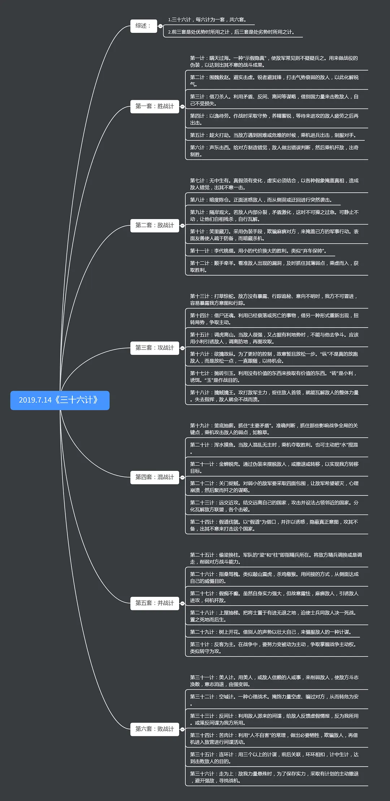
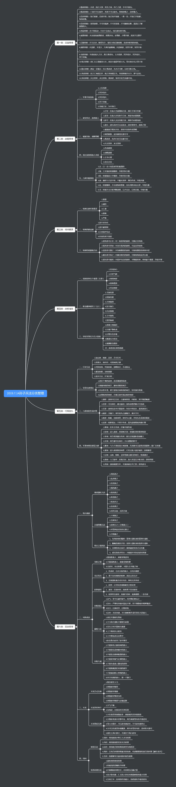

## 《三十六计》

```markdown

六六三十六，数中有术，术中有数。阴阳燮理，机在其中。机不可设，设则不中。

第一套 胜战计
第一计 瞒天过海
原文：备周而意怠，常见则不疑，阴在阳之内，不在阳之对。太阳，太阴。
翻译：认为准备万分周到，就容易松劲；平时看惯了的，就往往不在怀疑了，秘计隐藏在暴露的事物中，而不是和公开的形式相排斥。非常公开的往往蕴藏着非常机密的。

第二计 围魏救赵
原文：共敌不如分敌，敌阳不如敌阴。
翻译：树敌不可过多，对敌要各个击破，对现在还不忙于消灭的，要隐藏我们的意图。

第三计 借刀杀人
原文：敌已明，友未定，引友杀敌，不出自力，以损推演。
翻译：作战的对象已经确定，而朋友的态度还不稳定，要诱导朋友去消灭敌人，避免消耗自己的力量。

第四计 以逸待劳
原文：困敌之势，不以战，损刚益柔。
翻译：控制敌方力量发展的命脉来扼杀他，而不采取进攻的形势，这就是“损刚益柔”原理的演用。

第五计 趁火打劫
原文：敌之害大，就势取利，刚决柔也。
翻译：敌方的危机很大，就乘机取利，用优势力量攻击软弱的。

第六计 声东击西
原文：乱志乱萃，不虞“坤下兑上”之象；利其不自主而取之。
翻译：敌人乱撞瞎碰，摸不清情况，这是《易经》“萃”封上所说的“坤下兑上”的混乱征状。必须利用敌方失去控制力的时机加以消灭。

第二套 敌战计
第七计 无中生有
原文：诳也，非诳也，实其所诳也。少阴，太阴，太阳。
翻译：无中生有是运用假象，但不是弄假到底。而是使假象变真象，大小假象，掩护真象。

第八计 暗渡陈仓
原文：示之以动，利其静而有主，“益动而巽”。
翻译：故意暴露行动，利用敌方固守的时机，便主动偷袭。

第九计 隔岸观火
原文：阳乖序乱，阴以待逆，暴戾恣睢，其势自毙。顺以动豫，豫顺以动。
翻译：敌人内部分裂，秩序混乱，我便等待他发生暴乱，那时敌人穷凶极恶，翻目仇杀，势必自行灭亡。我要根据敌人变动作好准备；作好准备之后，还要根据敌人的变动而行动。

第十计 笑里藏刀
原文：信而安之，阴以图之，备而后动，勿使有变：刚中柔外也。
翻译：使敌人相信我方，并使其麻痹松懈，我则暗中策划，充分准备，一有机会，立即动手，使他来不及应变，这是暗中厉害，表面柔和的策略。

第十一计 李代桃僵
原文：势必有损，损阴以益阳。
翻译：当局势发展有所损失的时候，要舍得局部的损失，以换取全局的优势。

第十二计 顺手牵羊
原文：微隙在所必乘，微利在所必得。少阴，少阳。
翻译：微小的漏洞必须利用，微小的利益，也必须获得。变敌人小的疏忽，为我方小的胜利。

第三套 攻战计
第十三计 打草惊蛇
原文：疑为叩实，察而后动，复者，阴之媒也。
翻译：有怀疑的就要侦察实情，完全掌握了实情再行动。反复侦察，是发现暗藏敌人的因素。

第十四计 借尸还魂
原文：有用者不可借，不能用者，求借，借不能用者而用之。匪我求童蒙，童蒙求我。
翻译：有用的不可以利用，怕的是我不能控制它，不能利用的却要去利用，因为我完全可以控制它，利用不能用的而控制它，这不是我受别人的支配，而是我支配别人。

第十五计 调虎离山
原文：待天以困之，用人以诱之，“往蹇来返”。
翻译：等待天时对敌方不利时再去围困他，用人假象去诱骗他“往前有危险，就返身离开”。

第十六计 欲擒故纵
原文：逼则反兵，走则减势，紧随勿迫。累其气力，消其斗志，散而后擒。兵不血刃，需，有孚光。
翻译：逼得敌人无路可走，就会遭到坚决的反扑；让他逃走，就会消灭敌人的气势，所以要紧紧地跟踪敌人，但不要逼迫他，借以消耗他的体力，瓦解他的士气，等他的兵力分散了，再行再以捕捉。这样用兵可以避免流血，不逼迫敌人，并让他相信，这对战争是有利的。

第十七计 抛砖引玉
原文：类以诱之，击蒙也。
翻译：用类似的东西去迷惑敌人，使敌人遭懵上当。

第十八计 擒贼擒王
原文：摧其坚，夺其魁，以解其体；龙战于野，其道穷也。
翻译：彻底地摧毁敌人的主力，抓住他的首领，借以粉碎他的战争机构，这是一场激烈的总决战。

第四套 混战计
第十九计 釜底抽薪
原文：不敌其力，而消其势，兑下乾上之象。
翻译：力量上不能战胜敌人，可以瓦解他的气势，这就是《易经》兑下乾上的《履卦》上所说的“柔履刚”的办法。

第二十计 混水摸鱼
原文：乘其阴乱，利其弱而无主，随，以向晦入宴息。
翻译：乘着敌人内部混乱，利用他还是弱小而没有主见，他随从我，像人随着天时吃饭、休息一样。

第二十一计 金蝉脱壳
原文：存其形，完其势；友不疑，敌不动；巽而上蛊。
翻译：保存阵地的原形，造成强大的声势，使友军不怀疑，敌人也不敢贸然进犯，而我却可以隐蔽地击破另一支敌军。

第二十二计 关门捉贼
原文：小敌困之，剥，不利有攸往。
翻译：对弱小的敌人，要加以包围歼灭；对垂死挣扎的敌人，如果从后面急追远赶，那是很不利的。

第二十三计 远交近攻
原文：形禁势格，利以近取。害以远隔，上火下泽。
翻译：处于（扭转）不利的形势（局面），要考虑（阻止）它发展的方向（趋势），（利于）攻取附近的地方，就有利，（不利于）攻击远隔的地方，就有害。《易经·聧》卦说：“火苗向上冒，池水向下流，志向不同，也可以结交。”

第二十四计 假途代虢
原文：两大之间，敌胁以从，我假以势，困，有言不信。
翻译：对处的两个强大敌人中间的国家，敌人胁迫它时，我方却作援求它，立即出兵。《易经·困》卦说：“对处在困迫状况下的国家，光空谈而没有行动，是不会被他信任的。”

第五套 并战计
第二十五计 偷梁换柱
原文：频更其阵，抽其劲旅，待其自败，而后乘之，曳其轮也。
翻译：多次变动敌人的阵容，把他的兵力调开，等待他自己败阵，然后用谋进攻他，《易经·既济》卦说：“先拖住敌人，然后再替换他。”

第二十六计 指桑骂槐
原文：大凌小者，警以诱之。刚中而应，行险而顺。
翻译：强大的慑服弱小的，要用警戒的方法来诱导它。《易经·师》卦说：适当的强硬，可以得到拥护；施用险诈，可以得到顺从。

第二十七计 假痴不癫
原文：宁伪作不知不为，不伪作假知妄为，静不露机，云雷屯也。
翻译：宁可假装不知道的，不行动，不可假装知道而轻举妄动。要沉着，不要泄露一点机密，就像迅猛激烈的云雷，在冬季藏入地下般的平静。

第二十八计 上屋抽梯
原文：假之以便，唆之使前，断其援应，陷之死地，遇毒，位不当也。
翻译：故意露出破绽，引诱敌人深入我方，然后选择有利时机，断绝敌人的前应和后援，使它完全处于死地。敌人这样的下场《易经·嗑》上说的好：抢吃腊肉的嗑掉了牙，怪自己的动作不当。

第二十九计 树上开花
原文：借局布势，力小势大；鸿渐于陆，其羽可用为仪也。
翻译：借别人的局面布成阵势，兵力弱小的看来阵容也显得强大。《易经·渐》卦说：鸿雁飞向大陆，全凭它的羽毛丰满助长气势。

第三十计 反客为主
原文：乘隙插足，扼其主机，渐之进也。
翻译：有空子就要插脚进去，扼住他的主脑机关。《易经·渐》卦说：“循序而进”就是这个意思。

第六套 败战计
第三十一计 美人计
原文：兵强者，攻其将。将智者，伐其情。将弱兵颓，其势自萎。利用御寇，顺相保也。
翻译：兵力强大的，就要攻打他的将帅；将帅明智的，就打击他的情绪。将帅斗志衰弱、部队士气消沉，他的气势必定自行萎缩。《易经·渐》卦说：利用敌人内部的严重弱点来控制敌人，可以有把握地保存自己的实力。

第三十二计 空城计
原文：虚者虚之，疑中生疑；刚柔之际，奇而复奇。
翻译：空虚的就让它空虚，使人更加难以揣测；在进攻和防御中运用空虚的战术来隐蔽自己的空虚，越发显得用兵出奇。

第三十三计 反间计
原文：疑中之疑，比之向内，不自失也。
翻译：在疑阵中再布置一层疑阵。《易经·比》卦说：来自敌方内部的援助，自己不会受到损失。

第三十四计 苦肉计
原文：人不自害，受害必真。假真真假，间以得行。童蒙之吉，顺以巽也。
翻译：人不自己迫害自己，受迫害必然是真的；真的变假，间谍便乘机活动。《易经·蒙》卦说：把他骗得乖乖的，顺着他活动。

第三十五计 连环计
原文：将多兵众，不可以敌，使其自累，以杀其势。在师中吉，承天宠也。
翻译：敌方兵力强大，不能硬打，应当运用谋略，使仓储自相牵制，借以削弱他的力量。《易经·师》卦说：将帅靠指军不偏不倚，惯打胜仗的就是用兵如神。

第三十六计 走为上
原文：全师避敌，在次无咎，未失常也。
翻译：全军退却，甩开敌人，以退为进，待机破败，这是不违背正常的法则的。


```


```markdown

○第一套〖胜战计〗 处于绝对优势地位之计谋。君御臣、大国御小国之术也。亢龙有悔。
第01计 瞒天过海 备周则意怠，常见则不疑。阴在阳之内，不在阳之对。太阳，太阴。
第02计 围魏救赵 共敌不如分敌，敌阳不如敌阴。
第03计 借刀杀人 敌已明，友未定，引友杀敌。不自出力，以《损》推演。
第04计 以逸待劳 困敌之势，不以战。损刚益柔。
第05计 趁火打劫 敌之害大，就势取利，刚决柔也。
第06计 声东击西 敌志乱萃，不虞。坤下兑上之象，利其不自主而取之。
○第二套〖敌战计〗 处于势均力敌态势之计谋。或跃于渊。
第07计 无中生有 诳也，非诳也，实其所诳也。少阴、太阴、太阳。
第08计 暗渡陈仓 示之以动，利其静而有主，“益动而巽”。
第09计 隔岸观火 阳乖序乱，阴以待逆。暴戾恣睢，其势自毙。顺以动豫，豫顺以动。
第10计 笑里藏刀 信而安之，阴以图之。备而后动，勿使有变。刚中柔外也。
第11计 李代桃僵 势必有损，损阴以益阳。
第12计 顺手牵羊 微隙在所必乘，微利在所必得。少阴，少阳。
○第三套〖攻战计〗 处于进攻态势之计谋。飞龙在天。
第13计 打草惊蛇 疑以叩实，察而后动。复者，阴之媒也。
第14计 借尸还魂 有用者，不可借；不能用者，求借。借不能用者而用之。匪我求童蒙，童蒙求我。
第15计 调虎离山 待天以困之，用人以诱之，往蹇来返。
第16计 欲擒姑纵 逼则反兵，走则减势。紧随勿迫，累其气力，消其斗志，散而后擒，兵不血刃。需，有孚，光。
第17计 抛砖引玉 类以诱之，击蒙也。
第18计 擒贼擒王 摧其坚，夺其魁，以解其体。龙战于野，其道穷也。
○第四套〖混战计〗 处于不分敌友、军阀混战态势之计谋。见龙在田。
第19计 釜底抽薪 不敌其力，而消其势，兑下乾上之象。
第20计 混水摸鱼 乘其阴乱，利其弱而无主。随，以向晦入宴息。
第21计 金蝉脱壳 存其形，完其势；友不疑，敌不动。巽而止蛊。
第22计 关门捉贼 小敌困之。剥，不利有攸往。
第23计 远交近攻 形禁势格，利从近取，害以远隔。上火下泽。
第24计 假道伐虢 两大之间，敌胁以从，我假以势。困，有言不信。
○第五套〖并战计〗 对付友军反为敌态势之计谋。终日乾乾
第25计 偷梁换柱 频更其阵，抽其劲旅，待其自败，而后乘之。曳其轮也。
第26计 指桑骂槐 大凌小者，警以诱之。刚中而应，行险而顺。
第27计 假痴不癫 宁伪作不知不为，不伪作假知妄为。静不露机，云雷屯也。
第28计 上屋抽梯 假之以便，唆之使前，断其援应，陷之死地。遇毒，位不当也。
第29计 树上开花 借局布势，力小势大。鸿渐于陆，其羽可以为仪也。
第30计 反客为主 乘隙插足，扼其主机，渐之进也。
○第六套〖败战计〗 处于败军态势之计谋。潜龙勿用。
第31计 美人计 兵强者，攻其将；将智者，伐其情。将弱兵颓，其势自萎。利用御寇，顺相保也。
第32计 空城计 虚者虚之，疑中生疑。刚柔之际，奇而复奇。
第33计 反间计 疑中之疑。比之自内，不自失也。
第34计 苦肉计 人不自害，受害必真。假真真假，间以得行。童蒙之吉，顺以巽也。
第35计 连环计 将多兵众，不可以敌，使其自累，以杀其势。在师中吉，承天宠也。
第36计 走为上 全师避敌。左次无咎，未失常也

```


```markdown

胜战计 我方有优势时用的计谋；
敌战计 敌我实力部分上下时用的计谋；
攻战计 我方要主动攻击时用的计谋；
混战计 敌方处于混乱时用的计谋；
并战计 友军有敌变的形式时用的计谋；
败战计，我方处于劣势时用的计谋。

```

原书按计名排列，共分六套，即胜战计、敌战计、攻战计、混战计、并战计、败战计。前三套是处于优势所用之计，后三套是处于劣势所用之计。

三十六计是依据阴阳变化之理及古代兵家刚柔、奇正、攻防、彼己、虚实、主客等对立关系相互转化的思想推演而成，含有朴素的军事辩证法的因素。





## 《孙子兵法》




