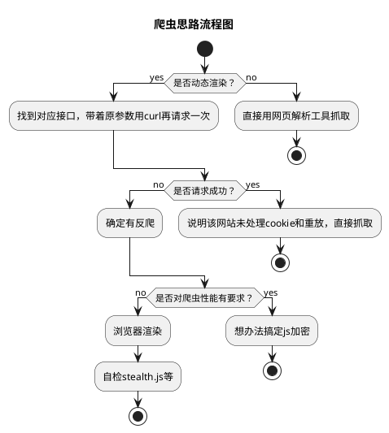

## scrapy


### 技术选型

- pyspider: 不维护了，因为该项目深度依赖的 phantomjs 不维护了
- feapder: 框架很不错，内置了很多需要的服务，比如自动入库/好用的命令行工具 (支持比如生成 item 什么的)/定时更新/浏览器渲染 (不需要引入 selenium，怎么实现的？)/支持多种报警策略 (比如爬虫抓取速度，剩余任务/爬虫卡死报警/失败任务过多被反爬报警)/爬虫拉取数据的 dashboard。总的来说略微稍重，但是很好用


### 概念

运行原理

scrapy 框架由哪几个部分组成？哪些组件？

scrapy 的运行原理？执行过程？

*scrapy 由调度器、下载器、爬虫、pipeline、引擎这 5 个基本组件，以及下载中间件和爬虫中间件两个附加组件构成*

```markdown

- `scheduler调度器`（负责接收引擎发送过来的 request 请求，并且按照一定的方式进行整理排序，入队，当引擎需要时，交还给引擎）
- `downloader下载器`（负责下载 引擎 发送的所有 request，并且将其返回的数据，发送给 引擎，由引擎交给爬虫来处理）
- `spider爬虫`（负责处理所有“返回数据”，从中分析提取数据，获取 item 字段需要的数据，并且将需要跟进的 URL 提交给 引擎，再次进入 调度器）
- `pipeline管道`（负责处理 爬虫 中获取到的 item，并且进行后期处理（详细分析，过滤，存储等）的地方）
- `引擎`（负责爬虫，管道，下载器，调度器之间的通讯，信号，数据传递等）
- `下载中间件`（自定义拓展下载功能的地方）
- `爬虫中间件`（自定义拓展和操作引擎和 爬虫 中间通信的功能组件；（比如 进入爬虫的“返回数据”，以及从 爬虫 出去的 requests））

```


### 中间件

---

scrapy 有哪几种中间件？

- 下载中间件，请求之前更换代理 IP，更换 Cookies，更换 UA，自动重试等功能，以及返回响应时，对 response 的处理
- 爬虫中间件，可以在中间件里处理爬虫本身的异常，比如数据处理错误，或者网站本身内容有问题导致的异常

---

scrapy 中间件的原理？


### 常用配置

```markdown


log 相关

- 是否启用 logging `LOG_ENABLED = True`
- log 打印格式 `LOG_FORMAT = '%(asctime)s,%(msecs)d  [%(name)s] %(levelname)s: %(message)s'`

---

自动限流拓展

- AUTOTHROTTLE_ENABLED
- AUTOTHROTTLE_START_DELAY
- AUTOTHROTTLE_MAX_DELAY
- AUTOTHROTTLE_DEBUG
- AUTOTHROTTLE_TARGET_CONCURRENCY

HTTP 的缓存配置

- HTTPCACHE_ENABLED
- HTTPCACHE_EXPIRATION_SECS
- HTTPCACHE_DIR
- HTTPCACHE_IGNORE_HTTP_CODES
- HTTPCACHE_STORAGE

---

Feed 相关配置

- `FEED_URI`
- `FEED_FORMAT`
- `FEED_STORAGES`
- `FEED_EXPORTERS` 可以设置为`JSON`/`JSON lines`/`CSV`/`XML`/`Pickle`/`Marshal`
- `FEED_STORE_EMPTY`


```

### **选择器的使用**

- scrapy 的 response 的 xpath、css 怎么写？
- xpath 怎么获取包含某些特定文字的选择器？
- xpath 获取最后一个标签
- 最后一个`//div[contains(@class, 'paginator')]/a[last()]`
- 倒数第二个`//div[contains(@class, 'paginator')]/a[last()-1]`
- xpath 如何通过 class 来定位元素？
- xpath 的一些常见语法？？？
- 怎么在最后一个 item 里取值？直接使用 meta 进行传值，在最后一个 request() 里的 item 进行入库
- get() 、getall() 、extract() 、extract_first() 这几个方法的区别？
- extract():这个方法返回的是一个数组 list，，里面包含了多个 string，如果只有一个 string，则返回[‘ABC’]这样的形式。
- extract_first()：这个方法返回的是一个 string 字符串，是 list 数组里面的第一个字符串。
- scrapy 中有哪些处理 item 的技巧？

### 常见问题

- 怎么周期执行 scrapy？ScrapyKeeper/scrapyd+curl
- scrapy 怎么同时执行多个爬虫？使用 scrapy 的 `CrawlerProcess`, `scrapy crawl命令`只能线性执行命令，无法并行
- 怎么在爬虫执行之后，进行其他操作？实用 scrapy 的`CrawlerRunner`
- 怎么 debug scrapy？
- 怎么在一个 scrapy 项目中实现多个爬虫？
- scrapy 中怎么传递参数？使用 `__init__()`
- 如何在 scrapy 中使用 aiohttp？
- 如何把 selenium 集成到 scrapy？


---

- 怎么在爬虫执行完成后，执行一段代码？看了不少 sof 上的帖子，不少人都通过在`spider里的closed()方法`里添加这段代码来解决这个问题；但是我自己试了一下，试过了几种方法都不能解决这个问题，最后还是通过`外挂一个脚本`，来解决这个问题
- 怎么动态配置 custom_settings？怎么动态添加 start_urls？ *custom_settings 必须被定义为类属性，因为它们必须在初始化之前定义*
- Scrapy 中怎么传递用户自定义的参数到爬虫文件所在的类中呢？其他参数都是可以的，除了`custom_settings`，这个参数一定要在 init() 之前就确定

---

- 你用过的爬虫框架或者模块有哪些？谈谈他们的区别或者优缺点？
- scrapy 和 scrapy-redis 的区别？
- scrapy 的优缺点？为什么要选择 scrapy 框架？
- scrapy 和 requests 的使用情况？
- 描述一下 scrapy 框架的运行机制？
- 写爬虫使用多进程好，还是用多线程好？
- 常见的反爬虫和应对方法？
- 分布式爬虫主要解决什么问题？
- 爬取时弹出对话框让验证，又该怎么处理？
- 你在爬虫过程中，都是怎么解决反爬的，爬取多少数据，用了多长时间？
- 爬取这些数据都用来做什么的？怎么交付给公司？客户是谁？爬取数据的影响因素？
- 爬虫的基本流程？
- 如何提高爬取效率？
- request 请求方式中的 post、get 有什么区别
- 模拟登陆原理？
- 分布式原理？
- scrapy 中间件有几种类，你用过那些中间件？
- 代理失效了怎么处理
- 使用 redis 搭建分布式系统时如何处理网络延迟和网络异常？

---

- 怎么获取某个相对协议 url 的完整 url？response.urljoin
- selector 的使用？可以结合 scrapy 一起使用，实现`分页文章合并数据`，很牛逼的一个实现，网上的帖子都没提到这种方案 (参考 d1bz 项目)
- start_requests() 和 init() 有什么区别？
- scrapy 的 Itemloader？ItemLoader 最大的好处是作为一个容器，可以多个 spider 复用提取规则。可以把规则动态添加，因为规则可以放入数据库或者文件中。ItemLoader 不用考虑是否为空，是否是 0 的值。

---

scrapy 怎么实现异步抓取？

[在 Scrapy 中如何使用 aiohttp？](https://mp.weixin.qq.com/s?__biz=MzI2MzEwNTY3OQ==&mid=2648978965&idx=1&sn=9cf95229f79bd544ec4565ca34283f69)

- 用 asyncio 实现异步线程
- 用 [aio-libs/aiohttp](https://github.com/aio-libs/aiohttp) 代替 request 实现异步 HTTP 请求

还可以用 [MagicStack/uvloop: Ultra fast asyncio event loop.](https://github.com/MagicStack/uvloop) 代替 asyncio 实现更好的性能


---

怎么用 scrapy+splash 实现异步抓取？

也可以用 `scrapy-splash中间件` 实现异步抓取


---

splash 和 selenium 的区别、使用场景？

*都是无头浏览器，相比于 selenium，splash 可以实现异步渲染页面，爬虫的抓取效率很高；但是相比于 selenium，其键鼠操作和模拟登录等功能不完善*


### 需求

- 输出 rss
- 模拟登录
- 去重
- scrapy-selenium


## **爬虫通用问题**

- *怎么在爬虫中使用布隆过滤器？爬虫的哪些场景需要使用布隆过滤器？* 对已经爬过的 url 去重（幂等性入库），以及作为`failed url容器`进行重试操作


### 反爬&对抗反爬


对爬虫有哪些心得、总结？

- *爬虫开发实际上是黑盒的，且实时性很强*
- 黑盒体现在，无法得到明确反馈，只能根据经验自行判断。
- 实时性强体现在，很可能一周前还 work 的爬虫，现在就不 work 了，取决于很多因素，比如浏览器和 CDP 升级、或者网站反爬策略升级，甚至对方服务下线了。
- 因为这两点特性，我们可以得出爬虫开发的一条经验：*纠结于爬虫是否 work 毫无意义，也没必要自己花大量时间去对抗大型网站的反爬，因为大概率失败。我们只需要把常用反爬和对抗反爬的套路都足够熟练，把这些方案都工具化，以最快时间秒掉 99% 的网站*，毕竟不是专业的爬虫工程师，剩下的 1% 的网站是留给他们的。
- 如果某个网站、APP 爬不下来，可以找找提供类似功能的网站。比如想爬取电影票数据，美团电影的 yoda 反爬很强，可以试试淘票票。
- **反爬的核心在于`抓爬虫`，查到爬虫后，再进行`返回错误`、`随机返回假数据`等可有可无操作。如果反爬被打穿了之后，就需要限流系统来兜底了**


作为爬取方，怎么确定爬虫方案？需要使用哪些技能？在爬取速度和稳定性之间怎么找到平衡点？

查看网站是否动态渲染？是否有接口？接口是否反爬？




数据采集、清洗、分析、可视化、挖掘


```markdown
### 基于身份识别

#### header 参数

- IP 代理池 [一日一技：为什么网站知道我的爬虫使用了代理？](https://mp.weixin.qq.com/s?__biz=MzI2MzEwNTY3OQ==&mid=2648985933&idx=1&sn=45a383d97f72a7454e9c0b27afe311ff)
- user-agent user-agent 池
- 通过 cookie 检查用户是否具有权限
- referer 判断请求发起的源头

---

- 怎么使用 IP 代理池？怎么查看当前请求使用的 IP？怎样检测配置的 IP 代理是否生效？怎么维护一个高匿 IP 代理池？
- **不要自己维护 IP 代理池，直接买第三方服务**（比如芝麻 HTTP 之类的付费代理 IP 服务，或者直接使用 crawlera 等提供代理 IP 服务的第三方爬虫平台），免费的根本就是浪费时间，90% 以上都不能用。
- 模拟 UA 的时候，也要记得模拟 header 里的其他参数。另外，现在的反爬虫策略，为了降低误伤率，检查爬虫的时候，会对请求的可疑性打分，出现可疑行为后，就加上几分，某些行为分数高，某些行为分数低。当你总积分达到一定程度时，再调用封禁的流程。
- 每次打开新页面，cookie 都会变化，而 cookie 使用 x-zse-86 进行加密而重点就在于对 x-zse-86 进行解密
- 可以解决 99% 的爬虫，借用了目前主流爬虫库基本都不支持 HTTP2，而浏览器对 HTTP2 都已良好支持的现状


#### 验证码

##### 滑动验证码

[增强版！如何深度学习识别滑动验证码缺口](https://mp.weixin.qq.com/s?__biz=MzI2MzEwNTY3OQ==&mid=2648983962&idx=1&sn=479843a4f3a672e8520a5ac22c540a18)

##### 滑块验证码

##### 点触验证码（ReCaptcha）

使用`YesCaptcha`解决

- [我又找到了一个破解谷歌验证码的新方案！](https://mp.weixin.qq.com/s?__biz=MzI2MzEwNTY3OQ==&mid=2648981206&idx=1&sn=67d7bfcec1300a35ac5554680e0c2e22)
- [谷歌验证码 ReCAPTCHA 的模拟点击破解方案来了！](https://mp.weixin.qq.com/s?__biz=MzI2MzEwNTY3OQ==&mid=2648986784&idx=1&sn=eff9d14cb4ea8dabff24920bf5b99d34)

#### 浏览器指纹（JA3 指纹）

- 什么是`JA3指纹`？什么原理？
- 怎么构建`JA3指纹`？
- 怎么解决`JA3指纹`？ `ja3transport`和`CycleTLS`
- 解决 ja3 指纹的原理？ja3transport 库会在三次握手后，即将发起 client hello 数据包时，*拦截该包并用自定义 ja3 替换掉原有的*
- ja3s 相比于 ja3 有什么优化？
- 有哪些靠谱的 ja3 黑名单/已收录指纹？

[用 Go 构建你专属的 JA3 指纹](https://mp.weixin.qq.com/s?__biz=MzkyMDAzNjQxMg==&mid=2247484550&idx=1&sn=cfa881e5609ee19236ddc599f3b2ab5e)

#### webdriver 特征

`stealth.js`

[requireCool/stealth.min.js: Automatically generate the newest stealth.min.js.](https://github.com/requireCool/stealth.min.js)


#### 随机数

通过 js 生成请求参数，或者通过预请求获取随机值，作为请求参数

用 otto 获取 js 的执行结果，或者用 webdirvier

#### PathMarker

通过检测网页和请求之间的关系来检测分布式爬虫。具体原理是，通过向 URL 添加 tag 来跟踪该 URL 之前的页面，并识别访问该 URL 的用户。根据 URL 访问路径和访问时间的不同模式，使用 SVM 模型来区分恶意网络爬虫和普通用户。

### 基于数据加密

#### 使用`自定义字体文件`反爬

- 尝试通过抓包获取字体文件，找规律

> 对抗`字体反爬`？

- 把一部分文字用图片替代，这个是最常见的反爬手段，比如链家以及很多小说网站都是这么实现的。字体文件的存储方案大概有三种，`存储像素点`，`存储轮廓`，`存储笔画`
- *通常使用`存储轮廓`的方案，用`贝塞尔曲线`来描述字体的轮廓，展示的时候，计算成像素点，输出到设备上。其他两种方式都不太合适*


#### css 偏移反爬

需要通过 css 位移才能产生真实数据

- 计算 css 的偏移

[一日一技：CSS 偏移反爬虫的原理和破解方法](https://mp.weixin.qq.com/s?__biz=MzI2MzEwNTY3OQ==&mid=2648985411&idx=1&sn=b69634959c5b32196cf515a2fd57d7ec)


#### 通过数据图片化反爬

分为存储像素点、轮廓、笔画三种

- 图片直接替换文字，用 OCR 识别


##### OCR

OCR 通常作为兜底方案

- easyocr
- tesseract
- kerasocr

#### js 反爬

##### js 混淆加密 (sojson)


> 怎么破解 js 反爬？

- 使用`playwright`通过浏览器来模拟逆向流程，来确定 js 代码依赖的拓展包
- [Python 爬虫进阶必备 | 某游戏网站密码加密逻辑分析 webpack 的 js 加密代码怎么扣 -思路分析](https://mp.weixin.qq.com/s?__biz=MzI2MzEwNTY3OQ==&mid=2648980951&idx=1&sn=f7bdd431e78dba7d9bc034768f5b535e)
- [简单方便的 JavaScript 逆向辅助模拟方法](https://mp.weixin.qq.com/s?__biz=MzI2MzEwNTY3OQ==&mid=2648980941&idx=1&sn=9b93cc295de8c2428cddfabd2a240148)
- [Python 爬虫进阶必备 | 某著名人均百万问答社区 header 参数加密逻辑分析](https://mp.weixin.qq.com/s?__biz=MzI2MzEwNTY3OQ==&mid=2648985875&idx=1&sn=d86418b4a75dee72b64e3bc4bca37cf1)
- [jsvmp-某乎_x-zes-96 参数算法还原（手把手教学）](https://mp.weixin.qq.com/s?__biz=MzI2MzEwNTY3OQ==&mid=2648985946&idx=1&sn=4f039dc1289e1cb29cf618a964c68d5e)


> mitmproxy 是什么？使用流程？

1. 用 pip 安装 mitmproxy
2. 去 mitm 官网下载对应系统的证书
3. 导入 HTTPS 证书：把 pem 证书转成 crt 证书，`openssl x509 -in mitmproxy-ca-cert.pem-informPEM-outmitmproxy-ca-cert.crt`
4. 我们可以使用`mitmproxy`,`mitmdump`,`mitmweb`命令来监听`默认的8080端口`的请求，使用`mitmdump-s httpproxy.py-p 9090`来自定义端口。
5. 第二个进程使用`对应的端口`运行 selenium 脚本。


###### 逆向


##### js 脚本反爬

- mitmproxy
- anyproxy
- playwright

##### js 反调试

###### jsrpc


- [Jsrpc 学习——Cookie 变化的网站破解教程](https://mp.weixin.qq.com/s?__biz=MzI2MzEwNTY3OQ==&mid=2648985315&idx=1&sn=13b5ba7d6d9d989451ab62877085f74b)
- [RPC 技术及其框架 Sekiro 在爬虫逆向中的应用，加密数据一把梭！](https://mp.weixin.qq.com/s?__biz=MzI2MzEwNTY3OQ==&mid=2648985365&idx=1&sn=4feb19f4b03eea8b2426cedaf423082a)

### 基于爬虫行为

- 基于 IP/账号等参数的请求频率和总请求数
  - 通过 IP/账号请求之间的间隔进行反爬
  - 通过 IP/账号每天请求总次数进行反爬
- 鼠标滑动轨迹：把鼠标轨迹及滑动速度等作为请求参数
  - 方案 1：生成这些参数
  - 方案 2：通过 selenium 模拟鼠标滑动
- 通过 js 实现页面跳转，无法在源码中获取下一页 url
  - 方案 1：分析 url 之间的关联性
  - 方案 2：用 otto 之类的 js 解释器直接跑 js
- 通过蜜罐区分爬虫和正常用户
  - 方案 1：响应里添加假数据
  - 方案 2：阻塞爬虫的任务队列
    - 比如生成大量垃圾 url，从而阻塞任务队列
    - 响应里添加大文件 url

#### 怎么制造爬虫蜜罐？

- `<a>标签`的 href 里写一个 url，这个 url 实际上是个蜜罐，真正的 url 需要拼接获得，比如根据`<base>标签`拼接；爬虫访问进去后，就会抓到假数据，或者被立即屏蔽。

### 第三方服务

- 瑞数
- cloudflare
- distil

#### 瑞数

- [人均瑞数系列，瑞数 4 代 JS 逆向分析（文末送书）](https://mp.weixin.qq.com/s?__biz=MzI2MzEwNTY3OQ==&mid=2648986972&idx=1&sn=117b4e51776f09acf25a5e9bc49a93a8)
- [人均瑞数系列，瑞数 5 代 JS 逆向分析](https://mp.weixin.qq.com/s?__biz=MzI2MzEwNTY3OQ==&mid=2648987208&idx=1&sn=e271cabb5b631e262dbbe6bd9a3d93f8)


#### cloudflare 五秒盾

- [Anorov/cloudflare-scrape](https://github.com/Anorov/cloudflare-scrape)
- [VeNoMouS/cloudscraper](https://github.com/venomous/cloudscraper)


[一日一技：【最新】再次突破 CloudFlare 五秒盾付费版](https://mp.weixin.qq.com/s?__biz=MzI2MzEwNTY3OQ==&mid=2648987371&idx=1&sn=84401455501f1fb12984a8d24f9cd6e8#rd)


#### 亮数据 Bright Data

[亮数据 - 网络数据一站式平台 海汇互动](https://www.bright.cn/)

具体可以看 [科技爱好者周刊（第 254 期）：人生是一个长板问题 - 阮一峰的网络日志](https://www.ruanyifeng.com/blog/2023/05/weekly-issue-254.html)
```


crawler and anti-crawler are tow sides of the same coin.

we can generally summarize that several anti-crawler methods are based on identify recognition, data encryption and crawler behavior.

anti-crawler based on identify recognition is the most basic, it's just some header params like UA, cookie, referer and so on. and some params that can be used to recognize, such as JA3 fingerprint, webdriver, PathMarker(better referer params), and captcha(slide-captcha, ReCaptcha...)

Except this, we can also anti-crawler by encrypt data, use static resources such as fonts, css and js to implement.

From this perspective, we can actually regard these two points as the different between the server side(identify recognition) and the client side(data encryption).


### 如何实现分页抓取？

- 通用做法，直接查"下一页"的 url，即使没有`“下一页”按钮`或者`page非自增`。
- 如果有`下一页按钮`，查出`下一页按钮`对应的 url，简单粗暴
- 如果`page是自增的`，可以直接`'url/proxylist/%d/' % i for i in range(1, 21)`

### 如何实现增量抓取？

- ~~用 deltafetch+magicfields 通过本地数据库实现增量爬取（使用一个类似于 sqlite 的本地数据库 berkeley db 存之前爬的所有数据，实现增量爬取）~~
- 通过 scrapy-redis 使用 redis 实现去重
- 使用布隆过滤器实现去重 ScrapyRedisBloomFilter (布隆过滤器实现去重)

### 模拟登陆

### 爬虫怎么自动化接受手机短信验证码？

- 用`卡池设备`+ [pppscn/SmsForwarder](https://github.com/pppscn/SmsForwarder) 一个卡池设备 512 张卡，并发 32 路
- [作为一只爬虫，如何科学有效地处理短信验证码？](https://mp.weixin.qq.com/s?__biz=MzI2MzEwNTY3OQ==&mid=2648981098&idx=1&sn=30af59795e90fa53a4b2312af30df448)


### 怎么判断网页是否更新？

- 比较简单的方法，根据 304 状态码判断，带着上一次爬取网页的 modified-time 去请求，如果返回 200 说明网页更新了，覆盖原网页，如果返回 304 则说明网页未更新
- 基于网页内容进行比较，使用 LSH 算法计算出 *`网页指纹`+`汉明距离(hamming distance)`算法*
- `LogicJake/WebMonitor`开源库或者 distill 等第三方服务都提供该功能


---

- 怎么通过相应头判断网页是否更新？[爬虫：如何判断一个网页已经更新？ - 简书](https://www.jianshu.com/p/992cbc7d8865) TODO


### 如何监控爬虫是否有效？

- 监控爬虫是否有效的重点在于*页面结构是否变化*以及*网站是否添加或者修改了反爬策略*

