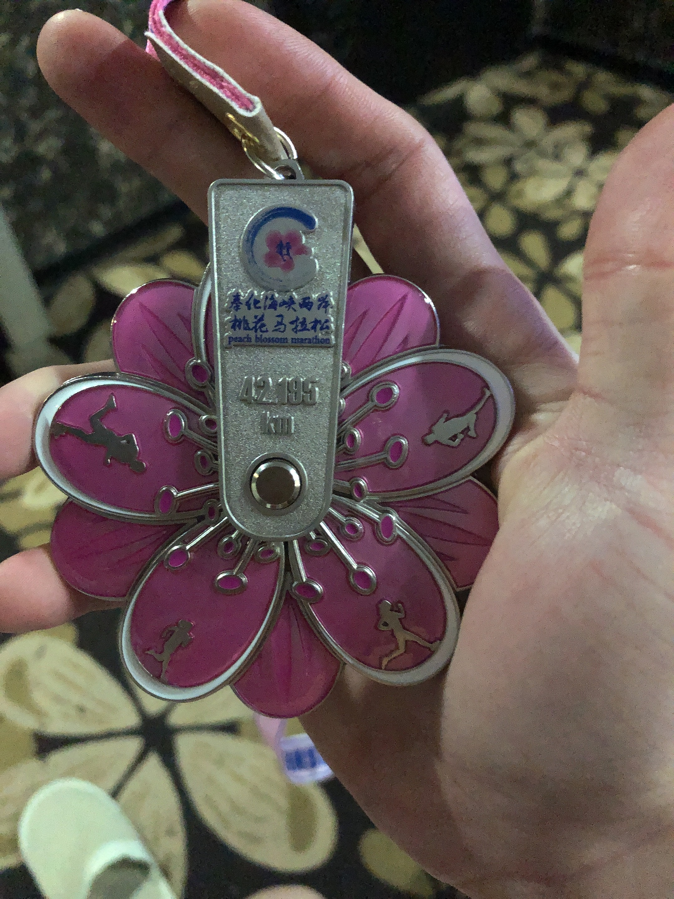
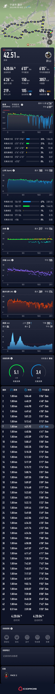
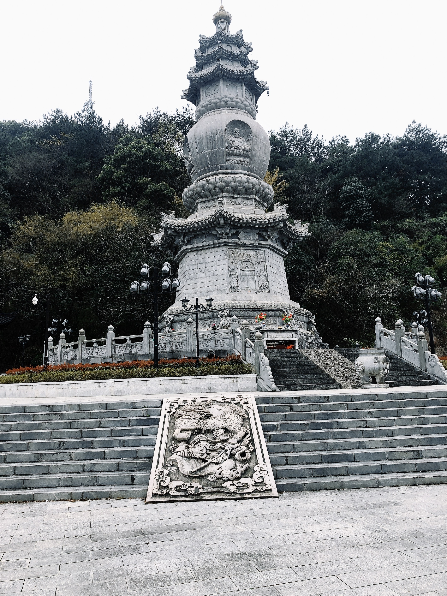
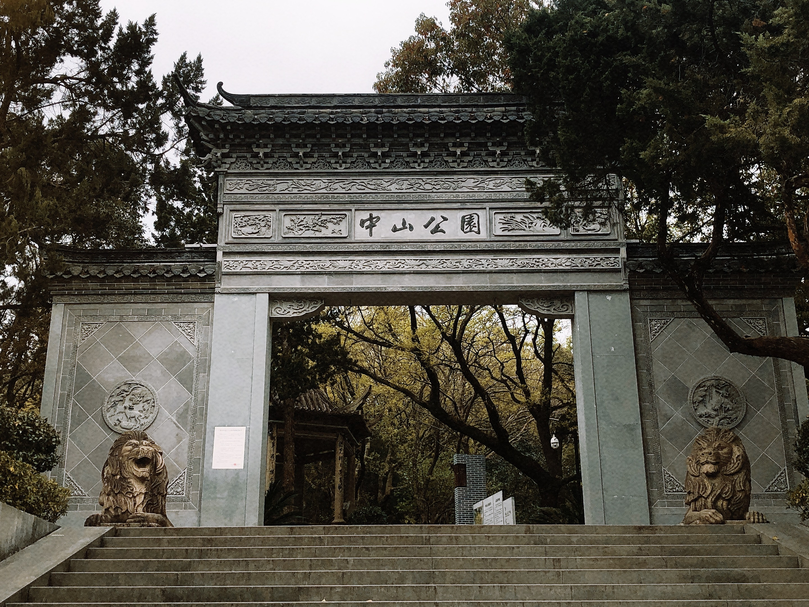
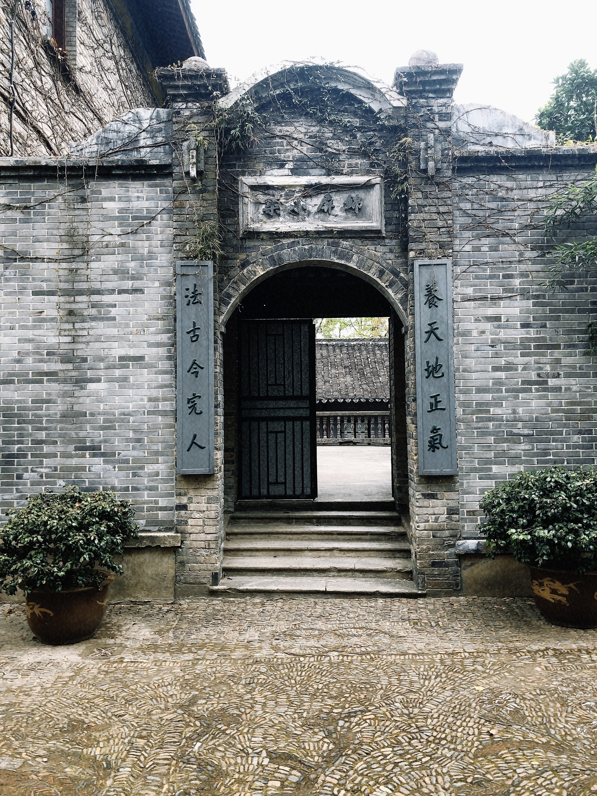

## 比赛相关

- 脚踝比较疼，其他地方还好，可能还是需要训练脚踝力量。
- 我整个赛程里每次经过补给点都吃不少，导致后面 30km 之后进了很多气，肚子不舒服。
- 要多跑 30 到 35 的长距离，不然全马一定会崩掉。比如今天过了 21km 就开始掉速，因为我平时跑的最多的就是 15km 上下的距离，最多就是 21km。所以到了 27km 就彻底崩了，后面只能慢慢混过去。所以这个情况也很正常，需要多跑 35km。

---

- 如果想 PB 的话，确实有必要自带能量胶。这样就不用想着白嫖赛会的胶（很被动，因为不确定哪个补给点有胶），到了预定距离直接吃就可以。
- 如果想着 PB 的话，报比赛之前看看赛道的爬升距离，这次奉化的爬升 155m（手表显示爬升 220m，连续两个 80m 的上坡和下坡），确实爬升距离太高了，正常来说比较好的赛道爬升距离都在 20m 以内。
- 另外，需要提前确定什么时候补给，其实赛事比较多的 3 月和 11 月，都不需要喝太多水（大概两次就可以了），我这次首马每个补给点都吃一堆东西，吃到最后肚子难受。

---

总结来说，这次首马确实跑的不好，跟预期相差有点远，原本预期是冲 330，保 350。但是最终只跑了一个 419，前面 25km（甚至 27km）都跑的很稳，基本上保持在 450-500 的配速（半马143），后面因为上面说的脚踝和胃部不适就掉到 7 分甚至 8 分配了。

前进还是后退，这是个问题，其实真要说身体健康的话，保持在 250km 左右的跑量其实就不错了。但是如果真的想冲冲成绩，对我来说，确实应该好好训练了。

通过这次比赛，也对跑量有了更深的理解，还是那句话“跑量本身就是跑步能力的体现”，现在来看更深一层的是“跑量本身是一种需求”，**其内在逻辑是，正常来说如果平时不跑长距离，过了 25km 一定会掉速（因为像我平时跑的比较多的距离就是，日常 15km 左右，周末长距离加到 20km。所以以我的能力跑到 25km 都没啥问题，但是再多就受不了了）。所以需要把日常距离加到 20km，周末长距离加到 30km 到 35km 才是比较合理的训练量（其实也就是每天把 10km 作为基础跑量），没有这个跑量，再说跑力有多强，天赋有多好都是瞎扯。** 另外哈，其实拿时间去卡比较好，随着跑力和速度能力的加强，本身距离就会增加，其实也没必要着急，有这个认知就行。（比如说日常 5 分配，跑 20km 需要 100min，但是如果日常 4 分配就只需要 80min，就省了 20min）

---

[想保持三十公里后还不掉速？需要先知道这六点！_腾讯新闻](https://new.qq.com/rain/a/20220325A00SB300)

这篇文章中说的“训练方式”和“根据耐力系数确定配速”也很重要。

## 其他

记录一些经验和优化项：

- 要定比较好的酒店，很重要，300 左右，大概四星水平，不要怕花钱（跑马本身频率并不会很高，每一次的体验都很重要。***所以小赛也没什么必要去报***）
- 另外，学到了号码小卡片的用处。
- 比赛当天早上直接穿着参赛服，披着雨衣过去就行，不用穿什么衣服，很麻烦（反正酒店就在旁边，跑完之后，10min 以内就回酒店了）这条错了，最好还是穿着皮肤衣，裤子无所谓长短（最好穿长裤）。参赛服套在里面即可。因为穿的多点也有助于状态更快热起来。（如果酒店距离很近短裤也可，否则应该长裤）
- ~~需要买条半弹（半弹的好处在于可以挂空档，还能装能量胶（甚至手机））~~
- 比赛当天没必要起的太早，排空很难（通常 7 点半比赛，其实 7 点钟之前能入场上赛道就行。5 点半起床足够。）
- 计算一下除了报名费外的总开销（往返高铁票=150+180，出租车 + 地铁=50+6，吃饭=18+16+20，酒店 + 加时=140+60，合计 640）
- 带的有什么没用到的东西？（臂套没用，雨伞没用，pd 压缩袋也没用到，内裤也没必要带（直接挂空档即可，其实带一套比赛穿的背心、半弹和干袜子即可，其他都没必要带（**我可能还需要肌贴（用来固定脚踝和膝盖）**）））臂套是真没用，尤其是压缩臂套，压缩感太强，整个手臂非常麻，难受。
- ***出去比赛直接点外卖更好，比在酒店附近找饭馆靠谱*** 买赛前吃的面包应该直接叫外卖，我还自己跑过去找，走路来回得有至少10km，有点远。

---

这次做的比较好的是，赛前对于短袖 + 背心 + 短裤的决策是对的，包括对于穿自由 5 跑首马的决策也是对的（如果穿惊碳 2 可能确实无法完赛），但是自由 5 在后半程确实不太行了，所以还是需要训练，能让自己在全马里也能驾驭碳板竞速鞋。

---

查了一些资料：

- 全马里怎么补充能量胶？为什么？

早上要补足碳水（足以代替赛前的那支能量胶），3 支 30g 的小胶就足够了，15km/25km/35km 各一支（每隔 40min 补一次即可（也即 10km）。如果以跑一场全马约 4 小时来说，比赛途中补充 2-3 次已足够）

为什么？

正常来说体能储备是足够支撑到 25km 的，所以需要在 15km 时就补充第一支。赛后不需要补了。

我认为这样比 10km/20km/30km/40km 更好，因为 40km 没啥必要再补了，10km 补充第一支又有点早。

当然这个也是看跑力，如果能力一般的话，补充 4 次也不错。

- 是否要补水？怎么补？

**要看具体补给和天气**

如果是 3 月份或者 11 月份这种 10 到 15 度左右跑马最好的天气，没啥必要补太多水。

少量补水即可。

*补水的目的是加速能量胶的吸收*。等渗胶几乎不需要补水，普通能量胶少量补水即可，盐丸则需要大量补水（所以不要吃盐丸）。

---

赛后感冒😷了，怎么避免？

- 是否要带着日常穿的衣服去比赛，然后赛后直接在更衣室换干衣服？理想状况是这样的，但是通常都要排队，所以还是算了。（*通常大赛都在 3-4 月和 10-11 月举办，带着皮肤衣就足够了，赛后领到赛会提供的完赛包里的干毛巾，擦干身体，然后穿着皮肤衣小跑回酒店就可以了*）（跑马时身体大量产热，但比赛结束后，身体热量迅速降低，跑者浑身被汗水湿透，容易受凉。在大运动量或高强度比赛后，免疫功能暂时性下降，身体出现“开窗现象”，此时身体容易遭到病毒侵袭。赛后一周时间，感冒发生率提升 5 倍之多。建议跑者带一件备用的衣服或毛巾，擦干身体，及时更换衣服。）
- 赛后饮食：多吃碳水和高蛋白，切忌辛辣食物和喝酒
- 赛后休息：洗完澡、吃完饭之后休息 90min
- *快到终点前不要猛冲，全马最后阶段猛冲很可能造成风险*，改掉平时每次训练最后总想短冲的臭毛病

## 锦屏山（奉化中山公园）

