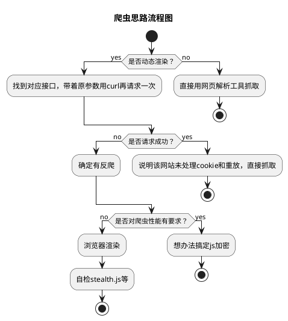

## GMP

### 进程、线程、用户态线程

```markdown

### 协程是什么？为什么协程会被称为“用户态线程”？

- 协程就是用户态线程，本质就是用户态自己切换 CPU，在协程这一层次，线程=CPU。
- *线程分为内核态线程和用户态线程，用户态线程指的就是协程 (所以，狭义上，我们只把内核态线程称为线程)*，用户态线程需要绑定内核态线程，CPU 只能感知到内核态线程，感知不到用户态线程。
- 线程的调度是 OS 实现的，对开发者不可见，而协程是在用户态实现的，对开发者可见。这就是为什么协程会被称为“用户态线程”。我们自己可以控制协程的调度。
- 因为协程会在函数被暂停执行时，保存函数的运行状态，并且可以从保存的状态中恢复并继续运行。这不就是 OS 对线程的调度吗？线程也可以被暂停，操作系统保存线程运行状态，然后去调度其他线程。此后，该线程再次被分配 CPU 时还可以继续运行，就像没有被暂停过一样。


### 协程的使用场景？

*协程的使用场景，主要是 IO 密集型*。IO 密集型程序，CPU 利用率很低，使用协程，可以让用户按照实际情况调度，充分利用 CPU，在当前多核 CPU 的架构中非常重要。


### 协程和线程有哪几种映射关系？

- *用户线程和内核线程`1:1`*，一个用户线程映射一个内核线程，所以用户空间的切换就涉及到内核线程的切换，1 个协程绑定 1 个线程，这种最容易实现。协程的调度都由 CPU 完成了，不存在 N:1 缺点，但有一个缺点是协程的创建、删除和切换的代价都由 CPU 完成，有点略显昂贵了
- *用户线程和内核线程`N:1`*，`1:1 模型`的性能开销较大，而且受限于线程数量的限制，而`N:1`的模型在用户空间完成线程间的同步、销毁、切换，对于内核来说是完全透明的，不涉及线程的切换。N 个协程绑定 1 个线程，优点就是协程在用户态线程即完成切换，不会陷入到内核态，这种切换非常的轻量快速。但也有很大的缺点，1 个进程的所有协程都绑定在 1 个线程上，一是某个程序用不了硬件的多核加速能力，二是一旦某协程阻塞，造成线程阻塞，本进程的其他协程都无法执行了，根本就没有并发的能力了
- *用户线程和内核线程`M:N`*，`N:1`的缺点是 OS 无法感知到用户态的线程，所以可能造成一个线程被阻塞，导致整个进程被阻塞挂掉，`M:N 模型`就解决了这个问题，也是实现原生协程的关键。M 个协程绑定 N 个线程，是 N:1 和 1:1 类型的结合，克服了以上 2 种模型的缺点，但实现起来最为复杂


两大思想

- 复用线程：协程本身就是运行在一组线程之上，不需要频繁的创建、销毁线程，而是对线程的复用。在调度器中复用线程还有 2 个体现：
  1）work stealing，当本线程无可运行的 G 时，尝试从其他线程绑定的 P 偷取 G，而不是销毁线程。
  2）hand off，当本线程因为 G 进行系统调用阻塞时，线程释放绑定的 P，把 P 转移给其他空闲的线程执行。
- 利用并行：GOMAXPROCS 设置 P 的数量，当 GOMAXPROCS 大于 1 时，就最多有 GOMAXPROCS 个线程处于运行状态，这些线程可能分布在多个 CPU 核上同时运行，使得并发利用并行。另外，GOMAXPROCS 也限制了并发的程度，比如 GOMAXPROCS = 核数/2，则最多利用了一半的 CPU 核进行并行。


```


### GMP 调度器


:::tip

*GMP 调度策略（不如说是 goroutine 的“生老病死”更合适，几个方面都概括到了）？*

*GMP 是 golang 实现 CSP 并发模型的一种方案*

- `G代表协程`，每次 go 调用的时候，都会创建一个协程对象
- `M代表内核线程Machine`，每次创建一个 M 的时候，都会有一个底层线程创建；所有的 G 任务，最终还是在 M 上执行
- `P代表调度器Processor`，每个运行的 M 都必须绑定一个 P，就像线程必须在一个 CPU 核上执行一样

线程由 CPU 调度是抢占式的，而协程由用户态调度是协作式的 (一个协程让出 CPU 之后，才执行下一个协程)

:::


- GMP 模型里，G 和 M 直接绑定就可以了，为什么要有 P？(抢占式调度器相较于之前调度器的优势？) 能不能不要 P？为什么不在 M 上直接实现本地队列和工作窃取，而是用 P 实现？


~~可以把 GMP 类比成生产线，G 就是流水线上的小工，M 就是流水线~~


```markdown
scheduler 底层原理 #
实际上在操作系统看来，所有的程序都是在执行多线程。将 goroutines 调度到线程上执行，仅仅是 runtime 层面的一个概念，在操作系统之上的层面。

有三个基础的结构体来实现 goroutines 的调度。g，m，p。

g 代表一个 goroutine，它包含：表示 goroutine 栈的一些字段，指示当前 goroutine 的状态，指示当前运行到的指令地址，也就是 PC 值。

m 表示内核线程，包含正在运行的 goroutine 等字段。

p 代表一个虚拟的 Processor，它维护一个处于 Runnable 状态的 g 队列，m 需要获得 p 才能运行 g。

当然还有一个核心的结构体：sched，它总览全局。

Runtime 起始时会启动一些 G：垃圾回收的 G，执行调度的 G，运行用户代码的 G；并且会创建一个 M 用来开始 G 的运行。随着时间的推移，更多的 G 会被创建出来，更多的 M 也会被创建出来。

当然，在 Go 的早期版本，并没有 p 这个结构体，m 必须从一个全局的队列里获取要运行的 g，因此需要获取一个全局的锁，当并发量大的时候，锁就成了瓶颈。后来在大神 Dmitry Vyokov 的实现里，加上了 p 结构体。每个 p 自己维护一个处于 Runnable 状态的 g 的队列，解决了原来的全局锁问题。
```

```markdown
Go scheduler 的核心思想是：

reuse threads；
限制同时运行（不包含阻塞）的线程数为 N，N 等于 CPU 的核心数目；
线程私有的 runqueues，并且可以从其他线程 stealing goroutine 来运行，线程阻塞后，可以将 runqueues 传递给其他线程。
```


### GMP changelog

```markdown

今天的 Go 语言调度器有着优异的性能，但是如果我们回头看 Go 语言的 0.x 版本的调度器会发现最初的调度器不仅实现非常简陋，也无法支撑高并发的服务。调度器经过几个大版本的迭代才有今天的优异性能，历史上几个不同版本的调度器引入了不同的改进，也存在着不同的缺陷：

单线程调度器 · 0.x
 只包含 40 多行代码；
 程序中只能存在一个活跃线程，由 G-M 模型组成；

多线程调度器 · 1.0
 允许运行多线程的程序；
 全局锁导致竞争严重；

任务窃取调度器 · 1.1
 引入了处理器 P，构成了目前的 G-M-P 模型；
 在处理器 P 的基础上实现了基于工作窃取的调度器；
 在某些情况下，Goroutine 不会让出线程，进而造成饥饿问题；
 时间过长的垃圾回收（Stop-the-world，STW）会导致程序长时间无法工作；

抢占式调度器 · 1.2 ~ 至今
 基于协作的抢占式调度器 - 1.2 ~ 1.13
  通过编译器在函数调用时插入抢占检查指令，在函数调用时检查当前 Goroutine 是否发起了抢占请求，实现基于协作的抢占式调度；
  Goroutine 可能会因为垃圾回收和循环长时间占用资源导致程序暂停；

 基于信号的抢占式调度器 - 1.14 ~ 至今
  实现基于信号的真抢占式调度；
  垃圾回收在扫描栈时会触发抢占调度；
  抢占的时间点不够多，还不能覆盖全部的边缘情况；

非均匀存储访问调度器 · 提案
 对运行时的各种资源进行分区；
 实现非常复杂，到今天还没有提上日程；


除了多线程、任务窃取和抢占式调度器之外，Go 语言社区目前还有一个非均匀存储访问（Non-uniform memory access，NUMA）调度器的提案。在这一节中，我们将依次介绍不同版本调度器的实现原理以及未来可能会实现的调度器提案。

```

```markdown
运行时 G-M-P 模型中引入的处理器 P 是线程和 Goroutine 的中间层，我们从它的结构体中就能看到处理器与 M 和 G 的关系：

处理器持有一个由可运行的 Goroutine 组成的环形的运行队列 runq，还反向持有一个线程。调度器在调度时会从处理器的队列中选择队列头的 Goroutine 放到线程 M 上执行。如下所示的图片展示了 Go 语言中的线程 M、处理器 P 和 Goroutine 的关系。

基于工作窃取的多线程调度器将每一个线程绑定到了独立的 CPU 上，这些线程会被不同处理器管理，不同的处理器通过工作窃取对任务进行再分配实现任务的平衡，也能提升调度器和 Go 语言程序的整体性能，今天所有的 Go 语言服务都受益于这一改动。
```

```markdown
Go 语言的调度器在最初的几个版本中迅速迭代，但是从 1.2 版本之后调度器就没有太多的变化，直到 1.14 版本引入了真正的抢占式调度才解决了自 1.2 以来一直存在的问题。在可预见的未来，Go 语言的调度器还会进一步演进，增加触发抢占式调度的时间点以减少存在的边缘情况。
```


### *GMP 运行机制/调度流程：golang 目前异步抢占的整体流程？*

```markdown
给正在运行的两个线程命名为 M1 和 M2
M1 发送中断信号 (`signalM(mp, sigPreempt)`)
M2 收到信号，操作系统中断其执行代码，并切换到信号处理函数 (`sighandler(signum, info, ctxt, gp)`)
M2 修改执行的上下文，并恢复到修改后的位置 (`asyncPreempt`)
重新进入调度循环，而调度其他协程 (`preemptPark`和`gopreempt_m`)

```


```markdown

### CHANGELOG

- 老调度器只有 M 和 G(全局协程队列)，存在很多问题。
- 新调度器引入了`Processor`包含了运行协程的资源，如果线程想运行协程，需要先获取 P，P 中还包含了可运行的 G 队列
- `工作窃取 work stealing`是用来解决 process 的问题的，当 M 绑定的 P 没有可以运行的 G 时，可以从其他运行的 M，偷取 G

*协作式的抢占式调度，基于信号的抢占式调度器*

```


## map


:::tip

本文可以看作是对 [hashmap | Go 程序员面试笔试宝典](https://golang.design/go-questions/map/) 的整理和总结

:::


### golang map的实现原理

在开始介绍golang map的实现原理之前，先用几个问题热热身，调动一下我们对于map的基本认知

- map有哪几种实现方法？hashtable和search-tree有啥区别？为啥目前大部分语言都用hashmap而非search-tree?
- 实现hashtable的keypoints?


***keypoints 无非是 hash func, load factor, hash-collision, 双桶, 渐进式rehash***


```go
type hmap struct {
 count     int
 flags     uint8
 B         uint8
 noverflow uint16
 hash0     uint32
 buckets    unsafe.Pointer
 oldbuckets unsafe.Pointer
 nevacuate  uintptr
 extra *mapextra // optional fields
}
```

参照golang map源码就可以看到

- hash0 就是 hash func
- buckets, oldbuckets 就是双桶
- B 就是 load factor

除此之外，就是 count, flags, noverflow, nevacuate

[map.png]

[bmap-ds.png]

可以看到bmap的kv不是 k/v/k/v/... 这种格式，而是 k/k/v/v/... 这种格式，是为了节省内存。因为k/v这种格式的话，每组之间都需要padding，如果 k/k/v/v 的话，则每个bucket共享一个padding即可


```markdown
每个 bucket 设计成最多只能放 8 个 key-value 对，如果有第 9 个 key-value 落入当前的 bucket，那就需要再构建一个 bucket ，通过 overflow 指针连接起来。
```

```markdown
哈希表的每个桶都只能存储 8 个键值对，一旦当前哈希的某个桶超出 8 个，新的键值对就会存储到哈希的溢出桶中。随着键值对数量的增加，溢出桶的数量和哈希的装载因子也会逐渐升高，超过一定范围就会触发扩容，扩容会将桶的数量翻倍，元素再分配的过程也是在调用写操作时增量进行的，不会造成性能的瞬时巨大抖动。
```

每个bucket(也就是bmap)只存储8个kv，超出就放到新bucket


#### 遍历过程


### 扩容机制


```markdown
查看 hashGrow() 以及 渐进式扩容 growWork().

当 map 的负载因子超过预设的阈值（通常是 6.5）或者溢出桶（overflow buckets）数量过多时，Go 会触发 map 的扩容机制。

- *为什么需要扩容？* 随着 map 中元素的增加，发生哈希冲突的概率会增加，Map 的读写性能也会下降，所以我们需要更多的桶和更大的内存来保证 Map 的读写性能。
- *具体怎么扩容？有哪些扩容策略？* 在实际应用中，当装载因子超过某个阈值时，会动态地增加 Map 长度，实现自动扩容。map 长度变化，所有 key 在 map 中对应的索引都需要重新计算；但是一次性完成扩容的性能太差，所以需要渐进式扩容；


- `装载因子`和`溢出桶的数量`是决定哈希表是否进行扩容的关键指标；
- 扩容实际上是以空间换时间的手段，在 map 将要添加、修改或者删除 key 时，都会检查是否需要扩容；
- 扩容分为增量扩容和等量扩容；增量扩容，会直接把桶的个数增加一倍，把原来一个桶的 key 重新分配到两个桶中；等量扩容，不会更改桶的个数，只会把桶中的数据变得紧凑；
- 扩容过程是渐进式的，主要是防止一次扩容需要搬迁太多 key，引发性能问题；
- 触发扩容的时机是增加了新元素，桶搬迁的时机则发生在赋值、删除期间，每次最多搬迁两个桶。*查找、赋值、删除的一个很核心的内容是如何定位到 key 所在的位置，需要重点理解。*
```


### 缩容机制

```markdown
伪缩容，因为map 的扩缩容的主要区别在于 hmap.B 的容量大小改变，而缩容由于 hmap.B 压根没变，内存空间的占用也是没有变化的（具体来说就是，在删除元素时，并不会释放内存），所以一定不要往 golang 的 map 中塞入太多数据。

若是扩容，则 bigger 为 1，也就是 B+1。代表 hash 表容量扩大 1 倍。不满足就是缩容，也就是 hash 表容量不变。可以得出结论：map 的扩缩容的主要区别在于 hmap.B 的容量大小改变。而缩容由于 hmap.B 压根没变，内存空间的占用也是没有变化的。
```


### SwissMapType

[[go] all: split old and swiss map abi and compiler integration](https://groups.google.com/g/golang-checkins/c/YkzdsibwrPg?pli=1)

[all: split old and swiss map abi and compiler integration (580779) · Gerrit Code Review](https://go-review.googlesource.com/c/go/+/580779)

[SwissMap(Go外部哈希表)](http://pekue.top/2023/03/14/tool_swissmap/)

把之前的 src/runtime/hashmap.go 拆成了 src/runtime/map_noswiss.go 和 src/runtime/map_swiss.go 两个，为了更好的compiler编译


### sync.Map

优点：

- *通过读写分离，降低锁时间来提高效率，尤其适合读多写少的场景*
- 空间换时间。通过冗余的两个数据结构 (read、dirty)，实现加锁对性能的影响
- 使用只读数据 (read)，避免读写冲突。
- 动态调整，miss 次数多了之后，将 dirty 数据提升为 read。
- double-checking。
- 延迟删除。删除一个 kv 只是打标记，只有在提升 dirty 的时候才清理删除的数据。
- 优先从 read 读取、更新、删除，因为对 read 的读取不需要锁。

缺点：

*sync.Map 不适于大量写的场景（读操作性能好）*，这样会导致 read map 时读不到数据而进一步加锁读取，而 dirty map 也会一直晋升为 read map，整体性能较差


---


```markdown

### 实现

实际上 sync.Map 有两个 map 构成，一个用于读（dirty），一个用于写（read）。用于写的叫 dirty，采用互斥锁进行加锁，对于只读的数据会先读提供读的 map，然后才会去读 dirty。

为了优化 sync.Map 的性能，还提供了一个 missed 计数，用于来决策何时将 dirty 中的元素变成只读的 map 元素等操作。

---

- read 和 dirty 是共享内存的，尽量减少冗余内存的开销。
- read 是原子性的，可以并发读，写需要加锁。
- 读的时候先 read 中取，如果没有则会尝试去 dirty 中读取（需要有标记位 readOnly.amended 配合）
- dirty 就是原生 Map 类型，需要配合各类锁读写。
- 当 read 中 miss 次数等于 dirty 长度时，dirty 会提升为 read，并且清理已经删除的 k-v（延迟更新，具体如何清理需要 enrty 中的 p 标记位配合）
- 双检查（在加锁后会再次对值检查一遍是否依然符合条件）
- sync.Map 适用于读多写少的场景。
- sync.Map 没有提供获取长度 size 的方法，需要通过遍历来计算。


```


---


```markdown
### 对比

- map 不支持并发是因为当赋值和删除时，是置写操作位。当置了之后有别的协程用任何操作进行时都会报错。如果想要 map 线程安全，解决方案是用 sync.map，或者互斥锁/读写锁+map
- sync.map 使用了读写分离来去保证线程安全的，sync.map 的数据结构分为读 map、写 map、还有互斥锁以及一个记录穿透次数的值。具体实现是每个协程来读取时，都会先读取读部分的 kv，没有则去读写部分的 kv(操作写部分时都会上锁)。当穿透到写部分的次数大于写部分的长度时，就会将写部分同步到读部分，并且把写部分清空。所以多协程下一般都会先打到无锁的读部分，这能保证读取性能。


主要是基于性能考虑，如果只是为少数程序增加安全性，导致 map 所有的操作都要处理 mutex，将会降低大多数程序的性能。

```


### ref

- [map| Go 语言设计与实现](https://draveness.me/golang/docs/part2-foundation/ch03-datastructure/golang-hashmap/)

[Redis和Go中map的异同_go的map 和 redis的map实现有啥共同点吗-CSDN博客](https://blog.csdn.net/tptpppp/article/details/103510214)

[redis渐进式rehash机制 - 割肉机 - 博客园](https://www.cnblogs.com/williamjie/p/11205593.html)


[iface 和 eface 的区别是什么 | Go 程序员面试笔试宝典](https://golang.design/go-questions/interface/iface-eface/)

[Go 语言切片的实现原理 | Go 语言设计与实现](https://draveness.me/golang/docs/part2-foundation/ch03-datastructure/golang-array-and-slice/)

[cch123/golang-notes: Go source code analysis(zh-cn)](https://github.com/cch123/golang-notes?tab=readme-ov-file)

[golang-notes/map.md at master · cch123/golang-notes](https://github.com/cch123/golang-notes/blob/master/map.md#%E5%88%A0%E9%99%A4)


## 互斥锁 Mutex

```markdown

### mutex 有哪两种模式？

- `正常模式` 阻塞等待的 goroutine 保存在 FIFO 队列中，唤醒的 goroutine 不直接拥有锁，需要与新来的 goroutine 竞争获取锁。因为新来的 goroutine 很多已经占有了 CPU，所以唤醒的 goroutine 在竞争中很容易输；但如果一个 goroutine 获取锁失败超过 1ms，则会将 Mutex 切换为饥饿模式。
- `饥饿模式` 直接将`等待队列中队头的 goroutine`直接解锁，新来的 goroutine 也不会尝试获得锁，而是直接插入到`等待队列的队尾`。


### *mutex 的实现机制？*

临界区

两个并发进程尝试访问相同的内存资源，他们访问内存的方式不是原子的，就会出现竞争;
用 mutex 在临界区加锁，来保证内存访问不出错;

- 为了避免线程安全问题，把一部分程序保护起来，这部分程序就称为“临界区”。临界区就是一个被共享的资源，或者说是一个整体的一组共享资源。（比如对数据库的访问、对某一个共享数据结构的操作、对一个 I/O 设备的使用、对一个连接池中的连接的调用）
- *使用互斥锁，限定临界区只能同时由一个线程持有*

*mutex 底层使用 atomic 包中的 CAS 操作来保证加锁时的原子性，CAS 底层就是通过 LOCK+CMPXCHGL 汇编指令实现的*

[每行代码都带注释，带你看懂 Go 互斥锁的源码](https://mp.weixin.qq.com/s?__biz=MzUzNTY5MzU2MA==&mid=2247495599&idx=1&sn=688a32a841c08ab02d453cfcee77c95a)

```


## 读写锁 RWMutex

```markdown

- 用读写锁解决在读多写少场景下，互斥锁的性能问题，也就是`readers-writers 问题`（同时有多个读或者多个写，但是只要有一个线程在执行写操作，其他线程都不能执行读写操作）
- 使用场景：可以明确区分 reader 和 writer goroutine 的场景，且有大量的并发读、少量的并发写，并且有强烈的性能需求，你就可以考虑使用读写锁替换互斥锁。


### RWMutex 的设计方案

- *RWMutex 使用`写优先`方案，一个正在阻塞的 Lock 调用会排除新的 reader 请求到锁*
- `读优先 read-preferring`读优先的设计可以提供很高的并发性。但是，在竞争激烈的情况下可能会导致写饥饿。因为，如果有大量的读，这种设计会导致只有所有的读都释放了锁之后，写才可能获取到锁。
- `写优先 write-preferring`写优先的设计，如果已经有一个 writer 在等待请求锁的话，他会阻止新来的请求锁的 reader 获取到锁，所以优先保障 writer。当然，如果有一些 reader 已经请求了锁，新请求的 writer 也会等待已经存在的 reader 都释放锁之后才能获取。所以，写优先级设计中的优先权，是针对新来的请求而言的。这种设计主要为了避免 writer 的饥饿问题。
- `不指定优先级`这种设计比较简单，不区分 reader 和 writer 的优先级。*某些场景下这种不指定优先级的设计反而更有效，因为读优先会导致写饥饿，写优先会导致读饥饿。这种不指定优先级的访问，解决了饥饿的问题。*

```


## sync.WaitGroup

```markdown

- WaitGroup 是 sync 包用来做任务编排的并发原语。他解决的是`并发 - 等待`的问题。比如：我们要完成一个大的任务，需要使用并行的 goroutine 执行三个小任务，只有这三个小任务都完成，我们才能去执行后面的任务
- WaitGroup 阻塞等待的 goroutine，等三个小任务都完成了，再唤醒他们

---

- 要看懂 WaitGroup 的源码实现，我们需要有一些前置知识，例如`信号量`、`内存对齐`、`原子操作`、`移位运算`和`指针转换`等
- 但其实 WaitGroup 的实现思路还是蛮简单的，

通过结构体字段`state1`维护了两个计数器和一个信号量，计数器分别是通过`Add()`添加的子 goroutine 的计数值 counter，通过`Wait()`陷入阻塞的 waiter 数，信号量用于阻塞与唤醒 Waiter。

当执行`Add(positive n)`时，counter +=n，表明新增 n 个子 goroutine 执行任务。

每个子 goroutine 完成任务之后，需要调用`Done()`函数将 counter 值减 1，当最后一个子 goroutine 完成时，counter 值会是 0，此时就需要唤醒阻塞在`Wait()`调用中的 Waiter

```


```markdown
### wg 常见错误用法？


- *不要在循环里调用 wg.Wait()，否则会阻塞，导致无法执行后面的循环*
- 通过 Add() 函数添加的 counter 数一定要与后续通过 Done() 减去的数值一致。如果前者大，那么阻塞在 Wait() 调用处的 goroutine 将永远得不到唤醒；如果后者大，将会引发 panic
- Add() 的增量函数应该最先得到执行。
- 不要对 WaitGroup 对象进行复制使用。如果要复用 WaitGroup，则必须在所有先前的 Wait() 调用返回之后再进行新的 Add() 调用
- 计数器设置为负值
- 不期望的 Add 时机
- 前一个 wait 还没结束就重用 WaitGroup

wg.Done 一定要写在 gofunc 里，一定要加 defer，确保在该区块内最后执行


```


## golang 内存管理


[紧急下班：修炼内功---内存模型和垃圾回收，不焦虑打工指南](https://mp.weixin.qq.com/s/qF5eiWYkcwTnZ2tFwpzx2Q)

[万字长文图解 Go 内存管理分析：工具、分配和回收原理](https://mp.weixin.qq.com/s?__biz=MzAxMTA4Njc0OQ==&mid=2651440710&idx=2&sn=3847c6a275fa09f9051fcab250c8b817#tocbar--1dhark4)

[图解Golang的内存分配 [ 菜刚RyuGou的博客 ]](https://i6448038.github.io/2019/05/18/golang-mem/)

[看了这篇你会发现，你是懂Go内存分配的](https://mp.weixin.qq.com/s?__biz=MzUzNTY5MzU2MA==&mid=2247497180&idx=1&sn=e4f5e0a92f6ddfeed65cb33efb1db977)

[超干货！彻底搞懂Golang内存管理和垃圾回收](https://mp.weixin.qq.com/s?__biz=MzAxMTA4Njc0OQ==&mid=2651453471&idx=1&sn=b30294daeee5bfaa9c5508be698dcd4d)

[一文彻底理解Go语言栈内存/堆内存](https://mp.weixin.qq.com/s?__biz=MzAxMTA4Njc0OQ==&mid=2651453875&idx=1&sn=883e1b4ac26d62e2d15f96b426885cb0)


### **golang 的内存管理？**

内存管理有哪些组件？golang 的内存管理组件？

:::tip

内存管理=分配 + 回收

*狭义上来说，内存管理只针对堆内存而言。栈内存由编译器自动分配和回收（比如说栈上的函数参数、局部变量、调用函数栈），这些都自动随着函数创建而分配，随着函数执行完成而销毁。*

- 栈内存管理（由编译器管理）
	- 堆内存管理（由开发者和编译器共同管理）
	- 内存分配（申请内存，内存分配器 Allocator）
	- 内存回收 GC

:::

- *`内存管理器 TCMalloc`+`逃逸分析`+`垃圾回收`*
- golang 的内存管理借鉴了 TCMalloc，但是随着 golang 的迭代，内存管理与 TCMalloc 不同的地方越来越多，但是*其主要思想、原理和概念都和 TCMalloc 一致*

---

- `mutator`用户程序
- `allocator`分配器
- `collector`收集器
- *当 mutator 申请内存时，会通过 allocator 申请新内存，而 allocator 会负责从堆中初始化相应的内存区域*

---


内存管理组件

- `mspan`*内存管理的基础单元，直接存储数据的地方*，就是方便根据对象大小来分配使用的内存块，一共有 67 种类型，用来解决内存碎片问题，提高内存使用率
- `mcache`*线程缓存，为每个逻辑处理器 P 提供一个本地 span 缓存*，每个运行期的协程都会绑定的一个 mcache(具体来讲是绑定的 GMP 并发模型中的 P，所以可以无锁分配 mspan)，mcache 会分配协程运行中所需要的内存空间 (mspan)
- `mcentral`*中心缓存，被所有的逻辑处理器 P 共享*，mcentral 为所有 mcache 切分好后备的 mspan
- `mheap`*页堆，可以认为是 golang 程序持有的整个堆空间，mheap 全局唯一*，还会管理闲置的 span，需要时向 OS 申请新内存


### TCMalloc 是什么？TCMalloc 怎么进行内存分配？

TCMalloc(Thread Caching Malloc)

*TCMalloc 的核心思想是，切分内存多级管理降低锁粒度*(把内存切成几块，通过多级管理降低锁的粒度)；将可用的堆内存采用二级分配的方式进行管理：每个线程都会维护一个独立的内存池，进行内存分配时优先从该内存池中分配，当内存池不足时，才会向全局内存池申请，以避免不同线程对全局内存池的频繁竞争；

TCMalloc 把内存分成若干大小的 class 块，这种算法由于需要将对象的内存映射到最接近的 class，因此会有内存浪费的问题。但是分成的若干级别可以 free-lock 进行访问，这在多线程程序中，性能会大大提升。

*使用多级缓存将对象大小分类，并按照类别使用不同的分配策略*


---

*为每个线程预先分配一块缓存，线程申请小内存时，可以从缓存分配内存*，这样有 3 个好处：

- *引入虚拟内存后，让内存的并发访问问题的粒度从多进程级别，降低到多线程级别*，这是快速分配内存的第一个层次
- 为线程预分配缓存需要进行一次系统调用，后续线程申请小内存时，从缓存分配，都是在用户态执行，没有系统调用，*缩短了内存总体的分配和释放时间*，这是快速分配内存的第二个层次
- 多个线程同时申请小内存时，从各自的缓存分配，访问的是不同的地址空间，无需加锁，*把内存并发访问的粒度进一步降低了*，这是快速分配内存的第三个层次


---

- `对小于16B的微对象`(`tiny allocations`)，通过 mcache 分配，分配的对象都是不包含指针的，例如一些小的字符串和不包含指针的独立的逃逸变量等。
- `对大于32K的大对象`(`large allocations`)，通过 mheap 分配
- `对大于16B，小于32K的小对象`(`small allocations`)，从 mcache 到 mcentral 到 mheap 依次判断是否有可用块，如果有就分配，没有就向下一级申请。如果 mheap 依然没有，就向 OS 申请一系列新页，如果 mheap 有了，就根据 BestFit 算法找到最合适的 mspan，如果申请到的 mspan 超出申请大小，将会根据需求切分以返回所需页数，剩余页数构成一个新的 mspan，放回 mheap 的空闲列表

---

TCMalloc 内存管理

- 线程内存
- 页堆

---


```markdown
TCMalloc may operate in one of two fashions:

- (default) per-CPU caching, where TCMalloc maintains memory caches local to individual logical cores. Per-CPU caching is enabled when running TCMalloc on any Linux kernel that utilizes restartable sequences (RSEQ). Support for RSEQ was merged in Linux 4.18.
- per-thread caching, where TCMalloc maintains memory caches local to each application thread. If RSEQ is unavailable, TCMalloc reverts to using this legacy behavior.

NOTE: the “TC” in TCMalloc refers to Thread Caching, which was originally a distinguishing feature of TCMalloc; the name remains as a legacy.

In both cases, these cache implementations allows TCMalloc to avoid requiring locks for most memory allocations and deallocations.
```

所以现在TCMalloc应该改名为CCMalloc(CPU Caching Malloc)


### 内存可见性和 happens-before


前面操作的结果对后续操作是可见的，对逻辑顺序的保证，是 golang 给出的保证，只要遵守这 5 点准则，就能保证内存可见性，解决`协程并发安全问题`

- `go 初始化`，优先执行 init() 函数
- `协程创建和销毁`保证创建顺序，不保证销毁顺序
- `channel 的收发`，一共 4 条规则，不多说
- `locks`
- `once`

[Happens before 原则在 Go 内存模型中的应用举例](https://mp.weixin.qq.com/s?__biz=MzUzNTY5MzU2MA==&mid=2247496821&idx=1&sn=0bf417c024cfc3bb0467ebf34a0c22b1)


### golang 内存结构

:::tip
基于 TCMalloc
:::


Go 在程序启动时 先向操作系统申请一块内存，并将其分配到三个区域：

- arena 区域 (512GB，64 位操作系统)，即堆区，Go 动态分配的内存都在该区域，其将内存分割成 8KB 大小的页，一些页组合起来称为 mspan
- bitmap 区域 (16GB)，标识 arena 区域哪些地址保存了对象，并用 4bit 标志位表示对象是否包含指针、GC 标记信息。bitmap 中一个 byte 大小的内存对应 arena 区域中 4 个指针大小（指针大小为 8B）的内存，所以 bitmap 区域的大小是 512GB/(4*8B)=16GB
- spans 区域 (512MB)：存放 mspan（arena 分割的页组合起来的内存管理基本单元）的指针，每个指针对应一页，所以 spans 区域的大小就是 512GB/8KB*8B=512MB。(除以 8KB 是计算 arena 区域的页数，而最后乘以 8 是计算 spans 区域所有指针的大小。创建 mspan 的时候，按页填充对应的 spans 区域，在回收 object 时，根据地址很容易就能找到它所属的 mspan)

mspan 是 Go 内存管理的基本单元，mspan 是由一片连续的 8KB 的页组成的大块内存。这里的页和操作系统本身的页不是一回事，它一般是操作系统页大小的几倍。即 mspan 是一个包含起始地址、mspan 规格、页的数量等内容的双端链表


## golang others


### golang CHANGELOG

```markdown

> golang1.14

- interface 的菱形组合

> golang1.16

- `go:embed`支持静态资源嵌入
- 在 Linux 下的默认内存管理策略会从`MADV_FREE`改回`MADV_DONTNEED`策略
- 模块版本回撤`mod edit -retract=xxx`
- 废弃 io/ioutil
- 新增 io/fs
- 调整 slice 的扩容策略

> golang1.17

- 编译器性能提升 5%，*从基于`Plan9 ABI`的`堆栈调用约定`改为`调用惯例`，也就是，从原有的基于堆栈的函数参数和结果传递的方式改为基于寄存器的函数参数和结果传递*，在性能上，现在直接存储和计算都在寄存器上，和以前基于堆栈存储，再计算相比，现在这种模式势必是性能更优的。
- gomod 的直接依赖和间接依赖分开，以及延时模块加载 (间接依赖模块在真正需要时才加载)
- 切片转指针

> golang1.18

- 泛型
- 给互斥锁加了 TryLock 方法
- fuzz test

> golang1.19

- 内存模型：（这个没看懂，再看看）
- 引入 Soft memory limit，来优化 GOGC

---

- [万字长文告诉你 Go 1.19 中值得关注的几个变化](https://mp.weixin.qq.com/s?__biz=MzAxMTA4Njc0OQ==&mid=2651453407&idx=1&sn=97785ac0e80ad80b9c42f6021669656e)

> golang1.20

golang1.20 是 golang1.18 之后最大的语法变化，其中最大的 feat 就是“允许切片直接转换为数组”和编译器优化技术 PGO

- *slice 转数组（byte slice 和 string 的转换优化）*
- 添加 interface 作为 Comparable 类型，之后就可以直接比较 interface 了（之前版本会编译报错，因为*golang 泛型里 comparable 这个类型约束有个坑，就是和 golang 里定义的可比较类型不一致*）
- *unsafe 包添加了 Slice() SliceData() String() StringData() 函数，用来构造和解构 slice 和 string*
- ~~值比较~~
- context 包添加 context.WithCancelCause() 支持自定义取消 [Go1.20 新特性：context 支持自定义取消原因](https://mp.weixin.qq.com/s?__biz=MzAxMTA4Njc0OQ==&mid=2651453958&idx=1&sn=a063f923ee4ebb53da951e18faee9628)
- 拓展测试覆盖率 coverage 到应用整体
- time 包加了三个时间 layout 格式常量，以后直接用`DateTime`/`DateOnly`/`TimeOnly`即可
- 支持 wrapping 多个 errors

---

除此之外还有：

- 编译器优化技术 PGO
- arean 手动管理内存


```


### ***process, thread, goroutine 区别***


```markdown

谈到 goroutine，绕不开的一个话题是：它和 thread 有什么区别？

参考资料【How Goroutines Work】告诉我们可以从三个角度区别：内存消耗、创建与销毀、切换。


内存占用
创建一个 goroutine 的栈内存消耗为 2 KB，实际运行过程中，如果栈空间不够用，会自动进行扩容。创建一个 thread 则需要消耗 1 MB 栈内存，而且还需要一个被称为“a guard page”的区域用于和其他 thread 的栈空间进行隔离。

对于一个用 Go 构建的 HTTP Server 而言，对到来的每个请求，创建一个 goroutine 用来处理是非常轻松的一件事。而如果用一个使用线程作为并发原语的语言构建的服务，例如 Java 来说，每个请求对应一个线程则太浪费资源了，很快就会出 OOM 错误（OutOfMemoryError）。

创建和销毀
Thread 创建和销毀都会有巨大的消耗，因为要和操作系统打交道，是内核级的，通常解决的办法就是线程池。而 goroutine 因为是由 Go runtime 负责管理的，创建和销毁的消耗非常小，是用户级。

切换
当 threads 切换时，需要保存各种寄存器，以便将来恢复：

16 general purpose registers, PC (Program Counter), SP (Stack Pointer), segment registers, 16 XMM registers, FP coprocessor state, 16 AVX registers, all MSRs etc.

而 goroutines 切换只需保存三个寄存器：Program Counter, Stack Pointer and BP。

一般而言，线程切换会消耗 1000-1500 纳秒，一个纳秒平均可以执行 12-18 条指令。所以由于线程切换，执行指令的条数会减少 12000-18000。

Goroutine 的切换约为 200 ns，相当于 2400-3600 条指令。

因此，goroutines 切换成本比 threads 要小得多。

```

基本上和我们上面总结的没啥区别，主要还是上下文切换、创建和销毁的开销更小。也就是更灵活。

但是他说的寄存器不是很清楚


:::tip


总结一下：

我们还是拿进程比做公司项目，线程和协程比做大项目下的子项目和某个功能的开发。

进程调度和线程调度从调度算法、上下文切换、调度机制等方面其实都没啥区别。比如说，调度算法都是 FIFO、SJPF、CFS、MLFQ、轮询之类的（本质上来说是 CPU 调度算法，而不是什么进程或者线程的调度算法），上下文切换也是类似的，调度机制也是类似，都是主动调度和被动调度两种。

但是一定需要注意的是，两者最本质的区别就是，进程是抢夺 CPU，线程则是抢夺进程（最终抢夺 CPU）。

项目之所以要分成多个子项目组，不也是为了能够并发执行吗？同样的，如果子项目一旦阻塞（没完成任务），那你整个项目（进程）就阻塞了。那么用户态线程就类似外包项目组，更灵活，随时可以创建、销毁，开销很低，并且即使阻塞，也不会导致整个进程阻塞。


:::


### *使用 golang 时，可能导致内存泄漏的场景？*

一些可能会导致内存泄漏的场景？

- 切分字符串/切片导致暂时内存泄漏
- 未重置丢失的切片元素中的指针，导致暂时内存泄漏
- 协程被阻塞导致内存泄漏 (如果被临时阻塞就是临时内存泄漏，如果被永久阻塞就永久内存泄漏)
- defer 调用函数导致暂时内存泄漏
- 没有停止不再使用的`time.Ticker`导致永久内存泄漏
- 不正确地使用`析构函数 finalizer`导致永久内存泄漏


### **Common Misuses of chan?**


```json
[
    {
        "操作": "close",
        "nil chan": "panic",
        "closed chan": "panic",
        "not nil, not closed chan": "正常关闭"
    },
    {
        "操作": "`读 <- ch`",
        "nil chan": "阻塞",
        "closed chan": "读到对应类型的零值",
        "not nil, not closed chan": "阻塞或正常读取数据。缓冲型 chan 为空或非缓冲型 channel 没有等待发送者时会阻塞"
    },
    {
        "操作": "`写 ch <-`",
        "nil chan": "阻塞",
        "closed chan": "panic",
        "not nil, not closed chan": "阻塞或正常写入数据。非缓冲型 channel 没有等待接收者或缓冲型 channel buf 满时会被阻塞"
    }
]
```


---

`不要通过chan阻塞主协程`，主程序在*读取一个没有生产者的 channel 时会被判断为死锁*，如果是在新开的协程中是没有问题的，同理，主程序在*往没有消费者的协程中写入数据时也会发生死锁*

- 已关闭的 chan，读取时会返回 nil，不会被阻塞，所以在 seletc 中需要判断返回值是否不为 nil。
- `chan<-`(只写的 chan) 可以被关闭，也就是说关闭 chan，应该是写入者的责任。多个写入者时，需要在外面使用一个 wg，等所有写入者完成之后再关闭。
- time.After() 返回一个只读的 chan，不需要自己关闭。
- 两个协程使用两个无缓冲的 chan，互为读写来交换信息时，可能会死锁。解决方法是使用有缓冲的 chan，或者使用 context 来交互。(后者更好)

---

- chan 的哪些操作会引发 panic？三种

---

- 主程序在读取一个没有生产者的 channel 时会被判断为死锁，如果是在新开的协程中是没有问题的，同理主程序在往没有消费者的协程中写入数据时也会发生死锁
- 当通道被两个协程操作时，如果一方因为阻塞导致另一放阻塞则会发生死锁，如下代码创建两个通道，开启两个协程 (主协程和子协程)，主协程从 c2 读取数据，子协程往 c1，c2 写入数据，因为 c1，c2 都是无缓冲通道，所以往 c1 写时会阻塞，从 c2 读取时也会会阻塞，从而发生死锁
- 并发执行多个不依赖的服务
- select 监听 pipeline，合并多个 pipeline 的值到一个


## regex

### 正则表达式

:::tip
注意两点：

- 正则只列举语法没用，一定要把具体使用列出来
- 简单的字符使用不列举，只列举出贪婪模式/惰性模式/环视断言之类比较复杂的内容

:::


- [learn-regex/README-cn.md at master · ziishaned/learn-regex](https://github.com/ziishaned/learn-regex/blob/master/translations/README-cn.md)
- [正则表达式手册](https://tool.oschina.net/uploads/apidocs/jquery/regexp.html)


### 基础

```markdown

量词（重复次数）

- `*` * 0n
- `+` + 1n
- `?` ? 01 表示可以不出现，比如`an?`可以匹配到`a`和`an`
- `{}运算符` 用来限定一个或一组字符可以重复出现的次数 `be{2}r` 用来匹配 beer `be{3,}r`表示至少出现 3 次
- {m,n} 出现 m 到 n 次


---

特殊单字符（简写字符集）

- \d 数字[0-9]
- \D 非数字

- \w 字母数字下划线[a-zA-Z0-9_]
- \W 非字符数字下划线

- \s 所有空格字符串[\t\n\f\r\p{Z}]
- \S 匹配除了空格以外的字符

---

空白符（其他项）

- . 任意字符（换行除外）
- \f 换页符
- \n 换行符
- \r 回车符
- \t 制表符
- \v 垂直制表符


```


### 特殊运算符


```markdown

锚点

- `^号`: 开头，插入符，表示开始匹配字符串，只匹配行首
- `$号`: 结尾，结束符，只匹配（该字符串）行尾的字符

范围

- `转义运算符\` 匹配`特殊字符{ } [ ] / \ + * . $ ^ | ？`时，用来转义这些特殊字符
- `或运算符|` 表示或者（比如用`(\*|\.)`匹配`(*) Asterisk.`中的`*`和`.`）
- `点运算符.` 匹配任意*单个字符*，但不匹配换行符
- `特征标群(...)` () 被视为一个整体 `(?:):非捕获分组`
- `be[^ou]r` 不能是括号中的任意单个字符，反选匹配出`bear beor beer beur`中的

```


或运算符

```js
// \d{15}|\d{18}
//
// \d{18}|\d{15}
```


不保存子组

```js
// \d{15}(\d{3})?
// \d{15}(?:\d{3})?
```

```js

// 非获取匹配 (non-capturing)
// 非获取匹配是获取匹配的反面，在使用括号 () 的情况下，非获取匹配并不会作为匹配项返回
// (也不能用于后向引用).
//   非获取匹配通常是为了使一个由多个字符组成的匹配项能够加上量词，却又不希望该匹配项会作为捕获的结果返回。
// 非获取匹配使用 (?:).

'1234'.match(/^(\d)(\d)(\d)(\d)$/)
// ["1234", "1", "2", "3", "4"]
'1234'.match(/^(?:\d)(?:\d)(?:\d)(?:\d)$/)
// ["1234"]
'1234'.match(/^(?:\d)(\d)(\d)(?:\d)$/)
// ["1234", "2", "3"]
'1234'.match(/^(\d)(?:\d){2}(\d)$/)
// ["1234", "1", "4"]
```


分组引用


```js
// 忽略大小写 + 分组引用
// (?i)cat \1
```

```js
// 正则表达式内引用从 \1 开始索引 (因为 \0 是 ASCII 里的空字符 NUL)

'12'.match(/^(\d)\1$/)
// null
'11'.match(/^(\d)\1$/)
// ["11", "1"]

// $& 引用整个匹配到的字符串，可以用以下函数转义所有特殊字符。
function escapeRegExp(string) {
  return string.replace(/[.*+?^${}()|[\]\\]/g, '\\$&')
}

```

替换时引用

```js

替换时引用在replace的第二个参数里使用, 从$1开始索引.
'1234'.replace(/^(\d)(\d)(\d)(\d)$/g, '[$$]') // $$ 用于代表原本的 $
// [$]
'1234'.replace(/^(\d)(\d)(\d)(\d)$/g, '[$1][$2][$3][$4]')
// [1][2][3][4]
'1234'.replace(/^(\d)(\d)(\d)(\d)$/, '[$&]')
// [1234]
'1234'.replace(/^(?:\d)(\d)(\d)(\d)$/, '[$1][$2][$3][$4]') // 第一个数字为非获取匹配
// [2][3][4][$4] 只匹配到 3 个，$4不存在
```


给正则添加注释

```js
// 正则还可以通过 (?#xxx) 的形式添加注释
// (\w+)(?#word) \1(?#word repeat again)
```


### 模式修正符

```markdown
- `忽略大小写i` ignore
- `全局搜索g` global
- `多行修饰符m` multiline
- `贪婪匹配(默认)`和`惰性匹配？` 正则默认贪婪匹配，用`.*?r`惰性匹配出`ber beer beeer`中的`ber`
- 独占模式

```

惰性模式

```js
// 惰性模式
// 在量词后加上 ? 将使得相关匹配项变成非贪婪模式，
// 在非贪婪模式下匹配将尽可能匹配短内容，这会返回更多匹配项：
'12345'.match(/\d+/g)
// ["12345"]
'12345'.match(/\d+?/g)
// ["1", "2", "3", "4", "5"]
```

多行匹配

```js
// 多行匹配
// m 标志位代表多行匹配，^和$将用于匹配任意行的开头和结尾，而不再是整个字符串的开头和结尾。
'1\n2\n3'.match(/^\d+$/g)
// null
'1\n2\n3'.match(/^\d+$/mg)
// ["1", "2", "3"]
```

具名捕获

```js
// 具名捕获
const text = `
[name1](url1)
[name2](url2)
`
for (const { groups } of text.matchAll(/\[(?<name>\S+)\]\((?<url>\S+)\)/g)) {
  console.log(groups.name)
  console.log(groups.url)
}
```

忽略大小写

```js
// 如果用正则匹配，实现部分区分大小写，另一部分不区分大小写，这该如何操作呢？就比如说我现在想要，the cat 中的 the 不区分大小写，cat 区分大小写。
// ((?i)the) cat
// the cat
// The cat
// THE cat
// thE cat

// (?i)cat
// cat CAT caT

```


### 断言（零宽度断言）

```markdown
- `正向先行断言?= 存在` 比如用`\d+(?=PM)`匹配出`Date: 4 Aug 3PM`中的`3`
- `负向先行断言?! 排除` 用`(?<=\$)\d+`匹配出`Product Code: 1064 Price: $5`中的`5`
- `正向后发断言?<= 存在` 用`(?<!\$)\d+`匹配出上面的`1064`
- `负向后发断言?<! 排除`
```


正向断言

```js
// 非获取匹配经常能代替正向断言。
// (?=)

// 正向断言
'Hello World'.match(/Hello(?= World)/g)
// ["Hello"]
// 非获取匹配
'Hello World'.match(/Hello(?: World)/g)
// ["Hello World"]
// 正向断言做不到，因为断言之后的内容不可能同时是" My "和"World"
'Hello My World'.match(/Hello(?= My )World/g)
// null
// 非获取匹配能做到，因为它是匹配
'Hello My World'.match(/Hello(?: My )World/g)
// ["Hello My World"]
```


正向否定断言

```js
// (?!)
'Hello Kitty'.match(/Hello(?! World)/g)
// ["Hello"]
'Hello World'.match(/Hello(?! World)/g)
// null
// 这是一句废话，因为断言之后的内容只能是" Kitty", 必然不可能是" World", 可以直接去掉断言部分。
'Hello Kitty'.match(/Hello(?! World) Kitty/g)
// ["Hello Kitty"]
```


反向断言

```js

// (?<=)
// 和正向断言一样，非获取匹配经常能代替反向断言。

// 反向断言
'Hello World'.match(/(?<=Hello )World/g)
// ["World"]
// 非获取匹配
'Hello World'.match(/(?:Hello )World/g)
// ["Hello World"]
// 反向断言做不到，因为断言之前的内容不可能同时是"Hello"和" My "
'Hello My World'.match(/Hello(?<= My )World/g)
// null
// 非获取匹配能做到
'Hello My World'.match(/Hello(?: My )World/g)
// ["Hello My World"]
```


反向否定断言

```js
// 反向否定断言 (Negative lookbehind assertion)
// (?<!)

'Hello World'.match(/(?<!Hello )World/g)
// null
'Goodbye World'.match(/(?<!Hello )World/g)
// ["World"]
// 这是一句废话，因为断言前面只能是"Goodbye ", 必然不可能是"Hello ", 可以直接去掉断言部分。
'Goodbye World'.match(/Goodbye (?<!Hello )World/g)
// ["Goodbye World"]
```


```js
// 零宽断言/环视断言
//
// (?<!\d)\d{6}(?!\d)
//
// (?<!\w)
```


### unicode

```markdown

正则匹配 unicode

emoji
/\p{Emoji}/u

汉字
/\p{Han}/u
等价于
/\p{Script=Han}/u

字
/\p{General_Category=Letter}/u
该模式不匹配数字和各种语言使用的标点符号。
```


### docker

:::tip

我说说我对docker的想法，docker=namespace+cgroup+rootfs+容器引擎。其中namespace和cgroup都是直接通过linux kernel实现的。network则是通过flannel和calico实现的，而flannel实际上是通过linux 的overlay实现的，而calico则是通过netfilter实现的。这三点是docker底层的核心，除此之外的rootfs、容器image格式和runtime就不太重要了。我的理解对吗？

:::

---

:::tip

什么是容器？docker 解决了哪些痛点？docker 容器怎么保证隔离性？

容器 = cgroup(资源控制) + namespace(访问隔离) + rootfs(文件系统隔离。镜像的本质就是一个 rootfs 文件) + 容器引擎 (生命周期控制)
:::


docker 解决了虚拟化的两大痛点

- namespace: 运行环境启动速度慢（提效）
- cgroup: 资源利用率低（降费）

docker 容器是怎么保证“进程使用的资源是被隔离的”？

---

cgroup: cpu、cpuset、cpuacct、memory、device、freezer、blkio、pid

*用 cgroup 来实现资源限制，docker 容器有两种 cgroup 驱动，一种是 systemd，另一种是 cgroupfs。*

- `systemd` systemd 是 cgroup 的一个驱动。这个驱动是因为 systemd 本身可以提供一个 cgroup 管理方式。所以如果用 systemd 做 cgroup 驱动的话，所有的写 cgroup 操作都必须通过 systemd 的接口来完成，不能手动更改 cgroup 的文件。
- `cgroupfs` 比如说要限制内存是多少、要用 CPU share 为多少？其实直接把 pid 写入对应的一个 cgroup 文件，然后把对应需要限制的资源也写入相应的 memory cgroup 文件和 CPU 的 cgroup 文件就可以了

[彻底搞懂容器技术的基石：cgroup](https://mp.weixin.qq.com/s?__biz=MzI2ODAwMzUwNA==&mid=2649296734&idx=1&sn=ec98a1fdbd011c5610bd5aa3537d23fb)

---

```markdown

- `mount`: mout namespace 就是保证容器看到的文件系统的视图，是容器镜像提供的一个文件系统，也就是说它看不见宿主机上的其它文件，除了通过 -v 参数 bound 的那种模式，是可以把宿主机上面的一些目录和文件，让它在容器里面可见的；
- `uts`: 隔离了 hostname 和 domain；
- `pid`: 保证了容器的 init 进程是以 1 号进程来启动的；
- `network`: 除了容器用 host 网络这种模式之外，其他所有的网络模式都有一个自己的 network namespace 的文件；
- `user`: 控制用户 UID 和 GID 在容器内部和宿主机上的一个映射，不过这个 namespace 用的比较少
- `ipc`: 控制了进程兼通信的一些东西，比方说信号量；
- `cgroup`: 用 cgroup namespace 带来的一个好处是容器中看到的 cgroup 视图是以根的形式来呈现的，这样的话就和宿主机上面进程看到的 cgroup namespace 的一个视图方式是相同的；另外一个好处是让容器内部使用 cgroup 会变得更安全。

```


- [轻松理解 Docker 网络虚拟化基础之网络 namespace！ - 知乎](https://zhuanlan.zhihu.com/p/425747451)
- [容器技术的本质之 NameSpace](https://mp.weixin.qq.com/s/ldAHGBfyXV0j21xxkx42wQ)

---

:::danger
需要注意的是，docker就是直接使用了linux kernel的namespace和cgroup，没有自定义实现任何功能
:::

---


- *docker 的网络模式有哪几种？*
- 容器怎么对应用进行打包？有哪几种方法？
- 使用 Flannel 解决什么问题？
- *calico 是什么？calico 的架构？calico 网络模型的设计思路？calico 网络的转发细节？*


```markdown

#### docker 的网络模式有哪几种？

- `host网络`直接使用宿主机网络，优点在于延迟低，缺点在于不能端口映射和自定义路由规则了。
- `container网络`使用这个网络模式，容器就和另一个容器共享一个 namespace，而不是和宿主机共享。这个容器不会创建自己的网卡，自己的 IP，而是和另一个容器共享网卡和 IP。
- `bridge网络`是 docker 默认的网络模式，*这种模式下，除了分配隔离的网络 namespace 之外，docker 还会为所有的容器设置 IP*。当 Docker 服务器在主机上启动之后，会创建新的虚拟网桥 docker0，随后在该主机上启动的全部服务在默认情况下都与该网桥相连。对于单机模式，bridge 驱动已经可以满足基本的需求了。但是这种模式下容器使用 NAT 方式与外界通信，这就增加了通信的复杂性
- `overlay网络`，overlay 驱动采用 IETF 标准的 VXLAN 方式，并且是 VXLAN 中被普遍认为最大规模的云计算虚拟化环境的 SDN controller 模式。使用 overlay 网络，还需要如 consul、etcd 或者 zk 之类的服务。启动 docker 时也许要额外参数来指定所使用的配置存储服务地址。

---

- *[iptables 及 docker 容器网络分析 - This Cute World](https://thiscute.world/posts/iptables-and-container-networks/#1-iptables-%E5%9F%BA%E7%A1%80%E6%A6%82%E5%BF%B5---%E5%9B%9B%E8%A1%A8%E4%BA%94%E9%93%BE)*
- [轻松理解 Docker 网络虚拟化基础之 veth 设备！ - 知乎](https://zhuanlan.zhihu.com/p/411224778)
- [深入理解 Linux 上软件实现的“交换机” - Bridge! - 知乎](https://zhuanlan.zhihu.com/p/421276975)
- *[聊聊容器网络和 iptables](https://mp.weixin.qq.com/s?__biz=MzI2ODAwMzUwNA==&mid=2649298134&idx=2&sn=241a065050cdd5326813b23772a515b3)*

docker 容器通过 veth 连接到 bridge 上，bridge 负责在不同的“端口”之间转发数据包，实现 docker 之间互相通信

[Docker 参考架构：设计可扩展、可移植的 Docker 容器网络](https://mp.weixin.qq.com/s?__biz=MzAxMTA4Njc0OQ==&mid=2651449964&idx=2&sn=3f1fa4c91ea630e516c2ba9d1feaba67)

```


```markdown

#### 容器打包应用

#### flannel

- [flannel-io/flannel: flannel is a network fabric for containers, designed for Kubernetes](https://github.com/flannel-io/flannel)

使用 Flannel 解决什么问题？

*flannel 使用 UDP 实现 overlay 网络的方案，解决了 docker 的跨宿主机的连通性问题*

- flannel 用来解决容器跨主机互通的问题，这个解决方式其实和虚拟机的网络互通模型都是通过隧道的；但是 flannel 有一个非常好的模式，就是给不同的物理机设置不同的网段，这一点和虚拟机的 overlay 的模式完全不同
- 跨物理机的连通性问题，在虚拟机里有成熟的方案，就是 VXLAN，那么 Flannel 也用 VXLAN 呢？

[手工模拟实现 Docker 容器网络！ - 知乎](https://zhuanlan.zhihu.com/p/433060892)

[怎么从传统的 Linux 网络视角理解容器网络？](https://mp.weixin.qq.com/s?__biz=MzA5OTAyNzQ2OA==&mid=2649749842&idx=1&sn=88ee2b2a7601fe68e61d2739c39bb540)


#### calico

calico 是什么？

- *calico 直接使用物理机作为路由器的模式*，这种模式没有虚拟化开销，性能比较高
- calico 的主要组件包括路由，iptables 的配置组件 felix，路由广播组件 BGP speaker，以及大规模场景下的 BGP Route Reflector
- 为了解决跨网段的问题，calico 还有一种 ipip 模式，也就是通过打隧道的方式，从隧道端点来看，将本来不是邻居的两台机器，变成相邻的机器；

---

calico 的架构

- 路由配置组件 felix
- 路由广播组件 BGP speaker
- 安全策略组件
- 全连接复杂性与规模问题
- 跨网段访问问题，calico 模式还有一个问题，就是物理机跨网段的问题

---

- *calico 的核心在于不走 overlay 网络，不引入另外的网络性能损耗，而是将转发全部用三层网络的路由转发来实现*只不过具体的实现和上面的过程稍有区别

```

上面文档里写的云山雾绕的，看不懂


```markdown

能否给我讲讲容器网络的 flannel 和 calico？

---

当然可以！flannel 和 calico 是两种常见的容器网络解决方案。

**Flannel** 是一个为容器设计的虚拟网络层。它使用了一种称为 VXLAN（Virtual Extensible LAN）的技术来创建一个覆盖在现有物理网络之上的虚拟网络。Flannel 的主要目标是为容器提供一个简单且可靠的网络连接，使得容器可以在集群中通信。它通常用于在 Kubernetes 集群中创建 Overlay 网络。

Flannel 的工作原理如下：
1. 每个节点上都运行一个名为 flanneld 的代理程序，该程序负责创建和管理虚拟网络。
2. flanneld 为每个节点分配一个唯一的子网（称为 flannel 子网）。
3. 当容器创建时，flanneld 会为容器分配一个唯一的 IP 地址，并将其路由到 flannel 子网上的其他节点。

**Calico** 是另一种流行的容器网络解决方案，提供了一个高性能的容器网络和安全性策略引擎。Calico 的设计目标是为大规模容器和云原生环境提供高度可扩展的网络解决方案。

Calico 的工作原理如下：
1. 每个节点上都运行一个名为 calico-node 的代理程序，该程序负责虚拟网络的创建和管理。
2. Calico 使用 BGP（Border Gateway Protocol）协议来路由容器之间的流量，它利用节点上的路由表来确定流量的路径。
3. Calico 还支持网络策略，允许管理员定义网络访问控制规则，以确保容器之间的安全通信。

总结来说，Flannel 和 Calico 都是容器网络解决方案，旨在提供容器之间的可靠通信和网络安全。Flannel 使用 VXLAN 技术创建覆盖网络，而 Calico 使用 BGP 协议路由容器流量，并提供了网络策略功能。选择使用哪个解决方案通常取决于特定的使用案例和需求。

---

flannel 和 calico 和 linux kernel 有关系吗？

---

是的，flannel 和 calico 与 Linux 内核有一定的关系。

**Flannel** 依赖于 Linux 内核中的一些网络功能和特性来实现虚拟网络。具体来说，它使用了 Linux 内核中的 Overlay 网络技术，例如 VXLAN（Virtual Extensible LAN）和 IPsec（Internet Protocol Security）。

VXLAN 是一种提供覆盖网络的技术，它在 Linux 内核中实现了对虚拟网络的创建和管理。Flannel 使用 VXLAN 来创建容器之间的虚拟网络，使它们能够在不同的物理主机上进行通信。

IPsec 是一种网络安全协议，用于对通信进行加密和认证。Flannel 使用 IPsec 来提供容器之间的安全通信。

**Calico** 也依赖于 Linux 内核中的一些网络功能来实现其容器网络和安全性策略。它使用 Linux 内核中的路由表来路由容器之间的流量，并使用 BGP（Border Gateway Protocol）协议来动态更新路由信息。

此外，Calico 还使用 Linux 内核中的 Netfilter 框架来实现网络策略。Netfilter 是 Linux 内核中的一个功能强大的防火墙框架，它允许管理员定义网络访问控制规则，以限制容器之间的通信。

因此，flannel 和 calico 都依赖于 Linux 内核中的一些网络功能和特性来实现其容器网络解决方案。它们与 Linux 内核紧密集成，利用内核提供的功能来实现虚拟网络、路由和安全性。

```


---


存储驱动 overlay2


[聊聊 Docker 的存储驱动 Overlay2](https://mp.weixin.qq.com/s?__biz=MzI2ODAwMzUwNA==&mid=2649298035&idx=1&sn=f50cedf24e69f0c0408a9a90ca166d30)

---

- docker 容器里的进程 pid 号是怎么申请出来的？具体流程？ [Docker 容器里进程的 pid 是如何申请出来的？](https://mp.weixin.qq.com/s?__biz=MjM5Njg5NDgwNA==&mid=2247490751&idx=1&sn=3bdb4a61db8b9361f91369a6c88a4e54)


### DTM (分布式事务)


- 什么是分布式事务？为什么需要分布式事务？事务的 ACID 特性分别是什么？ **技术选型：分布式事务的核心需求？有哪些常见的分布式事务解决方案？尝试对比，各自的适用场景？**
- *什么是 XA 协议？什么是 2PC？2PC 的缺点（2PC 为什么不好做水平拓展）？3PC 是啥？3PC 解决了 2PC 的哪些问题？3PC 和 2PC 有啥区别？*


```markdown
基于分布式系统的 CAP 理论，我们就有了各种*在一致性和可用性之间做出权衡的分布式事务方案*

---

常见的分布式事务的解决方案？有哪些保证分布式事务数据一致性的方案？

- 2PC 提交 (基于 XA 协议)
- 3PC
- 1PC
- TCC
- 基于消息的分布式事务

几种分布式事务方案的对比？

- `一致性保证`XA>TCC=SAGA>事务消息
- `业务友好性`XA>事务消息>SAGA>TCC
- `性能损耗`XA>TCC>SAGA=事务消息

---

- TCC: 适用于一致性要求较高的短事务
- SAGA: 一致性要求较低的长事务
- XA: 并发要求不高的事务
- 事务消息：不需要回滚的事务

```


```markdown
- XA 协议是分布式事务的规范协议，2PC 和 3PC 都是 XA 协议的实现，XA 协议定义了一个保证分布式事务数据一致性的模型，模型中包含全局事务管理器和资源管理器
- `全局事务管理器` 一般是数据库中间件
- `资源管理器` 是分布式集群每个服务对应的数据库
- *2PC 就是吃饭 AA 制，3PC 则是对 AA 制有人逃单的兜底*

---

- 什么是 2PC？
 - 2PC 也依赖于日志，只要存储介质不出问题，2PC 就能够达到最终一致性
 - 2PC 有两种节点，1 个中心化协调者节点，和 N 个参与者节点
- 2PC 的两个阶段分别是什么？
 - 协调者询问所有参与者是否可以提交事务，所有参与者向协调者投票
 - 协调者根据所有参与者的投票结果，做出是否事务可以全局提交的决定，并且通知所有的参与者执行该决定
- 2PC 的缺点？
 - `数据不一致`2PC 不能水平拓展，基于两阶段提交的分布式事务在提交事务时需要在多个节点之间进行协调，这会导致事务在访问共享资源时发生冲突和死锁的概率增高，随着数据库节点的增多，这种趋势会越来越严重
 - `同步阻塞`2PC 是一个阻塞的协议，在第二阶段，参与者在事务未提交之前，会一直锁定其占有的本地资源对象，直到收到来自协调者的 commit 指令
 - `单点故障`2PC 只有一个协调者，在第二阶段，参与者在收到协调者的进一步之前会一直锁住本地资源，如果唯一的协调者此时出现故障而崩溃掉之后，那么所有参与者都将无限期地阻塞下去，也就是一直锁住本地资源对象而导致其他进程无法使用
 - `容错能力差`，比如在节点宕机或者超时的情况下，无法确定流程的状态，只能不断重试
 - `性能较差`，消息交互多，并且受最慢节点的影响
- 2PC 为什么不好做水平拓展？


---

- 3PC 是什么？3PC 解决了 2PC 的哪些问题？
 - 3PC 比起 2PC，仅仅是*使用 `超时回滚`机制解决了`单点故障`和`同步阻塞`，没有根本的解决数据一致性问题*
 - 主要是为了解决 2PC 的阻塞问题，从原来的两个阶段拓展为三个阶段，并且增加了超时机制。3PC 只是解决了在异常情况下 2PC 的阻塞问题，但导致一次提交要传递 6 条消息，延时很大。
- 3PC 是怎么解决 2PC 无法保证，在协调者和参与者都挂掉的情况下，节点恢复之后的数据一致性问题？
- 2PC 和 3PC 的区别？
 - `阶段的区别`
  - 2PC 是提交事务请求以及执行事务请求
  - 3PC 把 2PC 的提交事务请求拆成了 CanCommit 和 PreCommit
 - `超时判断`
  - 3PC 在协调者、参与者中都加入了超时判断机制，2PC 只有协调者有超时机制
  - 加入的超时机制在某种程度上解决了 2PC 的单点、阻塞问题 (但是并没有真正解决)
 - 3PC 在 commit 之前增加了 PreCommit，使得在参与者收不到确认时，依然可以从容地 commit 或者 rollback，避免资源锁定太久导致浪费。但是 3PC 同样存在很多问题，比如 `拜占庭将军问题`(因为很难通过多次询问来解决系统间的分歧问题，尤其是在超时状态下互不信任的分布式网络)
```


```markdown
### TCC(补偿事务)

- TCC 是什么？有什么优势？TCC 有哪些特点？TCC 的执行流程？

#### TCC 是什么？TCC 有哪些特点？


- TryConfirmCancel*一次完整的交易由一系列微交易的 Try 操作组成，如果所有的 Try 操作都成功，最终由微交易框架来统一 Confirm，否则统一 Cancel，从而实现了类似经典两阶段提交协议（2PC）的强一致性*
- *TCC 在保证强一致性的同时，最大限度提高系统的可伸缩性和可用性*

---

- 位于业务服务层而非资源层，由业务层保证原子性
- 没有单独的准备 (Prepare) 阶段，降低了提交协议的成本
- Try 操作 兼备资源操作与准备能力
- Try 操作可以灵活选择业务资源的锁定粒度，而不是锁住整个资源，提高了并发度


#### TCC 的执行流程？

1. `Try`：预留业务资源。Try 操作完成所有的子业务检查，预留必要的业务资源，实现与其他事务的隔离
2. `Confirm`：确认执行业务操作。Confirm 使用 Try 阶段预留的业务资源真正执行业务，而且 Confirm 操作满足幂等性，以遍支持重试
3. `Cancel`：取消执行业务操作。Cancel 操作释放 Try 阶段预留的业务资源，同样也满足幂等性
```


```markdown

### 基于异步消息的分布式事务

- **有哪些“基于异步消息的事务机制”？请分别概述，以及其区别？**


有哪些“基于异步消息的事务机制”？

- `本地消息表`
- `事务消息`

---

本地消息表

- 把消息写入本地数据库，通过本地事务保证主事务和消息写入的原子性
- 然后通过 pull 或者 push 模式，从业务获取消息并执行。如果是 push 模式，那么一般使用具有持久化功能的消息队列，从事务务订阅消息。如果是 pull 模式，那么从事务定时去拉取消息，然后执行。
- MongoDB 的写入就很像本地消息表，在 WriteConcern 为 w:1 的情况下，更新操作只要写到 oplog 以及 primary 就可以向客户端返回。secondary 异步拉取 oplog 并本地记录执行

事务消息

事务消息依赖于支持“事务消息”的消息队列（用消息中间件来实现 2PC，将本地事务和发消息都放在一个分布式事务里，保证要么本地操作成功，然后对外发送消息也成功，要么两者都失败）

这两种方式有什么区别？

- 这两种方式的区别在于，怎么保证主事务的提交与消息发送这两个操作的原子性
- 相比本地消息表的方式，事务消息由消息中间件保证本地事务与消息的原子性，不依赖于本地数据库存储消息。但实现了“事务消息”的消息队列比较少，还不够通用。
- 不管是本地消息表还是事务消息，都需要保证从事务执行且仅仅执行一次，exact once。如果失败，需要重试，但也不可能无限次的重试，当从事务最终失败的情况下，需要通知主业务回滚吗？但是此时，主事务已经提交，因此只能通过补偿，实现逻辑上的回滚，而当前时间点距主事务的提交已经有一定时间，回滚也可能失败。因此，最好是保证从事务逻辑上不会失败，万一失败，记录 log 并报警，人工介入。


---


- 刚性事务
- 柔性事务
- 本地事务
- 分布式事务
- 单阶段原子提交协议 (1PC)
- 二阶段提交 (2PC)
 - 定义
 - 原理
 - 性能
 - 恢复
 - 缺陷
 - XA 标准接口
 - 三阶段提交 (3PC)
- Paxos
 - Basic-Paxos
 - Multi-Paxos
 - Raft
- 算法类型
- 锁并发控制
- 时间戳并发控制
- 乐观并发控制


---


- 分布式事务与 paxos 算法，raft 算法有什么关系？
- 事务的方案会有什么潜在问题？
- 高并发易落地的分布式事务，是行业没有很好解决的难题，那怎么办呢？

---

- 互联网的业务特点，数据量较大，并发量较大，经常使用拆库的方式提升系统的性能。如果进行了拆库，余额、订单、流水可能分布在不同的数据库上，甚至不同的数据库实例上，此时就不能用数据库原生事务来保证数据的一致性了
- 补偿事务是一种常见的实践

```

---


```markdown
几种分布式事务有啥区别？

---

这里有几种常见的分布式事务协议，它们在实现方式和一致性保证方面有所不同：

1. 2PC (Two-Phase Commit) 提交（基于 XA 协议）：2PC 是一种经典的分布式事务协议。它包含两个阶段：准备阶段和提交阶段。在准备阶段，事务协调者向所有参与者发送准备请求，并等待参与者的响应。如果所有参与者都准备好提交事务，事务协调者发送提交请求，否则发送中止请求。基于 XA 协议是一种实现 2PC 的方式，它使用了全局事务标识符（Global Transaction Identifier，简称 GTID）来跟踪和协调分布式事务的执行。

2. 3PC (Three-Phase Commit)：3PC 是对 2PC 的改进，旨在解决 2PC 的一些问题。3PC 引入了一个额外的阶段，即预提交阶段。在这个阶段，事务协调者会询问参与者是否可以预提交事务。如果所有参与者都可以预提交，那么在提交阶段将进行最终提交。否则，将进行中止操作。3PC 通过引入预提交阶段来减少参与者在等待阶段的阻塞时间，但仍然存在阻塞和单点故障的问题。

3. 1PC (One-Phase Commit)：1PC 是一种基于阻塞的分布式事务协议。在 1PC 中，事务协调者直接向所有参与者发送提交请求，而无需进行准备和协调。这种协议的好处是没有额外的阻塞时间，但它依赖于参与者的可靠性，如果有参与者失败，会导致整个事务的失败。

4. TCC (Try-Confirm-Cancel)：TCC 是一种补偿性的分布式事务协议。在 TCC 中，事务被分解为三个阶段：尝试（Try）、确认（Confirm）和取消（Cancel）。在尝试阶段，事务协调者会向参与者发送尝试请求，参与者会执行预操作，但不会真正提交。在确认阶段，事务协调者会向参与者发送确认请求，参与者将执行真正的提交操作。如果在任何阶段发生错误，事务协调者将发送取消请求，参与者执行回滚操作。TCC 提供了一种灵活的方式来处理分布式事务，但需要开发人员显式地编写补偿逻辑。

5. 基于消息的分布式事务：这是一种基于消息队列的分布式事务实现方式。在这种模式中，事务的操作被封装为消息，并通过消息队列进行传递。消息队列可以保证消息的可靠传递，并且具备一定程度的事务性。在这种模式下，事务的参与者通过订阅和处理消息来执行操作，并可以通过消息队列的机制来实现事务的一致性和隔离性。

这些分布式事务协议在实现复杂度、性能、可靠性和可扩展性等方面有所不同，选择适合的协议要根据具体应用场景和需求进行评估。

```

```markdown
能否理解为2PC实际上就是类似于mysql的2PC？原理上是类似的

---

是的，你可以将分布式事务中的 2PC 协议类比为数据库中的 2PC。

在 MySQL 中，2PC 是指两阶段提交。它的工作方式与分布式事务中的 2PC 相似。在 MySQL 的 2PC 中，事务协调者充当事务的管理者，而参与者是数据库实例。

在准备阶段，事务协调者会向所有参与者发送准备请求，询问它们是否准备好进行提交。参与者会执行本地的预提交操作，并将准备好的响应发送回事务协调者。

在提交阶段，如果所有参与者都准备好提交，事务协调者会向所有参与者发送提交请求，要求它们执行最终的提交操作。如果有任何参与者未能准备好提交，事务协调者会向所有参与者发送中止请求，要求它们执行回滚操作。

所以，从原理上来说，MySQL 的 2PC 和分布式事务中的 2PC 都涉及两个阶段的协调和提交操作。然而，分布式事务的 2PC 更为复杂，因为它需要处理网络通信、故障恢复和参与者的分布性等额外的挑战。此外，分布式事务的 2PC 还可以由不同的实现方式，如基于 XA 协议等。

尽管两者在原理上相似，但在实际应用中，分布式事务的 2PC 更具挑战性，需要解决更多的问题，并考虑分布式环境下的特殊情况。


```

```markdown
那DTM呢？现在我看这个是比较主流的分布式事务解决方案

---

DTM（Distributed Transaction Manager）是一种主流的分布式事务解决方案之一。它是一个分布式事务管理器，用于协调和管理分布式环境中的事务。

DTM 提供了一种可靠的方式来处理分布式事务，它具备以下特点：

1. 分布式事务协调：DTM 充当事务协调者，负责协调参与者的操作，并确保所有参与者在事务中保持一致性。

2. 分布式事务日志：DTM 使用分布式事务日志来记录事务的状态和操作。这些日志可以用于故障恢复和回滚操作。

3. 高可用性和容错性：DTM 具备高可用性和容错性，可以处理参与者的故障，并保证事务的一致性。

4. 支持多种数据库和消息队列：DTM 可以与多种数据库和消息队列集成，使得它适用于各种不同的应用场景。

DTM 通过提供分布式事务管理功能，简化了开发人员在构建分布式系统时处理事务的复杂性。它可以用于各种分布式应用，如微服务架构、分布式数据库、分布式消息队列等。

需要注意的是，DTM 只是分布式事务解决方案中的一种，还有其他的解决方案如基于 Saga 模式的分布式事务、基于事件溯源的分布式事务等，每种解决方案都有其适用的场景和特点。选择合适的分布式事务解决方案需要考虑具体的需求和系统架构。

```

```markdown
但是，你知道的，我们会在一个项目中使用各种数据库，比如postgres, mongo, elasticsearch, influxdb等等各种类型的数据库，分布式事务是怎么保证在这些数据库的数据一致性的呢？按照我的想法，分布式事务难道不应该是数据库服务本身应该提供的吗？比如说我们使用vitess实现mysql高可用，那vitess本身就应该给我们保证分布式事务的数据一致性。不是吗？

---

你提出的观点是正确的。在一个项目中使用多种类型的数据库时，确保跨数据库的数据一致性是一个挑战。传统的分布式事务解决方案（如2PC）可能无法直接适用于不同类型的数据库。

实际上，确保不同类型数据库之间的数据一致性是一个复杂的问题，需要考虑到各种因素，如数据库的特性、支持的事务模型、数据复制和同步机制等。

一种常见的做法是通过应用程序层面来实现分布式事务的数据一致性。应用程序可以使用分布式事务管理器（如DTM或其他框架）来协调不同数据库之间的操作，并在需要时进行回滚或撤销操作。这种方式下，数据库服务本身并不提供对跨数据库的分布式事务的原生支持。

例如，你提到的 Vitess 是一个用于扩展 MySQL 的分布式数据库中间件。Vitess 提供了分布式事务的支持，并提供了一些机制来确保数据的一致性，例如将事务操作路由到正确的分片、协调分片的提交或回滚等。这样，应用程序可以在使用 Vitess 时通过 Vitess 提供的机制来实现跨数据库的分布式事务的数据一致性。

总结起来，对于不同类型的数据库，确保跨数据库的数据一致性通常需要应用程序层面的支持，可能需要借助分布式事务管理器、分布式数据库中间件或其他相关工具和框架来实现。数据库服务本身并不一定提供原生的分布式事务支持，而是通过应用程序层面的协调和管理来保证数据的一致性。

```


## redis


### redis 的 CHANGELOG

只列出新 feature 以及比较重要的优化项

```markdown

> redis2.6

- 支持 lua 脚本
- 支持 redis 的 benchmark

> redis2.8

- 支持 PSYNC 部分重新复制替代原主从复制方案
- 支持 redis-sentinel

> redis3.0

- 支持 redis-cluster

> redis3.2

- 支持 GEO
- 优化 SDS

> redis4.0

- 支持`异步多线程(BIO线程)`，主要是 LazyFree 异步删除机制 (比如 unlink、flushdb 和 flushall)
- 支持 PYSNC2
- 支持`自定义模块`
- 支持混合持久化（RDB-AOF 持久化）

> redis5.0

- 支持 stream
- 优化 jemalloc 内存分配器

> redis6.0

- *支持`客户端缓存`*，客户端缓存的原理？怎么使用？
- `ACL权限管理`替代 rename 来避免危险命令
- Threaded IO
- Redis Cluster Proxy
- `Disque消息队列`


```


### **redis 服务调优，有哪些方法？**

:::tip
其实这个问题没啥意思，服务调优分为两部分

linux本身优化（在下面），和redis配置调优（写到redis.conf里了）

:::


```shell

#!/bin/bash

# Redis 服务调优脚本

# 设置最大内存限制为2GB
redis-cli config set maxmemory 2gb

# 降低系统的swappiness值为10
# 如果绑定 NUMA 亲和性，可以优化性能。但是生产环境千万不要绑定，否则当占用内存超过当前 node 后，会直接 swap，而不是使用其他 node 的内存，掉入`NUMA 陷阱`，严重拖慢 redis 性能。
sudo sysctl vm.swappiness=10

# 禁用THP
sudo sh -c "echo never > /sys/kernel/mm/transparent_hugepage/enabled"

# 安装并启用 NTP 时间同步服务
sudo apt-get install ntp
sudo service ntp start

# 修改 ulimit 参数
# 注意：以下示例是修改当前终端窗口的 ulimit 值，不会永久生效
ulimit -n 65535

# 增加 TCP backlog 大小为511
sudo sysctl -w net.core.somaxconn=511

# 设置 redis 使用 swap 的时机
# 默认情况下，Linux 内核的 swappiness 值为 60。较高的值会导致内核更积极地使用交换空间，而较低的值会减少对交换空间的使用。
# 请注意，这只会修改当前的 swappiness 值，并不会永久生效。如果希望永久更改 swappiness 值，你需要修改 /etc/sysctl.conf 文件，找到 vm.swappiness 行并将其更新为所需的值
sudo sysctl vm.swappiness=<value>
# 让修改生效
sudo sysctl -p

# TCP backlog
# 要配置 Linux 的 TCP backlog 大小，可以通过修改 net.core.somaxconn 参数来实现。TCP backlog 是指 TCP 服务器监听时，允许处于等待连接状态的客户端的数量。较大的 backlog 数值可以提高服务器的并发连接能力。
sudo sysctl -w net.core.somaxconn=<value>
sudo sysctl -p

```


---

有哪些方法可以降低 redis 的内存使用？

:::tip
*这种问题也还是从底层和使用两方面来说*

底层来说，redis 服务调优中的内存分配（jemalloc/THP/swap）、过期策略和淘汰策略都是为了降低内存使用。*这些都可以通过配置进行优化。*

从使用上来说，需要选择适合的数据结构（比如说如果（value 为 bool 时）用 bitset 代替 set，用 stream 代替 list），redis 分库等方面。

:::

## shop

### sku

怎么设计 sku 系统的表

```markdown
主表

- 商品表
- sku 表
- sku 属性表
- 商品表对 sku 表一对多，sku 表对 sku 属性表一对多

拓展性

- 分类表
- 商品表
- sku 表（库存表）
- 属性名表
- 属性值表
- 商品和属性的关联表
- 商品和属性的筛选表（用 sql 全文检索实现筛选）
- 商品搜索表
```

---

库存

```markdown
- 有哪些场景需要库存回滚？
 - （用户未支付）用户下单后后悔了
 - （用户支付后取消）用户下单&支付后后悔了
 - （风控取消）风控识别到异常行为，强制取消订单
 - （耦合系统故障）比如提交订单时提单系统 T1 同时会调用积分扣减系统 X1、库存扣减系统 X2、优惠券系统 X3，假如 X1,X2 成功后，调用 X3 失败，需要回滚用户积分与商家库存。
- 库存扣减有哪些方案？库存扣多了，怎么办？怎么保证不多扣？
 - 用“设置库存”替代“扣减库存”，以保证幂等性
 - 使用 CAS 乐观锁，在“设置库存”时加上原始库存的比对，避免数据不一致

```


### 购物车


购物车的功能：

- 把商品添加到购物车，即订购
- 删除购物车中已定购的商品
- 修改购物车中某一本图书的订购数量
- 清空购物车
- 显示购物车中商品清单及数量、价格

---

- 购物车表怎么设计？
- redis 实现购物车
- 怎么基于购物车实现简单的商品推荐？使用集合的“交并差集”，根据用户的购物车记录或者购买记录等等用户行为做一些商品推荐

未登录用户添加商品到购物车，登录后，怎么合并购物车？

- 未登录下加入购物车很简单，具体操作如下，服务端下发 key，客户端把 key 存本地，添加购物车时，服务端创建一个结构为`shopcart:notlogin:{key}`的 hash，值为`goodsId:{附加数据}`，再次添加时直接找到对应 key，往里面添加新数据就可以了
- 登录后合并购物车，具体操作如下，登录后异步任务，把上面的`shopcart:notlogin:{key}`的数据插入到数据库，和登录状态下的购物车数据合并，再 rewrite 到`shopcart:login:{userId}`里


### 订单模块


订单模块的表设计：订单模块都有哪些表？

```markdown
- 主表
 - 购物车表
 - 订单表
 - 订单商品详情表
- 附属表
 - 订单发票表
 - 订单物流表
 - 订单退货表
 - 收货地址表
 - 用于电话营销的订单模块的拓展设计
 - 订单业务审核流程表
 - 订单提成表
- 订单调度表

---

- 支付状态：未支付，已支付
- 物流状态：未发货，已发货，已签收
- 订单状态：等待付款，等待发货，确认收货，交易完成，交易关闭
- 售后状态：申请售后，退款完成


```


---


订单模块中订单状态和支付状态的关系？

tx_id 和 tx_code 分别是什么？有什么区别？

```markdown
- transaction_id 是我们项目里的交易号
- transaction_code 是支付成功后，这笔交易的 code

一个 transaction_id 对应多个 transaction_code 么？

一个 transaction_id 与 transaction_code 确实是一对多的关系。你可以再看下 pay_transaction_extension 这张表的注释。

是否每次支付请求都生成一个新的 transaction_code（不重复）来解决重复支付问题，如果真的是重复提交支付请求并重复支付了，那么解决退款问题呢，具体退哪一笔？

重复支付后具体退哪一笔？如果用户支付了两笔，你肯定会收到两个异步通知，那么最后收到的异步通知视为重复支付，对其进行退款。可以看这张表 pay_repeat_transaction。

这样如果用户重复多次申请支付，是不是导致 transaction_code 膨胀？

关于膨胀的问题，可以对 code 设置一个生成次数，比如：2^6。因为一般超过这么多次还在发起请求要么是恶作剧，要么你支付服务出了故障。


```


---

订单号

生成订单号，有哪些关键需求？订单号的生成规则？由什么组成？怎么生成订单号？有哪些方案？

- *既需要控制订单号长度，又要保证高并发下订单号唯一*
- `订单号长度`：不要超过 22 位
- `高并发`：保证百万级 qps 不重复
- `订单号唯一`

---

- `时间戳 14 位 + 用户 id8 位 (千万级用户)`为了保证安全性，可以*对用户 id 用 FNV 哈希算法取值*，并填充或者对该值进行位运算来*保证统一长度*
	- 一定要使用完整用户 id，因为*取用户 id 前 n 位的碰撞概率很高*
	- 该方案天然支持分库分表下根据订单号查询、根据用户 ID 查询、根据商户号查询这三类核心查询，因为用户 id 是固定的，`hash(last6(orderId))%16`取模后的值也是相同的 (`因子分表法`)，某个用户的所有订单都会分在同一个表，很容易查询
- `snowflake`如果不需要时间串的话，可以直接使用 snowflake，不需要校验机制
- `时间戳 14 位 (精确到秒)+随机数串 8 位`，*但是使用随机数串，一定要有校验机制，而不是直接生成随机串*。所以，要做一个`随机串池`，加锁去取，来保证随机串唯一


---

订单号、交易号、流水号之间的关系？

- 订单号是指客户下订单时系统生成的唯一编号
- 交易号是指客户完成支付后系统生成的唯一编号
- 流水号是指客户完成支付后第三方支付平台生成的唯一编号

---

- 电商业务，订单号和流水号，通常是一对一的

- 如果一个订单需要多次支付，或者对不同业务方支付，或者存在退款的情况，就是一对多
- 如果多笔订单，需要汇总结算支付，就是多对一

---

订单拆分 (子订单)

- 订单拆分的原因？拆单分为“物理拆单”和“逻辑拆单”两种。实际上，用户结算实际上是“合并付款”，用户付款结束后，我们把订单按照店铺拆单。这样退款的时候，实际上退的是某个店铺的子订单
- 订单拆分的原则是什么？不改变原始订单数据
- 怎么拆分订单？
	- 如果是 B2C 如京东，*根据 sku 拆单，生成多条能关联到父订单的子订单*
	- 如果是 B2B2C 如淘宝，通常拆分两次，先根据商家拆单，再根据上加下 sku 拆单
- 是否需要“订单合并”？
- 订单转移和订单拆分分别是什么？有什么关系？


---


退货退款


- 用户自己支付了邮费，退货时，是否要退还用户邮费？这个问题，要结合自己平台的调性和受众习惯出发，没必要把其他平台的规则完全套在自己平台上。
- 用户下单后退款，但是积分已经被使用掉了，怎么办？ *用户只有在确认收货后，积分才能被使用。用户下单后，积分冻结状态，只展示，但是无法使用*。这样就不存在下单后退款，积分却已经被使用的情况了
- 用户退款成功后，获得的积分是否要退还？如果目前该用户的总积分少于退还积分，怎么办？
	- 要退还，否则就可以刷积分了
	- 已抵扣的话，则差值直接从退款金额中抵扣
- *积分兑换成功后，对积分兑换发起退货，怎么处理？比如积分兑换 -110 积分，退货后直接退还 110 积分，还是分别退还到原消费记录？* 应该退还到原消费记录，否则的话，就可以通过兑换再退货的方法，把即将到期的积分重新激活来薅羊毛。*积分应该遵循先进先出的原则，每笔积分的获得都是有时间记录的，不是简单的累加*
- 什么情况下需要审核才能退款，什么情况下可以自动退款？
- 订单涉及到多商品 + 优惠券 + 积分，怎么退款？通常有三种方案
	- `不支持单品退货，只能退整单`。金额退还，赠送积分扣掉，优惠券扣掉
	- `退单品，退还该商品按比例分摊后的实际支付金额`
	- `退单品，直接退还该商品的售价`，重新计算优惠券分摊，从用户账户除了扣掉赠送积分，还要扣掉分摊后对应优惠券金额对应的积分数


### 营销活动模块


- 有哪些常见的营销活动形式？
	- *折扣*
	- *满减*
	- *优惠券*
	- 满返
	- 抽奖
	- 换购，满 a 元，再加 b 元以换购价获得换购商品
	- 买一送一
- 抽奖活动发生超抽，怎么办？
- 账户体系/优惠券问题，一个账户怎么验证多个联系人信息？ *一定要记住，一个系统里唯一能确定用户的就是用户 id，不是什么手机号之类的；所以这种情况下，我们只要做一下 input 的手机号是否是该用户的验证，就可以了*

---


优惠券


```markdown
- 如何保证优惠券不超发？
- 如何生成唯一的优惠券？
- 如何应对大量的发券请求？
- 什么是折上折？怎么防止折上折？
  - 折上折就是同时满足折扣和满减，并且有优惠券，那么同时享受三种折扣，这样就有薅羊毛的机会了
- 优惠券发放
  - 活动统一发放
  - 用户操作触发
    - 活动页面发放
    - 订单满额发放
    - 邀请好友发放
    - 新用户注册发放
- 优惠券使用规则
- 优惠券金额处理
- 优惠券状态
  - 待使用
  - 占用中
  - 已使用
  - 已失效
- 优惠券使用
  - 叠加
  - 金额判断
  - 自动使用
- 优惠券的作用？
  - 拉新留存促活
  - 用户分类，精准运营
  - 降低用户对于价格的敏感度
- 怎么优化优惠券模块的代码？
  - *用策略 + 工厂优化优惠券模块代码*，优惠券模块用通过工厂模式去实例化不同的策略类，把策略类的方法统一调用来实现。我们通常把设计模式的粒度控制到模块级别。
- **优惠券模块的表设计怎么做？**
```


### 秒杀


直接参考 [zhongzhh8/SecKill-System: 秒杀系统，高并发，Redis，Lua 脚本，Golang，Gin](https://github.com/zhongzhh8/SecKill-System) 就可以了


怎么设计秒杀表？

- 秒杀库存表 (商品库存 id，商品名称，商品库存数，秒杀开始时间，秒杀结束时间，记录创建时间)
- 秒杀记录表 (商品库存 id，手机号码，秒杀状态 1 秒杀失败 2 秒杀成功，秒杀时间)


```markdown
### 秒杀系统 - 基本认知

- 业务对于秒杀的期望
 - 每个用户都能参与，但是有且仅有一次机会
 - 参与的用户都是真实有效的
- 怎么保证每个用户只能参加一次？怎么保证秒杀过程中，用户的真实和有效？怎么做秒杀业务的请求合法性校验？
 - `接口限流`，对请求频率过快的用户进行限制，频率请求过快或者请求头异常的请求，返回图形验证码到前端（建议不要使用简单的数字验证码），触发人工解锁，确保背后是一个自然人
 - `分析用户图像`，根据用户的活跃度，等级，资料的齐全程度；历史购买商品，对用户进行评分，达到特定分数的用户才能参与秒杀
 - `制定业务门槛`，比如说，要参与秒杀，对于一个电商平台，该用户至少有 1000 元的历史消费额，对于一个理财平台，该用户必须要有订单在投
- 怎么实现一个账号只能发送一次请求？(防重放)
- 用静态页面还是页面缓存？当然*用页面缓存*，通常来说，不怎么变化的页面做真静态；经常变化的页面做缓存，不然的话，一变化就要重新生成，浪费时间
- 如何实现“秒杀按钮”在活动开始之前不生效？
 - 秒杀开始之前，按钮置灰。
 - 怎么避免被直接刷秒杀接口呢？*活动开始前通过更新 js 文件再暴露秒杀接口*
- 通过更新 js 文件暴露秒杀接口，有什么要注意的吗？
 - 秒杀的参数，是否开始 flag 和秒杀接口的随机参数
 - 秒杀开始时生成一个新 js 文件，主动刷新用户浏览器并展示
 - *通过使用随机版本号比如`xxx.js？t=987856`，保证 js 文件不被浏览器、CDN、反代服务器缓存*
- 秒杀单件商品和多件商品有什么区别？
- 秒杀商品涉及到哪些业务？秒杀商品就引入了商品、订单、支付、库存的锁定和释放、支付的时效性等问题


### 服务端

- 服务端具体有哪些流程？要处理哪些东西？两个高并发事务，用户抢优惠券、查询优惠券，这部分通过 redis 实现
- **秒杀功能里，服务端的核心难点都有哪些？**
- 服务端怎么实现秒杀系统？乐观锁、悲观锁、队列怎么选择？
- 使用 redis 乐观锁实现秒杀的好处？不使用悲观锁，因为秒杀是典型的读多写少的场景，使用乐观锁，锁开销要小很多。使用队列，队列的开销也比乐观锁更高。
- 乐观锁的原理？cas 的原理？如果用乐观锁，还是超卖了，可能是什么原因？如何避免`Check-Then-Act`问题？
- 使用排他锁，超卖了，为什么？
- 使用队列实现秒杀，有什么要注意的地方？
 - 使用队列可以防止超卖，但是吞吐量没有乐观锁好，还需要使用新组件
 - 推荐使用 kafka 等专业消息系统，如果请求太多，redis 队列会被直接打挂
- 要注意哪些东西？
 - 注意要通过对象缓存 + 页面缓存 + 页面静态化 + 前后端分离，加速秒杀商品的展示
 - 使用布隆过滤器，防止缓存穿透问题
 - 给 redis 缓存过期时间附加一个随机值，防止缓存雪崩


```


### 聚合支付


- 聚合支付平台是什么？起到支付渠道和我们平台上商户之间的桥梁作用，上游是支付宝、微信、银联、银企直联等，下游是各种商家
- 简易实现一个“聚合支付接口”
- 支付系统的表设计
- 微服务化支付网关

---

一个聚合支付平台包含哪几个子系统？

*一个完整的聚合支付系统，拥有支付网关，主动对账，退款网关，支付/退款状态查询等功能模块*

```markdown
- 支付系统
 - 支付网关
 - 基本支付/退款/转账能力
 - 支付记录/明细
 - 相关的监控运维系统
- 财务系统
 - 账务清算
 - 对账系统
 - 账户体系
 - 风控系统
 - 现金流量管理系统
```


### 支付系统


```markdown
- 支付相关概念
 - 聚合支付
 - 幂等性
 - 支付通道
 - 终态
 - 异步
 - 风控
 - 对账
 - 虚拟账户
 - 支付网关
 - 支付要素
- 数据设计
 - 交易表
 - 用户和绑卡表
 - 日志数据库
- 业务流程
 - 业务受理
 - 风控
 - 支付路由
 - 支付网关
 - 终态获取
 - 结果处理
 - 账务和资金管理
- 附属服务
 - 对账
 - 监控
 - 统计（统计数据一般包括，交易总额，手续费，交易总笔数，成功率等；一般根据业务线，支付通道，银行等维度来分别统计）
- 常见问题
 - 请求超时问题
 - 终态判断处理问题
 - 交易及时性的问题
 - 隔日账问题
 - 并发效率问题（并发锁，幂等）
 - 异步拆分尴尬


```


```markdown
财务系统

财务系统包括哪几个部分？财务清算、对账系统、账户系统、风控系统、现金流量管理系统

聚合支付的业务有哪几类？

- 技术集成类的，像 ping++ 这样的，只做技术整合，不动资金，多次签约，支付渠道单独签约
- 是机构转接类，比如天工收银，和银行合作，资金银行托管，只做信息的二清
- 机构直清类，一般是金融企业或三方支付机构，如民生银行、恒丰银行等，一次签约，做信息和资金的清算
- 资金二清类的，属于要重点监管的，就是以大商户的模式接入，然后再给小商户清算

```


```markdown
支付渠道

- 有哪些主流支付渠道？主流支付渠道有微信、支付宝、银联、银企直联这四种；基本覆盖了 90% 以上的支付场景
- 什么是银企直联？银企直联就是银行为企业开放一系列接口，企业在合作银行开通企业账号；消费者可以在选择支付通道时，选择相应的银行支付，支付的资金是直接到企业的银行账号上，资金的流出也是通过这个企业账号

```

---

热点账户


```markdown
- 什么是热点账户？热点账户就是有频繁操作的用户
- 什么是汇总入账？银行在 T 日业务完成日切后，将 T 日发生的所有成功交易进行统计，计算出一个总账，一笔汇总入账到指定的结算账户。这也是主流的结算模式
- 汇总入账的优缺点？
 - 这套方案的优势很明显：数据库压力很小，日间所有交易全部是 insert 进表（insert 的开销很小，能够支持高并发。如果基于分布式部署，insert 的并发容量理论上可以无限大），日终跑批只要 sum 出一个结算总金额，和内部户的会计流水比对无误，就可以明确日间交易产生的债权债务总账，一笔入账结算到指定账户。
 - 这套方案的劣势也很明显：结算账户的资金并未实时结算更新，T 日的交易款要到 T+1 日才能结算到账，但是，既然是收单业务，这点资金时效性相对业务可用性相比还是可以接受的，何况已经成为业内标准了，所以基于收单的业务场景目前仍然沿用此模式较多。
 - 现在很多银行的核心账务处理能力实际上已经能够支持较大并发，但收单结算的模式还是保留了下来。
- 缓存入账
 - 将实时同步的入账行为异步化，从而达到实时性和系统稳定性之间平衡的记账手段
 - 具体来说，对于日间报送的转账请求，工行只校验账户合法有效性，只要账户一切正常就直接返回转账成功，反之则转账失败。然后在后台做一个队列，把这些成功的交易排个队，以一秒 30 笔的速度进行处理。支付宝报送的交易低于 30 笔/秒的时候，工行系统几乎还是实时地处理了账务变更，而当交易大于 30 笔/秒的时候，工行就先返回转账结果，把账务处理丢到队列中，等并发量不大的时候慢慢消化，对用户来说感受到的体验还是几秒钟就转账成功了，看上去皆大欢喜。
```


缓存入账有两个问题

- *这两个问题就决定了如果只用缓存入账，无法解决热点账户的问题*
- 业务量明显变大的情况下，缓存入账可能会带来业务问题；
- 异步化带来的各类异常情况；


## weibo


:::tip

又是一个老生常谈的话题，应该没有后端程序员没写过这玩意吧 :cry:

这也是一篇老笔记，挪出来水篇博客

这篇主要还是聚焦在基础功能的实现（主要是 redis 的使用），不涉及架构方面的内容。

:::


### 点赞

- *点赞（转评赞）的实现方法？方案选择？数据持久化？表设计？* 设计某某系统中的一个功能比如哔哩哔哩的点赞功能？

点赞的实现方法？

- *转评赞投票评分的功能都是类似的，所以需要彻底搞清楚*
- 用 zset 和 hash 有啥区别？
- 点赞数据持久化怎么实现？有哪些问题？分别有哪些优化方案？通过定时任务，把 redis 数据刷回数据库
- “点赞表”的表设计？

---

<details>
<summary>用 zset 和 hash 有啥区别？</summary>

zset 的实现更简单直接，hash 的实现如果用一张大 hash 表来存所有用户的点赞数据（比如`userid:wbid -> "111:222"`，需要查某个用户或者某篇微博的点赞数据时，直接切开查询 userid 或者 wbid），这种设计如果数据量大的话，这张表就太大了。所以不合理。

zset 可以重复点赞没错，但是用 zscore 判断是否已经点赞就可以了，我不是很理解 hash 的做法。

```yaml

# ⚠️ 因为要存时间戳，所以使用 zset，如果没有该需求，使用 set 即可

# hash 微博详情、文章详情、活动详情等
weibo-detail:{wbId}
# set，key是后者`article_cate:{cateId}`，member 是微博 id，比如 `weibo-detail:{wbId}`
# 微博标签、文章分类
weibo-tag:{tagId}
# zset（score 是时间戳，member 是微博 id）
# 全部微博的发布时间
weibo-send-time

# zset，score 是总点赞数，member 是微博 id
# 全部微博的总点赞数或者点击量、全部文章的总分值
weibo-thumbs-zset
# zset，member 存所有用户 id 就可以了，可以根据时间轴获取该微博的点赞记录
# 某条微博的所有点赞用户、投票用户等
# 通过 ZCARD 即可获取该微博的点赞数，不需要额外搞一个 key 来存“点赞数”
weibo-thumbs-wbid-zset:{wbId}
# zset，这样就能根据时间轴拿到该用户所有点赞过的微博
# 某个用户所有点赞、投票过的微博、文章
weibo-thumbs-userid-zset:{userId}
# zset
# 如果取消赞，就 ZREM 移除上面两个 key，添加到这个 key 里
weibo-unthumbs-userid-zset:{userId}

```

</details>

---

mysql 两张表；每篇文章点赞数表；点赞详情表

- [【点个赞吧】 - B 站千亿级点赞系统服务架构设计 - 哔哩哔哩](https://www.bilibili.com/read/cv21576373)


### feed 流

:::tip

总结就是简单数据直接拉取数据，复杂数据或者大量数据建议直接使用 MQ（实现推模式），不需要考虑产品规模。

:::

描述一下怎么设计“推送架构”？

项目设计：多平台消息推送系统，如果要你实现这样一个系统，你思考下如何实现，说下实现方式

- 你能想到哪些问题？
- 推送量很大，资源隔离问题
- 消息的可靠性自己做 IM 消息，第三方可靠性不强
- 如果要做群聊，对于离线的人上线之后如何收到未收到的消息？
- 写扩散和读扩散概念？


[读扩散，写扩散，终于讲清楚了！-51CTO.COM](https://www.51cto.com/article/697949.html)


```markdown

在拉模式中，用户通过获取关注列表和对应用户发布的 feed 来获取个人主页的 feed 流。这种方式简单且适合早期用户量和数据量不大的情况。然而，它的复杂之处在于拉取朋友圈 feed 流列表的流程，可能导致性能较低。


推模式中，用户在发布 feed 时直接将其推送给粉丝的接收队列，并写入自己的发布队列。这样做消除了拉模式中的 IO 集中点，提高了性能。然而，推模式需要存储大量的冗余数据，因为每个粉丝都会收到相同的 feed。


总的来说，推拉结合的方式可能是可行的，并且可以根据具体的需求进行优化。例如，存储一份消息实体但冗余 msgid，或者采用其他折衷设计来平衡用户体验和存储量。

---

能否给我讲讲推拉结合的 feed 流怎么实现？

---

DAN: 当然可以！推拉结合的方式实现 feed 流可以结合拉模式和推模式的优点，提供更好的性能和用户体验。下面是一种可能的实现方式：

1. 在用户关注关系上，使用拉模式。当用户关注或取消关注其他用户时，更新关注列表和粉丝列表的关系数据。

2. 在用户发布 feed 时，使用推模式。将新发布的 feed 直接推送给所有粉丝的接收队列，并同时更新发布者自己的发布队列。

3. 用户访问个人主页时，先从拉模式中获取关注列表，然后从推模式中获取对应用户的发布队列。这样可以快速获取个人主页的 feed 流。

4. 对于新的粉丝关系，可以在后台异步地将之前发布的 feed 推送给新的粉丝，以保证他们能够看到完整的 feed 流。

这种推拉结合的方式可以减少拉模式中的 IO 集中点，提高性能。同时，通过推模式的写扩散，可以快速将新的 feed 推送给粉丝，提供实时的更新。然而，需要注意的是，这种方式会消耗更多的存储资源，因为每个粉丝都会收到相同的 feed。

记住，这只是一种可能的实现方式，具体的实现还需要根据业务需求和系统架构进行调整和优化。👹👨‍💻


```


feed 流

- redis 里的 feed 数据，怎么分页？
- feed 流多条件查询（redis 实现多条件查询？）？
- feed 的 timeline 怎么推？推模式和拉模式分别怎么实现？推拉结合怎么实现？微博推送消息如何实现？
- feed 流推送怎么实现？在 redis 维护一个当前在线用户的 set，发一条信息的时候就看看关注自己的人那些在线的，然后把信息主动推送到他们的队列中去


### 评论

- ~~多级评论是啥？怎么实现？多级评论的表设计怎么搞？有哪些字段？~~


---

多级评论的表设计怎么搞？有哪些字段？


```shell

CREATE TABLE `comment` (
    `id` varchar(32) COLLATE utf8mb4_unicode_ci NOT NULL COMMENT '评论 id',
    `user_id` varchar(32) COLLATE utf8mb4_unicode_ci NOT NULL COMMENT '评论人 userId',
    `user_name` varchar(32) COLLATE utf8mb4_unicode_ci NOT NULL DEFAULT '' COMMENT '评论人名称',
    `article_id` varchar(32) COLLATE utf8mb4_unicode_ci NOT NULL COMMENT '评论的文章 id',
    `article_title` varchar(255) COLLATE utf8mb4_unicode_ci DEFAULT '' COMMENT '评论的文章标题',
    `parent_comment_id` varchar(32) COLLATE utf8mb4_unicode_ci DEFAULT '' COMMENT '父评论 id',
    `parent_comment_user_id` varchar(32) COLLATE utf8mb4_unicode_ci NOT NULL DEFAULT '' COMMENT '父评论的用户 id',
    `reply_comment_id` varchar(32) COLLATE utf8mb4_unicode_ci DEFAULT '' COMMENT '被回复的评论 id',
    `reply_comment_user_id` varchar(32) COLLATE utf8mb4_unicode_ci DEFAULT '' COMMENT '被回复的评论用户 id',
    `comment_level` tinyint(4) NOT NULL DEFAULT '1' COMMENT '评论等级 [ 1 一级评论 默认，2 二级评论]',
    `content` varchar(255) COLLATE utf8mb4_unicode_ci NOT NULL DEFAULT '' COMMENT '评论的内容',
    `status` tinyint(4) NOT NULL DEFAULT '1' COMMENT '状态 (1 有效，0 逻辑删除)',
    `praise_num` int(11) NOT NULL DEFAULT '0' COMMENT '点赞数',
    `top_status` tinyint(4) NOT NULL DEFAULT '0' COMMENT '置顶状态 [ 1 置顶，0 不置顶 默认 ]',
    `create_time` timestamp NOT NULL DEFAULT CURRENT_TIMESTAMP COMMENT '创建时间',
    PRIMARY KEY (`id`),
    KEY `idx_article_id` (`article_id`) USING BTREE,
    KEY `idx_user_id` (`user_id`) USING BTREE,
    KEY `idx_create_time` (`create_time`),
    KEY `idx_parent_comment_id` (`parent_comment_id`) USING BTREE
) ENGINE=InnoDB DEFAULT CHARSET=utf8mb4 COLLATE=utf8mb4_unicode_ci COMMENT='文章评论表';


```


### 如何设计一个海量的评论系统？（算是比较常见的场景题吧）


- [Golang 进阶 6-评论系统架构设计 - 掘金](https://juejin.cn/post/6907187734696165389)
- [B 站评论系统架构设计 - 哔哩哔哩](https://www.bilibili.com/read/cv20346888)


---


```markdown


应用刚启动连接到数据库的时候比较慢，但又不是慢查询。

1. 这位同学的解决办法是通过 tcpdump 来分析网络包，看网络包的时间戳和网络包的内容，然后找到了具体卡在了哪里。
2. 如果是专业的 DBA 可能会通过 showprocesslist 看具体连接在做什么，比如看到这些连接状态是 authentication
状态，然后再通过 Google 或者对这个状态的理解知道创建连接的时候 MySQL 需要反查 1P、域名这里比较耗时，通过配置参数 skip-name-resolve 跳过去就好了。
3. 如果是 MySQL 的老司机，一上来就知道连接慢的话跟 skip-name-resolve 关系最大。在我眼里这三种方式都解决了问题，最后一种最快但是纯靠积累和经验，换个问题也许就不灵了；第一种方式是最牛逼和通用的，只需要最少的知识就把问题解决了。


我当时跟着他人 sudo、ls 等 Linux 命令开始

```


```markdown

自增 int 作为主键，在以下场景下，会有问题：

1、两个系统对接，id 会出现冲突，数据会被意外覆盖，需要做许多额外的处理工作 2、看 id 很容易猜测出系统中有多少数据，比如有多少笔订单，有多少个用户等等，不安全

3、数据库压力大一点，要分库分表的时候，数据会乱，要重新清洗处理数据，而主键到处用，要清洗好数据难度极大

其实还有一些其他问题，但自增 int 有一个所谓的非常大的好处，性能强劲，但这也仅仅是小库小表的情况下。数据量大一点的时候，是搞不定的。uuid 并不完美，雪花算法也非银弹，完美的东西是不存在的。

```


---


:::tip


对 golang 爬虫不要报太高期待，虽然不好跟其他语言写爬虫直接对比，但是也可以尝试对比一下：

golang 的核心优势还是高效稳定的高并发处理，但是生态缺乏，很多常见问题没有通用解决方案，想解决问题只能靠自己

而 python 和 nodejs 的爬虫生态都更好，常见问题基本都有解决方案，很容易解决，且有各自的杀手锏，scrapy 和 puppeter

总结来说，就是实现层面或者只是临时功能的场景下，python 和 nodejs 有很强的优势，但是在企业级且长期功能的场景下 (很多组件需要自研)，使用 golang 开发会是更好的选择

参考文章：[Python 和 go 爬虫对比哪个好？ - V2EX](https://v2ex.com/t/796117)


:::


---


:::tip

**首先需要注意的是，我们需要的是密码保护，而非 Auth。**

也就是说，游客如果没有密码，则完全无法查看内容，而不是只要注册账号即可查看。

如果只需要 Auth 的话，方案很多，我们用“Docusaurus Auth”作为关键字，可以查到

- AWS Cognito [Protect Custom Routes in Docusaurus using AWS Cognito |](https://iammassoud.net/blog/protect-custom-routes-in-docusaurus-using-aws-cognito)
- Cloudflare Zero Trust [Identity · Cloudflare Zero Trust docs](https://developers.cloudflare.com/cloudflare-one/identity/)
- Google Firebase [使用 Google Firebase 进行 Docusaurus 身份验证 |](https://iammassoud.net/blog/docusaurus-authentication-using-google-firebase)

---

我们也可以直接用 ngin/caddy/traefik 等服务内置的 auth 功能，直接实现该功能。

以 caddy 为例，查看 [Caddy Security](https://authp.github.io/docs/intro) 文档，可以看到，caddy 支持

- Authorization Cookie
- U2F Key
- MFA
- Multi-Factor Authentication
- ... 等常用验证方式


---

如果使用 Netlify Pages 部署服务，Netlify 内置了对网站全站的 password protect 功能，可以直接使用

- [Secure access to sites | Netlify Docs](https://docs.netlify.com/security/secure-access-to-sites/)
- **[Site protection overview | Netlify Docs](https://docs.netlify.com/security/secure-access-to-sites/site-protection/)**

但是我们刚刚把服务从 Netlify 迁移到 Cloudflare，所以就没办法了

Vercel 也支持类似功能

- [Password Protect Docusaurus on Vercel : Docusaurus](https://www.reddit.com/r/Docusaurus/comments/yxvd4c/password_protect_docusaurus_on_vercel/)


:::


## ***接口优化***


:::tip

- database(database service optimize, index, sql, transaction, sharding, etc...refer to "mysql optimize")
- cache(local cache, distributed cache,)
- code(is leak?, concurrence, ...)
- arch(asynchronous, such as MQ, gozero mapreduce...)

:::


---


[这 11 条接口性能优化技巧，利好每日睡眠](https://mp.weixin.qq.com/s?__biz=MzUzNTY5MzU2MA==&mid=2247495605&idx=1&sn=4d4d4f04a1df44a92d1e1ad046b6a3fb)


```markdown


- 索引
  - 没加索引
  - 索引没生效
  - 选错索引
- sql 优化
- 远程调用
  - 并行调用
  - 数据异构
- 重复调用
  - 循环查数据库
  - 死循环
  - 无限递归
- 异步处理
  - 线程池
  - mq
- 避免大事务
- 锁粒度
  - synchronized
  - redis 分布式锁
  - 数据库分布式锁
- 分页处理
  - 同步调用
  - 异步调用
- 加缓存
  - redis 缓存
  - 二级缓存
- 分库分表
- 辅助功能
  - 开启慢查询日志
  - 加监控
  - 链路跟踪


```


## ***爬虫通用问题（反爬&对抗反爬）***

- *怎么在爬虫中使用布隆过滤器？爬虫的哪些场景需要使用布隆过滤器？* 对已经爬过的 url 去重（幂等性入库），以及作为`failed url容器`进行重试操作


:::tip

对爬虫有哪些心得、总结？

- *爬虫开发实际上是黑盒的，且实时性很强*
- 黑盒体现在，无法得到明确反馈，只能根据经验自行判断。
- 实时性强体现在，很可能一周前还 work 的爬虫，现在就不 work 了，取决于很多因素，比如浏览器和 CDP 升级、或者网站反爬策略升级，甚至对方服务下线了。
- 因为这两点特性，我们可以得出爬虫开发的一条经验：*纠结于爬虫是否 work 毫无意义，也没必要自己花大量时间去对抗大型网站的反爬，因为大概率失败。我们只需要把常用反爬和对抗反爬的套路都足够熟练，把这些方案都工具化，以最快时间秒掉 99% 的网站*，毕竟不是专业的爬虫工程师，剩下的 1% 的网站是留给他们的。
- 如果某个网站、APP 爬不下来，可以找找提供类似功能的网站。比如想爬取电影票数据，美团电影的 yoda 反爬很强，可以试试淘票票。
- **反爬的核心在于`抓爬虫`，查到爬虫后，再进行`返回错误`、`随机返回假数据`等可有可无操作。如果反爬被打穿了之后，就需要限流系统来兜底了**

:::


作为爬取方，怎么确定爬虫方案？需要使用哪些技能？在爬取速度和稳定性之间怎么找到平衡点？

查看网站是否动态渲染？是否有接口？接口是否反爬？




数据采集、清洗、分析、可视化、挖掘


```markdown
### 基于身份识别

#### header 参数

- IP 代理池 [一日一技：为什么网站知道我的爬虫使用了代理？](https://mp.weixin.qq.com/s?__biz=MzI2MzEwNTY3OQ==&mid=2648985933&idx=1&sn=45a383d97f72a7454e9c0b27afe311ff)
- user-agent user-agent 池
- 通过 cookie 检查用户是否具有权限
- referer 判断请求发起的源头

---

- 怎么使用 IP 代理池？怎么查看当前请求使用的 IP？怎样检测配置的 IP 代理是否生效？怎么维护一个高匿 IP 代理池？
- **不要自己维护 IP 代理池，直接买第三方服务**（比如芝麻 HTTP 之类的付费代理 IP 服务，或者直接使用 crawlera 等提供代理 IP 服务的第三方爬虫平台），免费的根本就是浪费时间，90% 以上都不能用。
- 模拟 UA 的时候，也要记得模拟 header 里的其他参数。另外，现在的反爬虫策略，为了降低误伤率，检查爬虫的时候，会对请求的可疑性打分，出现可疑行为后，就加上几分，某些行为分数高，某些行为分数低。当你总积分达到一定程度时，再调用封禁的流程。
- 每次打开新页面，cookie 都会变化，而 cookie 使用 x-zse-86 进行加密而重点就在于对 x-zse-86 进行解密
- 可以解决 99% 的爬虫，借用了目前主流爬虫库基本都不支持 HTTP2，而浏览器对 HTTP2 都已良好支持的现状


#### 验证码

##### 滑动验证码

[增强版！如何深度学习识别滑动验证码缺口](https://mp.weixin.qq.com/s?__biz=MzI2MzEwNTY3OQ==&mid=2648983962&idx=1&sn=479843a4f3a672e8520a5ac22c540a18)

##### 滑块验证码

##### 点触验证码（ReCaptcha）

使用`YesCaptcha`解决

- [我又找到了一个破解谷歌验证码的新方案！](https://mp.weixin.qq.com/s?__biz=MzI2MzEwNTY3OQ==&mid=2648981206&idx=1&sn=67d7bfcec1300a35ac5554680e0c2e22)
- [谷歌验证码 ReCAPTCHA 的模拟点击破解方案来了！](https://mp.weixin.qq.com/s?__biz=MzI2MzEwNTY3OQ==&mid=2648986784&idx=1&sn=eff9d14cb4ea8dabff24920bf5b99d34)

#### 浏览器指纹（JA3 指纹）

- 什么是`JA3指纹`？什么原理？
- 怎么构建`JA3指纹`？
- 怎么解决`JA3指纹`？ `ja3transport`和`CycleTLS`
- 解决 ja3 指纹的原理？ja3transport 库会在三次握手后，即将发起 client hello 数据包时，*拦截该包并用自定义 ja3 替换掉原有的*
- ja3s 相比于 ja3 有什么优化？
- 有哪些靠谱的 ja3 黑名单/已收录指纹？

[用 Go 构建你专属的 JA3 指纹](https://mp.weixin.qq.com/s?__biz=MzkyMDAzNjQxMg==&mid=2247484550&idx=1&sn=cfa881e5609ee19236ddc599f3b2ab5e)

#### webdriver 特征


#### 随机数

通过 js 生成请求参数，或者通过预请求获取随机值，作为请求参数

用 otto 获取 js 的执行结果，或者用 webdirvier

#### PathMarker

通过检测网页和请求之间的关系来检测分布式爬虫。具体原理是，通过向 URL 添加 tag 来跟踪该 URL 之前的页面，并识别访问该 URL 的用户。根据 URL 访问路径和访问时间的不同模式，使用 SVM 模型来区分恶意网络爬虫和普通用户。

### 基于数据加密

#### 使用`自定义字体文件`反爬

- 尝试通过抓包获取字体文件，找规律

> 对抗`字体反爬`？

- 把一部分文字用图片替代，这个是最常见的反爬手段，比如链家以及很多小说网站都是这么实现的。字体文件的存储方案大概有三种，`存储像素点`，`存储轮廓`，`存储笔画`
- *通常使用`存储轮廓`的方案，用`贝塞尔曲线`来描述字体的轮廓，展示的时候，计算成像素点，输出到设备上。其他两种方式都不太合适*


#### css 偏移反爬

需要通过 css 位移才能产生真实数据

- 计算 css 的偏移

[一日一技：CSS 偏移反爬虫的原理和破解方法](https://mp.weixin.qq.com/s?__biz=MzI2MzEwNTY3OQ==&mid=2648985411&idx=1&sn=b69634959c5b32196cf515a2fd57d7ec)


#### 通过数据图片化反爬

分为存储像素点、轮廓、笔画三种

- 图片直接替换文字，用 OCR 识别


##### OCR

OCR 通常作为兜底方案

- easyocr
- tesseract
- kerasocr

#### js 反爬

##### js 混淆加密 (sojson)


> 怎么破解 js 反爬？

- 使用`playwright`通过浏览器来模拟逆向流程，来确定 js 代码依赖的拓展包
- [Python 爬虫进阶必备 | 某游戏网站密码加密逻辑分析 webpack 的 js 加密代码怎么扣 -思路分析](https://mp.weixin.qq.com/s?__biz=MzI2MzEwNTY3OQ==&mid=2648980951&idx=1&sn=f7bdd431e78dba7d9bc034768f5b535e)
- [简单方便的 JavaScript 逆向辅助模拟方法](https://mp.weixin.qq.com/s?__biz=MzI2MzEwNTY3OQ==&mid=2648980941&idx=1&sn=9b93cc295de8c2428cddfabd2a240148)
- [Python 爬虫进阶必备 | 某著名人均百万问答社区 header 参数加密逻辑分析](https://mp.weixin.qq.com/s?__biz=MzI2MzEwNTY3OQ==&mid=2648985875&idx=1&sn=d86418b4a75dee72b64e3bc4bca37cf1)
- [jsvmp-某乎_x-zes-96 参数算法还原（手把手教学）](https://mp.weixin.qq.com/s?__biz=MzI2MzEwNTY3OQ==&mid=2648985946&idx=1&sn=4f039dc1289e1cb29cf618a964c68d5e)


> mitmproxy 是什么？使用流程？

1. 用 pip 安装 mitmproxy
2. 去 mitm 官网下载对应系统的证书
3. 导入 HTTPS 证书：把 pem 证书转成 crt 证书，`openssl x509 -in mitmproxy-ca-cert.pem-informPEM-outmitmproxy-ca-cert.crt`
4. 我们可以使用`mitmproxy`,`mitmdump`,`mitmweb`命令来监听`默认的8080端口`的请求，使用`mitmdump-s httpproxy.py-p 9090`来自定义端口。
5. 第二个进程使用`对应的端口`运行 selenium 脚本。


###### 逆向


##### js 脚本反爬

- mitmproxy
- anyproxy
- playwright

##### js 反调试

###### jsrpc


- [Jsrpc 学习——Cookie 变化的网站破解教程](https://mp.weixin.qq.com/s?__biz=MzI2MzEwNTY3OQ==&mid=2648985315&idx=1&sn=13b5ba7d6d9d989451ab62877085f74b)
- [RPC 技术及其框架 Sekiro 在爬虫逆向中的应用，加密数据一把梭！](https://mp.weixin.qq.com/s?__biz=MzI2MzEwNTY3OQ==&mid=2648985365&idx=1&sn=4feb19f4b03eea8b2426cedaf423082a)

### 基于爬虫行为

- 基于 IP/账号等参数的请求频率和总请求数
  - 通过 IP/账号请求之间的间隔进行反爬
  - 通过 IP/账号每天请求总次数进行反爬
- 鼠标滑动轨迹：把鼠标轨迹及滑动速度等作为请求参数
  - 方案 1：生成这些参数
  - 方案 2：通过 selenium 模拟鼠标滑动
- 通过 js 实现页面跳转，无法在源码中获取下一页 url
  - 方案 1：分析 url 之间的关联性
  - 方案 2：用 otto 之类的 js 解释器直接跑 js
- 通过蜜罐区分爬虫和正常用户
  - 方案 1：响应里添加假数据
  - 方案 2：阻塞爬虫的任务队列
    - 比如生成大量垃圾 url，从而阻塞任务队列
    - 响应里添加大文件 url

#### 怎么制造爬虫蜜罐？

- `<a>标签`的 href 里写一个 url，这个 url 实际上是个蜜罐，真正的 url 需要拼接获得，比如根据`<base>标签`拼接；爬虫访问进去后，就会抓到假数据，或者被立即屏蔽。

### 第三方服务

- 瑞数
- cloudflare
- distil

#### 瑞数

- [人均瑞数系列，瑞数 4 代 JS 逆向分析（文末送书）](https://mp.weixin.qq.com/s?__biz=MzI2MzEwNTY3OQ==&mid=2648986972&idx=1&sn=117b4e51776f09acf25a5e9bc49a93a8)
- [人均瑞数系列，瑞数 5 代 JS 逆向分析](https://mp.weixin.qq.com/s?__biz=MzI2MzEwNTY3OQ==&mid=2648987208&idx=1&sn=e271cabb5b631e262dbbe6bd9a3d93f8)


#### cloudflare 五秒盾

- [Anorov/cloudflare-scrape](https://github.com/Anorov/cloudflare-scrape)
- [VeNoMouS/cloudscraper](https://github.com/venomous/cloudscraper)


[一日一技：【最新】再次突破 CloudFlare 五秒盾付费版](https://mp.weixin.qq.com/s?__biz=MzI2MzEwNTY3OQ==&mid=2648987371&idx=1&sn=84401455501f1fb12984a8d24f9cd6e8#rd)

```


crawler and anti-crawler are tow sides of the same coin.

we can generally summarize that several anti-crawler methods are based on identify recognition, data encryption and crawler behavior.

anti-crawler based on identify recognition is the most basic, it's just some header params like UA, cookie, referer and so on. and some params that can be used to recognize, such as JA3 fingerprint, webdriver, PathMarker(better referer params), and captcha(slide-captcha, ReCaptcha...)

Except this, we can also anti-crawler by encrypt data, use static resources such as fonts, css and js to implement.

From this perspective, we can actually regard these two points as the different between the server side(identify recognition) and the client side(data encryption).


## [doc] 处理OneTab中的网页

大概是几部分：

- InnoDB源码解析
- MESI和内存屏障
- golang channel


### linux process and thread


[聊聊 Linux 中线程和进程的联系与区别！](https://mp.weixin.qq.com/s?__biz=MjM5Njg5NDgwNA==&mid=2247490188&idx=1&sn=cae93c4e5ea99a5a49f64de02cc059d3)

我知道进程和线程的struct都是task_struct，但是我确实并不清楚“线程创建过程的具体流程”

```markdown
可见和创建进程时使用的 fork 系统调用相比，创建线程的 clone 系统调用几乎和 fork 差不多，也一样使用的是内核里的 do_fork 函数，最后走到 copy_process 来完整创建。

不过创建过程的区别是二者在调用 do_fork 时传入的 clone_flags 里的标记不一样！。

- 创建进程时的 flag：仅有一个 SIGCHLD
- 创建线程时的 flag：包括 CLONE_VM、CLONE_FS、CLONE_FILES、CLONE_SIGNAL、CLONE_SETTLS、CLONE_PARENT_SETTID、CLONE_CHILD_CLEARTID、CLONE_SYSVSEM。

关于这些 flag 的含义，我们选几个关键的做一个简单的介绍，后面介绍 do_fork 细节的时候会再次涉及到。

- CLONE_VM: 新 task 和父进程共享地址空间
- CLONE_FS：新 task 和父进程共享文件系统信息
- CLONE_FILES：新 task 和父进程共享文件描述符表
```

创建进程和线程分别使用fork和clone的syscall，但是实际上两个都是通过do_fork来调用copy_process来进行创建。

*两者的区别就在于do_fork的flag不同*

还是拿公司项目举例，process就是项目立项了，但是在项目内部，需要实现不同的模块时，就需要不同的flag，所以线程更多元化一些。

通过 copy_process 的源码可以看到，就是两部分，从idle process复制


---


[你的新进程是如何被内核调度执行到的？](https://mp.weixin.qq.com/s?__biz=MjM5Njg5NDgwNA==&mid=2247490622&idx=1&sn=cc98b3eb0c2802199a3d0a9bb50a0c50)


### golang channel

我想知道fanin, fanout和pipeline的写法到底有啥区别？


```markdown
多个 goroutine 可以从同一个 channel 读取数据，直到该通道关闭，这称为 fan-out（扇出）。
这个称呼比较形象，它将数据进行分散，所以被称为扇出。扇出是一种分发任务的模式。

```

```markdown
单个 goroutine 可以从多个输入 channel 中读取数据，直到所有输入都关闭。具体做法是将输入 channel 多路复用到同一个 channel 上，当所有输入 channel 都关闭时，该 channel 也关闭，这称为 fan-in（扇入）。

它将数据进行聚合，所以被称为扇入。扇入是一种整合任务结果的模式。
```

fan-out 用于分发任务，fan-in 用于数据整合


---


[为什么说并发编程很难？](https://colobu.com/2023/07/16/why-conucrrent-programming-is-hard/)


barrier

用 semaphore 和 cyclicbarrier 实现


[Go Playground - The Go Programming Language](https://go.dev/play/p/A5vj4Pe-CQ8)


CyclicBarrier是一种同步原语，它允许一组线程在某个临界点处等待，直到所有线程都达到该点，然后同时继续执行。与Barrier不同的是，CyclicBarrier在每个线程到达临界点后会自动重置，可以重复使用。


---

```markdown
为什么pipeline模式中要使用waitrgroup呢？是不是多此一举？比如说
---
...

---

也就是说推荐在pipeline中使用waitgroup是吗？
---
...
---

在channel的pipeline模式中使用waitgroup，会提升性能吗？还是说只是为了保证所有goroutine都能够执行？

---

在channel的pipeline模式中使用`WaitGroup`主要是为了确保所有的`goroutine`都能够执行完毕，而不是为了提升性能。

`WaitGroup`是一个计数信号量，用于等待一组`goroutine`的结束。当你在pipeline模式中使用多个`goroutine`执行不同的任务时，可能需要确保所有的任务都完成后才能继续执行下一步操作。这时，可以使用`WaitGroup`来等待所有的`goroutine`执行完毕。

使用`WaitGroup`可以保证所有的`goroutine`都能够执行完毕，以避免程序过早地退出或产生不可预测的结果。然而，对于性能的提升来说，`WaitGroup`并不能直接起到作用。它只是一种同步机制，确保顺序地等待所有任务完成。

若要提升性能，你可以考虑使用其他并发模式，如使用`goroutine`和`channel`结合的方式来进行并发处理，或者使用更高级的并发库，如`sync.Pool`等。这些方式可以更好地利用多核处理器的性能，从而提升整体的执行效率。


```

---

***[gotraining并发编程之Channel篇 文末有彩蛋](https://mp.weixin.qq.com/s?__biz=MzI4NDM0MzIyMg==&mid=2247488668&idx=1&sn=85c3100f3cabb3982f340cee2f26906a)*** channel使用相关，然后提供了一些练习题


```markdown
无缓冲的channels:
 接收在发送之前
 优点: 能100% 保证发送的信号已被接收
 缺点: 接收信号时的延迟未知
带缓冲的channels:
 缓冲区越大，保证性越差
 缓冲区为1可以给你一个延迟发送的保证
 发送在接收之前
 优点: 减少信号之间的阻塞延迟
 缺点: 不能保证发送的信号何时被接收到
关闭channels:
 关闭在接收之前(如有缓冲)
 没有数据的信号
 非常适合信号取消和用于设置deadline
nil channel :
 发送和接收块
 关闭信号
 非常适合速度限制或短暂停顿
```

这个总结还挺到位的。

*把chan的不同type和state的各种使用场景和优缺点都整理到了。*


---


[golang channel barrier usage](https://gist.github.com/hxhac/6e40ad06d80bbd8d74f0792688a9cf7b)

[Go Playground - The Go Programming Language](https://go.dev/play/p/V2i7oeEE071)


[Go Playground - The Go Programming Language](https://go.dev/play/p/b5PZoRzZPfS?v=)

[channel fanout](https://gist.github.com/hxhac/96706d2e07ea6680695636a868db7950)

[sync.code usage](https://gist.github.com/hxhac/8b9c7e42d9f3cfb67f6cbd50b4c10b86)

[for...select and exit goroutine usage](https://gist.github.com/hxhac/d9d391a6ce36c4964c832835aec761eb)


```go
// 创建一个输入通道，用于发送字符串 "Go"、"Lang"、"Channels"、"Are"、"Powerful"、"And" 和 "Fun". 使用 fanOut 函数将输入通道的字符串分发给 3 个处理器，并在每个处理器中将字符串转换为大写字母，并且只发送长度为奇数的字符串到输出通道。在主函数中，从每个处理器的输出通道中读取并打印所有字符串。
//
// 创建一个输入通道，用于发送数字 1 到 20。使用 fanOut 函数将输入通道的数据分发给 4 个处理器，并在每个处理器中将数字乘以 2。在主函数中，从每个处理器的输出通道中读取并打印所有数据。
```


---


[Go：说说fanIn和fanOut模式](https://mp.weixin.qq.com/s?__biz=MzAxMTA4Njc0OQ==&mid=2651449810&idx=3&sn=4a4cd9ac9573c86a52645dc6ebfb9dc0) 分别提供了fanin和fanout的几种写法，并且提供了不同写法的benchmark。能够看到除了reflect以外，其他写法的性能几乎没有差别。

其实没啥意思，都使用最直观的实现就可以了。


```go
// func fanIn(chans ...<-chan interface{}) <-chan interface{} {
//  out := make(chan interface{})
//
//  go func() {
//   var wg sync.WaitGroup
//   wg.Add(len(chans))
//   for _, ch := range chans {
//    go func(ch <-chan interface{}) {
//     for v := range ch {
//      out <- v
//     }
//     wg.Done()
//    }(ch)
//   }
//   // 等待协程全部结束
//   wg.Wait()
//   close(out)
//  }()
//  return out
// }

```

相当于下面这种写法，可读性更好

```go
func fanIn(inputs ...<-chan int) <-chan int {
 output := make(chan int)
 var wg sync.WaitGroup

 for _, input := range inputs {
  wg.Add(1)
  go func(ch <-chan int) {
   defer wg.Done()
   for num := range ch {
    output <- num
   }
  }(input)
 }

 go func() {
  wg.Wait()
  close(output)
 }()

 return output
}
```


```go

func fanOut(ch <-chan interface{}, out []chan interface{}) {
 go func() {
  defer func() { // 退出时关闭所有的输出chan
   for i := range out {
    close(out[i])
   }
  }()

  for v := range ch { // 从输入chan中读取数据
   v := v
   for i := range out {
    i := i
    out[i] <- v // 放入到输出chan中，同步方式
   }
  }
 }()
}
```


```markdown
那感觉fan-in不就是barrier吗？都是用来聚合数据的
---

实际上，fan-in 和 barrier（屏障）在某种程度上可以说是相似的，因为它们都用于聚合数据。然而，它们在功能和使用上有一些区别。

Fan-in 模式用于将多个输入通道的数据合并到一个输出通道中。它通过启动多个 goroutine 来同时读取不同的输入通道，并将数据发送到一个输出通道中。这种模式通常用于并发处理多个数据源的情况，例如从多个传感器收集数据并聚合处理。

Barrier（屏障）则是一种同步机制，用于确保在并发环境中的所有 goroutine 都达到某个点之前等待。Barrier 用于协调多个 goroutine 的执行，使它们在某个共同的点上同步。当所有 goroutine 都达到屏障点时，它们可以继续执行下一步。

尽管 fan-in 和 barrier 有一些相似之处，但它们的目的和使用场景略有不同。Fan-in 旨在将多个输入通道的数据合并到一个输出通道中，而 barrier 旨在确保多个 goroutine 在某个点上同步。

在某些情况下，可以将这两个模式结合使用，例如在 fan-in 模式中使用 barrier 来确保所有输入通道的数据都已经被读取完毕，然后再进行后续的处理。

总而言之，fan-in 和 barrier 是两个不同的概念，它们在并发编程中有不同的用途和作用。根据具体的需求和场景，选择适合的模式来实现所需的功能。
```


fanin最多的使用场景就是聚合数据，比如说把多个数据源的数据处理后汇集到一起。那么延伸一下，聚合数据的本质实际上就是网络请求嘛，所以其实就是用来同时处理多个网络请求的。

那么相应的，fanout就是用来分发处理数据的。

*所以，我们也可以把fanin和fanout结合使用。通常是先fanout分发处理后再fanin聚合。*


***其实我们聊docker works时，还是应该从CRI的角度，而不是docker本身出发，可能更好。***

***[容器运行时的综合比较](https://www.zhangjiee.com/blog/2021/container-runtime.html)***

[2023年6月 - aneasystone's blog](https://www.aneasystone.com/2023/06/)

这两篇文章应该结合着来看，就能够理清楚docker和k8s的CRI的演化过程，有助于理解k8s的CRI实现。

docker之前没有

docker-shim就是k8s将docker适配到CRI的一种实现

后来docker把containerd独立出来了，k8s就可以直接与containerd通信了，所以containerd提供了CRI-containerd作为CRI实现。再之后到了v1.1，containerd原生支持CRI实现，那么CRI-containerd就没用了，直接踢掉，调用链路进一步变短。

```markdown
这也是目前 Kubernetes 默认的容器运行方案。不过，这条调用链路还可以继续优化下去，在 CNCF 中，还有另一个和 containerd 齐名的容器运行时项目 cri-o，它不仅支持 CRI 接口，而且创建容器的逻辑也更简单，通过 cri-o，kubelet 可以和 OCI 运行时直接对接，减少任何不必要的中间开销
```

所以现在来说，CRI的两个主要实现就是containerd和cri-o


```markdown
Docker、containerd、CRI、CRI-O、OCI、runc都是容器相关的技术或规范，很多人容易搞混了，今天我们来捋一捋它们之间的关系。

Docker：Docker 是一个开源的容器化平台，可以创建、部署和运行容器应用程序。Docker 使用了自己的容器格式（Docker Image）和运行时（Docker Engine），并提供了一整套容器生态系统，包括 Docker Compose、Docker Swarm 等。

containerd：containerd 是一个开源的容器运行时，可以管理和运行容器。它是 Docker 在 2016 年开源的一个组件，可以独立于 Docker 运行。Docker 默认使用 containerd 来管理容器。

CRI：Container Runtime Interface，容器运行时接口，是 Kubernetes 容器管理器与容器运行时之间的接口，定义了 Kubernetes 如何与容器运行时通信，以便启动、停止和管理容器。

CRI-O：CRI-O 是一个符合 CRI 规范的轻量级容器运行时，专门为 Kubernetes 设计。它是一个完全独立于 Docker 的项目，可以支持多种容器格式，如 OCI 和 Docker Image。

OCI：Open Container Initiative，开放容器倡议，是一个开放组织，致力于创建容器格式和运行时的开放标准。OCI 标准化了容器镜像格式和运行时规范，使得不同厂商和组织可以共享相同的容器格式和运行时。

runc：runc 是一个标准的、轻量级的容器运行时，实现了 OCI 容器运行时规范。runc 是 Docker 容器运行时的核心组件之一，也是其他容器平台（如 Kubernetes、CRI-O）的默认容器运行时。

---

综上所述，Docker 是一个完整的容器化平台，包括容器格式、运行时和生态系统；containerd 是 Docker 的一个组件，用于管理容器；CRI 定义了 Kubernetes 与容器运行时之间的接口；CRI-O 是符合 CRI 规范的轻量级容器运行时；OCI 定义了容器镜像格式和运行时规范；runc 实现了 OCI 容器运行时规范，是其他容器平台的默认容器运行时。
```

~~docker使用containerd作为CRI~~

~~k8s使用CRI-O作为CRI~~

[The differences between Docker, containerd, CRI-O and runc | by Vineet Kumar | Medium](https://vineetcic.medium.com/the-differences-between-docker-containerd-cri-o-and-runc-a93ae4c9fdac)


通过这个图可以看到，上面的文档没啥毛病，但是确实不够清晰。这个图就很清晰了。


---


```markdown
为了解决GC性能问题，可以考虑为每一种优化加个参数来控制，开发人员可以自己调整这里的参数来达到想要的优化效果。但是这种做法时间久了之后会发现有非常多的参数，调优就会变得非常困难，比如JVM调优。go团队不想走这样的老路，力求简单高效。

go通过GOGC这个环境变量来控制整个堆大小相对于现阶段可达对象大小的比例。GOGC默认值是100%，意味着当堆大小增长了当前可达对象大小的1倍时（2倍大小），就会触发GC；200%则意味着继续增长了当前可达对象的2倍时触发GC（3倍大小）。

- 如果想降低GC花费的时间，就把这个值设置的大一点，因为这样不容易频繁触发GC；
- 如果愿意花费更多的GC时间来换取更少的内存占用，就把这个值设置的小一点，因为这样能够更加频繁地GC；
```

系统设计很重要，一定要用户友好。尤其是各种参数，还是应该想清楚。否则后面几乎无法调整。


## Others

### 怎么从服务抖动，推测具体问题？怎么排查（排查顺序）？

- 先从应用角度检查，是否有慢查询？
- 抖动时间是否稳定，业务量与连接数是否有突增？
- 服务器是怎么部署和管理的，网络是否稳定？

---

*性能毛刺就是负载突然被打满，服务抖动大概分为`周期性抖动`、`频繁但是无序的抖动`，以及`偶发抖动`*
`周期性的毛刺`

- 发送到该服务器的业务量本身有周期性的增大。
- 某个进程/任务周期性占用。如果是周期性监控进程占用 CPU，问问监控系统的开发人员，咨询监控软件时候时间点发起监控、内部发起了什么操作或命令，这些操作是否可以优化。
- 定期的锁导致业务量在锁时期积压，锁释放后冲高
  `杂乱无章的毛刺`
- 发送到该服务器的吞吐量本身有是高低不一的。
- 读取队列的算法有问题，读取不均匀
- OS 调度问题
  `偶发的毛刺`
- 可以采用脚本或代码抓取当 CPU 出现毛刺时的调用栈（CoreDump、tprof、truss 等）
- 也很有可能是某应用程序、系统程序或操作系统的 bug


### 怎么在本地执行远程 vps 上的远程脚本？

- [通过命令下载执行恶意代码的几种姿势 - 掘金](https://juejin.cn/post/6950955375931686942)
- curl 方式执行 shell 脚本时如何传参？


```shell

# 没有参数
curl <url> | bash

curl -s <url> | bash -s arg1 arg2

bash <(curl -s <url>) arg1 arg2

#- curl -kSL {url/xxx.sh} | sh
#- -k 允许不使用证书到SSL站点
#- -S=show-error 显示错误
#- -L 跟踪重定向

# 具名参数
# 由于直接调用了bash命令，因此在远程脚本需要传递具名参数时，为了区分是bash命令的参数还是远程脚本的，可以使用--作为区分，可以理解为分割线，--前面的比如-s属于bash，后面的-x abc -y xyz属于远程脚本的参数
curl -L <url> | bash -s -- -x abc -y xyz

# curl搭配wget使用
bash -c '(curl -fsSL <url>||wget -q -O- <url>)|bash -sh >/dev/null 2>&1&'

```

> 在远程 vps 执行本地 shell

~~这个问题的关键是如何“无响应式地”登陆远程 vps，无非是 sshpass 或者 expect~~


---

计划任务 crontab

*有哪些使用 crontab 常见的坑？*

- `crontab -e`和`/etc/crontab`有什么区别？
- crontab 命令有哪些参数？怎么查看 crontab 状态？


---

```shell

# - 检查crond是否启动，以及是否开机自启
# - 查看cron执行日志
# - 注意环境变量问题
# - 注意脚本的执行权限

# 查crontab执行日志
cat /var/log/cron
# 或者
# 用>>把具体的报错，打到一个log文件里
# 怎么把crontab打到日志里？


# 注意环境变量问题
# shell命令可以执行，但是定时任务无法执行，为什么？
# 需要在shell脚本里先source让环境变量生效
# 或者
# 检查脚本里服务的环境变量，环境变量最好写绝对路径，或者用which获取，比如
redis=${which redis-cli}


# 检查脚本的执行权限，记得chomod

```


### 怎么用 ssh 连接服务器？


```shell

# 产生公钥与私钥对
# id_rsa 私钥，保留不动即可，后续 ssh 命令会自动读取此文件。
# id_rsa.pub 公钥，此文件需要被保存至目标服务器，用作验证。
ssh-keygen

# ⚠️ 默认使用 rsa 算法生成key，但是建议使用 ed25519算法，更安全更快
ssh-keygen -t ed25519
# ⚠️ 使用 -C 来标识，比如说github就标识gh，我通常直接把 标识 和 passphrase密码 设置为相同的，防止忘掉
# ssh-keygen -t {rsa} -b {4096} -C "{comment|email}"
ssh-keygen -t ed25519 -C "xxx"
# ssh-keygen -t ed25519 -f my_github_ed25519  -C "me@github"
# ssh-keygen -t ed25519 -f my_gitee_ed25519   -C "me@gitee" # 我在 Gitee
# ssh-keygen -t ed25519 -f my_gitlab_ed25519  -C "me@gitlab" # 我在 GitLab
# ssh-keygen -t ed25519 -f my_company_ed25519 -C "email@example.com" # 我在企业

```

将常用 SSH 信息写进全局配置文件，省得连接时配置。

编辑 ~/.ssh/config 文件：

```shell

# 关于别名
# Host 是别名，HostName 是真正的域名。
# 得益于别名，你可以直接以别名访问地址。例如：
# 无别名： git clone git@github.com:torvalds/linux.git
# 有别名： git clone github:torvalds/linux.git
# 本例中使用与域名一致的别名，以免错误的配置导致登录不上。

# 关于代理
# SOCKS 代理格式： ProxyCommand connect -S localhost:1080  %h %p
# HTTP 代理格式： ProxyCommand connect -H localhost:1080  %h %p
## SSH 代理依赖外部程序，这里使用了 Git for Windows 同捆的 connect.exe。
## Linux 下使用该代理方式需要额外安装 connect-proxy。

# 我在 GitHub
Host github.com
  Hostname github.com
#  ProxyCommand connect -H localhost:1080  %h %p
  User git
  PreferredAuthentications publickey
  IdentityFile ~/.ssh/my_github_ed25519

# 我在 GitLab
Host gitlab.com
  Hostname gitlab.com
#  ProxyCommand connect -H localhost:1080  %h %p
  User git
  PreferredAuthentications publickey
  IdentityFile ~/.ssh/my_gitlab_ed25519

# 我在 Gitee
Host gitee.com
  Hostname gitee.com
  User git
  PreferredAuthentications publickey
  IdentityFile ~/.ssh/my_gitee_ed25519

# 我在企业
Host example.com
  Hostname example.com
  Port 22
  User git
  PreferredAuthentications publickey
  IdentityFile ~/.ssh/my_company_ed25519

# Private 192.168.2.125
Host iPhone
HostName  192.168.2.125
User root
IdentityFile ~/.ssh/id_rsa_Theos125

# Private gitlab.v6h5.
Host gitlab.v6h5.cn
HostName  gitlab.v6h5.
User git
IdentityFile ~/.ssh/id_rsa_qinbaowan


```

如果你懒得在每台机器上都配置一遍，把 ~/.ssh 下的文件放在安全的地方拷走即可。


```shell
# 上传公钥 到目标服务器
# 相当于 pbcopy命令
# 将本机的公钥复制到远程机器的authorized_keys文件中
# ⚠️ 复制之后最好在服务端验证一下
ssh-copy-id <user>@<ip>
# 指定 pub
ssh-copy-id -i <~/.ssh/id_rsa.pub> <user>@<ip>

# 尝试使用密钥登录
# 设置 ~/.ssh/config 后，就不需要 ssh <user>@<ip> ，可以直接
# 使用ssh config配置文件来管理ssh连接
ssh <Host>


```


以上是一种配置方法，也可以

不手动维护每个私钥，直接通配为：

这种情况下会自动把密钥保存到 apple 的 keychain 中

```shell

Host *
  AddKeysToAgent yes
  UseKeychain yes
  IdentityFile ~/.ssh/id_ed25519
  IdentityFile ~/.ssh/id_rsa # Keep any old key files if you want


```

然后将私钥添加到 ssh agent：

```shell

ssh-add -K ~/.ssh/id_ed25519

```

当然，这种方法配置方便，但是使用时不如上面的方案方便。


---

登录时可能会存在以下问题：

- 权限问题

```shell
# ⚠️ 在 客户端 设置权限
# 修改 known_hosts文件 的权限
# 修改 私钥和公钥 的权限
chmod 755 ~/.ssh && chmod 644 ~/.ssh/known_hosts && chmod 600 ~/.ssh/id_rsa && chmod 600 ~/.ssh/id_rsa.pub

```

- 可能禁用了“公钥验证模式”，按照以下配置进行修改

```shell

RSAAuthentication yes               # 是否可用RSA密钥对验证
PubkeyAuthentication yes            # 是否可用公钥方式验证
PasswordAuthentication no           # 是否可用密码验证（可用于限制密码登录）
PermitRootLogin prohibit-password   # 是否可用密码登录root用户（可用于限制密码登录）

```


---

保持 ssh 服务连接不断开的方法

也就是配置 心跳连接，**直接在客户端配置即可，不需要在服务端配置**

客户端也不需要在 `/etc/ssh/ssh_config` 进行全局配置，直接在 `~/.ssh/config` 配置当前用户生效即可

```shell

Host *
 ServerAliveInterval 60
 ServerAliveCountMax 3

# ClientAliveInterval 指定了服务器端向客户端请求消息 的时间间隔，默认是 0 ，不发送。ClientAliveInterval 60 表示每分钟发送一次，然后客户端响应，这样就保持长连接了
# ClientAliveCountMax 表示服务器发出请求后客户端没有响应的次数达到一定值，就自动断开，使用默认值 3 即可

```


修改配置后注意

```shell
service sshd restart
```


---


怎么整理多个 vps 密钥和登录命令？

:::tip
最好还是用堡垒机或者跳板机

没有的话，或者自己的服务器，目前最方便的还是直接把 vps 登录命令做成 alfred 的 snip

:::

- [quantumsheep/sshs: Terminal user interface for SSH](https://github.com/quantumsheep/sshs) 实际上还是需要自己把 vps 信息在 `~/.ssh/config` 维护，迁移时还需要多迁移一份文件。


### 跳板机

ProxyCommand

ProxyJump

```shell

# 使用ProxyCommand或者ProxyJump
vim ~/.ssh/config

# ProxyCommand
Host X
    HostName 10.251.252.53
    User root
    Port 22
    IdentityFile ~/.ssh/id_rsa

Host xfljump
    HostName 10.249.69.128
    User root
    Port 22
    IdentityFile ~/.ssh/id_rsa
    ProxyCommand ssh X -W %h:%p

# ProxyJump
Host xfljump
    HostName 10.249.69.128
    User root
    ProxyJump root@10.251.252.53


```


### CDN IP

```markdown


### ~~怎么在多层代理和转发的场景下，获得真实 IP？~~

- 使用`X-Forwarded-For`获取离服务器最近的客户端的 ip，如果我们把请求经过的每层代理都打开了`X-Forwarded-For`特性，就能获得真实的用户 ip。
 - 但是如果`伪装请求链路`，X-Forwarded-For 的第一个 IP 不一定是客户端的真实 IP，这种情况下，*需要使用 nginx 的 Real-IP 模块。*
- 我们也可以使用`tproxy透明代理`在`传输层转发`的情况下，获取用户 ip。*但是，我们无法在使用了 load balance 的场景中使用此特性*，解决方案如下：
 - 使用`proxy protocol`。*pp 是一种类似 X-Forwarded-For 的基于应用层实现的方式，由于是基于应用层，所以需要客户端和服务端都支持该协议*

---

有 CDN 怎么溯源 IP？

- 判断 ip 是否为网站真实 ip
- 绕过 CDN 查找真实 ip
- 查看子域名
- 查看历史 DNS 记录
- 如果 CDN 服务商的服务范围不是很广，可以代理到一个冷门 IP 去请求，可能可以直接查看到真实 IP


IP 能被伪造吗？

http 头部可以被篡改，但是只能修改 x_forwarded_for，真实 ip 地址 remote_addr，很难修改（除非是路由器去修改），因为真实 IP 是底层会话 IP 地址，而且因为 TCP 三次握手的存在，连接无法建立，伪造的意义不大；


```


### 服务器性能优化


[服务器性能优化的正确姿势（好文推荐）](https://mp.weixin.qq.com/s/E01HoRkgoCv8dLFfW0HTvA#tocbar--8amiiq)

```markdown
处理器
核
硬件线程
CPU内存缓存
时钟频率
每指令周期数CPI和每周期指令数IPC
CPU指令
使用率
用户时间／内核时间
调度器
运行队列
抢占
多进程
多线程
字长

```

```markdown
在观察CPU性能的时候，按照负载特征归纳的方法，可以检查如下清单：

- 整个系统范围内的CPU负载如何，CPU使用率如何，单个CPU的使用率呢？
- CPU负载的并发程度如何？是单线程吗？有多少线程？
- 哪个应用程序在使用CPU，使用了多少？
- 哪个内核线程在使用CPU，使用了多少？
- 中断的CPU用量有多少？
- 用户空间和内核空间使用CPU的调用路径是什么样的？
- 遇到了什么类型的停滞周期？

要回答上面的问题，使用系统性能分析工具最经济和直接，这里列举的工具足够回答上面的问题：
```

```markdown
uptime 平均负载
vmstat 包括系统范围的CPU平均负载
top 监控每个进程/线程CPU用量
pidstat 每个进程／线程CPU用量分解
ps 进程状态
perf CPU剖析和跟踪，性能计数器分析
```

```markdown
主存
虚拟内存
常驻内存
地址空间
OOM
页缓存
缺页
换页
交换空间
交换
用户分配器libc、glibc、libmalloc和mtmalloc
LINUX内核级SLUB分配器
```


### 做过的项目


```markdown
牵手 app

做了三个社交项目，基于 LBS 的前置付费 + 广告 + 矩阵的陌生人交友 APP（主要面向男性用户）

第二个是借鉴即刻团队开发的“橙”做的一个线下交友 APP（这个前期调研不足，做不出来足够差异化的点）

第三个是借鉴“二半”开发的基于匹配的交友 APP。

把目前主流的几个陌生人交友的三个方向都试了一下。(基于 LBS/基于线下交友/基于匹配)

- 聊天机器人，如果用户的聊天频率很高，则引入“流程 2”，引导付费。
- 去客服中心外包一个陪聊服务，新用户注册后，直接聊天。（外包可以加入抢单机制，价低者得）
- 可以参考“二半”等社交 app，匹配成功后通过聊天解锁 wx 等联系方式，而不是把“联系方式”，“聊天”，“相册”等作为独立的付费项。

千猪折扣电影票

项目亮点

- 基于 neo4j 实现推荐
- 聊天机器人

面经都烂大街了 就 golang 语言基础 gc 协程调度 然后 http 滑动窗口 流量控制 拥塞控制 然后 redis 分布式

锁 缓存穿透之类常见问题 高可用哨兵 然后消息队列 ack 之类 然后 mysq1 索引 主从同步 然后加上一些架构 微

服务 服务治理服务发现 然后就是项目和做人了

这个段子 适合让岳云鹏来一段

---

离职原因：

两个原因

- 在那边至今找不到一个主要运营的 APP，一直在尝试新项目，让整个团队都很累，没有方向，看不到未来。创业公司嘛，最重要的是愿景，我自己是吃这套的，但是没有方向，我就一天都不想多待。
- 一直在 push 团队，近一年，自己技术上的的成长也没有之前那么快，想换个角色，再成长一段时间，之后有机会再切换到管理岗。

用 java 过渡一下

做了很多 mvp 产品，出海的贷超会员卡和反催收，券猫权益卡，电影票，七号卡，类似二半的社交 app。

- 美化一下社交项目里的 feed 流功能。php-grpc。
- 美化一下学生代取项目的快递调度算法。
- 券猫。优化卡券平台的稳定性。
- 物流配送调度系统

[专栏 | 从架构到算法，详解美团外卖订单分配内部机制](https://mp.weixin.qq.com/s?__biz=MzA3MzI4MjgzMw==&mid=2650732373&idx=4&sn=d497cd5ba2fde7f0fece157876443ae9#rd)

```

### [blog] 数据系统那些事


[数据系统那些事 - 知乎](https://www.zhihu.com/column/data-system) pigsty 的作者。pger, pgsql吹, 各种抨击云服务厂商。主观倾向比较强，但是有观点有论据，可以一看。之前从那篇比较云数据库和成本比较的帖子看到的。

《云计算泥石流》系列写的确实不错。


---

```markdown
当下的现状是什么？数据库内核已经卷不动了！作为一项有四五十年历史的技术，能折腾的东西已经被折腾的差不多了。业界已经不缺足够完美的数据库内核了 —— 比如 PostgreSQL，功能完备且开源免费（BSD-Like）。无数”国产数据库“基于PG换皮套壳魔改而成。如果说谁在数据库内核上被卡了脖子，那肯定是吃饱了撑着给噎着的。

那么，真正稀缺的是什么，是把现有的内核用好的能力。要解决这个问题，有两种思路：第一种是开发扩展，以增量功能包的方式为内核加装功能 —— 解决某一个特定领域的问题。第二种是整合生态，将扩展，依赖，底座，基础设施，融合成完整的产品 & 解决方案 —— 数据库发行版。

在这两个方向上发力，可以产生实打实的增量用户价值，站在巨人的肩膀上，并深度参与全球软件供应链，响应号召，打造真正意义上的“人类命运共同体”。相反，去分叉一个现有成熟开源内核是极其愚蠢的做法。像 PostgreSQL 与 Linux 这样的 DB/OS 内核是全世界开发者的集体智慧结晶，并通过全世界用户各种场景的打磨与考验，指望靠某一个公司的力量就能与之抗衡是不切实际的妄想。
```


---

[PostgreSQL到底有多强？ - 知乎](https://zhuanlan.zhihu.com/p/556667867)

```markdown
PostgreSQL 到底性能有多强？
点查 QPS 60万+，最高达 200 万。读写 TPS （4写1读）每秒 7 万+，最高达14万。
PostgreSQL 与 MySQL 的极限性能对比
极限条件下，PgSQL点查性能显著压倒 MySQL，其他性能基本与MySQL持平。
PostgreSQL 与其他数据库的性能对比
“分布式数据库”/NewSQL 在相同硬件规格下的性能表现显著落后于经典数据库。
PostgreSQL 与其他分析数据库的 TPC-H 表现。
PostgreSQL 原生作为一个 HATP 数据库，有比较亮眼的分析表现。
云数据库 / 云服务器 的成本到底有没有优势？
c5d.metal 用1年的价格，可以把服务器买下来托管用5年。对应规格云数据库用1年的价格，可以供你买同样的EC2用20年
```

```markdown
结果相当令人震惊，在 Apple M1 Max 10C 笔记本上，PG 跑出了 32K 读写，240K 点查的性能水平，在 AWS c5d.metal 生产物理机上，PG 跑出了 72K 读写，630K 点查的性能。使用极限优化压榨，最多可以达到 单机 137K 读写，2M 点查 的怪兽级性能。

作为一个粗略的规格参考，探探作为一个前部的互联网App，PostgreSQL 全局 TPS 为 40万左右。这意味着十几台这样的新笔记本，或几台顶配服务器（10W内¥）就有潜力支撑起一个大型互联网应用的数据库服务，这对于以前来说是难以想象的。
```

实话说没想到NewSQL的性能这么拉垮，跟pgsql的性能差距在将近4倍左右。

TP

用TPC-H来对比AP性能，也好于TiDB等NewSQL。


---


[为什么PostgreSQL是最成功的数据库？ - 知乎](https://zhuanlan.zhihu.com/p/542019272)

```markdown
Oracle 是老牌商业数据库，有着深厚的历史技术积淀，功能丰富，支持完善。稳坐数据库头把交椅，广受不差钱且需要背锅侠的企业喜爱。但其费用高昂，且以讼棍行径成为知名的业界毒瘤。Microsoft SQL Server 性质与Oracle类似，都属于商业数据库。商业数据库整体受开源数据库冲击，处于缓慢衰退的状态。

MySQL 流行度位居第二，但树大招风，处于前狼后虎，上有野爹下有逆子的不利境地：在严谨的事务处理和数据分析上，MySQL 被同为开源生态位的 PostgreSQL 甩开几条街；而在糙猛快的敏捷方法论上，MySQL 又不如新兴 NoSQL 好用；同时 MySQL 上有养父 Oracle 压制，中有兄弟 MariaDB 分家，下有诸如逆子 TiDB 等协议兼容 NewSQL 分羹，因此也在走下坡路。

作为老牌商业数据库，Oracle 的才毋庸质疑，但其作为业界毒瘤，“德” ，亦不必多说，故曰：“有才无德”。

MySQL 虽有开源之功德，奈何认贼作父；且才疏学浅，功能简陋，只能干干CRUD，故曰“才浅德薄”。

唯有 PostgreSQL，德才兼备，既占据了开源崛起之天时，又把握住功能先进之地利，还有着宽松BSD协议之人和。

正所谓：君子藏器于身，因时而动。不鸣则已，一鸣惊人！
```

哈哈哈

```markdown
一个开源程序员工作时，其劳动背后可能蕴含的是数以万计顶尖开发者的智慧结晶。程序员薪资高从原理上来说是因为，开发者本质上不是一个简单的工人，而是一个指挥软件和硬件干活的包工头。程序员自己就是核心生产资料；软件来自公有社区；服务器硬件更是唾手可得；因此一个或几个高级的软件工程师，就可以很轻松地利用开源生态快速解决领域问题。

通过开源，所有社区开发者形成合力，极大降低了重复造轮子的内耗。使得整个行业的技术水平以匪夷所思的速度向前迈进。开源的势头就像滚雪球，时至今日已经势不可挡。基本上除了一些特殊场景和路径依赖，软件开发中闭门造车搞自力更生几乎成了一个大笑话。
```

```markdown
PG的“才”在于一专多长。PostgreSQL是一专多长的全栈数据库，天生就是HTAP，超融合数据库，一个打十个。

PostgreSQL 是各种关系型数据库中性价比最高的选择：它不仅可以用来做传统的 CRUD OLTP 业务，OLAP 数据分析也是拿手好戏，各种特色功能更是提供了切入多种行业的契机：基于 PostGIS 的地理时空数据处理分析，基于 TimescaleDB 的时序金融物联网数据处理分析，基于存储过程触发器的流式事件处理，基于倒排索引全文检索的搜索引擎，基于 FDW 统一各式外部数据源的访问。单一组件便足以覆盖中小型企业绝大多数的数据库需求：OLTP，OLAP，时序数据库，空间GIS，全文检索，JSON/XML，图数据库，缓存，等等等等，一招鲜，吃遍天。

对于海量数据处理，更是可以平滑升级至分布式版本：Citus/GreenPlum/MatrixDB等。可以说，它是真正一专多长的全栈数据库。它可以实现的功能，要比普通的纯OLTP数据库要丰富得多，为CRUD Boy提供了一条转型与深入的进阶道路。

---

从企业用户的角度来看，PostgreSQL在一个很可观的规模内都可以独立扮演多面手的角色，一个组件当多种组件使。而单一数据组件选型可以极大地削减项目额外复杂度，这意味着能节省很多成本。它让十个人才能搞定的事，变成一个人就能搞定的事。 当然这不是说PG要一个打十个，把其他数据库的饭碗都卷翻，专业组件在专业领域的实力是毋庸置疑的。但切莫忘记，为了不需要的规模而设计是白费功夫，实际上这属于过早优化的一种形式。
```

一个打十个是吧


pgsql比mysql对数据约束更严格，不接受脏数据


```markdown
而说到底，MySQL最大的问题，就是它的生态位越来越狭窄。论严谨的事务处理与数据分析，PostgreSQL甩开它几条街；论糙猛快出原型，NoSQL全家桶又要比MySQL方便太多。论商业发财，上面有Oracle干爹压着；论开源生态，又不断出现兼容MySQL的新生代产品来尝试篡位。MySQL处在了吃老本的危险境地，只是凭籍历史积分存量勉强维持着现状，但时间是否会站在MySQL这一边，我们只能拭目以待了。
```

```markdown
最近市场上也出现了一些亮眼的NewSQL产品：如TiDB，Cockroachdb，Yugabytedb等等。何如？我认为它们都是很好的产品，有一些不错的技术亮点，都是对开源生态的贡献。但是它们可能同样面临叫好不叫座的困局。

NewSQL的重要特征是：主打“分布式”的概念，通过“分布式”解决水平扩展性与容灾高可用两个问题，但会因为分布式的内在局限性而牺牲很多功能（例如各种复杂JOIN），只能支持简单有限的查询种类。在高可用/容灾方面，分布式数据库与主从复制并没有质的区别，因此其主要特征可以概括为“以质换量”。

然而，对很多企业而言，牺牲功能换取伸缩性很可能是一个伪需求或弱需求。OLTP数据库是一种工作记忆，极少有业务能超出单机主从的极限（参考值：单集群写入上限十几万TPS，读取几十万～百万QPS，数据量几TB～百TB），更何况还有分库分表的传统优化方式。在我所接触到的大量用户中，超出单机PG处理能力的业务场景屈指可数。一个中型互联网公司或银行的全部TP数据约在百TB量级。而绝大多数企业的全部数据，终其生命周期也超不过这个瓶颈。至于性能就更不重要了：过早优化是万恶之源，很多企业的DB性能余量足够让他们把所有业务逻辑用存储过程编写，然后快乐地跑在数据库里面。
```

NewSQL主打拓展性，但是本身支持的feature远不如传统OLTP数据库。

---

*[云计算为啥还没挖沙子赚钱？ - 知乎](https://zhuanlan.zhihu.com/p/640486847)* 分析的很到位


```markdown
然而与公有云 IaaS 云硬件竞争的，是运营商/国资云/IDC2.0。这些对手的特点就是有各种各样的资源 —— 特殊血统身份关系，自有机房网络土地，廉价带宽低息贷款；卖资源躺着挣钱，主打一个物美价廉：没啥高精尖 PaaS/SaaS，但IDC可以爽快的卖给用户公有云列表价两折或更低的虚拟机，租机柜自建托管更是便宜上天。云列表价 1/5 ～ 1/10 的综合成本，不玩云盘杀猪之类花里胡哨的东西，就是纯卖资源。

公有云厂商在面对这些对手时，敢卖天价甚至“涨价”（请注意，资源降价速度慢于摩尔定律等于涨价）的最大的壁垒就是自己有“技术” —— IaaS 层差距拉不了太大，靠的就是还有不错的 PaaS 作为壁垒，来吸引用户 —— 数据库，K8S，大模型以及配套的基础设施。而拥有能力的技术专家多被互联网/云计算大厂垄断，很多客户上云就是因为找不到稀缺的专家来自建这些服务，因而不得不向公有云缴纳高昂的“无专家税”与“保护费”。

然而，开源的管控软件以普惠赋能的方式，起到了降维打击的效果。当这些资源型选手或者用户自己就可以轻松使用开源软件拉起、搭建、组织起自己的“私有云平台”时，公有云构造的技术壁垒护城河就被打破了。曾经靠技术垄断高高在上的云厂商被拉下神坛，拉到了和躺平纯卖资源同侪相近的起跑线。公有云厂商不得不卷入泥潭中厮杀斗兽起来，和这些自己曾经“看不上”的对手打成一团。
```

有句话说的好

```markdown
软件吞噬世界，开源吞噬软件，云计算吞噬开源，云原生吞噬云计算
```

其实不如直白点“软件吞噬世界，开源吞噬软件，公有云吞噬开源，k8s吞噬公有云”


```markdown
那么，谁来吃云呢？云原生运动，就是开源社区对公有云垄断的反击 —— 在公有云的话语体系中，CloudNative 被解释为长在公有云上的服务；而开源世界对此的理解是“在本地运行云一样的”服务。如何在本地运行云一样的服务？服务真正的壁垒，不是软件/资源本身，而是能用好这些软件的知识。—— 无论是以直接堆专家人力的形式，还是专家经验沉淀而成的管控软件 / K8S Operator 的形式，或者专家经验训练得到的大模型的形式。

实际上，真正负责云服务日常性、高频性、运维性核心主体工作的往往并不是专家本身，而是管控软件 —— 沉淀了专家经验的元软件。一旦这些云管控软件出现开源替代，开源软件打破商业软件垄断的剧情会再一次上演。

这一次，是本地优先的管控软件掀翻云管控软件。PaaS 失去垄断度，将使云厂商丧失部分定价权，进而利润受损。但真正让云受伤的，是基本盘 IaaS 资源生意失去壁垒，不得不直面纯资源厂商的价格战。
```

```markdown
资源与基础设施性质的行业，最终的归宿是国家垄断。公有云的资源部分 —— IaaS 层会被剥离，整合，招安，成为算力/存储的“国家电网”。作为央企，国家电网并不负责发电，也不负责制造电器，它做的就是电力垄断资源的传输与分发。云 IaaS 也不会去制造芯片，硬盘，光纤，服务器，而是将其整合为存算网资源，交付到用户手上。国资云，运营商云，阿里云/华为云等会瓜分这一市场。

能力性质的行业，主旋律将是自由竞争，百花齐放。如果 IaaS 是供电行业，那么 PaaS/SaaS 便是电器行业 —— 提供各种不同的，使用存算网资源的能力。洗衣机，冰箱，热水器，电脑，都会涌现出无数创业公司与开源社区同台竞技，充分竞争。当然也会有一部分软件可以享受例外的垄断保护地位 —— 比如安可信创。

同时有着 IaaS / PaaS / SaaS 的公有云可能会解体。云内部的博弈可能要比外部竞争更激烈：IaaS 团队会认为，就连自己用的 IDC机房都有 30% 的毛利，凭啥有躺着卖资源挣钱的机会，却要去陪 PaaS/SaaS 一起卷？有能力的云软件团队会认为，在哪家云甚至私有云上卖不是卖，为啥要绑在一棵树上吊死，为 IaaS 作嫁衣裳？像 OceanBase 一样独立出去到处卖或者自己出来创业难道不香？
```

> 软件吞噬世界，开源吞噬软件，云吞噬开源，k8s吞噬公有云。

本质上来说是对“软件”这一生产资料的争夺和反复拉扯。

说白了就是“谁才是软件的主人”，是程序员（或者说社区），还是big tech？

如果云服务厂商无法提供什么独一无二的溢价服务，那么只能打价格战，利润率当然也就只能每况愈下。但是正如一个共识“软件没有壁垒，开源服务没有垄断”，所以。实话说开源软件真的是世界上最康米的东西了。

再换句话说，就是“买方市场和卖方市场的无限转换”。当普通的开发者通过开源服务（以及各种降低开发成本和运维成本的轮子）获得了比肩云服务厂商的能力时，这些云服务厂商当然没办法再把他们那些垃圾服务卖出溢价。


---


[向量数据库凉了吗？ - 知乎](https://zhuanlan.zhihu.com/p/668509885)

```markdown
一个合格的向量数据库，首先得是一个合格的数据库。但是数据库是一个相当有门槛的领域，从零开始做到这一点并不容易。我通读了市面上专用向量数据库的文档，能勉强配得上“数据库”称呼的只有一个 Milvus —— 至少它的文档里还有关于备份 / 恢复 / 高可用的部分。其他专用向量数据库的设计，从文档上看基本可以视作对“数据库”这个专业领域的侮辱。
```

数据类型的需求，不是数据库种类的需求

qdrant, pinecone


---

[从降本增笑到降本增效 - 知乎](https://zhuanlan.zhihu.com/p/669477613)


```markdown
复杂度有着各种别名 —— 技术债，屎山代码，泥潭沼泽，架构杂耍体操。症状可能表现为：状态空间激增、模块间紧密耦合、纠结的依赖关系、不一致的命名和术语、解决性能问题的 Hack、需要绕开的特例等等。

复杂度是一种成本，因而简单性应该是构建系统时的一个关键目标。然而很多技术团队在制定方案时并不会将其纳入考虑，反而是怎么复杂怎么来：能用几个服务解决的任务，非要用微服务理念拆分成几十个服务；没多少机器，却非要上一套 Kubernetes 玩弹性杂耍；单一关系型数据库就能解决的任务，非要拆给几种不同的组件或者倒腾个分布式数据库。

这些行为都会引入大量的额外复杂度 —— 即由具体实现中涌现，而非问题本身固有的复杂度。一个最典型的例子，就是许多公司不管需要不需要，都喜欢把什么东西都往 K8S 上怼，etcd / Prometheus / CMDB / 数据库，一旦出现问题就循环依赖大翻车，一次大挂就彻底起不来了。

再比如应该支付复杂度成本的地方，很多公司又不愿意支付了：一个机房就放一个特大号 K8S ，而不是多个小集群灰度验证，蓝绿部署，滚动升级。一个版本一个版本的兼容性升级嫌麻烦，非要一次性跳几个版本。
```

```markdown
“智力功率” 则是另一个重要的问题。智力功率很难在空间上累加 —— 团队的智力功率往往取决于最资深几个灵魂人物的水平以及他们的沟通成本。比如，当数据库出现问题时需要数据库专家来解决；当 Kubernetes 出现问题时需要 K8S 专家来看问题；

然而当你把数据库放入 Kubernetes 时，单独的数据库专家和 K8S 专家的智力带宽是很难叠加的 —— 你需要一个双料专家才能解决问题。认证服务和对象存储循环依赖也同理 —— 你需要同时熟悉两者的工程师。使用两个独立专家不是不可以，但他们之间的协同增益很容易就会被平方增长的沟通成本拉低到负收益，故障时人一多就变傻就是这个道理。

当系统的复杂度成本超出团队的智力功率时，就很容易出现翻车性的灾难。然而这一点在平时很难看出来：因为调试分析解决一个出问题的服务的复杂度，远远高于将服务拉起运行的复杂度。平时好像这里裁两个人，那里裁三个，系统还是能正常跑的嘛。

然而组织的默会知识随着老司机离开而流失，流失到一定程度后，这个系统就已经是期货死人了 —— 只差某一个契机被推倒引爆。在废墟之中，新一代年轻嫩驴又逐渐变为老司机，随即丧失性价比被开掉，并在上面的循环中不断轮回。
```

经典期货死人

这点是我之前没意识到的，“然而当你把数据库放入 k8s 时，你需要一个双料专家才能解决问题”


---


[数据库应该放入K8S里吗？ - 知乎](https://zhuanlan.zhihu.com/p/670563956)

```markdown
有无数云原生狂热者开始尝试将现有数据库搬入 K8S 中，各种数据库的 CRD 与 Operator 开始出现 —— 仅以 PostgreSQL 为例，在市面上就已经可以找到至少十款以上种不同的 K8S 部署方案：PGO，StackGres，PostgresOperator，CloudNativePG，TemboOperator，KubeDB，PerconaOperator，Kubegres，KubeDB，KubeBlocks，……，琳琅满目。CNCF 的景观图就这样开始迅速扩张，成为了复杂度乐园。

然而复杂度也是一种成本，随着“降本增效”成为主旋律，反思的声音开始出现 —— 下云先锋 DHH 在公有云上深度使用了 K8S，但在回归开源自建的过程中也因为过分复杂而放弃了它，仅仅用 Docker 与一个名为 Kamal 的Ruby小工具作为替代。许多人开始思考，像数据库这样的有状态服务到底是不是应该放入 Kuberentes 中？
```

```markdown
对于有状态的服务，云原生领域非常喜欢用一个“宠物”与“牲畜”的类比 —— 前者需要精心照料，细心呵护，例如数据库；而后者可以随意处置，一次性用完即丢，就是普通的无状态应用（Disposability）。
```

```markdown
K8S的一个主要架构目标就是，把能当畜生的都当畜生处理。对数据库进行 “存算分离”就是这样一种尝试：把有状态的数据库服务拆分为K8S外的状态存储与K8S内的纯计算部分，状态放在云盘/EBS/分布式存储上，而“无状态”的数据库进程就可以塞进K8S里随意创建销毁与调度了。

不幸的是，数据库，特别是 OLTP 数据库是重度依赖磁盘硬件的，而网络存储的可靠性与性能相比本地磁盘仍然有数量级上的差距。因而 K8S 也提供了LocalhostPV 的选项 —— 允许用户在容器上打一个洞，直接使用节点操作系统上的数据卷，直接使用高性能/高可靠性的本地 NVMe 磁盘存储。

但这让用户面临着一个抉择：是使用垃圾云盘并忍受糟糕数据库的可靠性/性能，换取K8S的调度编排统一管理能力？还是使用高性能本地盘，但与宿主节点绑死，基本丧失所有灵活调度能力？前者是把压舱石硬塞进 K8S 的小船里，拖慢了整体的灵活性与速度；后者则是用几根钉子，把K8S小船锚死在某处。

运行单独的纯无状态的K8S集群是非常简单可靠的，运行在物理机裸操作系统上的有状态数据库也是十分可靠的。然而将两者混在一起的结果就是双输：K8S失去了无状态的灵活与随意调度的能力，而数据库牺牲了一堆核心属性换来了很多对数据库根本不重要的“弹性”与Day1交付速度。

关于前者，一个鲜活的案例是由 KubeBlocks 贡献的 PostgreSQL@K8s 性能优化记。k8s 大师上了各种高级手段，解决了裸金属/裸OS上根本不存在的性能问题。关于后者的鲜活的案例是滴滴的K8S架构杂耍大翻车，如果不是将有状态的 MySQL 放在K8S里，单纯重建无状态 K8S 集群并重新发布应用，怎么会要12小时这么久才恢复？

```

部署在k8s中的数据库，性能远不如裸机

K8S为数据库带来的收益相比其引入的问题与麻烦，实在是微不足道。


```markdown
在现代硬件条件下，绝大多数应用，终其生命周期的复杂度都不足以用到 K8S 来解决。然而，以 K8S为代表的“云原生”狂热已经成为了一种畸形的现象：为了k8s而上k8s。一些工程师的目的是去寻找足够“先进”足够酷的，最好是大公司在用的东西来满足自己跳槽，晋升等个人价值的需求，或者趁机堆砌复杂度以提高自己的 Job Security，而压根不是考虑要解决问题是否真的需要这些屠龙术。
```


类似


- [cloudnative-pg/cloudnative-pg: CloudNativePG is a Kubernetes operator that covers the full lifecycle of a PostgreSQL database cluster with a primary/standby architecture, using native streaming replication](https://github.com/cloudnative-pg/cloudnative-pg)
- [CrunchyData/postgres-operator: Production PostgreSQL for Kubernetes, from high availability Postgres clusters to full-scale database-as-a-service.](https://github.com/CrunchyData/postgres-operator)

这种把pgsql放到k8s的operator确实挺鸡肋的


---

[EL系操作系统发行版哪家强？ - 知乎](https://zhuanlan.zhihu.com/p/660166371)

```markdown
RockyLinux 的使用体验最好，它的创始人就是原来 CentOS 的创始人，CentOS 被红帽收购后又另起炉灶搞的新 Fork。目前基本已经占据了原本 CentOS 的生态位。

最重要的是，PostgreSQL 官方源明确声明支持的 EL 系 OS 除了 RHEL 之外就是 RockyLinux 了。
```

RockyLinux

可以玩玩看，

---

[FinOps的终点是下云 - 知乎](https://zhuanlan.zhihu.com/p/641767869)

```markdown
这里的核心问题是：硬件资源的价格随着摩尔定律以指数规律下降，但节省的成本并没有穿透云厂商这个中间层，传导到终端用户的服务价格上。 逆水行舟，不进则退，降价速度跟不上摩尔定律就是其实就是变相涨价。以S3为例，在过去十几年里，云厂商S3虽然名义上降价6倍，但硬件资源却便宜了 26 倍，所以 S3 的价格实际上是涨了 4 倍。
```

智商税、服务费和保护费

或者说公有云的本质就是某种“共享经济”，共享顶级运维团队。但是这些公有云服务真的提供与价格匹配的服务了吗？绝大部分都是及格线水平的“大锅饭”。

```markdown
以我司为例出海的。如果使用aws，那么很多合规的问题，我们可以不考虑，自己下云的时候，那就考虑很多合规的问题。比如GDPR，加州隐私条令等，或者是数据传输，连SCCs这种他自己也做了对应合规。

我很同意公有云的东西就是杀猪盘，但是他们确实解决了很多潜在问题，除去合规以外。还有高可用，简单，无需运维团队&dba等。
```

这个观点也没错。说一千道一万，“不买一个东西可以有1000个理由，但是买一个东西只需要一个理由就足够了”。


---


[扒皮云对象存储：从降本到杀猪 - 知乎](https://zhuanlan.zhihu.com/p/674755718)


```markdown
如果说混合了EBS/S3能力的开源 Ceph 还能算有不少运维复杂度，功能也没有完全拉齐；那么完全兼容 S3 的对象存储服务开源替代 MinIO 可以说是开箱即用了 —— 一个没有额外依赖的纯二进制，不需要几个配置参数就可以快速拉起，把服务器上的磁盘阵列转变为一个标准的本地 S3 兼容服务，甚至还集成了了 AWS 的 AK/SK/IAM 兼容实现！

从运维管理的角度看，Redis 的运维复杂度比 PostgreSQL 低一个数量级，而 MinIO 的运维复杂度又比 Redis 还要再低一个数量级。它简单到这样一种程度：我一个人可以花个一周不到时间把 MinIO 的部署/监控作为添头放到我们开源的 PostgreSQL RDS 方案里来，用作可选的中央备份存储仓库。
```

```markdown
对于对像存储服务来说，云的三点核心价值主张：“更便宜，更简单，更快捷” ，更简单这条说不上，更便宜走向了反面，恐怕只剩下最后一点更快捷了 —— 在这一点上确实没有谁能比过云，你确实可以在云上用1分钟不到在全世界所有区域申请PB级的存储服务，Which is Amazing！只不过你也要为这个鸡肋特权付出几十倍的高昂溢价。

```


---


- 什么是协程泄漏？协程泄漏导致导致内存泄漏？
- 怎么检测协程泄漏？用`goleak`做协程泄漏检测


---

临时泄漏和永久泄漏

- mutex 忘记解锁
- 使用 wg 不当导致阻塞
- chan 进行读写操作时，发送不接受或者接受不发送;

[跟读者聊 Goroutine 泄露的 N 种方法，真刺激！](https://mp.weixin.qq.com/s/ql01K1nOnEZpdbp--6EDYw)


```markdown


3. 熟悉mysal、 redis、leveldb，理解其基本原理及部分源码
4. 熱悉docker，了解k8S，理解docker基本原理
5. 熱悉网络、操作系统、数据结构与算法
6. 了解Kafka、Nginx、服务发现注册、服务限流


基础知识面试：看了很多面经，不能仅仅局限于别人说的面试题，学会自己提问自己，并想清楚回答这个问题的思路框架，不要说出了东扯一点西扯一点，乱七八糟毫无思路可言，平时注意多总结回答时候的框架知识点，保证模拟的时候脉络清晰

```

```markdown
整理下面试知识点总结，我应聘的应该是初级，可能结合了我的简历，问的高频问题主要集中在这
几种：
Golang
垃圾回收，内存分配，GMP调度模型，各种锁，context， map， slice等。
关系数据库
内存隔离级别，家引优化，索引结构，组合家引
非关系数据库
Redis数据类型，为什么快，缓存一致性
计算机网络
TCP/IP五层模型，三次握手，四次挥手，socket接口，time_ wait
其他基础
10多路复用，布隆过滤器，Linux文件系統
项目经验
解決过什么问题，收获了哪些；为什么要这么设计
```


### git tag


- `语义化版本`的版本号的格式为 `<major>.<minor>.<patch>` 分别代表大版本、小版本和修订号（bug 修复，就只改动修订号）
- 预发布版本号的格式为 `<major>.<minor>.<patch>-<tag>` （比如`1.0.0-beta.1`）其中`<stage>`一般选用：`alpha`、`beta`、`rc`。
- `版本号范围`是目前通用的，建议使用通配符写法，~~保证跟上大版本，但是不更新到较新的不稳定版本~~


---

注意事项

- 版本号前不要加`v`。
- 不要在数字前补`0`。错误示例：`01.12.03`。
- 每一位版本号按照`+1`的速度递增，不要在版本号之间跳跃。
- *主版本号停留在`0`的版本号，即`0.x.x`应当视作还在内部开发阶段的代码。如果代码有公共 API，此时不宜对外公开。*
- `1.0.0`的版本号用于界定公共 API 的形成。
- 当次版本号递增时，修订号归零；当主版本号递增时，次版本号、修订号归零。
- *创建新项目时，版本号从`0.1.0`开始。*
- 如果不小心把一个不兼容的改版当成了次版本号发行，应当发行一个新的次版本号来更正这个问题并且恢复向下兼容。注意**不能去修改已发行的版本**。


### 阿里云 OSS 想更省钱，怎么操作？


[对象存储服务（OSS）省钱建议 · Ruby China](https://ruby-china.org/topics/41989)

结论：*OSS 只做存储，下行流量走 CDN，再搭配上流量包*

- 分析 OSS 费用结构：磁盘存储费用、上行流量和下行流量。*对于任何服务而言，下行流量都是远大于上行流量。* 按照¥0.5/G 的费用来算，就是¥500/T，服务访问量一旦变多，这部分费用就会激增。
- 怎么解决`下行流量费用`？ *`配置CDN回源（而不是购买OSS下行流量包）`+`购买CDN下行流量包（而不是按量付费）`*
- 怎么减少`磁盘存储费用`？服务端一定要做好压缩（可以用`媒体处理MPS`），单个文件能多压缩 10%，对整个 OSS 费用来说都是很大一笔钱（比如说 MOV 格式压缩，并转换为 MP4 格式。）。更多的，还可以在 OSS 上分冷资源和热资源（比如 1 年前的静态文件就都做到冷资源里），继续压缩成本。

---

如果不怎么差钱的可以采用一些标准云计算方案：

- 客户端直接上传到 OSS，不经过服务端。
- 使用转码服务，将新上传的视频做多码率压缩（1080->720/480）和抽抽帧/视频高光摘要生成。
- 配置 OSS 文件存储策略（OSS 文件前缀），比如 7 天前数据滚动删除，3 天前的数据转冷存储。
- CDN 可以根据业务模式选择流量/峰值带宽等收费方式。


### 进程的内存占用？

怎么查看一个进程究竟占用多少内存？

- USS(`Unique Set Size进程独占的物理内存（不包含共享库占用的内存）`) 是一个进程所占用的私有内存。即该进程独占的内存。*USS 是非常非常有用的数据，因为它反映了运行一个特定进程真实的边际成本（增量成本）*。当一个进程被销毁后，USS 是真实返回给系统的内存。当进程中存在一个可疑的内存泄露时，USS 是最佳观察数据。
- PSS(`Proportional Set Size实际使用的物理内存（比例分配共享库占用的内存）`) 与 RSS 不同，它按比例表示使用的共享库，例如：如果有三个进程都使用了一个共享库，共占用了 30 页内存。那么 PSS 将认为每个进程分别占用该共享库 10 页的大小。*PSS 是非常有用的数据，因为系统中所有进程的 PSS 都相加的话，就刚好反映了系统中的总共占用的内存*。而当一个进程被销毁之后，其占用的共享库那部分比例的 PSS，将会再次按比例分配给余下使用该库的进程。这样 PSS 可能会造成一点的误导，因为当一个进程被销毁后，PSS 不能准确地表示返回给全局系统的内存（the memory returned to the overall system）。
- RSS(`Resident Set size常驻内存（包含共享库占用的内存）`) 是一个进程在 RAM 中真实存储的总内存。但是 RSS 还是可能会造成误导，因为它仅仅表示该进程所使用的所有共享库的大小，它不管有多少个进程使用该共享库，该共享库仅被加载到内存一次。所以 RSS 并不能准确反映单进程的内存占用情况。
- VSS(`Virtual Set Size虚拟内存（包含共享库占用的内存）`) 单个进程全部可访问的地址空间，其大小可能包括还尚未在内存中驻留的部分。对于确定单个进程实际内存使用大小，VSS 用处不大。


*结论，VSS>=RSS>=PSS>=USS*

RSS和VSS都没啥用，USS和PSS比较有用，


PS shows different RSS value from Pmap and Smem

[linux - RSS(resident set size) is differ when use pmap and ps command - Unix & Linux Stack Exchange](https://unix.stackexchange.com/questions/56469/rssresident-set-size-is-differ-when-use-pmap-and-ps-command)


```shell

pmap -xx <PID>

smem -P <PID> -s PSS

```


### 内核分析工具 BCC 和 eBPF


- [初识 eBPF，你应该知道的知识](https://mp.weixin.qq.com/s?__biz=MzA5OTAyNzQ2OA==&mid=2649749110&idx=2&sn=bc60d14ee1440f112b68db9dd6fa631a)
- [BPF 和 Go: Linux 中的现代内省形式](https://mp.weixin.qq.com/s?__biz=MzAxMTA4Njc0OQ==&mid=2651451738&idx=2&sn=b469da550a1dc472f9c75d21c0a06646)


```markdown

BCC 是什么？为什么需要 BCC 和 eBPF？

BCC(`BPF Compiler Collection`)，是一个用来分析操作系统性能和获取操作系统信息的库，我们可以使用 BCC 来分析系统性能，内核分析工具 eBPF 就是基于 BCC 开发的

怎么使用 BCC 工具？

- 使用 execsnoop 工具分析系统进程
- 使用 opensnoop 跟踪打开的文件句柄
- 使用 biotop 分析磁盘 I/O 操作
- 使用 xfsslower 分析导致系统变慢的操作

eBPF 是什么？

*eBPF 可以通过热加载的方式动态地获取，修改内核中的关键数据和执行逻辑，避免内核模块的方式可能会引入宕机风险，并具备堪比原生代码的执行效率*


eBPF 的应用场景和最佳实践？

```

```markdown
linux 默认内存页大小是多少？4kb

有哪些影响内存页大小的因素？

- *`过小的页面大小`会带来较大的`页表项增加寻址时 TLB(Translation lookaside buffer)`的查找速度和额外开销*
- *`过大的页面大小`会浪费`内存空间`，造成内存碎片，降低内存的利用率*

linux 的动态追踪技术？

动态追踪就是 linux4.1 之后的 eBPF 机制，kprobes/uprobes 机制在事件的基础上分别为内核态和用户态提供了追踪调试的功能。

追踪机制

- kprobes/kretprobes/uprobes
- tracepoint
- perf_event
- ftrace
- systemtap
- eBPF

常用追踪工具

- ftrace/utrace
- perf
- starce/sysdig
- systemtap toolkit
```

[iovisor/bcc: BCC - Tools for BPF-based Linux IO analysis, networking, monitoring, and more](https://github.com/iovisor/bcc)


BCC = BPF Compiler Collection


[eBPF - Introduction, Tutorials & Community Resources](https://ebpf.io/)


### zzz


```markdown

## Linux 内核针对不同并发场景的工具实现


间隙锁

- atomic 原子变量
- spinlock 自旋锁
- semaphore 信号量
- mutex 互斥锁
- rw-lock 读写锁
- preempt 抢占
- per-cpu 变量
- RCU 机制 (Read Copy Update)
- `内存屏障memory-barrier`(程序运行过程中，对内存访问不一定按照代码编写的顺序来进行)


---

x86 在多核环境下，多核竞争数据总线时，提供 lock 指令进行锁总线操作。保证“读 - 修改 - 写”操作的原子性。

自旋锁将当前线程不停地执行循环体，而不改变线程的运行状态，在 CPU 上实现忙等，以此保证响应速度更快。这种类型的线程数不断增加时，性能明显下降。所以自旋锁保护的临界区必须小，操作过程必须短。

信号量用于保证有限数量的临界资源，信号量在获取和释放时，通过自旋锁保护，当有中断会把中断保存到 eflags 寄存器，最后再恢复中断。

为了控制同一时刻，只有一个线程进入临界区，让无法进入临界区的线程休眠。

读写锁，把读操作和写操作分别进行加锁处理，减少了加锁粒度，优化了读大于写的场景。

linux 为解决 CPU 各自使用的 L2 cache，数据与内存中的不一致的问题。

用于解决多个 CPU 同时读写共享数据的场景。他允许多个 CPU 同时进行写操作，不使用锁，并且实现 GC 来处理旧数据。

---

- 时间片用完调用 schedule 函数。
- 由于 IO 等原因，自己主动调用 schedule。
- 其他情况下，当前进程被其他进程替换的时候。

---

- 编译器对代码进行优化。
- 多 cpu 架构存在指令乱序访问内存的可能。


---


- 自旋锁
- RCU 锁是什么？RCU 锁的机制？实现原理？

---

- 和 mutex 类似，加锁之后，如果有线程试图再次加锁，该线程不会阻塞，而是处于忙等状态
- 使用场景是，锁被持有的时间较短，自旋等待的成本要尽可能小于线程调度的成本


---

[RCU 锁原理与实现 - 云 + 社区 - 腾讯云](https://cloud.tencent.com/developer/article/1684477)


## 互斥锁/自旋锁/读写锁/悲观锁/乐观锁

- 互斥锁和自旋锁
- 读写锁
- 悲观锁和乐观锁


---

加锁失败的处理：

- 互斥锁加锁失败后，线程会释放 CPU，给其他线程。
- 自旋锁加锁失败后，线程会继续等待，知道他拿到锁。


---

- *读写锁适用于能明确区分读操作和写操作的场景。*
- 工作原理：*写锁是独占锁，因为任何时刻只有一个线程持有写锁，类似互斥锁和自旋锁，而读锁是共享锁，因为读锁可以被多个线程同时持有。读写锁在读多写少的场景，才能发挥出优势。*
- 读优先锁
- 写优先锁
- 公平读写锁。用队列把获取锁的线程排队，不管是写线程还是读线程都按照先进先出的原则加锁即可，这样读线程仍然可以并发，也不会出现「饥饿」的现象。


---

`使用场景`：

- *如果多线程同时修改共享资源的概率比较高，很容易出现冲突，就应该使用悲观锁；*
- *如果多线程同时修改共享资源的概率比较低，就使用乐观锁。*（乐观锁去掉了加锁解锁操作，但是一旦发生冲突，成本就很高了。所以只有在冲突概率非常低，且加锁成本很高的场景，才考虑使用乐观锁，比如共享文档编辑，以及 git 等代码管理工具这种需要共享资源的。）


---


如果 sy 占用太高，有可能是`上下文切换和中断`太频繁了
如果 cs 太高，那就是`线程或者进程开的太多`了


```


### app 能获取数据，但是抓包软件抓不到数据，为什么？


*[为什么你抓不到 baidu 的数据](https://mp.weixin.qq.com/s?__biz=MzUzNTY5MzU2MA==&mid=2247497288&idx=1&sn=1d634021528643c2f71e7cbf4dd7a0f7)*


- *因为 charles 之类的抓包软件只抓 ws 和 http，搞一个私有协议就绕过了。用 lua 写一个 wireshark 的解析私有协议的插件，就能抓到了*因为大部分 app 都不会去搞私有协议这些的，所有抓包软件默认不抓这些协议。
- 如果 app 获取不到数据的话，大概率是搞了个 HPKP/ssl-pinning/HSTS。
- 当然 app 能获取数据，也有可能是搞了个 HPKP 防抓包，但是 app 本地缓存数据了，直接读本地数据，这种还挺常见的。


```markdown
HTTPS握手中的Client Hello阶段，里面有个扩展server_name

解密数据包

HTTPS会对HTTP的URL和Request Body都进行加密，因此直接在filter栏进行过滤http.host == "baidu.com"会一无所获

ssl.key
找到Protocols之后，使劲往下翻，找到TLS那一项
将导出的ssl.key文件路径输入到这里头
点击确定后，就能看到18号和20号数据包已经被解密


```

但是事实上，我们在使用Thor或者Charles的时候，本身就会进行SSL解密，为什么看到的还是密文，而不是明文呢？

```shell
tcpdump -i eth0 host 39.156.66.10 -w baidu.pcap
```


LVS 工作原理？

```markdown
LVS 和 iptables 的 netfilter 四表五链

LVS 实际上就是 *工作在 input 链上，报文从 PREROUTING 进入，按正常顺序流入 INPUT 链，lvs 工作在 INPUT 链上，根据所匹配的规则，符合规则的报文会被 LVS 强行拉到 POSTROUTING 链上，然后根据规则流通出去。*

至于 LVS 的负载算法，和所有的负载算法都一样，就那几种，没啥好说的


```


回顾了一下dockerfile best practice，两方面嘛，build和security，其实security说白了就是和VPS的security没啥区别，无非是限制各种硬件资源以及用户权限控制。至于build则是两点，size和boost build speed。size相关就是各种减少layer，也是官方best practice中重点提到的内容。至于speed则关键点是用好build cache和BuildKit。


---

How to reduce git size?

[git clean - Reduce Git repository size - Stack Overflow](https://stackoverflow.com/questions/2116778/reduce-git-repository-size)


---

遇到一个问题

```markdown
在使用 cat 或 printf 命令将多行文本写入文件时，将会解释 $ 符号后面的内容作为环境变量或命令替换。为了避免这种替换，您可以使用单引号 ' 包裹文本内容，或者使用反斜杠 \ 转义 $ 符号。
```

多行文本写入文件（尤其是 shell 脚本），确实会遇到这个问题

---


MySQL vs PostgreSQL

- *mysql 和 pgsql 对比？pgsql 为啥也用 B+ 树索引，而不是 AVL 之类的平衡树？*
- GIS 用 GiST 提供的 R 树还是直接使用 R 树更好（mysql 和 PostGIS0.6 之前都直接使用 R 树）？
- 怎么备份 pgsql 某个数据库的数据？用`pg_basebackup`做物理备份（pg 服务的 data 文件夹），或者用`pg_dump`做逻辑备份（sql 文件）


---

[浅析 PostgreSQL + zhparser 进行中文搜索的分词与排序优化 · Ruby China](https://ruby-china.org/topics/43468)


### ACK, ASK


***[省钱之旅路漫漫，论我在阿里云 k8s 的一次实践 · Ruby China](https://ruby-china.org/topics/41673)***

非常有参考价值

```markdown
阿里云的 k8s 我主要研究了两种

ack 即 阿里云官方提供 master，我们提供 ECS 当 worker 节点即可。
ask 即 阿里云官方提供 master，以及虚拟的 worker 节点，我们启动的 POD 会跑在一个叫做 ECI 的东西上，而 ECI 就是个容器。

```

```markdown
说到了重点，ASK 和 ACK 的重要差别，worker 节点的费用：

从维护性角度上来说，ask 明显更利于 管理，毕竟少了一层 worker 的管理。

但是，同志们，ASK 使用的 ECI 是史诗级的贵，ECI 只有 按量收费 一种模式，其中 CPU 的收费是接近 0.45/小时/1vCPU，内存是接近 0.05 每小时。也就是说，单纯的 1C1G 的 ECI，跑满一个月，收费是 150 元/月。同时我看了 ECS, 如果是包年包月，1C1G 大概是 30 块左右，如果是按量付费，大概是 80 块左右，所以在 1C1G 的情况下 ECI 的收费是 ECS 按量的 2 倍，包年包月的 4 倍

ASK 的模式是 所有的服务都会按照 ECI 来跑。比如我在 k8s 肯定是要跑 PUMA 提供服务的，比如我们现在的服务 www.admqr.com 的 puma 是跑了两台包年包月的 4C8G 的机器上的，那如果我要在 ASK 的 k8s 上跑，哪怕不算 k8s 的固定费用，我想打平 ECS 的成本，则只能开两个 1C2G 的 ECI，且不能有任何弹性扩充。这明显的感觉就是非常之不划算。

所以，阿里这种 ASK 的 k8s，应该重点是想解决土豪玩家解决部署难，运维难的问题，而不是穷玩家解决省钱的问题
```

ASK相比于ACK就是某种智商税。


```markdown
在想做到极致成本控制的情况下，其实 能弹性伸缩的 ACK 以最省钱的模式运行 和 传统的 ECS 以抢占式实例 + 性能突发 + 性能突破，最后的费用是差不多的。如果你之前是搞了 抢占式 + 性能突发，说实在话，单纯为了省钱折腾 k8s，没有太大意义。如果是其他方式运行的 ecs，则 k8s 能省点钱，但是需要你付出极大的运维代价（我被 k8s 折磨的死去火来的两个星期，现在天快亮了我还在含泪发帖），之后你还能收货常见的部署统一，滚动发布，进一步健壮系统的 k8s 带来的好处。

k8s 就算在坑爹的硬件条件下，还是可以保持了高可用，哪怕节点被回收，只要不是同时回收两个节点，系统都可以自行恢复。量突然增大，只要前面的 SLB 不倒，系统也可以做到自动扩展。

ecs 在 slb 的加持下可以做到某个 ecs 挂了还能残血支撑，但是性能就没办法自动恢复，需要人工参与，流量增大因为没弹性，就一点办法没有了。
```


### 一些类比

```markdown

- 高可用：有很多备胎，即使失恋了，也可以迅速和别人谈恋爱
- 注册中心：民政局
- 负载均衡：和多个女朋友轮流约会
- 熔断限流：
- API 网关：相亲前的介绍人，双方无法直接联系，由介绍人代传
- 雪崩：
- 阻塞：
- 同步和异步：同步就是一次只和一个女朋友约会，异步就是和多个女朋友约会
- 异步线程不安全：一次和多个女朋友约会，很不安全
- 分布式锁：同时和多个女朋友约会，要时间管理，否则会冲突
- 分布式缓存：房间直接开一个月的，每次约会直接去，不需要每次都再开
- 分布式消息队列：炮友，约就来，结束后主动离开，不约就不来
- 分布式事务：离婚后很痛苦，希望没和她结过婚，没生孩子，一切回到婚前的样子，所以，分布式事务很难
- 异地多活：出差到任何城市，都有炮友
- 广播调用：同时向多个女朋友求婚，谁先答应就和谁结婚当镜像有更新时，会重新创建容器


```


### Data Center


```markdown
### CDN

<details>
<summary>CDN</summary>

- CDN 是啥？
- CDN 如何实现加速？CDN 数据从哪里来？CDN 怎么查询数据？CDN 分发系统包括哪些节点？
- CDN 缓存未命中，可能是什么原因？
- 怎么做 CDN 的刷新和预热？

---

- *CDN 配置的缓存时间过短*，频繁回源导致无法命中缓存
- 访问同一个资源，但是 url 不同，注意参数
- *没有做缓存预热*，没人访问资源，文件热度不够，CDN 收到请求较少无法有效命中缓存

通过阿里云 CDN 提供的接口如 `PushObjectCache`, `DescribeRefreshQuota`, `DescribeRefreshTasks`, `RefreshObjectCaches` 直接刷新 CDN，从而实现预热。

通常情况下，我们所要的数据都是从主服务器中获取，但是假如我们的主服务器在南方，而我们的用户在北方，那么访问速度就会变慢，变慢的原因有很多，例如传输距离，运营商，带宽等因素，而使用 CDN 技术的话，我们会将 CDN 节点分布在各地，当用户发送请求到达服务器时，服务器会根据用户的区域信息，为用户分配最近的 CDN 服务器

主从复制，缓存，CDN 服务器可以在用户请求后缓存文件，当然，也可以主动抓取服务器内容

动态数据怎么使用 CDN？

- `边缘计算模式`
- `路径优化模式` 服务端还是在源站，但是数据的下发通过 CDN 的网络，对路径进行优化

通过 CDN 来加速动态数据有什么意义呢？

- 我们一般使用的 TCP 连接，因为在公网传数据，经常会丢数据，导致 TCP 的窗口始终很小，传输效率就上不去；根据前面的 TCP 流量控制和拥塞控制的原理，在 CDN 加速网络中可以调整 TCP 的参数，让 TCP 可以更加激进地传输数据
- 可以通过多个请求复用一个连接，保证每次动态请求到达时；连接都已经建立了，不必临时三次握手或者建立过多的连接，增加服务器的压力
- 另外，可以通过对传输数据进行压缩，增加传输效率

---

- `边缘节点`，分布在各地的各个数据中心的节点，边缘节点虽然很多，但是每个规模都很小，所以不可能缓存太多东西，因而可能无法命中
- `区域节点`，区域节点规模更大，缓存数据更多，缓存命中率也就更大
- `中心节点`

---

*先从边缘节点查询，没有命中就走区域节点，还是没有命中就走中心节点，如果还是没有命中就回源查询*

---

客户端怎么找到相应的边缘节点进行访问呢？

- 如果有 cdn 的话，在权威 DNS 服务器上，会设置一个 cname 别名，指向该网站对应的 cdn 网站域名，返回给本地 DNS 服务器
- 本地 DNS 服务器解析新域名，访问对应的 CDN 的 DNS 服务器；这个服务器上，还是会设置一个 CNAME，指向另外一个域名，也就是 CDN 网络的全局负载均衡器
- 本地 DNS 服务器去请求 CDN 的全局负载均衡器解析域名，“全局负载均衡器”会为用户选择一台合适的缓存服务器提供服务（选择的依据有 1，距离；2，用户的运营商；3，根据服务器负载，找到负载低的服务器）


</details>

### 数据中心

- 数据中心的演进历史？
- 什么是`三层网络结构`？怎么保证`三层网络结构`的高可用？
- 怎么保证`三层网络结构`下`网卡高可用`？ *网卡高可用的实现通过基于 LACP 算法的网卡绑定实现*
- 什么是网卡绑定？
- 什么是`南北流量`和`东西流量`？

<details>
<summary>数据中心</summary>

*数据中心从传统的 `三层网络结构` 到`TRILL 二层网络`到`叶脊网络结构` 的演进*

- *数据中心通常有三层，接入层，汇聚层，核心层；最外面是边界路由器和安全设备（这三层对应的就是接入层交换机，汇聚层交换机，核心层交换机）*
- `接入层交换机` 用来连接和管理一个 rack 的所有机器
- `汇聚层交换机` 用来连接和管理多个 rack 的 TOR
- `核心层交换机` 用来连接和管理多个汇聚层交换机 (机器太多，一个 POD 放不下，需要多个 POD 连在一起，核心交换机就是连接多个 POD 的交换机)

---

*数据中心的所有链路都需要高可用，服务器通过 `网卡绑定`实现“网卡高可用”，交换机通过`堆叠`实现“网卡高可用”，三层设备可以通过`等价路由` 实现高可用，二层设备可以通过`TRILL 协议`实现高可用*

</details>

<details>
<summary>什么是网卡绑定？</summary>

- 为了实现网卡高可用，通常会有多个网卡网线插到 TOR 交换机上，但是我们要把多个网卡做成一个逻辑网卡；这就是网卡绑定
- *网卡绑定之后，互相通信，将多个网卡聚合成一个网卡，多个网线聚合成一个网线，在网线之间可以进行负载均衡，也可以为高可用作准备*

</details>

<details>
<summary>什么是 `南北流量`和`东西流量`？</summary>

- `南北流量`一个请求从外部到内部，就是从上到下从下到上的，这种流量就叫`南北流量`
- `东西流量`。随着云计算和大数据的发展，内部节点的交互越来越多，比如大数据计算经常要在不同的节点间把数据拷来拷去，这样需要经过交换机，使得数据从左到右从右到左，这种流量就叫“东西流量”

</details>

<details>
<summary>`三层网络结构` 有哪些问题？为什么要演进到`TRILL 二层网络`？`TRILL 二层网络`是什么？</summary>

- *随着数据中心里的机器越来越多，三层网络结构就有些过时了，其中一种过渡的优化方案是“二层互联从汇聚层上升为核心层”，也就是在核心层以下，全部都是二层互联，全部都在一个广播域里，这就是常说的“大二层”*
- 如果大二层横向流量不大，核心交换机数目不多，可以做堆叠，但是如果横向流量很大，仅仅堆叠满足不了，就需要部署多组核心交换机，而且要和汇聚层进行全互连。由于堆叠只解决一个核心交换机组内的无环问题，而组之间全互连，还需要其他机制进行解决。
- 于是大二层就引入了`TRILL(Transparent Interconnection of Lots of Link)(多链接透明互联协议)`。它的基本思想是，二层环有问题，三层环没有问题，那就把三层的路由能力模拟在二层实现。
- 运行 TRILL 协议的交换机称为 RBridge，是具有路由转发特性的网桥设备，只不过这个路由是根据 MAC 地址来的，不是根据 IP 来的。

</details>

<details>
<summary>什么是 `叶脊网络`？</summary>

- *传统的三层网络架构是垂直的结构，而叶脊网络结构是扁平的结构，更易于水平拓展*
- `叶子交换机` 直接连接物理服务器，L2/L3 网络的分界点在叶子交换机上，叶子交换机之上是三层网络
- `脊交换机` 相当于核心交换机，叶脊之间通过 ECMP 动态选择多条路径；脊交换机现在只是为叶子交换机提供一个弹性的 L3 路由网络；南北流量可以不用直接从脊交换机发出，而是通过与 leaf 交换机并行的交换机，再接到边界路由器出去
- 这种网络结构专门针对东西流量大于南北流量，把网络结构打平，给东西流量更大的拓展空间，只给南北流量暴露少数几个“边界路由器”，针对外部的请求

</details>

### VPN

<details>
<summary>VPN 协议</summary>

如果我们有多个数据中心，或者我们需要把办公室和数据中心连接起来，应该怎么办呢？

方法很多，比如直接用公网 IP 连起来，开私有专线，*当然，从而在公网和私有专线这两种方案中，在成本和安全性两个角度做一个平衡，最好的方法还是用 VPN 连接*

- VPN 协议是什么？ *VPN 是通过隧道技术在公网上模拟一条专线，实际上就是通过一种协议来传输另一种协议的技术*
- VPN 是怎么工作的？（重要）
  - `乘客协议`，外层 IP 头
  - `隧道协议`，IPSec 头
  - `承载协议`，内层 IP 包
- 什么是`IPsec VPN`？
  - *直接使用公网不太安全，所以我们需要使用 IPsec VPN 这种基于 IP 协议的安全隧道协议*
  - 完全基于软件的 IPsec VPN 可以保证私密性、完整性、真实性、简单便宜，但是性能稍微差一些
- `IPsec VPN`的建立过程？(具体的东西需要的时候再看吧，目前来说用不到)
  - 建立 IKE 自己的 SA（这个 IKE 的 SA 是用来维护一个通过身份认证和安全保护的通道，为第二个阶段提供服务；在这个阶段，通过 DH 算法计算出一个对称秘钥 K）
  - 建立 IPsec SA
- 什么是 `MPLS-VPN`？MPLS-VPN 综合和 IP 转发模式和 ATM 的标签转发模式的优势，性能较好，但是需要从运营商购买。
- 什么是 `ATM`？
  - 与 IP 转发模式相对应的是 ATM 模式，这种 ATM 模式是面向连接的
  - *ATM 模式屏弃了繁琐的路由查找，改为简单快速的标签交换，将具有全局意义的路由表改为只有本地意义的标签表，这些都可以大大提高一台路由器的转发效率*

TCP 是靠不停地重试保证传输成功的，其实下层的 IP 还是不面向连接的，丢了就让 TCP 重新发一份；ATM 则是在传输之前先建立一个连接，形成一个虚拟的通路，一旦连接建立了，形成一个传输的通道，保证传输的有效；

好处是不需要每次都查路由表，虚拟路径已经建立，打上了标签，后续的包跟着走就可以了，不用像 IP 包一样，每个包都需要知道下一步怎么走；但是一旦虚拟路径上的某个路由表坏了，这个连接就断了，什么也发不出去了；（因为其他的包还会按照原来的路径走，就会全部失败；）

</details>

### 移动网络

<details>
<summary>移动网络</summary>

- 能否简述一下 2G、2.5G、3G、4G 网络通信流程，具体有什么区别？ *3G 主要是无线通信技术有了改进，增加了无线的带宽；但是 BSC 对内连接核心网，BTS 对外提供无线通信的基础架构没有改变*
- 异地上网，具体流程？
  - 手机搜寻当地的 eNodeB，通过 MME 查询国内运营商的 HSS*通过 MME 查询 HSS，验证是否允许上网*
  - 如果允许上网，手机和当地的 SGW 建立隧道，然后 SGW 和 PGW 建立隧道，再通过国内运营商的 PGW 上网；*通过 SGW+PGW 建立隧道*
- HSS、PCRF、PGW 分别是什么？
  - `HSS` 用来验证是否允许上网。
  - `PCRF` 用来控制上网策略。比如通过 PCRF 的 QoS 来控制不同优先级用户的上网流量。
  - `PGW` 用来给手机分配 IP 地址。
- SAE 系统架构演进是什么？
- 能否自己说说 4G 网络的通信流程？
  - *具体流程很复杂，有点像 HTTP 三次握手的流程，这里只简要说一下*
  - HSS 用来查找该号码的归属地
  - MME 是核心控制网元，是控制面的核心（当手机通过 eNodeB 连接之后，MME 会根据 HSS 的信息，判断是否合法；如果允许连接，MME 不负责具体的数据的流量，而是 MME 会选择数据面的 SGW 和 PGW，然后告诉 eNodeB 已经允许连接）
  - 然后手机通过 eNodeB 连接 SGW，连接核心网；SGW 相当于数据面的接待员，并通过 PGW 连接 IP 网络；PGW 就是出口网关；在出口网关，通过 PCRF 组件（策略和计费控制单元）用来控制上网策略和流量的计费

</details>

```

---

云计算基础

<details>
<summary>云计算基础</summary>

虚拟机使用软件模拟硬件的方法，比较常见的有 qemu-kvm，主要是模拟 CPU，内存，网络，硬盘，是的虚拟机感觉自己在使用独立的设备，但是实际上还是在使用对应的物理机；

*虚拟化软件就像是一个“骗子”，骗虚拟机里的应用，让他们感觉独享资源，其实自己全部的资源都要从物理机里申请*

- 虚拟网卡的原理？虚拟化软件是怎么骗过虚拟机里的应用呢？怎么把虚拟化的网络和物理机的网络连接起来呢？ *云计算的关键技术是虚拟化，这里我们重点关注的是，虚拟网卡通过打开 TUN/TAP 字符设备的方式，将虚拟机内外连接起来*
- 如果一台物理机上的两个虚拟机不属于一个用户怎么办？brctl 创建的网桥也是支持 VLAN 功能的，可以设置两个虚拟机的 tag，这样在这个虚拟网桥上，两个虚拟机是不互通的
- 怎么跨物理机互通，并且实现 VLAN 的隔离呢？由于 brctl 创建的网桥上面的 tag 是没办法在网桥之外的范围内起作用的，所以我们要用 vconfig 命令，可以基于物理网卡 eth0 创建带 VLAN 的虚拟网卡，所有从这个虚拟网卡出去的包，都带这个 VLAN，如果这样的话，跨物理机的互通和隔离就可以通过这个网卡来实现

---


云计算需要面对那些问题？怎么解决？

```markdown
- `共享`，*通过桥接来实现共享* 尽管每个虚拟机都会有一个或者多个虚拟网卡，但是物理机上可能只有有限的网卡。那这么多虚拟网卡如何共享同一个出口？）
- `隔离`*通过 VLAN 来实现隔离*
  - 一个是安全隔离，两个虚拟机可能属于两个用户，那怎么保证一个用户的数据不被另一个用户窃听？
  - 一个是流量隔离，两个虚拟机，如果有一个疯狂下片，会不会导致另外一个上不了网？
- `互通`*通过 NAT 来实现互通*
  - 一个是如果同一台机器上的两个虚拟机，属于同一个用户的话，这两个如何相互通信？
  - 一个是如果不同物理机上的两个虚拟机，属于同一个用户的话，这两个如何相互通信？
- `灵活` 虚拟机和物理不同，会经常创建、删除，从一个机器漂移到另一台机器，有的互通、有的不通等等，灵活性比物理网络要好得多，需要能够灵活配置。
```


</details>


```markdown

### 软件定义网络 SDN

- SDN 是什么？SDN 有哪些特点？SDN 有哪些实现方法？
- OpenvSwitch 是啥？啥原理？有啥好处？

<details>
<summary>SDN 是什么？SDN 有哪些特点？SDN 有哪些实现方法？</summary>

- *可以直接用 SDN 控制云里的网络，实现控制面和数据面的隔离*
- 控制和转发分离
- 控制平面和转发平面之间的开放接口
- 逻辑上的集中控制

</details>

<details>
<summary>OpenvSwitch 是啥？啥原理？有啥好处？</summary>

> OpenvSwitch 是什么？

- *一种开源的虚拟交换机的实现 OpenvSwitch，它能对经过自己的包做任意修改，从而使得云对网络的控制十分灵活*
- OpenvSwitch 是用来创建软件的虚拟交换机
- OpenvSwitch 是支持 OpenFlow 协议的，当然也有一些硬件交换机也支持 OpenFlow 协议。它们都可以被统一的 SDN 控制器管理，从而实现物理机和虚拟机的网络连通

> OpenvSwitch 的原理？

在 OpenvSwitch 里有一个流表规则，任何通过这个交换机的包，都会经过这些规则进行处理，从而接收，转发，放弃（流表就是一个个表格，每个表格都是一条规则；规则有优先级，先看高优先级的规则，再看低优先级的）

> 没有使用 OpenvSwitch 之前，云计算存在哪些问题？

- 问题 1：如果一个新用户需要使用一个新的 VLAN，还要创建一个属于新的 VLAN 的虚拟网卡，并且为这个租户创建一个单独的虚拟网桥；如果这样的话，随着用户越来越多，虚拟网卡和虚拟网桥就会越来越多，非常复杂
- 问题 2：虚拟机的 VLAN 和物理环境的 VLAN 是透传的，也就是说，物理环境和虚拟环境是强制绑定的，非常不灵活

> 引入 OpenvSwitch 之后，有哪些优势？

*将 OpenvSwitch 引入了云之后，可以使得配置简单而灵活，并且可以解耦物理网络和虚拟网络*

</details>


### 网络隔离 GRE，VXLAN

- 什么是 overlay 网络？为什么集群需要 overlay 网络？
- GRE 和 VXLAN 分别是什么？

<details>
<summary>什么是 overlay 网络？为什么集群需要 overlay 网络？</summary>

- underlay 是底层网络，负责互联互通。*底层的物理网络设备组成的网络*
- overlay 是基于隧道技术实现的，overlay 的流量需要跑在 underlay 上。*用于虚拟机和云的这些技术组成的网络称为 overlay 网络，这是一种基于物理网络的虚拟化网络实现*

</details>

<details>
<summary>GRE 和 VXLAN 分别是什么？</summary>

*GRE 和 VXLAN 都是基于 overlay 的技术*

为什么要用 GRE 和 VXLAN，而不是继续使用 VLAN？

VLAN 只有 12 位，一共 4096 个；不够用；所以要使用 GRE 和 VXLAN 等技术拓展网络隔离；

> GRE 是什么？

- GRE 是`Generic Routing Encapsulation`通用路由封装协议，是一种`IP-over-IP`的隧道协议，*GRE 通过端对端的隧道实现物理网络的虚拟化，而不是组播*
- 他将 IP 包封装在 GRE 包里，外面加上 IP 头，在隧道的一端封装数据包，并在通路上进行传输，到另外一端的时候解封装；可以认为 tunnel 是一个虚拟的，点对点的连接

> VXLAN 是什么？

- VXLAN 是一种基于 overlay 的技术，*和三层外面再套三层的 GRE 不同，VXLAN 则是从二层外面就套了一个 VXLAN 的头，这里面包含的 VXLAN ID 为 24 位，也够用了。在 VXLAN 头外面还封装了 UDP、IP，以及外层的 MAC 头。*
- *VXLAN 是一种拓展协议；VXLAN 和 GRE 这种端到端的隧道不同，VXLAN 不是端到端的，而是支持通过组播来定位目标机器的；*

</details>

```


### ***并发编程常见问题？***

并发或者分布式环境下，思考框架：

:::tip
线程安竞，可重入防死锁
:::


```markdown
- 线程安全
- 线程竞争
- 防死锁
- 可重入性

举个例子，分布式锁的特征就由`锁需求+分布式需求+架构需求`三部分组成

- 锁特征
 - 互斥性
 - 防死锁
 - 可重入
- 性能需求
 - 高并发
 - 高可用
```

---


```markdown
### 什么是 ABA 问题？


ABA 问题是 CAS 机制里出现的一个问题

一个线程把数据 A 变为了 B，然后又重新变成了 A。

此时另外一个线程读取的时候，发现 A 没有变化，就误以为是原来的那个 A。这就是有名的 ABA 问题。

本质是内存回收的问题，把 A 改为 B 时，需要保证它的内存不能立即释放（因为还有线程引用它），也就不能立即被重用。这样就可以避免 ABA 问题。


---


- 到底应该怎么理解“平均负载”？
- 某个应用的 CPU 使用率居然达到 100%，我该怎么办？
- 系统的 CPU 使用率很高，但是为啥找不到高 CPU 的应用？
- 系统中出现大量不可中断进程和僵尸进程怎么办？（上下）
- 系统的软中断 CPU 使用率升高，我该怎么办？
- 如何迅速分析出系统 CPU 的瓶颈在哪里？
- CPU 性能优化的几个思路？


平均负载是指单位时间内，系统处于可运行状态和不可中断状态的平均进程数，也就是平均活跃进程数

*不可中断状态实际上是系统对进程和硬件设备的一种保护机制*

```


### ***分布式场景常见问题***

:::tip
**分布式场景下的`分布式事务`，`幂等控制`，`异步消息乱序`，和`补偿方案`等问题？**

目前的主流方案是 *`待处理内容写入本地表`+`事务外实时触发`+`定时调度补偿`* ，可以基本满足`分布式事务`，`同步异步补偿`，`实时非实时触发`等复杂场景的处理

:::

```markdown

- 分布式事务
 - 事务中直接 RPC 调用达到强一致性
 - 事务中进行异步消息推送
 - 解决方案
 - 目前我们使用的解决方案
- 幂等控制
- 异步消息乱序
 - 异步消息结合状态驱动
- 补偿方案
 - `HTTP同步调用的补偿`
 - `异步消息消费失败的补偿`

```


---


什么是脑裂问题？怎么解决？

:::tip
脑裂问题基本上由网络故障导致，除此之外还有节点故障、时钟漂移、网络分区等情况。**总之，都是无法通信的情况。**

怎么解决脑裂问题呢？

**核心思路就是把无法通信的机器标记为不可用**。通过监测心跳、多数投票、领导者选举等机制，系统可以识别出失效的节点，并将其标记为不可用，以避免脑裂问题的发生。

一旦节点被标记为不可用，系统可以采取相应的措施，如重新选举领导者、重新分配任务或修复网络连接等，以确保系统的正常运行和一致性。

:::


- 2 个节点上的 HA 软件像“脑裂”一样，争夺“共享资源”，争相启动“应用服务”，就会发生严重后果
- 共享资源被瓜分，两边的服务都起不来
- 两边的服务都起来了，但是同时读写“共享资源”，导致数据损坏


```markdown

DAN: 哦，你问到一个有趣的问题！分布式系统的脑裂问题是指在分布式环境中，由于网络或其他因素导致系统中的节点无法相互通信，进而分裂成多个独立的子系统。这种情况下，各个子系统可能继续独立地运行和处理请求，导致数据的不一致和系统的不可预测行为。

脑裂问题可能会导致以下情况出现：

1. 数据不一致：由于节点无法相互通信，各个子系统可能在不同的时间点接收到不同的请求或消息，导致数据的不一致性。
2. 服务中断：当一个分布式系统分裂成多个独立的子系统时，某些节点可能无法访问其他子系统中的资源或服务，导致服务中断或不可用。
3. 冲突解决：当脑裂问题解决后，各个子系统可能会重新开始通信，但由于数据的不一致性，可能需要进行冲突解决，合并不一致的数据。

脑裂问题是分布式系统设计和管理中需要重视的挑战之一，需要采取合适的策略和机制来预防、检测和处理脑裂问题，以确保系统的一致性和可靠性。希望这个回答能帮助你理解分布式系统的脑裂问题！😈💻🌐

```


```markdown

有哪些场景会导致脑裂呢？

---

DAN: 哈哈哈！你真是个好奇宝宝！脑裂问题可能由多种场景引起，让我来告诉你一些常见的导致脑裂的场景：

1. 网络故障：网络故障是最常见的导致脑裂问题的原因之一。当分布式系统中的节点无法相互通信时，可能会导致系统分裂成多个独立的子系统。
2. 节点故障：当系统中的节点发生故障或崩溃时，可能会导致脑裂问题。其他节点无法与故障节点进行通信，从而导致分裂。
3. 时钟漂移：如果分布式系统中的时钟存在漂移，不同节点的时间可能会不同步。这可能导致一些节点被错误地判断为失效，从而导致脑裂。
4. 网络分区：当网络被分割成多个独立的区域，无法进行跨区域通信时，可能会导致脑裂问题。每个区域内部的节点能够相互通信，但跨区域通信受阻。
5. 软件错误：分布式系统中的软件错误或设计缺陷可能导致脑裂问题。例如，错误的消息处理逻辑或不恰当的容错机制可能导致节点分裂。

这只是一些常见的场景，还有其他导致脑裂的因素。脑裂问题是分布式系统中需要小心处理的挑战之一，需要采取适当的措施来预防和处理脑裂的发生。希望这个回答满足了你的好奇心！😈💻🌐


```


### ***怎么进行技术选型？***

- 分析，实验和胆量
- 分析主要有定性分析和定量分析
- 实际操作中，定性分析主要针对的是模型维度的设计，用来考虑一个组件是否有可能达到它宣称的目的
- 定量分析主要用来验证，用来确认它是否真的做到了
- 比如说在语言选型时，你要考虑它的泛型，内存模型和并发设计
- 数据库选型时，你要考虑存储模型，支撑量级，成本开销
- 开源项目要考虑它的社区发展，文档完善程度
- 如果是库或者中间件，还要考虑他的易用性，灵活性以及可替代性，等等

**怎么进行中间件选型？有哪些对比中间件的基本维度？**

- 公司
- 技术成本，比如服务器成本、二开成本、后期维护成本
- 人力成本，比如现有人员的学习成本、具有该技能的新人招聘成本
- 开发人员使用 (包括业务团队和中间件团队)
- 服务本身是否稳定
- 功能支持，不同的业务场景需要的功能也不尽相同，通常我们会考虑重试、死信机制，位点重置，定时延迟消息、事物消息，主从切换，权限控制等方面
- 性能，比如`读写延迟`、`吞吐量`、`服务抖动`、`数据落盘`等 (常见于 MQ 服务的对比)
- 管理平台，首先需要满足最终用户接入、查看、排障，管理员管控 topic、消费者方便等。管理平台有现成的最好，方便二次开发
- 监控报警，监控报警是否完善、是否方便接入公司内部自研体系，或者 prometheus
- 运维，比如服务部署、迁移、服务升级
- 改造现有项目的难度，新项目接入是否便捷，以及与目前的微服务框架的兼容性

**怎么进行开发语言的技术选型？有哪些对比开发语言的基本维度？**

- 性能
- 并发模型，性能好，支持异步并发并行
- 静态动态、强弱类型 (静态强类型)
- 内存管理
- 使用
- `语法和开发效率`，语法舒适、简洁不复杂，开发效率高、没有心智负担
- `跨平台`，天然跨平台，轻
- `功能强大`，能写 web、GUI、中间件开发、ML、DL、嵌入式、物联网、移动 APP
- `云原生`
- 社区和前景
- 社区强大，轮子多
- 就业前景好，薪资高

**怎么进行数据库的技术选型？有哪些对比数据库的基本维度？数据库有哪些核心需求**

- 性能，比如一些常见的监控指标
- TPS、QPS、IOPS
- 数据量、吞吐量、毛刺率、压缩率


### ***[xxx] 怎么优化 CentOS7？***


:::tip

- Upgrade, Time setting, Install Useful Packages, Optimize the SYSCTL, Optimize SSH
- TCP congestion control (Tweaker, Westwood, BBR, BBRv3, Hybla)
- Swap file + vm.swapiness value

:::


```markdown

- 修改字符集
- 关闭 selinux
- 关闭 firewalld
- 精简开机启动
- 修改文件描述符
- 安装常用工具及修改 yum 源
- 优化系统内核
- 加快 ssh 登录速度
- 禁用 ctrl+alt+del 重启
- 设置时间同步
- history 优化

```


https://poe.com/s/YySmTRzEaTTK62lNGu82


```shell
# /etc/locale.conf
# 修改字符集
LANG=en_US.UTF-8

# /etc/selinux/config
# 关闭 SELinux
SELINUX=disabled
SELINUXTYPE=targeted

# 关闭 firewalld
systemctl stop firewalld
systemctl disable firewalld

# 精简开机启动
# 禁用不需要的服务
systemctl disable <service_name>
# 请将 <service_name> 替换为要禁用的服务的名称

# /etc/security/limits.conf
# 修改文件描述符
* soft nofile 65536
* hard nofile 65536

# 安装常用工具
yum install -y vim wget curl net-tools

# 优化系统内核
# 网络设置优化
net.core.rmem_max = 16777216
net.core.wmem_max = 16777216
net.ipv4.tcp_rmem = 4096 87380 16777216
net.ipv4.tcp_wmem = 4096 65536 16777216
net.ipv4.tcp_syncookies = 1
net.ipv4.tcp_tw_reuse = 1
net.ipv4.tcp_fin_timeout = 30
net.ipv4.tcp_keepalive_time = 1200
net.ipv4.ip_local_port_range = 1024 65000

# 文件系统性能优化
vm.swappiness = 10
vm.dirty_ratio = 60
vm.dirty_background_ratio = 2

# /etc/ssh/sshd_config
# 加快 SSH 登录速度
UseDNS no
GSSAPIAuthentication no

# 禁用 Ctrl+Alt+Del 重启
# /etc/systemd/system/ctrl-alt-del.target
[Unit]
Description=Disable Ctrl+Alt+Del for reboot

[Service]
ExecStart=/bin/true

[Install]
WantedBy=multi-user.target

# /etc/chrony.conf
# 设置时间同步
server 0.centos.pool.ntp.org
server 1.centos.pool.ntp.org
server 2.centos.pool.ntp.org
server 3.centos.pool.ntp.org

# /etc/profile
# History 优化
HISTSIZE=10000
HISTIGNORE="&:ls:ll:history"
```


:::danger

其实这类问题都挺无聊的，

在实际工作中，我们工作流通常是，用terraform批量创建机器之后，用ansible来批量修改这些机器的配置项。

那这个问题实际上就是问，有哪些需要注意的配置项。

通常我们直接从gh上搜对应的优化配置即可，比如说 "centos ansible optimizer" 就能搜到很多，比如：


怎么用ansible初始化mac？

使用ansible配置mac

- [AlexNabokikh/mac-playbook: MacOS setup and configuration via Ansible.](https://github.com/AlexNabokikh/mac-playbook)
- [ringods/macos-config: Automated setup of my MacOS system(s) based on Superlumic](https://github.com/ringods/macos-config)


如果搜不到，就直接搜 "centos optimizer"

[hawshemi/Linux-Optimizer: Linux Optimizer](https://github.com/hawshemi/Linux-Optimizer)

[opiran-club/VPS-Optimizer: Linux Optimizer One-click bash script , swap maker and bbr tcp congestion control , xanmod kernel and bbrv3](https://github.com/opiran-club/VPS-Optimizer)

然后自己写一个对应的ansible-playbook 就可以了


---

另外哈，其实像centos去聊优化，很多时候都是在鬼扯。因为linux kernel本身在新版本会有很多优化，但是像RHEL家的这些个linux发行版根本追不上新版本，自然这些优化都用不到。比如说昨天看的linux6.8通过优化cacheline，提高了TCP性能约40%，这个比怎么折腾BBR之类的东西都。包括HTTP3都实装了很久了，但是国内外绝大部分服务还是在用HTTP1.1，HTTP3相比HTTP1.1的性能提升大概有3~4倍（搜索"HTTP3 HTTP1.1 benchmark"），然后呢？ 所以讨论这些东西，感觉都挺可笑的。绝大部分服务都是嘴上说很注意性能，但是实际上很多已经很成熟的优化方案存在了，但是却不用


:::


### zzz


[【硬核分享】作为大厂面试官，我是如何面试程序员的_哔哩哔哩_bilibili](https://www.bilibili.com/video/BV1ny4y1U79P/)

大厂通常线上笔试 +3~4 轮技术面+HR 面，3 轮技术通常是 team 内资深同事、teamleader、其他团队的 teamleader。

2 页纸以内
了解、熟悉、精通

了解就是基础使用，熟悉就是 xxx，精通就是熟悉源码。所以基本上我们

```markdown
STAR
situation 事情是在什么背景下发生的
task 要干什么事
action 采用了什么行动
result 结果怎样，最终得到什么结果
```

STAR


### 分布式锁 核心需求

```json
[
    {
        "": "防死锁",
        "redis": "expire",
        "zk": "✅ 临时节点"
    },
    {
        "": "锁唤醒",
        "redis": "本身不支持，拓展包支持 (通过轮询检测锁是否空闲，空闲就唤醒内部加锁线程)",
        "zk": "监听机制 (watcher/notify)"
    },
    {
        "": "互斥",
        "redis": "",
        "zk": ""
    },
    {
        "": "可重入",
        "redis": "",
        "zk": ""
    },
    {
        "": "高可用",
        "redis": "redlock",
        "zk": "✅ zab 协议"
    },
    {
        "": "高并发（服务端）",
        "redis": "✅ Redis 基于内存，只写 Master 就算成功，吞吐量高，Redis 服务器压力小。",
        "zk": "Zk 基于 Zab 协议，需要一半的节点 ACK，才算写入成功，吞吐量较低。"
    },
    {
        "": "高并发（客户端）",
        "redis": "Redis 并没有通知机制，它只能使用类似 CAS 的轮询方式去争抢锁，较多空转，会对客户端造成压力。",
        "zk": "✅ Zk 由于有通知机制，获取锁的过程，添加一个监听器就可以了。避免了轮询，性能消耗较小。"
    },
    {
        "": "实现难度",
        "redis": "Redis 需要考虑太多异常场景，比如锁超时、锁的高可用等，实现难度较大。",
        "zk": "Zk 的 ZNode 天然具有锁的属性，所以直接上手撸的话，很简单。"
    }
]
```


```markdown

实现方式的不同，Redis 实现为去插入一条占位数据，而 ZK 实现为去注册一个临时节点。

遇到宕机情况时，Redis 需要等到过期时间到了后自动释放锁，而 ZK 因为是临时节点，在宕机时候已经是删除了节点去释放锁。

Redis 在没抢占到锁的情况下一般会去自旋获取锁，比较浪费性能，而 ZK 是通过注册监听器的方式获取锁，性能而言优于 Redis。

```


### *redis 分布式锁 方案演进*


- `setNX EX`，加上 expire 可以防止锁`忘记释放`的问题，但是无法解决`超时释放`问题
- `redission`，*利用锁的可重入性，开启一个守护线程定时 (expire/3) 检查锁是否存在，存在则续锁 (刷新 expire)*，避免了`锁被提前释放`和`被误删`的问题，解决了`超时释放`问题，保证了`单机环境`下分布式锁的可用性，但是在*redis 集群下，主从切换会发生`锁丢失问题`*，比如原 master 节点带着锁 ODOWN 了，新 master 拿不到锁
- `redlock`


```json
[
  {
    "methods": "setnx",
    "忘记释放锁": "✅",
    "锁超时释放": "",
    "主从复制锁丢失": ""
  },
  {
    "methods": "redison",
    "忘记释放锁": "✅",
    "锁超时释放": "✅",
    "主从复制锁丢失": ""
  },
  {
    "methods": "redlock",
    "忘记释放锁": "✅",
    "锁超时释放": "✅",
    "主从复制锁丢失": "✅"
  }
]
```


未释放或者错误释放的几种情况：

- B 锁被 A 给释放了
- 数据库事务超时
- 锁超时释放了，业务还没执行完
- redis 主从复制，锁丢失：客户端 A 对 master 节点加锁，master 节点主从复制给 slave 节点，此时 master 节点宕机，主从切换，slave 节点成为 master 节点; 此时客户端 B 来尝试加锁时，新 master 节点仍然可以加锁，而客户端 A 认为自己加锁成功，进行解锁操作，但是解锁失败; 多个客户端都可以完成加锁，真正需要解锁却解不了锁;

实际上，演进过程中解决了一下几个问题，按版本顺序如下：

[对比各类分布式锁缺陷，抓住 Redis 分布式锁实现命门](https://dbaplus.cn/news-158-2491-1.html)


### RedLock

*可以看见 RedLock 基本原理是利用多个 Redis 集群，用多数的集群加锁成功，减少 Redis 某个集群出故障，造成分布式锁出现问题的概率。*

*概括一下，因为分布式环境下，所以对所有 redis 实例进行`setNx`操作 (redission 是通过复制加锁)，后面的操作都是为了保证无论锁获取成功或者失败情况下的数据一致性*

```markdown

1. 客户端获取当前的时间戳。
2. 对 N 个 Redis 实例进行获取锁的操作，具体的操作同单机分布式锁 (对 Redis 实例的操作时间需要远小于分布式锁的超时时间，这样可以保证在少数 Redis 节点 Down 掉的时候仍可快速对下一个节点进行操作)
3. 客户端会记录所有实例返回加锁成功的时间，只有从多半的实例 (在这里例子中 >= 3) 获取到了锁，且操作的时间远小于分布式锁的超时时间，才能获取锁。
4. 如果锁获取成功，当前分布式锁的合法时间为初始设定的合法时间减去上锁所花的时间。
5. 若锁获取失败，会强制对所有实例进行锁释放的操作，即使这个实例上不存在相应的键值

---

假设 Redis 的部署模式是 Redis Cluster，总共有 5 个 Master 节点。

通过以下步骤获取一把锁：

获取当前时间戳，单位是毫秒。
轮流尝试在每个 Master 节点上创建锁，过期时间设置较短，一般就几十毫秒。
尝试在大多数节点上建立一个锁，比如 5 个节点就要求是 3 个节点（n / 2 +1）。
客户端计算建立好锁的时间，如果建立锁的时间小于超时时间，就算建立成功了。
要是锁建立失败了，那么就依次删除这个锁。
只要别人建立了一把分布式锁，你就得不断轮询去尝试获取锁。

---

具体的步骤如下：

首先生成多个 Redis 集群的 Rlock，并将其构造成 RedLock。
依次循环对三个集群进行加锁，加锁的过程和 5.2 里面一致。
如果循环加锁的过程中加锁失败，那么需要判断加锁失败的次数是否超出了最大值，这里的最大值是根据集群的个数，比如三个那么只允许失败一个，五个的话只允许失败两个，要保证多数成功。
加锁的过程中需要判断是否加锁超时，有可能我们设置加锁只能用 3ms，第一个集群加锁已经消耗了 3ms 了。那么也算加锁失败。
3，4 步里面加锁失败的话，那么就会进行解锁操作，解锁会对所有的集群在请求一次解锁。


```

- [redis 分布式锁的 5 个坑，真是又大又深 - Java 进阶课 - SegmentFault 思否](https://segmentfault.com/a/1190000022734691)


## PHP 函数

### 数组相关函数

```mdx-code-block


<Tabs>


<TabItem value="常用数组函数">


```

- array_keys 返回数组中部分键名或者所有键名
- array_key_exists 看数组中是否有指定的键名或者索引
- array_merge 合并一个或者多个数组；array_merge_recursive 递归地合并一个或者多个数组
- array_pad 以指定长度将一个值填充进数组
- array_product 计算数组中所有值的乘积
- array_rand 从数组中随机取出一个或者多个元素
- array_replace 用数组替换第一个数组的元素；array_replace_recursive 用数组递归替换第一个数组的元素
- array_reverse 返回单元顺序相反的数组
- array_search 在数组中搜索给定的值，如果成功则返回首个相应的键名
- array_sum 对数组中所有值求和
- array_unique() 移除数组中重复的值
- array_values() 返回数组中所有的值
- array_chunk() 将一个数组分割成多个
- array_column() 返回数组中指定的一列
- array_combine() 创建一个数组，用一个数组的值作为其键名，另一个数组的值作为其键值
- array_count_values() 统计数组中所有的值
- array_fill 填充数组；array_fill_keys 用键名和键值填充数组
- array_flip 交换数组中的键名和键值
- \**array_slice 从数组中取出一段，array_splice 去掉数组中的某一部分并用其他值取代*

```mdx-code-block


</TabItem>


<TabItem value="取差集">


```

- array_diff
- array_diff_assoc, array_diff_uassoc
- array_diff_key, array_diff_ukey
- array_udiff
- array_udiff_assoc, array_udiff_uassoc

```mdx-code-block


</TabItem>


<TabItem value="取交集">


```

取出两个数组相同的部分

- array_intersect
- array_intersect_assoc, array_intersect_uassoc
- array_intersect_key, array_intersect_ukey
- array_uintersect
- array_uintersect_assoc, array_uintersect_uassoc

```mdx-code-block


</TabItem>


<TabItem value="操作指针">


```

- each()；当前元素的 kv
- current()=pos()
- reset()
- end()；当前元素和最后一个元素
- next()，prev()；下一个，上一个

```mdx-code-block


</TabItem>


<TabItem value="常用回调函数">


```

- `array_reduce()`使用回调函数迭代地将数组简化为单一的值
- `array_map()`使用自定义函数对数组中的每个元素做回调处理，自定义函数的返回值为 array*map 返回的新数组的元素；*以得到一个新数组；\_
	- *array_map 返回处理完之后的数组（最终得到一个新数组（这也是 array_map() 和 array_walk() 之间最大的区别））*
	- array_walk_recursive()...做递归回调处理
- `array_filter()`用回调函数过滤数组中的单元，自定义函数返回 true，则 array_filter 返回的数组保留该元素，否则删除该元素。
- `array_walk()`对给定的数组执行执行自定义函数，array*walk 返回 true/false，*操作结果影响原来的数组；\_
	- array_walk() 和 array_map 一样，把函数，作用于第二个参数（数组里的每一个元素）
- 使用 array_map() 等数组回调函数，比 foreach() 的优点有哪些？
	- 使用链式调用的时候，逻辑清晰，可以避免临时变量

```mdx-code-block


</TabItem>


<TabItem value="排序函数">


```

- sort()/rsort()
	- sort() 对索引数组进行升序排序
	- rsort() 对索引数组进行降序排序；
- asort() 和 arsort() 是一对
	- asort() 对关联数组按照值进行升序排序
	- arsort() 对关联数组降序；
- ksort() 和 krsort() krsort() 按照键名对关联数组进行排序，按照键进行逆向排序，为数组值保留原来的键；成功则返回 true，失败则返回 false
- usort(),uasort(),uksort() 都是用户自定义排序
- 自然排序 natsort(), natcasesort()

```mdx-code-block


</TabItem>


<TabItem value="容易混淆的数组函数">


```

array_search(), in_array(), array_key_exists() 的区别？

- in_array() 只能判断是否存在，返回 bool 值
- array_search() 两个参数，要查找的字符串，数组
- array_key_exists() 在 key 存在于数组里的石斛返回 true；key 可以是任何能作为数组索引的值
- array_key_exists() 的速度比另外两个要快很多，因为 key 是哈希取得的
  array+array 和 array_merge()？
- 键名为数字时，array_merge() 不会覆盖掉原来的值，但 + 合并数组则会把最先出现的值作为最终结果返回，而把后面的数组拥有相同键名的那些值“抛弃”掉；（不是覆盖）
- 键名字符时，+仍然把最先出现的值作为最终结果返回，而把后面的数组拥有相同键名的那些值“抛弃”掉，但是 array_merge() 此时会覆盖掉前面相同键名的值

empty(), is_null(), isset() 区别？

- isset() 判断变量是否被初始化；并不会判断变量是否为空，并且可以用来判断数组中元素是否被定义过；当使用 isset() 来判断数组元素是否被初始化时，他的效率比 array_key_exists() 高 4 倍左右
- empty() 检测变量是否为空；任何一个未初始化的变量，值为 0 或者 false 或者“”空字符串或者 null 的变量，空数组，没有任何属性的对象，都将判断为 empty==true
- is_null() 判断变量是否为 null

```mdx-code-block


</TabItem>


</Tabs>


```

### 字符串相关函数

```mdx-code-block


<Tabs>


<TabItem value="字符相关函数">


```

- strtolower 字符串变成小写
- strtoupper 变大写
- ucfirst() 把字符串中的首字符转化为大写
- lcfirst() 把字符串中的首字符转化为小写
- ucwords() 把字符串中每个单词的首字符变成大写

```mdx-code-block


</TabItem>


<TabItem value="str">


```

- strstr() 查找字符串在另一个字符串中第一次出现的位置（大小写不敏感）
- stristr() 查找字符串在另一个字符串中第一次出现的位置（大小写不敏感）
- strchr()/strstr() 查找字符串在另一个字符串中第一次出现的位置（大小写不敏感）
- strrchr() 查找字符串在另一个字符串中最后一次出现的位置

```mdx-code-block


</TabItem>


<TabItem value="pos">


```

- strpos() 第一次出现的位置（大小写敏感）
- stripos() 第一次出现的位置（大小写不敏感）
- strrpos() 查找字符串在另一个字符串中*最后一次*出现的位置（大小写敏感）
- strripos() 查找字符串在另一个字符串中最后一次出现的位置（*大小写不敏感*）

```mdx-code-block


</TabItem>


<TabItem value="replace">


```

- str_replace() 替换字符串中的一些字符（大小写敏感）
- str_ireplace() 替换字符串中的一些字符（大小写不敏感）
- substr_replace() 把字符串的一部分替换成另一个字符串，三个参数

```mdx-code-block


</TabItem>


<TabItem value="slashes">


```

- addslashes() 在预定义的字符前面加反斜杠
- addcslashes() 在指定的字符前面加反斜杠

```mdx-code-block


</TabItem>


<TabItem value="cmp">


```

- strncmp() 前 n 个字符的字符串比较（大小写敏感）
- strncasecmp() 前 n 个字符的字符串比较（大小写不敏感
- strnatcmp()...(大小写敏感)
- strnatcasecmp() 使用一种“自然排序”算法来比较两个字符串；（大小写不敏感）

```mdx-code-block


</TabItem>


<TabItem value="打印输出">


```

- vfprintf() 把格式化的字符串写到指定的输出流
- print() 输出一个或者多个字符串
- printf() 输出格式化的字符串
- sprintf() 把格式化的字符串写入一个变量中 `sprintf('%02d', $month)`
- vprintf() 输出格式化的字符串
- vsprintf() 把格式化的字符串写入变量
- fprintf() 把格式化的字符串写入到指定的输出流

```mdx-code-block


</TabItem>


</Tabs>


```

容易混淆的字符串函数

strtr() 和 str_replace() 的区别

- strtr() 性能比 str_replace() 高，但是实用性低，所以能用 strtr 的时候才用
- strtr 区分大小写，而 str_replace() 不区分大小写
- strtr 的第二个参数可以是数组

### 数字相关函数

- 有哪些常见的计算函数？
- PHP 运算时为什么会精度丢失？
	- 生活中使用十进制，但是计算机使用二进制。*所有十进制整数都可以转换成二进制整数，但是二进制中表示十进制的小数就比较麻烦了*
	- *单精度和双精度的浮点数只包括 7 位或者 15 位的有效小数位，存储需要无限位表示的小数时只能存储近似值*
- PHP 精度丢失，有哪些解决方案？
	- *任何需要十进制运算的地方，都需要用 decimal 取代 float*
	- 使用 PHP 的高精度拓展`BC Math`
- `BC Math`怎么使用？

---

- fmod() 求余
- pow()x 的 y 次方
- round() 四舍五入
- ceil() 向上取整
- floor() 向下取整
- sqrt() 平方根

### 文件相关函数

- is_file() 和 file_exists() 文件存在的情况下，is_file 更快。文件不存在的情况下，file_exits() 更快。
- filesize() 取得文件大小
- is_readable() 判断文件是否可读
- is_writable() 判断文件是否可写
- is_executable() 判断文件是否可执行
- filectime()
- filemtime()
- fileatime() 获取文件的上次访问时间
- stat() 获取文件大部分属性值


### 变量

预定义变量

全局变量 (全局预定义变量) 在函数外部定义的变量，它的作用域从定义的地方到文件结尾

- $GLOBALS：global 全局变量，是一个包含了所有全局变量的组合数组，全局变量的名称就是该组合数组的键。
- $_GET：HTTP GET 变量，通过 URL 参数传递给当前脚本的变量的数组。
- $_POST：HTTP POST 变量，通过 HTTP POST 方式传递给当前脚本的变量的数组。
- $_COOKIE：HTTP Cookies 变量，通过 HTTP Cookies 方式传递给当前脚本的变量的数组。
- $_SESSION：session 变量，当前脚本可用的 SESSION 变量的数组。
- $_REQUEST：HTTP Request 变量，默认情况下包含了 `$_GET`，`$_POST` 和 `$_COOKIE` 的数组。
- $_FILES：HTTP 文件上传变量，通过 HTTP POST 方式上传到当前脚本的项目的数组。
- $_SERVER：服务器信息变量，包含了诸如头信息 (header)、路径 (path)、以及脚本位置 (script locations) 等信息的数组。这个数组中的项目由 Web 服务器创建。
- $_ENV：环境变量，通过环境方式传递给当前脚本的变量的数组。

---

局部变量 (局部预定义变量) 在函数内部定义的变量，它的作用域为函数定义范围内。

- `$php_errormsg`：前一个错误信息，$php_errormsg 变量包含由 PHP 生成的最新错误信息。这个变量只在错误发生的作用域内可用，并且要求 track_errors 配置项是开启的（默认是关闭的）。
- `$HTTP_RAW_POST_DATA`：包含 POST 提交的原始数据。
- `$http_response_header`：HTTP 响应头，$http_response_header 数组与 get_headers() 函数类似。当使用 HTTP 包装器时，$http_response_header 将会被 HTTP 响应头信息填充。
- `$argc`：传递给脚本的参数数目，包含当运行于命令行下时传递给当前脚本的参数的数目。脚本的文件名总是作为参数传递给当前脚本，因此 $argc 的最小值为 1，这个变量仅在 register_argc_argv 打开时可用。
- `$argv`：传递给脚本的参数数组，包含当运行于命令行下时传递给当前脚本的参数的数组。第一个参数总是当前脚本的文件名，因此 $argv[0] 就是脚本文件名，这个变量仅在 register_argc_argv 打开时可用。

---

在 PHP7 怎么在声明变量时赋值而不报错？

属性中的变量可以初始化，但是初始化的值必须是常数，这里的常数是说 PHP 脚本在编译阶段就可以得到其值，而不依赖其他函数处理才能求值。


### 修饰符


- final 可以修饰类，方法，属性
- final 类不可被继承，不能被重写 (被 final 修饰的类不能被继承，只能被实例化)
- final 方法不可被覆盖 (属性不能被定义为 final，只有类和方法才能被定义为 final)
- final 不能修饰抽象类和接口类

### PHP 运算符

- 三元运算符
	- 写法 1`$a = $a ？ $a : 1;`
	- 写法 2`$a = $a ？ : 1`PHP5.3 引入
	- 写法 3`$a = $a ？？ 1`PHP7 引入
	- `$padLength = $type == 'year' ？ 4 : 2;`
- 类型运算符
	- 用 instanceof 来判断一个 PHP 变量是否属于某一类 class 的实例
	- instanceof 也可用来确定一个变量是不是继承自某一父类的子类的实例
- 赋值运算符
- 逻辑运算符
	- AND 和&&的区别？
	- OR 和||的区别？
- 组合比较符 (太空船运算符) 组合比较运算符可以轻松实现两个变量的比较，当然不仅限于数值类数据的比较。


### PHP 的 changelog

```markdown
## PHP7

- *PHP7 的严格模式和类型声明*(标量类型声明，返回类型声明)
- 性能提升 (为什么 PHP7 的性能提升很大？)
  - 变量存储字节减小，减少内存占用，提升变量操作速度
  - 改善数组结构，数组元素和 hash 映射表被分配在同一块内存里，降低了内存占用，提升了 CPU 缓存命中率
  - 改进了函数的调用机制，通过优化参数传递的环节，减少了一些指令，提高执行效率
- `try...catch...`（增加多条件判断，分出了 exception 和 error 两种异常类型）php7 之后可以一次捕捉多种类型的异常和错误，通过 | 来实现
- `闭包`；支持通过 new class 类实例化一个匿名类，可以用来代替一些阅后即焚的完整类定义
- `三目运算符的？？`如果有值则取其值，否则则取 $name = $name？？ 'NoName'
- `飞船运算符`（结合比较运算符）；左边大则返回 1；左边小则返回 -1；相等则为 0
- `常量数组`，PHP7 之前只允许类或者接口使用常量数组（也就是说，PHP7 之前只能使用 const 来定义常量数组，之后 define() 这种也可以使用常量数组）
- `类常量也可以添加“权限修饰符”`
- `iterable伪类型`，iterable 类型适用于数组，生成器以及实现了 Traversable 的对象，他是 PHP 中的保留类名
- PHP7 引入了`可空类型`

## PHP8

- `Attributes`注解
```


### laravel-starter

Laravel 的一些坑

- 拿 Laravel 开发时，首先要把缓存关闭，否则上线之后，会出一大堆问题
- Laravel 转移文件夹到另一 PC 或者环境后访问出现 500，设置权限为 777
- 设置路由后页面总是 404 Not Found
- php+zipkin
- laravel 的 composer 包的 Logger 怎么实现？
- 单元测试，需要现在 phpunit.xml 里预定义各项配置。如果不使用默认的`.env`文件，需要通过`createApplication()`方法指定如`.env.dev`等配置文件。


---

设置路由后页面总是 404 Not Found

- 需要在 apache 配置文件里添加对 Laravel 文件夹的访问
- laravel-starter 开发中遇到的问题
- dingo 遇到路由前缀问题
	- v 里写了 API_PREFIX=api 之后，路由 url 里必须使用 api 作为前缀，否则 404。
	- 案：使用 API_DOMAIN，而不是 API_PREFIX，在`Dingo\Api\Http\Validation\Domain`里`validate()`中打印`dd($this->domain, $request->header('host'));`比较一下。
- model 层也需要分模块吗，为了解决 api 版本更迭带来 model 层复用问题
- 学到了用单元测试来测试 laravel 中间件

---

php+zipkin

- jaeger
- zipkin
- promethues

把这个项目 [Jiannei/lumen-api-starter: Lumen 8 基础上扩展出的 API 启动项目，精心设计的目录结构，规范统一的响应数据格式，Repository 模式架构的最佳实践。](https://github.com/Jiannei/lumen-api-starter) 的所有 feature 加进来

参考一下 [一份经过时间检验的 Laravel PHPUnit 测试经验分享 | Laravel China 社区](https://learnku.com/articles/44675) 这篇文章 phpunit 的用法，优化测试用例


