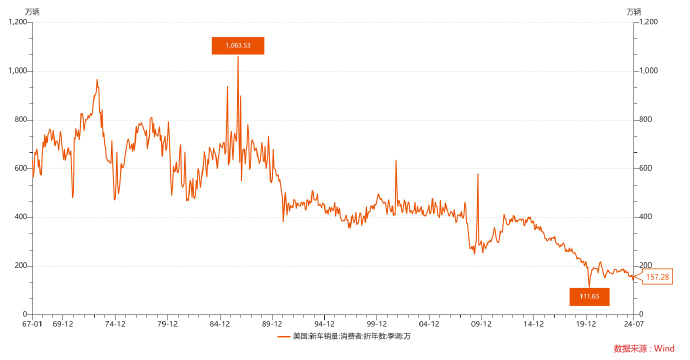

:::tip

***上周盲订了一台比亚迪海豹06GT双电机四驱版***

都TM已经2024年了，买纯电车早就不是什么存在疑问的问题了，所以后面很多内容在当下，都是不需要解释的废话了。但也曾是之前自己的一些所思所想，所以也就索性留着。

这篇文章除了第一部分是关于这台车的购买决策以外，后面都是之前记录的一些关于汽车行业的认知和观察。

毕竟是自己的第一台车，还是有点兴奋的

:::


## 为啥买海豹06GT？


其实，早在2019年年底就动了买车的念头了（印象中当时考虑的是雷车ES200、亚洲龙、volvo s60 或者 volvo v60的），但是转过年就是2020年疫情，紧跟着2021年之后国产新能源车崛起，各种新车目不暇接，到2022年打算买极氪001，去线下试驾了一下，很满意，但是车子太大了，不是很喜欢。再之后2023年开始价格战，新车各种降价升配置，心想那就等等吧，一直关注新车和汽车产业的一些变化，倒也不急着买了。直到最近，看着车企也卷得差不多了，打算在年前弄台新车。

***这次选车，自己出钱嘛，也就不需要参考别人的意见，全按照自己喜好来。从一开始就排除了所有SUV和三厢，所以能选的也不多了。*** 还是喜欢两厢小车，比如 宝马130i、大众golf、奥迪A3 这种的，也就是长4300mm（轴距2600mm）左右的。

<details>
<summary>为什么排除SUV和三厢车？</summary>

***我更看重操控、视野、安全性、通过性、动力、智驾，其次是空间和舒适性、油耗、价格（保值率、维护成本、保险费用）。***

通常来说

- 轿车的视野都比SUV更好（可视范围更大、视觉盲区更小）
- 小车比大车的操控更好（这点毋庸置疑）（可以笼统地认为大型、中型和小型车的轴距分别大概3m、2.7m、2.5m）

</details>

但是现在国产新能源车里，这种两厢小车就不多了，还不错的也就 海豹06GT、MG4 mulan (MG4 EV) 和 领克02HB，除了这些之外基本上都是“剁椒鱼头”

再加上我对车的定位，就是城市通勤，对车子尺寸的要求，最多最多也就4600mm，所以就排除了 Z9GT、极氪007旅行版 这些车。再者说了，这些车都是30w起的，也超过我的预算了。我的预算就是20w左右。


<details>
<summary>两厢车、旅行车、猎装车</summary>

两厢车、旅行车、猎装车

- 两厢车和旅行车的区别：两厢车就是三厢车去掉后备箱嘛，*旅行车其实就是大号两厢车*（正常两厢车4300mm，而旅行车则为4600mm）
- 旅行车和猎装车的区别：猎装车就是“后备箱够大的两门车”，其基本特征是两门车。可以理解为脱离了实用主义的旅行车，也就是高端旅行车。*但是现在大部分猎装车都做成四门车了，也就是比旅行车更大号的两厢车* （猎装车尺寸没有统一标准，通常大于4600mm，有4800mm甚至5200mm的）

两厢车的好处：

- 小车操控好、好停车，日常通勤远好于
- 两厢后备箱开口空间大（其实比三厢车更能装东西）

</details>


所以狭义地说，海豹06GT应该算是旅行车（而非两厢车）

当然，这也还行吧，毕竟传统两厢车确实有点太小了，这个车还能兼顾部分家用。


<details>
<summary>x</summary>

```yaml
- name: golf
  尺寸: 4296*1788*1471mm
  轴距: 2631mm

- name: 宝马130i
  尺寸: 4239*1748*1421

- name: 奥迪A3
  尺寸: 4351*1815*1458
  轴距: 2630mm

---


#- name: 极氪 X
#  尺寸: 4450x1836x1572
#  轴距: 2750mm
#  price: 20w左右


- name: 极氪 MIX
  尺寸: 4688x1995x1755
  轴距: 3008mm
  des: 视野不太行，整个车比极氪001还高很多

- name: 极氪 001
  尺寸: 4977x1999x1545
  轴距: 3005mm
  des: 车子太长了

- name: 极氪007
  尺寸: 4865x1900x1450
  轴距: 2928mm
  des: 三厢车，没办法当床车用


---


- name: 领克02HB
  尺寸: 4458x1890x1486
  轴距: 2702mm
  price: 15w~17w
  des: 2022年停产了

- name: MG4 EV
  尺寸: 4287x1836x1516
  轴距: 2705mm
  price: 18w
  des:

- name: 哪吒S猎装
  尺寸: 4980x1980x1480
  轴距: 2980mm
  des: 还不错，价格很香（17w左右就能拿下），但是略大了，并且品牌不太行

- name: 海豹06GT
  尺寸: 4630x1880x1490
  轴距: 2820mm

```

</details>


## 为啥我们要应该支持国产汽车？


:::info

总的来说就是三方面：

- 从个人使用角度出发，***电车就是比油车更适合城市通勤***。这点是毫无疑问的。换言之，这里的逻辑是，我需要电车，而国产现在电车就是做的比进口车更好，所以我选择国产车。
- 从产业角度出发，汽车产业是在全球产业中是毫无疑问的制高点。支持国产车，就能在国内创造更多的就业岗位，也有利于我们自己。
- 退一万步说，即使不买国产车，也应该舆论上支持国内汽车产业。这样也能避免被“两田”这样的外国车企割韭菜。

:::


### 新能源车相较于燃油车的优缺点

<details>
<summary>新能源车相较于燃油车的优缺点</summary>


```markdown

新能源汽车的优势：
1. 环保：新能源汽车不使用化石燃料，因此不会产生有害的尾气排放，有助于减缓全球气候变化和环境恶化。
2. 节能：新能源汽车的能量转换效率较高，能有效降低能源消耗，提高能源利用效率。
3. 低运行成本：新能源汽车的运行成本相对较低，因为电力价格通常低于汽油价格，且电动汽车的维护费用较低。
4. 性能优越：新能源汽车具有较高的扭矩和更快的加速性能，驾驶体验更好。
5. 低噪音：新能源汽车在行驶过程中产生的噪音较低，有利于改善城市环境质量。

新能源汽车的劣势：
1. 充电设施不足：新能源汽车的普及需要完善的充电设施网络，目前许多地区仍然存在充电难问题。
2. 续航里程焦虑：相较于传统燃油汽车，新能源汽车的续航里程较短，这可能会影响消费者的购买意愿。
3. 初始购车成本高：虽然新能源汽车的使用成本较低，但其较高的初始购车成本可能会阻碍消费者购买。
4. 电池回收和处理问题：新能源汽车使用的锂离子电池具有一定的生命周期，如何有效地回收和处理这些废弃电池是一个亟待解决的问题。
5. 技术成熟度：虽然新能源汽车技术取得了显著进展，但在某些方面（如电池寿命、充电速度等）仍有待进一步提高。

```

</details>


不扯什么环保、汽车产业之类的东西，就从用车角度出发

用车成本（油费、保养、维修、保值率）、充能速度、

再则，不说什么，新能源车就是国产品牌弯道超车的一个抓手，或者说用来塑造认知的工具。把之前占据国内汽车市场的外资赶出去就行了呗。最近开始开放大众之类的外资品牌开始独资之前的合资品牌，就是明证。

放开外资独资，两点作用，一是“食之无用，弃之可惜”，二是让外资车企在国内拿出真本事，增加在国内市场的竞争。

再则，***汽车产业其实就是个利润更高的制造业，或者说高端制造业（正常来说平均利润率20%左右，2023平均利润率5%是特例），确实无法满足金融资本轻资产、可复制、高收益、（快迭代、高周转）的需求。更适合产业资本的投资逻辑。***

另外，我想说的是，我比较认同一个观点“智能汽车，欧洲和日韩缺智能，美国缺汽车”，但是两者能否结合呢？很难，不提合作时谁主导的问题，本身美国车企和汽车市场有结构性问题，跟其他市场都不太一样，这点就很难解决，具体不提。


### 带动国内产业链


[供应链新军丨跟着新能源车崛起的超 360 亿元市值芯片工厂](https://www.latepost.com/news/dj_detail?id=2089)


### 关于欧盟计划对中国进口车进行反补贴调查的一些想法


关于欧盟计划对中国进口车进行反补贴调查的一些想法：

- 首先，汽车的这块蛋糕太大了，可以说西欧发达国家的优渥生活几乎完全建立在优势汽车工业的基础上。打个比方就是一顿饭中的主食，真正抗饿的东西，其他的奢侈品、红酒等等只能说是小菜。如果不仅是在国内，他们吃不到这块蛋糕了，还要分一部分他们的固有蛋糕。实话说，换位思考一下，这些举措是完全正常的。
- 根据开源信息，这次调查主要由标致发起，德国车企和法国的雪铁龙集团则持有反对意见。相比反对方，发起方力量并不强。
- 法国的诉求，想要在法国搞类似国内燃油车时代的合资车企，在法国国内搞新能源车工厂，为了达到这个目的而要价。抛出这个调查“漫天要价”，下面该我们“坐地还钱”了。
- 法国想搞新能源车产业的挑战在于，没有便宜能源和便宜人力。但是法国有充足的核电，结果也未可知。我倒是希望他能成功。


2700w 乘 6w，相当于每年 19000 亿的盘子

先解释这几个数字：

- 2700w 为 2022 年中国大陆的全年乘用车销售量。常年数据相差不大，基本可以采用。
- 6w 则为粗估每台车的利润，国内乘用车长期 `10w~15w` 占 30% 多，10w 以下占 25% 左右，剩余 45% 左右则为 15w 以上车型。再则按照各厂商财报里公布的利润率，燃油车普遍利润率在 `40%~50%`，新能源低点，除了新势力（还在亏钱，但是其市场份额几乎可以忽略不计），BYD 和特斯拉都在 `20%~40%` 波动。而燃油车和新能源的比例在 2022 年仍然 73 开（直到 2023 年 9 月，新能源才到 40%）。综上，我们按照均价 `15w*40%`，得到利润 6w 左右，这个数据保守了一些，实际利润可能在 `6w~8w`。

之前二十多年这每年将近 2w 亿的盘子，合资厂商中的外资方是要吃到一半的。现在吃不到了。


大众集团（包括大众、奥迪、保时捷、斯科达等子品牌）全年销量在 800w~1000w，宝马集团和奔驰的全年销量都在 200w~250w，合计销量 1300w~1400w。


### 日系车在国内的超额利润


<details>
<summary>日系车在国内的超额利润</summary>

```markdown
23年丰田财报，从中国赚走90亿人民币。这还不包括小日本各种坏水招数赚走的钱，包括且不限于：强行指定的关联供应商，强制外购关键零件，强制供应商出钱满足日本本土的认证。

而广汽23年归母利润才44.29亿人民币。这里丰田只占不到一半（也就是应该不到23亿）。另一方面一汽丰田销量比广汽丰田更少。

换句话说，大概率一汽和广汽集团加起来，在丰田品牌下只赚了不到45亿人民币。而这是合资的。意味着，南北两个合资的国资部分，根据51%股份，只从丰田子品牌赚到了不到23亿人民币。

也就是说，不考虑各种限定指定供应商，日本从中国赚取的额外垄断利润。仅仅看丰田车销售。日资赚走的钱，要超过广汽集团的国资部分赚到的钱的4倍。

曾庆洪抱怨太卷的原因，要解决其实很简单。那就是坚定的国产化，包括品牌国产化。要让传祺、埃安压倒丰田本田。23年广汽丰田销量90万。假设降低到20万，损失70万销量，换传祺+埃安增加50万销量。表面看总销量损失了20万。但是国资利润却可以明显提升。

也就是说，如果曾庆洪愿意挺直腰杆支持国有品牌和纯国有供应商。立刻就有了卷的底气。

总结：只要在版权和认证费上做到国产替代，广汽有足够的利润空间去卷。比吉利、长安等空间大得多。

```

***两田从中国赚到的钱，除了汽车销售以外，还有强行指定的关联供应商，强制外购关键零件，强制供应商出钱满足日本本土的认证。***


看完之后，产生两个问题：

- 为啥呢？按理说国内的丰田都是国资占51%，为啥利润还不如给外资的？
- 广汽丰田+一汽丰田总利润45E，那国资就是23E，那外资就是22E，为啥丰田财报写的是90E呢？


</details>


## 中国汽车出海


### 全球汽车消费市场：各国汽车消费能力如何？


各国新车销量

*东盟十国里只考虑泰国、印尼、马来西亚可供考虑，但是综合来说，泰国是最佳选择。*

```yaml
泰国:
  - 人口: 7100w
  - 2023年汽车销售量: 77w # 2022年销售量为85w
  - 比例: 108辆/万人

俄罗斯:
  - 人口: 14400w
  - 2023年汽车销售量: 150w
  - 比例: 104辆/万人

美国:
  - 人口: 33300w
  - 2023年汽车销售量: 1546w # 但相较于疫情前2019年销量1700万辆仍有差距，同比增长12.4%，创十余年来最大涨幅。
  - 比例: 464辆/万人

中国:
  - 人口: 141200w
  - 2023年汽车销售量: 3009w
  - 比例: 213辆/万人
```


[各国人均汽车拥有量列表 - 维基百科，自由的百科全书](https://zh.wikipedia.org/zh-cn/%E5%90%84%E5%9B%BD%E4%BA%BA%E5%9D%87%E6%B1%BD%E8%BD%A6%E6%8B%A5%E6%9C%89%E9%87%8F%E5%88%97%E8%A1%A8) 这个数据滞后有点严重，2022年全国汽车保有量是3.19亿（226辆/千人，排名86），2024.6该数据为4.4亿（314辆/千人，排名70左右），但是我国的汽车保有量仍然不高，看来仍然有很大的发展潜力。*除此之外，还有汽车强制报废政策的影响，也减少了汽车保有量，提高了新车销量。*

---

因为这个数量确实超过我本身的预期，所以我就想知道能否根据这些数据计算出我国的人均换车周期

算了一下，大概平均为14年到15年，符合预期

之前的政策就是，私家车15年强制报废（现在改成60万公里“引导报废”）


:::info

上面列出了两组数据，新车销量 和 汽车保有量

***可以看到，美国的汽车消费能力还是很强，是中国人均汽车销量的2倍，是大部分国家的4倍。***

从汽车保有量来看，我国的新车销量仍然有很大的潜力。

---

***根据新车销量和汽车保有量，可以计算出该国的人均换车周期***。试着推算了几个国家，数据都基本吻合。

:::


---





### 中国汽车出海，主阵地是哪儿？


[中国汽车出海，主阵地是哪儿？-虎嗅网](https://www.huxiu.com/article/2307226.html)

```markdown
今年中国汽车出口预计达到450万辆，西欧和东盟成为主要出海地区。新能源汽车出口增速超过整体增长。

• 西欧和东盟将成为中国汽车出口的主要市场，中国品牌在电动化和智能化方面有优势。

• 中国自主品牌在2030年有望在欧洲出口达到70万辆。

• 提升当地消费者对中国汽车品牌的认知是快速打开市场的关键。
```

西欧和东南亚正好是向上和向下两个价格区间


### 2023汽车价格战


***[汽车价格战已经打了一年半，16 张图记录这场淘汰赛](https://www.latepost.com/news/dj_detail?id=2379)***


[汽车价格战持续一年，没有赢家](https://www.latepost.com/news/dj_detail?id=2016)


### BYD


- *[比亚迪的车更便宜了，毛利却提升了](https://www.latepost.com/news/dj_detail?id=1835)*
- **[比亚迪与特斯拉：垂直整合 AB 面](https://www.latepost.com/news/dj_detail?id=1777)**
- [比亚迪的临界点：饥渴与克制、混乱与效率](https://www.latepost.com/news/dj_detail?id=1755)


```markdown

佐证之一是，比亚迪延续了 2022 年来的增长势头。今年 5 月，比亚迪卖出了超过 24 万辆车，同比增长 109.4%。1-5 月，累计销量超过 100 万辆，同比增幅为 97.63%。

...

换电不是乘用车的主流方向

王传福的判断是，在乘用车领域，换电不是必要的。

他认为，换电模式在“五六年前还不错”。但随着动力电池能量密度的提升，主流车型的续航可达到 600-800 公里，已能满足人们日常出行需要。就像手机电池容量足够时，换电池的方式就会被淘汰。同时，换电还带来换电站面积大、维护周期长、电池标准、结构安全和零部件磨损等问题，已经不是乘用车领域的主流。

能量密度也不再是电池最重要的指标。他认为，客户最看重的指标可能会变成安全和性价比。

```


---

[无惧调查，比亚迪启航欧洲！「孙少军和他的朋友们」_哔哩哔哩_bilibili](https://www.bilibili.com/video/BV1hb4y1P7P3/)

> 一船船车运过去，把港口堆起来，堆到当地开始打价格战。底线是试出来的，不是谈出来的。


### 理想


[理想的华为恐惧症：从被重创，到猛学](https://www.latepost.com/news/dj_detail?id=2064)

IPD

```markdown
随着组织流程和培训体系的完善，理想的招人和用人策略也开始发生变化。去年 10 月，李想在个人社交账号上发布了理想汽车校招特别通道，称 “每年超过 60% 的新员工都是校招”，欢迎各个专业领域 “最顶尖学校” 的 “最顶尖专业” 的学士、硕士、博士。

李想还在得到产品课上提到，理想有完整的校招生的人才培养体系，只要经过基础的培训，每个驾驶员都会 “开车”——使用流程工具，并能 “上高速公路”——高效完成工作。“哪怕是一个刚毕业的校招生，都可以获得快速的成长，而不需要传统的师傅带徒弟的模式。”

这同样参考华为的人才培养制度。华为 1997 年开始大规模招应届生，培养 “纯血华为人”。华为重要部门的管理者只通过内部提拔，通过轮岗、内部培养制度，把只懂技术的人培养成管理产品线或事业部的领导。余承东、邹良军都曾是华为招来培养的毕业生。
```


### 为啥说日本汽车工业要完蛋


```markdown

从现在来看，日本汽车工业的“现在”和“未来”都被中美摁死了。

从全球市场的角度来看就清楚了。

日本是一个以外销出口（技术和整车）为绝对核心的汽车工业大国，2022 年全球乘用车销量在 7200 万辆左右，如果按照规模分为三级市场。

第一级别是中欧美，年销量破千万，单纯一家中国 2340 万辆就占到了全球销量的三分之一，加上美国的 1380 万辆就超过了全球销量的 50%，欧洲市场是散的，但是零零碎碎整合在一起也破了 1120 万辆。

也就是说这三家加起来，就占到了全球销量的 65% 以上。所以其他快消品说退出 XX 市场都有可能，汽车不可能。因为市场太集中了，对于像日韩这样以出口为导向的国家丢了任何一个都是致命的损失。

第二级别是日印和各个经济大区，这个级别新车的销量在 100~400 万区间，印度为什么今年特别开心，就是因为他们挤掉了日本，以 436 万辆跻身全球新车销量排行榜第三名。这些市场往往是一些二三线品牌的核心市场，比如标致、铃木。

而除了国家，实际上还有一些经济大区，比如东盟、中东、南美洲，这些地区每个国家新车销量可能都只有大几十万甚至十几万辆，但是属于一个共同的经济文化圈，体量不大，不过经济发展较高，结果就是很容易产生一两个工业强国席卷控制的效果。

比如东盟，一直是被日系车当成禁脔一样的存在，包括我们的台湾省，也是被日系车完全倾销。直接结果就是这些地区的美国车和欧洲车都被日本车挤出了市场，或者只能占领一个细分领域。

第三级别则是非洲，西亚还有部分经济地区。它们的特点就是穷，穷到最基本的新车销量都没法统计出来。很多时候它们不是新车销量的市场，而是欧美日韩这些头部新车市场的二手车垃圾场。

跟这些地区的经销商聊过，他们甚至有专门的软件可以从日本直接买到想要的二手车，而大量淘汰下来的二手车卖到了这些地区，因为缺少体系化的销售维修体系，导致路上车五花八门，然后被国内 YYP 这种垃圾车评人称为有汽车文化。

好，这时候回归主题。现在市场在发生什么？

第一级别市场，新能源占比在快速突破，其中中、美（其实就是特斯拉）几乎完全吃掉了所有的新能源份额。特斯拉不仅在美国，在中国和欧洲都杀得天昏地暗。而这些国家市场因为智能化后涉及的大量工人就业，数据安全，基础充能等等搭建，也开始越来越偏向本土品牌。各国都给出了本土品牌的补贴政策，鼓励本土品牌发展。

作为外来者的日系就尤为尴尬，并且因为在新能源市场毫无建树，是眼睁睁的看着这些市场被中美两家瓜分。

第二级别市场，日本传统优势的东盟，中东被中国品牌冲的一塌糊涂，吉利宝腾在马来西亚已经把日系合资的几家车企挤得痛不欲生。然后长安、长城、比亚迪都陆续在泰国、印尼建厂，这些都是日系在东南亚的核心市场，现在无一例外都被中国车企冲击了。

结果就是比亚迪门口深夜排队买元 PLUS 的泰国民众。同样的还有特斯拉，靠着上海工厂庞大产能，源源不断的输出东盟。

第三级别市场，非洲和西亚，中国人搞了一带一路，深耕非洲市场，然后借着华人商会对当地市场的了解，开始在搭建一套全新的销售维修体系。

以前讲过吉利在安哥拉开连锁 4S 店的例子，因为关税腐败等等问题，在西亚和非洲买二手车的价格并不比新车便宜，当带着服务和维修保障的国产车杀进去的时候，对非洲人来说无异于降维打击。

这时候再回头看日本的定位：一个以外销出口为核心的工业强国。它面临的是：
中美在新能上的巨大冲击（工业能力不再领先）
中国依靠工业优势，对核心市场巨大冲击（核心市场快速丢失）
中国依靠规模优势，正在重新搭建市场生态（直接把门都关了）

因此日系并没有做错什么，就是中国崛起了，工业规模优势带来的降维打击，让日本汽车工业不再是可以坐地起价的香饽饽。

而特斯拉比亚迪引领的新能源化正在席卷全球，日本跟进的话无异于直接放弃传统工业优势，海外市场丢失的速度只会更快，转型无异于找死。

所以日系车衰落是必然，因为真的无路可走了。

```


---


团队、产品、渠道

```markdown

从 8 月以来新能源价格战极端惨烈，前天说主流合资进店订单下滑，评论区说了句“到今天还拿不出有竞争力新能源车型的品牌，可以提前宣布退场了。”有评论说太直白，那不妨更直白点。

日系为什么一定会死，因为新能源车不只是车，什么都变了。

去年 11 月给机构做 2023 年前瞻预判，就回归到最根本的三个方面：团队、产品、渠道，这三点日系不能说毫无建树，压根就是躺平等死。

转型不是问题，事实上从比亚迪到国企都在转型，不拿新势力和比亚迪，只拿同样在转型的三家国企品牌岚图、阿维塔、智己做个对比：

团队：都是把全部资源集中到新品牌上，才能全盘新势力化跟得上市场竞争，舍得投入资源竞争。

不管是新岚图 FREE 的 26.69 万，智己 LS6 预售 23 万起还是阿维塔 11 杀到 28 万，都是玩命跟进甚至搅动市场竞争，才能杀出好看订单数据。最近加我的岚图朋友很多，都提到新岚图 FREE 为了能争取到上市价格内部做了激烈讨论和资源倾斜，中间的几次问题，团队都是快速沟通解决，

这时候反问一句：日系有独立品牌，把资源集中，甚至主动参与市场竞争吗？

渠道：新能源车是无法回到原有 4S 店销售的，所以要搭建一个更靠近客户、更强调体验服务的销售体系。这三家的门店同样开在客流更密集的商圈，同样的直营服务流程，同样的主动上门试驾。

在这个如此竞争激烈的环境下，谁离客户越近，体验越好，谁才更有机会活下来。

这时反问一句：日系有为新能源车搭建新渠道吗，有考虑过如何体现自己的新能源产品优势吗？

产品：有竞争力的新能源车型，不仅仅是车本身，还有产品定义和销售规划。

新岚图 FREE 是 8 月最成功的发布会，当客户需要标配即顶配的时候，它做到了。当新车爆款必须发布即到店，到店即试驾，试驾即交付，它也做到了。智驾接受度明显增加，立刻追加一个有吸引力的 1 万智驾选装包。

这时候反问一句：且不说体验交付，日系有哪款竞争力的车型？

而这三点看透了，到最后还是钱的问题。岚图、阿维塔、智己都能破釜沉舟的加入市场竞争，而日系品牌到今天还是只把中国市场当成下单的金母鸡，挣钱可以花钱不行，都不要说产品，连开直营店的成本都舍不得掏。

它们拿什么说自己能活下去？

```


