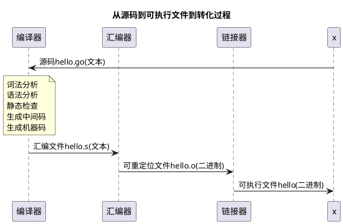

```yaml
- name: 《编译原理之美》
- name: 《编译原理实战课》
- name: 《用Go语言自制编译器》
- name: 《用Go语言自制解释器》

- name: 《编译原理》
  author: 阿霍
- name: 《高级编译器设计与实现》
- name: 《编译器设计》
  author: Keith Cooper
```


[Project_5.pdf](https://cs.nju.edu.cn/changxu/2_compiler/projects/Project_5.pdf) compiler优化


## 《编译原理之美》


[编译原理之美](https://learn.lianglianglee.com/%E4%B8%93%E6%A0%8F/%E7%BC%96%E8%AF%91%E5%8E%9F%E7%90%86%E4%B9%8B%E7%BE%8E)


## 《编译原理实战课》

[编译原理实战课](https://learn.lianglianglee.com/%E4%B8%93%E6%A0%8F/%E7%BC%96%E8%AF%91%E5%8E%9F%E7%90%86%E5%AE%9E%E6%88%98%E8%AF%BE)


## 《用Go语言自制编译器》


《用Go语言自制编译器》和《用Go语言自制解释器》

[OctopusLian/monkey: 《用Go语言自制解释器+编译器》](https://github.com/OctopusLian/monkey)

[PiNengShaoNian/monkey-go: 用Go语言自制解释器，用Go语言自制编译器go代码](https://github.com/PiNengShaoNian/monkey-go)

[yonh/go-monkey-interpreter: 用Go语言自制解释器](https://github.com/yonh/go-monkey-interpreter)


## 《高级编译器设计与实现》


## 《编译器设计》


## [WIP] golang compiler

- golang 编译由哪几个阶段构成？
- *对 golang 编译器有哪些优化？*
- 怎么通过 AST 树对 golang 源码进行分析？


<details>
<summary>怎么学习“编译原理”？</summary>

- 我们想要学习编译原理，也只是想自己写一个编译器，从而更好地理解这些高级语言。但是，对于新手，一开始就写编译器不一定是很好的选择，因为编译器的重点在于后端，而后端知识对于普通程序员而言用处不大。
- 应该尝试实现一个简单但是完整的编译器，尽早尽快地把编译器的整个流程过一遍，从而在整体上形成对编译器的认识。而不是看太多理论知识。
- 先学习解释器的实现，这样可以把学习重点放在类型、作用域等知识上，所谓解释器就是直接在语法树上运行，而不编译为目标语言，推荐一本很好的书：Essentials of Programming Languages，该书同为实践向教材，浅入深地讲解了各种解释器的实现，内容覆盖了环境的表示、continuation、类型检查、类型推导、OO 语言的基本实现

</details>


:::danger
编译原理相关的知识，其实对普通程序员而言用处不大。

因为compiler的重点是后端，而后端对普通开发没啥用。应该先学着写一个interpreter，然后再实现一个简单而完整的compiler，基本上就足够了。
:::


### golang 编译由哪几个阶段构成？

*由`词法分析`、`语法分析`、`类型检查`、`生成中间码`、`生成机器码`这 5 个阶段构成*

编译前端

1. `词法分析`，把源码翻译成 token，token 分为变量名、字面量、操作符、分隔符和关键字。早期 golang 使用通用词法分析器 lex，后来改用了 golang 自己实现的。
2. `语法分析`，将 token 转成 AST 树，有`包名ast.Indent`、`导入声明ast.GenDecl`、`函数声明ast.FuncDecl`三个子节点
3. `类型检查`

编译后端

1. `生成中间码`，AST 转 IR(中间码)，golang 使用`SSA特性的IR`，这种形式的中间码，最重要的一个特性就是在使用变量之前总是定义变量，并且每个变量只分配一次
2. `生成机器码`，*优化后的中间码，首先会被转成汇编代码 (Plan9)，而汇编代码只是机器码的文本表示，还不能执行。所以这个阶段会调用汇编器，汇编器会根据我们在执行编译时设置的架构，调用对应代码来生成目标机器码*


```markdown
### 编译和解释（重要）

解释型语言和编译型语言有什么区别？

*编译和解释的区别只在于代码是什么时候被翻译成目标 CPU 的指令的*，编译型语言在编译过程中生成目标平台的指令，解释型语言在运行过程中才生成目标平台的指令。(虚拟机的任务是在运行过程中将中间代码翻译成目标平台的指令)

C/C++ 都是编译型语言，而 java/C#/PHP 都是解释型语言

- 虽然 java 在运行之前也有一个编译过程，但是并不是将代码编译成机器语言，而是编译成字节码，在运行的时候，由 JVM 将字节码再翻译成编译码，机器可以直接执行。python 同样。
- js、PHP 之类的脚本语言不需要编译，可以直接使用，由解释器负责解释
- 只说语言本身，PHP 和 java 都解释执行的时候，其实是一样的，都是先编译执行再解释执行，唯一的区别在于 java 是先编译，运行时直接在 jvm 里编译成机器码；但是 PHP 运行时既需要解释执行也需要编译执行，带来的好处很多比如说热部署方便；坏处就在于性能变差；
- 使用 sapi 解释执行 PHP 时，通过 zend 转 opcode 码，再转为机器码；
- java 则是运行前 JVM 先转为 bytecode(其实也是 opcode)，运行的时候 JVM 再将 bytecode 转为机器码

```


### 对 golang 编译器有哪些优化？

- 详述 golang 编译器执行全流程？
- 执行 golang 可执行文件时，发生了什么？

---

- golang 编译器的历史？go1.7 之前使用`AST覆盖`的编译技术，go1.7 之后使用主流的基于 SSA-IR 的`SSA`


词法分析：8 个 bit 为一组，对应一个字符，按照 ASCII 表查出来


熟悉不同编译优化技术，如 IPA、LTO、PGO、FDO 等；理解部分编译优化概念，如 SSA、Alias Analysis、Dependence Analysis、Vectorization、Data-flow


```markdown


### 编译优化

编译器优化有哪些方法？

- 常量传播 cp
- 常量折叠 cf
- 死码消除
- 公共子表达式消除 CSE
- 循环不变代码移动
- 更好的寄存器分配

BCE(Bounds Check Elimination)


```


### SSA 是什么？及其特点？

*SSA-IR（Single Static Assignment）是一种介于高级语言和汇编语言的中间形态的伪语言*

- `Single`：每个表达式只能做一个简单运算，对于复杂的表达式 `a*b+c*d` 要拆分成：`t0=a*b; t1=c*d; t2=t0+t1;` 三个简单表达式
- `Static`：每个变量只能赋值一次（因此应该叫常量更合适）
- SSA 可以最大提高软件的可复用性，SSA 是产品级编译器的唯一解决方案，把 M*N 的问题转化成了 M+N
- *SSA 使用`BCE`(Bounds Check Elimination 边界检测消除) 和`CSE`(Common Subexpression Elimination) 优化可以让 golang 编译器生成更高效的代码*

---

[深入理解 Go 之 BCE 优化 - 大俊的博客](https://darjun.github.io/2018/05/07/bounds-check-elimination/)


### 内联


什么是内联？

- 内联是一个基本的编译器优化，*用被调用函数的主体替换函数调用，以消除调用开销，更重要的是启用了其他编译器优化*(这是在编译过程中自动执行的一种基本优化方法)

内联做了什么？

- 消除了函数调用本身的开销
- 允许编译器更有效地应用其他优化策略（比如`常量传播 cp`，`常量折叠 cf`，`死码消除`，`公共子表达式消除 CSE`，`循环不变代码移动`和`更好的寄存器分配`等）


---

内联的限制？

- 不是所有的函数都可以内联，必须是简短且简单的函数
- 简短体现在，必须少于 40 个表达式
- 简单体现在，不能包含复杂的语句，比如 loop, label, closure, panic, recover, select, switch 等

内联的越多开销就越少，为什么不尽可能使用内联呢？

*内联可能会以增加程序大小来换取更快的执行时间*限制内联的最主要原因是，创建许多函数的内联副本会增加编译时间，并生成更大的二进制文件；内联收益最大的是“小函数”，相对于调用他们的开销来说，这些函数做很少的工作；随着函数大小的增长，函数内部做的工作与函数调用的开销相比，省下的时间越来越少；函数越大，通常越复杂，因此优化其内联形式相对于原地优化的好处会减少；

`堆栈中间内联 (mid-stack)`
编译器默认不内联“堆栈中间函数”mid-stack（即调用了其他不可内联的函数）；堆栈中间内联可以提升性能，但是编译的二进制文件大小会增加；

`快速路径内联`

[一文搞懂 Go 内联优化](https://mp.weixin.qq.com/s?__biz=MzAxMTA4Njc0OQ==&mid=2651453599&idx=1&sn=6925019b1150ffd68b36092cff97ea64)


### 逃逸分析

- *什么是逃逸分析？为啥编译器要逃逸分析？golang 中有哪些可能出现逃逸的场景？怎么确定是否逃逸？*


```markdown

#### 概念：什么是逃逸分析？为啥编译器要逃逸分析？

> 什么是逃逸分析？为什么编译器要进行逃逸分析？

- *逃逸分析是一种确定指针动态范围的方法，简单来说就是分析在程序的哪些地方可以访问到该指针*
- 简单的说，它是在对变量放到堆上还是栈上进行分析，该分析在编译阶段完成。如果一个变量超过了函数调用的生命周期，也就是这个变量在函数外部存在引用，编译器会把这个变量分配到堆上，这时我们就说这个变量发生逃逸了。
- *golang 编译器通过`逃逸分析`，决定把一个变量放在栈上，还是堆上。变量作用域跑出函数范围，就分配在栈上。否则就分配在堆上。*
- *检查“变量的生命周期”是否是完全可知的，如果通过检查，就分配在栈上。否则，就逃逸到堆上。

> 为什么我们要了解逃逸分析？

- 理解编译时的逃逸分析，可以帮我们写出更好的程序。我们知道了变量分配在堆和栈上的区别，我们就可以*尽量写出分配在栈上的代码，堆上的变量变少了，可以减轻内存分配的开销，减小 gc 的压力，提高程序的运行速度。*
- 因为我们想要提升程序性能，通过逃逸分析我们能够知道变量是分配到堆上还是栈上，如果分配到栈上，内存的分配和释放都是由编译器进行管理，分配和释放的速度非常快，如果分配到堆上，堆不像栈那样可以自动清理，它会引起频繁地进行 GC，而 GC 会占用比较大的系统开销。

> 逃逸分析是怎么完成的？

先说结论，“编译器会根据变量是否被外部引用来决定是否逃逸”，对我们来说，我们不需要掌握编译器的这些逃逸分析规则，我们只需要通过`go build -gcflags '-m'`命令查看逃逸分析的情况就可以了；

另外，写代码的时候，也要注意“不要盲目使用变量的指针作为函数参数，虽然他会减少复制操作；但是当参数是变量自身的时候，复制是在栈上完成的操作，开销远比变量逃逸后动态地在堆上分配内存少得多”；我们应该尽量少写逃逸的代码，提升程序的运行效率；


<details>
<summary>可能出现逃逸的场景？有哪几种情况会发生逃逸呢？</summary>

- *变量类型不确定*，比如使用 interface 类型会逃逸，因为编译时无法确定类型；优化方案是将类型设置为固定类型；
- *变量大小不确定*
- *返回指针类型，会发生逃逸*；优化方案视情况而定；传参的时候，从逃逸分析的角度，什么时候应该传结构体，什么时候应该传结构体的指针呢？
  - 如果结构体很大，就应该传指针。
  - 直接传结构体，需要值拷贝，但是这是在栈上完成的操作，开销比变量逃逸后动态地在堆上分配内存少很多。
- *栈空间不足，就会发生逃逸；比如变量所占内存较大等情况*；优化方案就是尽量设置容量，如果容量实在过大就没有办法了；

</details>


```


### 编译原理

- 编译原理（词法分析和语法分析；生成中间码；目标代码；汇编；链接；预处理；）
- 编译和解释（解释型语言；自举）
- 运行时（引用）




*[万字图文 | 你写的代码是如何跑起来的？](https://mp.weixin.qq.com/s?__biz=MjM5Njg5NDgwNA==&mid=2247490743&idx=1&sn=45fd166a87c01b511be1fb2b5f20e38e)*


```markdown
### 编译器的工作原理？编译器是如何工作的？

- 编译器分前端和后端，后端用来“目标代码生成和优化”，比如 LLVM。


```


### go/ast语法树

AST 树的作用？

语法检查、单测框架生成

[利用 go/ast 语法树做代码生成 - 无风的内存空间 - SegmentFault 思否](https://segmentfault.com/a/1190000039215176)


### zzz

[PGO: 为你的 Go 程序提效 5%](https://colobu.com/2023/09/13/pgo/)

[PGO 是啥，咋就让 Go 更快更猛了？](https://mp.weixin.qq.com/s?__biz=MzUzNTY5MzU2MA==&mid=2247497141&idx=1&sn=0459901d47536d1460d8b025838245c8)


golang1.20 发布，v1.21 实装

```markdown

根据程序的不同，可能会带来 2% ~ 7% 的性能提升，相应的，就可以节省服务器资源，省成本

首先说了，对 golang 来说，或者对所有编程语言来说，提升性能是困难的，因为有各种制约因素无法同时兼顾。但是使用 PGO 就可以比较简单地提升性能。


什么是“基于 profile 指导的优化”?

当你构建一个 Go 二进制文件时，Go 编译器会执行优化，试图生成性能最佳的二进制文件。

例如，常量传播 (constant propagation) 可以在编译时计算常量表达式的值，避免了运行时的计算开销。
逃逸分析 (Escape analysis) 可以避免为局部作用域的对象分配堆内存，从而避免 GC 的开销。
内联 (Inlining) 会将简单函数的函数体拷贝到调用者中，这通常可以在调用者中启用进一步的优化 (例如额外的常量传播或更好的逃逸分析)。
去虚拟化 (Devirtualization) 会将接口值上的间接调用 (如果可以静态确定其类型) 转换为对具体方法的直接调用 (这通常可以内联该调用)。

使用应用程序行为的 profile 进行编译器优化称为基于 profile 指导的优化 (PGO)(也称为性能分析引导优化、反馈导向优化 (FDO))。
```


[编译器 笔记 - BlackGlory](https://blackglory.me/notes/compiler)

