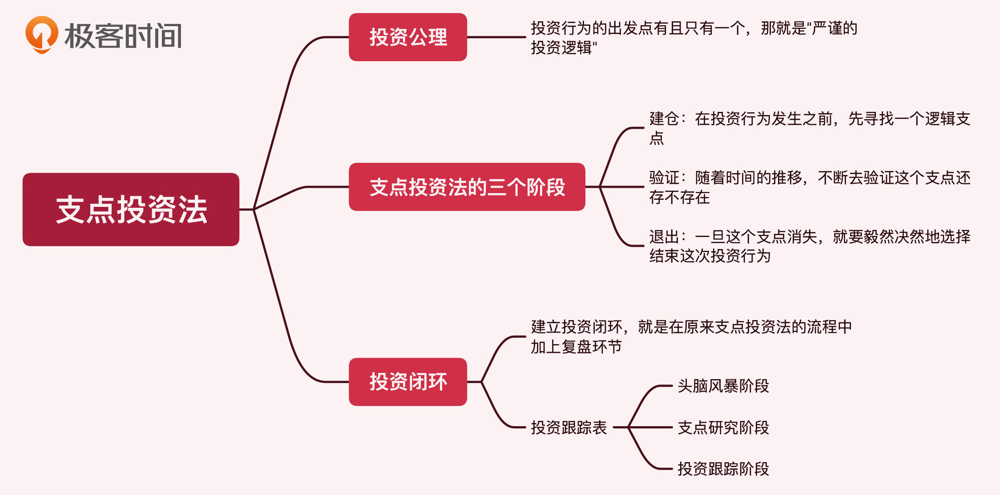
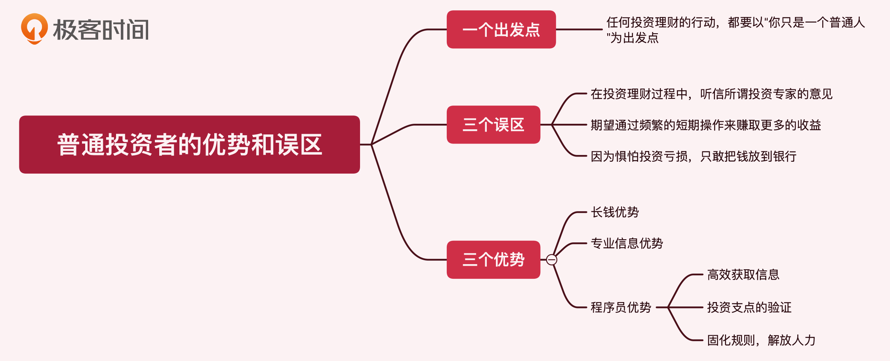
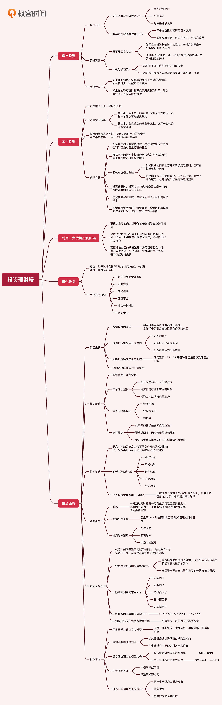

## 《Go 语言项目开发实战》读书笔记


[marmotedu/geekbang-go: 极客时间 《Go 语言项目开发实战》课程补充教程。](https://github.com/marmotedu/geekbang-go)


### git commit

[05 规范设计（下）：commit 信息风格迥异、难以阅读，如何规范？](https://learn.lianglianglee.com/%E4%B8%93%E6%A0%8F/Go%20%E8%AF%AD%E8%A8%80%E9%A1%B9%E7%9B%AE%E5%BC%80%E5%8F%91%E5%AE%9E%E6%88%98/05%20%E8%A7%84%E8%8C%83%E8%AE%BE%E8%AE%A1%EF%BC%88%E4%B8%8B%EF%BC%89%EF%BC%9Acommit%20%E4%BF%A1%E6%81%AF%E9%A3%8E%E6%A0%BC%E8%BF%A5%E5%BC%82%E3%80%81%E9%9A%BE%E4%BB%A5%E9%98%85%E8%AF%BB%EF%BC%8C%E5%A6%82%E4%BD%95%E8%A7%84%E8%8C%83%EF%BC%9F.md)

---


```markdown
如果我们变更了应用代码，比如某个 Go 函数代码，那这次修改属于代码类。在代码类中，有 4 种具有明确变更意图的类型：feat、fix、perf 和 style；如果我们的代码变更不属于这 4 类，那就全都归为 refactor 类，也就是优化代码。

如果我们变更了非应用代码，例如更改了文档，那它属于非代码类。在非代码类中，有 3 种具有明确变更意图的类型：test、ci、docs；如果我们的非代码变更不属于这 3 类，那就全部归入到 chore 类。

Angular 的 Commit Message 规范提供了大部分的 type，在实际开发中，我们可以使用部分 type，或者扩展添加我们自己的 type。但无论选择哪种方式，我们一定要保证一个项目中的 type 类型一致。
```


---


```markdown
提交频率
在实际项目开发中，如果是个人项目，随意 commit 可能影响不大，但如果是多人开发的项目，随意 commit 不仅会让 Commit Message 变得难以理解，还会让其他研发同事觉得你不专业。因此，我们要规定 commit 的提交频率。

那到底什么时候进行 commit 最好呢？

我认为主要可以分成两种情况。一种情况是，只要我对项目进行了修改，一通过测试就立即 commit。比如修复完一个 bug、开发完一个小功能，或者开发完一个完整的功能，测试通过后就提交。另一种情况是，我们规定一个时间，定期提交。这里我建议代码下班前固定提交一次，并且要确保本地未提交的代码，延期不超过 1 天。这样，如果本地代码丢失，可以尽可能减少丢失的代码量。

按照上面 2 种方式提交代码，你可能会觉得代码 commit 比较多，看起来比较随意。或者说，我们想等开发完一个完整的功能之后，放在一个 commit 中一起提交。这时候，我们可以在最后合并代码或者提交 Pull Request 前，执行 git rebase -i 合并之前的所有 commit。

那么如何合并 commit 呢？接下来，我来详细说说。
```


```markdown
修改 Commit Message

即使我们有了 Commit Message 规范，但仍然可能会遇到提交的 Commit Message 不符合规范的情况，这个时候就需要我们能够修改之前某次 commit 的 Commit Message。

具体来说，我们有两种修改方法，分别对应两种不同情况：

	git commit –amend：修改最近一次 commit 的 message；
	git rebase -i：修改某次 commit 的 message。
```


:::danger


```yaml
- git commit type 可以分为代码类和非代码类？这两类各自有哪些type? 怎么根据修改代码判断应该使用什么type?

- 提交频率
- 合并提交
- 修改 commit message
```


:::


### golang spec

:::tip

[code-spec.md](code-spec.md)

:::

[特别放送 给你一份清晰、可直接套用的Go编码规范](https://learn.lianglianglee.com/%E4%B8%93%E6%A0%8F/Go%20%E8%AF%AD%E8%A8%80%E9%A1%B9%E7%9B%AE%E5%BC%80%E5%8F%91%E5%AE%9E%E6%88%98/%E7%89%B9%E5%88%AB%E6%94%BE%E9%80%81%20%E7%BB%99%E4%BD%A0%E4%B8%80%E4%BB%BD%E6%B8%85%E6%99%B0%E3%80%81%E5%8F%AF%E7%9B%B4%E6%8E%A5%E5%A5%97%E7%94%A8%E7%9A%84Go%E7%BC%96%E7%A0%81%E8%A7%84%E8%8C%83.md)


### 分布式任务调度系统


[特别放送 分布式作业系统设计和实现](https://learn.lianglianglee.com/%E4%B8%93%E6%A0%8F/Go%20%E8%AF%AD%E8%A8%80%E9%A1%B9%E7%9B%AE%E5%BC%80%E5%8F%91%E5%AE%9E%E6%88%98/%E7%89%B9%E5%88%AB%E6%94%BE%E9%80%81%20%E5%88%86%E5%B8%83%E5%BC%8F%E4%BD%9C%E4%B8%9A%E7%B3%BB%E7%BB%9F%E8%AE%BE%E8%AE%A1%E5%92%8C%E5%AE%9E%E7%8E%B0.md)

```markdown
除了使用Linux系统自带的crontab之外，我们还可以使用一些业界优秀的开源作业系统。这里，我列出了一些比较受欢迎的Go语言开发的作业系统。之所以只选择Go语言开发的项目，一方面是想丰富你的Go语言生态，另一方面，同种语言也有助于你学习、改造这些项目。

distribworks/dkron。dkron是一个分布式、启动迅速、带容错机制的定时作业系统，支持crontab表达式。它具有下面这些核心特性。

	易用：可以通过易操作、漂亮的Web界面来管理作业。
	可靠：具备容错机制，一个节点不可用，其他节点可继续执行作业。
	高可扩展性：能够处理大量的计划作业和数千个节点。

ouqiang/gocron。gocron是国人开发的轻量级定时任务集中调度和管理系统, 用于替代Linux-crontab。它具有下面这些核心特性。
具有Web界面管理定时任务。

	支持crontab时间格式，并精确到秒。
	支持shell命令和HTTP请求两种任务格式。
	具有任务超时机制、任务依赖机制、任务执行失败可重试机制。
	支持查看任务执行日志，并支持用邮件、Slack、Webhook等方式通知任务执行结果。

shunfei/cronsun。cronsun 是一个分布式作业系统，单个节点同 crontab 近似。它具有下面这些核心特性。

	具有Web界面，方便对多台服务器上的定时任务进行集中式管理。
	任务调度时间粒度支持到秒级别。
	任务执行失败可重试。
	任务可靠性保障（从N个节点里面挑一个可用节点来执行任务）。
	任务日志查看。
	任务失败邮件告警（也支持自定义http告警接口）。

那么，这么多的开源项目该如何选择呢？这里建议你选择 distribworks/dkron 。原因是 distribworks/dkron Star数很多，而且功能齐全易用、文档丰富。当然，在实际开发中，你最好也对其他开源项目进行调研，根据需要选择一个最适合自己的开源项目。

使用这些作业系统的优点是不用开发、功能比crontab更强大，有些还是分布式的作业系统，具备容灾能力。但缺点也很明显：

	这些作业系统支持的任务种类有限，比如一般会支持通过shell脚本及发送HTTP请求的方式来执行任务。不管哪种方式，实现都跟项目分离，在开发跟项目结合紧密的任务插件时不是很简单、高效。
	很多时候我们只会使用其中一部分能力，或者仅有一到两个项目会使用到这类系统，但我们还要部署并维护这些作业系统，工作量大，收益小。
	没办法实现间隔任务。

```


:::danger

```yaml
- 自己基于 robfig/cron + redsync 自己实现分布式任务调度系统

```

:::


## 《许式伟的架构课》读书笔记

[许式伟的架构课](https://learn.lianglianglee.com/%E4%B8%93%E6%A0%8F/%E8%AE%B8%E5%BC%8F%E4%BC%9F%E7%9A%84%E6%9E%B6%E6%9E%84%E8%AF%BE) 可以看到这本书分为几部分，从6到19是kernel相关，都有点基础了，不看；20到33是桌面client相关，用不到不看；34到46是“服务开发篇”；47到56是“服务治理篇”；57到67是“架构思维篇”；68到77是“软件工程篇”。


“传道授业解惑”，许式伟这本书更多传达出的是，作为架构师，应该怎么思考，倒不涉及太多真正技术细节相关的东西。也就是更多是“传道”，而非“授业”。这在现在各种“教程类”的技术书里，也是独树一帜了。


---


[许式伟的架构课Day8如何阅读别人的代码为什么要阅读别人的代码 阅读别人代码的目的性: 我要评估是否引入第三方模块 我要 - 掘金](https://juejin.cn/post/7208188047707340855)

[《许式伟的架构课》笔记 | 李乾坤的博客](https://qiankunli.github.io/2020/11/24/architecture_note.html)


### 服务开发篇 (34-46)


```markdown
今天我们从流量调度谈起，聊了几种典型的调度手段和负载均衡的方式。

从流量调度角度来说，负载均衡的最大价值是让多个业务服务器的压力均衡。这里面隐含的一个前提是负载均衡软件的抗压能力往往比业务服务器强很多（为什么？欢迎留言讨论）。

这表现在：其一，负载均衡的实例数/业务服务器的实例数往往大大小于1；其二，DNS 的调度不均衡，所以负载均衡的不同实例的压力不均衡，有的实例可能压力很大。

当然，负载均衡的价值并不只是做流量的均衡调度，它也让我们的业务服务器优雅升级成为可能。
```

---

```markdown
那么，桌面程序和服务端程序的差别在哪？

它们最大的差别是业务状态的表示不同。

桌面程序的业务状态是如何表示的？内存中的数据结构。我们在上一章中提到，桌面程序的 Model 层是一棵 DOM 树，根结点通常叫 Document。这棵 DOM 树其实就是桌面程序的业务状态。

服务端程序的业务状态如何表示？用内存中的数据结构可以吗？

答案当然是不能。如果业务状态在内存中，服务端程序一挂，数据就丢了。

前面我们在 “[34 | 服务端开发的宏观视角]” 提到过：

服务端的领域特征是大规模的用户请求，以及 24 小时不间断的服务。

这句话是理解服务端体系架构的核心，至关重要。但某种意义上来说更重要的原则是：

坚决不能丢失用户的数据，即他认为已经完成的业务状态。

服务端对用户来说是个黑盒，既然用户收到某个 “网络API请求” 成功的反馈，那么他会认为这个成功是确认的。

所以，服务端必须保证其业务状态的可靠性。这与桌面程序不同，桌面程序往往需要明确的用户交互事件，比如 Ctrl+S 命令，来完成数据的存盘操作，这时业务状态才持久化写入到外存。而且对于大部分桌面程序来说，它并不需要支持持久化。
```


***“三高”是BE的基本需求，也是相较于FE的特征。***

---

```markdown
存储即数据结构。

存储中间件是什么？存储中间件就是 “元数据结构”。

这个结论的逻辑在于下面几个方面。

首先，和桌面开发不同，桌面端的数据结构基本上都是基于内存的，实现难度较低。但是在服务端不同。我们每一次的业务状态改变都需要考虑持久化，所以服务端的核心数据结构都是基于外存的。

其次，服务端的数据结构对稳定性要求、并发性能（IOPS）要求极高。简单分析就可以知道，服务端程序的伸缩能力完全取决于存储的伸缩能力。

业务服务器往往是无状态的，压力大了新增加一台业务服务器非常容易。但是存储压力大了，并不能简单加一台机器了事，可能涉及数据的重新划分和搬迁工作。

这意味着，在服务端实现一个数据结构是非常困难的。我们举一个很简单的例子，在内存中我们实现一个 KV 存储非常容易，很多语言都有 Dictionary 或者 Map 这样的数据结构来做这事。就算不用库，我们自己花上几十分钟或一个小时来实现，也是非常轻松的一件事情。

但是，一个服务端的 KV 存储非常非常复杂，绝非一个人花上一天两天就可以干出来。就算干出来了，也没人敢立刻投入使用，需要经过非常庞大的测试案例进行方方面面的验证，才敢投入生产环境。并且，即使敢投入生产环境了，为了以策万全，刚开始往往也是采用“双写”的方式：同时使用一个成熟存储系统和我们新上线的存储。

存储系统的品控，至关重要。

正因为服务端的数据结构实现如此之难，所以对于服务端来说，所有业务需要涉及的数据结构都需要抽象出来，成为一个存储中间件。

存储中间件会有多少？

这与服务端开发的模型抽象有关。今天没有比较系统性的理论告诉大家，有了这样一些数据结构就完备了。但是从更长远发展的角度来看，我们很可能需要回答这个问题。

所以，存储中间件是 “元数据结构”。

这里说的 “元数据结构”，是我自己发明的一个词。它表达的含义是，数据结构的种类是非常有限的，并且最好理论可被证明，有了这样一些基本的数据结构，所有的业务需求都可以高效地实现。这些基本的数据结构，就是我说的 “元数据结构”。

今天我们接触的存储中间件有哪些？不完整的列表如下：

键值存储（KV-Storage）；
对象存储（Object Storage）；
数据库（Database）；
消息队列（MQ）；
倒排索引（SearchEngine）；
等等。
目前看，存储中间件的种类是不可枚举的。但它很可能只是受限于我自己的认知，也许有一天我们能够在这个问题上找到更加完美的答案。
```

“正因为服务端的数据结构实现如此之难，所以对于服务端来说，所有业务需要涉及的数据结构都需要抽象出来，成为一个存储中间件。”

在作者看来，“存储中间件是 “元数据结构””，存储中间件也是一种数据结构，还是“元数据结构”。也就是说，这些“存储中间件”的本质其实就是某种做成了服务的“数据结构”，来进行远程调用。也举出了一些例子，比如说，kvbd其实就是kv，es本质就是倒排索引。这个说法，其实是从数据结构的角度来看各种database，当然，这个观点，也是作者从BE和FE的比较中得来的。

---


```markdown
缓存（Cache）和存储（Storage）是什么关系？它也是一种存储中间件么？

既是也不是。

首先，缓存和一般的存储中间件一样，也在维持着业务状态。从这个角度看，缓存的确是一类存储。

但是，缓存允许数据发生丢失，所以缓存通常是单副本的。一个内存缓存的集群挂了一个实例，或者一个外存缓存的集群坏了一块硬盘，单就缓存集群本身而言，就出现数据丢失。

...

回到前面的问题，缓存（Cache）和存储（Storage）到底是什么关系？

我个人认为，缓存其实应该被认为是存储的补丁，而且是理论上来说不太完美的补丁。

为什么说它是补丁？

因为如果存储本身非常匹配业务场景的话，它不应该需要缓存在它前面挡一道，内部自己就有缓存。至于把一个复杂的 F(x) 缓存起来，更根本的原因还是存储和业务场景不那么直接匹配所致。

但是实现一个存储很难，所以存储的业务场景匹配性很难做到处处都很好。

出现事务（Transaction），是为了改善存储的业务场景“写操作”的匹配性，把一个复杂操作包装成一个原子操作。

出现缓存（Cache），则是为了改善存储的业务场景“读操作”的匹配性，提升高频读操作的效率。

所以我们说，缓存是一个存储的补丁。

那么为什么我们说这是一个不太完美的补丁呢？

因为上面的 FastF(x) 并没有被包装成一个原子的读操作。从严谨的角度来说，这段代码逻辑是有问题的，它会破坏数据的一致性。

对于一个确定的 x 值，如果 F(x) 永远不变，这就没问题。但如果 F(x) 值会发生变化，会有多个版本的值，那就有可能会出现并发的两个 F(x) 请求得到的结果不同，从而导致缓存中的值和存储中的值不一致。

这种情况后果有可能会比较严重。尤其是如果我们有一些业务逻辑是基于 FastF(x) 得到的值，就有可能会出现逻辑错乱。

```

“需要cache，归根到底还是因为storage和业务场景本身不匹配造成的”

这个观点太棒了，也确实如此


解答了我之前的一个问题

kvdb 和 local cache 有啥区别

因为


---

```markdown
首先，缓存和一般的存储中间件一样，也在维持着业务状态。从这个角度看，缓存的确是一类存储。

但是，缓存允许数据发生丢失，所以缓存通常是单副本的。一个内存缓存的集群挂了一个实例，或者一个外存缓存的集群坏了一块硬盘，单就缓存集群本身而言，就出现数据丢失。

缓存数据丢失，这事可大可小。只要不是发生大片大片的缓存数据丢失的情形，通常只是会造成后端存储（Storage）的短时压力变大。

但在极端的情况下，可能会出现雪崩的情况。

雪崩怎么形成？首先是部分缓存实例宕机，导致缓存命中率（Cache Hit Rate）下降，大量的请求落到后端存储上，导致后端存储过载，也出现宕机。

这时就会出现连锁反应，形成雪崩现象。后端存储就算重新启动起来，又会继续被巨大的用户请求压垮，整个系统怎么启动也启动不了。

应该怎么应对雪崩？最简单的办法，是后端存储自己要有过载保护能力。一旦并发的请求超过预期，就要丢弃部分请求，以减少压力。
```

这里对cache avalanche的过程描述不错


---


```markdown
...

这些都让 Redis 看起来更像一个数据库类的存储中间件。

但当我们把 Redis 看作存储，我们有这样一些重要的问题需要考虑。这些问题非常非常重要，存储系统可不是闹着玩的。

问题一，是持久性（Durability）。Redis 毕竟是基于内存的存储，虽然它也支持定期写到外存中，但是定期持久化的策略对于一个服务端的存储系统来说是不合格的。因为如果发生宕机，上一次持久化之后的新数据就丢了。

所以 Redis 需要其他的提升持久性的方案，比如多副本。

Redis 的确支持多副本。但是只是同机房多台机器的多副本是没有用的，因为它没有办法防止机房整体断电这类的故障。当出现机房级的故障时，就有极大概率会丢失数据。

对于存储系统来说，这是不可接受的。因为相比人们对持久性的要求，机房整体断电并不是一个太小概率的事件。

所以 Redis 如果要作为存储的话，必须保证用多机房多副本的方式，才能保证在持久性这一点上能够达标。

但是多机房多副本这样的方式，显然实施条件过于苛刻。会有多少企业仅仅是为了部署 Redis 去搞多个机房呢？

问题二，是重试的友好性。在 “[29 | 实战（四）：怎么设计一个“画图”程序？]” 中我们提到过，考虑网络的不稳定性，我们设计网络协议的时候需要考虑重试的友好性。

在 Redis 的协议中，有不少请求用户很友好，但是对重试并不友好。比如，LPUSH 请求用来给列表（List）增加一个元素。但是在重试时一个不小心，我们很可能就往列表中添加了多个相同的元素进去。

总结来说，Redis 如果我们把它作为存储的话，坑还是不少的。它和 memcached 都是实用型的瑞士军刀，很有用，但是我们站在分布式系统的理论角度看时，它们都有那么一点不完美的地方。
```

这里从分布式系统的角度出发，给redis本身挑了两个错：

- redis的多副本机制，只能保证同机房，无法保证跨机房。所以如果整个IDC出现问题，那就完蛋了。（当然这种情况的话，数据是不是本身也持久化道本地了，数据本身问题不大，只是服务挂了？）
- redis的写操作不支持幂等性？因为list本身就支持添加重复数据啊，相应的，set、zset就不支持添加重复数据。这个是ds本身就要求的。

所以，xsw可能这里的这两点都搞错了


---


[45 架构：怎么做详细设计？](https://learn.lianglianglee.com/%e4%b8%93%e6%a0%8f/%e8%ae%b8%e5%bc%8f%e4%bc%9f%e7%9a%84%e6%9e%b6%e6%9e%84%e8%af%be/45%20%e6%9e%b6%e6%9e%84%ef%bc%9a%e6%80%8e%e4%b9%88%e5%81%9a%e8%af%a6%e7%bb%86%e8%ae%be%e8%ae%a1%ef%bc%9f.md)


```markdown
实现：数据结构+算法
聊完使用界面，接下来就要谈实现原理了，它要体现的是我如何做到。

在 “[42 | 实战（二）：“画图”程序后端实战]” 一讲中，我们提到过以下这个大家耳熟能详的公式：

程序 = 数据结构 + 算法

它是一个很好的指导思想。当我们谈程序的实现时，我们总是从数据结构和算法两个维度去描述它。

我们先看数据结构。

数据结构从大的层面分，可分为基于内存的数据结构，和基于外存（比如 SSD 盘）的数据结构。

对于桌面程序，大部分情况下我们打交道的都是基于内存的数据结构。外存数据结构也会有所涉及，但往往局限于 IO 子系统。

但对于服务端程序，数据结构不完全是我们自己能够做主的。数据结构大部分情况下都是基于外存的，而且有极高的质量要求。
```

程序 = 数据结构 + 算法


```markdown
在 “[36 | 业务状态与存储中间件]” 这一讲中我们也说过，存储即数据结构。所以，服务端程序在数据结构这一点上，最为重要的一件事是选择合适的存储中间件。然后我们再在该存储中间件之上组织我们的数据。

这是数据库这样的存储中间件流行起来的原因。无论是关系型数据库，还是文档型数据库，他们都被设计为一种泛业务场景的数据结构，有很好的业务适应性。

所以在服务端我们谈数据结构，谈的不是内存数据结构，往往谈的是数据库的表结构设计。当然表（Table）是在关系型数据库中的说法，在 mongodb 中我们叫集合（Collection）。但不管我们用的是哪种数据库，出于惯例我们往往还是以 “定义表结构” 一词来表达我们想干什么。

描述表结构，核心需要包含以下内容：

字段名；
类型；
字段含义，以及是否指向另一个表的某个字段；
索引。


你会发现，其实定义表结构和定义内存数据结构本质是完全一致的。定义内存中的一个类（或结构体），我们也关心字段名（成员变量名）和类型，也关心字段的含义，以及它是否指向另一个类（或结构体）的某个字段（成员变量）。

但表结构比内存数据结构多了一个概念：索引。

索引为何存在？我认为有这样几方面的原因。一方面是因为数据库是泛业务场景的通用数据结构，它是动态的，需要依赖索引来提升数据访问的效率。另一方面是因为多租户。多租户导致数据量的爆发式增长，导致大部分情况下遍历查找变得不现实。

索引怎么设计？它完全取决于算法。算法里面使用了哪些数据访问的特征，这些数据访问的频次预期是多少，这些决定了我们添加哪些索引是最划算的。

在涉及的类比较多，或数据库的表结构比较复杂的时候，有时我们会用 UML 类图来对数据结构进行直观的呈现。

谈清楚了数据结构，我们接着聊算法。

在 “程序 = 数据结构 + 算法” 这个说法中，“算法” 指的是什么？在 “[42 | 实战（二）：“画图”程序后端实战]” 一讲中，我们这么说：

在架构过程中，需求分析阶段，我们关注用户需求的精确表述，我们会引入角色，也就是系统的各类参与方，以及角色间的交互方式，也就是用户故事。

到了详细设计阶段，角色和用户故事就变成了子系统、模块、类或者函数的使用界面（接口）。我们前面一直在强调，使用界面（接口）应该自然体现业务需求，就是强调程序是为用户需求服务的。而我们的架构设计，在需求分析与后续的概要设计、详细设计等过程之间也有自然的延续性。

所以算法，最直白的含义，指的是用户故事背后的实现机制。

数据结构 + 算法，是为了满足最初的角色与用户故事定义，这是架构的详细设计阶段核心关注点。
```


“程序 = 数据结构 + 算法” 是我们很熟悉的一个公式。它其实是怎么描述实现原理的很好的指导方针。当我们谈程序的实现时，我们总是从数据结构和算法两个维度去描述它。


“程序 = 数据结构 + 算法”这一公式被用来指导详细设计的过程。数据结构是程序中数据的组织和存储方式，它决定了数据如何在系统中被管理，包括在内存中或数据库等外存中的组织形式。算法则是操作这些数据结构的方法和步骤，它定义了如何通过一系列指令来解决问题或完成任务。在详细设计中，设计者需要明确系统的使用界面，即系统或模块如何被其他部分使用，同时也要描述数据如何在系统中流动和被处理，这涉及到选择合适的数据存储结构和定义操作数据的算法。简而言之，程序设计不仅仅是编写代码，更重要的是设计合理的数据结构和高效的算法，以确保程序能够有效地满足业务需求并运行高效。

应该说，这是一个高度抽象的概括。


:::danger

```yaml

- kvdb 和 local cache 是啥关系？有啥区别？ # 一个经典的区别是，是否支持持久化。但是 “需要cache，归根到底还是因为storage和业务场景本身不匹配” 是更好的理解

- 缓存雪崩的详细过程 #

- "***怎么理解“存储中间件的本质是数据结构”？***"
- "***怎么理解“程序 = 数据结构 + 算法”？***"

```


:::


### 服务治理篇 (47-56)

[47 服务治理的宏观视角](https://learn.lianglianglee.com/%e4%b8%93%e6%a0%8f/%e8%ae%b8%e5%bc%8f%e4%bc%9f%e7%9a%84%e6%9e%b6%e6%9e%84%e8%af%be/47%20%e6%9c%8d%e5%8a%a1%e6%b2%bb%e7%90%86%e7%9a%84%e5%ae%8f%e8%a7%82%e8%a7%86%e8%a7%92.md)

```markdown
我们的期望，是把服务治理建立成自治系统，而不是简单的自动化系统。

基于这样的思考，人们逐渐建立了基于物理机器资源的服务治理体系。脚本成为了平台。而平台的形成，正是脚本的抽象化、产品化、普适化的结果。

把一个服务实例绑定在某一台物理的服务器，虽然让服务视图看起来很直观，但是这种绑定让我们应对物理资源故障变得被动，同时也不利于服务器资源的充分利用。

所以虚拟机和容器技术的诞生，促使人们开始探索物理资源和应用服务之间的解耦。而一旦我们完成了这一步，服务的逻辑视图就完全语义化了，它与物理资源就只是一个应用的过程。物理资源环境发生任何故障，都可以迅速在新的硬件设备上重新构建。

对 SRE 来说，机器的损坏和生命周期管理基本上已经不需要任何操作了。硬件已经被池化。成千上万的机器加入系统，或者出现问题，被修复，这一切都不需要 SRE 的任何操作。

这意味着，随着系统的层次结构不断上升，我们完成了从手动触发，到自动触发，到自主化。
```

---

[48 事务与工程：什么是工程师思维？](https://learn.lianglianglee.com/%e4%b8%93%e6%a0%8f/%e8%ae%b8%e5%bc%8f%e4%bc%9f%e7%9a%84%e6%9e%b6%e6%9e%84%e8%af%be/48%20%e4%ba%8b%e5%8a%a1%e4%b8%8e%e5%b7%a5%e7%a8%8b%ef%bc%9a%e4%bb%80%e4%b9%88%e6%98%af%e5%b7%a5%e7%a8%8b%e5%b8%88%e6%80%9d%e7%bb%b4%ef%bc%9f.md)


```markdown
什么才是真正的工程师文化？

从浅层的意义来说，工程师就是要实现业务的自动化。DON’T REPEAT YOURSELF! 某件重复发生的事情只干一次就好，以后也不需要再重复做。

工程师的自动化思维，所体现的内在逻辑是如何把问题 Close，如何把问题彻底解决掉，而编码只是一种工具。

在我们日常生活中，很多问题不需要编码来解决，但是确实需要用 “彻底解决它” 的思维去完成。这种思维不仅限于工程师，同样适用于所有人。比如，我们开餐厅需要解决服务质量的问题，这一点可能海底捞就解决得很好，但是不一定是用编码的方式解决。同样地，假设我们办线下市场活动，要解决内容质量的问题。怎么彻底解决它，这是值得深度思考的问题。

很多人会习惯呆在自己的舒适区，习惯于做任务，每天重复相同的作业，这就不符合我们所说的 “工程师文化”。我们需要达到的状态是，今天干完一件事，明天开启新的事。

怎么判断自己在做新的事情？那就要看我们问题是否解决得够彻底。

比如我在做新媒体运营，每天写着不同的公众号文章，这是否代表我在做新的事情？答案显然是不一定。要回答这个问题，我们首先需要搞清楚的是，我每天发公众号文章，是在解决一个什么样的问题。如果我们没有想清楚这一点，那么我们就不是在 Close 问题，我们只是在做任务而已。

我们的目标显然不应该是每天发一篇文章。这是在定义一件事务，而不是定义一个目标。把问题定义清楚非常非常重要。清楚了问题，就是设定清楚了我们的目标。然后才能谈得上去彻底解决掉它。

从另一个维度看，工程师这种把问题 Close，彻底解决掉的思维，看重的是自己工作内容的长期价值。如果我们只是在做事务，如果我们并没有在实质性解决一个问题，那么这件事情的长期价值就是零。


所以本质上，工程师文化也是产品文化，把问题以一种自动化的方式解决。 这才是我们真正应该尊崇的工程师文化。

一个公司各个岗位是彼此协作的团队，工程师并不是特殊群体。销售、技术支持、产品、开发工程师每一个角色都是平等的。每个人都应该秉承工程师精神，把一个个问题 Close，让它不要再发生。不需要显得很忙，忙不代表成就，真正的工程师文化应该是推动整个团队往前走，每个团队成员都在成长。
```

“怎么判断自己在做新的事情？那就要看我们问题是否解决得够彻底。”

要 close问题，而不是解决问题

***其实也就是老生常谈的“更深一步”，fix了bug之后，还要挖掘bug真正的成因在什么地方？哪里的知识点有问题？team的开发规范/工作流程有问题？还是更深层次的团队文化问题？ 解决生活中的问题同样。我觉得这个不是反思，***

---

[52 故障排查与根因分析](https://learn.lianglianglee.com/%e4%b8%93%e6%a0%8f/%e8%ae%b8%e5%bc%8f%e4%bc%9f%e7%9a%84%e6%9e%b6%e6%9e%84%e8%af%be/52%c2%a0%e6%95%85%e9%9a%9c%e6%8e%92%e6%9f%a5%e4%b8%8e%e6%a0%b9%e5%9b%a0%e5%88%86%e6%9e%90.md)

```markdown
从理论上讲，我们将故障排查过程定义为反复采用“假设-验证排除”手段的过程：针对某系统的一些观察结果和对该系统运行机制的理论认知，我们不断提出一个造成系统问题的假设，进而针对这些假设进行测试和排除。

为了有效排查故障，日志系统在里面起到了关键作用。定位问题本身就是 “假设-验证排除-再假设-再验证排除” 这样的循环，直至最后定位到问题。所以基于时序数据的日志系统，往往查询支持非常多样化的过滤条件，功能非常强大。
```

---


[56 服务治理篇：回顾与总结](https://learn.lianglianglee.com/%e4%b8%93%e6%a0%8f/%e8%ae%b8%e5%bc%8f%e4%bc%9f%e7%9a%84%e6%9e%b6%e6%9e%84%e8%af%be/56%20%e6%9c%8d%e5%8a%a1%e6%b2%bb%e7%90%86%e7%af%87%ef%bc%9a%e5%9b%9e%e9%a1%be%e4%b8%8e%e6%80%bb%e7%bb%93.md)

```markdown
服务端的话题被我分为了两章：“服务端开发篇” 与 “服务治理篇”。它们的边界在于，服务端开发致力于设计合适的业务架构来满足用户需求，而服务治理则致力于让服务端程序健康地为客户提供 7x24 小时不间断的服务。
```

```markdown
...

Docker 出现后，紧接着 CoreOS 也推出了新的服务端操作系统。CoreOS 是专注于服务端的操作系统，它认为除了只读的操作系统内核外，所有的软件都应该是基于容器发布的。

这种思想很先进。但无奈的是，它一方面对用户习惯改变过大，另一方面也没有真正切中用户最关键的痛点，导致它一直没能够流行起来。

从商业角度来说，早期 Docker 和 CoreOS 表现得很互补的样子，但是双方的商业目标其实相同，都是希望能够成为数据中心操作系统（DCOS）的领导者。

所以，Docker 推出了 Docker Swarm，而 CoreOS 也有自己的集群版。这下，两家公司的友好协作的表象很快就被打破了。

但最后，Google 牵头推 Kubernetes，结束了 DCOS 之争。当然这事今天来重新回顾，它也在情理之中，毕竟容器技术实际上最早是在 Google 推动下被加入 Linux 内核，而它内部更是有 Borg 这样的 DCOS 系统，有着丰富的基于容器的服务治理实践经验。

无论是 Docker 还是 CoreOS，两家公司都大大低估了 DCOS 这件事情的难度。当然这事低估的并不只是他们，也包括七牛云。在 Docker 诞生后，我们就意识到 DCOS 是未来，所以 2014 年我们就成立了 QCOS 项目组来做这事，但最终这个项目组转向了拥抱 Kubernetes。
```

CoreOS 是专注于服务端的操作系统，它认为除了只读的操作系统内核外，所有的软件都应该是基于容器发布的。


---


```markdown
今天我们对本章内容做了概要的回顾，到此为止，我们 “基础平台”、“桌面开发”、“服务端开发”、“服务治理” 这四大模块就结束了。从工程师架构设计角度来说，它们基本上涵盖了我们会打交道的绝大部分通用业务场景。

理解了这几章的内容，整个软件大厦的骨架就可以明了了。

下一步应该学什么？架构思维原则？或者是设计模式？

架构思维的确是有很多共性的东西，值得我们总结出来细细体会。比如 “开闭原则”，多么有力的架构思维的总结，值得我们时时拿出来提醒自己。

不过，我个人不太喜欢常规意义上的 “设计模式”。或者说，我们对设计模式常规的打开方式是有问题的。理解每一个设计模式，都应该放到它想要解决的问题域来看。所以，我个人更喜欢的架构范式更多的是 “设计场景” 的总结。“设计场景” 和设计模式的区别在于它有自己清晰的问题域定义，是一个实实在在的通用子系统。

是的，这些 “通用的设计场景”，才是架构师真正的武器库。如果我们架构师总能把自己所要解决的业务场景分解为多个 “通用的设计场景” 的组合，这就代表架构师有了极强的架构范式的抽象能力。而这一点，正是架构师成熟度的核心标志。
```


:::danger

```yaml
- close事情，而不是“做事情”
```

:::


### 架构思维篇 (57-67)

[58 如何判断架构设计的优劣？](https://learn.lianglianglee.com/%e4%b8%93%e6%a0%8f/%e8%ae%b8%e5%bc%8f%e4%bc%9f%e7%9a%84%e6%9e%b6%e6%9e%84%e8%af%be/58%c2%a0%e5%a6%82%e4%bd%95%e5%88%a4%e6%96%ad%e6%9e%b6%e6%9e%84%e8%ae%be%e8%ae%a1%e7%9a%84%e4%bc%98%e5%8a%a3%ef%bc%9f.md)

```markdown
架构设计的基本准则
架构设计会有它的一些基本准则。比如：

KISS：简单比复杂好；
Modularity：着眼于模块而不是框架；
Testable：保证可测试性；
Orthogonal Decomposition：正交分解。
KISS 全称是 Keep it Simple, Stupid，用最直白的话说，“简单就是美”。不增加无谓的复杂性。正确理解系统的需求之后才进行设计。要避免过度设计，除非有人为复杂性买单。

KISS 的“简单”，强调的是易实施性。让模块容易实现，实现的时候心智负担低，比复杂的优化更重要。

KISS 的“简单”，也是主张让你的代码，包括接口，符合惯例。接口语义要自然，最好让人一看方法名就知道怎么回事，避免惊异。

Modularity，强调的是模块化。从架构设计角度来说，模块的规格，也就是模块的接口，比模块的实现机制更重要。

我们应着眼于模块而不是框架。框架是易变的。框架是业务流，可复用性相对更低。框架都将经历不断发展演化的过程，逐步得到完善。

所以不让模块为框架买单。模块设计时应忽略框架的存在。认真审视模块的接口，发现其中“过度的（或多余的）” 约束条件，把它提高到足够通用的、普适的场景来看。

Testable，强调的是模块的可测试性。设计应该以可测试性为第一目标。

可测试往往意味着低耦合。一个模块可以很方便地进行测试，那么就可以说它是一个设计优良的模块。模块测试的第一步是环境模拟。模块依赖的模块列表、模块的输入输出，这些是模块测试的需要，也是模块耦合度的表征。

当然，可测试性不单单因为是耦合的需要。测试让我们能够发现模块构架调整的潜在问题。通常模块在架构调整期（代码重构）最容易引入 Bug。 只有在模块开发过程中我们就不断积累典型的测试数据，以案例的形式固化所有已知 Bug，才可能在架构调整等最容易引发问题的情形下获得最佳的效果。

Orthogonal Decomposition，中文的意思是 “正交分解”。架构就是不断地对系统进行正交分解的过程。

相信大家都听过一个设计原则：“优先考虑组合，而不是继承”。如果我们用正交分解的角度来诠释这句话，它本质上是鼓励我们做乘法而不是做加法。组合是乘法，它是让我们用相互正交、完全没有相关性的模块，组合出我们要的业务场景。而继承是加法，通过叠加能力把一个模块改造成另一个模块。

```

***架构设计的基本准则：KISS, 模块化、可测试、正交性***

需要注意的是，这里的模块化，指的是“应该着眼于模块，而不是框架”。按我的理解，各种pkg其实就可以看作是某种“模块化”的实践。但是，除此之外，各种业务代码本身就是与项目耦合的，恐怕很难模块化吧？还是说微服务也可以看作是该准则的实践？

---


```markdown
核心系统的伤害值
正交分解，第一件事情就是要分出哪些是核心系统，哪些是周边子系统。核心系统构成了业务的最小功能集，而后通过不断增加新的周边功能，而演变成功能强大的复杂系统。

对于核心系统的变更要额外小心。如果某新功能早期没有规划，后期却被界定为属于核心功能，我们就需要认真评估它对既有架构的破坏性。
```


:::danger

```yaml

- 设计的基本准则：KISS, 模块化、可测试、正交性 # 核心系统的伤害值


```

:::


## ***《分布式技术原理与实战45讲》***

[分布式技术原理与实战45讲-完](https://learn.lianglianglee.com/%E4%B8%93%E6%A0%8F/%E5%88%86%E5%B8%83%E5%BC%8F%E6%8A%80%E6%9C%AF%E5%8E%9F%E7%90%86%E4%B8%8E%E5%AE%9E%E6%88%9845%E8%AE%B2-%E5%AE%8C) 1-6是分布式基础；7-13是分布式事务；14-22是分布式服务；23-29是分布式存储；30-37是MQ；38-44是分布式缓存；44-52是分布式高可用


---


```markdown
分布式基础
分布式基础：扎实的理论是进一步学习分布式知识的钥匙，这一模块将详解分布式的概念，包括 CAP 和 Base 理论、各种数据一致性模型，以及两阶段和三阶段提交协议等。


	01 如何证明分布式系统的 CAP 理论？.md
	02 不同数据一致性模型有哪些应用？.md
	03 如何透彻理解 Paxos 算法？.md
	04 ZooKeeper 如何保证数据一致性？.md
	05 共识问题：区块链如何确认记账权？.md
	06 如何准备一线互联网公司面试？.md


分布式事务
分布式事务：在电商、金融等业务中都涉及资金往来，事务非常重要，那么分布式事务如何解决、分布式锁如何实现、……，这一模块将会解答。


	07 分布式事务有哪些解决方案？.md
	08 对比两阶段提交，三阶段协议有哪些改进？.md
	09 MySQL 数据库如何实现 XA 规范？.md
	10 如何在业务中体现 TCC 事务模型？.md
	11 分布式锁有哪些应用场景和实现？.md
	12 如何使用 Redis 快速实现分布式锁？.md
	13 分布式事务考点梳理 + 高频面试题.md

分布式服务
分布式服务：分布式服务是微服务架构的必要条件，这一模块将讲解如何解决服务拆分后的一系列问题，比如 RPC、网关、注册中心等。


	14 如何理解 RPC 远程服务调用？.md
	15 为什么微服务需要 API 网关？.md
	16 如何实现服务注册与发现？.md
	17 如何实现分布式调用跟踪？.md
	18 分布式下如何实现配置管理？.md
	19 容器化升级对服务有哪些影响？.md
	20 ServiceMesh：服务网格有哪些应用？.md
	21 Dubbo vs Spring Cloud：两大技术栈如何选型？.md
	22 分布式服务考点梳理 + 高频面试题.md

分布式存储
分布式存储：系统架构拆分以后，存储层面的拆分同样重要，数据库层涉及读写分离、分库分表等，这一模块我们来一起来探究这些技术的原理，以及如何在业务中落地。

	23 读写分离如何在业务中落地？.md
	24 为什么需要分库分表，如何实现？.md
	25 存储拆分后，如何解决唯一主键问题？.md
	26 分库分表以后，如何实现扩容？.md
	27 NoSQL 数据库有哪些典型应用？.md
	28 ElasticSearch 是如何建立索引的？.md
	29 分布式存储考点梳理 + 高频面试题.md

MQ
消息队列：消息中间件是分布式系统架构的整合剂，这一模块将分享消息队列使用的常见问题，比如重复消费、消息时序等。

	30 消息队列有哪些应用场景？.md
	31 集群消费和广播消费有什么区别？.md
	32 业务上需要顺序消费，怎么保证时序性？.md
	33 消息幂等：如何保证消息不被重复消费？.md
	34 高可用：如何实现消息队列的 HA？.md
	35 消息队列选型：Kafka 如何实现高性能？.md
	36 消息队列选型：RocketMQ 适用哪些场景？.md
	37 消息队列考点梳理 + 高频面试题.md

分布式缓存
分布式缓存： 缓存的高性能在分布式系统中发挥了更加重要的作用，那么分布式缓存有哪些分类，以及有哪些经典问题，这一模块我们来一起探究。

	38 不止业务缓存，分布式系统中还有哪些缓存？.md
	39 如何避免缓存穿透、缓存击穿、缓存雪崩？.md
	40 经典问题：先更新数据库，还是先更新缓存？.md
	41 失效策略：缓存过期都有哪些策略？.md
	42 负载均衡：一致性哈希解决了哪些问题？.md
	43 缓存高可用：缓存如何保证高可用？.md
	44 分布式缓存考点梳理 + 高频面试题.md

分布式高可用
分布式高可用：高可用是工程师始终追求的目标，最后这个模块，我将会为你分享在分布式系统中如何保障系统可用性，如何做好系统监控和限流降级。

	45 从双十一看高可用的保障方式.md
	46 高并发场景下如何实现系统限流？.md
	47 降级和熔断：如何增强服务稳定性？.md
	48 如何选择适合业务的负载均衡策略？.md
	49 线上服务有哪些稳定性指标？.md
	50 分布式下有哪些好用的监控组件？.md
	51 分布式下如何实现统一日志系统？.md
	52 分布式路漫漫，厚积薄发才是王道.md
```


---


### 分布式基础


[02 不同数据一致性模型有哪些应用？](https://learn.lianglianglee.com/%e4%b8%93%e6%a0%8f/%e5%88%86%e5%b8%83%e5%bc%8f%e6%8a%80%e6%9c%af%e5%8e%9f%e7%90%86%e4%b8%8e%e5%ae%9e%e6%88%9845%e8%ae%b2-%e5%ae%8c/02%20%e4%b8%8d%e5%90%8c%e6%95%b0%e6%8d%ae%e4%b8%80%e8%87%b4%e6%80%a7%e6%a8%a1%e5%9e%8b%e6%9c%89%e5%93%aa%e4%ba%9b%e5%ba%94%e7%94%a8%ef%bc%9f.md)


:::danger

```yaml
# CAP

- CAP 及 Base 的关系


```

:::


### 分布式事务


[07 分布式事务有哪些解决方案？](https://learn.lianglianglee.com/%e4%b8%93%e6%a0%8f/%e5%88%86%e5%b8%83%e5%bc%8f%e6%8a%80%e6%9c%af%e5%8e%9f%e7%90%86%e4%b8%8e%e5%ae%9e%e6%88%9845%e8%ae%b2-%e5%ae%8c/07%20%e5%88%86%e5%b8%83%e5%bc%8f%e4%ba%8b%e5%8a%a1%e6%9c%89%e5%93%aa%e4%ba%9b%e8%a7%a3%e5%86%b3%e6%96%b9%e6%a1%88%ef%bc%9f.md)


---


[08 对比两阶段提交，三阶段协议有哪些改进？](https://learn.lianglianglee.com/%e4%b8%93%e6%a0%8f/%e5%88%86%e5%b8%83%e5%bc%8f%e6%8a%80%e6%9c%af%e5%8e%9f%e7%90%86%e4%b8%8e%e5%ae%9e%e6%88%9845%e8%ae%b2-%e5%ae%8c/08%20%e5%af%b9%e6%af%94%e4%b8%a4%e9%98%b6%e6%ae%b5%e6%8f%90%e4%ba%a4%ef%bc%8c%e4%b8%89%e9%98%b6%e6%ae%b5%e5%8d%8f%e8%ae%ae%e6%9c%89%e5%93%aa%e4%ba%9b%e6%94%b9%e8%bf%9b%ef%bc%9f.md)


---


[09 MySQL 数据库如何实现 XA 规范？](https://learn.lianglianglee.com/%e4%b8%93%e6%a0%8f/%e5%88%86%e5%b8%83%e5%bc%8f%e6%8a%80%e6%9c%af%e5%8e%9f%e7%90%86%e4%b8%8e%e5%ae%9e%e6%88%9845%e8%ae%b2-%e5%ae%8c/09%20MySQL%20%e6%95%b0%e6%8d%ae%e5%ba%93%e5%a6%82%e4%bd%95%e5%ae%9e%e7%8e%b0%20XA%20%e8%a7%84%e8%8c%83%ef%bc%9f.md)


---

[10 如何在业务中体现 TCC 事务模型？](https://learn.lianglianglee.com/%e4%b8%93%e6%a0%8f/%e5%88%86%e5%b8%83%e5%bc%8f%e6%8a%80%e6%9c%af%e5%8e%9f%e7%90%86%e4%b8%8e%e5%ae%9e%e6%88%9845%e8%ae%b2-%e5%ae%8c/10%20%e5%a6%82%e4%bd%95%e5%9c%a8%e4%b8%9a%e5%8a%a1%e4%b8%ad%e4%bd%93%e7%8e%b0%20TCC%20%e4%ba%8b%e5%8a%a1%e6%a8%a1%e5%9e%8b%ef%bc%9f.md)


:::tip


总结一下，XA和AT都是non-invasive的（而TCC和SAGA都是invasive的，通常不考虑）。AT和XA则正好互补，XA强一致性但是性能一般，AT则性能更好但是弱一致性。

- TCC (Try-Confirm/Cancel): 最终一致的分阶段事务模式，有业务侵入，适用于一致性要求较高的短事务
- SAGA: 长事务模式，有业务侵入，一致性要求较低的长事务
- XA (eXtended Arch): 强一致性分阶段事务模式，牺牲了一定的可用性，无业务侵入，适用于并发要求不高的场景
- 事务消息：不需要回滚的事务
- AT (Application-Level Transaction): 最终一致的分阶段事务模式，无业务侵入，也是Seata的默认模式

几种分布式事务方案的对比？

- `一致性保证`XA>TCC=SAGA>事务消息
- `业务友好性`XA>事务消息>SAGA>TCC
- `性能损耗`XA>TCC>SAGA=事务消息

---

- TCC: 适用于一致性要求较高的短事务
- SAGA: 一致性要求较低的长事务
- XA: 并发要求不高的事务
- 事务消息：不需要回滚的事务

---

我先说下我的理解，说的不一定对，然后再说下我们实际工作中是怎么解决的。解决DT就是协调事务和最终一致性两种，协调事务的方案有2PC、3PC和XA，最终一致性方案有TCC、本地消息表和SAGA。这几种方案都各有缺点，比如协调事务不管是2PC还是3PC，都必须引入协调者，那协调者本身就需要保证HA，如果是HA的，那他的一致性问题也需要考虑。协调事务最大的问题就是协调不一致的问题，比如一个commit或者rollback成功了，另一个commit或者rollback失败了。所以不管是2PC还是3PC都是降低这些情况发生的概率，不能完全避免。2PC和3PC都存在一定程度的阻塞，也就是说，性能相对会差点。最终一致性方案最大的优点就是无阻塞，能够提供良好的性能，适合高并发场景，但是其问题在于无法保证一致性，比如本地消息表方案可能会存在写入失败的问题，TCC需要先预留资源，还有涉及幂等的问题，所以DT绝对是遵循CAP理论的，当分区条件满足时，一致性和可用性肯定是无法同时满足的。

我们以前做的业务是用会员积分兑换商品的场景，会员积分和订单分别是两个服务，用DTM作为DT框架，我们积分兑换商品的业务场景相对简单，所以使用AT模式来实现，AT模式是基于数据源代理对sql进行解析，把操作前后的数据记录到undolog表，也就是说参与tx的ab双方会分别注册tx协调器，a开启本地tx拿到本地锁，tx提交之前拿到全局锁释放本地锁，a的tx准备好之后b拿到本地锁，开始本地tx操作，b操作完之后释放本地锁，开始抢全局锁，此时ab都处于prepare状态，tx协调器会向双方发起commit命令，a执行commit之后释放全局锁，b获取全局锁执行commit，如果此时a commit失败，b获取不到全局锁直接rollback，如果a commit成功，b commit失败呢，则全局tx失败，tx协调器向a发起rollback命令，a会根据全局tx的id在本地表里查询回滚的数据，进行回滚，由此保证数据的强一致性。

我们还有一个场景是注册送积分的，由于这个场景对一致性要求不高，所以我们会用MQ下发msg，在本地做个本地消息表，。但是后来发现基本上没有赠送积分出错的情况，所以我们采用了把这里的DT取消了（无事务的思想），直接走rdb，出错之后人工介入手动发放积分即可。

:::


---

:::danger

```yaml
# CAP

- CAP 及 Base 的关系


```

:::


### 分布式服务


### 分布式存储


### 分布式缓存


### 分布式高可用


## ***《24讲吃透分布式数据库》***

[24讲吃透分布式数据库-完](https://learn.lianglianglee.com/%E4%B8%93%E6%A0%8F/24%E8%AE%B2%E5%90%83%E9%80%8F%E5%88%86%E5%B8%83%E5%BC%8F%E6%95%B0%E6%8D%AE%E5%BA%93-%E5%AE%8C) 7到12是存储引擎相关，13到23是“模块三”


```markdown

基本认知
模块一，分布式数据历史演变及其核心原理。从历史背景出发，讲解了分布式数据库要解决的问题、应用场景，以及核心技术特点。

	01 导论：什么是分布式数据库？聊聊它的前世今生.md
	02 SQL vs NoSQL：一次搞清楚五花八门的“SQL”.md
	03 数据分片：如何存储超大规模的数据？.md
	04 数据复制：如何保证数据在分布式场景下的高可用？.md
	05 一致性与 CAP 模型：为什么需要分布式一致性？.md
	06 实践：设计一个最简单的分布式数据库.md

存储引擎
模块二，分布式数据库的高性能保证——存储引擎。这是专栏的亮点内容，简要展示了现代数据库的存储引擎，比如典型存储引擎、分布式索引、数据文件与日志结构存储、事务处理。其中，我会特别介绍分布式数据库与传统数据库在存储层面上的差异。学完之后，你会对分布式数据库中的重要特性（如一致性和分布式事务）有一个完整的理解，明白为什么一些特定存储引擎（如日志结构存储）更适合去构建分布式数据库。

	07 概要：什么是存储引擎，为什么需要了解它？.md
	08 分布式索引：如何在集群中快速定位数据？.md
	09 日志型存储：为什么选择它作为底层存储？.md
	10 事务处理与恢复（上）：数据库崩溃后如何保证数据不丢失？.md
	11 事务处理与恢复（下）：如何控制并发事务？.md
	12 引擎拓展：解读当前流行的分布式存储引擎.md

分布式系统
模块三，分布式数据库的高扩展性保证——分布式系统。详细介绍分布式数据库中所蕴含的系统设计原理、算法等，包含但不限于错误侦测、领导选举、数据可靠传播、分布式事务、共识算法等内容。虽然分布式内容很多，但我不会面面俱到，而是帮你提炼精华，基于实例为你建立知识体系。

	13 概要：分布式系统都要解决哪些问题？.md
	14 错误侦测：如何保证分布式系统稳定？.md
	15 领导选举：如何在分布式系统内安全地协调操作？.md
	16 再谈一致性：除了 CAP 之外的一致性模型还有哪些？.md
	17 数据可靠传播：反熵理论如何帮助数据库可靠工作？.md
	18 分布式事务（上）：除了 XA，还有哪些原子提交算法吗？.md
	19 分布式事务（下）：Spanner 与 Calvin 的巅峰对决.md
	20 共识算法：一次性说清楚 Paxos、Raft 等算法的区别.md
	21 知识串讲：如何取得性能和可扩展性的平衡？.md

拓展
模块四，知识拓展。我会和你探讨当代最成功的分布式数据库（传统&新型），探讨它们成功的关键，同时将它们与之前模块中所介绍的技术原理进行相应的映射，让你的知识体系更加丰富。

	22 发展与局限：传统数据库在分布式领域的探索.md
	23 数据库中间件：传统数据库向分布式数据库的过渡.md
	24 现状解读：分布式数据库的最新发展情况.md
	加餐1 概念解析：云原生、HTAP、图与内存数据库.md
	加餐2 数据库选型：我们该用什么分布式数据库？.md
```


### 基本认知


```markdown
NewSQL 数据库一般有两种。

第一种是在一个个独立运行的 SQL 数据库实例之上提供了一个自动数据分片管理层。例如，Vitess 使用了 MySQL，而 Citus 使用 PostgreSQL。由于每个独立实例仍然是单机关系型数据库，因此一些关键特性无法得到完美支持，如本地故障转移 / 修复，以及跨越分片的分布式事务等。更糟糕的是，甚至一些单机数据库的功能也无法进行使用，如 Vitess 只能支持子查询的一个“子集”。

第二种包括 NuoDB、VoltDB 和 Clustrix 等，它们构建了新的分布式存储引擎，虽然仍有或多或少的功能阉割，但可以给用户一个完整的 SQL 数据库体验。

NewSQL 数据库最初构建的目的是解决分布式场景下，写入 SQL 数据库所面临的挑战。它可以使用多个传统单机 SQL 数据库作为其存储节点，在此基础上构建起可扩展的分布式数据库。在它产生的年代，云技术还处于起步阶段，因此这类 NewSQL 得到了一定程度的发展。但是，随着多可用区、多区域和多云的云部署成为现代应用程序的标准，这些数据库也开始力不从心起来。

与此同时，像 Google Spanner 和 TiDB 这样的 Distributed SQL 数据库的崛起，NewSQL 数据库的地位就受到了进一步挑战。因为后者是被设计利用云组价的特性，并适应在不可靠基础设施中稳定运行的“云原生”数据库。

可以看到 NewSQL 回归了以 SQL 为核心的状态，这次回归展示了 SQL 的魅力，即可以穿越数十年时光。但这次革命是不彻底的，我们可以看到传统单机数据库的身影，还有对 SQL 功能的阉割。而革命者本身也往往来自应用领域，而不是专业数据库机构。所以NewSQL 更像是用户侧的狂欢，它可以解决一类问题，但并不完备，需要小心地评估和使用。
```


### 存储引擎

存储引擎这部分，以下两个视频说的更清晰

- [#115 理论结合实践详解 B+ 树存储引擎（InnoDB、BoltDB、BuntDB） - YouTube](https://www.youtube.com/watch?v=9XtACKzFIRc)
- [#116 理论结合实践详解 lsm 树存储引擎（bitcask、moss、leveldb 等） - YouTube](https://www.youtube.com/watch?v=adamqSuHHck)

这里说下我对这部分内容的总结


### 分布式系统


## 《300分钟吃透分布式缓存》

[300分钟吃透分布式缓存-完](https://learn.lianglianglee.com/%E4%B8%93%E6%A0%8F/300%E5%88%86%E9%92%9F%E5%90%83%E9%80%8F%E5%88%86%E5%B8%83%E5%BC%8F%E7%BC%93%E5%AD%98-%E5%AE%8C)

```markdown

缓存的原理、引入和设计

	00 开篇寄语：缓存，你真的用对了吗？.md
	01 业务数据访问性能太低怎么办？.md
	02 如何根据业务来选择缓存模式和组件？.md
	03 设计缓存架构时需要考量哪些因素？.md

七大缓存经典问题

	04 缓存失效、穿透和雪崩问题怎么处理？.md
	05 缓存数据不一致和并发竞争怎么处理？.md
	06 Hot Key和Big Key引发的问题怎么应对？.md

memcache

	07 MC为何是应用最广泛的缓存组件？.md
	08 MC系统架构是如何布局的？.md
	09 MC是如何使用多线程和状态机来处理请求命令的？.md
	10 MC是怎么定位key的.md
	11 MC如何淘汰冷key和失效key.md
	12 为何MC能长期维持高性能读写？.md
	13 如何完整学习MC协议及优化client访问？.md
	14 大数据时代，MC如何应对新的常见问题？.md
	15 如何深入理解、应用及扩展 Twemproxy？.md

Redis

	16 常用的缓存组件Redis是如何运行的？.md
	17 如何理解、选择并使用Redis的核心数据类型？.md
	18 Redis协议的请求和响应有哪些“套路”可循？.md
	19 Redis系统架构中各个处理模块是干什么的？.md
	20 Redis如何处理文件事件和时间事件？.md
	21 Redis读取请求数据后，如何进行协议解析和处理.md
	22 怎么认识和应用Redis内部数据结构？.md
	23 Redis是如何淘汰key的？.md
	24 Redis崩溃后，如何进行数据恢复的？.md
	25 Redis是如何处理容易超时的系统调用的？.md
	26 如何大幅成倍提升Redis处理性能？.md
	27 Redis是如何进行主从复制的？.md
	28 如何构建一个高性能、易扩展的Redis集群？.md
	29 从容应对亿级QPS访问，Redis还缺少什么？.md

应用场景分析

	30 面对海量数据，为什么无法设计出完美的分布式缓存体系？.md
	31 如何设计足够可靠的分布式缓存体系，以满足大中型移动互联网系统的需要？.md
	32 一个典型的分布式缓存系统是什么样的？.md
	33 如何为秒杀系统设计缓存体系？.md
	34 如何为海量计数场景设计缓存体系？.md
	35 如何为社交feed场景设计缓存体系？.md
```

---


```markdown
在这 300 分钟里，我将结合自己在微博平台的缓存架构经验，用 10 课时来分享：

如何更好地引入和使用缓存，自系统设计之初，就把缓存设计的关键点对号入座。
如何规避并解决缓存设计中的七大经典问题。
从协议、使用技巧、网络模型、核心数据结构、存储架构、数据处理模型、优化及改进方案等，多角度全方位深入剖析互联网企业大量使用的Memcached、Redis等开源缓存组件。
教你如何利用它们构建一个分布式缓存服务体系。
最后，我将结合诸如秒杀、海量计数、微博 Feed 聚合等经典业务场景，分析如何构建相应的高可用、高性能、易扩展的缓存架构体系。
```

---


也就是学东西的一些高效渠道


---

[03 设计缓存架构时需要考量哪些因素？](https://learn.lianglianglee.com/%e4%b8%93%e6%a0%8f/300%e5%88%86%e9%92%9f%e5%90%83%e9%80%8f%e5%88%86%e5%b8%83%e5%bc%8f%e7%bc%93%e5%ad%98-%e5%ae%8c/03%20%e8%ae%be%e8%ae%a1%e7%bc%93%e5%ad%98%e6%9e%b6%e6%9e%84%e6%97%b6%e9%9c%80%e8%a6%81%e8%80%83%e9%87%8f%e5%93%aa%e4%ba%9b%e5%9b%a0%e7%b4%a0%ef%bc%9f.md)


```markdown
读写方式
首先是 value 的读写方式。是全部整体读写，还是只部分读写及变更？是否需要内部计算？比如，用户粉丝数，很多普通用户的粉丝有几千到几万，而大 V 的粉丝更是高达几千万甚至过亿，因此，获取粉丝列表肯定不能采用整体读写的方式，只能部分获取。另外在判断某用户是否关注了另外一个用户时，也不需要拉取该用户的全部关注列表，直接在关注列表上进行检查判断，然后返回 True/False 或 0/1 的方式更为高效。

KV size
然后是不同业务数据缓存 KV 的 size。如果单个业务的 KV size 过大，需要分拆成多个 KV 来缓存。但是，不同缓存数据的 KV size 如果差异过大，也不能缓存在一起，避免缓存效率的低下和相互影响。

key 的数量
key 的数量也是一个重要考虑因素。如果 key 数量不大，可以在缓存中存下全量数据，把缓存当 DB 存储来用，如果缓存读取 miss，则表明数据不存在，根本不需要再去 DB 查询。如果数据量巨大，则在缓存中尽可能只保留频繁访问的热数据，对于冷数据直接访问 DB。

读写峰值
另外，对缓存数据的读写峰值，如果小于 10万 级别，简单分拆到独立 Cache 池即可。而一旦数据的读写峰值超过 10万 甚至到达 100万 级的QPS，则需要对 Cache 进行分层处理，可以同时使用 Local-Cache 配合远程 cache，甚至远程缓存内部继续分层叠加分池进行处理。微博业务中，大多数核心业务的 Memcached 访问都采用的这种处理方式。

命中率
缓存的命中率对整个服务体系的性能影响甚大。对于核心高并发访问的业务，需要预留足够的容量，确保核心业务缓存维持较高的命中率。比如微博中的 Feed Vector Cache，常年的命中率高达 99.5% 以上。为了持续保持缓存的命中率，缓存体系需要持续监控，及时进行故障处理或故障转移。同时在部分缓存节点异常、命中率下降时，故障转移方案，需要考虑是采用一致性 Hash 分布的访问漂移策略，还是采用数据多层备份策略。

平均缓存穿透加载时间
平均缓存穿透加载时间在某些业务场景下也很重要，对于一些缓存穿透后，加载时间特别长或者需要复杂计算的数据，而且访问量还比较大的业务数据，要配置更多容量，维持更高的命中率，从而减少穿透到 DB 的概率，来确保整个系统的访问性能。

缓存可运维性
对于缓存的可运维性考虑，则需要考虑缓存体系的集群管理，如何进行一键扩缩容，如何进行缓存组件的升级和变更，如何快速发现并定位问题，如何持续监控报警，最好有一个完善的运维平台，将各种运维工具进行集成。

缓存安全性
对于缓存的安全性考虑，一方面可以限制来源 IP，只允许内网访问，同时对于一些关键性指令，需要增加访问权限，避免被攻击或误操作时，导致重大后果。

好了，第3课时的内容到这里就全部结束了，我们一起来做一个简单的回顾。首先，我们学习了在系统研发中，如何引入缓存，如何按照4步走对缓存进行设计架构及管理。最后，还熟悉了缓存设计架构中的考量点，这样你在缓存设计架构时对号入座即可。
```

***cache技术选型的一些定量分析点：读写方式、过期策略、读写峰值、命中率***


### 七大缓存经典问题


[04 缓存失效、穿透和雪崩问题怎么处理？](https://learn.lianglianglee.com/%e4%b8%93%e6%a0%8f/300%e5%88%86%e9%92%9f%e5%90%83%e9%80%8f%e5%88%86%e5%b8%83%e5%bc%8f%e7%bc%93%e5%ad%98-%e5%ae%8c/04%20%e7%bc%93%e5%ad%98%e5%a4%b1%e6%95%88%e3%80%81%e7%a9%bf%e9%80%8f%e5%92%8c%e9%9b%aa%e5%b4%a9%e9%97%ae%e9%a2%98%e6%80%8e%e4%b9%88%e5%a4%84%e7%90%86%ef%bc%9f.md)


---

[05 缓存数据不一致和并发竞争怎么处理？](https://learn.lianglianglee.com/%e4%b8%93%e6%a0%8f/300%e5%88%86%e9%92%9f%e5%90%83%e9%80%8f%e5%88%86%e5%b8%83%e5%bc%8f%e7%bc%93%e5%ad%98-%e5%ae%8c/05%20%e7%bc%93%e5%ad%98%e6%95%b0%e6%8d%ae%e4%b8%8d%e4%b8%80%e8%87%b4%e5%92%8c%e5%b9%b6%e5%8f%91%e7%ab%9e%e4%ba%89%e6%80%8e%e4%b9%88%e5%a4%84%e7%90%86%ef%bc%9f.md)


---

[06 Hot Key和Big Key引发的问题怎么应对？](https://learn.lianglianglee.com/%e4%b8%93%e6%a0%8f/300%e5%88%86%e9%92%9f%e5%90%83%e9%80%8f%e5%88%86%e5%b8%83%e5%bc%8f%e7%bc%93%e5%ad%98-%e5%ae%8c/06%20Hot%20Key%e5%92%8cBig%20Key%e5%bc%95%e5%8f%91%e7%9a%84%e9%97%ae%e9%a2%98%e6%80%8e%e4%b9%88%e5%ba%94%e5%af%b9%ef%bc%9f.md)


### redis


[18 Redis协议的请求和响应有哪些“套路”可循？](https://learn.lianglianglee.com/%e4%b8%93%e6%a0%8f/300%e5%88%86%e9%92%9f%e5%90%83%e9%80%8f%e5%88%86%e5%b8%83%e5%bc%8f%e7%bc%93%e5%ad%98-%e5%ae%8c/18%20Redis%e5%8d%8f%e8%ae%ae%e7%9a%84%e8%af%b7%e6%b1%82%e5%92%8c%e5%93%8d%e5%ba%94%e6%9c%89%e5%93%aa%e4%ba%9b%e2%80%9c%e5%a5%97%e8%b7%af%e2%80%9d%e5%8f%af%e5%be%aa%ef%bc%9f.md)

---


### 应用场景分析


[30 面对海量数据，为什么无法设计出完美的分布式缓存体系？](https://learn.lianglianglee.com/%e4%b8%93%e6%a0%8f/300%e5%88%86%e9%92%9f%e5%90%83%e9%80%8f%e5%88%86%e5%b8%83%e5%bc%8f%e7%bc%93%e5%ad%98-%e5%ae%8c/30%20%e9%9d%a2%e5%af%b9%e6%b5%b7%e9%87%8f%e6%95%b0%e6%8d%ae%ef%bc%8c%e4%b8%ba%e4%bb%80%e4%b9%88%e6%97%a0%e6%b3%95%e8%ae%be%e8%ae%a1%e5%87%ba%e5%ae%8c%e7%be%8e%e7%9a%84%e5%88%86%e5%b8%83%e5%bc%8f%e7%bc%93%e5%ad%98%e4%bd%93%e7%b3%bb%ef%bc%9f.md)


---


[31 如何设计足够可靠的分布式缓存体系，以满足大中型移动互联网系统的需要？](https://learn.lianglianglee.com/%e4%b8%93%e6%a0%8f/300%e5%88%86%e9%92%9f%e5%90%83%e9%80%8f%e5%88%86%e5%b8%83%e5%bc%8f%e7%bc%93%e5%ad%98-%e5%ae%8c/31%20%e5%a6%82%e4%bd%95%e8%ae%be%e8%ae%a1%e8%b6%b3%e5%a4%9f%e5%8f%af%e9%9d%a0%e7%9a%84%e5%88%86%e5%b8%83%e5%bc%8f%e7%bc%93%e5%ad%98%e4%bd%93%e7%b3%bb%ef%bc%8c%e4%bb%a5%e6%bb%a1%e8%b6%b3%e5%a4%a7%e4%b8%ad%e5%9e%8b%e7%a7%bb%e5%8a%a8%e4%ba%92%e8%81%94%e7%bd%91%e7%b3%bb%e7%bb%9f%e7%9a%84%e9%9c%80%e8%a6%81%ef%bc%9f.md)


---


[34 如何为海量计数场景设计缓存体系？](https://learn.lianglianglee.com/%e4%b8%93%e6%a0%8f/300%e5%88%86%e9%92%9f%e5%90%83%e9%80%8f%e5%88%86%e5%b8%83%e5%bc%8f%e7%bc%93%e5%ad%98-%e5%ae%8c/34%20%e5%a6%82%e4%bd%95%e4%b8%ba%e6%b5%b7%e9%87%8f%e8%ae%a1%e6%95%b0%e5%9c%ba%e6%99%af%e8%ae%be%e8%ae%a1%e7%bc%93%e5%ad%98%e4%bd%93%e7%b3%bb%ef%bc%9f.md)


## ***《ElasticSearch知识体系详解》***


[ElasticSearch知识体系详解](https://learn.lianglianglee.com/%E4%B8%93%E6%A0%8F/ElasticSearch%E7%9F%A5%E8%AF%86%E4%BD%93%E7%B3%BB%E8%AF%A6%E8%A7%A3)

```markdown
01 认知：ElasticSearch基础概念.md
02 认知：Elastic Stack生态和场景方案.md
03 安装：ElasticSearch和Kibana安装.md
04 入门：查询和聚合的基础使用.md
05 索引：索引管理详解.md
06 索引：索引模板(Index Template)详解.md
07 查询：DSL查询之复合查询详解.md
08 查询：DSL查询之全文搜索详解.md
09 查询：DSL查询之Term详解.md
10 聚合：聚合查询之Bucket聚合详解.md
11 聚合：聚合查询之Metric聚合详解.md
12 聚合：聚合查询之Pipline聚合详解.md
13 原理：从图解构筑对ES原理的初步认知.md
14 原理：ES原理知识点补充和整体结构.md
15 原理：ES原理之索引文档流程详解.md
16 原理：ES原理之读取文档流程详解.md
17 优化：ElasticSearch性能优化详解.md
18 大厂实践：腾讯万亿级 Elasticsearch 技术实践.md
19 资料：Awesome Elasticsearch.md
20 WrapperQuery.md
21 备份和迁移.md
```


---


## ***《etcd实战课》***


[etcd实战课](https://learn.lianglianglee.com/%E4%B8%93%E6%A0%8F/etcd%E5%AE%9E%E6%88%98%E8%AF%BE)


```markdown
01 etcd的前世今生：为什么Kubernetes使用etcd？.md
02 基础架构：etcd一个读请求是如何执行的？.md
03 基础架构：etcd一个写请求是如何执行的？.md
04 Raft协议：etcd如何实现高可用、数据强一致的？.md
05 鉴权：如何保护你的数据安全？.md
06 租约：如何检测你的客户端存活？.md
07 MVCC：如何实现多版本并发控制？.md
08 Watch：如何高效获取数据变化通知？.md
09 事务：如何安全地实现多key操作？.md
10 boltdb：如何持久化存储你的key-value数据？.md
11 压缩：如何回收旧版本数据？.md
12 一致性：为什么基于Raft实现的etcd还会出现数据不一致？.md
13 db大小：为什么etcd社区建议db大小不超过8G？.md
14 延时：为什么你的etcd请求会出现超时？.md
15 内存：为什么你的etcd内存占用那么高？.md
16 性能及稳定性（上）：如何优化及扩展etcd性能？.md
17 性能及稳定性（下）：如何优化及扩展etcd性能_.md
18 实战：如何基于Raft从0到1构建一个支持多存储引擎分布式KV服务？.md
19 Kubernetes基础应用：创建一个Pod背后etcd发生了什么？.md
20 Kubernetes高级应用：如何优化业务场景使etcd能支撑上万节点集群？.md
21 分布式锁：为什么基于etcd实现分布式锁比Redis锁更安全？.md
22 配置及服务发现：解析etcd在API Gateway开源项目中应用.md
23 选型：etcd_ZooKeeper_Consul等我们该如何选择？.md
24 运维：如何构建高可靠的etcd集群运维体系？.md
特别放送 成员变更：为什么集群看起来正常，移除节点却会失败呢？.md
结束语 搞懂etcd，掌握通往分布式存储系统之门的钥匙.md
```


---


[Kimi.ai - 帮你看更大的世界](https://kimi.moonshot.cn/chat/crmo515fc7u9ac67qf70) etcd

[etcd-面试题库-创脉思面试题库](https://www.cms365.cn/topic/clw8xqqg247uqaz6xj9lrvrbt)


[Etcd——大厂面试问题集合_etcd面试题-CSDN博客](https://blog.csdn.net/weixin_41605937/article/details/121920094)

etcd Linearizable Read

[Put方法 | etcd官方文档中文版](https://doczhcn.gitbook.io/etcd/index-1/kv_service/put)


## 《程序员的个人财富课》

[程序员的个人财富课](https://learn.lianglianglee.com/%E4%B8%93%E6%A0%8F/%E7%A8%8B%E5%BA%8F%E5%91%98%E7%9A%84%E4%B8%AA%E4%BA%BA%E8%B4%A2%E5%AF%8C%E8%AF%BE)


***[wzhe06/SmartInvest: Smart Investing Examples](https://github.com/wzhe06/SmartInvest)*** 对应的repo，提供了 投资跟踪表 等模板


```markdown

00 开篇词 为什么说程序员最适合学财富管理？.md
01 财富框架：建立属于你自己的财富双塔.md

主动收入

	02 个人发展：你自己的发展才是最大的财富源泉.md
	03 理财金字塔：如何建立稳固的投资理财结构？.md
	04 实战知识：有哪些收益稳健的经典资产配置组合？.md
	05 支点投资法：主动投资是讲逻辑的！.md
	06 不当韭菜：在财富管理的过程中摆正心态，知己知彼.md
	07 职业方向：如何选择一个有前景的职业方向？.md
	08 职业规划：大公司VS小公司，怎样选择更有前途？.md
	09 期权股权：如何正确处理公司的期权、股权？.md
	10 跳槽涨薪：如何规划一条合理的职业道路？.md
	11 财富拓展：35岁失业？程序员如何拓宽财富渠道？.md

被动收入

	12 房产投资：如何做出理性的买房决策？.md
	13 实战知识：让我们编程计算下怎么还房贷最合适.md
	14 基金投资：如何让专业人士帮你赚钱？.md
	15 实战知识：如何选出一只优质的基金？.md
	16 股票投资：最适合散户的股票投资方法是什么？.md
	17 投资闭环：如何成为越来越专业的投资者？.md
	18 技术优势：程序员如何用技术超越其他投资者？.md
	19 量化投资：典型的量化投资系统都包含哪些模块？.md
	20 价值投资：永远不过时的中长期投资策略.md
	21 趋势跟踪：怎样跟着趋势一起赚钱？.md
	22 轮动策略：如何踩准市场变换的节奏？.md
	23 对冲思想：这个世界上有稳赚不赔的生意吗？.md
	24 多因子模型：整合不同策略，形成合力的顶层框架.md
	25 机器学习：我们能用机器学习来建立投资模型吗？.md
	26 量化实战：从0到1搭建起一套简单的量化投资系统（上）.md
	27 量化实战：从0到1搭建起一套简单的量化投资系统（下）.md

其他

	番外一 王喆对话李腾：程序员对基金经理的灵魂十问（上）.md
	番外三 有哪些能够持续学习的参考资料和相关网站？.md
	番外二 王喆对话李腾：程序员对基金经理的灵魂十问（下）.md
	番外四 知识总结：这门课的全部思维导图.md
	答疑课堂（一） 财富框架篇、个人发展篇思考题集锦.md
	答疑课堂（二） 投资实战篇、投资进阶篇思考题集锦.md
	结束语 知行合一：财富管理是一生的事情.md
```

---


```markdown
有的同学可能会说了，这还用问吗？“财富”当然就是我们拥有的金钱了。我曾经也有类似的想法，但直到十年前我读了《富爸爸，穷爸爸》这本书，才知道自己的“格局小了”。财富的定义远远不限于金钱，而是任何有价值，能产生收入的东西，《富爸爸，穷爸爸》中，把一个人的财富归为了下面几大类：

不需本人到场就可以正常运作的业务；
股票；
债券；
能够产生收入的房地产；
版税，如音乐、图书、专利等；
其他任何有价值、可产生收入，或者有增值潜力，并且有很好销路的东西，比如艺术品。

这本书不仅改变了我对“财富”定义的认识，更重要的是让我明白了这一点：人生在世，最重要的事情不是打工赚工资，而是积累真正的财富。想清楚这个，你才能实现从“打工者思维”到“财富管理者思维”的转变，才有可能真正走上“财富自由”的道路。
```

需要注意的是，这里的个人发展和投资理财，跟我们常说的主动收入和被动收入，并不完全相同。

比如说个人发展这栏里，技术课程、影响力变现、所在公司期权，这些其实都属于被动收入。

当然，对我们绝大部分人来说，我们也没有这三样东西，所以也可以笼统地认为是差不多的东西。***所以这章的内容就是说，要两只腿走路，主动收入和被动收入，都要转起来，飞轮才能越转越快。在现在这个时代，但凡其中一个熄火，都可能要吃点苦头了。但是其中，主动收入是根本，没有主动收入，就不可能有太好的被动收入。***

这里再插一句，也有观点认为，“被动收入”这种想法是错误的。因为投资赚到了钱，本身就是对认知和决策的一种奖赏（或者说变现），也是付出了精力、忍耐等优秀品质的。并不是躺到床上，没有自己去搬砖、打螺丝、写代码，付出体力劳动，赚到的钱就是“被动收入”。所以从认知的角度出发，不应该认为是“被动收入”，否则会从轻视这份付出，从而未来付出惨痛的代价。


---

```markdown
所有的投资标的可以分为四大类：固收类、股票类、实物类、新兴类。
要尽力了解所有的投资标的大类，设置观察仓就是很好的了解新标的的方法。
在做资产配置时，要遵循层级迭代式投资法，自顶向下地规划你的投资行为。
记住永久组合的投资比例：25%股票，25%债券，25%黄金，25%货基。
要时刻关注自己的大类资产是否存在失衡的情况，如果有，就要制定切实的计划去进行资产再平衡。
```

***[04 实战知识：有哪些收益稳健的经典资产配置组合？](https://learn.lianglianglee.com/%E4%B8%93%E6%A0%8F/%E7%A8%8B%E5%BA%8F%E5%91%98%E7%9A%84%E4%B8%AA%E4%BA%BA%E8%B4%A2%E5%AF%8C%E8%AF%BE/04%20%E5%AE%9E%E6%88%98%E7%9F%A5%E8%AF%86%EF%BC%9A%E6%9C%89%E5%93%AA%E4%BA%9B%E6%94%B6%E7%9B%8A%E7%A8%B3%E5%81%A5%E7%9A%84%E7%BB%8F%E5%85%B8%E8%B5%84%E4%BA%A7%E9%85%8D%E7%BD%AE%E7%BB%84%E5%90%88%EF%BC%9F.md)***

```markdown
最经典、极易操作的“股债组合”
风险更加可控的“风险平价组合”
可以盲投一辈子的“永久组合”
标的丰富、业绩卓越的“耶鲁组合”

```


:::danger
```yaml
- 资产配置失衡，具体怎么操作“资产再平衡”？多久评估一次？
- "***有哪些收益稳健的经典资产配置组合？***" # 股债组合、风险平价组合、永久组合、耶鲁组合

- 货基指数是一个优于耶鲁组合的投资方案吗？
- 货基指数的夏普率为什么这么高呢？
- 如果让你去选择资产配置的方案，你是会选择货基指数还是耶鲁组合呢？
```

:::


---

[05 支点投资法：主动投资是讲逻辑的！](https://learn.lianglianglee.com/%e4%b8%93%e6%a0%8f/%e7%a8%8b%e5%ba%8f%e5%91%98%e7%9a%84%e4%b8%aa%e4%ba%ba%e8%b4%a2%e5%af%8c%e8%af%be/05%20%e6%94%af%e7%82%b9%e6%8a%95%e8%b5%84%e6%b3%95%ef%bc%9a%e4%b8%bb%e5%8a%a8%e6%8a%95%e8%b5%84%e6%98%af%e8%ae%b2%e9%80%bb%e8%be%91%e7%9a%84%ef%bc%81.md)


```markdown
支点投资法主要分为三个阶段，分别是“建仓阶段”“验证阶段”和“退出阶段”。

“建仓阶段”的主要任务是寻找这次投资行为的逻辑支点，然后根据这个支点，触发相应的投资行为。

“验证阶段”则是要不断验证你的投资支点，如果支点的逻辑还成立，就持续持有当前投资标的；如果支撑投资支点的条件已经不存在了，那么就证明当初的投资行为已经没有支撑了，就要进入投资的退出阶段。

最后的“退出阶段”，需要的是你坚定的执行力，不管该次投资是盈利，还是亏损，只要投资支点不存在了，都应该坚定不移地退出。退出时如果你处于盈利状态，就是“止盈退出”，这次投资行为就是成功的。而如果处于亏损状态，就是“止损退出”，这次投资行为虽然失败了，但由于你清楚地知道亏损的理由是什么，这次投资过程就成为了提升投资水平的宝贵经验。

...

这是一次完整的应用支点投资法的投资行为。希望你能够对照支点投资法的流程图，厘清我是怎样设立投资支点，验证投资支点，并最后止盈退出的。

当然，在具体的投资行为中，还有调研、选股、择时等诸多会影响投资结果的细节问题。但只要你在每次主动投资时都遵循支点投资法，就一定能不断丰富自己的经验，提高自己发现投资支点的能力。在投资之路上，只有方向正确，我们的所有努力才是有意义的，这就是我一再强调投资支点重要性的原因。
```

作者举了个自己使用支点投资法投资美国航空（AAL），获得了43.3%的收益的例子。挺有说服力的。

***但是咋说呢，其实这个东西就是“博反弹”嘛，只适用于短期投资，纯属投机行为，对时机的把握要相当精准，出手要快、准、狠。我不喜欢玩短线，所以对我来说没啥用。***

相关内容可以参考 ***[投资之术（二）----博反弹 在股市中，趋势的演变进程都是很复杂的，两点一线最简单、最直接，趋势也一目了然最清楚，但实际上这种情形很少出现，趋势的演变... - 雪球](https://xueqiu.com/4587623715/201709534)***


```markdown
 反弹是在下跌趋势中的小级别回升，博取的是反弹过程中的差价，此时并不能确认股价已经见底，只是在下跌过程中赚一点小回升的差价而已。因为具有一定的反弹获利空间，故具有一定的参与价值和可操作性。

对价值投资者来说，不存在博反弹一说，因为其买入标准是价格低于价值达到一定程度（具有安全边际）时，只是买入时机的选择有讲究，在下跌趋势未扭转前买入属于左侧买入，在下跌趋势止住开始震荡时是底部买入，在上升趋势形成后属于右侧买入。

在此先重点说明，博反弹是针对趋势投资者而言的，播反弹是一种高难度交易行为，对散户朋友来说，没有一定技巧，尽量不要去做这种交易行为。

博反弹的难度在于赔率不够高，是短期行为，纯属投机行为，对时机的把握要相当精准，出手要快、准、狠，对性格要求果敢、坚决，不适合有拖延症、犹豫不决、不善控制自我情绪及他人判定型性格的人。

正因为博反弹难度高，所以，在实践中一定要小心谨慎，选择标准一定要严格，宁缺毋滥，宁愿错过不要做错

```

---


[11 财富拓展：35岁失业？程序员如何拓宽财富渠道？](https://learn.lianglianglee.com/%e4%b8%93%e6%a0%8f/%e7%a8%8b%e5%ba%8f%e5%91%98%e7%9a%84%e4%b8%aa%e4%ba%ba%e8%b4%a2%e5%af%8c%e8%af%be/11%20%e8%b4%a2%e5%af%8c%e6%8b%93%e5%b1%95%ef%bc%9a35%e5%b2%81%e5%a4%b1%e4%b8%9a%ef%bc%9f%e7%a8%8b%e5%ba%8f%e5%91%98%e5%a6%82%e4%bd%95%e6%8b%93%e5%ae%bd%e8%b4%a2%e5%af%8c%e6%b8%a0%e9%81%93%ef%bc%9f.md)


---

[15 实战知识：如何选出一只优质的基金？](https://learn.lianglianglee.com/%e4%b8%93%e6%a0%8f/%e7%a8%8b%e5%ba%8f%e5%91%98%e7%9a%84%e4%b8%aa%e4%ba%ba%e8%b4%a2%e5%af%8c%e8%af%be/15%20%e5%ae%9e%e6%88%98%e7%9f%a5%e8%af%86%ef%bc%9a%e5%a6%82%e4%bd%95%e9%80%89%e5%87%ba%e4%b8%80%e5%8f%aa%e4%bc%98%e8%b4%a8%e7%9a%84%e5%9f%ba%e9%87%91%ef%bc%9f.md)

```markdown
基金的建仓与再平衡
到这里，我们已经选好了实现耶鲁组合的基金，下面就该进入具体的交易操作了。这里，我有一些关于建仓的小知识分享给你。

对于波动性比较小的债基，不同时点的建仓成本变化不大，所以没必要定投，直接一步到位就可以，分批定投反而会错失债券的时间收益。

对于波动性比较大的股票型基金，比如说国内的普通股票型基金和标普500的指数基金，是可以考虑在3个月到半年这样的时间尺度上分批建仓的，因为这样可以平滑掉你的建仓时点选择的风险。另外，如果你的可投现金流是按月收到的，那就没得选，只能是定投，每月收到一笔钱投一笔。

建好仓后，下面的事情就是定期的资产配置再平衡了。作为普通投资者，只要我们在购买基金的时候进行了充足的分析，是没有必要在平时频繁查看这个配置组合的。我们只需要每隔一个季度，或者在市场出现大幅波动的时候，计算一下基金组合在几类资产上的配置比例是否因为价格的变化偏离过大。如果偏离不多，就可以不用管，如果偏离得比较大了，就把它再平衡一次，重新调回初始比例。

调整大类资产配置比例的过程，当然要通过申购和赎回具体基金来完成。你可以按照之前选定的基金组合执行再平衡，卖掉资产占比增大的基金，买入资产占比减小的基金；你也可以借着调整顶层配置比例的机会，卖掉一些你不太看好的基金，换成一些你比较看好的基金。
```

看这段的时候，总感觉好像之前看过，大概是20年前后那波牛市的时候


---


[17 投资闭环：如何成为越来越专业的投资者？](https://learn.lianglianglee.com/%e4%b8%93%e6%a0%8f/%e7%a8%8b%e5%ba%8f%e5%91%98%e7%9a%84%e4%b8%aa%e4%ba%ba%e8%b4%a2%e5%af%8c%e8%af%be/17%20%e6%8a%95%e8%b5%84%e9%97%ad%e7%8e%af%ef%bc%9a%e5%a6%82%e4%bd%95%e6%88%90%e4%b8%ba%e8%b6%8a%e6%9d%a5%e8%b6%8a%e4%b8%93%e4%b8%9a%e7%9a%84%e6%8a%95%e8%b5%84%e8%80%85%ef%bc%9f.md) 分别介绍了作者自己对两次投资经历的复盘，最空纳指认输离场和买蔚来股票浮盈110%成功止盈，一正一反来介绍复盘的重要性。之后又介绍了怎么建立投资跟踪表。


```markdown
第一个阶段是“头脑风暴阶段”，主要负责记录你发现的任何可能的投资机会。这些机会可能是你自己在观察熟悉的投资标的时发现的，可能是你在跟同事朋友讨论时得出的，也可能是你看了一篇文章，或者听了某位专家介绍，觉得有道理而记下的。总之，只要你有新的投资想法，都要新开一条记录，不用管这个想法靠不靠谱，因为这个阶段的目的就是为你积累大量的支点素材。

第二个阶段是“支点研究阶段”。这个阶段的目的是把你非常粗糙的支点素材打磨成一个可行的投资行为。它就像一个漏斗，把不靠谱的，或者你认为优先级不高的支点素材过滤掉。

在图5中，我针对“银行地产行业被低估”这一支点素材，进行了一些投资分析，查阅了房地产行业的PE、历史估值分位数、基本面等数据，最终确认可以开始对应的投资行为。当然，如果通过研究，你发现自己的支点站不住脚，就应该把这个支点停止在研究阶段，不要进一步触发实质的投资行为。

第三个阶段就是实际执行的“投资跟踪阶段”，我们应该根据支点投资法，详细记录投资行为触发和退出的时间，以及触发退出的逻辑。并且，在一切都尘埃落定之后，复盘整个投资过程，把复盘的关键点记录下来，供之后进行投资时参考。


```


:::danger

```yaml
- 怎么做投资复盘
```

:::


---


[18 技术优势：程序员如何用技术超越其他投资者？](https://learn.lianglianglee.com/%e4%b8%93%e6%a0%8f/%e7%a8%8b%e5%ba%8f%e5%91%98%e7%9a%84%e4%b8%aa%e4%ba%ba%e8%b4%a2%e5%af%8c%e8%af%be/18%20%e6%8a%80%e6%9c%af%e4%bc%98%e5%8a%bf%ef%bc%9a%e7%a8%8b%e5%ba%8f%e5%91%98%e5%a6%82%e4%bd%95%e7%94%a8%e6%8a%80%e6%9c%af%e8%b6%85%e8%b6%8a%e5%85%b6%e4%bb%96%e6%8a%95%e8%b5%84%e8%80%85%ef%bc%9f.md)


```markdown
到这里，我用三个例子，解释了程序员的技术优势到底体现在哪些方向。这里，我再总结一下这一讲的重点内容，也就是这三个例子中体现的关键思想：

1、程序员的技术优势是我们强于其他投资者的地方，一定要懂得利用。
2、高效获取信息是实现技术优势的第一个方向。典型的例子是利用程序，高效获取投资决策所需的信息，帮助我们做出最全面和理性的决策。
3、投资支点的验证是第二个方向。典型的例子是利用程序去回测我们的投资想法，在实盘交易前做充分的验证。
4、实现技术优势的第三个方向是“固化规则，解放人力”。典型的例子是程序化交易，它可以最大程度地解放我们的人力，相当于雇佣了一个认真负责的交易员给你打工。

```

```markdown
1、对于日历效应策略，我们能不能设计一个实验，去验证市场的资金到底是不是在月末吃紧，月初流动性增强呢？可以在留言区说说你的设计思路。
2、在程序化交易那个小节，我提到了期货交易接口CTP，你可以去搜索下它的相关资料，在留言区跟大家分享。比如，CTP的全称是什么？它是由哪个机构管理的？
```


---

[19 量化投资：典型的量化投资系统都包含哪些模块？](https://learn.lianglianglee.com/%e4%b8%93%e6%a0%8f/%e7%a8%8b%e5%ba%8f%e5%91%98%e7%9a%84%e4%b8%aa%e4%ba%ba%e8%b4%a2%e5%af%8c%e8%af%be/19%20%e9%87%8f%e5%8c%96%e6%8a%95%e8%b5%84%ef%bc%9a%e5%85%b8%e5%9e%8b%e7%9a%84%e9%87%8f%e5%8c%96%e6%8a%95%e8%b5%84%e7%b3%bb%e7%bb%9f%e9%83%bd%e5%8c%85%e5%90%ab%e5%93%aa%e4%ba%9b%e6%a8%a1%e5%9d%97%ef%bc%9f.md)

---

[20 价值投资：永远不过时的中长期投资策略](https://learn.lianglianglee.com/%e4%b8%93%e6%a0%8f/%e7%a8%8b%e5%ba%8f%e5%91%98%e7%9a%84%e4%b8%aa%e4%ba%ba%e8%b4%a2%e5%af%8c%e8%af%be/20%20%e4%bb%b7%e5%80%bc%e6%8a%95%e8%b5%84%ef%bc%9a%e6%b0%b8%e8%bf%9c%e4%b8%8d%e8%bf%87%e6%97%b6%e7%9a%84%e4%b8%ad%e9%95%bf%e6%9c%9f%e6%8a%95%e8%b5%84%e7%ad%96%e7%95%a5.md)


---


[23 对冲思想：这个世界上有稳赚不赔的生意吗？](https://learn.lianglianglee.com/%e4%b8%93%e6%a0%8f/%e7%a8%8b%e5%ba%8f%e5%91%98%e7%9a%84%e4%b8%aa%e4%ba%ba%e8%b4%a2%e5%af%8c%e8%af%be/23%20%e5%af%b9%e5%86%b2%e6%80%9d%e6%83%b3%ef%bc%9a%e8%bf%99%e4%b8%aa%e4%b8%96%e7%95%8c%e4%b8%8a%e6%9c%89%e7%a8%b3%e8%b5%9a%e4%b8%8d%e8%b5%94%e7%9a%84%e7%94%9f%e6%84%8f%e5%90%97%ef%bc%9f.md)

```markdown
这一讲，我们一起学习了对冲思想。对冲思想的最关键作用是把你不想要的风险规避掉，只精确暴露于跟你的收益最相关的风险敞口。最后，我们再一起回顾下今天的要点：

1、对冲思想，是一种通过同时持有一组对主要风险因素具有反向暴露的不同标的，来降低或消除投资组合整体风险的投资思想。
2、对冲思想诞生于1949年由阿尔弗雷德·琼斯管理的对冲基金。
3、经典的对冲策略包括配对交易、宏观对冲和市场中性策略等。
4、在市场中性策略的例子中我们看到，进行对冲掉市场风险的操作后，可以把产品最大回撤降低到5%以下，让净值曲线从波动上升变成稳健上升。这证明对冲思想确实能改造投资策略的风险收益特征。
5、对冲思想的应用是非常广泛的，你可以灵活地运用对冲思想，来规避财富管理道路上的风险。
```

---

[24 多因子模型：整合不同策略，形成合力的顶层框架](https://learn.lianglianglee.com/%e4%b8%93%e6%a0%8f/%e7%a8%8b%e5%ba%8f%e5%91%98%e7%9a%84%e4%b8%aa%e4%ba%ba%e8%b4%a2%e5%af%8c%e8%af%be/24%20%e5%a4%9a%e5%9b%a0%e5%ad%90%e6%a8%a1%e5%9e%8b%ef%bc%9a%e6%95%b4%e5%90%88%e4%b8%8d%e5%90%8c%e7%ad%96%e7%95%a5%ef%bc%8c%e5%bd%a2%e6%88%90%e5%90%88%e5%8a%9b%e7%9a%84%e9%a1%b6%e5%b1%82%e6%a1%86%e6%9e%b6.md)

```markdown
这一讲中，我们学习了多因子模型，它是一种能够融合多因子、多策略的模型，是能形成合力，提高我们投资胜率的顶层框架。在这里，我再总结下今天的几个重点知识，供你回顾：

1、多因子模型建立在坚实的数学基础上，是把多个因子整合在一起，发挥出最大作用的投资模型。
2、在股票投资中，我们考虑的因子主要包括宏观因子、行业因子、技术面因子、基本面因子和大数据因子等。
3、线性多因子模型的数学形式：r = f1 * X1 + f2 * X2 + … + fK * XK。
4、线性多因子模型的训练，主要是通过在股票面板样本上进行线性回归完成的。
5、在进行财富管理时，也可以运用多因子模型的思路：在做事情的时候分清主次，合理分配自己的时间和精力。
```

```markdown

你觉得线性多因子模型最大的局限性在哪里？你能结合自己做投资时的判断过程，来说明线性多因子模型的缺点吗？
```

---

[26 量化实战：从0到1搭建起一套简单的量化投资系统（上）](https://learn.lianglianglee.com/%e4%b8%93%e6%a0%8f/%e7%a8%8b%e5%ba%8f%e5%91%98%e7%9a%84%e4%b8%aa%e4%ba%ba%e8%b4%a2%e5%af%8c%e8%af%be/26%20%e9%87%8f%e5%8c%96%e5%ae%9e%e6%88%98%ef%bc%9a%e4%bb%8e0%e5%88%b01%e6%90%ad%e5%bb%ba%e8%b5%b7%e4%b8%80%e5%a5%97%e7%ae%80%e5%8d%95%e7%9a%84%e9%87%8f%e5%8c%96%e6%8a%95%e8%b5%84%e7%b3%bb%e7%bb%9f%ef%bc%88%e4%b8%8a%ef%bc%89.md) 这个我打算自己实操一下

[27 量化实战：从0到1搭建起一套简单的量化投资系统（下）](https://learn.lianglianglee.com/%e4%b8%93%e6%a0%8f/%e7%a8%8b%e5%ba%8f%e5%91%98%e7%9a%84%e4%b8%aa%e4%ba%ba%e8%b4%a2%e5%af%8c%e8%af%be/27%20%e9%87%8f%e5%8c%96%e5%ae%9e%e6%88%98%ef%bc%9a%e4%bb%8e0%e5%88%b01%e6%90%ad%e5%bb%ba%e8%b5%b7%e4%b8%80%e5%a5%97%e7%ae%80%e5%8d%95%e7%9a%84%e9%87%8f%e5%8c%96%e6%8a%95%e8%b5%84%e7%b3%bb%e7%bb%9f%ef%bc%88%e4%b8%8b%ef%bc%89.md)


---


```markdown
因子投资：《因子投资：方法与实践》

在我看来，这是近年来最好的讲解多因子模型的专著，不仅思想深刻，表述也准确生动。这本书很适合那些想要深入研究多因子模型，并开发因子投资策略的同学。


---

量化分析圣经：《主动投资组合管理》

这本书的两位作者是量化投资行业的先驱者，并且都曾经担任BARRA公司的研究总监。它的内容相对较深，描述也偏实践，介绍了许多深刻的真知，书中的很多论述精彩而透彻。这本书被奉为量化组合投资的业界“圣经”。

不过，该书有些章节撰写得深度不一，初学者阅读起来可能会觉得吃力。所以我推荐的阅读方法是：首次阅读时，不必纠结看不懂的细节，只要不影响后续阅读就跳过；有一定基础后，再反复阅读本书，每次阅读都会获得新的体会。

好了，以上就是我今天推荐的全部资料。财富管理是一生的事情，我们的课程只是你个人财富管理的起点。要想获得更有效的财富增长，你还需要持续学习，建立强大的认知优势。希望我们这门课帮助你明确了努力的方向，在前进的过程中，你一定会收获到更有价值的东西。

如果你还想了解一些其他方面的投资学习资料，欢迎在评论区提出来，我们继续交流讨论。
```


---










## ~~《白话法律42讲》~~

[白话法律42讲](https://learn.lianglianglee.com/%E4%B8%93%E6%A0%8F/%E7%99%BD%E8%AF%9D%E6%B3%95%E5%BE%8B42%E8%AE%B2)


这个课程挺水的，但是能整理出来这么多，日常确实会遇到的场景，也不容易。

但是


```markdown
认知篇

	00 开篇词 这年头，你真应该懂点法律常识.md
	01 “老周，我想知道” 常见法律认知盲区（一）.md
	02 “老周，我想知道” 律师就在你身边（二）.md
	03 “老周，我想知道” 律师就在你身边（三）.md
	04 “老周，我想知道” 律师就在你身边（四）.md

职场篇

	05 创业未捷老板跑，社保工资哪里讨？.md
	06 保密还是“卖身”，霸王条款怎么看？.md
	07 编造流言蹭热度？看守所里降温度！.md
	08 合同在手欠款难收，报警有用吗？.md
	09 致创业：谁动了我的股权？.md
	10 又见猝死！工“殇”究竟是不是工伤？.md
	11 期权的“前世今生”.md
	12 裁员面前，你能做的还有什么？.md

技术篇

	13 抄袭、盗图为什么做不得？.md
	14 加班、工资、休假，你知道多少？.md
	15 受贿原来这么“容易”.md
	16 今天你用“VPN”了吗？.md
	17 漏洞在眼前，可以悄悄破解吗？.md
	18 “爬虫”真的合法吗？.md
	19 非法集资到底是个啥？.md
	20 黄色网站？不仅仅是“黄色”罪名.md
	21 谁修改了我的积分资产？.md
	22 外挂真能大吉大利吗？.md
	23 如何看待“从删库到跑路”？.md
	24 “伪基站”是你的避风港吗？.md
	25 “网络诈骗”真的离你很远吗？.md

生活篇

	26 智斗中介：“北上广”租房图鉴.md
	27 买买买！买房的“避坑”指南.md
	28 闪婚又闪离，彩礼怎么理？.md
	29 离婚还想和平？你要这么做.md
	30 遗产继承的爱恨情仇.md
	31 骗术升级？假结婚、假离婚的那些事儿.md
	32 孩子学校受伤，谁之过？.md
	33 如何让欠债还钱真正“天经地义”？.md
	34 从透支到盗刷：人人须知的银行卡纠纷.md
	35 远离“套路贷”的套路大全.md
	36 危险！酒驾为什么被罚那么重？.md
	37 老人倒地，“扶”“不服”？.md
	38 “能动手就别吵吵”，代价你真的知道吗？.md
	39 发生交通事故，如何处理？.md
	40 交通事故综合法宝.md
	41 婚姻家庭综合法宝.md
	42 买卖房屋综合法宝.md
```

---


### 认知篇


### 职场篇


```markdown
第一，大多数情况下，你所遇到的不一定是经济性裁员，法律上对经济性裁员是有明确规定的。

经济性裁员，至少有三点要求：

	裁员人数。裁员人数在20人以上，或不到20人但占员工总数的10%以上。

	公开说明。公司必须向全体员工说明情况，并征求意见。（法律虽然规定的向工会征求意见，但可能很多公司没有运行良好的工会组织）

	提前通知。公司必须提前30天通知员工征求意见。

如果公司裁员不符合这三个条件，都不属于法律上的经济性裁员。

另外，即使属于经济性裁员，公司同样需要向你支付经济补偿金，也就是我们所说的N。


第二，在你没过错的情况下，公司以任何理由提出解除劳动合同，都要给你经济补偿金。如果是违法解除，还需要支付经济赔偿金。


第三，如果裁员是因为公司经营困难，频临倒闭，连工资都发不了，联系我们前面讲过的“老板跑路文章”，建议你灵活处理。

我的建议是这样的：

	首先能拿多少现钱是多少钱，条件允许的话，可以让公司打欠条，证明拖欠自已的款项。

	拿不到钱的话，可以和公司协商，以物抵押，并要求公司办理手续证明这一点。

	钱和东西都拿不到的话，不要死磕，及时止损，先解除劳动合同关系，办理离职手续，然后赶紧找到下一家。否则，公司人去楼空，你却人财两空，离职证明都没有，社保也有断档的风险。

	离职后，仍然可以继续维权。自己的前途最重要，所以不要恋战，但是，对于该得的，找律师或者其他机构继续帮你维权就是了。
```


:::danger

只看了拖欠工资和裁员这两章

归根到底都得劳动仲裁，只能说本书的这部分内容一点都不实操，现实是一二线城市普遍劳动仲裁排队4个月以上，有的甚至6、7个月；现实是即使几个月的劳动仲裁打完了，诉到法院，法院排期的案子更多，又要几个月时间，就互联网公司这个生命周期，说不定公司都倒闭了，你跟谁打官司去？；现实是“普遍性违法，选择性执法”，可惜的是，在职场中，“普遍性违法”的是公司，“选择性执法”的是职工。总之，劳动者维护权益的成本远大于雇佣单位的违法成本，这个就是现实。

之前还有一个普遍性认知“劳动仲裁是偏向劳动者的”，但是现在的情况已经是明显偏向企业了 [劳动仲裁风向，真的变了！_哔哩哔哩_bilibili](https://www.bilibili.com/video/BV1MnsbeJEhM/)


:::


### 技术篇


```markdown
说了这么多，最后，我来总结一下我们今天的内容。我们主要学习了技术从业者的“两堵墙”，分别是非法获取计算机信息系统数据罪和非法侵入计算机信息系统罪，两个罪名涉及的领域不同，前者也就是“非法获取”这个罪名，强调的是普通领域的侵入和“情节严重”的判定，后者也就是“非法侵入”强调的是三个特殊领域的侵入，并且侵入即犯罪。
```


---


```markdown
爬虫在我看来，本质仍是一种工具，一种用机器人代替人手操作、搜集信息提高效率的工具。既然是工具，就像我在前面说到过的“菜刀无罪”的例子，技术本身没问题。究竟是怎么获取到的数据，获取数据范围是什么，以及把数据用来做什么，才是爬虫与信息的合法性问题的关键。

那么，根据《中华人民共和国网络安全法》和一些相应的案例，在这里简单总结一下我的看法。

第一，如果你爬取信息，严格遵守“Robots协议”，没有任何越权的行为，搜集的也是公开可以查询的非隐私级的信息。那么，你的行为基本不会违法。其实很多网站也很希望数据被抓取，比如被百度或者Google的爬虫采集。

另外，需要强调的是，“Robots协议”本身并没有法律效力，但在行业内大家基本都会遵守，法院的判案也越发看重这一点。所以这类爬虫不难理解，没有恶意，也并不攫取非公开类的信息，虽然有时会遭到反感，但是并不违法，也是互联网发展必须的技术。

第二，如果你爬取信息，是为了证明被爬公司的数据造假，其获取的数据也都是通过公开渠道可以查询的，那么，在获取信息后公布于众的行为并不违法，也不侵犯被爬公司的民事权益。但是，如果你爬取公开免费的信息，是用来进行违法操作，比如造假、诽谤等，就有隐患了。

第三，如果你利用爬虫获取其他公司的公开信息数据，用于自身公司的经营。而被爬公司的信息是投入了大量人力、财力，经过常年积累获得的，并且被爬公司本身也采取了反爬措施。这种情况下，虽然信息是公开的，但信息本身具有较高的商业价值，能够给使用者带来商业利益，此时的爬虫也是违法的。

第四，如果你未经平台授权，强行突破反爬措施，导致被爬网站的运行受到严重影响，这种行为明显是违法的，这里涉及的就是我们上一个技术篇讲到的破解犯罪了。

第五，如果你是第三方应用，想要通过开放平台获取用户信息时，更要注意授权问题。从用户对平台的授权、平台对第三方的授权、再到用户对第三方的授权，三重关卡都要通过才合法。


```

---

```markdown
在这里，我也简单总结一下关于非法集资的几个注意事项。

第一，在互联网金融公司工作的程序员，提供技术服务时，一定要清楚公司业务，并且绝对不要参与拉客提成。一旦发现公司符合我们所讲的罪名，尽快辞职；如果你已经拉人投资过，趁公司没倒闭，赶紧把客户的钱给提出来，不然你也要承担责任了。

第二，如果你本人参与了这类集资，一旦发现支付利息困难，尽快退出，哪怕损失点钱，也一定尽早离开，越到最后越亏本。要投资理财，一定要选择官方、正规的大平台。

第三，远离街头的、银行门口的拉客专家，这些人通常号称什么财富顾问、理财顾问、或是投资专家，其实都是拉客投资的。

第四，告诉家里的老人，一定不要参加那些所谓的免费活动，像是免费游玩、免费保健养生等，很多机构正是打着免费的幌子，来吸客投资。


```


---

```markdown
伪基站这么一个危险的存在，我们还是离得越远越好。当然，除了自己不要参与这样的活动，日常的防刷防盗意识，也是必不可少。

这两年新流行的一种无链接盗刷方式，正是通过伪基站进行的“盗刷四部曲”。先用伪基站获取手机号、然后GSM 短信嗅探、继续获取你的其他隐私信息、最后进行盗刷。全程不需要你的任何动作，悄无声息就盗走你的钱。


前段时间，身边不少人都反应说，经常收到来自某APP的莫名其妙的验证码，这基本也是个危险信号了。对此，我建议，生活中我们尽量做到这么几点。

第一，夜间睡觉时，手机关机或开启飞行模式。因为深夜是这类犯罪分子的犯罪高峰期，趁着人们入眠，悄无声息转走你的钱。所以，关机或飞行来保护自己的手机。

第二，不管白天还是晚上，只要收到来历不明的验证码，同样立刻关机或者飞行，最好能移动一下你的位置，远离伪基站的覆盖区。

第三，如果突然收到的是，银行发来的验证码，立刻联系银行进行风险处置。如果是支付宝这类大平台的验证码，也建议联系工作人员咨询清楚。

第四，也是我们老生常谈的一个手段，尽可能关闭免密支付的功能，同时降低你设置的每日最高消费额度。有些软件可能会默认开启免密支付，一定记得检查清楚并且关闭。
```


:::danger

```yaml

- 什么是猫池？ # 猫池（Modem Pool）则是一种合法的网络通信设备，设计用于连接多个调制解调器，实现多用户拨号连接。它广泛应用于需要向众多用户提供联网通信服务的行业，如银行、信息呼叫中心等。猫池可以同时支持多个手机号通话，并支持群发短信、远程控制、卡机分离等功能。猫池是一种网络通信设备，能将传统电话信号转化为网络信号，支持多张手机卡同时使用，用于群发短信或远程控制。虽然猫池可以用于合法的业务，但近年来也被不法分子用于实施诈骗等违法活动，例如通过猫池设备集中使用大量非法获取的SIM卡，批量拨打诈骗电话、发送诈骗短信。


- 伪基站是啥？如何工作的？ # 伪基站是一种非法的无线电发射设备，能够伪装成运营商的基站，强行向用户手机发送短信，如诈骗、广告推销等。它通常由主机、笔记本电脑和天线组成，通过短信群发器、短信发信机等设备，搜取一定半径范围内的手机卡信息，冒用他人手机号码发送短信。

- 猫池和伪基站有什么区别？ # 伪基站是一种非法无线电发射设备，能伪装成运营商基站发送短信，而猫池是合法的多用户联网通信设备，但也可能被用于非法活动。两者都可能干扰正常通信秩序，但工作原理和应用场景不同。总的来说，伪基站是非法设备，而猫池在合法用途下是一种通讯辅助设备。虽然猫池在技术上可以被用于类似伪基站的活动，但它们设计的初衷和合法性地位是不同的。重要的是要注意，无论是伪基站还是猫池，都不应该被用于非法活动。


- 猫池如何被用于诈骗活动？ # 诈骗团伙使用猫池设备同时支持多张电话卡自动呼叫，通过远程转移呼叫至境外诈骗团伙，冒充电商客服等身份进行诈骗。

- 猫池设备 # 猫池专用卡池，分128路小卡卡池和256路大卡卡池，sim卡自动换卡，无人值守，方便高效快捷。使用128路卡池可8口猫池扩展128口，可插128张卡，256路卡池8口猫池扩展256口，可插256张卡。完美支持各厂家猫池设备，支持酷卡嘻唰唰新酷卡等软件。


- 什么是“卡商”？ # “卡商”主要是指拥有大量手机卡的用户，他们大量注册各类网络平台账户，并自动将收到的验证码短信发回到“打码平台”，“打码平台”随即将对应的手机号码、验证码直接发给下游的各类“客户”使用并收取一定的费用。通过“卡商”、猫池，就可以实现规模化地非实名注册账户，从而为“刷单”“薅羊毛”，甚至电信网络诈骗等网络黑灰产提供了基础。

- “卡商”是从哪弄来几万张sim卡的？为什么电信运营商会有大量未实名登记的手机卡流出？ # 大量的无名手机卡主要来自以企业或单位名义购买的手机卡，俗称“企业卡”。此类手机卡登记在不同企业名下，多数只有接听来电、收发信息的功能。嫌疑人通过各种途径大量购入“企业卡”，利用其无个人实名登记的特点，为需要规避实名制的各类“客户”提供服务。“电信运营商体系复杂，内部管理难以偏平化，而且有的分公司实行KPI考核，每年必须售出多少张卡，这就导致大量未实名登记的手机卡流出。”上述人士介绍。

- 为什么猫池和伪基站会对正常的通信秩序造成干扰？ # 猫池和伪基站都可能被用于非法发送短信或拨打电话，从而对正常的通信秩序造成干扰。
- 电信网络诈骗中最常见的7种技术手段有哪些？ # 电信网络诈骗中常见的技术手段包括伪基站、木马病毒、改号软件、钓鱼网站、猫池、诈骗WIFI和银行卡盗刷器等。网络黑灰产作案工具，如2G短信嗅探设备、黑产用于拨打电话诈骗以及用于虚假账号注册的猫池、公民个人信息四件套、用于信息窃听流量劫持的大菠萝Wifi Pineapple、伪基站等。

- 猫池在电诈的整个流程中起到什么作用？ # 王某等人使用的两台“猫池”设备，可以同时支持128张电话卡自动呼叫，按照平均每两分钟拨打一次电话，一天工作8个小时计算，一天可以自动拨打6万个诈骗电话。“猫池”设备自动呼出的电话接通后，将立即呼叫转移至境外的诈骗团伙，由团伙中的“话务员”冒充电商客服，以退款为理由逐步骗取被害人的钱财。如果诈骗成功或者电话卡话费用光，诈骗团伙就会远程指挥王某等人将电话卡扔掉。

```


:::


---


:::danger

我们经历了急剧发展的互联网技术，与之相应的，犯罪手法也会大量借用互联网技术。

介绍了 VPN、安全漏洞、爬虫、非法集资、色情网站、外挂、伪基站 ，以及 删库跑路、

其实这些事情都还是处于灰色地带，“民不举，官不究”，只要没造成他人的利益什么太大的损害，也没什么。

至于损害，无非就两种，对公司来说，利益造成损害；对社会来说，扰乱了市场秩序。

PanDownload

可以看到

:::


### 生活篇


[34 从透支到盗刷：人人须知的银行卡纠纷](https://learn.lianglianglee.com/%e4%b8%93%e6%a0%8f/%e7%99%bd%e8%af%9d%e6%b3%95%e5%be%8b42%e8%ae%b2/34%20%e4%bb%8e%e9%80%8f%e6%94%af%e5%88%b0%e7%9b%97%e5%88%b7%ef%bc%9a%e4%ba%ba%e4%ba%ba%e9%a1%bb%e7%9f%a5%e7%9a%84%e9%93%b6%e8%a1%8c%e5%8d%a1%e7%ba%a0%e7%ba%b7.md)


[你不需要RFID防護皮夾｜男人EDC - YouTube](https://www.youtube.com/watch?v=Xwf1NyKd4F0) 总之RFID防盗钱包没用，信用卡现在也早已不用RFID，改用EMV芯片了。


---


```markdown
那我想到一个办法，如果我用不到实体卡片的话，是不是信用卡或者储蓄卡到手之后，把卡片拍照之后，可以直接把卡片剪碎扔掉呢？除此之外，只把信用卡绑定到微信支付等值得信任的支付平台，并且只通过这些支付平台进行支付。这样是不是可以最大程度防止被盗刷？
---

是的

---
我想知道的是，现在有哪些场景下必须使用实体卡银行卡，比如信用卡或者储蓄卡吗？而不是只要有卡号就能直接使用的
---

在当前的数字化浪潮中，银行卡的使用正在经历一场变革。虽然很多交易和业务都可以通过线上平台和虚拟卡进行处理，但仍然有一些场景需要使用实体银行卡：

1. **ATM机取款**：尽管一些银行提供了无卡取款服务，但大多数ATM机仍然需要使用实体银行卡进行现金提取。

2. **POS机支付**：在一些不支持移动支付的商家或较老的POS机上，可能仍然需要使用实体银行卡进行支付。

3. **银行柜台服务**：在银行柜台进行某些交易或服务时，可能需要出示实体银行卡作为身份验证的一部分。

4. **实体商店购物**：虽然移动支付已经非常普及，但某些实体店铺可能仍然要求使用实体银行卡进行交易。

5. **某些在线交易验证**：在进行一些在线交易时，可能需要使用实体银行卡的详细信息进行验证，尤其是在没有与第三方支付平台绑定的情况下。

6. **安全原因**：在某些情况下，实体银行卡可能被视为更安全的选择，特别是在涉及大额交易时。

7. **国际旅行**：在国外，虽然移动支付也在逐渐普及，但许多地方仍然依赖实体银行卡进行交易，特别是在一些发展中国家。

8. **企业财务操作**：企业在进行大额转账、薪资发放等操作时，通常需要使用实体银行卡或其相关服务。

尽管如此，随着技术的发展和用户习惯的变化，实体银行卡的使用场景正在逐渐减少，数字化银行卡和移动支付正在成为主流。

---
银行柜台办理哪些业务，需要实体卡片？现在手机银行APP上基本上都能办
---

在当前的数字化金融环境下，手机银行APP已经能够处理绝大多数银行业务，如转账、支付、查询余额、购买理财产品等。然而，仍然有一些特定的银行柜台业务可能需要实体银行卡：

3. **大额现金存取**：进行大额现金存款或取款可能需要在柜台操作，并且可能需要出示银行卡。

4. **外币交易**：外币存取款和转账可能需要在柜台办理，并且通常需要出示银行卡。

5. **贷款业务**：某些贷款业务，特别是首次申请或需要提交额外文件时，可能需要在柜台办理。

6. **未到期定期储蓄的转存或取现**：如果定期存款未到期，需要提前取款或转存，可能需要柜台操作。

值得注意的是，随着技术的发展和银行服务的改进，上述需要实体卡的情况可能会逐渐减少。例如，招商银行已经实现了全国网点的“全面无卡化改造”，除极少数业务外，大部分业务都可以通过手机APP办理，无需携带银行卡。此外，一些银行正在探索使用数字银行卡和无卡存取款服务，这可能会进一步减少对实体银行卡的依赖。

```

***他这段内容，无非说的是有些线下还没有覆盖移动支付的场景（ATM机、出国旅游线下不支持移动支付等）下需要使用实体银行卡。这些场景都不考虑，无非是不去、不用呗。***


---

[防范伪卡盗刷小妙招](https://ccc.spdb.com.cn/miniSite/aqyk/ffwk.shtml)

```markdown
　　三、防范伪卡盗刷有妙招

　　信用卡发生盗刷后，持卡人的焦虑等待都很漫长，在证据不足的情况下，还有可能因为还款问题和银行发生纠纷，为了避免不必要的财产和精神损失，小浦为您提供如下安全用卡建议：
　　1、 “磁”旧迎“芯”：将磁条卡换成安全性更高的芯片卡，芯片卡目前尚未有破解技术，复制的可能性很小；
　　2、 保护好信用卡信息：刷卡时不要让卡片离开视线、不要将卡片随意交由他人使用、卡片开通后设置凭密消费、不宜将生日、身份证号、简单排列数字设为交易密码；
　　3、 关注刷卡环境：刷卡消费时尽量选择正规商户，输入密码时注意遮盖；
　　4、 开通实时短信/微信的交易提醒功能，一旦发现非本人交易立即致电我行客服热线；
　　5、 如有境外用卡计划，建议使用浦发信用卡提供的“境外行程报备”服务，回国后您可自主通过浦发信用卡微信“安心刷”或我行信用卡APP等自助渠道设置境外交易关闭功能，安全又方便；
　　6、 风险换卡：我行提供免费的风险换卡服务。当您通过电话或短信接到我行的风险换卡通知时，说明您的卡片曾在高风险商户刷卡、存在磁条信息泄露风险，为了您个人的账户资金安全，应及时根据工作人员提示进行风险换卡。


```


[揭秘新型信用卡盗刷案：仅125秒银行卡就被复制了_新闻频道_央视网(cctv.com)](https://news.cctv.com/2024/06/06/ARTIZtj95oHjrusZhRDPz7zn240606.shtml)

```markdown
　　信用卡安全防线是如何被攻破的？

　　本案警示针对芯片信用卡的新风险。办案民警表示，该团伙作案手法新颖，通过三招绕开了信用卡的安全防线。

　　——购买公民个人信息充当“破关弹药”。

　　该团伙通过“黑灰产”渠道购买大量公民信息用于盗刷。据主要犯罪嫌疑人刘某高供述，该团伙2019年花5000元通过境外社交群组购买了一批“料”，共计61万条公民个人信息，包括姓名、身份证号、信用卡号、手机号，及一串6位数字的密码。

　　有了“料”，还得有话术。“我冒充他人身份，跟银行客服说卡坏了、丢了，申请补办，然后变更收卡地址。”刘某高说，一般来说客服不愿意得罪顾客，会尽量满足需求；如果遇到有经验的客服不停地问，他就“爆粗口”吓唬对方，最终成功几率接近50%。

　　——信号屏蔽、短信轰炸、呼叫转移三管齐下，防止卡主察觉。

　　为了让卡主忽略或收不到银行的短信提醒，该团伙先是冒充卡主身份，拨打通信运营商电话，开通短信屏蔽功能；此计若不成，就会购买短信轰炸服务，把银行提醒信息淹没在垃圾短信里。有的卡主对此毫无察觉，甚至警方取证时还被认为是骗子。

　　“在新卡快递派送时，开通卡主手机号呼叫转移，最终拿到新卡并激活。”刘某高供述，有时不得已也利用“电话回拨”软件，在银行客服处虚假显示为卡主原预留号码，以便顺利激活。

　　——领卡、盗刷、套现由不同的人分开操作，互不相识，通过虚拟币完成分赃。

　　据办案民警介绍，犯罪团伙买来社交媒体账号或者群组，发布“银行卡快钱工作”兼职信息，很快会有闲散人员联系上门，这些人被称作“车手”。不同的“车手”完成领卡、盗刷、套现，在扣除报酬后，换成虚拟币交给犯罪团伙。

　　“为了躲避侦查，犯罪团伙找A地的‘车手’，前往B地领取重制的信用卡，再到C地盗刷，最后通过虚拟币转账分赃。”办案民警说。
```

“信号屏蔽、短信轰炸、呼叫转移三管齐下，防止卡主察觉。”

为了让卡主忽略或收不到银行的短信提醒，该团伙先是冒充卡主身份，拨打通信运营商电话，开通短信屏蔽功能；此计若不成，就会购买短信轰炸服务，把银行提醒信息淹没在垃圾短信里。有的卡主对此毫无察觉，甚至警方取证时还被认为是骗子。


:::danger

```yaml

- “信用卡盗刷”有哪几种操作？ # 伪卡盗刷、网络盗刷
- 为啥信用卡盗刷多见于出国旅行？ # 因为往往在国内不需要刷信用卡，出国用多币种卡之类的刷卡比较多。并且返程时有几个小时手机必须关机的时间段，无法及时冻结或者挂失，就更方便作案了。


- 怎么防范信用卡盗刷？

```


:::


---

[39 发生交通事故，如何处理？](https://learn.lianglianglee.com/%e4%b8%93%e6%a0%8f/%e7%99%bd%e8%af%9d%e6%b3%95%e5%be%8b42%e8%ae%b2/39%20%e5%8f%91%e7%94%9f%e4%ba%a4%e9%80%9a%e4%ba%8b%e6%95%85%ef%bc%8c%e5%a6%82%e4%bd%95%e5%a4%84%e7%90%86%ef%bc%9f.md)

通篇废话，***其实很简单，只有一条标准，是否有死人或者重伤。没有的话，就“三不一没有”（不探视、不垫付、不调解、没有钱），否则就反过来（做好姿态，花钱加表态，为了不蹲监狱或少蹲）***


```markdown
一位资深警察的微信：

出了交通事故以后，三不一没有（够狠，也是逼出来的）
出了事故不要害怕,立刻打 110 和保险公司。对方伤重请直接播 120，你留在现场等交警。
不要垫付,如果交警要扣车,你就让他扣,所有他需要的资料都给他。自己步行或者打车上下班,15个工作日你直接去交警大队要验车报告。不给你,你就立刻即刻马上不要迟疑的到交警同一栋办公楼找到一个叫"行政科"的地方提出行政复议。然后拿着验车报告去提车，停车场1分钱都不要给他,拿着验车报告你直接就可以拿车,如果对方不给你车,你直接打110,说有人非法扣车。(验车和停车是不要钱的.国家有财拨专门用于这一部分。而且100停车场都不是交警自己的,都是外包的。他们都是和交警同穿一条裤子)这一部分你要是担心自己的新车扣了以后被损,你就提前自己拍照,然后弄一个车衣去盖起来。
拿到车该上班就上班,不上班你就休息,千万不要紧张。现在你要做的事情就是不要去医院找打,也不要主动打电话调解。你等他们联系你,或者交警通知你处理事故。任何关于医院的费用你说我没钱,请和我的保险公司联系。如果告我的话,请连我的保险公司一起告。你连面都不用出,保险公司就请非常专业的讼棍帮你打官司。最后要赔多少,完全不用自己管。
现在你要考虑怎么拿回自己的行驶证。经过第三点,这个时候对方要嘛接受调解愿意接受交警认责比例,把发票给你,你去报销,然后签字。你拿回行驶证。经过第三点,对方不愿意调解, 那就告。你放心大胆的开车,有人查你就说有官司在身,行驶证抵押了。时间一长,要么保险公司答应赔,要么伤者自己接受调解。法院一判下来,你就可以直接拿判决书去找交警,约对方一起去,签字拿回东西。对方不去,你直接找交警,时间长了不给你行驶证你就去行政科闹一下。
修车部分很简单,该修的地方，保险勘探现场的时候会有一张现场单,你拿去4S,其他他们会搞定。
营养部分,误工部分,你不要私下答应,当地有一份很完整的赔偿标准,对方拿出所有的发票和证明后交警开具调解书,你拿去保险公司都能报。
三不一没有原则：不垫付，不探望，不调解，没有钱
```


```markdown
1、垫付的着重点是务必保留发票原件，复印好病历，以免无法走保险。伤势重的，务必不要全额垫付，以免对方康复后直接失踪，无法取得相应凭据报销。不要多次频繁垫付，以免对方重复进行不必要的就医检查，导致事故处理旷日持久。

以下损失务必不要垫付：误工费、护理费、打车费、营养费、住宿、往来交通、停业损失等等。

2、如果你不打算垫付医疗费，那么伤者送医的时候就不要陪同，也就没有探视的必要了，去了既不解决问题又容易被对方骂个狗血淋头，脾气暴躁的说不定还打起来。

如果你垫付了，那去探视了解下情况还是有必要的：你垫的钱有没有花完，对方家属是不是不好说话，对方今后的处理意向及索赔期望值。如果结果都不理想，对方还要求你进一步垫付后续治理费，那你懂的。

3、不要单方面相信交警的建议，比如在交警队交押金换车（有发生过交警把钱给了对方，没留病历发票的事件，交警不会负责，保险不承担无凭证的赔偿），比如认全责（有可能会导致伤者扩大损失及过渡治疗，产生无法报销的高昂费用，比如特需病房费等），比如交警说这样赔保险肯定能全赔（如有虚假证明及无效证明，相关费用无法走保险）。

4、最好去保险公司的事故调解处，去了保险公司那边会有专业的人引导你怎么操作，帮你审核账单。重点就是，保险公司说什么就什么，会有人帮你扯皮，保险公司不认可的，自己也不用认可，保险公司绝对会帮你说话的，他们一般不会像交警一样图省事，各种坑你，调解员在事故处理方面的素质不亚于律师。

---


1、法律上并无让肇事方必须垫付医疗费的规定，但是如果伤者确实经济困难，交警可以出函（还需要医院出具的证明）要求保险公司在交强险范围进行垫付（死亡伤残110000元，医疗10000元）；

2、肇事方不垫付是正常的，垫付了反而对后期赔偿带来麻烦和纠纷的可能性；

3、保险公司计算赔付一般都是保险公司人伤岗根绝其内部审核标准核算的（一般会按照医保用药扣除或者比例赔付），因此跟伤者实际发生的费用会有一定差距，所以轻易不要和伤者达成私下赔偿协议，否则理赔和实际支付的差额就需要自己承担了；

4、一定要买三者险，交强险真的不够赔，人伤事故最高赔付10000，不够的车主得自掏腰包，如果受伤一方从住院的陪护护理费标准、误工费标准、后期治疗费额度上做文章，那损失可就大了去了！

“三不一没有”原则实际上是提醒司机敢于依法办事，遇交通事故走法律程序，若是产生事故承受方不能接受的情况，那就是中国法律制度的问题了。发生交通事故必然是双方（一方或是双方责任）出现违反交通法规的事件，道德层面的要求在违法事件面前没有任何意义，道德只管道德能管的地方，法律才是处理违法的正规途径。
```

[交通事故后「三不一没有」的处理方式靠谱吗？ - 知乎](https://www.zhihu.com/question/22467957/answer/28829994?)


[40 交通事故综合法宝](https://learn.lianglianglee.com/%E4%B8%93%E6%A0%8F/%E7%99%BD%E8%AF%9D%E6%B3%95%E5%BE%8B42%E8%AE%B2/40%20%E4%BA%A4%E9%80%9A%E4%BA%8B%E6%95%85%E7%BB%BC%E5%90%88%E6%B3%95%E5%AE%9D.md)


:::danger

```yaml
- 发生交通事故，“三不一没有”具体应该怎么操作？


```

:::


---


:::danger

这部分对我来说很简单，我不需要买房、不借钱也从不借钱给别人、不贷款、不扶老人、不喝酒、也暂时不考虑结婚，这些都用不到。

所以只需要看


:::


## ***ByteByteGoHq/system-design-101***


[ByteByteGoHq/system-design-101: Explain complex systems using visuals and simple terms. Help you prepare for system design interviews.](https://github.com/ByteByteGoHq/system-design-101)

---


---


---


```markdown
	HTTP 1.0 was finalized and fully documented in 1996. Every request to the same server requires a separate TCP connection.

	HTTP 1.1 was published in 1997. A TCP connection can be left open for reuse (persistent connection), but it doesn’t solve the HOL (head-of-line) blocking issue.

	HOL blocking - when the number of allowed parallel requests in the browser is used up, subsequent requests need to wait for the former ones to complete.

	HTTP 2.0 was published in 2015. It addresses HOL issue through request multiplexing, which eliminates HOL blocking at the application layer, but HOL still exists at the transport (TCP) layer.

	As you can see in the diagram, HTTP 2.0 introduced the concept of HTTP “streams”: an abstraction that allows multiplexing different HTTP exchanges onto the same TCP connection. Each stream doesn’t need to be sent in order.

	HTTP 3.0 first draft was published in 2020. It is the proposed successor to HTTP 2.0. It uses QUIC instead of TCP for the underlying transport protocol, thus removing HOL blocking in the transport layer.

QUIC is based on UDP. It introduces streams as first-class citizens at the transport layer. QUIC streams share the same QUIC connection, so no additional handshakes and slow starts are required to create new ones, but QUIC streams are delivered independently such that in most cases packet loss affecting one stream doesn't affect others.
```

---


---


---


```markdown
Step 1: When Device A sends data to Device B over the network via the HTTP protocol, it is first added an HTTP header at the application layer.

Step 2: Then a TCP or a UDP header is added to the data. It is encapsulated into TCP segments at the transport layer. The header contains the source port, destination port, and sequence number.

Step 3: The segments are then encapsulated with an IP header at the network layer. The IP header contains the source/destination IP addresses.

Step 4: The IP datagram is added a MAC header at the data link layer, with source/destination MAC addresses.

Step 5: The encapsulated frames are sent to the physical layer and sent over the network in binary bits.

Steps 6-10: When Device B receives the bits from the network, it performs the de-encapsulation process, which is a reverse processing of the encapsulation process. The headers are removed layer by layer, and eventually, Device B can read the data.

We need layers in the network model because each layer focuses on its own responsibilities. Each layer can rely on the headers for processing instructions and does not need to know the meaning of the data from the last layer.
```

---


---


```markdown
URI
URI stands for Uniform Resource Identifier. It identifies a logical or physical resource on the web. URL and URN are subtypes of URI. URL locates a resource, while URN names a resource.

A URI is composed of the following parts: scheme:[//authority]path[?query][#fragment]

URL
URL stands for Uniform Resource Locator, the key concept of HTTP. It is the address of a unique resource on the web. It can be used with other protocols like FTP and JDBC.

URN
URN stands for Uniform Resource Name. It uses the urn scheme. URNs cannot be used to locate a resource. A simple example given in the diagram is composed of a namespace and a namespace-specific string.
```

---


---


---


```markdown
18 Key Design Patterns Every Developer Should Know

Patterns are reusable solutions to common design problems, resulting in a smoother, more efficient development process. They serve as blueprints for building better software structures. These are some of the most popular patterns:

	Abstract Factory: Family Creator - Makes groups of related items.
	Builder: Lego Master - Builds objects step by step, keeping creation and appearance separate.
	Prototype: Clone Maker - Creates copies of fully prepared examples.
	Singleton: One and Only - A special class with just one instance.
	Adapter: Universal Plug - Connects things with different interfaces.
	Bridge: Function Connector - Links how an object works to what it does.
	Composite: Tree Builder - Forms tree-like structures of simple and complex parts.
	Decorator: Customizer - Adds features to objects without changing their core.
	Facade: One-Stop-Shop - Represents a whole system with a single, simplified interface.
	Flyweight: Space Saver - Shares small, reusable items efficiently.
	Proxy: Stand-In Actor - Represents another object, controlling access or actions.
	Chain of Responsibility: Request Relay - Passes a request through a chain of objects until handled.
	Command: Task Wrapper - Turns a request into an object, ready for action.
	Iterator: Collection Explorer - Accesses elements in a collection one by one.
	Mediator: Communication Hub - Simplifies interactions between different classes.
	Memento: Time Capsule - Captures and restores an object's state.
	Observer: News Broadcaster - Notifies classes about changes in other objects.
	Visitor: Skillful Guest - Adds new operations to a class without altering it.


```


---


```markdown
Choosing the right database for your project is a complex task. Many database options, each suited to distinct use cases, can quickly lead to decision fatigue.

We hope this cheat sheet provides high-level direction to pinpoint the right service that aligns with your project's needs and avoid potential pitfalls.

Note: Google has limited documentation for their database use cases. Even though we did our best to look at what was available and arrived at the best option, some of the entries may need to be more accurate.
```


```markdown
在您提供的列表中，以下是专门针对AWS（Amazon Web Services）的服务或工具：

1. **Thundra**: 用于监控和故障排除AWS Lambda和其他云原生技术。

2. **Dashbird**: 专注于AWS Lambda的监控和分析工具。

3. **Lumigo**: 虽然支持AWS Lambda和微服务的监控，但它也支持其他云平台。

4. **Stackery**: 云原生应用部署和管理平台，支持AWS。

5. **Sparta**: 专门为AWS Lambda设计的微服务框架。

6. **AWS X-Ray**: AWS提供的服务，用于分析和调试分布式应用程序，如AWS Lambda。

7. **AWS CloudWatch**: AWS的监控服务，用于监控AWS资源和应用程序。

8. **AWS Lambda**: 无服务器计算服务，允许用户运行代码而无需管理服务器。

9. **AWS Fargate**: 允许用户在AWS上运行容器而无需管理服务器或集群。

10. **AWS Elastic Beanstalk**: 一个平台即服务(PaaS)，用于简化部署和管理应用程序。

11. **AWS CodeDeploy**: 一个自动化软件部署服务。

12. **AWS CodeBuild**: 一个持续集成服务，用于构建和测试代码。

13. **AWS CodePipeline**: 一个持续交付服务，用于自动化软件发布流程。

14. **AWS OpsWorks**: 一个应用程序部署服务，用于自动化应用程序的部署和操作。

15. **AWS Elastic Load Balancing (ELB)**: 分配应用程序流量的服务。

16. **AWS Auto Scaling**: 根据需求自动调整资源的服务。

17. **AWS RDS**: 一个关系数据库服务。

18. **AWS Redshift**: 一个数据仓库服务。

19. **AWS S3**: 一个对象存储服务。

20. **AWS DynamoDB**: 一个NoSQL数据库服务。

21. **AWS Elasticache**: 一个内存中的数据存储服务，用于提高应用程序性能。

22. **AWS IAM**: 用于管理用户访问权限的服务。

23. **AWS KMS**: 用于加密和密钥管理的服务。

24. **AWS CloudFormation**: 用于模型和管理AWS资源的服务。

25. **AWS Lambda Layers**: 允许用户在Lambda函数中重用代码。

请注意，AWS提供了广泛的服务，上述列表只是其中的一部分。AWS的服务范围从计算、存储、数据库、网络、大数据、机器学习、物联网、安全等各个领域。

```


thundra, dashbird, lumigo, stackery, sparta

flogo,

DynamoDB


GCP Bigtable

Azure documentdb

TigerGraph


:::danger

```yaml
- AWS 各database服务的名称？
- Azure 各database服务的名称？
- GCP 各database服务的名称？


- AWS tech stack


```


:::

---


```markdown
The following are some of the most popular data structures used for indexing data:

	Skiplist: a common in-memory index type. Used in Redis
	Hash index: a very common implementation of the “Map” data structure (or “Collection”)
	SSTable: immutable on-disk “Map” implementation
	LSM tree: Skiplist + SSTable. High write throughput
	B-tree: disk-based solution. Consistent read/write performance
	Inverted index: used for document indexing. Used in Lucene
	Suffix tree: for string pattern search
	R-tree: multi-dimension search, such as finding the nearest neighbor
```

---


```markdown
CAP theorem states that a distributed system can't provide more than two of these three guarantees simultaneously.

Consistency: consistency means all clients see the same data at the same time no matter which node they connect to.

Availability: availability means any client that requests data gets a response even if some of the nodes are down.

Partition Tolerance: a partition indicates a communication break between two nodes. Partition tolerance means the system continues to operate despite network partitions.

The “2 of 3” formulation can be useful, but this simplification could be misleading.

	1、Picking a database is not easy. Justifying our choice purely based on the CAP theorem is not enough. For example, companies don't choose Cassandra for chat applications simply because it is an AP system. There is a list of good characteristics that make Cassandra a desirable option for storing chat messages. We need to dig deeper.

	2、“CAP prohibits only a tiny part of the design space: perfect availability and consistency in the presence of partitions, which are rare”. Quoted from the paper: CAP Twelve Years Later: How the “Rules” Have Changed.

	3、The theorem is about 100% availability and consistency. A more realistic discussion would be the trade-offs between latency and consistency when there is no network partition. See PACELC theorem for more details.


---
Is the CAP theorem actually useful?

I think it is still useful as it opens our minds to a set of tradeoff discussions, but it is only part of the story. We need to dig deeper when picking the right database.
```

---


```markdown
Step 1 - A SQL statement is sent to the database via a transport layer protocol (e.g.TCP).

Step 2 - The SQL statement is sent to the command parser, where it goes through syntactic and semantic analysis, and a query tree is generated afterward.

Step 3 - The query tree is sent to the optimizer. The optimizer creates an execution plan.

Step 4 - The execution plan is sent to the executor. The executor retrieves data from the execution.

Step 5 - Access methods provide the data fetching logic required for execution, retrieving data from the storage engine.

Step 6 - Access methods decide whether the SQL statement is read-only. If the query is read-only (SELECT statement), it is passed to the buffer manager for further processing. The buffer manager looks for the data in the cache or data files.

Step 7 - If the statement is an UPDATE or INSERT, it is passed to the transaction manager for further processing.

Step 8 - During a transaction, the data is in lock mode. This is guaranteed by the lock manager. It also ensures the transaction’s ACID properties.
```

---


***从这个图里，一目了然看到，其实query的执行顺序和sql语法的顺序没区别（都是 FWG(H)SDO），除了select在最后才执行以外***

---


```markdown
There are 5 components of the SQL language:

	DDL: data definition language, such as CREATE, ALTER, DROP
	DQL: data query language, such as SELECT
	DML: data manipulation language, such as INSERT, UPDATE, DELETE
	DCL: data control language, such as GRANT, REVOKE
	TCL: transaction control language, such as COMMIT, ROLLBACK


For a backend engineer, you may need to know most of it. As a data analyst, you may need to have a good understanding of DQL. Select the topics that are most relevant to you.


```

---


```markdown
There are multiple layers along the flow.

	Client apps: HTTP responses can be cached by the browser. We request data over HTTP for the first time, and it is returned with an expiry policy in the HTTP header; we request data again, and the client app tries to retrieve the data from the browser cache first.
	CDN: CDN caches static web resources. The clients can retrieve data from a CDN node nearby.
	Load Balancer: The load Balancer can cache resources as well.
	Messaging infra: Message brokers store messages on disk first, and then consumers retrieve them at their own pace. Depending on the retention policy, the data is cached in Kafka clusters for a period of time.
	Services: There are multiple layers of cache in a service. If the data is not cached in the CPU cache, the service will try to retrieve the data from memory. Sometimes the service has a second-level cache to store data on disk.
	Distributed Cache: Distributed cache like Redis holds key-value pairs for multiple services in memory. It provides much better read/write performance than the database.
	Full-text Search: we sometimes need to use full-text searches like Elastic Search for document search or log search. A copy of data is indexed in the search engine as well.
	Database: Even in the database, we have different levels of caches:
	WAL(Write-ahead Log): data is written to WAL first before building the B tree index
	Bufferpool: A memory area allocated to cache query results
	Materialized View: Pre-compute query results and store them in the database tables for better query performance
	Transaction log: record all the transactions and database updates
	Replication Log: used to record the replication state in a database cluster

```

---


```markdown
1、Redis is a RAM-based data store. RAM access is at least 1000 times faster than random disk access.
2、Redis leverages IO multiplexing and single-threaded execution loop for execution efficiency.
3、Redis leverages several efficient lower-level data structures.
```

---


---


```markdown
The first one is Kafka’s reliance on Sequential I/O.
The second design choice that gives Kafka its performance advantage is its focus on efficiency: zero copy principle.

---

The diagram illustrates how the data is transmitted between producer and consumer, and what zero-copy means.

	Step 1.1 - 1.3: Producer writes data to the disk

	Step 2: Consumer reads data without zero-copy
		2.1 The data is loaded from disk to OS cache

		2.2 The data is copied from OS cache to Kafka application

		2.3 Kafka application copies the data into the socket buffer

		2.4 The data is copied from socket buffer to network card

		2.5 The network card sends data out to the consumer

	Step 3: Consumer reads data with zero-copy
		3.1: The data is loaded from disk to OS cache 3.2 OS cache directly copies the data to the network card via sendfile() command 3.3 The network card sends data out to the consumer

Zero copy is a shortcut to save the multiple data copies between application context and kernel context.

```


---


```markdown
1.  The cardholder pays a merchant $100 to buy a product.

2. The merchant benefits from the use of the credit card with higher sales volume and needs to compensate the issuer and the card network for providing the payment service. The acquiring bank sets a fee with the merchant, called the “merchant discount fee.”

3 - 4. The acquiring bank keeps $0.25 as the acquiring markup, and $1.75 is paid to the issuing bank as the interchange fee. The merchant discount fee should cover the interchange fee.

The interchange fee is set by the card network because it is less efficient for each issuing bank to negotiate fees with each merchant.

5.  The card network sets up the network assessments and fees with each bank, which pays the card network for its services every month. For example, VISA charges a 0.11% assessment, plus a $0.0195 usage fee, for every swipe.

6.  The cardholder pays the issuing bank for its services.

Why should the issuing bank be compensated?

	The issuer pays the merchant even if the cardholder fails to pay the issuer.
	The issuer pays the merchant before the cardholder pays the issuer.
	The issuer has other operating costs, including managing customer accounts, providing statements, fraud detection, risk management, clearing & settlement, etc.
```


---


---


```yaml
- DevOps vs. SRE vs. Platform Engineering. What is the difference? # The concepts of DevOps, SRE, and Platform Engineering have emerged at different times and have been developed by various individuals and organizations.

```

```markdown
DevOps as a concept was introduced in 2009 by Patrick Debois and Andrew Shafer at the Agile conference. They sought to bridge the gap between software development and operations by promoting a collaborative culture and shared responsibility for the entire software development lifecycle.

SRE, or Site Reliability Engineering, was pioneered by Google in the early 2000s to address operational challenges in managing large-scale, complex systems. Google developed SRE practices and tools, such as the Borg cluster management system and the Monarch monitoring system, to improve the reliability and efficiency of their services.

Platform Engineering is a more recent concept, building on the foundation of SRE engineering. The precise origins of Platform Engineering are less clear, but it is generally understood to be an extension of the DevOps and SRE practices, with a focus on delivering a comprehensive platform for product development that supports the entire business perspective.

It's worth noting that while these concepts emerged at different times. They are all related to the broader trend of improving collaboration, automation, and efficiency in software development and operations.
```

---


目前看到的最清晰的git常用命令流程图


---


```markdown
When we merge changes from one Git branch to another, we can use ‘git merge’ or ‘git rebase’. The diagram below shows how the two commands work.

---
Git merge

This creates a new commit G’ in the main branch. G’ ties the histories of both main and feature branches.

Git merge is non-destructive. Neither the main nor the feature branch is changed.


---
Git rebase

Git rebase moves the feature branch histories to the head of the main branch. It creates new commits E’, F’, and G’ for each commit in the feature branch.

The benefit of rebase is that it has a linear commit history.

Rebase can be dangerous if “the golden rule of git rebase” is not followed.

---
The Golden Rule of Git Rebase

Never use it on public branches!
```


---


---


---


```markdown
The entities involved in OAuth are the User, the Server, and the Identity Provider (IDP).

What Can an OAuth Token Do?

When you use OAuth, you get an OAuth token that represents your identity and permissions. This token can do a few important things:

Single Sign-On (SSO): With an OAuth token, you can log into multiple services or apps using just one login, making life easier and safer.

Authorization Across Systems: The OAuth token allows you to share your authorization or access rights across various systems, so you don't have to log in separately everywhere.

Accessing User Profile: Apps with an OAuth token can access certain parts of your user profile that you allow, but they won't see everything.

Remember, OAuth 2.0 is all about keeping you and your data safe while making your online experiences seamless and hassle-free across different applications and services.
```

---


Top 4 Forms of Authentication Mechanisms


```markdown
SSH Keys:

Cryptographic keys are used to access remote systems and servers securely

OAuth Tokens:

Tokens that provide limited access to user data on third-party applications

SSL Certificates:

Digital certificates ensure secure and encrypted communication between servers and clients

Credentials:

User authentication information is used to verify and grant access to various systems and services
```


---


```markdown
From simple to complex, here is my understanding of user identity management:

	WWW-Authenticate is the most basic method. You are asked for the username and password by the browser. As a result of the inability to control the login life cycle, it is seldom used today.

	A finer control over the login life cycle is session-cookie. The server maintains session storage, and the browser keeps the ID of the session. A cookie usually only works with browsers and is not mobile app friendly.

	To address the compatibility issue, the token can be used. The client sends the token to the server, and the server validates the token. The downside is that the token needs to be encrypted and decrypted, which may be time-consuming.

	JWT is a standard way of representing tokens. This information can be verified and trusted because it is digitally signed. Since JWT contains the signature, there is no need to save session information on the server side.

	By using SSO (single sign-on), you can sign on only once and log in to multiple websites. It uses CAS (central authentication service) to maintain cross-site information.

	By using OAuth 2.0, you can authorize one website to access your information on another website.
```


---


```markdown
Imagine you have a special box called a JWT. Inside this box, there are three parts: a header, a payload, and a signature.

The header is like the label on the outside of the box. It tells us what type of box it is and how it's secured. It's usually written in a format called JSON, which is just a way to organize information using curly braces { } and colons : .

The payload is like the actual message or information you want to send. It could be your name, age, or any other data you want to share. It's also written in JSON format, so it's easy to understand and work with. Now, the signature is what makes the JWT secure. It's like a special seal that only the sender knows how to create. The signature is created using a secret code, kind of like a password. This signature ensures that nobody can tamper with the contents of the JWT without the sender knowing about it.

When you want to send the JWT to a server, you put the header, payload, and signature inside the box. Then you send it over to the server. The server can easily read the header and payload to understand who you are and what you want to do.


```

---

How does Google Authenticator (or other types of 2-factor authenticators) work?


```markdown
Google Authenticator is commonly used for logging into our accounts when 2-factor authentication is enabled. How does it guarantee security?

Google Authenticator is a software-based authenticator that implements a two-step verification service. The diagram below provides detail.
```


:::danger

```yaml
- How does Google Authenticator (or other types of 2-factor authenticators) work?

```

:::


```markdown
There are two stages involved:

	Stage 1 - The user enables Google two-step verification.
	Stage 2 - The user uses the authenticator for logging in, etc.
Let’s look at these stages.

Stage 1

Steps 1 and 2: Bob opens the web page to enable two-step verification. The front end requests a secret key. The authentication service generates the secret key for Bob and stores it in the database.

Step 3: The authentication service returns a URI to the front end. The URI is composed of a key issuer, username, and secret key. The URI is displayed in the form of a QR code on the web page.

Step 4: Bob then uses Google Authenticator to scan the generated QR code. The secret key is stored in the authenticator.

---
Stage 2 Steps 1 and 2: Bob wants to log into a website with Google two-step verification. For this, he needs the password. Every 30 seconds, Google Authenticator generates a 6-digit password using TOTP (Time-based One Time Password) algorithm. Bob uses the password to enter the website.

Steps 3 and 4: The frontend sends the password Bob enters to the backend for authentication. The authentication service reads the secret key from the database and generates a 6-digit password using the same TOTP algorithm as the client.

Step 5: The authentication service compares the two passwords generated by the client and the server, and returns the comparison result to the frontend. Bob can proceed with the login process only if the two passwords match.

Is this authentication mechanism safe?

	Can the secret key be obtained by others?

	We need to make sure the secret key is transmitted using HTTPS. The authenticator client and the database store the secret key, and we need to make sure the secret keys are encrypted.

	Can the 6-digit password be guessed by hackers?

	No. The password has 6 digits, so the generated password has 1 million potential combinations. Plus, the password changes every 30 seconds. If hackers want to guess the password in 30 seconds, they need to enter 30,000 combinations per second.
```


---


```markdown
Mobile and web: Netflix has adopted Swift and Kotlin to build native mobile apps. For its web application, it uses React.

Frontend/server communication: Netflix uses GraphQL.

Backend services: Netflix relies on ZUUL, Eureka, the Spring Boot framework, and other technologies.

Databases: Netflix utilizes EV cache, Cassandra, CockroachDB, and other databases.

Messaging/streaming: Netflix employs Apache Kafka and Fink for messaging and streaming purposes.

Video storage: Netflix uses S3 and Open Connect for video storage.

Data processing: Netflix utilizes Flink and Spark for data processing, which is then visualized using Tableau. Redshift is used for processing structured data warehouse information.

CI/CD: Netflix employs various tools such as JIRA, Confluence, PagerDuty, Jenkins, Gradle, Chaos Monkey, Spinnaker, Atlas, and more for CI/CD processes.
```

---


---


```markdown
Monorepo isn't new; Linux and Windows were both created using Monorepo. To improve scalability and build speed, Google developed its internal dedicated toolchain to scale it faster and strict coding quality standards to keep it consistent.

Amazon and Netflix are major ambassadors of the Microservice philosophy. This approach naturally separates the service code into separate repositories. It scales faster but can lead to governance pain points later on.

Within Monorepo, each service is a folder, and every folder has a BUILD config and OWNERS permission control. Every service member is responsible for their own folder.

On the other hand, in Microrepo, each service is responsible for its repository, with the build config and permissions typically set for the entire repository.

In Monorepo, dependencies are shared across the entire codebase regardless of your business, so when there's a version upgrade, every codebase upgrades their version.

In Microrepo, dependencies are controlled within each repository. Businesses choose when to upgrade their versions based on their own schedules.

Monorepo has a standard for check-ins. Google's code review process is famously known for setting a high bar, ensuring a coherent quality standard for Monorepo, regardless of the business.

Microrepo can either set its own standard or adopt a shared standard by incorporating the best practices. It can scale faster for business, but the code quality might be a bit different. Google engineers built Bazel, and Meta built Buck. There are other open-source tools available, including Nx, Lerna, and others.

Over the years, Microrepo has had more supported tools, including Maven and Gradle for Java, NPM for NodeJS, and CMake for C/C++, among others.
```


---


```markdown
What is Amazon Prime Video Monitoring Service?

Prime Video service needs to monitor the quality of thousands of live streams. The monitoring tool automatically analyzes the streams in real time and identifies quality issues like block corruption, video freeze, and sync problems. This is an important process for customer satisfaction.


---

There are 3 steps: media converter, defect detector, and real-time notification.

What is the problem with the old architecture?

The old architecture was based on Amazon Lambda, which was good for building services quickly. However, it was not cost-effective when running the architecture at a high scale. The two most expensive operations are:

The orchestration workflow - AWS step functions charge users by state transitions and the orchestration performs multiple state transitions every second.

Data passing between distributed components - the intermediate data is stored in Amazon S3 so that the next stage can download. The download can be costly when the volume is high.

Monolithic architecture saves 90% cost

A monolithic architecture is designed to address the cost issues. There are still 3 components, but the media converter and defect detector are deployed in the same process, saving the cost of passing data over the network. Surprisingly, this approach to deployment architecture change led to 90% cost savings!

This is an interesting and unique case study because microservices have become a go-to and fashionable choice in the tech industry. It's good to see that we are having more discussions about evolving the architecture and having more honest discussions about its pros and cons. Decomposing components into distributed microservices comes with a cost.

What did Amazon leaders say about this?

Amazon CTO Werner Vogels: “Building evolvable software systems is a strategy, not a religion. And revisiting your architecture with an open mind is a must.”

Ex Amazon VP Sustainability Adrian Cockcroft: “The Prime Video team had followed a path I call Serverless First…I don’t advocate Serverless Only”.
```

---


```markdown
MongoDB ➡️ Cassandra ➡️ ScyllaDB

In 2015, the first version of Discord was built on top of a single MongoDB replica. Around Nov 2015, MongoDB stored 100 million messages and the RAM couldn’t hold the data and index any longer. The latency became unpredictable. Message storage needs to be moved to another database. Cassandra was chosen.

In 2017, Discord had 12 Cassandra nodes and stored billions of messages.

At the beginning of 2022, it had 177 nodes with trillions of messages. At this point, latency was unpredictable, and maintenance operations became too expensive to run.

There are several reasons for the issue:

	Cassandra uses the LSM tree for the internal data structure. The reads are more expensive than the writes. There can be many concurrent reads on a server with hundreds of users, resulting in hotspots.
	Maintaining clusters, such as compacting SSTables, impacts performance.
	Garbage collection pauses would cause significant latency spikes
	ScyllaDB is Cassandra compatible database written in C++. Discord redesigned its architecture to have a monolithic API, a data service written in Rust, and ScyllaDB-based storage.

The p99 read latency in ScyllaDB is 15ms compared to 40-125ms in Cassandra. The p99 write latency is 5ms compared to 5-70ms in Cassandra.
```

---


直播流的工作机制


```markdown
Step 1: The raw video data is captured by a microphone and camera. The data is sent to the server side.

Step 2: The video data is compressed and encoded. For example, the compressing algorithm separates the background and other video elements. After compression, the video is encoded to standards such as H.264. The size of the video data is much smaller after this step.

Step 3: The encoded data is divided into smaller segments, usually seconds in length, so it takes much less time to download or stream.

Step 4: The segmented data is sent to the streaming server. The streaming server needs to support different devices and network conditions. This is called ‘Adaptive Bitrate Streaming.’ This means we need to produce multiple files at different bitrates in steps 2 and 3.

Step 5: The live streaming data is pushed to edge servers supported by CDN (Content Delivery Network.) Millions of viewers can watch the video from an edge server nearby. CDN significantly lowers data transmission latency.

Step 6: The viewers’ devices decode and decompress the video data and play the video in a video player.

Steps 7 and 8: If the video needs to be stored for replay, the encoded data is sent to a storage server, and viewers can request a replay from it later.

Standard protocols for live streaming include:

	RTMP (Real-Time Messaging Protocol): This was originally developed by Macromedia to transmit data between a Flash player and a server. Now it is used for streaming video data over the internet. Note that video conferencing applications like Skype use RTC (Real-Time Communication) protocol for lower latency.
	HLS (HTTP Live Streaming): It requires the H.264 or H.265 encoding. Apple devices accept only HLS format.
	DASH (Dynamic Adaptive Streaming over HTTP): DASH does not support Apple devices.
	Both HLS and DASH support adaptive bitrate streaming.
```


## ~~《互联网消费金融高并发领域设计》~~

[互联网消费金融高并发领域设计](https://learn.lianglianglee.com/%E4%B8%93%E6%A0%8F/%E4%BA%92%E8%81%94%E7%BD%91%E6%B6%88%E8%B4%B9%E9%87%91%E8%9E%8D%E9%AB%98%E5%B9%B6%E5%8F%91%E9%A2%86%E5%9F%9F%E8%AE%BE%E8%AE%A1)

---

[04 构建高并发互联网消费金融体系的领域规划设计](https://learn.lianglianglee.com/%e4%b8%93%e6%a0%8f/%e4%ba%92%e8%81%94%e7%bd%91%e6%b6%88%e8%b4%b9%e9%87%91%e8%9e%8d%e9%ab%98%e5%b9%b6%e5%8f%91%e9%a2%86%e5%9f%9f%e8%ae%be%e8%ae%a1/04%20%e6%9e%84%e5%bb%ba%e9%ab%98%e5%b9%b6%e5%8f%91%e4%ba%92%e8%81%94%e7%bd%91%e6%b6%88%e8%b4%b9%e9%87%91%e8%9e%8d%e4%bd%93%e7%b3%bb%e7%9a%84%e9%a2%86%e5%9f%9f%e8%a7%84%e5%88%92%e8%ae%be%e8%ae%a1.md)


```markdown
小额现金贷

	直接向借款人提供资金；
	金额较小，一般五万以内；
	全流程线上化，实时审批放款；

常规信用贷

	直接向借款人提供资金；
	金额3-30万；
	全流程线上化，但实际审批会有电话征信等环节，通常1-24小时内放款；

场景消费贷

	资金向服务、产品提供方划转；
	金额根据场景确定，通常不超过10万；
	全流程线上化，实时放款。
```

互联网消费信贷常见模式有：小额现金贷、常规信用贷、场景消费贷三大类

但是大部分


```markdown
1、在依托场景方面，常常与各类商品、服务提供商进行合作，在大数据征信层面，也常常会有征信公司进行全程参与。

2、在资金端方面，有些以自有资金或银行金融机构的资金进行放贷，还有些通过理财平台进行融资后再进行放贷。

3、在支付方式方面，也常常与第三方支付平台进行合作，通过其来进行放贷或资金回款，极大的提高了资金的流动效率；

4、在具体支付对象方面，有的是直接将款项直接支付给消费者，有的是直接支付给产品、服务提供商。
```


```markdown
风控规则模型介绍

风控模型应该是从两个角度去考虑，第一个角度是资产端风控策略，第二个角度是资金端风控策略。考虑主要出发点应该是从贷前、袋中、贷后三个方向去考虑，结合传统业务的风控模型和互联用户的行为数据。针对资金，资产进行风险等级划分，防欺诈系统、袋中的舆情监控、贷后的权重叠加。

1）. 准入规则：对不同客户制定不同的贷款门槛，比如根据注册年限和消费次数等设置一个基本的准入门槛，对于后期可以分层次分批次的制定不同的风控策略。

2）. 反欺诈模型：从申请反欺诈、行为反欺诈、设备反欺诈等多维度制定反欺诈规则，确保及时侦测和处置可疑警告，维护黑名单数据库及时性、准确性、有效性，熟悉了解贷前、贷中、贷后业务全流程对反欺诈功能的需求。

	白名单: 可以通过建立数据模型已经数据挖掘，机器学习相关算法进行优质用户的挖掘。
	黑名单: 黑名单企业可以针对那些逾期、破产企业(法人作为黑名单)、通过手机号码、imei作为用户判断标识，调用第三放征信公司去进行鉴别。
3）. 评分卡：根据风险策略设置相应的权重，指定出完整的评分模型，并依据评分结果指定出审批策略、授信策略等。

4）. 风险等级划分：将不同的客群进行细分，采用决策树或规则组的方式对不同的客群制定不同的策略和规则，实行精细化审批。

5）. 贷后检测：对信贷客户进行日常贷后监测，及时发现风险信号，对于触发风险预警的客户采取一定的措施，如电话核实、提前收回贷款等。

6）. 模型优化与验证：跟踪、监测、维护及优化风控策略，确保风控策略的效能及其提升。
```


---


[05 互联网消费金融高并发场景下监控体系建设](https://learn.lianglianglee.com/%e4%b8%93%e6%a0%8f/%e4%ba%92%e8%81%94%e7%bd%91%e6%b6%88%e8%b4%b9%e9%87%91%e8%9e%8d%e9%ab%98%e5%b9%b6%e5%8f%91%e9%a2%86%e5%9f%9f%e8%ae%be%e8%ae%a1/05%20%e4%ba%92%e8%81%94%e7%bd%91%e6%b6%88%e8%b4%b9%e9%87%91%e8%9e%8d%e9%ab%98%e5%b9%b6%e5%8f%91%e5%9c%ba%e6%99%af%e4%b8%8b%e7%9b%91%e6%8e%a7%e4%bd%93%e7%b3%bb%e5%bb%ba%e8%ae%be.md)


互联网消费金融主要业务场景监控


```markdown
业务汇总类监控

	1） 对当天的进件量进行监控。

	例子：当天进件量超过50000件。
	2） 进件审批场景的监控：如审批的数量、失败数进行监控；

	例子：当天审批失败的笔数及客户数超过30笔；当天累计审批通过1000笔。
	3） 实时客户访问数量进行监控；

	例子：当前客户访问量超过10000；当前客户访问量比上周同比增加80%；
	4） 对累计放款金额的监控：

	例子：当天累计放款金额超过一千万；

贷款流程监控

	1） 放款、还款流程监控

	例子：信用小贷产品未放款或放款失败，订单号：xxx1000；
	2） 审批环节监控

	例子：信用小贷产品自动审批出错，错误码：10010；
	3） 风控环节监控

	例子：风控规则组出错，错误码：10010；
	4） 关键业务规则监控

	例子：出现贷款额度大于1千万的合同；出现贷款利率超过30%的借据；


定时跑批监控

	1） 跑批节点进行监控

	例子：日终批量补充批节点出错，错误码：10010；
	2） 跑批时效进行监控

	例子：日终批量补充批节处理时间超过1小时；


外部接口监控

	1） 调用外部接口超时监控

	例子：人行征信接口连续20秒内相应时间大于10秒；
	2） 调用外部接口出错监控

	例子：公积金查询接口连续出错10次；

```


## ~~《Web漏洞挖掘实战》~~

[Web漏洞挖掘实战](https://learn.lianglianglee.com/%E4%B8%93%E6%A0%8F/Web%E6%BC%8F%E6%B4%9E%E6%8C%96%E6%8E%98%E5%AE%9E%E6%88%98)

```markdown
01 失效的访问控制：攻击者如何获取其他用户信息？.md
02 路径穿越：你的Web应用系统成了攻击者的资源管理器？.md
03 敏感数据泄露：攻击者如何获取用户账户？.md
04 权限不合理：攻击者进来就是root权限？.md
05 CSRF：为什么用户的操作他自己不承认？.md
06 加密失败：使用了加密算法也会被破解吗？.md
07 弱编码：程序之间的沟通语言安全吗？.md
08 数字证书：攻击者可以伪造证书吗？.md
09 密码算法问题：数学知识如何提高代码可靠性？.md
10 弱随机数生成器：攻击者如何预测随机数？.md
11 忘记加“盐”：加密结果强度不够吗？.md


12 注入（上）：SQL注入起手式.md
13 注入（下）：SQL注入技战法及相关安全实践.md
14 自动化注入神器（一）：sqlmap的设计思路解析.md
15 自动化注入神器（二）：sqlmap的设计架构解析.md
16 自动化注入神器（三）：sqlmap的核心实现拆解.md
17 自动化注入神器（四）：sqlmap的核心功能解析.md
19 失效的输入检测（上）：攻击者有哪些绕过方案？.md
20 失效的输入检测（下）：攻击者有哪些绕过方案？.md


21 XSS（上）：前端攻防的主战场.md
22 XSS（中）：跨站脚本攻击的危害性.md
23 XSS（下）：检测与防御方案解析.md


24 资源注入：攻击方式为什么会升级？.md
25 业务逻辑漏洞：好的开始是成功的一半.md
26 包含敏感信息的报错：将安全开发标准应用到项目中.md
27 用户账户安全：账户安全体系设计方案与实践.md
28 安全配置错误：安全问题不只是代码安全.md
29 Session与Cookie：账户体系的安全设计原理.md
30 HTTP Header安全标志：协议级别的安全支持.md
31 易受攻击和过时的组件：DevSecOps与依赖项安全检查.md
32 软件和数据完整性故障：SolarWinds事件的幕后⿊⼿.md
33 SSRF：穿越边界防护的利刃.md
34 Crawler VS Fuzzing：DAST与机器学习.md
35 自动化攻防：低代码驱动的渗透工具积累.md
36 智能攻防：构建个性化攻防平台.md
```


---


[00 导读 解读OWASP Top10 2021](https://learn.lianglianglee.com/%E4%B8%93%E6%A0%8F/Web%E6%BC%8F%E6%B4%9E%E6%8C%96%E6%8E%98%E5%AE%9E%E6%88%98/00%20%E5%AF%BC%E8%AF%BB%20%E8%A7%A3%E8%AF%BBOWASP%20Top10%202021.md)


---


[春节策划（二） 给你推荐4本Web安全图书](https://learn.lianglianglee.com/%E4%B8%93%E6%A0%8F/Web%E6%BC%8F%E6%B4%9E%E6%8C%96%E6%8E%98%E5%AE%9E%E6%88%98/%E6%98%A5%E8%8A%82%E7%AD%96%E5%88%92%EF%BC%88%E4%BA%8C%EF%BC%89%20%20%20%E7%BB%99%E4%BD%A0%E6%8E%A8%E8%8D%904%E6%9C%ACWeb%E5%AE%89%E5%85%A8%E5%9B%BE%E4%B9%A6.md)

```markdown
渗透测试书籍：《Ethical Hacking and Penetration Testing Guide》

Web应用攻防书籍：《黑客攻防技术宝典Web实战篇》和《白帽子讲Web安全》

Web应用安全书籍：《Web之困：现代Web应用安全指南》
```

---


## ~~bayern01kahn/Tech_Diagrams~~

[bayern01kahn/Tech_Diagrams: :checkered_flag:​ 全端技术-核心知识点-底层原理(源码) 归纳总结图(drawio) Fullstack-core tech-summary based of drawio](https://github.com/bayern01kahn/Tech_Diagrams) 图有点太细节了

---


## ~~bregman-arie/devops-exercises~~

```yaml
- url: https://github.com/bregman-arie/devops-exercises
  des: 非常好用的，可以用来作为devops面试题，也可以平时随便看看
```

其实没啥意思


## ~~《从 0 开始学架构》~~

[从 0 开始学架构](https://learn.lianglianglee.com/%E4%B8%93%E6%A0%8F/%E4%BB%8E%200%20%E5%BC%80%E5%A7%8B%E5%AD%A6%E6%9E%B6%E6%9E%84) 快速过了一下，内容都是浅尝辄止，所以跳读查缺补漏一下


---

[24 FMEA方法，排除架构可用性隐患的利器](https://learn.lianglianglee.com/%E4%B8%93%E6%A0%8F/%E4%BB%8E%200%20%E5%BC%80%E5%A7%8B%E5%AD%A6%E6%9E%B6%E6%9E%84/24%20FMEA%E6%96%B9%E6%B3%95%EF%BC%8C%E6%8E%92%E9%99%A4%E6%9E%B6%E6%9E%84%E5%8F%AF%E7%94%A8%E6%80%A7%E9%9A%90%E6%82%A3%E7%9A%84%E5%88%A9%E5%99%A8.md)

FEMA = Failure mode and effects analysis

故障模式与影响分析


在软件架构设计中，怎么实践FMEA？都有哪些步骤？


---

[19 单服务器高性能模式：Reactor与Proactor](https://learn.lianglianglee.com/%E4%B8%93%E6%A0%8F/%E4%BB%8E%200%20%E5%BC%80%E5%A7%8B%E5%AD%A6%E6%9E%B6%E6%9E%84/19%20%E5%8D%95%E6%9C%8D%E5%8A%A1%E5%99%A8%E9%AB%98%E6%80%A7%E8%83%BD%E6%A8%A1%E5%BC%8F%EF%BC%9AReactor%E4%B8%8EProactor.md)


---

[23 想成为架构师，你必须掌握的CAP细节](https://learn.lianglianglee.com/%E4%B8%93%E6%A0%8F/%E4%BB%8E%200%20%E5%BC%80%E5%A7%8B%E5%AD%A6%E6%9E%B6%E6%9E%84/23%20%E6%83%B3%E6%88%90%E4%B8%BA%E6%9E%B6%E6%9E%84%E5%B8%88%EF%BC%8C%E4%BD%A0%E5%BF%85%E9%A1%BB%E6%8E%8C%E6%8F%A1%E7%9A%84CAP%E7%BB%86%E8%8A%82.md)


## ~~《周志明的架构课》~~

[周志明的架构课](https://learn.lianglianglee.com/%E4%B8%93%E6%A0%8F/%E5%91%A8%E5%BF%97%E6%98%8E%E7%9A%84%E6%9E%B6%E6%9E%84%E8%AF%BE)

---


## ~~《高并发系统设计40问》~~

[高并发系统设计40问](https://learn.lianglianglee.com/%E4%B8%93%E6%A0%8F/%E9%AB%98%E5%B9%B6%E5%8F%91%E7%B3%BB%E7%BB%9F%E8%AE%BE%E8%AE%A140%E9%97%AE)

---


## ~~《由浅入深吃透 Docker》~~


[由浅入深吃透 Docker-完](https://learn.lianglianglee.com/%E4%B8%93%E6%A0%8F/%E7%94%B1%E6%B5%85%E5%85%A5%E6%B7%B1%E5%90%83%E9%80%8F%20Docker-%E5%AE%8C) 看的时候才发现很久之前看过，实际上这本册子就是从 docker官方文档里摘录出来的，初学者可以看看

---


## ~~《深入浅出 Docker 技术栈实践课》~~

[深入浅出 Docker 技术栈实践课（完）](https://learn.lianglianglee.com/%E4%B8%93%E6%A0%8F/%E6%B7%B1%E5%85%A5%E6%B5%85%E5%87%BA%20Docker%20%E6%8A%80%E6%9C%AF%E6%A0%88%E5%AE%9E%E8%B7%B5%E8%AF%BE%EF%BC%88%E5%AE%8C%EF%BC%89) 太水了

---


## ~~《分布式中间件实践之路》~~

[分布式中间件实践之路（完）](https://learn.lianglianglee.com/%E4%B8%93%E6%A0%8F/%E5%88%86%E5%B8%83%E5%BC%8F%E4%B8%AD%E9%97%B4%E4%BB%B6%E5%AE%9E%E8%B7%B5%E4%B9%8B%E8%B7%AF%EF%BC%88%E5%AE%8C%EF%BC%89)

```markdown
01 开篇词：从中间件开始学习分布式.md
02 走进分布式中间件（课前必读）.md
03 主流分布式缓存方案的解读及比较.md
04 分布式一致性协议 Gossip 和 Redis 集群原理解析.md
05 基于 Redis 的分布式缓存实现及加固策略.md
06 Redis 实际应用中的异常场景及其根因分析和解决方案.md
07 Redis-Cluster 故障倒换调优原理分析.md
08 基于 Redis 的分布式锁实现及其踩坑案例.md
09 分布式一致性算法 Raft 和 Etcd 原理解析.md
10 基于 Etcd 的分布式锁实现原理及方案.md
11 主流的分布式消息队列方案解读及比较.md
12 搭建基于 Kafka 和 ZooKeeper 的分布式消息队列.md
13 深入解读基于 Kafka 和 ZooKeeper 的分布式消息队列原理.md
14 深入浅出解读 Kafka 的可靠性机制.md
```

---


## ~~《后端技术面试38讲》~~

[后端技术面试38讲](https://learn.lianglianglee.com/%E4%B8%93%E6%A0%8F/%E5%90%8E%E7%AB%AF%E6%8A%80%E6%9C%AF%E9%9D%A2%E8%AF%9538%E8%AE%B2) 光看目录就知道没啥干货，懒得看了


