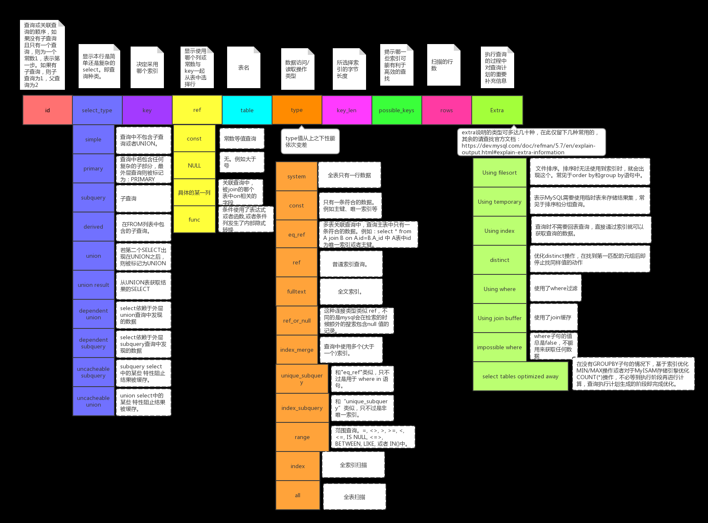

[《MySQL 是怎样运行的：从根儿上理解 MySQL》](https://relph1119.github.io/mysql-learning-notes/#/)

[Relph1119/mysql-learning-notes: MySQL学习《MySQL 是怎样运行的：从根儿上理解 MySQL》，在线阅读：https://relph1119.github.io/mysql-learning-notes/](https://github.com/Relph1119/mysql-learning-notes)


## x

```markdown
截止到服务器程序完成了查询优化为止，还没有真正的去访问真实的数据表，MySQL服务器把数据的存储和提取操作都封装到了一个叫存储引擎的模块里。我们知道表是由一行一行的记录组成的，但这只是一个逻辑上的概念，物理上如何表示记录，怎么从表中读取数据，怎么把数据写入具体的物理存储器上，这都是存储引擎负责的事情。为了实现不同的功能，MySQL提供了各式各样的存储引擎，不同存储引擎管理的表具体的存储结构可能不同，采用的存取算法也可能不同。

小贴士：为什么叫`引擎`呢？因为这个名字更拉风～ 其实这个存储引擎以前叫做`表处理器`，后来可能人们觉得太土，就改成了`存储引擎`的叫法，它的功能就是接收上层传下来的指令，然后对表中的数据进行提取或写入操作。

```

“表处理器”其实更直白地说明了storage engine的本质（正如docker的cgroup原本的名称 process container这么直白的说明了“docker容器的本质是进程”），其实就是用来存放数据的东西。只不过因为数据类型不同（数据量大小、冷热、读写操作频率等），所以就需要不同的storage engine来满足其需求（***数据在不同SE中存放的格式通常是不同的，比如说memory都不用磁盘来存储数据，也就是说关闭服务器后表中的数据就消失了。再想想myisam和innodb的区别，index什么的。***）。

还是拿图书馆类比，mysql server的所有处理过程其实都与书架上的书籍无关（“没有访问到真实的数据表”）。


## 4、InnoDB 数据页结构 & 记录结构

[4、从一条记录说起—— InnoDB 记录结构 - 《MySQL 是怎样运行的：从根儿上理解 MySQL》 · IT书架](https://itshujia.com/read/mysql/81.html)

[5、盛放记录的大盒子 —— InnoDB 数据页结构 - 《MySQL 是怎样运行的：从根儿上理解 MySQL》 · IT书架](https://itshujia.com/read/mysql/82.html)

---


InnoDB有4种行格式，分别是 compact, redundant, dynamic, compressed.


---


```markdown
一个数据页可以被大致划分为7个部分，分别是

File Header，表示页的一些通用信息，占固定的38字节。
Page Header，表示数据页专有的一些信息，占固定的56个字节。
Infimum + Supremum，两个虚拟的伪记录，分别表示页中的最小和最大记录，占固定的26个字节。
User Records：真实存储我们插入的记录的部分，大小不固定。
Free Space：页中尚未使用的部分，大小不确定。
Page Directory：页中的某些记录相对位置，也就是各个槽在页面中的地址偏移量，大小不固定，插入的记录越多，这个部分占用的空间越多。
File Trailer：用于检验页是否完整的部分，占用固定的8个字节。
```

这里就是innodb page的数据结构


---

```markdown
4、InnoDB会把页中的记录划分为若干个组，每个组的最后一个记录的地址偏移量作为一个槽，存放在Page Directory中，所以在一个页中根据主键查找记录是非常快的，分为两步：

	1、通过二分法确定该记录所在的槽。

	2、通过记录的next_record属性遍历该槽所在的组中的各个记录。

5、每个数据页的File Header部分都有上一个和下一个页的编号，所以所有的数据页会组成一个双链表。

6、为保证从内存中同步到磁盘的页的完整性，在页的首部和尾部都会存储页中数据的校验和和页面最后修改时对应的LSN值，如果首部和尾部的校验和和LSN值校验不成功的话，就说明同步过程出现了问题。
```

page directory, page header, file header, file trailer


:::danger


```yaml
- "*InnoDB, arch? InnoDB数据页的数据结构? How does it works?*"
- innodb 行格式 有哪4种?
- innodb page由哪7个部分组成?


```


各个数据页可以组成一个 双向链表 ，而每个数据页中的记录会按照主键值从小到大的顺序组成一个 单向链表，每个数据页都会为存储在它里边儿的记录生成一个页目录 ，在通过主键查找某条记录的时候可以在 页目录 中使用二分法快速定位到对应的槽，然后再遍历该槽对应分组中的记录即可快速找到指定的记录(如果你对这段话有一丁点儿疑惑，那么接下来的部分不适合你，返回去看一下数据页结构吧)。

通过双向链表相关联

---

所有类型的page（11种page类型）都有 file header和 file trailer两部分

```markdown
File Header：记录页面的一些通用信息

File Trailer：校验页是否完整，保证从内存到磁盘刷新时内容的一致性。
```


:::


## 9、存放页面的大池子 —— InnoDB 的表空间

[9、存放页面的大池子 —— InnoDB 的表空间 - 《MySQL 是怎样运行的：从根儿上理解 MySQL》 · IT书架](https://itshujia.com/read/mysql/86.html)

---

```markdown
通过前边儿的内容大家知道，表空间是一个抽象的概念，对于系统表空间来说，对应着文件系统中一个或多个实际文件；对于每个独立表空间来说，对应着文件系统中一个名为表名.ibd的实际文件。大家可以把表空间想象成被切分为许许多多个页的池子，当我们想为某个表插入一条记录的时候，就从池子中捞出一个对应的页来把数据写进去。本章内容会深入到表空间的各个细节中，带领大家在InnoDB存储结构的池子中畅游。
```


```markdown
再一次强调，InnoDB是以页为单位管理存储空间的，我们的聚簇索引（也就是完整的表数据）和其他的二级索引都是以B+树的形式保存到表空间的，而B+树的节点就是数据页。我们前边说过，这个数据页的类型名其实是：FIL_PAGE_INDEX，除了这种存放索引数据的页面类型之外，InnoDB也为了不同的目的设计了若干种不同类型的页面，为了唤醒大家的记忆，我们再一次把各种常用的页面类型提出来：
```

***因为table space中的page太多了，为了更好地管理这些page，所以规定连续的64个page就是一个extent（也就是一个extent默认占用1MB空间）***

而256个extent划分为一组


```markdown
第一个组最开始的3个页面的类型是固定的，也就是说extent 0这个区最开始的3个页面的类型是固定的，分别是：
...

其余各组最开始的2个页面的类型是固定的，也就是说extent 256、extent 512这些区最开始的2个页面的类型是固定的，分别是：
...

好了，宏观的结构介绍完了，里边儿的名词大家也不用记清楚，只要大致记得：表空间被划分为许多连续的区，每个区默认由64个页组成，每256个区划分为一组，每个组的最开始的几个页面类型是固定的就好了。
```

---


```markdown
为啥好端端的提出一个区（extent）的概念呢？我们以前分析问题的套路都是这样的：表中的记录存储到页里边儿，然后页作为节点组成B+树，这个B+树就是索引，然后吧啦吧啦一堆聚簇索引和二级索引的区别。这套路也没啥不妥的呀～

是的，如果我们表中数据量很少的话，比如说你的表中只有几十条、几百条数据的话，的确用不到区的概念，因为简单的几个页就能把对应的数据存储起来，但是你架不住表里的记录越来越多呀。

？？啥？？表里的记录多了又怎样？B+树的每一层中的页都会形成一个双向链表呀，File Header中的FIL_PAGE_PREV和FIL_PAGE_NEXT字段不就是为了形成双向链表设置的么？

是的是的，您说的都对，从理论上说，不引入区的概念只使用页的概念对存储引擎的运行并没啥影响，但是我们来考虑一下下边这个场景：

我们每向表中插入一条记录，本质上就是向该表的聚簇索引以及所有二级索引代表的B+树的节点中插入数据。而B+树的每一层中的页都会形成一个双向链表，如果是以页为单位来分配存储空间的话，双向链表相邻的两个页之间的物理位置可能离得非常远。我们介绍B+树索引的适用场景的时候特别提到范围查询只需要定位到最左边的记录和最右边的记录，然后沿着双向链表一直扫描就可以了，而如果链表中相邻的两个页物理位置离得非常远，就是所谓的随机I/O。再一次强调，磁盘的速度和内存的速度差了好几个数量级，随机I/O是非常慢的，所以我们应该尽量让链表中相邻的页的物理位置也相邻，这样进行范围查询的时候才可以使用所谓的顺序I/O。

所以，所以，所以才引入了区（extent）的概念，一个区就是在物理位置上连续的64个页。在表中数据量大的时候，为某个索引分配空间的时候就不再按照页为单位分配了，而是按照区为单位分配，甚至在表中的数据十分非常特别多的时候，可以一次性分配多个连续的区。虽然可能造成一点点空间的浪费（数据不足填充满整个区），但是从性能角度看，可以消除很多的随机I/O，功大于过嘛！
```


```markdown
XDES Entry链表
到现在为止，我们已经提出了五花八门的概念，什么区、段、碎片区、附属于段的区、XDES Entry结构吧啦吧啦的概念，走远了千万别忘了自己为什么出发，我们把事情搞这么麻烦的初心仅仅是想提高向表插入数据的效率又不至于数据量少的表浪费空间。现在我们知道向表中插入数据本质上就是向表中各个索引的叶子节点段、非叶子节点段插入数据，也知道了不同的区有不同的状态，再回到最初的起点，捋一捋向某个段中插入数据的过程：

```

“我们把事情搞这么麻烦的初心仅仅是想提高向表插入数据的效率，又不至于数据量少的表浪费空间”

[//]: # (TODO 给这个搞个qs：是怎么通过extent, segment, ... 来实现提高插入效率，又没有浪费空间的)


---


```markdown
到现在为止我们已经大概清楚了表空间、段、区、XDES Entry、INODE Entry、各种以XDES Entry为节点的链表的基本概念了，可是总有一种飞在天上不踏实的感觉，每个区对应的XDES Entry结构到底存储在表空间的什么地方？直属于表空间的FREE、FREE_FRAG、FULL_FRAG链表的基节点到底存储在表空间的什么地方？每个段对应的INODE Entry结构到底存在表空间的什么地方？我们前边介绍了每256个连续的区算是一个组，想解决刚才提出来的这些个疑问还得从每个组开头的一些类型相同的页面说起，接下来我们一个页面一个页面的分析，真相马上就要浮出水面了。
```


- 每个区对应的XDES Entry结构到底存储在表空间的什么地方？
- 直属于表空间的FREE、FREE_FRAG、FULL_FRAG链表的基节点到底存储在表空间的什么地方？
- 每个段对应的INODE Entry结构到底存在表空间的什么地方？


---


```markdown
了解完了独立表空间的基本结构，系统表空间的结构也就好理解多了，系统表空间的结构和独立表空间基本类似，只不过由于整个MySQL进程只有一个系统表空间，在系统表空间中会额外记录一些有关整个系统信息的页面，所以会比独立表空间多出一些记录这些信息的页面。因为这个系统表空间最牛逼，相当于是表空间之首，所以它的表空间 ID（Space ID）是0。
```

```markdown
可以看到，系统表空间和独立表空间的前三个页面（页号分别为0、1、2，类型分别是FSP_HDR、IBUF_BITMAP、INODE）的类型是一致的，只是页号为3～7的页面是系统表空间特有的，我们来看一下这些多出来的页面都是干啥使的：
```

***系统表空间和独立表空间的前三个page的type相同（分别是 FSP_HDR, IBUF_BITMAP, INODE），后面5个不同***

```markdown
除了这几个记录系统属性的页面之外，系统表空间的extent 1和extent 2这两个区，也就是页号从64~191这128个页面被称为Doublewrite buffer，也就是双写缓冲区。不过上述的大部分知识都涉及到了事务和多版本控制的问题，这些问题我们会放在后边的章节集中唠叨，现在讲述太影响用户体验，所以现在我们只唠叨一下有关InnoDB数据字典的知识，其余的概念在后边再看。
```

Doublewrite buffer


:::danger

```yaml
- mysql innodb 独立表空间 的 table space, extent, segment 分别是啥? 啥关系?
- mysql为什么需要系统表空间
- mysql 系统表空间和独立表空间 有啥区别

```


:::


## 6、快速查询的秘籍 —— B+ 树索引

[6、快速查询的秘籍 —— B+ 树索引 - 《MySQL 是怎样运行的：从根儿上理解 MySQL》 · IT书架](https://itshujia.com/read/mysql/83.html) 分别介绍了没有使用索引和（Innodb中）使用索引，这两种情况下各自的查找过程，

---


```markdown
前边我们详细唠叨了InnoDB数据页的7个组成部分，知道了各个数据页可以组成一个双向链表，而每个数据页中的记录会按照主键值从小到大的顺序组成一个单向链表，每个数据页都会为存储在它里边儿的记录生成一个页目录，在通过主键查找某条记录的时候可以在页目录中使用二分法快速定位到对应的槽，然后再遍历该槽对应分组中的记录即可快速找到指定的记录（如果你对这段话有一丁点儿疑惑，那么接下来的部分不适合你，返回去看一下数据页结构吧）。页和记录的关系示意图如下：
```


<center>*page之间双向链表连接*</center>


---


:::danger

```yaml
-
```


:::


## 7、好东西也得先学会怎么用-B+树索引的使用

[第7章 好东西也得先学会怎么用-B+树索引的使用](https://relph1119.github.io/mysql-learning-notes/#/mysql/07-%E5%A5%BD%E4%B8%9C%E8%A5%BF%E4%B9%9F%E5%BE%97%E5%85%88%E5%AD%A6%E4%BC%9A%E6%80%8E%E4%B9%88%E7%94%A8-B+%E6%A0%91%E7%B4%A2%E5%BC%95%E7%9A%84%E4%BD%BF%E7%94%A8)

---


bptree index 适用情况 和 失效情况 正反都要说


```markdown
  我们前面详细、详细又详细的介绍了InnoDB存储引擎的B+树索引，我们必须熟悉下面这些结论：

每个索引都对应一棵B+树，B+树分为好多层，最下面一层是叶子节点，其余的是内节点。所有用户记录都存储在B+树的叶子节点，所有目录项记录都存储在内节点。

InnoDB存储引擎会自动为主键（如果没有它会自动帮我们添加）建立聚簇索引，聚簇索引的叶子节点包含完整的用户记录。

我们可以为自己感兴趣的列建立二级索引，二级索引的叶子节点包含的用户记录由索引列 + 主键组成，所以如果想通过二级索引来查找完整的用户记录的话，需要通过回表操作，也就是在通过二级索引找到主键值之后再到聚簇索引中查找完整的用户记录。

B+树中每层节点都是按照索引列值从小到大的顺序排序而组成了双向链表，而且每个页内的记录（不论是用户记录还是目录项记录）都是按照索引列的值从小到大的顺序而形成了一个单链表。如果是联合索引的话，则页面和记录先按照联合索引前面的列排序，如果该列值相同，再按照联合索引后边的列排序。

通过索引查找记录是从B+树的根节点开始，一层一层向下搜索。由于每个页面都按照索引列的值建立了Page Directory（页目录），所以在这些页面中的查找非常快。
```

几个关键字，内节点 叶子结点 双向链表 page directory

再加上 innodb page结构和 记录结构


节点之间双向链表，节点内部单向链表

这怎么实现范围查询呢

单向链表 倒序查询 怎么搞

为啥不是双向


---

```markdown
时间上的代价

  每次对表中的数据进行增、删、改操作时，都需要去修改各个B+树索引。而且我们讲过，B+树每层节点都是按照索引列的值从小到大的顺序排序而组成了双向链表。不论是叶子节点中的记录，还是内节点中的记录（也就是不论是用户记录还是目录项记录）都是按照索引列的值从小到大的顺序而形成了一个单向链表。而增、删、改操作可能会对节点和记录的排序造成破坏，所以存储引擎需要额外的时间进行一些记录移位，页面分裂、页面回收什么的操作来维护好节点和记录的排序。如果我们建了许多索引，每个索引对应的B+树都要进行相关的维护操作，这还能不给性能拖后腿么？
```

可以认为 内节点 是对叶子节点的一层冗余吗


```markdown
  为了方便大家理解，我们特意标明了哪些是内节点，哪些是叶子节点。再次强调一下，内节点中存储的是目录项记录，叶子节点中存储的是用户记录（由于不是聚簇索引，所以用户记录是不完整的，缺少country列的值）。从图中可以看出，这个idx_name_birthday_phone_number索引对应的B+树中页面和记录的排序方式就是这样的：

先按照name列的值进行排序。
如果name列的值相同，则按照birthday列的值进行排序。
如果birthday列的值也相同，则按照phone_number的值进行排序。
  这个排序方式十分、特别、非常、巨、very very very重要，因为只要页面和记录是排好序的，我们就可以通过二分法来快速定位查找。下面的内容都仰仗这个图了，大家对照着图理解。

```

索引记录是有排序的


:::danger

[//]: # (TODO index)

```yaml

- "***Index 创建原则?***"
- "***使用 mysql 索引时，可能会导致索引失效的错误用法?***"


```


---

[MySQL索引失效的常见场景 - 随心的风 - 博客园](https://www.cnblogs.com/suixing123/p/13859436.html) where使用 mysql内置函数、负向查询、or（需要注意的是，实际上指的是where使用内置函数会导致索引失效，在select子句中使用还会走索引。需要注意的是隐式转换和列运算也可归入此类）、最左原则（包括“like通配符”也可归入此类）


:::


## ***10、条条大路通罗马 —— 单表访问方法***


[10、条条大路通罗马 —— 单表访问方法 - 《MySQL 是怎样运行的：从根儿上理解 MySQL》 · IT书架](https://itshujia.com/read/mysql/87.html#38j2rl) 这章其实就是 explain 的几种type，也就是几种常用的单表sql语句，通常会使用哪种索引type。之后的“注意事项”，用来说明几种索引失效的情况

---

```markdown
设计MySQL的大叔把查询的执行方式大致分为下边两种：

使用全表扫描进行查询 （这种执行方式很好理解，就是把表的每一行记录都扫一遍嘛，把符合搜索条件的记录加入到结果集就完了。不管是啥查询都可以使用这种方式执行，当然，这种也是最笨的执行方式。）


使用索引进行查询 （因为直接使用全表扫描的方式执行查询要遍历好多记录，所以代价可能太大了。如果查询语句中的搜索条件可以使用到某个索引，那直接使用索引来执行查询可能会加快查询执行的时间。使用索引来执行查询的方式五花八门，又可以细分为许多种类：）

	针对主键或唯一二级索引的等值查询

	针对普通二级索引的等值查询

	针对索引列的范围查询

	直接扫描整个索引
```




- const 主键索引、唯一索引等只有一条记录的
- ref 普通索引
- ref_or_null 普通索引，类似ref但是还要查找null
- range 范围查询
- index 全索引扫描
- all 全表扫描


:::danger


```yaml
- mysql访问类型？或者说，explain的几种type（const, ref, ref_or_null, range, index, all）分别是啥意思?
- 为什么不同sql会走不同type，以及执行这些type时各自的具体执行流程？
- mysql 索引 失效，有哪些常见场景?
```


:::


## 11、连接的原理


[11、两个表的亲密接触 —— 连接的原理 - 《MySQL 是怎样运行的：从根儿上理解 MySQL》 · IT书架](https://itshujia.com/read/mysql/88.html#5c23c8) 前半部分join使用很简单，主要看后半部分的原理。

简单来说，就是先在驱动表（主表）中查到数据集，再根据被驱动表（副表）的where在这个数据集里查数据。在此基础上，就有了内连接和外连接的区别。内连接就是 主表的记录在副表中找不到匹配记录，该记录不会加入到最终的结果集。外连接则相反。

---


Nested-Loop Join

基于块的嵌套循环连接（Block Nested-Loop Join）

[MySQL中的Join 的算法（NLJ、BNL、BKA） - Booksea - 博客园](https://www.cnblogs.com/booksea/p/17380941.html)

[MySQL优化器特性（四）表关联之BNL（Block Nested Loop）和Hash Join - 技术文章 - 云掣](https://yunche.pro/blog/?id=348)


:::danger

```yaml
- join的本质是啥？
- optimizer对join的优化（NLJ, BNL, BKA）各自的工作机制？

```


:::


## ~~12、谁最便宜就选谁 —— MySQL 基于成本的优化~~

[12、谁最便宜就选谁 —— MySQL 基于成本的优化 - 《MySQL 是怎样运行的：从根儿上理解 MySQL》 · IT书架](https://itshujia.com/read/mysql/89.html)

---


## ~~13、兵马未动，粮草先行 —— InnoDB 统计数据是如何收集的~~

[13、兵马未动，粮草先行 —— InnoDB 统计数据是如何收集的 - 《MySQL 是怎样运行的：从根儿上理解 MySQL》 · IT书架](https://itshujia.com/read/mysql/90.html) 这章比较简单，innodb的数据肯定是部分做了持久化，部分暂存在内存。这个不用说。这章就是相关的一些具体设置。


---


## ***14、不好看就要多整容 —— MySQL 基于规则的优化***

[14、不好看就要多整容 —— MySQL 基于规则的优化（内含关于子查询优化二三事儿） - 《MySQL 是怎样运行的：从根儿上理解 MySQL》 · IT书架](https://itshujia.com/read/mysql/91.html) 这章就回答了“mysql 的 optimizer有哪些优化方法（有哪些“查询重写”优化方法）”

---

前面“条件化简”这部分其实就是 一些常用的编译器优化操作，常量传播cp、常量折叠 cf、死码消除、CSE、BCE、LICM

---

外连接消除

***内连接的主表和副表可以互相转换，据此optimizer就会自动进行优化。而外连接则无法转换，所以无法进行自动优化。外连接消除就是optimizer自动把（可以转换为内连接的）外连接转内连接***。文章举了一个 reject-NULL 的例子。


---

- 子查询在MySQL中是怎么执行的


---


ICP and index dive, (MRR, BKA, BNL)

- `ICP索引条件下推(Index Condition Pushdown)` 用索引筛选的 where 条件在存储引擎一侧进行筛选，而不是将所有 index access 的结果都放在 server 端进行 where 筛选
- `MRR索引多范围查找(Multi-Range Read)` 优化器将随机 io 转化为顺序 io，以降低查询过程中 io 开销的一种手段
- `BKA(Batched Key Access)`，，在表连接过程中为了提升 join 性能而使用的 join buffer，其作用是在读取被 join 表的记录时，使用顺序 io(BKA 被使用的标识是执行计划的 extra 信息中会有 BKA 信息)。BKA优化技术在join中使用，特别是在执行连接操作时，如果一个表上的索引已经排序，而另一个表上的连接列也是有序的，那么MySQL可以使用BKA来批量访问这两个表。它允许优化器批量访问索引，减少索引访问的次数，从而提高join的性能。
- `BNL(Block Nested Loop)` BNL优化技术也是在join中使用的。当join无法使用更高级的连接算法（如索引连接或哈希连接）时，MySQL会使用BNL。BNL通过逐行读取两个表的数据，并执行循环匹配操作，以获取满足连接条件的结果。虽然BNL可能会导致性能较低，但在某些情况下，它仍然是执行join的一种有效方法。

---

```markdown
ICP的原理很简单。当 MySQL 执行查询语句时，它会根据查询条件选择合适的索引来访问数据。在传统的执行方式中，MySQL 首先通过索引找到满足条件的记录的主键，然后再根据主键值从数据表中获取记录。而索引条件下推则在索引访问阶段就进行条件过滤，只返回满足查询条件的记录的主键，避免了不必要的主键查找操作。

这样做的好处是减少了磁盘 IO 和网络传输，提高了查询效率。特别是对于那些返回记录较多但满足查询条件的记录较少的查询，索引条件下推可以大幅提升性能。
```

这些概念太抽象了，简单来说就是“ICP就是把本应executor执行的，推给SE来执行”

仍然用图书馆类比的话，ICP相当于在图书检索系统操作员（executor）正式检索之前，由图书馆工作人员（存储引擎）利用索引目录（索引）进行的预筛选，这样可以减少操作员需要检查的书籍数量，提高整体检索效率。

BKA和BNL都是在join操作时才会使用的优化技术

```markdown
- ICP（Index Condition Pushdown）：ICP在优化器中是一项重要的优化技术，它类似于图书馆的索引目录。在图书馆中，索引目录帮助读者快速找到所需书籍的位置。类比到MySQL中，ICP会尽可能将查询条件下推至存储引擎层级，以减少不必要的数据读取，提高查询效率。
- MRR（Multi-Range Read）：MRR是一种批量读取技术，类似于在图书馆中一次性获取多本书。MRR允许MySQL在存储引擎层级批量读取满足查询条件的多个数据块，以减少磁盘I/O操作，提高查询性能。
- BKA（Batch Key Access）：BKA是一种批量键访问技术，类似于在图书馆中通过预定书架号快速获取多本书。在MySQL中，BKA允许优化器批量访问索引，以减少索引访问的次数，提高查询速度。
- BNL（Block Nested Loop）：BNL是一种块嵌套循环技术，类似于在图书馆中通过遍历多个书架来查找所需书籍。在MySQL中，BNL用于处理连接操作，它会逐行读取两个表的数据，并执行循环匹配操作，以获取符合连接条件的结果。
- Index Dive：Index Dive类似于在图书馆中通过索引快速定位到需要的书籍的过程。在MySQL中，Index Dive是一种优化技术，它允许优化器通过索引的跳跃访问，直接定位到满足查询条件的数据，而无需完全扫描索引。
```

ICP就是“把查询条件放到存储引擎，能提高查询效率”，通俗来说就是，在查询过程中，直接在查询引擎层的 API 获取数据时，实现“非直接索引”过滤条件的筛选，而不是查询引擎层查询出来之后在 server 层筛选。

再则，ICP更适合那种大量数据，但是其中只有极少数满足查询条件的场景。

```markdown
MRR是一种针对读取操作的优化技术。它通过在一个请求中读取多个连续范围的数据，以减少读取磁盘的次数。MRR通常用于处理顺序扫描（Sequential Scan）或范围查询（Range Query）等需要从磁盘读取大量连续数据的场景。通过减少磁盘IO次数，MRR可以显著提高读取操作的性能。
```

MRR主要关注的是优化读取操作的效率

这些优化器技术都旨在提高查询性能，减少不必要的磁盘I/O和数据扫描


:::danger

```yaml

```

:::


## 15、Explain

[15、查询优化的百科全书 —— Explain 详解（上） - 《MySQL 是怎样运行的：从根儿上理解 MySQL》 · IT书架](https://itshujia.com/read/mysql/92.html)

[16、查询优化的百科全书 —— Explain 详解（下） - 《MySQL 是怎样运行的：从根儿上理解 MySQL》 · IT书架](https://itshujia.com/read/mysql/93.html)

---


---

extra提供了一些额外信息


```markdown
No tables used

Impossible WHERE

No matching min/max row

Using index

Using index condition

Using where

Using join buffer (Block Nested Loop)

Not exists

Using intersect(...)、Using union(...)和Using sort_union(...)

Zero limit

Using filesort

Using temporary

Start temporary, End temporary

LooseScan

FirstMatch(tbl_name)
```


---

```mysql
EXPLAIN FORMAT=JSON SELECT * FROM s1 INNER JOIN s2 ON s1.key1 = s2.key2 WHERE s1.common_field = 'a'\G
```

用 EXPLAIN FORMAT=JSON 给 explain加上估算执行cost

通过结果集中的 cost_info 查看


:::danger

```yaml
- mysql explain语句的 type
- mysql explain语句的 extra
- explain format=json 怎么用


```

:::


## 17、神兵利器 —— optimizer trace 的神奇功效

[17、神兵利器 —— optimizer trace 的神奇功效 - 《MySQL 是怎样运行的：从根儿上理解 MySQL》 · IT书架](https://itshujia.com/read/mysql/94.html)

---

```markdown
对于MySQL 5.6以及之前的版本来说，查询优化器就像是一个黑盒子一样，你只能通过EXPLAIN语句查看到最后优化器决定使用的执行计划，却无法知道它为什么做这个决策。这对于一部分喜欢刨根问底的小伙伴来说简直是灾难：“我就觉得使用其他的执行方案比EXPLAIN输出的这种方案强，凭什么优化器做的决定和我想的不一样呢？”

在MySQL 5.6以及之后的版本中，设计MySQL的大叔贴心的为这部分小伙伴提出了一个optimizer trace的功能，
```

***optimizer trace 用来展示具体的决策过程（也就是为啥会选择这样的“执行计划”），换句话就是用来解释为啥explain会决定使用这个“执行计划”，而不是其他的***

后面就是讲了下具体怎么使用 optimizer-trace

---

```markdown
不过杂乱之中其实还是蛮有规律的，优化过程大致分为了三个阶段：

prepare阶段

optimize阶段

execute阶段

我们所说的基于成本的优化主要集中在optimize阶段，对于单表查询来说，我们主要关注optimize阶段的"rows_estimation"这个过程，这个过程深入分析了对单表查询的各种执行方案的成本；对于多表连接查询来说，我们更多需要关注"considered_execution_plans"这个过程，这个过程里会写明各种不同的连接方式所对应的成本。反正优化器最终会选择成本最低的那种方案来作为最终的执行计划，也就是我们使用EXPLAIN语句所展现出的那种方案。

如果有小伙伴对使用EXPLAIN语句展示出的对某个查询的执行计划很不理解，大家可以尝试使用optimizer trace功能来详细了解每一种执行方案对应的成本，相信这个功能能让大家更深入的了解MySQL查询优化器。

```

确实如此，***查询计划由optimizer提供（也就是基于预估cost的），而执行详细信息的收集则是由executo提供。***


:::danger

```yaml
- 【optimizer-trace】怎么用optimizer-trace来优化sql？ 如何分析trace来改善查询的执行效率？
- optimizer-trace 和 explain-analyzer 有啥区别? 各自用来针对sql优化的哪个方面? # ***查询计划的解释是由optimizer提供的，而执行详细信息的收集是由executor提供的。*** 这点在mysql和postgres里是一样的。*也就是说几个mysql常用的优化命令，optimizer-trace是optimizer提供的，explain analyze 是 executor提供的，show status 则是一个数据汇总的命令，*

```

:::


## ***18、调节磁盘和CPU的矛盾 —— InnoDB 的 Buffer Pool***

[18、调节磁盘和CPU的矛盾 —— InnoDB 的 Buffer Pool - 《MySQL 是怎样运行的：从根儿上理解 MySQL》 · IT书架](https://itshujia.com/read/mysql/95.html) 这章涉及到


---

```markdown
通过前边的唠叨我们知道，对于使用InnoDB作为存储引擎的表来说，不管是用于存储用户数据的索引（包括聚簇索引和二级索引），还是各种系统数据，都是以页的形式存放在表空间中的，而所谓的表空间只不过是InnoDB对文件系统上一个或几个实际文件的抽象，也就是说我们的数据说到底还是存储在磁盘上的。但是各位也都知道，磁盘的速度慢的跟乌龟一样，怎么能配得上“快如风，疾如电”的CPU呢？所以InnoDB存储引擎在处理客户端的请求时，当需要访问某个页的数据时，就会把完整的页的数据全部加载到内存中，也就是说即使我们只需要访问一个页的一条记录，那也需要先把整个页的数据加载到内存中。将整个页加载到内存中后就可以进行读写访问了，在进行完读写访问之后并不着急把该页对应的内存空间释放掉，而是将其缓存起来，这样将来有请求再次访问该页面时，就可以省去磁盘IO的开销了。
```

***buffer pool本质上是innodb向os申请的一段连续内存空间。这段连续内存由控制块和缓存页组成。每个控制块和缓存页都是一一对应的，在填充足够多的控制块和缓存页的组合后，Buffer Pool剩余的空间可能产生不够填充一组控制块和缓存页，这部分空间不能被使用，也被称为碎片。***


```markdown
1、Buffer Pool本质上是InnoDB向操作系统申请的一段连续的内存空间，可以通过innodb_buffer_pool_size来调整它的大小。


2、Buffer Pool向操作系统申请的连续内存由控制块和缓存页组成，每个控制块和缓存页都是一一对应的，在填充足够多的控制块和缓存页的组合后，Buffer Pool剩余的空间可能产生不够填充一组控制块和缓存页，这部分空间不能被使用，也被称为碎片。


3、InnoDB使用了许多链表来管理Buffer Pool。

4、free链表中每一个节点都代表一个空闲的缓存页，在将磁盘中的页加载到Buffer Pool时，会从free链表中寻找空闲的缓存页。

5、为了快速定位某个页是否被加载到Buffer Pool，使用表空间号 + 页号作为key，缓存页作为value，建立哈希表。

6、在Buffer Pool中被修改的页称为脏页，脏页并不是立即刷新，而是被加入到flush链表中，待之后的某个时刻同步到磁盘上。

7、LRU链表分为young和old两个区域，可以通过innodb_old_blocks_pct来调节old区域所占的比例。首次从磁盘上加载到Buffer Pool的页会被放到old区域的头部，在innodb_old_blocks_time间隔时间内访问该页不会把它移动到young区域头部。在Buffer Pool没有可用的空闲缓存页时，会首先淘汰掉old区域的一些页。

8、我们可以通过指定innodb_buffer_pool_instances来控制Buffer Pool实例的个数，每个Buffer Pool实例中都有各自独立的链表，互不干扰。

9、自MySQL 5.7.5版本之后，可以在服务器运行过程中调整Buffer Pool大小。每个Buffer Pool实例由若干个chunk组成，每个chunk的大小可以在服务器启动时通过启动参数调整。

```


:::danger

```yaml
#- topic: InnoDB 缓冲池(buffer-pool)

- 避免每次读操作都进行磁盘 IO，具体来说，缓冲池缓存了大量数据页，让 CPU 读取和写入数据时，直接和缓冲区交互，不需要操作磁盘，从而避免磁盘拖慢数据库性能的问题（*注意缓冲池是 innoDB 引擎的特性，而不是 mysql 的*）
- 缓冲池存哪些数据？ # 缓存表数据与索引数据，把磁盘上的数据加载到缓冲池，避免每次访问都进行磁盘 IO，起到加速访问的作用。
- 缓冲池的工作机制？

- 缓存页的哈希处理
- flush链表的管理
- LRU链表的管理

```


:::


### 脏页刷新


```markdown
当然，以下是InnoDB存储引擎中脏页刷新（Page Flush）过程的概述，涵盖了所有关键点：

1. **事务修改页**：当事务对表中的数据进行修改时，这些修改首先在内存中的页（buffer pool中的页）上进行。一旦页被修改，它就变成一个脏页。

2. **重做日志记录**：在事务提交之前，InnoDB会将修改记录到重做日志（redo log）中。这是为了确保在发生故障时可以使用这些日志来恢复数据。

3. **事务提交**：事务提交后，修改的页仍然是脏页，因为它们还没有被写回到磁盘上。

4. **脏页刷新触发**：InnoDB有几种机制来触发脏页的刷新：
   - **后台刷新**：后台线程（Page Cleaner）定期刷新脏页。
   - **Checkpoint触发**：当重做日志的头部（head）和尾部（tail）之间的距离（checkpoint age）达到一定阈值时，会触发刷新。
   - **缓冲池压力**：当缓冲池中脏页的比例过高或需要为新的读操作腾出空间时，会触发脏页刷新。

5. **刷新邻接页**：如果启用了刷新邻接页（Flush Neighbor Page）功能，InnoDB在刷新一个脏页时，会检查同一区（extent）内的所有页，如果这些页也是脏的，它们也会被一起刷新。

6. **自适应刷新**：InnoDB的自适应刷新算法根据当前的写入负载和磁盘性能动态调整刷新速率，以避免刷新风暴（flush storm）。

7. **刷新操作**：脏页被写回到磁盘上，这一过程可能涉及异步IO操作，以提高效率。

8. **刷新完成**：一旦脏页被成功写回到磁盘，它们就不再是脏页。InnoDB会更新重做日志的尾部位置，减少checkpoint age。

9. **日志文件管理**：随着脏页的刷新，之前记录的重做日志可以被覆盖，以便日志文件可以循环使用。

10. **性能监控与调优**：通过监控刷新操作的性能，如通过`show engine innodb status`命令，DBA可以对刷新过程进行调优，例如调整`innodb_page_cleaners`、`innodb_adaptive_flushing_lwm`、`innodb_io_capacity`等参数。

11. **刷新争用处理**：在高负载情况下，刷新操作可能会与其他数据库操作（如查询和索引构建）竞争资源，需要适当调整以避免性能瓶颈。

12. **系统状态反馈**：InnoDB通过日志和状态信息提供刷新操作的反馈，帮助DBA了解系统的当前状态并做出相应的调整。

整个刷新过程是InnoDB保证数据持久性和系统性能的关键机制之一。通过智能地管理脏页的刷新，InnoDB可以在保持高性能的同时，确保数据的安全性和完整性。

```


dirty pages

```markdown
在整个InnoDB的脏页刷新（Flush）过程中，涉及到以下特性：

1. **缓冲池（Buffer Pool）**：InnoDB使用缓冲池来缓存频繁访问的数据和索引页，减少对磁盘的I/O操作。

2. **脏页（Dirty Pages）**：在缓冲池中被修改但尚未写入磁盘的页。

3. **重做日志（Redo Log）**：事务提交前，修改操作首先记录到重做日志中，确保数据恢复的一致性。

4. **LSN（Log Sequence Number）**：用于记录重做日志的位置，每个事务都会生成一个新的LSN。

5. **Checkpoint**：刷新过程中，InnoDB会更新磁盘上数据页的状态，Checkpoint机制用于标记哪些数据已经刷新到磁盘。

6. **刷新邻接页（Flush Neighbor Page）**：当刷新一个脏页时，如果该页所在的区（extent）内还有其他脏页，它们也会被一起刷新。

7. **自适应刷新（Adaptive Flushing）**：根据当前的系统负载和性能指标，动态调整刷新速率。

8. **异步IO（Asynchronous IO）**：InnoDB支持异步IO操作，允许脏页刷新操作与其他数据库操作并发执行。

9. **刷新线程（Page Cleaner Threads）**：InnoDB使用专门的后台线程来刷新脏页。

10. **刷新控制参数**：
    - `innodb_page_cleaners`：控制刷新脏页的线程数。
    - `innodb_purge_threads`：控制清除操作的线程数。
    - `innodb_io_capacity`：定义InnoDB刷新磁盘时的IO容量。
    - `innodb_adaptive_flushing`：控制是否启用自适应刷新算法。
    - `innodb_adaptive_flushing_lwm`：自适应刷新的最低水位参数。
    - `innodb_flush_neighbors`：控制是否启用刷新邻接页特性。

11. **刷新争用处理**：在高负载情况下，InnoDB需要处理刷新操作与其他数据库操作之间的资源争用。

12. **性能监控**：通过`show engine innodb status`等命令监控刷新操作的性能。

13. **刷新风暴（Flush Storm）**：当重做日志的空间不足以容纳新的事务提交时，InnoDB会高速刷新脏页以释放空间，这可能导致性能问题。

14. **日志文件管理**：刷新过程中，InnoDB需要管理重做日志文件，确保日志文件的循环使用。

15. **系统状态反馈**：InnoDB通过日志和状态信息提供刷新操作的反馈，帮助数据库管理员了解系统的当前状态。

这些特性共同工作，确保InnoDB存储引擎能够有效地管理脏页刷新，同时保持高性能和数据的持久性。

```


InnoDB的redolog就是WAL嘛，必然会产生脏页


为啥会出现脏页? page flush的时机? 刷新策略?


能否给我概述一下整个page flush的过程？整个flush过程中涉及到哪些innodb的特性？


flush page 就是把内存中修改过的页（脏页）写回到磁盘上，以确保数据的持久性和一致性。

之所以产生脏页就是因为InnoDB用WAL来防止宕机数据丢失，也就是事务提交时，先写redolog，再修改内存数据页，这样就产生了脏页。

那为啥要刷新呢？因为不可能把所有 buffer pool 所以需要把buffer pool里的脏页都刷新到磁盘里

InnoDB通过LSN（每条log的结束点，用字节偏移量来表示。每个page有LSN，redo log也有LSN，Checkpoint也有LSN）来标记版本

Checkpoint机制每次刷新多少页，从哪里取脏页，什么时间触发刷新？


:::danger


---

```yaml
- topic: InnoDB 预读
  qs:
    - q: 什么是预读？
      x: 磁盘按页读取，如果要读取的数据就在页中，就能节省后面的磁盘 io，提高效率。数据访问遵循`集中读写`的原则，使用一些数据，大概率会使用附近的数据，这就是`局部性原理`
    - q: 什么是预读失败？
    - q: 如何对预读失败进行优化？
    - q: 什么是缓冲池污染？
    - q: 怎么解决缓冲池污染的问题？
```


:::


## 19、从猫爷被杀说起 —— 事务简介

[19、从猫爷被杀说起 —— 事务简介 - 《MySQL 是怎样运行的：从根儿上理解 MySQL》 · IT书架](https://itshujia.com/read/mysql/96.html)

---


## 20、redo日志

[第20章 说过的话就一定要办到-redo日志（上）](https://relph1119.github.io/mysql-learning-notes/#/mysql/20-%E8%AF%B4%E8%BF%87%E7%9A%84%E8%AF%9D%E5%B0%B1%E4%B8%80%E5%AE%9A%E8%A6%81%E5%8A%9E%E5%88%B0-redo%E6%97%A5%E5%BF%97%EF%BC%88%E4%B8%8A%EF%BC%89)


```markdown
redo日志是什么
  我们知道InnoDB存储引擎是以页为单位来管理存储空间的，我们进行的增删改查操作其实本质上都是在访问页面（包括读页面、写页面、创建新页面等操作）。我们前面介绍Buffer Pool的时候说过，在真正访问页面之前，需要把在磁盘上的页缓存到内存中的Buffer Pool之后才可以访问。但是在介绍事务的时候又强调过一个称之为持久性的特性，就是说对于一个已经提交的事务，在事务提交后即使系统发生了崩溃，这个事务对数据库中所做的更改也不能丢失。但是如果我们只在内存的Buffer Pool中修改了页面，假设在事务提交后突然发生了某个故障，导致内存中的数据都失效了，那么这个已经提交了的事务对数据库中所做的更改也就跟着丢失了，这是我们所不能忍受的（想想ATM机已经提示狗哥转账成功，但之后由于服务器出现故障，重启之后猫爷发现自己没收到钱，猫爷就被砍死了）。那么如何保证这个持久性呢？一个很简单的做法就是在事务提交完成之前把该事务所修改的所有页面都刷新到磁盘，但是这个简单粗暴的做法有些问题：


```


```markdown
  咋办呢？再次回到我们的初心：我们只是想让已经提交了的事务对数据库中数据所做的修改永久生效，即使后来系统崩溃，在重启后也能把这种修改恢复出来。所以我们其实没有必要在每次事务提交时就把该事务在内存中修改过的全部页面刷新到磁盘，只需要把修改了哪些东西记录一下就好，比方说某个事务将系统表空间中的第100号页面中偏移量为1000处的那个字节的值1改成2我们只需要记录一下：
```

只记录操作，不记录被修改后的数据，因为成本太高


---


```markdown
这句话可以从以下几个关键点来理解InnoDB的redo log以及它如何实现WAL（Write-Ahead Logging）策略：

1. **WAL策略**：WAL是一种常见的数据库日志技术，核心思想是在数据实际写入磁盘之前，先将对数据的修改操作记录到日志中。这样做可以提高性能，因为写日志通常比直接写磁盘要快，并且可以减少对磁盘的I/O操作。

2. **事务的持久性**：事务的持久性是ACID原则中的"D"，指的是一旦事务提交，它对数据库的改变就是永久性的，即使系统发生故障也不会丢失。InnoDB通过redo log来实现这一点：当事务提交时，相关的修改操作已经记录在redo log中，如果系统发生故障，InnoDB可以重放redo log中的操作，从而恢复未持久化到磁盘的数据。

3. **先记录日志再写入数据**：这是WAL策略的具体实现。在InnoDB中，当事务需要修改数据时，首先会在redo log中记录这次修改的详细信息，然后再将修改后的页（数据）写入内存中的缓冲池。这样做可以确保即使在数据页写入磁盘之前系统崩溃，通过redo log也能够恢复数据。

4. **Checkpoint技术**：Checkpoint是InnoDB中用于管理redo log空间和优化恢复时间的一种机制。它在redo log中标记了一个点，表示在这个点之前的所有事务都已经将数据持久化到磁盘。这样，当系统需要恢复时，只需要重放Checkpoint之后的部分日志，而不是整个日志文件，从而大大减少了恢复所需的时间。

5. **有效管理日志空间**：由于redo log是循环使用的，Checkpoint还有助于释放不再需要的日志空间。一旦数据页被刷新到磁盘并且对应的事务已经提交，从Checkpoint点之前的日志就可以被清除，为新的事务日志腾出空间。

综上所述，InnoDB的redo log通过WAL策略确保了事务的持久性，并通过Checkpoint技术有效管理了日志空间和恢复时间，从而提供了高性能和数据安全性。

```


:::danger

```yaml

- 什么是inndob的redolog? 是怎么通过redolog实现WAL的?

```


:::


## 22、后悔了怎么办-undo日志（下）


[第23章 后悔了怎么办-undo日志（下）](https://relph1119.github.io/mysql-learning-notes/#/mysql/23-%E5%90%8E%E6%82%94%E4%BA%86%E6%80%8E%E4%B9%88%E5%8A%9E-undo%E6%97%A5%E5%BF%97%EF%BC%88%E4%B8%8B%EF%BC%89?id=undo%e6%97%a5%e5%bf%97%e5%85%b7%e4%bd%93%e5%86%99%e5%85%a5%e8%bf%87%e7%a8%8b)


---


```markdown
undo日志具体写入过程
段（Segment）的概念
  如果你有认真看过表空间那一章的话，对这个段的概念应该印象深刻，我们当时花了非常大的篇幅来介绍这个概念。简单讲，这个段是一个逻辑上的概念，本质上是由若干个零散页面和若干个完整的区组成的。比如一个B+树索引被划分成两个段，一个叶子节点段，一个非叶子节点段，这样叶子节点就可以被尽可能的存到一起，非叶子节点被尽可能的存到一起。每一个段对应一个INODE Entry结构，这个INODE Entry结构描述了这个段的各种信息，比如段的ID，段内的各种链表基节点，零散页面的页号有哪些等信息（具体该结构中每个属性的意思大家可以到表空间那一章里再次重温一下）。我们前面也说过，为了定位一个INODE Entry，设计InnoDB的大佬设计了一个Segment Header的结构：


```


```markdown
知道了表空间ID、页号、页内偏移量，不就可以唯一定位一个INODE Entry的地址了么～
```


undolog page 链表是哪来的 干啥的


## 24、一条记录的多幅面孔 —— 事务的隔离级别与MVCC

[24、一条记录的多幅面孔 —— 事务的隔离级别与MVCC - 《MySQL 是怎样运行的：从根儿上理解 MySQL》 · IT书架](https://itshujia.com/read/mysql/101.html)

---


## 25、工作面试老大难 —— 锁

[25、工作面试老大难 —— 锁 - 《MySQL 是怎样运行的：从根儿上理解 MySQL》 · IT书架](https://itshujia.com/read/mysql/102.html)

---


## 27、MySQL的server层和存储引擎层是如何交互的

[27、MySQL的server层和存储引擎层是如何交互的 - 《MySQL 是怎样运行的：从根儿上理解 MySQL》 · IT书架](https://itshujia.com/read/mysql/104.html)

---


## 28、MySQL查询成本和扫描区间


[28、专题式讲解—MySQL查询成本和扫描区间(MySQL中IS NULL、IS NOT NULL - 《MySQL 是怎样运行的：从根儿上理解 MySQL》 · IT书架](https://itshujia.com/read/mysql/105.html)

---


## 29、听说有一个最左原则

[29、听说有一个最左原则？这回终于讲清楚了 - 《MySQL 是怎样运行的：从根儿上理解 MySQL》 · IT书架](https://itshujia.com/read/mysql/106.html)


---


## 32、MySQL使用索引执行IN子句


[32、MySQL使用索引执行IN子句 - 《MySQL 是怎样运行的：从根儿上理解 MySQL》 · IT书架](https://itshujia.com/read/mysql/109.html)

---

## 33、MySQL的COUNT语句是怎么执行的

[33、MySQL的COUNT语句是怎么执行的 - 《MySQL 是怎样运行的：从根儿上理解 MySQL》 · IT书架](https://itshujia.com/read/mysql/110.html)

---


## 40、Innodb到底是怎么加锁的

[40、Innodb到底是怎么加锁的 - 《MySQL 是怎样运行的：从根儿上理解 MySQL》 · IT书架](https://itshujia.com/read/mysql/117.html)


---


## 41、语句加锁分析实例


[41、语句加锁分析实例 - 《MySQL 是怎样运行的：从根儿上理解 MySQL》 · IT书架](https://itshujia.com/read/mysql/118.html)

---


## 42、MySQL如何查看事务加锁情况

[42、MySQL如何查看事务加锁情况 - 《MySQL 是怎样运行的：从根儿上理解 MySQL》 · IT书架](https://itshujia.com/read/mysql/119.html)

---


## 43、专题式讲解 -MySQL介于普通读和锁定读的加锁方式


[43、专题式讲解 -MySQL介于普通读和锁定读的加锁方式——semi-consistent rea - 《MySQL 是怎样运行的：从根儿上理解 MySQL》 · IT书架](https://itshujia.com/read/mysql/120.html)


---


## 44、两条一样的INSERT语句竟然引发了死锁？


[44、两条一样的INSERT语句竟然引发了死锁？ - 《MySQL 是怎样运行的：从根儿上理解 MySQL》 · IT书架](https://itshujia.com/read/mysql/121.html)

---


## 45、binlog


[45、binlog那些事儿（一） - 《MySQL 是怎样运行的：从根儿上理解 MySQL》 · IT书架](https://itshujia.com/read/mysql/122.html)


[46、binlog那些事儿（二） - 《MySQL 是怎样运行的：从根儿上理解 MySQL》 · IT书架](https://itshujia.com/read/mysql/123.html)

---


## 47、redo、undo、buffer pool、binlog，谁先谁后，有点儿乱

[47、redo、undo、buffer pool、binlog，谁先谁后，有点儿乱 - 《MySQL 是怎样运行的：从根儿上理解 MySQL》 · IT书架](https://itshujia.com/read/mysql/124.html)

---


```markdown
我们讨论的是基于InnoDB存储引擎的表，数据会被保存在硬盘上的表空间（文件系统中的一个或多个文件）中。

InnoDB会将磁盘中的数据看成是若干个页的集合，页的大小默认是16KB。其中某些页面用于存储关于系统的一些属性，某些页面用于存储undo日志，某些页面用于存储B+树的节点（也就是包含记录的页面），反正总共有十来种不同类型的页面。

不过不论是什么类型的页面，每当我们从页面中读取或写入数据时，都必须先将其从硬盘上加载到内存中的buffer pool中（也就是说内存中的页面其实就是硬盘中页面的一个副本），然后才能对内存中页面进行读取或写入。如果要修改内存中的页面，为了减少磁盘I/O，修改后的页面并不立即同步到磁盘，而是作为脏页继续呆在内存中，等待后续合适时机将其刷新到硬盘（一般是有后台线程异步刷新）。
```


## 48、XA事务与两阶段提交

[48、XA事务与两阶段提交 - 《MySQL 是怎样运行的：从根儿上理解 MySQL》 · IT书架](https://itshujia.com/read/mysql/125.html)


```markdown
跨行转账是一个典型的分布式事务的实例。各个银行都有自己的服务，如果狗哥在招商银行存了10块钱，他想把这10块钱转给猫爷在建设银行的账户，那么招商银行先得给狗哥账户扣10块，然后建设银行给猫爷账户增10块。而招商银行和建设银行根本就不是一个系统，招商银行给狗哥扣钱的业务放到了自己的一个事务里，建设银行给猫爷加钱的业务放到了自己的一个事务里，这两个事务其实在各自的系统中并没有什么关系，完全有可能招商银行的事务提交了，而建设银行的事务由于系统宕机而失败了，这就导致狗哥扣了钱，却没有转给猫爷的惨剧发生。所以我们必须引入一些机制，来实现分布式事务。
```

:::danger

```yaml


```

:::


