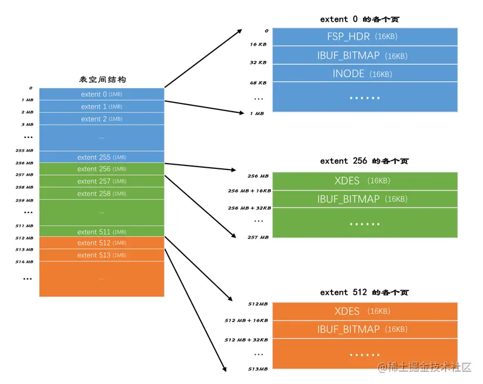
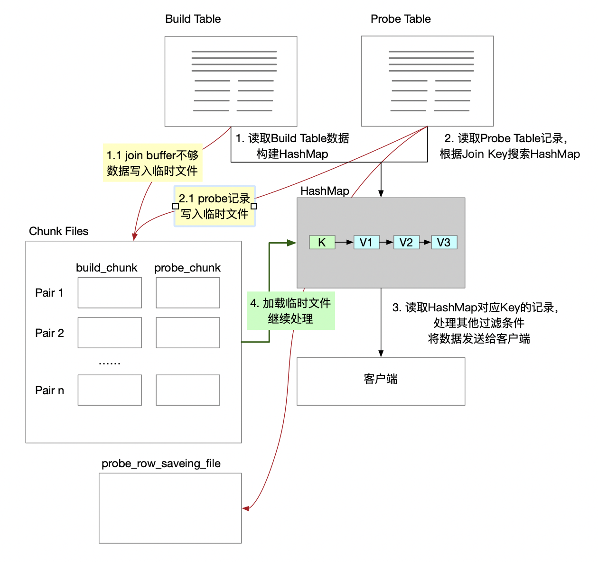
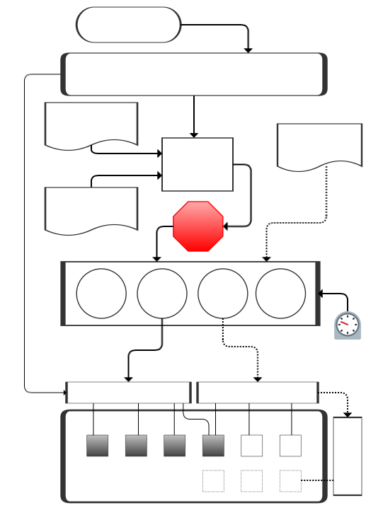

## 《MySQL 是怎样运行的：从根儿上理解 MySQL》

[《MySQL 是怎样运行的：从根儿上理解 MySQL》](https://relph1119.github.io/mysql-learning-notes/#/)

[Relph1119/mysql-learning-notes: MySQL学习《MySQL 是怎样运行的：从根儿上理解 MySQL》，在线阅读：https://relph1119.github.io/mysql-learning-notes/](https://github.com/Relph1119/mysql-learning-notes)


### x

```markdown
截止到服务器程序完成了查询优化为止，还没有真正的去访问真实的数据表，MySQL服务器把数据的存储和提取操作都封装到了一个叫存储引擎的模块里。我们知道表是由一行一行的记录组成的，但这只是一个逻辑上的概念，物理上如何表示记录，怎么从表中读取数据，怎么把数据写入具体的物理存储器上，这都是存储引擎负责的事情。为了实现不同的功能，MySQL提供了各式各样的存储引擎，不同存储引擎管理的表具体的存储结构可能不同，采用的存取算法也可能不同。

小贴士：为什么叫`引擎`呢？因为这个名字更拉风～ 其实这个存储引擎以前叫做`表处理器`，后来可能人们觉得太土，就改成了`存储引擎`的叫法，它的功能就是接收上层传下来的指令，然后对表中的数据进行提取或写入操作。

```

“表处理器”其实更直白地说明了storage engine的本质（正如docker的cgroup原本的名称 process container这么直白的说明了“docker容器的本质是进程”），其实就是用来存放数据的东西。只不过因为数据类型不同（数据量大小、冷热、读写操作频率等），所以就需要不同的storage engine来满足其需求（***数据在不同SE中存放的格式通常是不同的，比如说memory都不用磁盘来存储数据，也就是说关闭服务器后表中的数据就消失了。再想想myisam和innodb的区别，index什么的。***）。

还是拿图书馆类比，mysql server的所有处理过程其实都与书架上的书籍无关（“没有访问到真实的数据表”）。


### 4、InnoDB 数据页结构 & 记录结构

[4、从一条记录说起—— InnoDB 记录结构 - 《MySQL 是怎样运行的：从根儿上理解 MySQL》 · IT书架](https://itshujia.com/read/mysql/81.html)

[5、盛放记录的大盒子 —— InnoDB 数据页结构 - 《MySQL 是怎样运行的：从根儿上理解 MySQL》 · IT书架](https://itshujia.com/read/mysql/82.html)

---


InnoDB有4种行格式，分别是 compact, redundant, dynamic, compressed.


---


```markdown
一个数据页可以被大致划分为7个部分，分别是

File Header，表示页的一些通用信息，占固定的38字节。
Page Header，表示数据页专有的一些信息，占固定的56个字节。
Infimum + Supremum，两个虚拟的伪记录，分别表示页中的最小和最大记录，占固定的26个字节。
User Records：真实存储我们插入的记录的部分，大小不固定。
Free Space：页中尚未使用的部分，大小不确定。
Page Directory：页中的某些记录相对位置，也就是各个槽在页面中的地址偏移量，大小不固定，插入的记录越多，这个部分占用的空间越多。
File Trailer：用于检验页是否完整的部分，占用固定的8个字节。
```

这里就是innodb page的数据结构


---

```markdown
4、InnoDB会把页中的记录划分为若干个组，每个组的最后一个记录的地址偏移量作为一个槽，存放在Page Directory中，所以在一个页中根据主键查找记录是非常快的，分为两步：

	1、通过二分法确定该记录所在的槽。

	2、通过记录的next_record属性遍历该槽所在的组中的各个记录。

5、每个数据页的File Header部分都有上一个和下一个页的编号，所以所有的数据页会组成一个双链表。

6、为保证从内存中同步到磁盘的页的完整性，在页的首部和尾部都会存储页中数据的校验和和页面最后修改时对应的LSN值，如果首部和尾部的校验和和LSN值校验不成功的话，就说明同步过程出现了问题。
```

page directory, page header, file header, file trailer


:::danger


```yaml
- "*InnoDB, arch? InnoDB数据页的数据结构? How does it works?*"
- innodb 行格式 有哪4种?
- innodb page由哪7个部分组成?


```


各个数据页可以组成一个 双向链表 ，而每个数据页中的记录会按照主键值从小到大的顺序组成一个 单向链表，每个数据页都会为存储在它里边儿的记录生成一个页目录 ，在通过主键查找某条记录的时候可以在 页目录 中使用二分法快速定位到对应的槽，然后再遍历该槽对应分组中的记录即可快速找到指定的记录(如果你对这段话有一丁点儿疑惑，那么接下来的部分不适合你，返回去看一下数据页结构吧)。

通过双向链表相关联

---

所有类型的page（11种page类型）都有 file header和 file trailer两部分

```markdown
File Header：记录页面的一些通用信息

File Trailer：校验页是否完整，保证从内存到磁盘刷新时内容的一致性。
```


:::


### 9、存放页面的大池子 —— InnoDB 的表空间

[9、存放页面的大池子 —— InnoDB 的表空间 - 《MySQL 是怎样运行的：从根儿上理解 MySQL》 · IT书架](https://itshujia.com/read/mysql/86.html)

---

```markdown
通过前边儿的内容大家知道，表空间是一个抽象的概念，对于系统表空间来说，对应着文件系统中一个或多个实际文件；对于每个独立表空间来说，对应着文件系统中一个名为表名.ibd的实际文件。大家可以把表空间想象成被切分为许许多多个页的池子，当我们想为某个表插入一条记录的时候，就从池子中捞出一个对应的页来把数据写进去。本章内容会深入到表空间的各个细节中，带领大家在InnoDB存储结构的池子中畅游。
```


```markdown
再一次强调，InnoDB是以页为单位管理存储空间的，我们的聚簇索引（也就是完整的表数据）和其他的二级索引都是以B+树的形式保存到表空间的，而B+树的节点就是数据页。我们前边说过，这个数据页的类型名其实是：FIL_PAGE_INDEX，除了这种存放索引数据的页面类型之外，InnoDB也为了不同的目的设计了若干种不同类型的页面，为了唤醒大家的记忆，我们再一次把各种常用的页面类型提出来：
```

***因为table space中的page太多了，为了更好地管理这些page，所以规定连续的64个page就是一个extent（也就是一个extent默认占用1MB空间）***

而256个extent划分为一组




```markdown
第一个组最开始的3个页面的类型是固定的，也就是说extent 0这个区最开始的3个页面的类型是固定的，分别是：
...

其余各组最开始的2个页面的类型是固定的，也就是说extent 256、extent 512这些区最开始的2个页面的类型是固定的，分别是：
...

好了，宏观的结构介绍完了，里边儿的名词大家也不用记清楚，只要大致记得：表空间被划分为许多连续的区，每个区默认由64个页组成，每256个区划分为一组，每个组的最开始的几个页面类型是固定的就好了。
```

---


```markdown
为啥好端端的提出一个区（extent）的概念呢？我们以前分析问题的套路都是这样的：表中的记录存储到页里边儿，然后页作为节点组成B+树，这个B+树就是索引，然后吧啦吧啦一堆聚簇索引和二级索引的区别。这套路也没啥不妥的呀～

是的，如果我们表中数据量很少的话，比如说你的表中只有几十条、几百条数据的话，的确用不到区的概念，因为简单的几个页就能把对应的数据存储起来，但是你架不住表里的记录越来越多呀。

？？啥？？表里的记录多了又怎样？B+树的每一层中的页都会形成一个双向链表呀，File Header中的FIL_PAGE_PREV和FIL_PAGE_NEXT字段不就是为了形成双向链表设置的么？

是的是的，您说的都对，从理论上说，不引入区的概念只使用页的概念对存储引擎的运行并没啥影响，但是我们来考虑一下下边这个场景：

我们每向表中插入一条记录，本质上就是向该表的聚簇索引以及所有二级索引代表的B+树的节点中插入数据。而B+树的每一层中的页都会形成一个双向链表，如果是以页为单位来分配存储空间的话，双向链表相邻的两个页之间的物理位置可能离得非常远。我们介绍B+树索引的适用场景的时候特别提到范围查询只需要定位到最左边的记录和最右边的记录，然后沿着双向链表一直扫描就可以了，而如果链表中相邻的两个页物理位置离得非常远，就是所谓的随机I/O。再一次强调，磁盘的速度和内存的速度差了好几个数量级，随机I/O是非常慢的，所以我们应该尽量让链表中相邻的页的物理位置也相邻，这样进行范围查询的时候才可以使用所谓的顺序I/O。

所以，所以，所以才引入了区（extent）的概念，一个区就是在物理位置上连续的64个页。在表中数据量大的时候，为某个索引分配空间的时候就不再按照页为单位分配了，而是按照区为单位分配，甚至在表中的数据十分非常特别多的时候，可以一次性分配多个连续的区。虽然可能造成一点点空间的浪费（数据不足填充满整个区），但是从性能角度看，可以消除很多的随机I/O，功大于过嘛！
```


```markdown
XDES Entry链表
到现在为止，我们已经提出了五花八门的概念，什么区、段、碎片区、附属于段的区、XDES Entry结构吧啦吧啦的概念，走远了千万别忘了自己为什么出发，我们把事情搞这么麻烦的初心仅仅是想提高向表插入数据的效率又不至于数据量少的表浪费空间。现在我们知道向表中插入数据本质上就是向表中各个索引的叶子节点段、非叶子节点段插入数据，也知道了不同的区有不同的状态，再回到最初的起点，捋一捋向某个段中插入数据的过程：

```

“我们把事情搞这么麻烦的初心仅仅是想提高向表插入数据的效率，又不至于数据量少的表浪费空间”

[//]: # (TODO 给这个搞个qs：是怎么通过extent, segment, ... 来实现提高插入效率，又没有浪费空间的)


---


```markdown
到现在为止我们已经大概清楚了表空间、段、区、XDES Entry、INODE Entry、各种以XDES Entry为节点的链表的基本概念了，可是总有一种飞在天上不踏实的感觉，每个区对应的XDES Entry结构到底存储在表空间的什么地方？直属于表空间的FREE、FREE_FRAG、FULL_FRAG链表的基节点到底存储在表空间的什么地方？每个段对应的INODE Entry结构到底存在表空间的什么地方？我们前边介绍了每256个连续的区算是一个组，想解决刚才提出来的这些个疑问还得从每个组开头的一些类型相同的页面说起，接下来我们一个页面一个页面的分析，真相马上就要浮出水面了。
```


- 每个区对应的XDES Entry结构到底存储在表空间的什么地方？
- 直属于表空间的FREE、FREE_FRAG、FULL_FRAG链表的基节点到底存储在表空间的什么地方？
- 每个段对应的INODE Entry结构到底存在表空间的什么地方？


---


```markdown
了解完了独立表空间的基本结构，系统表空间的结构也就好理解多了，系统表空间的结构和独立表空间基本类似，只不过由于整个MySQL进程只有一个系统表空间，在系统表空间中会额外记录一些有关整个系统信息的页面，所以会比独立表空间多出一些记录这些信息的页面。因为这个系统表空间最牛逼，相当于是表空间之首，所以它的表空间 ID（Space ID）是0。
```

```markdown
可以看到，系统表空间和独立表空间的前三个页面（页号分别为0、1、2，类型分别是FSP_HDR、IBUF_BITMAP、INODE）的类型是一致的，只是页号为3～7的页面是系统表空间特有的，我们来看一下这些多出来的页面都是干啥使的：
```

***系统表空间和独立表空间的前三个page的type相同（分别是 FSP_HDR, IBUF_BITMAP, INODE），后面5个不同***

```markdown
除了这几个记录系统属性的页面之外，系统表空间的extent 1和extent 2这两个区，也就是页号从64~191这128个页面被称为Doublewrite buffer，也就是双写缓冲区。不过上述的大部分知识都涉及到了事务和多版本控制的问题，这些问题我们会放在后边的章节集中唠叨，现在讲述太影响用户体验，所以现在我们只唠叨一下有关InnoDB数据字典的知识，其余的概念在后边再看。
```

Doublewrite buffer


:::danger

```yaml
- mysql innodb 独立表空间 的 table space, extent, segment 分别是啥? 啥关系?
- mysql为什么需要系统表空间
- mysql 系统表空间和独立表空间 有啥区别

```


:::


### 6、快速查询的秘籍 —— B+ 树索引

[6、快速查询的秘籍 —— B+ 树索引 - 《MySQL 是怎样运行的：从根儿上理解 MySQL》 · IT书架](https://itshujia.com/read/mysql/83.html) 分别介绍了没有使用索引和（Innodb中）使用索引，这两种情况下各自的查找过程，

---


```markdown
前边我们详细唠叨了InnoDB数据页的7个组成部分，知道了各个数据页可以组成一个双向链表，而每个数据页中的记录会按照主键值从小到大的顺序组成一个单向链表，每个数据页都会为存储在它里边儿的记录生成一个页目录，在通过主键查找某条记录的时候可以在页目录中使用二分法快速定位到对应的槽，然后再遍历该槽对应分组中的记录即可快速找到指定的记录（如果你对这段话有一丁点儿疑惑，那么接下来的部分不适合你，返回去看一下数据页结构吧）。页和记录的关系示意图如下：
```


<center>*page之间双向链表连接*</center>


---


:::danger

```yaml
-
```


:::


### 7、好东西也得先学会怎么用-B+树索引的使用

[第7章 好东西也得先学会怎么用-B+树索引的使用](https://relph1119.github.io/mysql-learning-notes/#/mysql/07-%E5%A5%BD%E4%B8%9C%E8%A5%BF%E4%B9%9F%E5%BE%97%E5%85%88%E5%AD%A6%E4%BC%9A%E6%80%8E%E4%B9%88%E7%94%A8-B+%E6%A0%91%E7%B4%A2%E5%BC%95%E7%9A%84%E4%BD%BF%E7%94%A8)

---


bptree index 适用情况 和 失效情况 正反都要说


```markdown
  我们前面详细、详细又详细的介绍了InnoDB存储引擎的B+树索引，我们必须熟悉下面这些结论：

每个索引都对应一棵B+树，B+树分为好多层，最下面一层是叶子节点，其余的是内节点。所有用户记录都存储在B+树的叶子节点，所有目录项记录都存储在内节点。

InnoDB存储引擎会自动为主键（如果没有它会自动帮我们添加）建立聚簇索引，聚簇索引的叶子节点包含完整的用户记录。

我们可以为自己感兴趣的列建立二级索引，二级索引的叶子节点包含的用户记录由索引列 + 主键组成，所以如果想通过二级索引来查找完整的用户记录的话，需要通过回表操作，也就是在通过二级索引找到主键值之后再到聚簇索引中查找完整的用户记录。

B+树中每层节点都是按照索引列值从小到大的顺序排序而组成了双向链表，而且每个页内的记录（不论是用户记录还是目录项记录）都是按照索引列的值从小到大的顺序而形成了一个单链表。如果是联合索引的话，则页面和记录先按照联合索引前面的列排序，如果该列值相同，再按照联合索引后边的列排序。

通过索引查找记录是从B+树的根节点开始，一层一层向下搜索。由于每个页面都按照索引列的值建立了Page Directory（页目录），所以在这些页面中的查找非常快。
```

几个关键字，内节点 叶子结点 双向链表 page directory

再加上 innodb page结构和 记录结构


节点之间双向链表，节点内部单向链表

这怎么实现范围查询呢

单向链表 倒序查询 怎么搞

为啥不是双向


---

```markdown
时间上的代价

  每次对表中的数据进行增、删、改操作时，都需要去修改各个B+树索引。而且我们讲过，B+树每层节点都是按照索引列的值从小到大的顺序排序而组成了双向链表。不论是叶子节点中的记录，还是内节点中的记录（也就是不论是用户记录还是目录项记录）都是按照索引列的值从小到大的顺序而形成了一个单向链表。而增、删、改操作可能会对节点和记录的排序造成破坏，所以存储引擎需要额外的时间进行一些记录移位，页面分裂、页面回收什么的操作来维护好节点和记录的排序。如果我们建了许多索引，每个索引对应的B+树都要进行相关的维护操作，这还能不给性能拖后腿么？
```

可以认为 内节点 是对叶子节点的一层冗余吗


```markdown
  为了方便大家理解，我们特意标明了哪些是内节点，哪些是叶子节点。再次强调一下，内节点中存储的是目录项记录，叶子节点中存储的是用户记录（由于不是聚簇索引，所以用户记录是不完整的，缺少country列的值）。从图中可以看出，这个idx_name_birthday_phone_number索引对应的B+树中页面和记录的排序方式就是这样的：

先按照name列的值进行排序。
如果name列的值相同，则按照birthday列的值进行排序。
如果birthday列的值也相同，则按照phone_number的值进行排序。
  这个排序方式十分、特别、非常、巨、very very very重要，因为只要页面和记录是排好序的，我们就可以通过二分法来快速定位查找。下面的内容都仰仗这个图了，大家对照着图理解。

```

索引记录是有排序的


:::danger

[//]: # (TODO index)

```yaml

- "***Index 创建原则?***"
- "***使用 mysql 索引时，可能会导致索引失效的错误用法?***"


```


---

[MySQL索引失效的常见场景 - 随心的风 - 博客园](https://www.cnblogs.com/suixing123/p/13859436.html) where使用 mysql内置函数、负向查询、or（需要注意的是，实际上指的是where使用内置函数会导致索引失效，在select子句中使用还会走索引。需要注意的是隐式转换和列运算也可归入此类）、最左原则（包括“like通配符”也可归入此类）


:::


### ***10、条条大路通罗马 —— 单表访问方法***


[10、条条大路通罗马 —— 单表访问方法 - 《MySQL 是怎样运行的：从根儿上理解 MySQL》 · IT书架](https://itshujia.com/read/mysql/87.html#38j2rl) 这章其实就是 explain 的几种type，也就是几种常用的单表sql语句，通常会使用哪种索引type。之后的“注意事项”，用来说明几种索引失效的情况

---

```markdown
设计MySQL的大叔把查询的执行方式大致分为下边两种：

使用全表扫描进行查询 （这种执行方式很好理解，就是把表的每一行记录都扫一遍嘛，把符合搜索条件的记录加入到结果集就完了。不管是啥查询都可以使用这种方式执行，当然，这种也是最笨的执行方式。）


使用索引进行查询 （因为直接使用全表扫描的方式执行查询要遍历好多记录，所以代价可能太大了。如果查询语句中的搜索条件可以使用到某个索引，那直接使用索引来执行查询可能会加快查询执行的时间。使用索引来执行查询的方式五花八门，又可以细分为许多种类：）

	针对主键或唯一二级索引的等值查询

	针对普通二级索引的等值查询

	针对索引列的范围查询

	直接扫描整个索引
```


- const 主键索引、唯一索引等只有一条记录的
- ref 普通索引
- ref_or_null 普通索引，类似ref但是还要查找null
- range 范围查询
- index 全索引扫描
- all 全表扫描


:::danger


```yaml
- mysql访问类型？或者说，explain的几种type（const, ref, ref_or_null, range, index, all）分别是啥意思?
- 为什么不同sql会走不同type，以及执行这些type时各自的具体执行流程？
- mysql 索引 失效，有哪些常见场景?
```


:::


### 11、连接的原理


[11、两个表的亲密接触 —— 连接的原理 - 《MySQL 是怎样运行的：从根儿上理解 MySQL》 · IT书架](https://itshujia.com/read/mysql/88.html#5c23c8) 前半部分join使用很简单，主要看后半部分的原理。

简单来说，就是先在驱动表（主表）中查到数据集，再根据被驱动表（副表）的where在这个数据集里查数据。在此基础上，就有了内连接和外连接的区别。内连接就是 主表的记录在副表中找不到匹配记录，该记录不会加入到最终的结果集。外连接则相反。

---


Nested-Loop Join

基于块的嵌套循环连接（Block Nested-Loop Join）

[MySQL中的Join 的算法（NLJ、BNL、BKA） - Booksea - 博客园](https://www.cnblogs.com/booksea/p/17380941.html)

[MySQL优化器特性（四）表关联之BNL（Block Nested Loop）和Hash Join - 技术文章 - 云掣](https://yunche.pro/blog/?id=348)





:::danger

```yaml
- join的本质是啥？
- optimizer对join的优化（NLJ, BNL, BKA）各自的工作机制？

```


:::


### ~~12、谁最便宜就选谁 —— MySQL 基于成本的优化~~

[12、谁最便宜就选谁 —— MySQL 基于成本的优化 - 《MySQL 是怎样运行的：从根儿上理解 MySQL》 · IT书架](https://itshujia.com/read/mysql/89.html)

---


### ~~13、兵马未动，粮草先行 —— InnoDB 统计数据是如何收集的~~

[13、兵马未动，粮草先行 —— InnoDB 统计数据是如何收集的 - 《MySQL 是怎样运行的：从根儿上理解 MySQL》 · IT书架](https://itshujia.com/read/mysql/90.html) 这章比较简单，innodb的数据肯定是部分做了持久化，部分暂存在内存。这个不用说。这章就是相关的一些具体设置。


---


### ***14、不好看就要多整容 —— MySQL 基于规则的优化***

[14、不好看就要多整容 —— MySQL 基于规则的优化（内含关于子查询优化二三事儿） - 《MySQL 是怎样运行的：从根儿上理解 MySQL》 · IT书架](https://itshujia.com/read/mysql/91.html) 这章就回答了“mysql 的 optimizer有哪些优化方法（有哪些“查询重写”优化方法）”

---

前面“条件化简”这部分其实就是 一些常用的编译器优化操作，常量传播cp、常量折叠 cf、死码消除、CSE、BCE、LICM

---

外连接消除

***内连接的主表和副表可以互相转换，据此optimizer就会自动进行优化。而外连接则无法转换，所以无法进行自动优化。外连接消除就是optimizer自动把（可以转换为内连接的）外连接转内连接***。文章举了一个 reject-NULL 的例子。


---

- 子查询在MySQL中是怎么执行的


---


ICP and index dive, (MRR, BKA, BNL)

- `ICP索引条件下推(Index Condition Pushdown)` 用索引筛选的 where 条件在存储引擎一侧进行筛选，而不是将所有 index access 的结果都放在 server 端进行 where 筛选
- `MRR索引多范围查找(Multi-Range Read)` 优化器将随机 io 转化为顺序 io，以降低查询过程中 io 开销的一种手段
- `BKA(Batched Key Access)`，，在表连接过程中为了提升 join 性能而使用的 join buffer，其作用是在读取被 join 表的记录时，使用顺序 io(BKA 被使用的标识是执行计划的 extra 信息中会有 BKA 信息)。BKA优化技术在join中使用，特别是在执行连接操作时，如果一个表上的索引已经排序，而另一个表上的连接列也是有序的，那么MySQL可以使用BKA来批量访问这两个表。它允许优化器批量访问索引，减少索引访问的次数，从而提高join的性能。
- `BNL(Block Nested Loop)` BNL优化技术也是在join中使用的。当join无法使用更高级的连接算法（如索引连接或哈希连接）时，MySQL会使用BNL。BNL通过逐行读取两个表的数据，并执行循环匹配操作，以获取满足连接条件的结果。虽然BNL可能会导致性能较低，但在某些情况下，它仍然是执行join的一种有效方法。

---

```markdown
ICP的原理很简单。当 MySQL 执行查询语句时，它会根据查询条件选择合适的索引来访问数据。在传统的执行方式中，MySQL 首先通过索引找到满足条件的记录的主键，然后再根据主键值从数据表中获取记录。而索引条件下推则在索引访问阶段就进行条件过滤，只返回满足查询条件的记录的主键，避免了不必要的主键查找操作。

这样做的好处是减少了磁盘 IO 和网络传输，提高了查询效率。特别是对于那些返回记录较多但满足查询条件的记录较少的查询，索引条件下推可以大幅提升性能。
```

这些概念太抽象了，简单来说就是“ICP就是把本应executor执行的，推给SE来执行”

仍然用图书馆类比的话，ICP相当于在图书检索系统操作员（executor）正式检索之前，由图书馆工作人员（存储引擎）利用索引目录（索引）进行的预筛选，这样可以减少操作员需要检查的书籍数量，提高整体检索效率。

BKA和BNL都是在join操作时才会使用的优化技术

```markdown
- ICP（Index Condition Pushdown）：ICP在优化器中是一项重要的优化技术，它类似于图书馆的索引目录。在图书馆中，索引目录帮助读者快速找到所需书籍的位置。类比到MySQL中，ICP会尽可能将查询条件下推至存储引擎层级，以减少不必要的数据读取，提高查询效率。
- MRR（Multi-Range Read）：MRR是一种批量读取技术，类似于在图书馆中一次性获取多本书。MRR允许MySQL在存储引擎层级批量读取满足查询条件的多个数据块，以减少磁盘I/O操作，提高查询性能。
- BKA（Batch Key Access）：BKA是一种批量键访问技术，类似于在图书馆中通过预定书架号快速获取多本书。在MySQL中，BKA允许优化器批量访问索引，以减少索引访问的次数，提高查询速度。
- BNL（Block Nested Loop）：BNL是一种块嵌套循环技术，类似于在图书馆中通过遍历多个书架来查找所需书籍。在MySQL中，BNL用于处理连接操作，它会逐行读取两个表的数据，并执行循环匹配操作，以获取符合连接条件的结果。
- Index Dive：Index Dive类似于在图书馆中通过索引快速定位到需要的书籍的过程。在MySQL中，Index Dive是一种优化技术，它允许优化器通过索引的跳跃访问，直接定位到满足查询条件的数据，而无需完全扫描索引。
```

ICP就是“把查询条件放到存储引擎，能提高查询效率”，通俗来说就是，在查询过程中，直接在查询引擎层的 API 获取数据时，实现“非直接索引”过滤条件的筛选，而不是查询引擎层查询出来之后在 server 层筛选。

再则，ICP更适合那种大量数据，但是其中只有极少数满足查询条件的场景。

```markdown
MRR是一种针对读取操作的优化技术。它通过在一个请求中读取多个连续范围的数据，以减少读取磁盘的次数。MRR通常用于处理顺序扫描（Sequential Scan）或范围查询（Range Query）等需要从磁盘读取大量连续数据的场景。通过减少磁盘IO次数，MRR可以显著提高读取操作的性能。
```

MRR主要关注的是优化读取操作的效率

这些优化器技术都旨在提高查询性能，减少不必要的磁盘I/O和数据扫描


:::danger

```yaml

```

:::


### 15、Explain

[15、查询优化的百科全书 —— Explain 详解（上） - 《MySQL 是怎样运行的：从根儿上理解 MySQL》 · IT书架](https://itshujia.com/read/mysql/92.html)

[16、查询优化的百科全书 —— Explain 详解（下） - 《MySQL 是怎样运行的：从根儿上理解 MySQL》 · IT书架](https://itshujia.com/read/mysql/93.html)

---


---

extra提供了一些额外信息


```markdown
No tables used

Impossible WHERE

No matching min/max row

Using index

Using index condition

Using where

Using join buffer (Block Nested Loop)

Not exists

Using intersect(...)、Using union(...)和Using sort_union(...)

Zero limit

Using filesort

Using temporary

Start temporary, End temporary

LooseScan

FirstMatch(tbl_name)
```


---

```mysql
EXPLAIN FORMAT=JSON SELECT * FROM s1 INNER JOIN s2 ON s1.key1 = s2.key2 WHERE s1.common_field = 'a'\G
```

用 EXPLAIN FORMAT=JSON 给 explain加上估算执行cost

通过结果集中的 cost_info 查看


:::danger

```yaml
- mysql explain语句的 type
- mysql explain语句的 extra
- explain format=json 怎么用


```

:::


---


[MySQL查询优化分析 - 常用分析方法](http://mysql.taobao.org/monthly/2024/05/02/)


[MySQL EXPLAIN结果集分析 - 附带大量案例](https://mp.weixin.qq.com/s/p5UKuh1yY3P4zrOzVBmY1w)


### 17、神兵利器 —— optimizer trace 的神奇功效

[17、神兵利器 —— optimizer trace 的神奇功效 - 《MySQL 是怎样运行的：从根儿上理解 MySQL》 · IT书架](https://itshujia.com/read/mysql/94.html)

---

```markdown
对于MySQL 5.6以及之前的版本来说，查询优化器就像是一个黑盒子一样，你只能通过EXPLAIN语句查看到最后优化器决定使用的执行计划，却无法知道它为什么做这个决策。这对于一部分喜欢刨根问底的小伙伴来说简直是灾难：“我就觉得使用其他的执行方案比EXPLAIN输出的这种方案强，凭什么优化器做的决定和我想的不一样呢？”

在MySQL 5.6以及之后的版本中，设计MySQL的大叔贴心的为这部分小伙伴提出了一个optimizer trace的功能，
```

***optimizer trace 用来展示具体的决策过程（也就是为啥会选择这样的“执行计划”），换句话就是用来解释为啥explain会决定使用这个“执行计划”，而不是其他的***

后面就是讲了下具体怎么使用 optimizer-trace

---

```markdown
不过杂乱之中其实还是蛮有规律的，优化过程大致分为了三个阶段：

prepare阶段

optimize阶段

execute阶段

我们所说的基于成本的优化主要集中在optimize阶段，对于单表查询来说，我们主要关注optimize阶段的"rows_estimation"这个过程，这个过程深入分析了对单表查询的各种执行方案的成本；对于多表连接查询来说，我们更多需要关注"considered_execution_plans"这个过程，这个过程里会写明各种不同的连接方式所对应的成本。反正优化器最终会选择成本最低的那种方案来作为最终的执行计划，也就是我们使用EXPLAIN语句所展现出的那种方案。

如果有小伙伴对使用EXPLAIN语句展示出的对某个查询的执行计划很不理解，大家可以尝试使用optimizer trace功能来详细了解每一种执行方案对应的成本，相信这个功能能让大家更深入的了解MySQL查询优化器。

```

确实如此，***查询计划由optimizer提供（也就是基于预估cost的），而执行详细信息的收集则是由executo提供。***


:::danger

```yaml
- 【optimizer-trace】怎么用optimizer-trace来优化sql？ 如何分析trace来改善查询的执行效率？
- optimizer-trace 和 explain-analyzer 有啥区别? 各自用来针对sql优化的哪个方面? # ***查询计划的解释是由optimizer提供的，而执行详细信息的收集是由executor提供的。*** 这点在mysql和postgres里是一样的。*也就是说几个mysql常用的优化命令，optimizer-trace是optimizer提供的，explain analyze 是 executor提供的，show status 则是一个数据汇总的命令，*

```

:::


### ***18、调节磁盘和CPU的矛盾 —— InnoDB 的 Buffer Pool***

[18、调节磁盘和CPU的矛盾 —— InnoDB 的 Buffer Pool - 《MySQL 是怎样运行的：从根儿上理解 MySQL》 · IT书架](https://itshujia.com/read/mysql/95.html) 这章涉及到


---

```markdown
通过前边的唠叨我们知道，对于使用InnoDB作为存储引擎的表来说，不管是用于存储用户数据的索引（包括聚簇索引和二级索引），还是各种系统数据，都是以页的形式存放在表空间中的，而所谓的表空间只不过是InnoDB对文件系统上一个或几个实际文件的抽象，也就是说我们的数据说到底还是存储在磁盘上的。但是各位也都知道，磁盘的速度慢的跟乌龟一样，怎么能配得上“快如风，疾如电”的CPU呢？所以InnoDB存储引擎在处理客户端的请求时，当需要访问某个页的数据时，就会把完整的页的数据全部加载到内存中，也就是说即使我们只需要访问一个页的一条记录，那也需要先把整个页的数据加载到内存中。将整个页加载到内存中后就可以进行读写访问了，在进行完读写访问之后并不着急把该页对应的内存空间释放掉，而是将其缓存起来，这样将来有请求再次访问该页面时，就可以省去磁盘IO的开销了。
```

***buffer pool本质上是innodb向os申请的一段连续内存空间。这段连续内存由控制块和缓存页组成。每个控制块和缓存页都是一一对应的，在填充足够多的控制块和缓存页的组合后，Buffer Pool剩余的空间可能产生不够填充一组控制块和缓存页，这部分空间不能被使用，也被称为碎片。***


```markdown
1、Buffer Pool本质上是InnoDB向操作系统申请的一段连续的内存空间，可以通过innodb_buffer_pool_size来调整它的大小。


2、Buffer Pool向操作系统申请的连续内存由控制块和缓存页组成，每个控制块和缓存页都是一一对应的，在填充足够多的控制块和缓存页的组合后，Buffer Pool剩余的空间可能产生不够填充一组控制块和缓存页，这部分空间不能被使用，也被称为碎片。


3、InnoDB使用了许多链表来管理Buffer Pool。

4、free链表中每一个节点都代表一个空闲的缓存页，在将磁盘中的页加载到Buffer Pool时，会从free链表中寻找空闲的缓存页。

5、为了快速定位某个页是否被加载到Buffer Pool，使用表空间号 + 页号作为key，缓存页作为value，建立哈希表。

6、在Buffer Pool中被修改的页称为脏页，脏页并不是立即刷新，而是被加入到flush链表中，待之后的某个时刻同步到磁盘上。

7、LRU链表分为young和old两个区域，可以通过innodb_old_blocks_pct来调节old区域所占的比例。首次从磁盘上加载到Buffer Pool的页会被放到old区域的头部，在innodb_old_blocks_time间隔时间内访问该页不会把它移动到young区域头部。在Buffer Pool没有可用的空闲缓存页时，会首先淘汰掉old区域的一些页。

8、我们可以通过指定innodb_buffer_pool_instances来控制Buffer Pool实例的个数，每个Buffer Pool实例中都有各自独立的链表，互不干扰。

9、自MySQL 5.7.5版本之后，可以在服务器运行过程中调整Buffer Pool大小。每个Buffer Pool实例由若干个chunk组成，每个chunk的大小可以在服务器启动时通过启动参数调整。

```


:::danger

```yaml
#- topic: InnoDB 缓冲池(buffer-pool)

- 什么是缓冲池 buffer-pool? # 避免每次读操作都进行磁盘 IO，具体来说，缓冲池缓存了大量数据页，让 CPU 读取和写入数据时，直接和缓冲区交互，不需要操作磁盘，从而避免磁盘拖慢数据库性能的问题（*注意缓冲池是 innoDB 引擎的特性，而不是 mysql 的*）
- 缓冲池存哪些数据？ # 缓存表数据与索引数据，把磁盘上的数据加载到缓冲池，避免每次访问都进行磁盘 IO，起到加速访问的作用。
- 缓冲池的工作机制？

- 缓存页的哈希处理
- flush链表的管理
- LRU链表的管理

```


:::


#### 脏页刷新





```markdown
当然，以下是InnoDB存储引擎中脏页刷新（Page Flush）过程的概述，涵盖了所有关键点：

1. **事务修改页**：当事务对表中的数据进行修改时，这些修改首先在内存中的页（buffer pool中的页）上进行。一旦页被修改，它就变成一个脏页。

2. **重做日志记录**：在事务提交之前，InnoDB会将修改记录到重做日志（redo log）中。这是为了确保在发生故障时可以使用这些日志来恢复数据。

3. **事务提交**：事务提交后，修改的页仍然是脏页，因为它们还没有被写回到磁盘上。

4. **脏页刷新触发**：InnoDB有几种机制来触发脏页的刷新：
   - **后台刷新**：后台线程（Page Cleaner）定期刷新脏页。
   - **Checkpoint触发**：当重做日志的头部（head）和尾部（tail）之间的距离（checkpoint age）达到一定阈值时，会触发刷新。
   - **缓冲池压力**：当缓冲池中脏页的比例过高或需要为新的读操作腾出空间时，会触发脏页刷新。

5. **刷新邻接页**：如果启用了刷新邻接页（Flush Neighbor Page）功能，InnoDB在刷新一个脏页时，会检查同一区（extent）内的所有页，如果这些页也是脏的，它们也会被一起刷新。

6. **自适应刷新**：InnoDB的自适应刷新算法根据当前的写入负载和磁盘性能动态调整刷新速率，以避免刷新风暴（flush storm）。

7. **刷新操作**：脏页被写回到磁盘上，这一过程可能涉及异步IO操作，以提高效率。

8. **刷新完成**：一旦脏页被成功写回到磁盘，它们就不再是脏页。InnoDB会更新重做日志的尾部位置，减少checkpoint age。

9. **日志文件管理**：随着脏页的刷新，之前记录的重做日志可以被覆盖，以便日志文件可以循环使用。

10. **性能监控与调优**：通过监控刷新操作的性能，如通过`show engine innodb status`命令，DBA可以对刷新过程进行调优，例如调整`innodb_page_cleaners`、`innodb_adaptive_flushing_lwm`、`innodb_io_capacity`等参数。

11. **刷新争用处理**：在高负载情况下，刷新操作可能会与其他数据库操作（如查询和索引构建）竞争资源，需要适当调整以避免性能瓶颈。

12. **系统状态反馈**：InnoDB通过日志和状态信息提供刷新操作的反馈，帮助DBA了解系统的当前状态并做出相应的调整。

整个刷新过程是InnoDB保证数据持久性和系统性能的关键机制之一。通过智能地管理脏页的刷新，InnoDB可以在保持高性能的同时，确保数据的安全性和完整性。

```


dirty pages

```markdown
在整个InnoDB的脏页刷新（Flush）过程中，涉及到以下特性：

1. **缓冲池（Buffer Pool）**：InnoDB使用缓冲池来缓存频繁访问的数据和索引页，减少对磁盘的I/O操作。

2. **脏页（Dirty Pages）**：在缓冲池中被修改但尚未写入磁盘的页。

3. **重做日志（Redo Log）**：事务提交前，修改操作首先记录到重做日志中，确保数据恢复的一致性。

4. **LSN（Log Sequence Number）**：用于记录重做日志的位置，每个事务都会生成一个新的LSN。

5. **Checkpoint**：刷新过程中，InnoDB会更新磁盘上数据页的状态，Checkpoint机制用于标记哪些数据已经刷新到磁盘。

6. **刷新邻接页（Flush Neighbor Page）**：当刷新一个脏页时，如果该页所在的区（extent）内还有其他脏页，它们也会被一起刷新。

7. **自适应刷新（Adaptive Flushing）**：根据当前的系统负载和性能指标，动态调整刷新速率。

8. **异步IO（Asynchronous IO）**：InnoDB支持异步IO操作，允许脏页刷新操作与其他数据库操作并发执行。

9. **刷新线程（Page Cleaner Threads）**：InnoDB使用专门的后台线程来刷新脏页。

10. **刷新控制参数**：
    - `innodb_page_cleaners`：控制刷新脏页的线程数。
    - `innodb_purge_threads`：控制清除操作的线程数。
    - `innodb_io_capacity`：定义InnoDB刷新磁盘时的IO容量。
    - `innodb_adaptive_flushing`：控制是否启用自适应刷新算法。
    - `innodb_adaptive_flushing_lwm`：自适应刷新的最低水位参数。
    - `innodb_flush_neighbors`：控制是否启用刷新邻接页特性。

11. **刷新争用处理**：在高负载情况下，InnoDB需要处理刷新操作与其他数据库操作之间的资源争用。

12. **性能监控**：通过`show engine innodb status`等命令监控刷新操作的性能。

13. **刷新风暴（Flush Storm）**：当重做日志的空间不足以容纳新的事务提交时，InnoDB会高速刷新脏页以释放空间，这可能导致性能问题。

14. **日志文件管理**：刷新过程中，InnoDB需要管理重做日志文件，确保日志文件的循环使用。

15. **系统状态反馈**：InnoDB通过日志和状态信息提供刷新操作的反馈，帮助数据库管理员了解系统的当前状态。

这些特性共同工作，确保InnoDB存储引擎能够有效地管理脏页刷新，同时保持高性能和数据的持久性。

```


InnoDB的redolog就是WAL嘛，必然会产生脏页


为啥会出现脏页? page flush的时机? 刷新策略?


能否给我概述一下整个page flush的过程？整个flush过程中涉及到哪些innodb的特性？


flush page 就是把内存中修改过的页（脏页）写回到磁盘上，以确保数据的持久性和一致性。

之所以产生脏页就是因为InnoDB用WAL来防止宕机数据丢失，也就是事务提交时，先写redolog，再修改内存数据页，这样就产生了脏页。

那为啥要刷新呢？因为不可能把所有 buffer pool 所以需要把buffer pool里的脏页都刷新到磁盘里

InnoDB通过LSN（每条log的结束点，用字节偏移量来表示。每个page有LSN，redo log也有LSN，Checkpoint也有LSN）来标记版本

Checkpoint机制每次刷新多少页，从哪里取脏页，什么时间触发刷新？


:::danger

```yaml
- topic: InnoDB 预读
  qs:
    - q: 什么是预读？
      x: 磁盘按页读取，如果要读取的数据就在页中，就能节省后面的磁盘 io，提高效率。数据访问遵循`集中读写`的原则，使用一些数据，大概率会使用附近的数据，这就是`局部性原理`
    - q: 什么是预读失败？
    - q: 如何对预读失败进行优化？
    - q: 什么是缓冲池污染？
    - q: 怎么解决缓冲池污染的问题？
```

:::


### 19、从猫爷被杀说起 —— 事务简介

[19、从猫爷被杀说起 —— 事务简介 - 《MySQL 是怎样运行的：从根儿上理解 MySQL》 · IT书架](https://itshujia.com/read/mysql/96.html)

---


### ***20、redo日志***

[第20章 说过的话就一定要办到-redo日志（上）](https://relph1119.github.io/mysql-learning-notes/#/mysql/20-%E8%AF%B4%E8%BF%87%E7%9A%84%E8%AF%9D%E5%B0%B1%E4%B8%80%E5%AE%9A%E8%A6%81%E5%8A%9E%E5%88%B0-redo%E6%97%A5%E5%BF%97%EF%BC%88%E4%B8%8A%EF%BC%89)


```markdown
redo日志是什么
  我们知道InnoDB存储引擎是以页为单位来管理存储空间的，我们进行的增删改查操作其实本质上都是在访问页面（包括读页面、写页面、创建新页面等操作）。我们前面介绍Buffer Pool的时候说过，在真正访问页面之前，需要把在磁盘上的页缓存到内存中的Buffer Pool之后才可以访问。但是在介绍事务的时候又强调过一个称之为持久性的特性，就是说对于一个已经提交的事务，在事务提交后即使系统发生了崩溃，这个事务对数据库中所做的更改也不能丢失。但是如果我们只在内存的Buffer Pool中修改了页面，假设在事务提交后突然发生了某个故障，导致内存中的数据都失效了，那么这个已经提交了的事务对数据库中所做的更改也就跟着丢失了，这是我们所不能忍受的（想想ATM机已经提示狗哥转账成功，但之后由于服务器出现故障，重启之后猫爷发现自己没收到钱，猫爷就被砍死了）。那么如何保证这个持久性呢？一个很简单的做法就是在事务提交完成之前把该事务所修改的所有页面都刷新到磁盘，但是这个简单粗暴的做法有些问题：


```


```markdown
  咋办呢？再次回到我们的初心：我们只是想让已经提交了的事务对数据库中数据所做的修改永久生效，即使后来系统崩溃，在重启后也能把这种修改恢复出来。所以我们其实没有必要在每次事务提交时就把该事务在内存中修改过的全部页面刷新到磁盘，只需要把修改了哪些东西记录一下就好，比方说某个事务将系统表空间中的第100号页面中偏移量为1000处的那个字节的值1改成2我们只需要记录一下：
```

只记录操作，不记录被修改后的数据，因为成本太高


---


```markdown
这句话可以从以下几个关键点来理解InnoDB的redo log以及它如何实现WAL（Write-Ahead Logging）策略：

1. **WAL策略**：WAL是一种常见的数据库日志技术，核心思想是在数据实际写入磁盘之前，先将对数据的修改操作记录到日志中。这样做可以提高性能，因为写日志通常比直接写磁盘要快，并且可以减少对磁盘的I/O操作。

2. **事务的持久性**：事务的持久性是ACID原则中的"D"，指的是一旦事务提交，它对数据库的改变就是永久性的，即使系统发生故障也不会丢失。InnoDB通过redo log来实现这一点：当事务提交时，相关的修改操作已经记录在redo log中，如果系统发生故障，InnoDB可以重放redo log中的操作，从而恢复未持久化到磁盘的数据。

3. **先记录日志再写入数据**：这是WAL策略的具体实现。在InnoDB中，当事务需要修改数据时，首先会在redo log中记录这次修改的详细信息，然后再将修改后的页（数据）写入内存中的缓冲池。这样做可以确保即使在数据页写入磁盘之前系统崩溃，通过redo log也能够恢复数据。

4. **Checkpoint技术**：Checkpoint是InnoDB中用于管理redo log空间和优化恢复时间的一种机制。它在redo log中标记了一个点，表示在这个点之前的所有事务都已经将数据持久化到磁盘。这样，当系统需要恢复时，只需要重放Checkpoint之后的部分日志，而不是整个日志文件，从而大大减少了恢复所需的时间。

5. **有效管理日志空间**：由于redo log是循环使用的，Checkpoint还有助于释放不再需要的日志空间。一旦数据页被刷新到磁盘并且对应的事务已经提交，从Checkpoint点之前的日志就可以被清除，为新的事务日志腾出空间。

综上所述，InnoDB的redo log通过WAL策略确保了事务的持久性，并通过Checkpoint技术有效管理了日志空间和恢复时间，从而提供了高性能和数据安全性。

```


:::danger

```yaml

- 什么是inndob的redolog? 是怎么通过redolog实现WAL的?

```


:::


### ***22、undo日志***


[第23章 后悔了怎么办-undo日志（下）](https://relph1119.github.io/mysql-learning-notes/#/mysql/23-%E5%90%8E%E6%82%94%E4%BA%86%E6%80%8E%E4%B9%88%E5%8A%9E-undo%E6%97%A5%E5%BF%97%EF%BC%88%E4%B8%8B%EF%BC%89?id=undo%e6%97%a5%e5%bf%97%e5%85%b7%e4%bd%93%e5%86%99%e5%85%a5%e8%bf%87%e7%a8%8b)


---


```markdown
undo日志具体写入过程
段（Segment）的概念
  如果你有认真看过表空间那一章的话，对这个段的概念应该印象深刻，我们当时花了非常大的篇幅来介绍这个概念。简单讲，这个段是一个逻辑上的概念，本质上是由若干个零散页面和若干个完整的区组成的。比如一个B+树索引被划分成两个段，一个叶子节点段，一个非叶子节点段，这样叶子节点就可以被尽可能的存到一起，非叶子节点被尽可能的存到一起。每一个段对应一个INODE Entry结构，这个INODE Entry结构描述了这个段的各种信息，比如段的ID，段内的各种链表基节点，零散页面的页号有哪些等信息（具体该结构中每个属性的意思大家可以到表空间那一章里再次重温一下）。我们前面也说过，为了定位一个INODE Entry，设计InnoDB的大佬设计了一个Segment Header的结构：


```


```markdown
知道了表空间ID、页号、页内偏移量，不就可以唯一定位一个INODE Entry的地址了么～
```


undolog page 链表是哪来的 干啥的


### 24、一条记录的多幅面孔 —— 事务的隔离级别与MVCC

[24、一条记录的多幅面孔 —— 事务的隔离级别与MVCC - 《MySQL 是怎样运行的：从根儿上理解 MySQL》 · IT书架](https://itshujia.com/read/mysql/101.html)

---


### 25、工作面试老大难 —— 锁

[25、工作面试老大难 —— 锁 - 《MySQL 是怎样运行的：从根儿上理解 MySQL》 · IT书架](https://itshujia.com/read/mysql/102.html)

---


### 27、MySQL的server层和存储引擎层是如何交互的

[27、MySQL的server层和存储引擎层是如何交互的 - 《MySQL 是怎样运行的：从根儿上理解 MySQL》 · IT书架](https://itshujia.com/read/mysql/104.html)

---


### 28、MySQL查询成本和扫描区间


[28、专题式讲解—MySQL查询成本和扫描区间(MySQL中IS NULL、IS NOT NULL - 《MySQL 是怎样运行的：从根儿上理解 MySQL》 · IT书架](https://itshujia.com/read/mysql/105.html)

---


### 29、听说有一个最左原则

[29、听说有一个最左原则？这回终于讲清楚了 - 《MySQL 是怎样运行的：从根儿上理解 MySQL》 · IT书架](https://itshujia.com/read/mysql/106.html)


---


### 32、MySQL使用索引执行IN子句


[32、MySQL使用索引执行IN子句 - 《MySQL 是怎样运行的：从根儿上理解 MySQL》 · IT书架](https://itshujia.com/read/mysql/109.html)

---

### 33、MySQL的COUNT语句是怎么执行的

[33、MySQL的COUNT语句是怎么执行的 - 《MySQL 是怎样运行的：从根儿上理解 MySQL》 · IT书架](https://itshujia.com/read/mysql/110.html)

---


### 40、Innodb到底是怎么加锁的

[40、Innodb到底是怎么加锁的 - 《MySQL 是怎样运行的：从根儿上理解 MySQL》 · IT书架](https://itshujia.com/read/mysql/117.html)


---


### 41、语句加锁分析实例


[41、语句加锁分析实例 - 《MySQL 是怎样运行的：从根儿上理解 MySQL》 · IT书架](https://itshujia.com/read/mysql/118.html)

---


### 42、MySQL如何查看事务加锁情况

[42、MySQL如何查看事务加锁情况 - 《MySQL 是怎样运行的：从根儿上理解 MySQL》 · IT书架](https://itshujia.com/read/mysql/119.html)

---


### 43、专题式讲解 -MySQL介于普通读和锁定读的加锁方式


[43、专题式讲解 -MySQL介于普通读和锁定读的加锁方式——semi-consistent rea - 《MySQL 是怎样运行的：从根儿上理解 MySQL》 · IT书架](https://itshujia.com/read/mysql/120.html)


---


### 44、两条一样的INSERT语句竟然引发了死锁？


[44、两条一样的INSERT语句竟然引发了死锁？ - 《MySQL 是怎样运行的：从根儿上理解 MySQL》 · IT书架](https://itshujia.com/read/mysql/121.html)

---


### 45、binlog


[45、binlog那些事儿（一） - 《MySQL 是怎样运行的：从根儿上理解 MySQL》 · IT书架](https://itshujia.com/read/mysql/122.html)


[46、binlog那些事儿（二） - 《MySQL 是怎样运行的：从根儿上理解 MySQL》 · IT书架](https://itshujia.com/read/mysql/123.html)

---


### 47、redo、undo、buffer pool、binlog，谁先谁后，有点儿乱

[47、redo、undo、buffer pool、binlog，谁先谁后，有点儿乱 - 《MySQL 是怎样运行的：从根儿上理解 MySQL》 · IT书架](https://itshujia.com/read/mysql/124.html)

---


```markdown
我们讨论的是基于InnoDB存储引擎的表，数据会被保存在硬盘上的表空间（文件系统中的一个或多个文件）中。

InnoDB会将磁盘中的数据看成是若干个页的集合，页的大小默认是16KB。其中某些页面用于存储关于系统的一些属性，某些页面用于存储undo日志，某些页面用于存储B+树的节点（也就是包含记录的页面），反正总共有十来种不同类型的页面。

不过不论是什么类型的页面，每当我们从页面中读取或写入数据时，都必须先将其从硬盘上加载到内存中的buffer pool中（也就是说内存中的页面其实就是硬盘中页面的一个副本），然后才能对内存中页面进行读取或写入。如果要修改内存中的页面，为了减少磁盘I/O，修改后的页面并不立即同步到磁盘，而是作为脏页继续呆在内存中，等待后续合适时机将其刷新到硬盘（一般是有后台线程异步刷新）。
```


### 48、XA事务与两阶段提交

[48、XA事务与两阶段提交 - 《MySQL 是怎样运行的：从根儿上理解 MySQL》 · IT书架](https://itshujia.com/read/mysql/125.html)


```markdown
跨行转账是一个典型的分布式事务的实例。各个银行都有自己的服务，如果狗哥在招商银行存了10块钱，他想把这10块钱转给猫爷在建设银行的账户，那么招商银行先得给狗哥账户扣10块，然后建设银行给猫爷账户增10块。而招商银行和建设银行根本就不是一个系统，招商银行给狗哥扣钱的业务放到了自己的一个事务里，建设银行给猫爷加钱的业务放到了自己的一个事务里，这两个事务其实在各自的系统中并没有什么关系，完全有可能招商银行的事务提交了，而建设银行的事务由于系统宕机而失败了，这就导致狗哥扣了钱，却没有转给猫爷的惨剧发生。所以我们必须引入一些机制，来实现分布式事务。
```

:::danger

```yaml


```

:::


## 《MySQL 45讲》读书笔记


```markdown
00 开篇词 这一次，让我们一起来搞懂MySQL.md
01 基础架构：一条SQL查询语句是如何执行的？.md
02 日志系统：一条SQL更新语句是如何执行的？.md
03 事务隔离：为什么你改了我还看不见？.md
04 深入浅出索引（上）.md
05 深入浅出索引（下）.md
06 全局锁和表锁 ：给表加个字段怎么有这么多阻碍？.md
07 行锁功过：怎么减少行锁对性能的影响？.md
08 事务到底是隔离的还是不隔离的？.md
09 普通索引和唯一索引，应该怎么选择？.md
10 MySQL为什么有时候会选错索引？.md
11 怎么给字符串字段加索引？.md
12 为什么我的MySQL会“抖”一下？.md
13 为什么表数据删掉一半，表文件大小不变？.md

14 count()这么慢，我该怎么办？.md
15 答疑文章（一）：日志和索引相关问题.md
16 “order by”是怎么工作的？.md
17 如何正确地显示随机消息？.md
18 为什么这些SQL语句逻辑相同，性能却差异巨大？.md

19 为什么我只查一行的语句，也执行这么慢？.md
20 幻读是什么，幻读有什么问题？.md
21 为什么我只改一行的语句，锁这么多？.md


22 MySQL有哪些“饮鸩止渴”提高性能的方法？.md
23 MySQL是怎么保证数据不丢的？.md

24 MySQL是怎么保证主备一致的？.md
25 MySQL是怎么保证高可用的？.md
26 备库为什么会延迟好几个小时？.md
27 主库出问题了，从库怎么办？.md
28 读写分离有哪些坑？.md

29 如何判断一个数据库是不是出问题了？.md
30 答疑文章（二）：用动态的观点看加锁.md
31 误删数据后除了跑路，还能怎么办？.md
32 为什么还有kill不掉的语句？.md
33 我查这么多数据，会不会把数据库内存打爆？.md
34 到底可不可以使用join？.md
35 join语句怎么优化？.md
36 为什么临时表可以重名？.md
37 什么时候会使用内部临时表？.md
38 都说InnoDB好，那还要不要使用Memory引擎？.md
39 自增主键为什么不是连续的？.md
40 insert语句的锁为什么这么多？.md
41 怎么最快地复制一张表？.md
42 grant之后要跟着flush privileges吗？.md
43 要不要使用分区表？.md
44 答疑文章（三）：说一说这些好问题.md
45 自增id用完怎么办？.md
我的MySQL心路历程.md
结束语 点线网面，一起构建MySQL知识网络.md
```


### 01 基础架构：一条SQL查询语句是如何执行的？

[01 基础架构：一条SQL查询语句是如何执行的？](https://learn.lianglianglee.com/%e4%b8%93%e6%a0%8f/MySQL%e5%ae%9e%e6%88%9845%e8%ae%b2/01%20%20%e5%9f%ba%e7%a1%80%e6%9e%b6%e6%9e%84%ef%bc%9a%e4%b8%80%e6%9d%a1SQL%e6%9f%a5%e8%af%a2%e8%af%ad%e5%8f%a5%e6%98%af%e5%a6%82%e4%bd%95%e6%89%a7%e8%a1%8c%e7%9a%84%ef%bc%9f.md)

:::tip

从 sql查询语句的执行，引申出 mysql arch（也就是cpoe）

:::


---

如果拿图书馆来类比mysql的话，就很好理解了。假设我们的需求是进入图书馆获取n本符合我们需要的书。

- connector就相当于门卫，只有预约（相当于auth）过才能进入，我们可以通过调整连接数（就是预约人数）来动态调整图书馆的负载。
- parser就相当于图书馆的前台，是把汉语转化成该书的ISBD号等MACS专用信息（将查询语句转换为内部数据结构，相当于compiler），并且提供这些书的位置和路线（提供查询计划）。mysql的parser其实就是compiler，词法分析、语法分析啥的。
- optimizer就相当于优化我们去找到这本书的路线（找到最优路线，提高查询效率）。
- executor则相当于“图书馆操作员”，负责执行优化后的查询计划（也就是带着我们），从图书馆书架（存储引擎）里查找所有需要的数据，这也解释了查询操作关键字的执行顺序，当然要先确定这些书籍的大概区域（也就是FROM），如果需要把这些书按序排列的话，就最后再执行Order这种已经拿到所有书籍之后无关紧要的操作。那中间肯定就是来获取查找这些书了，也就是各种条件（where和groupby/having和select），当然书肯定不需要重复的（也就是Distinct去重操作）。

***如果我们把存储引擎比做图书馆的所有书架的话，表、页、行分别类比成什么呢？*** 表可以类比成图书馆的某个区域，每个区域存放着特定类型的书籍。页可以看作是该区域的某个书架，每个书架上放着一定数量的书籍。行可以类比成某一排书，每一排上放着一本书。

进一步的，我们可以用这些继续类比myisam和innodb，myisam就是每个分类（比如工业技术、交通运输、历史地理等等，具体查看《中国图书馆分类法》）都会有一个单独的目录，并且不允许很多人同时查找（不支持并发查找，也就是不支持事务），进行查找时直接锁表，相应的，我们可以直接通过这个单独的MYI索引文件查找对应的图书，非常快。

InnoDB就灵活的多了，他是以书架为单位进行查找和存储的，所以他的目录（索引）是和某排图书在一起的（相当于每排书一个索引（主键索引），索引id都贴在书架该层的最前面，这时就存在两种情况，一种就是直接查目录（索引）就可以获得数据，不需要再查数据表，这个就是“索引覆盖”（或者说Index Dive，都是类似意思）。如果目录中查不到我们需要的数据，就需要“回表”了，那么我们根据索引id来看需要的书是不是在这排（再多说一句，这也是为什么主键id最好单调递增的原因））。他是支持多人同时查找的。并且在读写操作时只锁定某排书（也就是行级锁定），粒度更细，这样就更能频繁地执行读操作和写操作。

***需要注意的是mysql还支持同时使用多种存储引擎***，也就是说在图书馆里如果有一些冷门分类，很少有新书入库的，那就用myisam这种类型的管理方式，如果非常热门的分类，每天都有很多用户来买书，每天书店也需要频繁补货的，就应该用innodb。当然，如果我们把mysql看作是图书馆的话，不同图书馆的特性（规矩、规章制度）也不同，比如说oracle或者sql server这种的就比较死板，图书馆开店营业之前就定好了所有书架的管理模式（也就是存储引擎），之后再也不能修改，更不存在说不同分类使用不同的管理模式一说了。

另外，还需要注意一个问题，编织目录（索引）的具体方法和该“图书分类”（存储引擎）的映射关系。众所周知，对于不同图书分类也应该使用不同的方式来编写目录。比如说R树适用于myisam（也有B+Tree），hash适用于memory，B+Tree则适用于InnoDB。


:::tip

```yaml
- "***mysql 的查询语句的具体执行？比如 sql 语句有 select from where orderby，为啥查询语句执行的先后顺序是 FWG(H)SDO (from-where-group by-having-select-order by)？***"


```


:::


### 02 日志系统：一条SQL更新语句是如何执行的？

[02 日志系统：一条SQL更新语句是如何执行的？](https://learn.lianglianglee.com/%e4%b8%93%e6%a0%8f/MySQL%e5%ae%9e%e6%88%9845%e8%ae%b2/02%20%20%e6%97%a5%e5%bf%97%e7%b3%bb%e7%bb%9f%ef%bc%9a%e4%b8%80%e6%9d%a1SQL%e6%9b%b4%e6%96%b0%e8%af%ad%e5%8f%a5%e6%98%af%e5%a6%82%e4%bd%95%e6%89%a7%e8%a1%8c%e7%9a%84%ef%bc%9f.md)

```markdown
分析器会通过词法和语法解析知道这是一条更新语句。优化器决定要使用 ID 这个索引。然后，执行器负责具体执行，找到这一行，然后更新。
```

还是从cpoe入手，parser经过lexical analysis知道是更新语句，executor负责执行具体的更新操作

```markdown
与查询流程不一样的是，更新流程还涉及两个重要的日志模块，它们正是我们今天要讨论的主角：redo log（重做日志）和 binlog（归档日志）。
```
redolog和binlog，2PC

因为更新操作涉及到一致性问题（以及分布式下的一致性问题），本质上是DT的2PC方案


```markdown
不知道你还记不记得《孔乙己》这篇文章，酒店掌柜有一个粉板，专门用来记录客人的赊账记录。如果赊账的人不多，那么他可以把顾客名和账目写在板上。但如果赊账的人多了，粉板总会有记不下的时候，这个时候掌柜一定还有一个专门记录赊账的账本。

如果有人要赊账或者还账的话，掌柜一般有两种做法：

一种做法是直接把账本翻出来，把这次赊的账加上去或者扣除掉；
另一种做法是先在粉板上记下这次的账，等打烊以后再把账本翻出来核算。
在生意红火柜台很忙时，掌柜一定会选择后者，因为前者操作实在是太麻烦了。首先，你得找到这个人的赊账总额那条记录。你想想，密密麻麻几十页，掌柜要找到那个名字，可能还得带上老花镜慢慢找，找到之后再拿出算盘计算，最后再将结果写回到账本上。

这整个过程想想都麻烦。相比之下，还是先在粉板上记一下方便。你想想，如果掌柜没有粉板的帮助，每次记账都得翻账本，效率是不是低得让人难以忍受？

同样，在 MySQL 里也有这个问题，如果每一次的更新操作都需要写进磁盘，然后磁盘也要找到对应的那条记录，然后再更新，整个过程 IO 成本、查找成本都很高。为了解决这个问题，MySQL 的设计者就用了类似酒店掌柜粉板的思路来提升更新效率。

而粉板和账本配合的整个过程，其实就是 MySQL 里经常说到的 WAL 技术，WAL 的全称是 Write-Ahead Logging，它的关键点就是先写日志，再写磁盘，也就是先写粉板，等不忙的时候再写账本。

具体来说，当有一条记录需要更新的时候，InnoDB 引擎就会先把记录写到 redo log（粉板）里面，并更新内存，这个时候更新就算完成了。同时，InnoDB 引擎会在适当的时候，将这个操作记录更新到磁盘里面，而这个更新往往是在系统比较空闲的时候做，这就像打烊以后掌柜做的事。

如果今天赊账的不多，掌柜可以等打烊后再整理。但如果某天赊账的特别多，粉板写满了，又怎么办呢？这个时候掌柜只好放下手中的活儿，把粉板中的一部分赊账记录更新到账本中，然后把这些记录从粉板上擦掉，为记新账腾出空间。

与此类似，InnoDB 的 redo log 是固定大小的，比如可以配置为一组 4 个文件，每个文件的大小是 1GB，那么这块“粉板”总共就可以记录 4GB 的操作。从头开始写，写到末尾就又回到开头循环写，如下面这个图所示。
```


```markdown
write pos 是当前记录的位置，一边写一边后移，写到第 3 号文件末尾后就回到 0 号文件开头。checkpoint 是当前要擦除的位置，也是往后推移并且循环的，擦除记录前要把记录更新到数据文件。

write pos 和 checkpoint 之间的是“粉板”上还空着的部分，可以用来记录新的操作。如果 write pos 追上 checkpoint，表示“粉板”满了，这时候不能再执行新的更新，得停下来先擦掉一些记录，把 checkpoint 推进一下。

有了 redo log，InnoDB 就可以保证即使数据库发生异常重启，之前提交的记录都不会丢失，这个能力称为crash-safe。

要理解 crash-safe 这个概念，可以想想我们前面赊账记录的例子。只要赊账记录记在了粉板上或写在了账本上，之后即使掌柜忘记了，比如突然停业几天，恢复生意后依然可以通过账本和粉板上的数据明确赊账账目。
```


这个粉板和账本的类比很恰当。

redolog就是粉板，


:::tip

[//]: # (TODO x)


结合 [庖丁解InnoDB之REDO LOG | CatKang的博客](https://catkang.github.io/2020/02/27/mysql-redo.html)

所以这段内容就解决了以下问题：

```yaml
- redolog 是啥？为什么需要记录 redolog？
- 需要什么样的 redolog？
- redolog 中记录了什么内容？
- redolog 是怎么组织的？
- 如何高效地写 redolog？
- 如何安全地清除 redolog？
- "***checkpoint是啥? 只跟redolog 相关吗? 跟其他日志有关吗?***"
```

*undolog是逻辑日志，redolog是物理日志。但是redolog是由undolog产生的*

redolog其实就是WAL，通过先记录日志再写入数据的方式，确保了事务的持久性，并通过Checkpoint技术有效管理了日志空间和恢复时间

为了获得更好的读写性能，innoDB 将数据缓存到内存 (innoDB Buffer Pool)，对磁盘数据的修改也会落后于内存，如果进程崩溃就会导致内存数据丢失，所以 innoDB 就维护了 redolog，内存数据丢失后，innoDB 会在重启时，通过重放 REDO，恢复数据


如何安全地清除 redolog?

其实就是刷盘操作（当然还有其他刷盘操作，具体的触发条件、执行方式和优化策略不同，比如同步写入、异步写、定时写等等）

用来把内存中的脏页（尚未写入磁盘的修改数据页）写入磁盘，并更新相关的日志信息，这个操作是为了保证数据的一致性，以防止系统崩溃时数据丢失。

- sharp checkpoint: mysql关闭时，会触发把所有的脏页都刷入到磁盘上
- fuzzy checkpoint: mysql运行时，部分刷入磁盘

:::


### 12 为什么我的MySQL会“抖”一下？

[12 为什么我的MySQL会“抖”一下？](https://learn.lianglianglee.com/%e4%b8%93%e6%a0%8f/MySQL%e5%ae%9e%e6%88%9845%e8%ae%b2/12%20%20%e4%b8%ba%e4%bb%80%e4%b9%88%e6%88%91%e7%9a%84MySQL%e4%bc%9a%e2%80%9c%e6%8a%96%e2%80%9d%e4%b8%80%e4%b8%8b%ef%bc%9f.md)


### 03 事务隔离：为什么你改了我还看不见？

[03 事务隔离：为什么你改了我还看不见？](https://learn.lianglianglee.com/%e4%b8%93%e6%a0%8f/MySQL%e5%ae%9e%e6%88%9845%e8%ae%b2/03%20%20%e4%ba%8b%e5%8a%a1%e9%9a%94%e7%a6%bb%ef%bc%9a%e4%b8%ba%e4%bb%80%e4%b9%88%e4%bd%a0%e6%94%b9%e4%ba%86%e6%88%91%e8%bf%98%e7%9c%8b%e4%b8%8d%e8%a7%81%ef%bc%9f.md)


### 06 全局锁和表锁 ：给表加个字段怎么有这么多阻碍？


[06 全局锁和表锁 ：给表加个字段怎么有这么多阻碍？](https://learn.lianglianglee.com/%e4%b8%93%e6%a0%8f/MySQL%e5%ae%9e%e6%88%9845%e8%ae%b2/06%20%20%e5%85%a8%e5%b1%80%e9%94%81%e5%92%8c%e8%a1%a8%e9%94%81%20%ef%bc%9a%e7%bb%99%e8%a1%a8%e5%8a%a0%e4%b8%aa%e5%ad%97%e6%ae%b5%e6%80%8e%e4%b9%88%e6%9c%89%e8%bf%99%e4%b9%88%e5%a4%9a%e9%98%bb%e7%a2%8d%ef%bc%9f.md)


### 07 行锁功过：怎么减少行锁对性能的影响？


### 08 事务到底是隔离的还是不隔离的？


[08 事务到底是隔离的还是不隔离的？](https://learn.lianglianglee.com/%e4%b8%93%e6%a0%8f/MySQL%e5%ae%9e%e6%88%9845%e8%ae%b2/08%20%20%e4%ba%8b%e5%8a%a1%e5%88%b0%e5%ba%95%e6%98%af%e9%9a%94%e7%a6%bb%e7%9a%84%e8%bf%98%e6%98%af%e4%b8%8d%e9%9a%94%e7%a6%bb%e7%9a%84%ef%bc%9f.md) 这章就是MVCC相关了


## index


[//]: # (TODO index bptree)


```yaml

    - q: innodb索引树的高度由什么决定?
      u: https://www.bilibili.com/video/BV1jb421e7iS/
      x: 单条数据的大小会影响索引树的高度。bptree是由16k的page组成的，非叶子node只存index，叶子node存储index和数据本身。

```

[面试爱问的MySQL索引，一个动画就了解了！ - YouTube](https://www.youtube.com/watch?v=93f0xoqR2aU)


### index 创建原则

```yaml
- 左选小写修（最左前缀索引、选择性、小字段、写操作频率、修改索引） # 最主要的索引创建原则其实就是最左前缀和选择性。除此之外就是一些tips，比如什么查询频率、写操作频率（更新非常频繁的字段不适合创建索引）、小字段（对于大的文本字段甚至超长字段，不要建索引）、反向开闭（用修改代替新增）之类的
- 在什么情况下会使用最左前缀?
- 最左前缀的本质是啥? # “最左前缀”实际上就是前缀索引在复合索引场景下的使用，也就是说，复合索引中field顺序也要按照“index创建原则”来排序。最左前缀的本质就是ICP，ICP只在满足"最左前缀"条件时起作用。如果查询条件中包含了索引的非最左前缀列，ICP将无法生效，MySQL会在存储引擎层面进行完整的行过滤，这可能会导致性能下降。总结来说，"最左前缀"原则和ICP的本质是基于索引列的前缀进行索引范围扫描，以减少需要访问的行数，提高查询性能。
- Index选择性是啥?  # 就是字段不重复的比例 `count(distinct col)/count(*)`（不重复的索引值（也称为基数 cardinality) 和数据表的记录总数的比值），区间为`(0,1]`，***识别度越高，扫描相同行数，需要的次数就越少，这是由 B+ 树的性质决定的***
- 前缀索引、 ***尽量使用前缀来索引，如果索引字段的值很长，最好使用值的前缀来索引*** 例如，TEXT 和 BLOG 类型的字段，进行全文检索会很浪费时间。如果只检索字段的前面的若干个字符，这样可以提高检索速度

```


### 09 普通索引和唯一索引，应该怎么选择？

[09 普通索引和唯一索引，应该怎么选择？](https://learn.lianglianglee.com/%e4%b8%93%e6%a0%8f/MySQL%e5%ae%9e%e6%88%9845%e8%ae%b2/09%20%20%e6%99%ae%e9%80%9a%e7%b4%a2%e5%bc%95%e5%92%8c%e5%94%af%e4%b8%80%e7%b4%a2%e5%bc%95%ef%bc%8c%e5%ba%94%e8%af%a5%e6%80%8e%e4%b9%88%e9%80%89%e6%8b%a9%ef%bc%9f.md) 开篇抛出来的问题好啊，很常见的应用场景，身份证号要加unique index还是index。这种场景我一直是加唯一索引的。但是本文通过读操作和写操作两种场景，尤其是时写操作下change buffer机制对index的优化。


### 10 MySQL为什么有时候会选错索引？

[10 MySQL为什么有时候会选错索引？](https://learn.lianglianglee.com/%e4%b8%93%e6%a0%8f/MySQL%e5%ae%9e%e6%88%9845%e8%ae%b2/10%20%20MySQL%e4%b8%ba%e4%bb%80%e4%b9%88%e6%9c%89%e6%97%b6%e5%80%99%e4%bc%9a%e9%80%89%e9%94%99%e7%b4%a2%e5%bc%95%ef%bc%9f.md)


### 11 怎么给字符串字段加索引？


```markdown
在今天这篇文章中，我跟你聊了聊字符串字段创建索引的场景。我们来回顾一下，你可以使用的方式有：

直接创建完整索引，这样可能比较占用空间；
创建前缀索引，节省空间，但会增加查询扫描次数，并且不能使用覆盖索引；
倒序存储，再创建前缀索引，用于绕过字符串本身前缀的区分度不够的问题；
创建 hash 字段索引，查询性能稳定，有额外的存储和计算消耗，跟第三种方式一样，都不支持范围扫描。


在实际应用中，你要根据业务字段的特点选择使用哪种方式。

```

这章很实用啊


## mysql replication


### 23 MySQL是怎么保证数据不丢的？

[23 MySQL是怎么保证数据不丢的？](https://learn.lianglianglee.com/%e4%b8%93%e6%a0%8f/MySQL%e5%ae%9e%e6%88%9845%e8%ae%b2/23%20%20MySQL%e6%98%af%e6%80%8e%e4%b9%88%e4%bf%9d%e8%af%81%e6%95%b0%e6%8d%ae%e4%b8%8d%e4%b8%a2%e7%9a%84%ef%bc%9f.md)


redolog和binlog是mysql最核心的两个日志，“只要 redo log 和 binlog 保证持久化到磁盘，就能确保 MySQL 异常重启后，数据可以恢复”，***如果想实现replication，首先就要确保redolog能够写入磁盘***


```markdown
其实，binlog 的写入逻辑比较简单：事务执行过程中，先把日志写到 binlog cache，事务提交的时候，再把 binlog cache 写到 binlog 文件中。

一个事务的 binlog 是不能被拆开的，因此不论这个事务多大，也要确保一次性写入。这就涉及到了 binlog cache 的保存问题。

系统给 binlog cache 分配了一片内存，每个线程一个，参数 binlog_cache_size 用于控制单个线程内 binlog cache 所占内存的大小。如果超过了这个参数规定的大小，就要暂存到磁盘。

事务提交的时候，执行器把 binlog cache 里的完整事务写入到 binlog 中，并清空 binlog cache。状态如图 1 所示。

可以看到，每个线程有自己 binlog cache，但是共用同一份 binlog 文件。

图中的 write，指的就是指把日志写入到文件系统的 page cache，并没有把数据持久化到磁盘，所以速度比较快。
图中的 fsync，才是将数据持久化到磁盘的操作。一般情况下，我们认为 fsync 才占磁盘的 IOPS。
```


<center>*binlog写入机制*</center>


---

redolog写入机制


:::tip

```yaml

```

总结：

这章讲的是binlog和redolog的写入机制

- binlog写入机制：正如上图所示，***分为事务执行和事务提交两部分，事务提交之后就是write+fsync，而事务执行可以理解为大文件分片上传，有个组装逻辑***，事务执行时把日志写入binlog cache，事务提交时，executor吧binlog cache里的完整事务写入binlog（就是write），再fsync到disk
- redolog写入机制

:::


### 24 MySQL是怎么保证主备一致的？]

[24 MySQL是怎么保证主备一致的？](https://learn.lianglianglee.com/%e4%b8%93%e6%a0%8f/MySQL%e5%ae%9e%e6%88%9845%e8%ae%b2/24%20%20MySQL%e6%98%af%e6%80%8e%e4%b9%88%e4%bf%9d%e8%af%81%e4%b8%bb%e5%a4%87%e4%b8%80%e8%87%b4%e7%9a%84%ef%bc%9f.md)


这章都是一些binlog相关的基础知识，


:::tip

```yaml
- binlog 有哪些日志格式？
- binlog的刷盘时机（什么时候把 binlog 从内存刷到磁盘）？

```


- `mixd`，*mix 是 statement 和 row 的混合。正常而言都是用 statement 来存，但是像主从这种没有逻辑的则用 row 格式来存*
- `statement`，每一条会修改数据的 sql 都会记录在 binlog 中
- `row`，binlog 中可以不记录执行的 sql 语句的上下文相关的信息，仅需要记录那一条记录被修改成什么了

---

binlog 的刷盘时机？什么时候把 binlog 从内存刷到磁盘？(跟 redis 的 sync 机制类似)


mysql 用`sync_binlog`参数控制 binlog 的刷盘时机，默认设置为 1

- 0：不去强制要求，由系统自行判断何时写入磁盘
- 1：每次 commit 的时候都要将 binlog 写入磁盘，最安全的设置
- N：每 N 个事务，才会将 binlog 写入磁盘


:::


### 25 MySQL是怎么保证高可用的？

[25 MySQL是怎么保证高可用的？](https://learn.lianglianglee.com/%e4%b8%93%e6%a0%8f/MySQL%e5%ae%9e%e6%88%9845%e8%ae%b2/25%20%20MySQL%e6%98%af%e6%80%8e%e4%b9%88%e4%bf%9d%e8%af%81%e9%ab%98%e5%8f%af%e7%94%a8%e7%9a%84%ef%bc%9f.md) 这章就是讲 replication lagging 了


:::tip


:::


### 26 备库为什么会延迟好几个小时？


[26 备库为什么会延迟好几个小时？](https://learn.lianglianglee.com/%e4%b8%93%e6%a0%8f/MySQL%e5%ae%9e%e6%88%9845%e8%ae%b2/26%20%20%e5%a4%87%e5%ba%93%e4%b8%ba%e4%bb%80%e4%b9%88%e4%bc%9a%e5%bb%b6%e8%bf%9f%e5%a5%bd%e5%87%a0%e4%b8%aa%e5%b0%8f%e6%97%b6%ef%bc%9f.md)


:::tip

:::


### 27 主库出问题了，从库怎么办？


### 28 读写分离有哪些坑？


[28 读写分离有哪些坑？](https://learn.lianglianglee.com/%e4%b8%93%e6%a0%8f/MySQL%e5%ae%9e%e6%88%9845%e8%ae%b2/28%20%20%e8%af%bb%e5%86%99%e5%88%86%e7%a6%bb%e6%9c%89%e5%93%aa%e4%ba%9b%e5%9d%91%ef%bc%9f.md)


```markdown
接下来，我们就看一下客户端直连和带 proxy 的读写分离架构，各有哪些特点。

1. 客户端直连方案，因为少了一层 proxy 转发，所以查询性能稍微好一点儿，并且整体架构简单，排查问题更方便。但是这种方案，由于要了解后端部署细节，所以在出现主备切换、库迁移等操作的时候，客户端都会感知到，并且需要调整数据库连接信息。 你可能会觉得这样客户端也太麻烦了，信息大量冗余，架构很丑。其实也未必，一般采用这样的架构，一定会伴随一个负责管理后端的组件，比如 Zookeeper，尽量让业务端只专注于业务逻辑开发。
2. 带 proxy 的架构，对客户端比较友好。客户端不需要关注后端细节，连接维护、后端信息维护等工作，都是由 proxy 完成的。但这样的话，对后端维护团队的要求会更高。而且，proxy 也需要有高可用架构。因此，带 proxy 架构的整体就相对比较复杂。
理解了这两种方案的优劣，具体选择哪个方案就取决于数据库团队提供的能力了。但目前看，趋势是往带 proxy 的架构方向发展的。

但是，不论使用哪种架构，你都会碰到我们今天要讨论的问题：由于主从可能存在延迟，客户端执行完一个更新事务后马上发起查询，如果查询选择的是从库的话，就有可能读到刚刚的事务更新之前的状态。

这种“在从库上会读到系统的一个过期状态”的现象，在这篇文章里，我们暂且称之为“过期读”。

前面我们说过了几种可能导致主备延迟的原因，以及对应的优化策略，但是主从延迟还是不能 100% 避免的。

不论哪种结构，客户端都希望查询从库的数据结果，跟查主库的数据结果是一样的。

接下来，我们就来讨论怎么处理过期读问题。

这里，我先把文章中涉及到的处理过期读的方案汇总在这里，以帮助你更好地理解和掌握全文的知识脉络。这些方案包括：

- 强制走主库方案；
- sleep 方案；
- 判断主备无延迟方案；
- 配合 semi-sync 方案；
- 等主库位点方案；
- 等 GTID 方案。
```


[gtid](http://mysql.taobao.org/monthly/2020/05/09/)


:::danger


:::


### 29 如何判断一个数据库是不是出问题了？

[29 如何判断一个数据库是不是出问题了？](https://learn.lianglianglee.com/%e4%b8%93%e6%a0%8f/MySQL%e5%ae%9e%e6%88%9845%e8%ae%b2/29%20%20%e5%a6%82%e4%bd%95%e5%88%a4%e6%96%ad%e4%b8%80%e4%b8%aa%e6%95%b0%e6%8d%ae%e5%ba%93%e6%98%af%e4%b8%8d%e6%98%af%e5%87%ba%e9%97%ae%e9%a2%98%e4%ba%86%ef%bc%9f.md)


## 其他


### 13 为什么表数据删掉一半，表文件大小不变？

[13 为什么表数据删掉一半，表文件大小不变？](https://learn.lianglianglee.com/%e4%b8%93%e6%a0%8f/MySQL%e5%ae%9e%e6%88%9845%e8%ae%b2/13%20%20%e4%b8%ba%e4%bb%80%e4%b9%88%e8%a1%a8%e6%95%b0%e6%8d%ae%e5%88%a0%e6%8e%89%e4%b8%80%e5%8d%8a%ef%bc%8c%e8%a1%a8%e6%96%87%e4%bb%b6%e5%a4%a7%e5%b0%8f%e4%b8%8d%e5%8f%98%ef%bc%9f.md)


### 14 count()这么慢，我该怎么办？

[14 count()这么慢，我该怎么办？](https://learn.lianglianglee.com/%e4%b8%93%e6%a0%8f/MySQL%e5%ae%9e%e6%88%9845%e8%ae%b2/14%20%20count%28%29%e8%bf%99%e4%b9%88%e6%85%a2%ef%bc%8c%e6%88%91%e8%af%a5%e6%80%8e%e4%b9%88%e5%8a%9e%ef%bc%9f.md)


### 31 误删数据后除了跑路，还能怎么办？


### 32 为什么还有kill不掉的语句？


### 33 我查这么多数据，会不会把数据库内存打爆？


### 34 到底可不可以使用join？


### 35 join语句怎么优化？


### 36 为什么临时表可以重名？


### 37 什么时候会使用内部临时表？


### 38 都说InnoDB好，那还要不要使用Memory引擎？

[38 都说InnoDB好，那还要不要使用Memory引擎？](https://learn.lianglianglee.com/%e4%b8%93%e6%a0%8f/MySQL%e5%ae%9e%e6%88%9845%e8%ae%b2/38%20%20%e9%83%bd%e8%af%b4InnoDB%e5%a5%bd%ef%bc%8c%e9%82%a3%e8%bf%98%e8%a6%81%e4%b8%8d%e8%a6%81%e4%bd%bf%e7%94%a8Memory%e5%bc%95%e6%93%8e%ef%bc%9f.md)

```markdown
可见，InnoDB 和 Memory 引擎的数据组织方式是不同的：

- InnoDB 引擎把数据放在主键索引上，其他索引上保存的是主键 id。这种方式，我们称之为索引组织表（Index Organizied Table）。
- 而 Memory 引擎采用的是把数据单独存放，索引上保存数据位置的数据组织形式，我们称之为堆组织表（Heap Organizied Table）。

---
从中我们可以看出，这两个引擎的一些典型不同：

- InnoDB 表的数据总是有序存放的，而内存表的数据就是按照写入顺序存放的；
- 当数据文件有空洞的时候，InnoDB 表在插入新数据的时候，为了保证数据有序性，只能在固定的位置写入新值，而内存表找到空位就可以插入新值；
- 数据位置发生变化的时候，InnoDB 表只需要修改主键索引，而内存表需要修改所有索引；
- InnoDB 表用主键索引查询时需要走一次索引查找，用普通索引查询的时候，需要走两次索引查找。而内存表没有这个区别，所有索引的“地位”都是相同的。
- InnoDB 支持变长数据类型，不同记录的长度可能不同；内存表不支持 Blob 和 Text 字段，并且即使定义了 varchar(N)，实际也当作 char(N)，也就是固定长度字符串来存储，因此内存表的每行数据长度相同。

```

:::tip

这里延伸出的问题：

***heap table(堆表), IOT(索引组织表Index Organization Table), HOT(Heap Organized Table) 的区别***

- heap table: pgsql, mysql memory
- IOT: mysql innodb
- HOT: mysql myisam

oracle中既支持堆表，也支持IOT

:::


```markdown

Innodb的PAGE结构与HEAP结构的类似，不过在空闲空间管理上是完全不同的。前面是FILE HEADER/PAGE HEADER，中间是数据记录，数据记录也是从低地址往高地址写，和Oracle相反。这是因为BTREE存储结构不需要和slotted page一样，在块里放一个指示器，其行指示器的功能被BTREE替代了。

Innodb的这种存储结构，并不存在一个十分友好的类似Oracle的记录物理地址的ROWID这样的结构。所以要想定位某条数据记录，需要使用主键或者簇主键的方式来实现。主键可以定义某条记录的唯一性地址，因此Mysql的某张表上的其他索引(secondary index)的索引中存储的键值不像Oracle那样存储ROWID就可以了，而是存储的是主键中这一行的地址指针。基于一个secondary index的查询首先找出某些行的主键，然后再去扫描一次主键索引，才能找到相关行的地址，再找到这条记录。比起有rowid的Oracle数据库，这里多了一次主键索引的扫描。

可能有些朋友会觉得，是不是heap结构一定优于BTREE结构呢?其实还是回到今天的标题，没有完美的存储引擎。针对不同的应用场景，heap和BTREE各有优势。BTREE结构写入数据时按主键排序的，而且并发写入时数据并不是按照插入顺序写入数据块，如果主键存在一定的无序性，那么并发写入的数据可以被打散到多个块中，从而缓解热块冲突的压力。而二级索引的结构虽然对读取数据的操作有影响，对于存在多条索引的数据写入，数据修改，是有优势的。因为只要主键的键值不变，行数据的变化，行在数据块中存储的变化，不需要变更第二索引。

因此我们可以十分明确的肯定，不同的存储结构都各有利弊，并不能很直接的说哪种更好。不过在开发高并发，大数据量的系统的时候，了解存储引擎的一些特点，可以有效的避免一些问题。比如在Mysql、达梦等数据库中建表，尽可能定义一个显式的主键，从而避免系统自动添加主键。另外如果某张表的热块冲突特别严重的时候，主键可以考虑选择随机性的数据，而不是单边增长的数据，就可以有效的进行数据打散，从而降低热块冲突的可能性。

```


```markdown
Heap表，即使用MEMORY存储引擎的表，这种表的数据存储在内存中，由于硬件问题或者断电，数据容易丢失，所以只能从其他数据表中读取数据作为临时表或者只读缓存来使用。
```

storage, transaction, persist 几个方面


### 39 自增主键为什么不是连续的？

这个问题在之前看 [为什么 MySQL 的自增主键不单调也不连续 - 面向信仰编程](https://draveness.me/whys-the-design-mysql-auto-increment/) 时，就大概了解。

我先简要写下我目前的回答：

主键自增很重要，是为了保证使用bptree（innodb）能够尽量顺序写，避免页分裂嘛。但是在mysql8之前，auto_increment都是直接存在内存里的，如果mysql挂了重启，这个数据就没了。会重新根据主键id+1，重新获取auto_increment值，


### 41 mysql 数据复制


### 42 grant之后要跟着flush privileges吗？


### 43 分区表有什么问题，为什么公司规范不让使用分区表呢？


### 45 自增id用完怎么办？


```markdown
今天这篇文章，我给你介绍了 MySQL 不同的自增 id 达到上限以后的行为。数据库系统作为一个可能需要 7*24 小时全年无休的服务，考虑这些边界是非常有必要的。

每种自增 id 有各自的应用场景，在达到上限后的表现也不同：

- 表的自增 id 达到上限后，再申请时它的值就不会改变，进而导致继续插入数据时报主键冲突的错误。
- row_id 达到上限后，则会归 0 再重新递增，如果出现相同的 row_id，后写的数据会覆盖之前的数据。
- Xid 只需要不在同一个 binlog 文件中出现重复值即可。虽然理论上会出现重复值，但是概率极小，可以忽略不计。
- InnoDB 的 max_trx_id 递增值每次 MySQL 重启都会被保存起来，所以我们文章中提到的脏读的例子就是一个必现的 bug，好在留给我们的时间还很充裕。
- thread_id 是我们使用中最常见的，而且也是处理得最好的一个自增 id 逻辑了。

当然，在 MySQL 里还有别的自增 id，比如 table_id、binlog 文件序号等，就留给你去验证和探索了。
```


## [2024-10-17] 之前mysql笔记相关内容精粹


### MySQL 版本 CHANGELOG


```markdown


> MySQL5.6

- `GTID`全局事务标识，用来取代传统的`binlog文件偏移量复制`方式
- 支持`crash-slave`，保证无论在 master 还是 slave 发生异常 crash 拉起后，整个复制结构是支持 ACID 特性的 (没有一致性问题)，也意味着仅考虑支持事务的存储引擎

---

> MySQL5.7

- `虚拟列`Virtual Columns
- `支持JSON格式数据`，提供了`创建json`、`查询json`、`修改json`、`返回json`等方法

---

> MySQL8

- `火山模型执行器`
- `文档存储`
- `查询优化工具`，我们常用的`explain工具`给出的结果，不是实际执行的情况，所以不太准确；而`explain analyze`会实际执行，以测量出查询计划中各个关键点的实际指标，例如耗时、条数，最后详细的打印出来
- 增加了“隐藏索引”，索引被设置为隐藏后，优化器会忽略该索引，便于性能调试
- `降序索引`
- 也有一些优化项，比如优化了 mysql 的 GIS，更好的优化器消费模型，默认使用 utf8mb4 编码，移除了没用的查询缓存

为什么 MySQL8 移除了`查询缓存`？

很简单，使用查询缓存利大于弊，MySQL 团队打算把查询缓存做到客户端，也就是类似`redis6客户端缓存`的功能


```


- 有哪些实现 MySQL 高可用的方案？
- MySQL 高可用，有哪些核心需求？

<details>
<summary>有哪些实现 MySQL 高可用的方案？</summary>

- 有很多方案，但是都不靠谱
- 基于 MySQL 复制的方案是主流，也非常成熟，引入中间件和引入 zookeeper 虽然能将系统的可用性做的更好，可支撑的规模更大，但也对研发和运维提出了更高的要求；因此，在选择方案时，要根据业务场景和运维规模做选择

</details>

<details>
<summary>MySQL 高可用，有哪些核心需求？</summary>

- 客户端切换，如何“自动故障转移”
- 多个 MySQL 节点之间如何做数据同步

</details>


:::tip

[浅析数据库并发控制机制 | CatKang的博客](https://catkang.github.io/2018/09/19/concurrency-control.html)

其实就是三种，乐观锁、悲观锁和ts。也就是 MV-2PL(悲观锁)和MV-OCC(乐观锁，读写时不做验证，延迟到提交时验证)，以及MV-TO(ts-based)

- *CC 由数据库的调度器负责，事务本身感知不到可能导致数据一致性的冲突事务，调度器会 delay 或者 abort*，如果 delay 就延迟到合法时机，如果 abort 就直接回滚
- 本质上是一个取舍问题，*乐观锁不维护锁，吞吐很高，但是相应回滚也会比较多，而回滚比延迟的成本要高很多，所以在冲突较少和 validation 开销小的情况下，使用 OCC。LBCC 的方案则相反*

CC 的方法

- Lock，2PL，事务开始时，delay，
- timestamp，操作进行时，delay/abort，
- validation，最终提交前，abort，

*MVCC 可以基于乐观锁和悲观锁实现 OCC 和 PCC*，也就是

- `MV-2PL`，2PL，LBCC，lock，基于锁实现 MVCC，比如 MySQL
- `MV-TO`，timestamp，基于时间排序实现 MVCC，比如 PgSQL
- `MV-OCC`，OCC，validation，读写时不做验证，延迟到提交时验证

---

```markdown
这里从两个维度，对常见的并发控制机制进行分类：

1. 乐观程度
不同的实现机制，基于不同的对发生冲突概率的假设，悲观方式认为只要两个事务访问相同的数据库对象，就一定会发生冲突，因而应该尽早阻止；而乐观的方式认为，冲突发生的概率不大，因此会延后处理冲突的时机。如上图横坐标所示，乐观程度从左向右增高：

1、基于Lock：最悲观的实现，需要在操作开始前，甚至是事务开始前，对要访问的数据库对象加锁，对冲突操作Delay；
2、基于Timestamp：乐观的实现，每个事务在开始时获得全局递增的时间戳，期望按照开始时的时间戳依次执行，在操作数据库对象时检查冲突并选择Delay或者Abort；
3、基于Validation：更乐观的实现，仅在Commit前进行Validate，对冲突的事务Abort

可以看出，不同乐观程度的机制本质的区别在于，检查或预判冲突的时机，Lock在事务开始时，Timestamp在操作进行时，而Validation在最终Commit前。相对于悲观的方式，乐观机制可以获得更高的并发度，而一旦冲突发生，Abort事务也会比Delay带来更大的开销。
```

```markdown
对应上述每种乐观程度，都可以有多版本的实现方式，多版本的优势在于，可以让读写事务与只读事务互不干扰，因而获得更好的并行度，也正是由于这一点成为几乎所有主流数据库的选择。为了实现多版本的并发控制，需要给每个事务在开始时分配一个唯一标识TID，并对数据库对象增加以下信息：

txd-id，创建该版本的事务TID
begin-ts及end-ts分别记录该版本创建和过期时的事务TID
pointer: 指向该对象其他版本的链表

其基本的实现思路是，每次对数据库对象的写操作都生成一个新的版本，用自己的TID标记新版本begin-ts及上一个版本的end-ts，并将自己加入链表。读操作对比自己的TID与数据版本的begin-ts，end-ts，找到其可见最新的版本进行访问。根据乐观程度多版本的机制也分为三类：
```

以 乐观程度 和 是否MV 为横纵坐标，可以看到pgsql就使用MVTO，而mysql（InnoDB）和oracle则使用MVRC(MM read consistency)

```markdown
PostgreSQL uses multi-version timestamp ordering (MVTO) while InnoDB and Oracle use multi-version read consistency (MVRC). The main difference is that PostgreSQL is with-REDO/no-UNDO because it stores every row version in the main table, while Oracle/InnoDB implements with-REDO/with-UNDO where they reconstruct a block and/or row image from the log to provide read consistency.
```

*MVCC具体起到什么作用？我知道MVCC是用来实现再db中并发读写操作时保证数据一致性，那从CAP的角度出发，是为了保证Consistency吗？*

与其说MVCC是为了保证C，不如说是为了保证在C和A之间的平衡（想想之所以说InnoDB是50%C +50%A，就知道了）


:::


---

:::tip

[数据库事务隔离发展历史 | CatKang的博客](https://catkang.github.io/2018/08/31/isolation-level.html)

```markdown
ANSI SQL标准(1992)：基于异象
A Critique of ANSI(1995)：基于锁
A Generalized Theory(1999)：基于序列化图

Cursor Stability
Snapshot Ioslation
```

ANSI SQL92 用三种并发异常（Anomaly），划分出四种不同的隔离级别，将这种利弊权衡进行了（糟糕的）标准化

:::


---


:::tip

- `Consistency`，*一致性是最基本属性，其他三种都是为了实现一致性而存在的*
- `Isolation`，用事务的`隔离级别`保证事务的隔离性，为了保证并发场景下的一致性，引入隔离性，不同事务之间互不影响
- `Atomic`，用 undolog 保证事务执行失败后，直接回滚
- `Durability`，用 redolog 保证事务提交后，对数据的修改是永久性的，即使系统故障也不会丢失

事务的 ACID 特性分别是什么？

- `Atomic`，事务里的所有操作要么全部完成，要么全部失败
- `Consistency`，事务执行一定要保证系统的一致性
- `Isolation`，事务与事务之间不会互相影响，一个事务的中间状态不会被其他事务感知
- `Durability`，事务一旦完成，所有写操作都要持久化

:::

---


:::tip


[事务隔离级别备忘 | 三点水](https://lotabout.me/2020/QQA-Isolation-Level-of-Database/)

---

隔离就是类似linux kernel的可见性，通过可见性来解决事务在并发请求（包括读写操作）时的数据一致性问题。比如什么RU、RC、RR、SR，随着隔离级别的加强，分别解决了脏写、脏读、不可重复读和幻读的问题。隔离级别越来越高，并发性就越差。当多个事务并发时，MySQL 利用加锁和阻塞来保证事务之间不同等级的隔离性。

RU、RC、RR、SR 分别是什么？

- `RU`读操作不加锁，可能会`脏读`(解决了`脏写`问题)
- `RC`只对记录加记录锁，而不会在记录之间加间隙锁，所以允许新的记录插入到被锁定记录的附近。所以在多次读操作时，会发生`不可重复读`(解决了`脏读`问题)
- `RR`多次读取同一范围的数据会返回第一次查询的快照，不会返回不同的数据行，但是可能会发生`幻读`(解决了`不可重复读`问题)
- `SR`InnoDB 隐式地将全部查询语句加上共享锁，解决了`幻读`问题，但是性能很差

---

RC隔离

Read Committed（读取已提交）

- 只读取提交的数据，并等待其他事务释放排他锁。
- 这是大多数数据库系统的默认隔离级别（但不是 MySQL 默认的）。
- 它满足了隔离的简单定义：一个事务只能看见已经提交事务所做的改变。
- 这种隔离级别也支持所谓的不可重复读，因为同一事务的其他实例在该实例处理期间，可能会有新的 commit，所以同一个 select 可能返回不同结果

RU隔离

Read Uncommitted（读取未提交内容）

- 在读数据时，不会检查或者使用任何锁。
- 在该隔离级别，所有事务都可以看到其他未提交事务的执行结果。*RU 很少被使用，因为它的性能比其他隔离级别好不了太多，并且会导致脏读*

RR隔离

Repeatable Read（可重复读）

事务 A 读取一条数据后，事务 B 对该数据修改并提交，事务 A 再读取该数据，读到的还是原来的内容

- 像 RC 那样读数据，但会保持共有锁，直到事务结束
- 这是 MySQL 的默认事务隔离级别，它确保同一事务的多个实例在并发读取数据时，会看到同样的数据行。
- 不过理论上，这会导致另一个棘手的问题：幻读，简单的说，幻读指当用户读取某一范围的数据行时，另一个事务又在该范围内插入了新行，当用户再读取该范围的数据行时，会发现有新的“幻影”行。
- InnoDB 和 Falcon 存储引擎通过 MVCC 机制解决了该问题。(*其实多版本只是解决不可重复读问题，而加上间隙锁 (也就是它这里所谓的并发控制) 才解决了幻读问题*)

SR隔离

Serializable（可串行化）

- 工作方式类似于可重复读。但它不仅会锁定受影响的数据，还会锁定这个范围。这就阻止了新数据插入查询所涉及的范围。
- 这是最高的隔离级别，它通过强制事务排序，使之不可能相互冲突，从而解决幻读问题。简言之，它是在每个读的数据行上加上共享锁。在这个级别，可能导致大量的超时现象和锁竞争。


:::

---


:::tip

- `脏读`，t1 在修改之前提交，t2 读取，t1 回滚，t2 读取了从未提交的数据，*读未提交时，读事务直接读取主记录，无论更新事务是否完成*
- `不可重复读`t1 读取，t2 修改该数据并提交，t1 重新读取，数据已被修改，数据不同
- `幻读`数据不同*每次都能读到最新数据*

---

*不同的隔离级别有不同的现象，并有不同的锁定/并发机制，隔离级别越高，数据库的并发性就越差*，对于不同的事务，采用不同的隔离级别分别有不同的结果

- `脏读`一个事务可以读取另一个尚未提交事务的修改数据 (一个事务内修改了数据，另一个事务读取并使用了这个数据)
- `不可重复读`在同一个事务中，同一个查询在 T1 时间读取某一行，在 T2 时间重新读取这一行时候，这一行的数据已经发生修改，可能被更新了，也可能被删除了 (一个事务内连续读了两次数据，中间另一个事务修改了这个数据，导致第一个事务前后两次读的数据不一致)
- `幻读`在同一事务中，同一查询多次进行时候，由于其他 insert 的事务提交，导致每次返回不同的结果集 (一个事务内修改了涉及全表的数据，另一个事务往这个表里面插入了新的数据，第一个事务出现幻读)
- `更新丢失`一个事务内变更了数据，另一个事务修改了这个数据，最后前一个事务 commit 导致另一个事务的变更丢失

:::


---


:::tip

***MVCC 机制的原理和实现：MVCC 是什么?ReadView 是什么？高水位、低水位?***

---

InnoDB 使用 MVCC 来支持高并发，并且实现了四个标准的隔离级别，通过间隙锁 next-key locking 策略防止幻读的出现

- MVCC 就是*读请求直接访问对应版本的数据，从而避免读写事务和只读事务互相阻塞*，同一个数据有多个版本，*最大的好处是读写不冲突，只有同时写操作冲突，可以很大程度上提升性能*
- MVCC 的目的就是，实现数据库的隔离级别

***MVCC=版本链+ReadView（就是快照，用来做可见性判断）***

通过版本链的 trx_id 和 ReadView 的高低水位比较后，决定使用哪个版本

```markdown
- ReadView 的结构
 - m_ids
 - min_trx_id 低水位
 - max_trx_id 高水位
 - creator_trx_id
- undolog 版本链的结构
 - trx_id，事务 id
 - roll_pointer 回滚指针
```

:::


```markdown


RC 和 RR 有什么区别？RC 和 RR 的 MVCC 机制为什么不同？

*RC 和 RR 的区别在于 ReadView 快照生成时机不同，导致可见性不同*

- RC 在每次读取数据前都生成一个 ReadView
- RR 在第一次读取数据时生成一个 ReadView

---

- RR 和 RC 在锁方面的区别？
- RR 和 RC 在复制方面的区别？
- RR 和 RC 在一致性读方面的区别？RC 支持半一致性读，RR 不支持

为什么 MySQL 把 RR 作为默认的隔离级别呢？

MySQL 数据库的默认隔离级别是 RR，但是实际情况是使用 RR 和 RC 都不少，比如淘宝和网易都是使用的 RC 隔离级别


```


---


:::tip

[《MySQL技术内幕：InnoDB存储引擎（第2版）》 | 三点水](https://lotabout.me/2020/Book-Notes-InnoDB-Engine-2nd-edition/)

---

- 事务相关：支持 ACID 事务、MVCC、InnoDB 锁机制、redolog
- 性能相关：插入缓冲、double write、BP(buffer pool)、AHI(Adaptive Hash Index)自适应哈希索引

但是实际上事务相关特性，本质上也还是为了优化性能，比如说之所以用 MVCC 就是为了能够并发事务，而 InnoDB 锁机制和 redolog 本质上来说都是为了保证 MVCC 正常运行。

另外，也有一些其他特性，比如外键、行级锁定、共享表空间和独立表空间等等，这些都比较简单，就不太重要了。

- `插入缓冲 (insert buffer)`，*加速插入操作*，插入缓冲用于非聚簇索引的插入和更新操作，先判断插入的非聚簇索引是否在缓存池中，如果在则直接插入，否则插入到`插入缓存对象`中。再以一定的频率进行插入缓冲和辅助索引叶子节点的 merge 操作，将多次插入合并到一个操作中，提高对非聚簇索引的插入性能
- `二次写 (double write)`由两部分组成，一部分是内存中的`double write buffer`，大小为 2MB，另一部分是物理磁盘上共享表空间连续的 128 个页，大小也为 2MB。在对缓冲池的脏页刷新时，并不直接写磁盘，而是通过 memcpy 函数将脏页先复制到内存中的该区域，之后通过`double write buffer`再分两次，每次 1MB 顺序地写入共享空间的物理磁盘上，然后马上调用 fsync 函数，同步磁盘，避免 OS 缓冲写带来的问题
- `自适应哈希索引 (adaptive hash index)`*自动在内存中创建 hash 索引来加速读操作*，innoDB 会根据访问的频率和模式，为热点页建立哈希索引，来提高查询效率。索引通过缓存池的 B+ 树页构造而来，因此建立速度很快，innoDB 存储引擎会监控对表上各个索引页的查询，如果观察到建立哈希索引可以带来速度上的提升，则建立哈希索引，所以叫做`自适应哈希索引`
- `缓存池`为了提高数据库的性能，引入缓存池的概念，通过参数可以设置缓存池的大小和实例个数，缓存池可以存储一下内容：索引页、数据页、undo 页、插入缓冲、自适应哈希索引、innoDB 存储的锁信息和数据字典信息 (data dict)
- *使用可预测读作为磁盘数据读取方式*


:::


---


:::tip

[这次终于懂了，InnoDB的七种锁（收藏）](https://mp.weixin.qq.com/s?__biz=MjM5ODYxMDA5OQ==&mid=2651967369&idx=1&sn=d639abf6772a72c25cc2537749258163)


- [innodb源码分析之基础数据结构 · innodb源码分析 · 看云](https://www.kancloud.cn/digest/innodb-zerok/195085)
- [MySQL 之 InnoDB 锁系统源码分析 - 掘金](https://juejin.cn/post/7075853223625490468)
- [秒懂InnoDB的锁 - 菜刚RyuGou的博客](https://i6448038.github.io/2019/02/23/mysql-lock/)
- [MySQL 全局锁、表级锁、行级锁，你搞清楚了吗？](https://mp.weixin.qq.com/s?__biz=MzUzNTY5MzU2MA==&mid=2247496937&idx=1&sn=398da5cc033c93f5a73e75c585fc9dde)

[秒懂InnoDB的锁 - 菜刚RyuGou的博客](https://i6448038.github.io/2019/02/23/mysql-lock/)


---

- 共享锁 (S锁, shared lock)
- 排他锁 (X锁, exclusive lock)
- 意向锁  (I锁, intention lock)
- 意向共享锁 (IS锁, 表示事务准备给数据行加入共享锁，也就是说一个数据行加共享锁前必须先取得该表的IS锁)
- 意向排他锁 (IX锁, 类似上面，表示事务准备给数据行加入排他锁，说明事务在一个数据行加排他锁前必须先取得该表的IX锁)
- 插入意向锁  (insert intention lock)
- 自增锁  auto-inc lock

行锁

- 记录锁  (record lock)
- 间隙锁  (gap lock)
- 临键锁  (next-key lock)

我说下我的理解哈，shared lock和exclusive lock就是mutex和rwmutex,所有语言里都有类似的锁机制，不多说。intention lock其实就是IsLocked，用来判断是否加锁，进而决定下一步操作是sleep还是spin什么的，也很常用。下面的gaplock，next-key lock 都是MVCC相关的锁，可以理解。自增锁auto-inc lock是用来保证自增字段唯一性的，防止并发插入时，某个自增字段的数据重复。我不太理解record lock和insert intention lock有啥用。mutex(exclusive lock)不是已经能够在写操作时的行级锁定了吗?为什么还需要record lock呢?还有不是已经有intention lock了吗?为什么还需要insert intention lock?


:::

---


:::tip

MySQL 选择使用 B+树而不是 B 树作为其存储引擎主要基于以下考虑:

- B+ 树的叶子节点形成有序链表，使得范围查询更加高效。在数据库中，范围查询是非常常见的操作，因此 B+树更适合处理这类查询。
- B+树的内部节点只存储索引信息，相比之下，B树的内部节点也存储实际数据。这使得 B+树更加紧凑，可以存储更多的索引数据在内存中，提高查询性能。
- B+ 树的有序链表叶子节点可以更好地支持顺序访问，对于按顺序获取数据的查询操作，B+ 树的性能更好。

综上所述，MySQL 选择使用 B+ 树作为其存储引擎是为了提高范围查询和顺序访问的性能，并且能够更好地利用内存空间。


:::


- [这句简单的sql，如何加索引？颠覆了我多年的认知](https://mp.weixin.qq.com/s/uuavfy3O6UiKLfCesddCUA)
- [浅析MySQL代价模型：告别盲目使用EXPLAIN，提前预知索引优化策略_后端_京东零售技术_InfoQ写作社区](https://xie.infoq.cn/article/51903ec540dbcea0debeb1cff)


### InnoDB结构

mysql-innodb-arch.png

```markdown
在内存结构里面，主要就是各种buffer缓冲区，这些缓冲区对于提升数据库性能上至关重要。

Buffer Pool，缓冲池。缓冲池允许直接从内存中处理经常使用的数据，从而加快了处理速度。在专用服务器上，通常将多达 80％的物理内存分配给缓冲池。
Change Buffer，更改缓冲区。这块缓冲区，是存放在Buffer Pool内部。更改缓冲区是一种特殊的数据结构，当这些页面不在Buffer Pool中时，该缓存可缓存对二级索引页的更改。可能由INSERT、UPDATE，或 DELETE操作(DML)导致的缓冲更改将在以后通过其他读取操作将页面加载到缓冲池中时合并。也就是说，其对应的数据不需要从磁盘加载到Buffer中，而是将变更存在在Change Buffer内，等待合适时机再merge 回去。
Log Buffer，日志缓冲区。主要用来存放redo log 数据。
在磁盘结构里面，就是各种类型的文件。所有的数据，最终都需要落到各种磁盘文件上来保证数据的持久性。核心的文件主要有：

表和索引文件。
double write buffer文件。
undo log 文件。
redo log 文件。
表空间、表、索引这些文件，是真正数据文件。double write buffer 是由于linux页大小4K，MySQL页大小16K，直接将MySQL页写到磁盘，可能导致部分成功、部分失败导致后期数据恢复存在问题，因为增加了double write buffer做数据恢复的时候使用。undo log事务回滚和MVCC时需要找到历史快照数据。redo log 则是保证数据的持久和原子性而存在的。
```

