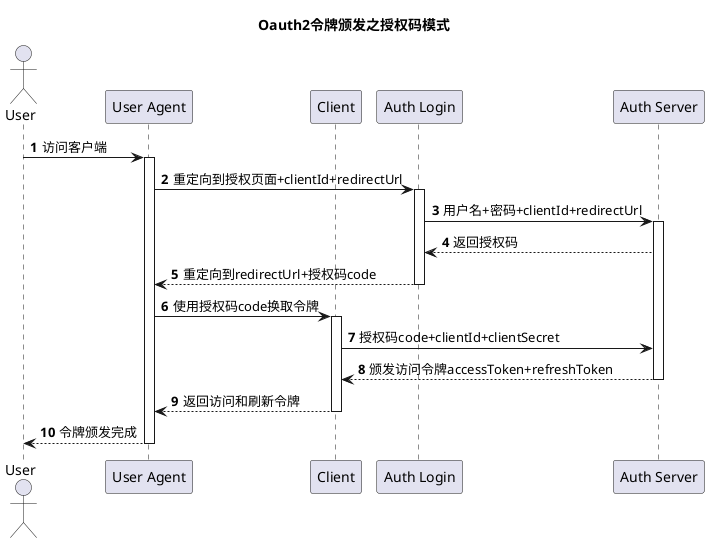

import CodeBlock from '@theme/CodeBlock';
import php from '!!raw-loader!../../data/PHP.yml';

## php.yml

<CodeBlock language="yaml">{php}</CodeBlock>


## PHP 运行原理

### 概述

3 转 1 执行：


```markdown
PHP代码 -> 转Token -> 转AST抽象语法树 -> 转Opcodes -> 执行opcodes
```

---

- *通过词法分析得到 token* Token 是 PHP 代码被切割成的有意义的标识。PHP7 一共有 137 种 Token，在 zend_language_parser.h 文件中做了定义。
- *基于语法分析器将 token 转化为`抽象语法树AST`*
  - Token 就是一个个的词块，但是单独的词块不能表达完整的语义，还需要借助一定的规则进行组织串联。所以就需要语法分析器根据语法匹配 Token，将 Token 进行串联。语法分析器串联完 Token 后的产物就是抽象语法树（AST，Abstract Syntax Tree）。
  - AST 是 PHP7 版本的新特性，之前版本的 PHP 代码的执行过程中是没有生成 AST 这一步的。它的作用主要是实现了 PHP 编译器和解释器的解耦，提升了可维护性。
- *将语法树转换为 Opcode* 需要将`AST语法树`转换成 Opcode，才能被引擎直接执行。
- *执行 Opcode* opcodes 是 opcode 的集合形式，是 PHP 执行过程中的中间代码。PHP 工程优化措施中有一个比较常见的“开启 opcache”，指的技术这里将 opcodes 进行缓存。通过省去从源码到 opcode 的阶段，引擎直接执行缓存好的 opacode，以提升性能。

### PHP 组成部分

从图上可以看出，PHP 从下到上是一个 4 层体系：

Zend（Zend 引擎，Zend API，Zend 拓展 API）

- 引擎 (Zend)+组件 (ext) 的模式降低内部耦合
- Zend 引擎：Zend 整体用纯 C 实现，是 PHP 的内核部分，它将 PHP 代码翻译（词法、语法解析等一系列编译过程）为可执行 opcode 处理，并实现相应的处理方法，实现了基本的数据结构（如 hashtable、oo）、内存分配及管理、提供了相应的 api 方法供外部调用，是一切的核心，所有的外围功能均围绕 Zend 实现。
  PHP 拓展
- Extensions：围绕着 Zend 引擎，extensions 通过组件式的方式提供各种基础服务，我们常见的各种内置函数（如 array 系列）、标准库等都是通过 extension 来实现，用户也可以根据需要实现自己的 extension 以达到功能扩展、性能优化等目的（如贴吧正在使用的 PHP 中间层、富文本解析就是 extension 的典型应用）
  sapi(隔绝 web server 和 PHP)
- *PHP 提供了很多种 SAPI，常见的提供给 Apache、Nginx、IIS6/7 的 FastCGI，单独给 IIS 的 ISAPI，以及 Shell 的 CLI*
- Sapi 全称是 Server Application Programming Interface，也就是服务端应用编程接口，Sapi 通过一系列钩子函数，使得 PHP 可以和外围交互数据，*这是 PHP 非常优雅和成功的一个设计，通过 sapi 成功的将 PHP 本身和上层应用解耦隔离，PHP 可以不再考虑如何针对不同应用进行兼容，而应用本身也可以针对自己的特点实现不同的处理方式*
  PHP 应用
- Application：这就是我们平时编写的 PHP 程序，通过不同的 sapi 方式得到各种各样的应用模式，如通过 webserver 实现 web 应用、在命令行下以脚本方式运行等等。
- 如果 PHP 是一辆车，那么车的框架就是 PHP 本身，Zend 是车的引擎（发动机），Ext 下面的各种组件就是车的轮子，Sapi 可以看做是公路，车可以跑在不同类型的公路上，而一次 PHP 程序的执行就是汽车跑在公路上。因此，我们需要：性能优异的引擎 + 合适的车轮 + 正确的跑道。

### Sapi

从图上可以看到，PHP 实现了一个典型的动态语言执行过程：*拿到一段代码后，经过词法解析、语法解析等阶段后，源程序会被翻译成一个个指令 (opcodes)，然后 ZEND 虚拟机顺次执行这些指令完成操作*。PHP 本身是用 C 实现的，因此最终调用的也都是 C 的函数，实际上，我们可以把 PHP 看做是一个 C 开发的软件。

- PHP 线程安全和非线程安全有什么区别？线程安全在执行时，会进行线程安全检查，用来防止有新要求就启动新要求，耗尽系统资源
- PHP 进程之间的通信机制
- PHP-FPM 和 Nginx
  - nginx 和 PHP-FPM 的通信机制？
  - php-fpm 和 nginx 两种通信方式的区别？
- PHP-FPM 的进程管理模式
- PHP-FPM 内存泄露问题
- 为什么 PHP-FPM 会出现内存泄漏的问题？
- 如何解决 PHP-FPM 导致内存泄露的问题？
  - 对于 PHP-FPM 多进程的模式，想要避免内存泄漏问题很简单，就是要让 PHP-CGI 在处理一定数量进程后退出即可。否则 PHP 应用或者第三方模块（如 image magick 拓展）导致的内存泄漏问题会导致内存不足
  - 在 PHP-FPM 配置文件中，将 pm.max_requests 这个参数设置小一点；（这个参数的含义是，一个 PHP-FPM 子进程最多处理 pm.max_requests 个用户请求后，就会被销毁；当一个 PHP-FPM 进程被销毁后，他将占用的所有内存都会被回收）

---

php-fpm 进程被打满了，原因还是比较复杂的

直接原因是 php-fpm 里的`max_children`和`max_requests`等配置开的太大，通过*调小*`进程数`以及`进程最大内存`，可以解决这个问题

根本原因还是“机器无法满足”

- 机器性能太低
- **PHP 实现的服务，本身`有效负载`很低**

什么是有效榨取？

*PHP 应用通过 PHP-FPM 这种 CGI 模式处理请求，每个请求都需要重新加载整个框架，重新创建 MySQL/Redis/MQ 连接池，最终导致相同 QPS 下，PHP 的 CPU 很快就被打满了，也就是说，硬件相同的情况下，性能更差。*

## PHP 基础

### PHP 的 changelog？？

#### PHP7

- *PHP7 的严格模式和类型声明*(标量类型声明，返回类型声明)
- 性能提升 (为什么 PHP7 的性能提升很大？)
  - 变量存储字节减小，减少内存占用，提升变量操作速度
  - 改善数组结构，数组元素和 hash 映射表被分配在同一块内存里，降低了内存占用，提升了 CPU 缓存命中率
  - 改进了函数的调用机制，通过优化参数传递的环节，减少了一些指令，提高执行效率
- `try...catch...`（增加多条件判断，分出了 exception 和 error 两种异常类型）php7 之后可以一次捕捉多种类型的异常和错误，通过 | 来实现
- `闭包`；支持通过 new class 类实例化一个匿名类，可以用来代替一些阅后即焚的完整类定义
- `三目运算符的？？`如果有值则取其值，否则则取 $name = $name？？ 'NoName'
- `飞船运算符`（结合比较运算符）；左边大则返回 1；左边小则返回 -1；相等则为 0
- `常量数组`，PHP7 之前只允许类或者接口使用常量数组（也就是说，PHP7 之前只能使用 const 来定义常量数组，之后 define() 这种也可以使用常量数组）
- `类常量也可以添加“权限修饰符”`
- `iterable伪类型`，iterable 类型适用于数组，生成器以及实现了 Traversable 的对象，他是 PHP 中的保留类名
- PHP7 引入了`可空类型`

#### PHP8

- `Attributes`注解

## PHP 的其他编译方式

动态编译，静态编译，即时编译

AOT 就像 C/C++ 等运行之前就编译好，而 JIT 则是运行时才进行编译，保证了可移植性的需求

- OpCode 缓存
  - 什么是 OPCode
  - OPCode 缓存和其他缓存有什么区别？
  - 怎么使用 OPCache
- JIT
- 直接解析 PHP，使用 OPcache，使用 JIT 动态编译，这三者有什么区别？
  - *正常使用 sapi 解析 PHP*：a.php->经过 zend 编译->(opcode)->PHP 解释器->(机器码)
  - *使用 opcache 解析 PHP*：a.php->查找 opcode 缓存->有的话，直接用 PHP 解释器解析（缓存好的）opcode->机器码->没有就用 zend 编译为 opcode，并且缓存
  - *使用 JIT 解析 PHP*：a.php->编译->机器码（代码不改变的情况下，都只执行机器码，不再经过 zend 引擎编译，sapi 这两步）

## PHP 规范 (PSR)

psr 有 accepted, review, draft, abandoned, deprecated 几种

我们只需要知道“已经在使用的”几种就可以了；

- psr1 和 psr2 都是编码规范
- psr3 是日志对接的统一接口
- psr4 自动加载

---

psr1, psr2（PHP 的代码规范）

- 文件名要写成大驼峰
- 换行
  - SQL 过长
  - 方法或者函数的入参大于三个（，或者 | 或者&等字符放到后面）
  - if,declare 等控制结构的参数大于三个（，或者 | 或者&等字符放到后面）
  - 链式操作超过两个
- 大小写
  - 命名空间的首字母大写；
  - 私有方法或者私有属性，最好下划线开头；private function \_privateFunc()
  - 类，trait，interface 都是大驼峰；
  - 方法和变量都是小驼峰；
  - 不管是 const 还是 define 定义的常量都是全大写；
  - 函数都是下划线连接；function snake_case(){}
- 空格
  - if 后面要有空格
  - 大括号前面要有空格
  - if 判断之后不能有空行
  - 逗号后面必须要有一个空格
  - 连续调用多个方法 (大于 3 个) 使用 foreach


psr4 自动加载

php 自动加载的演进过程？


## PHP 多线程

php 使用多线程？

- 并发发起网络请求
- curl_multi 函数组，如 curl_multi_init(), curl_multi_add_handle(), curl_multi_exec() 等函数多线程请求网络。适用场景，如多线程下载图片。
- stream_socket_client()
- 本地并发
- 简单一些的可以直接使用异步，可以考虑 popen()，fsockopen(), cURL
- 复杂一些的，可以考虑 PCNTL/pthreads 拓展
  - pcntl_fork()
  - pcntl_wait() 在进程数过多时，回收子进程
- 消息队列（本身就是起到异步的作用）。与其他方法不同，把多个请求异步处理，而不是加速一个请求
- swoole

---

为什么 php 很少使用多线程开发？

- php 的 pthreads 多线程拓展不好用
- 应用场景。php 的主要使用场景是 web，没有需要多线程才能解决的需求。（即使需要，也最好用 java/golang 来编写这部分代码），另外，多线程会引入线程安全之类的新问题，并不比单线程优越。
- pthreads 拓展的问题。
  - php-fpm 本身已经可以多进程，从而充分利用多核进行开发。所以 php 官方不希望 php-fpm 进程里使用多线程，造成 php-fpm 不稳定。
  - 不能用于 Web 服务器环境，FPM 里用不了，只能用于 CLI。
  - pthreads 需要开启 ZTS，导致肉眼可见的性能下降。
  - 无法兼容 JIT，因此 pthreads 作者宣布弃坑，7.4 之后不再维护。

### 类型声明 type hint

- 通用的
  - int
  - float
  - bool
  - string
  - interfaces
  - array
  - callable
  - iterable
  - class/interface/self 类
  - 递归类型 Traversable
- 标量类型声明 (对象，接口，数组或者 callable)
- 返回类型声明
  - void 仅用在返回值

## PHP 函数

### 数组相关函数

```mdx-code-block


<Tabs>


<TabItem value="常用数组函数">


```

- array_keys 返回数组中部分键名或者所有键名
- array_key_exists 看数组中是否有指定的键名或者索引
- array_merge 合并一个或者多个数组；array_merge_recursive 递归地合并一个或者多个数组
- array_pad 以指定长度将一个值填充进数组
- array_product 计算数组中所有值的乘积
- array_rand 从数组中随机取出一个或者多个元素
- array_replace 用数组替换第一个数组的元素；array_replace_recursive 用数组递归替换第一个数组的元素
- array_reverse 返回单元顺序相反的数组
- array_search 在数组中搜索给定的值，如果成功则返回首个相应的键名
- array_sum 对数组中所有值求和
- array_unique() 移除数组中重复的值
- array_values() 返回数组中所有的值
- array_chunk() 将一个数组分割成多个
- array_column() 返回数组中指定的一列
- array_combine() 创建一个数组，用一个数组的值作为其键名，另一个数组的值作为其键值
- array_count_values() 统计数组中所有的值
- array_fill 填充数组；array_fill_keys 用键名和键值填充数组
- array_flip 交换数组中的键名和键值
- \**array_slice 从数组中取出一段，array_splice 去掉数组中的某一部分并用其他值取代*

```mdx-code-block


</TabItem>


<TabItem value="取差集">


```

- array_diff
- array_diff_assoc, array_diff_uassoc
- array_diff_key, array_diff_ukey
- array_udiff
- array_udiff_assoc, array_udiff_uassoc

```mdx-code-block


</TabItem>


<TabItem value="取交集">


```

取出两个数组相同的部分

- array_intersect
- array_intersect_assoc, array_intersect_uassoc
- array_intersect_key, array_intersect_ukey
- array_uintersect
- array_uintersect_assoc, array_uintersect_uassoc

```mdx-code-block


</TabItem>


<TabItem value="操作指针">


```

- each()；当前元素的 kv
- current()=pos()
- reset()
- end()；当前元素和最后一个元素
- next()，prev()；下一个，上一个

```mdx-code-block


</TabItem>


<TabItem value="常用回调函数">


```

- `array_reduce()`使用回调函数迭代地将数组简化为单一的值
- `array_map()`使用自定义函数对数组中的每个元素做回调处理，自定义函数的返回值为 array*map 返回的新数组的元素；*以得到一个新数组；\_
  - *array_map 返回处理完之后的数组（最终得到一个新数组（这也是 array_map() 和 array_walk() 之间最大的区别））*
  - array_walk_recursive()...做递归回调处理
- `array_filter()`用回调函数过滤数组中的单元，自定义函数返回 true，则 array_filter 返回的数组保留该元素，否则删除该元素。
- `array_walk()`对给定的数组执行执行自定义函数，array*walk 返回 true/false，*操作结果影响原来的数组；\_
  - array_walk() 和 array_map 一样，把函数，作用于第二个参数（数组里的每一个元素）
- 使用 array_map() 等数组回调函数，比 foreach() 的优点有哪些？
  - 使用链式调用的时候，逻辑清晰，可以避免临时变量

```mdx-code-block


</TabItem>


<TabItem value="排序函数">


```

- sort()/rsort()
  - sort() 对索引数组进行升序排序
  - rsort() 对索引数组进行降序排序；
- asort() 和 arsort() 是一对
  - asort() 对关联数组按照值进行升序排序
  - arsort() 对关联数组降序；
- ksort() 和 krsort() krsort() 按照键名对关联数组进行排序，按照键进行逆向排序，为数组值保留原来的键；成功则返回 true，失败则返回 false
- usort(),uasort(),uksort() 都是用户自定义排序
- 自然排序 natsort(), natcasesort()

```mdx-code-block


</TabItem>


<TabItem value="容易混淆的数组函数">


```

array_search(), in_array(), array_key_exists() 的区别？

- in_array() 只能判断是否存在，返回 bool 值
- array_search() 两个参数，要查找的字符串，数组
- array_key_exists() 在 key 存在于数组里的石斛返回 true；key 可以是任何能作为数组索引的值
- array_key_exists() 的速度比另外两个要快很多，因为 key 是哈希取得的
  array+array 和 array_merge()？
- 键名为数字时，array_merge() 不会覆盖掉原来的值，但 + 合并数组则会把最先出现的值作为最终结果返回，而把后面的数组拥有相同键名的那些值“抛弃”掉；（不是覆盖）
- 键名字符时，+仍然把最先出现的值作为最终结果返回，而把后面的数组拥有相同键名的那些值“抛弃”掉，但是 array_merge() 此时会覆盖掉前面相同键名的值

empty(), is_null(), isset() 区别？

- isset() 判断变量是否被初始化；并不会判断变量是否为空，并且可以用来判断数组中元素是否被定义过；当使用 isset() 来判断数组元素是否被初始化时，他的效率比 array_key_exists() 高 4 倍左右
- empty() 检测变量是否为空；任何一个未初始化的变量，值为 0 或者 false 或者“”空字符串或者 null 的变量，空数组，没有任何属性的对象，都将判断为 empty==true
- is_null() 判断变量是否为 null

```mdx-code-block


</TabItem>


</Tabs>


```

### 字符串相关函数

```mdx-code-block


<Tabs>


<TabItem value="字符相关函数">


```

- strtolower 字符串变成小写
- strtoupper 变大写
- ucfirst() 把字符串中的首字符转化为大写
- lcfirst() 把字符串中的首字符转化为小写
- ucwords() 把字符串中每个单词的首字符变成大写

```mdx-code-block


</TabItem>


<TabItem value="str">


```

- strstr() 查找字符串在另一个字符串中第一次出现的位置（大小写不敏感）
- stristr() 查找字符串在另一个字符串中第一次出现的位置（大小写不敏感）
- strchr()/strstr() 查找字符串在另一个字符串中第一次出现的位置（大小写不敏感）
- strrchr() 查找字符串在另一个字符串中最后一次出现的位置

```mdx-code-block


</TabItem>


<TabItem value="pos">


```

- strpos() 第一次出现的位置（大小写敏感）
- stripos() 第一次出现的位置（大小写不敏感）
- strrpos() 查找字符串在另一个字符串中*最后一次*出现的位置（大小写敏感）
- strripos() 查找字符串在另一个字符串中最后一次出现的位置（*大小写不敏感*）

```mdx-code-block


</TabItem>


<TabItem value="replace">


```

- str_replace() 替换字符串中的一些字符（大小写敏感）
- str_ireplace() 替换字符串中的一些字符（大小写不敏感）
- substr_replace() 把字符串的一部分替换成另一个字符串，三个参数

```mdx-code-block


</TabItem>


<TabItem value="slashes">


```

- addslashes() 在预定义的字符前面加反斜杠
- addcslashes() 在指定的字符前面加反斜杠

```mdx-code-block


</TabItem>


<TabItem value="cmp">


```

- strncmp() 前 n 个字符的字符串比较（大小写敏感）
- strncasecmp() 前 n 个字符的字符串比较（大小写不敏感
- strnatcmp()...(大小写敏感)
- strnatcasecmp() 使用一种“自然排序”算法来比较两个字符串；（大小写不敏感）

```mdx-code-block


</TabItem>


<TabItem value="打印输出">


```

- vfprintf() 把格式化的字符串写到指定的输出流
- print() 输出一个或者多个字符串
- printf() 输出格式化的字符串
- sprintf() 把格式化的字符串写入一个变量中 `sprintf('%02d', $month)`
- vprintf() 输出格式化的字符串
- vsprintf() 把格式化的字符串写入变量
- fprintf() 把格式化的字符串写入到指定的输出流

```mdx-code-block


</TabItem>


</Tabs>


```

容易混淆的字符串函数

strtr() 和 str_replace() 的区别

- strtr() 性能比 str_replace() 高，但是实用性低，所以能用 strtr 的时候才用
- strtr 区分大小写，而 str_replace() 不区分大小写
- strtr 的第二个参数可以是数组

### 数字相关函数

- 有哪些常见的计算函数？
- PHP 运算时为什么会精度丢失？
  - 生活中使用十进制，但是计算机使用二进制。*所有十进制整数都可以转换成二进制整数，但是二进制中表示十进制的小数就比较麻烦了*
  - *单精度和双精度的浮点数只包括 7 位或者 15 位的有效小数位，存储需要无限位表示的小数时只能存储近似值*
- PHP 精度丢失，有哪些解决方案？
  - *任何需要十进制运算的地方，都需要用 decimal 取代 float*
  - 使用 PHP 的高精度拓展`BC Math`
- `BC Math`怎么使用？

---

- fmod() 求余
- pow()x 的 y 次方
- round() 四舍五入
- ceil() 向上取整
- floor() 向下取整
- sqrt() 平方根

### 文件相关函数

- is_file() 和 file_exists() 文件存在的情况下，is_file 更快。文件不存在的情况下，file_exits() 更快。
- filesize() 取得文件大小
- is_readable() 判断文件是否可读
- is_writable() 判断文件是否可写
- is_executable() 判断文件是否可执行
- filectime()
- filemtime()
- fileatime() 获取文件的上次访问时间
- stat() 获取文件大部分属性值

## PHP 垃圾回收

- RC 是什么？
- RC 的问题？如果多个对象互相引用，那么内存对象的计数器永远都不会变成 0，如果这些变量已经没用了，就会导致内存泄漏。
- 同步回收算法 CCRC(Concurrent Cycle RC) 把 RC 算法里的简单计数器改为了一套可以检测出对象互相引用的算法，并且加入了“根缓冲区”，当“根缓冲区”满了之后，执行一次 GC，从而将内存占用限制在一个阈值里。
- 与垃圾回收算法相关的 PHP 配置
  - 修改 php.ini 中的 zend.enable_gc 来打开或关闭 PHP 的垃圾回收机制
  - 通过调用 gc_enable() 或 gc_disable() 打开或关闭 PHP 的垃圾回收机制
  - 在 PHP5.3 中即使关闭了垃圾回收机制，PHP 仍然会记录可能根到根缓冲区，只是当根缓冲区满额时，PHP 不会自动运行垃圾回收，当然，任何时候您都可以通过手工调用 gc_collect_cycles() 函数强制执行内存回收。

### PHP 的引用计数 + 同步回收算法的具体流程？

1. 首先 PHP 会分配一个固定大小的`根缓冲区`，用于存放固定数量的 zval，当`根缓冲区`满额时，PHP 就会执行垃圾回收；具体流程如下：

2. 对每个`根缓冲区`中的`根zval`按照`深度优先遍历算法`遍历所有能遍历到的 zval，并将每个 zval 的 refcount 减 1，并将其标记为“已减” (为了避免对同一 zval 多次减 1(因为可能不同的根能遍历到同一个 zval))

3. 再次对每个缓冲区中的根 zval 深度优先遍历，如果某个 zval 的 refcount 不为 0，则对其加 1，否则保持其为 0。

4. 清空`根缓冲区`中的所有根 (注意是把这些 zval 从缓冲区中清除而不是销毁它们)，然后销毁所有 refcount 为 0 的 zval，并收回其内存。

### “同步回收”具有以下几点特性

- 并不是每次 refcount 减少时都进入回收周期，只有根缓冲区满额后才开始 GC；
- 可以解决循环引用问题。
- 可以将内存泄露保持在一个阈值以下；

### 怎么评价 rc 这种 gc 算法？（重要）

*rc 的问题在于，虽然不会 stw，但是因为设定了阈值，所以吞吐量上不去，这也是为什么不要使用 rc 的原因*，所以，还是应该好好分析*以 JVM 为代表的典型 GC 发展历程*，*从单线程到并行再到并发*，*从单一内存池到分代再到分区*，*从 CMS 到 G1 再到 ZGC*分别解决了哪些问题

### PHP 的内存管理机制（同步回收算法）

预先给出一块空间，用来存储变量，当空间不够时，再申请一块新的空间；

PHP 是会自动释放内存的，当 PHP 执行完成后，自动释放该次请求的所有内存。

php.ini 里设置的是单次请求最大允许的内存分配，

如果本次请求内存超过设置，

那么，PHP 会因为内存无法分配导致程序崩溃而结束请求；14

- 为什么 PHP 不使用 JAVA 等语言使用的分代回收算法来实现 GC？

引用计数这种 GC 有什么问题？

- *rc 的问题在于，虽然不会 stw，但是因为设定了阈值，所以吞吐量上不去*
- 应该好好分析*以 JVM 为代表的典型 GC 发展历程*，*从单线程到并行再到并发*，*从单一内存池到分代再到分区*，*从 CMS 到 G1 再到 ZGC*分别解决了哪些问题？

## PHP 的 OOP

### 变量

预定义变量

全局变量 (全局预定义变量) 在函数外部定义的变量，它的作用域从定义的地方到文件结尾

- $GLOBALS：global 全局变量，是一个包含了所有全局变量的组合数组，全局变量的名称就是该组合数组的键。
- $_GET：HTTP GET 变量，通过 URL 参数传递给当前脚本的变量的数组。
- $_POST：HTTP POST 变量，通过 HTTP POST 方式传递给当前脚本的变量的数组。
- $_COOKIE：HTTP Cookies 变量，通过 HTTP Cookies 方式传递给当前脚本的变量的数组。
- $_SESSION：session 变量，当前脚本可用的 SESSION 变量的数组。
- $_REQUEST：HTTP Request 变量，默认情况下包含了 `$_GET`，`$_POST` 和 `$_COOKIE` 的数组。
- $_FILES：HTTP 文件上传变量，通过 HTTP POST 方式上传到当前脚本的项目的数组。
- $_SERVER：服务器信息变量，包含了诸如头信息 (header)、路径 (path)、以及脚本位置 (script locations) 等信息的数组。这个数组中的项目由 Web 服务器创建。
- $_ENV：环境变量，通过环境方式传递给当前脚本的变量的数组。

---

局部变量 (局部预定义变量) 在函数内部定义的变量，它的作用域为函数定义范围内。

- `$php_errormsg`：前一个错误信息，$php_errormsg 变量包含由 PHP 生成的最新错误信息。这个变量只在错误发生的作用域内可用，并且要求 track_errors 配置项是开启的（默认是关闭的）。
- `$HTTP_RAW_POST_DATA`：包含 POST 提交的原始数据。
- `$http_response_header`：HTTP 响应头，$http_response_header 数组与 get_headers() 函数类似。当使用 HTTP 包装器时，$http_response_header 将会被 HTTP 响应头信息填充。
- `$argc`：传递给脚本的参数数目，包含当运行于命令行下时传递给当前脚本的参数的数目。脚本的文件名总是作为参数传递给当前脚本，因此 $argc 的最小值为 1，这个变量仅在 register_argc_argv 打开时可用。
- `$argv`：传递给脚本的参数数组，包含当运行于命令行下时传递给当前脚本的参数的数组。第一个参数总是当前脚本的文件名，因此 $argv[0] 就是脚本文件名，这个变量仅在 register_argc_argv 打开时可用。

---

在 PHP7 怎么在声明变量时赋值而不报错？

属性中的变量可以初始化，但是初始化的值必须是常数，这里的常数是说 PHP 脚本在编译阶段就可以得到其值，而不依赖其他函数处理才能求值。

### 常量

- PHP 魔术常量都有哪些？
- PHP 预定义常量都有哪些？
- 怎么定义常量？（const 和 define）Const 关键字在类内定义常量，define 在类外定义常量

### 修饰符

- 有哪些`访问权限修饰符`？
- final 修饰符是什么？
- 使用`静态方法`的好处？
- PHP 中静态方法和非静态方法的使用及区别？举例说明静态方法的好处？
- 为什么$this 能够访问到静态方法呢？

---

- public
- protected
- private
- final
- static

---

- final 可以修饰类，方法，属性
- final 类不可被继承，不能被重写 (被 final 修饰的类不能被继承，只能被实例化)
- final 方法不可被覆盖 (属性不能被定义为 final，只有类和方法才能被定义为 final)
- final 不能修饰抽象类和接口类

### PHP 运算符

- 三元运算符
  - 写法 1`$a = $a ？ $a : 1;`
  - 写法 2`$a = $a ？ : 1`PHP5.3 引入
  - 写法 3`$a = $a ？？ 1`PHP7 引入
  - `$padLength = $type == 'year' ？ 4 : 2;`
- 类型运算符
  - 用 instanceof 来判断一个 PHP 变量是否属于某一类 class 的实例
  - instanceof 也可用来确定一个变量是不是继承自某一父类的子类的实例
- 赋值运算符
- 逻辑运算符
  - AND 和&&的区别？
  - OR 和||的区别？
- 组合比较符 (太空船运算符) 组合比较运算符可以轻松实现两个变量的比较，当然不仅限于数值类数据的比较。

### 流程控制


```markdown

- 判断
  - if...else
  - elseif/else if
- 循环
  - while
  - do-while do...while 和 while 的区别在于保证 do 里的循环语句保证执行一次，而不是像 while 一样，先检查再执行
- for
- foreach
  - `$infos as $key => $info`
  - `$infos as $info`
  - 多维数组；循环套循环
  - 循环 + 判断
- &的应用；$data as &$key 是什么意思？
- break
- continue
- 其他
  - switch
  - `declare`
  - return
  - require
  - include
  - require_once
  - include_once
  - goto


```


### 类

#### 抽象类和接口类

- 抽象类里可以没有抽象方法吗？抽象类中可以没有抽象方法（全部都是普通方法），那么，抽象类和普通类的区别就在于：抽象类只能继承，不能实例化。
- 抽象类和接口类的区别？接口类就是一个类的领导者，指明方向，子类必须完成他指定的方向，就是要实现什么都已经规定好了。抽象类就是把相同的抽出来了，不需要必须使用，继承的时候使用 extends 继承。
- 接口类是一个特殊的抽象类
- 接口继承用 implements，抽象类继承用 extends
- 接口类不能声明变量，只能声明常量；抽象类可以声明变量。
- *接口类没有构造方法，抽象类可以有*
- 一个类可以继承多个接口类，但只能继承一个抽象类；
- 接口类的每个方法都只有声明，而没有实现；他的每个方法，实现类都必须要实现；而抽象类中只需要实现抽象方法，其他方法可以实现也可以不实现

#### Trait 可复用类

*Trait 解决了 PHP 不能多继承的问题，“看起来像 interface，但是用起来像 class 的东西”*

- 如果两个 trait 里有同名方法或者属性怎么办？
  - 使用 instanceof() 和 as 来解决
  - *instanceof() 关键字用前者取代了后者，as 关键字给被取代的方法起了一个别名*
- 怎么看待 trait？
  - trait 相比于多继承；多继承有类型分裂的问题，
  - 要评价 trait，首先需要解决以下几个问题
    - 我们为什么需要引入多重继承？
    - 引入多重继承是为了解决什么问题？
- 同时引入多重继承又带来了什么问题？

#### 预定义类

PHP 有哪些预定义类？

- Directory
- Closure 闭包类
- Exception
- Error
  - ArithmeticError
  - AssertionError
  - DivisionByZeroError
  - ParseError
  - TypeError
- Throwable

#### 预定义接口

PHP 有哪些预定义接口类？

- `Generator`生成器
- `ArrayAccess`数组式访问 ArrayAccess 这个预定义接口类的作用在于，让对象可以像数组一样可以被访问
- `JsonSerializable`序列化
- `Closure`闭包
- `Traversable`遍历（检测一个类是否可以使用 foreach 进行遍历的接口）
- `Iterator`迭代器接口（可在内部迭代自己的外部迭代器或类的接口）
  - `IteratorAggregate聚合式迭代器接口`（创建外部迭代器的接口）
  - `OuterIterator迭代器嵌套接口`（将一个或多个迭代器包裹在另一个迭代器中）
  - `RecursiveIterator递归迭代访问接口`（提供递归访问功能）
  - `SeekableIterator可索引迭代访问接口`（实现查找功能）

generator 可以以一种简单的方式实现 iterator。*generator 实现通过 yield 关键字完成，提供了一种简单的方式实现 iterator，几乎没有任何额外开销或者需要通过实现 iterator 接口的类这种复杂方式实现迭代*

玩过 node 和 python 的同学都知道 yield 这个关键字，借助 yield 的上下文运行时的切换，可以做到协程的效果，能够大大*减少内存的使用量以及效率*。比如导出和导入大量数据的时候，可以使用生成器避免内存爆出。具体看鸟哥的介绍在此，这里我们直接上代码了

当一个函数包含 yield，那么这个函数即不再是一个普通函数，它永远返回一个「Generator (生成器)」实例。生成器实现了 Iterator 接口，这就是为何它能够进行 foreach 遍历的原因。

### 闭包

- 闭包是什么？
- 为什么要用闭包？
- 实现闭包的几种方法？
  - use 方法
  - bindTo 方法

### PHP 的异常处理？

错误和异常是两码事

PHP 的异常处理


```markdown

- try-catch
- throwable php7 之后才有的 throwable

---

- exception
  - BadFunctionCallException
  - BadMethodCallException
  - DomainException
- InvalidArgumentException
- LengthException
- LogicException
- OutOfBoundsException/OutOfRangeException/RangeException
- OverflowException
- RuntimeException
- UnderflowException
- UnexpectedValueException

```


## PHP 工具

```shell
php artisan code:analyse --level=4

php artisan l5-swagger:generate

php-cs-fixer fix $PWD --config=cs.php

composer dump-autoload & php artisan optimize & php artisan cache:clear & php artisan config:clear & php artisan route:clear   & php artisan view:clear & php artisan api:cache & php artisan config:clear

```

### composer


```markdown
- **composer 自动加载原理？**(有时间自己实现一下自动加载)
  - 把 composer 包名字写到 require 里，执行 update，具体是怎么把包自动加载到 laravel 里的？能不能说一下？
- composer 的版本约束？
  - 比较操作符来约束版本
  - 使用连字符来约束版本；1.0 - 2.0
  - 通配符来约束版本；1.0.\*
  - 使用^锁定大版本 `^1.2.3相当于>=1.2.3 <2.0.0`
  - 使用~锁定小版本 `~1.2.3相当于>=1.2.3 <1.3.0`
  - dev-分支名；这样指定版本的意思是，对应分支下的最新提交
- composer 常用命令
  - 移除不需要的包：composer remove package_name
  - 展示这个项目里所有安装的包：composer show
  - 更新所有（或者单个包）的依赖关系：composer update package
  - 清除所有的 composer 缓存：composer clear-cache
  - 更新到最新版本：composer self-update
  - 检查常见的问题：composer diagnose
  - 如果 laravel 的类没有正常引入，执行 composer dump-autoload，再引入一遍
- 怎么开发 Composer 包？实战

```


---


composer.json 文件里都有什么？

- PSR-0(已过时)
- PSR-4(composer 的标准自动加载方式)
- class-map
- 直接包含 file


### PHP 常用工具

#### 代码规范工具 PHP-CS-Fixer

- 怎么安装`PHP-CS-Fixer`？使用 homebrew 安装`php-cs-fixer`，用`php-cs-fixer fix dir`直接修复
- 怎么使用 phpcs+githook+StyleCI 来保证代码规范？

#### 静态检查工具

phpstan

- 和 cs-fixer 一样，一种是作为服务，一种是作为一个 laravel 的 composer 包；建议作为服务使用，以免影响生产环境性能，当然作为包使用更方便
- larastan


其他工具比如 phplint、phpqa、grumPHP

#### 性能分析工具

*都不太靠谱，差不多能用的只有`xhprof/xhgui`，其他的仅做整理*

- 本地服务比如 z-ray、tideways+xhgui、kint、`blackfire`
- 在线服务，比如 oneapm、`new-relic`

怎么安装 xhprof 拓展并配置

1. 安装 tideways 拓展
2. 安装并部署 xhgui-branch 这个项目，作为展示 xhprof 的 web 页面
3. 在想要做性能分析的项目的 nginx 配置里，先执行 xhgui

#### PHP 有哪些代码加密的方法？

*总的来说分成`免拓展加密`和`有拓展加密`，两个的代表分别是`phpjiami`和`swoole-compiler`*

- 免拓展加密 (phpjiami)
- 有拓展加密 (swoole compiler 加密)Swoole Compiler 是 Swoole 官方推出的 PHP 代码加密和客户端授权解决方案，通过业内先进的代码加密技术（流程混淆，花指令，变量混淆，函数名混淆，虚拟机保护技术，扁平化代码，sccp 优化等）将 PHP 程序源代码编译为二进制指令，来保护您的源代码

### phpunit


```markdown

- 断言有哪几种？
- **phpunit.xml 文件说明**
- laravel 的 tests 文件夹的结构？
 - tests 的两个子目录，Feature 用来功能测试，Unit 用来单元测试；
 - 单元测试专注于小的，相互隔离的代码；
 - 而功能测试可用于测试较大区块的代码，包括若干组件之前的交互，甚至一个接口的请求；
- 单元测试的标准？
 - 100% 覆盖
 - 自动化测试
 - 变化的业务，不变的接口
 - 单元测试和集成验收测试的关系
- php 有哪些 stub 库？
 - mockery
 - `orchestral/testbench`
- 有哪些 stub？
 - 虚设替身：只传递但是不会使用到的对象，一般用于填充方法的参数列表
 - 存根替身：总是返回相同的预设响应，其中可能包括一些虚设状态
 - 伪装替身：可以取代真实版本的可用版本。举个例子，就是写一个对方接口的预期返回，用来测试。
 - 模拟替身：可以表示一系列期望值的对象，并且可以提供预设响应
- 多环境下，怎么使用对应环境的 phpunit？
- 怎么模拟认证用户？
- 文件上传怎么单测？
- 有哪些对于 phpunit 的增强方案？
 - phpunit 美化，使用`phpunit-pretty-result-printer`这个包实现对 phpunit 结果的美化。
 - 使用 semaphore 对 phpunit 持续集成
 - phpunit 测试覆盖率


```


## laravel

### 111

- laravel 里如何直接使用 db 的 json 类型？如果字段是 meta，可以直接用 meta->name 这种方法取出；读操作和写操作都可以使用
- laravel 不读某个字段？用$hidden 属性在 model 里设置隐藏字段和安全字段
- laravel 的$appends 属性怎么用？appends 属性用来临时添加某个数据库里没有的字段，实现动态修改模型，使用 getColumnAttribute() 来定义字段数据
- 同一个 model 使用不同 connections 连接不同数据库，使用事务时，即使报错也无法回滚，怎么处理？ `DB::connection('some_connection')->beginTransaction();`
- laravel 单元测试的文件上传？ `$fakeImg = UploadedFile::fake()->image('temp.jpg');`
- laravel 里多对多的写入和查询怎么做？
- laravel 里服务容器的工作原理？
- laravel 的 elq 关联关系中的 loadMissing() 和 getDirty() 方法的区别？
- laravel 里多态关系的表单验证
- laravel 怎么添加自定义校验规则？在 AppServiceProvider 里通过 Validator::extend 注册自定义规则，如果规则比较复杂，也课可以通过 make:rule 生成一个对应的自定义规则类。

---

laravel 里 model 属性的隐藏，展示和临时隐藏？

- $hidden
- $visible
- 临时隐藏：return $user->makeVisible('attribute')->toArray();

---

php 如何保留两位小数？

- `round($num,2)`
- `sprintf("%.2f",$num)`
- `number_format($num, 2)`


php 如何返回随机小数？


### Laravel 核心

- laravel 里使用了哪些设计模式？
- laravel 文件夹结构
- laravel 的工作原理？laravel 路由加载原理？

#### 路由分发

- 接收 HTTP 请求
- 由 HTTP 内核处理 HTTP 请求
- 路由分发处理（路由分发流程）
- 执行路由闭包或者控制器（运行控制器方法，补充说明）

### 服务容器

为什么要用 service-container 呢？

- laravel 的 sc 是用来`管理类的依赖`和`执行依赖注入`的工具
- 依赖注入就是，类的依赖项通过构造函数，或者某些情况下通过 setter 方法注入到类里
  - 简单绑定 bind()
  - 绑定单例 singleton() `singleton` 方法将类或接口绑定到只能解析一次的容器中。绑定的单例被解析后，相同的对象实例会在随后的调用中返回到容器中
- 绑定实例 instance() 也可以使用 instance() 方法，将现有对象实例绑定到容器中；给定的实例会始终在随后的调用中返回到容器中
- 绑定初始数据$this->app->when()->needs()->give() 当你有一个类不仅需要接受一个注入类，还需要注入一个基本值（比如整数）。你可以使用上下文绑定来轻松注入你的类需要的任何值

绑定接口到实例

- sc 有一个强大的功能，就是将接口绑定到给定实现
- 如果我们有一个 `EventPusher` 接口和一个 `RedisEventPusher` 实现。编写完接口的 `RedisEventPusher` 实现后，我们就可以在 sc 中注册它

上下文绑定

- 有时候，你可能有两个类使用了相同的接口，但你希望每个类都能注入不同的实现。
- 例如，两个控制器可能需要依赖不同的`contract契约`实现。

标记

- 有时候，你可能需要解析某个「分类」下的所有绑定。例如，你正在构建一个报表的聚合器，它接收一个包含不同 `Report` 接口实现的数组。注册了 `Report` 实现后，你可以使用 `tag` 方法为其分配标签
- 服务被标记后，你可以通过 `tagged` 方法轻松地将它们全部解析

解析

make() 方法

- 用$this->app->make() 方法把 sc 里的类实例解析出来；
- make() 的参数是，要解析的类或者接口的名称
- 如果一些类的依赖项不能通过容器去解析，可以通过将他们作为关联数组，传递到 makeWith() 方法来注入他们
  自动注入

容器事件

- 每当 sc 解析一个对象时，触发了一个事件；可以使用 resolving() 来监听这个事件
- 被解析的对象会被传递给回调函数里，让你在对象被传递出去之前，可以在对象上设置任何属性

### 服务提供器


```markdown

- laravel 为什么需要 service-provider
- register() 就是 service-provider 用来往 service-container 里注册服务的
- boot()
 - boot() 是用来启动（事件监听之类的）相关服务
 - boot() 调用的时候，sc 里所有注册的 sp 都已经加载完了，所以可以随便调用 sc 里的任何一个 sp，也可以在 boot() 方法中，类型提示依赖，sc 会自动注册所需要的依赖
- provides() 和$defer
 - defer 属性是用来延迟加载该 sp 的 register() 方法的
 - defer 和 provides() 通常搭配使用
- service-provider 的加载和执行过程


```


### Facades

- facade 是什么？
- facade 的工作原理？
- laravel 是怎么实现 facade 的？

### 队列

- 多个 laravel 同时运行时，队列互串的问题，怎么解决？
- laravel 里如何限制队列执行频率和队列长度？
- laravel 里队列，如何给不同的队列设置不同的 list？如何修改某个队列的 driver？这块还要注意 trait 属性不能通过重新定义直接重写的问题，最好在构造方法里重写
- 消息推送是否应该放到队列里？队列里应该放什么逻辑？应该放耗时任务，一些逻辑无关的业务，一些错误容忍性高的业务。比如一些使用了与逻辑无关的第三方应用（比如消息推送，一次两次的失败是可以接收的；当然，一些与逻辑有关的第三方应用应该做好容错）
- laravel 队列的 fail, retry, delay

### 怎么优化 Laravel 框架？

这不仅仅是针对 Laravel 网站的性能优化方法，其中很多是通用的网站性能优化的方法，当然还有很多可以优化的地方；


```markdown

- 使用缓存
 - 使用内存缓存作为会话的 dirvier
 - 文件缓存
 - 数据库缓存
 - Redis 缓存
- 服务端代码优化
 - 数据库请求优化（数据关联模型读取的时候，使用`延迟预加载`和`预加载`）
- 加一些服务
 - 使用 swoole
 - 使用 HHVM 这个 JIT；能轻轻松松的让你的应用程序在不用做任何修改的情况下，直接提高 50% 或者更高的性能
 - 使用 OPcaache
 - Nginx 开启 gzip 压缩
- `瓶颈`。laravel 的性能瓶颈不在于 laravel 的性能瓶颈在于数量众多的文件引用，反映到系统上就是磁盘 I/O 能力。
- `lumen？`laravel 无法无缝切换到 lumen，且切换到 lumen，性能也只是五十步笑百步。
- `hyperf`php 生态内可以考虑 hyperf，不考虑其他框架层面方案。

```


## laravel 接口

*虽然 dingo+jwt+fractal 提供的服务（比如，接口限流，fractal 提供的数据返回），laravel 现在本身都已经提供了，但是这三件套仍然是 laravel 下接口的最佳实践；*

- `dingo`用来实现接口的路由版本管理，dingo 内置的异常处理，以及最常用的 transformer；
  - transform
  - 接口的版本管理；前缀与子域名
  - 多种认证方式
  - 接口限流
  - Http Exception 处理
- `jwt-auth`用来实现用户认证
- `fractal`实际上就是 dingo 默认的 transformer 层

### JWT-Auth

常见问题


```markdown

- jwt 是什么？
 - header 说明了加密算法
 - payload 里 exp 是过期时间，sub 是 jwt 的主体，通常是用户的 id
 - sign 是由服务器进行的签名，保证 token 不被篡改
- 如果使用 jwt 作为客户端到服务端的验证？
 - 获取客户端提交的 token
 - 检测 token 中的签名 signature 是否正确
 - 判断 payload 数据中的 exp，是否已经过期
 - 根据 payload 数据中的 sub，取数据库中验证用户是否存在
 - 上述检测不正确，则抛出相应异常
- 如果 jwt 被截取了，怎么办？假设一个场景，黑客抓到了用户 a 的 jwt，使用用户 a 的 jwt 进行各种操作，怎么办？
- token 的验证流程？要看源码

```


---

实战

- 安装 jwt 以及配置
- 为什么需要刷新 token？ *因为设置有效期后，token 会失效，所以需要刷新 token*
- 怎么使用刷新 token？
- 如果刷新 token 过期了，怎么办？

---

- 如果 refresh token 过期，就需要用户重新登录了
- 当然还可以把这个机制设计得更复杂一些，比如，Refresh Token 每次使用的时候，都更新它的过期时间，直到与它的创建时间相比，已经超过了非常长的一段时间（比如三个月），这等于是在相当长一段时间内允许 Refresh Token 自动续期。
- jwt-auth 黑名单
- laravel+dingo 的第三方登录
- jwt 怎么实现多表多用户系统的隔离？

### Fractal


- fractal 的基本使用？
  - *DAS 数据的结构是统一的，无论输出集合还是单条数据，都是 data 和 meta；而 AS 在输出单条数据时，没有 data 这层；相比之下，我们的使用频率；DAS>AS>JAS*
- 怎么直接切换 fractal 提供给我们的三种数据结构？
  - 在`\App\Providers\AppServiceProvider`里的`boot()`里加这个方法
- 如何返回自定义格式的接口？
  - 在\App\Providers\AppServiceProvider::boot 里，加一个 fractal() 方法，在这里就把数据格式进行转换
  - 写一个自定义的 CustomSerializer 类，来起到自定义格式的作用
  - 修改`config/api.php`里的`errorFormat`


接口开发

## laravel 与接口

### 接口设计

- 分版本。为后面接口升级做好打算。
- 提供密钥和 token。确保数据不被篡改。
- `restful风格`。读数据用 get，修改数据用 post。
- 接口返回值格式统一结构。
- 用 JSON 格式输出，记得写好头信息。如楼上所写的。
- `接口记录日志`。记录请求参数、占用内存、响应时间、响应时长。方便后续优化。
- `提供统一的错误码`。每个数字代表一种错误，需要在文档中说明。错误分系统错误和业务逻辑错误。
- `建立接口文档`。记录每个接口的用途，参数列表，返回值说明。同时给出使用例子。

### 请求合法性

*请求合法性指的是该请求是否合法，包括该接口是否有 token，token 是否正确，以及接口的防重放攻击等*

#### 防重放攻击

##### 有哪些防重放攻击的方法？

- 验证：nonce+timestamps+sign 生成随机串来防重
- 入库：缓存层的原子性（redis 的计数器）和数据库层的唯一索引

##### nonce/timestamps/sign分别是什么？

- timestamp 发送接口的失效时间
- nonce 是随机串
- sign 是对某项数据（比如 uid）timestamp nonce 的加密串

##### 随机串防重，服务器验证流程？

- 先验证 sign 签名是否合理，证明请求参数没有被修改过
- 再验证 timestamp 是否过期，证明请求是最近 60s 内被发出的
- 最后验证 Nonce，证明这个请求不是 60s 内的重放请求

##### 如果不同时使用这三个参数，各自都有什么问题？

- 只用 timestamp，60s 内都可以重放攻击。没使用算法，很容易被破解
- 只用 nonce，存储 nonce 的集合会越来越大，验证 nonce 是否存在于这个集合的耗时会越来越长
- 用 timestamp+nonce

#### 请求数据合法性

#### 请求认证 (Authorization)(鉴权)

##### 有哪些认证方法？

- Basic Auth, JWT, OAuth 等几种不同的认证方法有什么区别？

##### OAuth 协议

###### OAuth 协议是什么？

- OAuth 是一个关于授权的开放网络标准，允许用户让第三方应用访问该用户在某一网站上存储的私密的资源，而无需将用户名和密码提供给第三方应用

###### OAuth 协议的工作原理？

- 用户（这里是指属于服务方的用户）
- 服务方（如微信、微博等）
- 第三方应用

###### OAuth2 有哪几种授权模式？

*总结一下，授权码模式和简化模式适用于大型网站，客户端模式很少被使用，主流是密码模式*

- *密码模式*(User Credentials)，适用于不同服务端的应用
- 客户端模式 (Client Credentials)，适用于不以用户为单位来进行认证的应用
- 简化模式 (Implicit)，适用于在 js 上使用
- 授权码模式 (Authorization Code)，适用于在服务端上使用



### 数据加密

- 为什么需要数据加密？使用 token 只能起到鉴权的作用
- 有哪些数据加密方法？
- 加密解密流程？
- 为什么抓包软件能看到明文的 https？（重要）


---

因为使用 https 只能保证在传输层请求不被篡改和完整性，必须要做接口做数据加密才能起到防止伪造和重放

通常使用以下方法：

- laravel 内置加密
- `phpseclib`
- openssl
- 私有协议二进制打包 (比如微信就通过这种方式进行加密，很麻烦，不多说)

但是原理都是相同的：

一种比较好的解决方案就是在客户端请求发起之前先对要请求的数据进行加密，服务端 api 接收到请求数据后再对数据进行解密处理，返回结果给客户端的时候也对要返回的数据进行加密，客户端接收到返回数据的时候再解密。


---


*https 是在 传输阶段进行加密的，但你本机用抓包软件抓 是在你数据还没进到网卡传送数据之前直接就已经被截获了，所以说 你自己抓自己的就可以 但你要抓别人的 就不可以，这是常识。*

*所以我们需要对明文数据进行加密，再进行 https 加密传输，确保数据在传输过程中和本地都是加密的；*


### 接口升级

接口分版本有两种方法


- 一种是通过`路由和前缀`，映射到不同的命名空间来实现分版本
- 另一种是通过`header里的Accept参数`写入不同版本的参数，来实现分版本

版本升级的规范：(版本升级要遵循开闭原则，这里有两种比较常见的做法，仅供参考：)


- 单机场景；一个站点兼容所有的版本，但是这种方法因为没有明确地分出版本，所以之后的代码会影响之前的代码，产生 bug
- 多机场景；不同版本部署在不同的服务器上

大版本和小版本的问题

- 对于小版本的修改，最好可以在原接口中做兼容；（比如 v1.0.1 和 v1.1.0 使用不同参数时，服务端通常应该只增不删不改（*开放封闭*，对扩展开放，对修改封闭），把参数统一返回，即可同时兼容不同的移动端版本）
- 大版本直接分文件夹。


我们要*把不同的版本做成不同的分支，比如项目开始只有 test, pre, master，但是一旦 v1 封版了，就应该把当前 master 的代码做成 v1_master 分支*（除非有什么紧急 bug，否则绝对不能修改这个分支的代码；*master 代表最新版本的生产环境代码，一旦封版，把 master 转为该分支的 master*）


## laravel-starter

Laravel 的一些坑

- 拿 Laravel 开发时，首先要把缓存关闭，否则上线之后，会出一大堆问题
- Laravel 转移文件夹到另一 PC 或者环境后访问出现 500，设置权限为 777
- 设置路由后页面总是 404 Not Found
- php+zipkin
- laravel 的 composer 包的 Logger 怎么实现？
- 单元测试，需要现在 phpunit.xml 里预定义各项配置。如果不使用默认的`.env`文件，需要通过`createApplication()`方法指定如`.env.dev`等配置文件。


---

设置路由后页面总是 404 Not Found

- 需要在 apache 配置文件里添加对 Laravel 文件夹的访问
- laravel-starter 开发中遇到的问题
- dingo 遇到路由前缀问题
  - v 里写了 API_PREFIX=api 之后，路由 url 里必须使用 api 作为前缀，否则 404。
  - 案：使用 API_DOMAIN，而不是 API_PREFIX，在`Dingo\Api\Http\Validation\Domain`里`validate()`中打印`dd($this->domain, $request->header('host'));`比较一下。
- model 层也需要分模块吗，为了解决 api 版本更迭带来 model 层复用问题
- 学到了用单元测试来测试 laravel 中间件

---

php+zipkin

- jaeger
- zipkin
- promethues

把这个项目 [Jiannei/lumen-api-starter: Lumen 8 基础上扩展出的 API 启动项目，精心设计的目录结构，规范统一的响应数据格式，Repository 模式架构的最佳实践。](https://github.com/Jiannei/lumen-api-starter) 的所有 feature 加进来

参考一下 [一份经过时间检验的 Laravel PHPUnit 测试经验分享 | Laravel China 社区](https://learnku.com/articles/44675) 这篇文章 phpunit 的用法，优化测试用例


