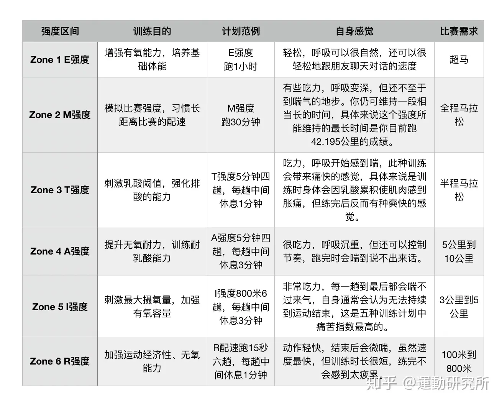

什么是跑步？（what）

这部分主要说说，这篇文章的主要群体。这篇文章主要针对想要无伤跑步的初跑者和进阶跑者。

关键字是“无伤跑步”和“进阶跑者”。很简单，跑步是为了健康，为了增强体能，但是因为跑步反而造成损伤的人太多了。其实跑步也只是我们庸常生活中的一味调味剂，用来打发时间的一种方式而已。

我觉得“无伤跑步”也是很多人的初衷和目标，但是呢，走着走着就忘了初心。看到别人破3了，甚至破230了，就忍不住想尽快也达到同样的水平。忍不住冒进，加负荷，都是很常见的事情。

很多人其实对“健康跑”的看法不同，比如说认为想要追求成绩压根就不可能“无伤跑步”，我觉得这个事情吧，其实还是看目标是多少，如果想跑进220，那“无伤跑步”确实几乎不可能，但是如果只是破3，那只要养成跑步习惯，用时间去平滑曲线，是一定能“无伤跑步”的。

跑量
如果没有职业选手那种严谨的系统训练，对于普通的进阶跑者来说，跑量就是一切。
跑步的最终指标就是配速和距离，除开日常有氧跑外，间歇跑的目的是提高配速，LSD的目的是提高距离。提升就是通过提升负荷，也即强度x距离，单纯增加距离或者强度效果都不大，跑量就是一切。
跑量不是想堆就堆的，跑量本身就是门槛，对体能和恢复能力都是挑战。（比如月跑量250对应330，月跑量350对应300）

## 跑步能力的本质？为什么每个人的跑步能力有强有弱？

***评价跑步能力有三大指标：分别是最大摄氧量、乳酸阈心率和配速、跑步经济性***

- 心肺能力(输氧能力, 用氧能力, 乳酸利用率, 脂肪利用率)
- 肌肉能力
- 调动心率能力

## 为什么跑步，而不是其他运动？

综合燃脂效率

- 成本(时间成本（相同运动时间，不同运动的热量消耗？）, 附加装备, 是否需要保养装备)
- 连贯性
- 是否安全(运动损伤)
- 运动强度
- 对抗性

## 怎么找附近的跑步路线

:::tip

***跑步路线很好找，直接绕附近的小区、公园的大圈跑就行（找找附近的大学、高档小区（别墅什么的）、公园）***

:::

可以用悦跑圈APP上的“附近路线”作为参考

唯一的要求就是

- 每圈距离稍微长（2km 左右）
- 安全（有护栏）、人尽量少（稍微远离住宅区）
- 没有红绿灯

## 跑步穿衣

- 15 度以上：短裤短袖就 ok 了（10 度到 15 度可以长袖 tee，或者短袖套长袖）
- 10 度以下：`（长袖tee+皮肤衣）+（压缩裤套短裤）+（手套）` 这套在 10 度上下 2 度，穿起来都非常舒服。（温度再往下加个马甲，其实体感没啥差别。）
- 10-15 度：根据上面的增减衣物即可，比如去掉皮肤衣，如果是 15 度左右短裤短袖也 ok

## 应该选择哪种“训练模式”呢？（极化训练(LSD+间歇跑)、速耐）

## 跑步安全相关，有哪些需要注意的？

***高温不运动(热射病)，发烧不运动，饮酒不运动(酒精代谢消耗大量水分)，运动多补水，没事多休息***

## 晨跑还是夜跑

晨跑更安全、清净（路上车少人少，没有醉鬼，能见度高），也能帮助我们早睡早起。

当然，夜跑也有自身的优点，对大部分人来说，晚上 7 点之后，本身就是休息和娱乐时间，如果用来跑步的话，相比于晨跑，更容易坚持下来。但是如果要加班的话，可能晨跑是唯一选项了。

## @心率区间//强度区间

:::tip

- Easy：有氧耐力区
- Marathon zone：有氧动力区（马配）
- Threshold：乳酸阈值区间（半马）
- Anaerobic zone：无氧耐力区间（10km）
- Interval zone：无氧动力区，最大摄氧强度（间歇训练）
- Repetition zone：爆发力训练区（400m）

:::

跑步并非一定意味着气喘吁吁，才能达到健身减肥的效果。评价运动效果的依据是你的训练是否实现了所追求的目标。对于LSD而言，其目的就是发展基础耐力，锻炼心肺，训练持久力，这样的训练没有必要让你觉得十分疲惫不堪，在跑步时可以较为舒适地聊天就是轻松跑所追求的强度，如果你跑时已经无法与人对话，说明这个强度就不是LSD了。

### LSD

LSD优点在于可以让身体里的肌肉糖原储存更多的能量，换句话说，快节奏的跑步依赖于身体里的糖原来转化为能量，而不是脂肪。只有当你以较慢的速度训练的时候，你的身体才会学会以脂肪为燃料，而不是消耗那些宝贵的糖原。这种类型的跑步也会让脂肪的消耗量更大，比变速跑等高强度的训练更利于减肥。

它的缺点是：虽然LSD比较舒服，也不那么累，但可别上瘾，训练计划中的安排需要有变化，不能每次都以LSD来要求自己，必须结合不同的方法，例如节奏跑、速度训练等方法进行。如果慢跑“慢”上瘾了，你只会变得跑得越来越慢了。

- 恢复跑就是慢跑吗？实际上是一个东西，但是恢复跑是更精准的描述（恢复跑的心率就是心率储备乘以65%，然后再加上静态心率）。
- 慢跑有什么好处？慢跑还可以让肌肉因为慢跑能在避免受伤的同时，加快肌肉纤腱慢慢适应更大的撞击力（增强肌腱和韧带的力量），还有助于毛细血管的生长，加强心肺功能（提高摄氧量），改变骨骼肌细胞（增加骨密度）。

### 节奏跑（乳酸门槛跑）

***节奏跑的重点是保持匀速，不是忽快忽慢***

- 什么是节奏跑？为啥要跑乳酸阈值跑？狭义上来说，节奏跑就相当于乳酸阈值跑（乳酸阈值跑还包括“巡航间歇跑”） 乳酸阈值跑的目的就是训练速耐能力，训练距离通常在20km左右，如果已经有大量有氧跑基础，但是配速上不去，就需要多跑节奏跑了。
- 有哪几种节奏跑？TTR、DTR和TR1000s巡航间歇跑，其实这三种没啥区别，都是TR。
- 节奏跑和间歇跑有什么区别？
- 节奏跑有什么特别的要求和训练重点？节奏跑重点是保持匀速，不是忽快忽慢；配速要求，配速在乳酸阈值上下调整；

### 间歇跑（I区）

- 间歇跑是什么？间歇训练的本质是什么？也就是“短冲”，多组I区训练，提高“最大摄氧量”。在单次训练中重复“刺激-恢复-刺激”的小循环。间歇的核心是休息，而非训练。
- 什么情况下有必要跑间歇？间歇跑是精英跑者用来突破乳酸阈值配速的有效方法，也就是吃完新手福利之后，受困于平台期无法提升，就通过间歇跑中对“跑步经济性较差的配速”进行针对训练（木桶原理） 破300之前没必要跑间歇，容易受伤，而且没有有氧基础的话，跑间歇的效果也不大。（间歇锻炼速度能力，而破3实际上并不太需要很强的速度能力）推荐用半马PB配速上下10s的节奏跑，对个人提升更大。
- 生理学角度，有哪些间歇训练？针对性训练，分别有针对“心血管系统输氧能力”、“乳酸耐受”、“乳酸重用”、“乳酸阈值”、“有氧耐力”的间歇训练。实际上就是不同配速、不同间歇训练时间和不同休息时间的组合（具体看Thibault Model）。
- 有哪些常用的间歇跑方法？亚索800和法特莱克跑分别对应定速跑和变速跑。
- 亚索800是什么？亚索800就两点要求，配速合理（以全马PB为依据，全马PB4小时，配速为4分钟/800米；全马PB3小时，配速就是3分钟/800米）+配速稳定，可以通过加减组数来保证这两点。（跑400m场地是最舒服的，默认是10组，也可以根据亚索800的成绩来预估全马成绩）
- 法特莱克跑是什么？法特莱克跑（fartlek）是一种快慢相间但没有严格规定的任意变速跑，由跑者根据自身的体力情况决定快跑段和慢跑段的距离及次数。可以这样讲，法特莱克是一种根据地形变化和个人意愿引发速度变换的跑步方式。法特莱克训练固然有其优点，但也有不足的一面，主要问题有：由于总是在变换速度，不能很好地培养跑者的速度感；跑者完全凭自我感觉来加快或减慢速度，训练随意性大，训练质量有时难以保证。
- 多久一次间歇训练比较科学？即使是精英跑者，也最多只能跑20%间歇跑（通常10%左右，否则容易造成深度疲劳甚至直接受伤）。

## @步频和步幅

:::tip
180BPM

leg stiffness 下肢刚性

送髋(腰腹发力, 弹簧效应)
:::

### 怎么训练步频？

- 优先练步频还是步幅？当然是步频（因为步频训练更简单，步幅则很难）。
- 怎么训练步频？方法很多，单独训练步频也不难（缩小步幅就完事了），难的是在保证高步幅的情况下，提高步频。总的来说，步频不行，说白了就是体能不行+没有刻意训练，体能拆开来说，核心力量是二者的基础，脚踝弹性+足底力量+心肺能力不够容易步频低，腿部力量和柔韧不行就步幅小，缺什么就做相应专项训练。至于说，听BPM180以上的歌、跟高步频跑友一起训练、加强摆臂、训练呼吸节奏（本质上还是心肺能力不足）、做速度训练对高步频形成肌肉记忆这些方法都只是临时的，或者说只能治标，无法治本。只有提高体能才能治本。（因为步频加快，脚落地时间变短，因此对相关部位力量的要求增加。在一般跑步力量训练的同时，要加强下肢力量，不断使自己脚步落地的声音越来越轻；加强脚踝力量和脚趾抓地训练，使落地一刹那稳定而有力。）
- 步频训练到什么程度才👌呢？步频190、步幅140 具体来说，步幅大了跑姿好看，但是上下起伏大，会“跳着跑”。步频高就会有滚动感。（所谓“跳着跑”就是步频小步幅大，所谓“坐着跑”就是身体没有斜前倾）最好的跑姿就是既步频高，又步幅大。练到什么程度就ok了？顶尖选手步频190步幅172（全马PB 213）步频188步幅144（全马PB 240左右）（可以看到，进阶跑者的步频差距不大，主要差距就在步幅上）

### 为什么步频180不容易受伤？
- 因为跑步经济性，能把跑步落地时的冲击力减轻到最小。如果步频越小，说明双脚腾空时间越长，这就意味着跑步时身体重心越高，落地时就加重了撞击地面的冲击力。（如果步频越高越不容易受伤，为什么不把步频加到200？因为步频太高，摆臂和迈腿也会随着增多，心率也会上升，消耗更多能量，会更疲劳。）
- 在保持180步频时，如果想增加配速，只需要练习步幅即可。
- 但是也不要迷信180步频，不同的人的理想步频都不一样，但是大概都在180上下。体能、心肺功能、呼吸节奏（职业运动员的步频通常在200到210）

### 步幅和跑姿

这里引入一个概念leg stiffness，通常翻译为“跑步机械性”（或者“下肢刚性”），***正确的跑姿是类似于弹簧一样，从跟腱到小腿、大腿、臀部，再到核心的协同发力。***

- 跑姿基本认知：跑姿是结果，而非过程。不是有了好看的跑姿，水平就上去了。而是水平上去了，跑姿自然就好看了。跑姿是跑步来的，只有大量训练，到一定配速以上，跑姿才能好看。
- 具体要领：身体前倾（背部前倾挺直），核心发力（夹住腹部），提高步频，前脚主动略向后下压，而非自由落体，向后蹬地（这就是“送髋”的具体技术拆解）。跑量到了之后，触地方式、触地时间、摆动幅度、送髋大步幅这些都会水到渠成。

有些人可能会提出疑问，不迈大步，怎么可能做到大步幅？其实，真正的大步幅是要利用腰腹髋胯向前推进，如果我们熟悉猫科动物的弹簧腰，就应该能体会到这种发力方式。所以平时，我们要多加强核心力量和腿部力量的训练。正常的跑步应该是身体保持紧张状态，核心带动大腿，大腿带动小腿，落地轻盈，即跑步的机械性很好。但是没有经过专业训练很难做到这一点，不是落地。很重，就是步幅过大。

一个结论：其实所谓的“好看的跑姿”，不就是送髋之类的大步幅吗？

## 跑前热身和跑后恢复

## 有哪些常见部位的运动损伤？怎么避免？

最常见的是脚踝疼、崴脚、膝盖、臀大肌、大腿肌肉紧张、心脏疲劳(左心室舒张功能障碍, 静息心率无法恢复正常)。

其他还有足底筋膜炎和跟腱炎。所有运动损伤都只能通过跑前热身避免，如果已经损伤，只能减跑量来恢复。不要使用NSAIDs等镇痛药物

## 其他

### 为什么在跑步时总想上厕所？

压力性尿失禁(肾上腺素飙升, 消化速度减慢, 颠簸刺激你肠胃), 懒驴上磨屎尿多

### 跑步真的能提高性能力和性欲吗？

性生活中的性欲和性能力是两码事，有氧训练可以有效增强性能力，但是过度训练会性欲减退。

## 比赛

### 怎么用半马成绩推测全马?

半马*2，再根据不同水平加上 5min~30min

### 什么水平全马能破3？

### 全马需要哪些补给？具体补给流程？

跑前 2h 吃完饭：因为马拉松比赛通常在 7:00 或者 7:30 开赛，所以要 5:00 之前起床、洗漱、吃饭。听听歌休息一会，排空。

休息至少 1h 出发

***出发后开始准备热身，需要留至少 40min 的热身时间，前 20min 慢跑，后 20min 拉伸。慢跑后吃一根胶，留下足够的能量转化时间。剩余时间存包、上赛道，挤到自己的出发区。***

15/20/25/30(目标配速 400)

